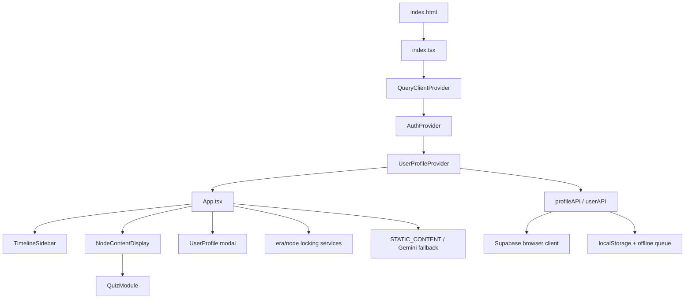

# Chronos current-state repository audit

Status: ASH-52 foundation audit, 2026-07-12. This document describes the legacy runtime at `b96ba035` and is not a target-state specification.

## Executive finding

Keep the repository, toolchain, reviewed content candidates, media candidates, authentication entry points, and migration history. Replace the runtime architecture. The current product is a single Vite/React screen driven by a 379-item era timeline, while only 50 items have static lesson content. Progress, locking, quiz completion, XP, and collectible behavior are coupled to UI state and legacy IDs. The new Supabase development project is healthy but empty, so the committed legacy migration is evidence and migration input, not an applied baseline.

## Runtime and route map

- `index.html` loads Tailwind from a CDN, remote Google fonts, an obsolete import map, and `/index.tsx`.
- `index.tsx` mounts one `App` under TanStack Query, auth, and user-profile providers.
- There is no router, route table, server runtime, API route, or URL-addressable lesson state. Auth redirects return to `/`; `AuthCallback.tsx` is not routed.
- `App.tsx` conditionally renders authentication or the entire authenticated experience. Selection and mobile detail state are memory-only and disappear on refresh.

## `App.tsx` responsibilities

`App.tsx` is a monolithic controller and view. It owns auth gating, initial resume-like selection, era and node selection, content fetching and caching, mobile master/detail behavior, loading/errors, profile modal state, era and node lock derivation, quiz completion, XP award, collectible unlock, canonical completion, next-node selection, and most shell markup. It also logs profile/progression internals extensively. These responsibilities must be separated; expanding this file would harden the legacy architecture.

## Reuse, adapt, replace

### Reusable

- React 19, TypeScript, Vite, TanStack Query, Supabase JS, Lucide, package lock, Git history, and Vercel repository continuity.
- `AuthProvider` flows for email/password, Google OAuth, sign-out, user metadata display name, and guest-mode intent, after security and route hardening.
- The concept of a query-backed profile boundary and offline-aware progress writes.
- Static lesson copy, quiz prompts, source links, entity descriptions, and images as editorial inputs after review.
- Stable legacy node IDs as migration keys where the new lesson remains semantically equivalent.
- Useful image fallback behavior and responsive `object-fit` metadata.

### Requires adaptation

- `STATIC_CONTENT` eager loading: useful for repository-authored content, but it accepts any matching export, silently uses last-write-wins on duplicate IDs, and has no build-time referential validation.
- `TimelineSidebar`: its rail interaction is a useful prototype, but era grouping, locking, mission language, styling, and direct dependency on timeline stubs must change to journey chapters and entries.
- `NodeContentDisplay`: entity/media composition is recoverable, but the component is large, tactical, and tied to the legacy `NodeContent` shape. Convert it to typed semantic module renderers.
- Auth/profile contexts: preserve behaviors, move persistence behind repositories/services, add routed callbacks, distinguish anonymous/local state from authenticated durable state, and minimize reliance on editable `user_metadata`.
- Local storage/offline queue: retain only as a versioned guest/offline adapter with idempotency keys and explicit reconciliation.
- Legacy quizzes: preserve as question-bank source material; convert to stable prompt IDs and sincere-attempt completion rules.

### Replace

- `App.tsx` as application controller and the route-less single-screen architecture.
- `ERAS` plus `INITIAL_NODES` as the learner-facing master model.
- UI-coupled sequential era/node locking and perfect-quiz gate.
- XP, levels, rarity, stats, tactical mission copy, and index-based collectible references.
- In-memory content cache and optional Gemini generation as a production lesson-loading path.
- Direct browser-table access as the place where domain rules are enforced.
- CDN Tailwind/runtime configuration and import-map dependencies; use a pinned build pipeline.

## Content and image inventory

| Inventory | Finding |
| --- | --- |
| Timeline stubs | 379 across 10 era buckets; most are titles only. |
| Static lessons | 50 records in 14 TypeScript files: 1 Prelude, 43 Foundations, 6 Classical. |
| Static coverage | 13.2% of timeline stubs (50/379). A visible node is not evidence of a migratable lesson. |
| Sources/resources | 144 HTTP(S) links embedded as learner resources. They are not normalized sources and lack review, license, claim, and access-date metadata. |
| Image references | 200 hero/entity/place/invention references covering 189 unique paths; 167 unique paths are missing from `public`. |
| Checked-in media | 23 raster files, about 39.1 MB. Five lesson heroes are ~3 MB each; several root images are 2.7–9.9 MB. |
| Uruk media | `public/images/places/uruk.jpg` exists. The Uruk lesson has no dedicated hero and references missing people/place assets. |
| Design references | Product reference PNGs under `docs/design/references/` are design inputs, never runtime UI assets. |

All historical copy and imagery is a candidate, not an approved asset. Before publication it needs claim/source review, rights and attribution review, depiction mode, alt text, responsive derivatives, and an explicit decision on whether it is evidence or reconstruction.

## Quiz, XP, levels, locks, and cards

- A quiz presents multiple-choice questions and requires every answer to be correct before completion.
- Completion awards a fixed XP amount, calls `completeNode`, and can unlock collectible references.
- Level is derived from XP; profile UI presents level, XP, and collectible rarity.
- Cards are derived from completed nodes and point to `people`, `inventions`, or `places` by array index. Content edits can silently change card identity.
- `HistoricalPerson.stats` and card rarity encode the game-like model that the PRD rejects.
- Eras unlock after all prior-era nodes complete; nodes unlock sequentially. The UI owns and recalculates these rules.
- Guest progression uses local storage; authenticated progression is split among profile APIs, React Query, and local migration/offline code.

No XP, level, rarity, stats, index reference, or perfect-score gate should be migrated into the canonical model. Completed node IDs remain valuable as migration evidence.

## Authentication, profile, and persistence

The browser client uses `VITE_SUPABASE_URL` and `VITE_SUPABASE_ANON_KEY`. It supports email/password and Google OAuth. Guest state is a local boolean. Names are stored in editable auth user metadata and mirrored into `user_profiles` by a trigger.

The repository has one migration, `20260506000000_auth_progress.sql`, defining `user_profiles`, `user_progress`, and `completed_nodes`, with RLS. Recoverable assumptions are:

- authenticated identity is `auth.users.id`;
- one profile and one legacy aggregate progress row exist per user;
- completed legacy nodes are unique by `(user_id, node_id)` and may have score/attempt metadata;
- user preferences may exist as JSON;
- deletion of an auth user cascades learner rows.

Risks in that migration include a public `SECURITY DEFINER` signup function without an explicit `search_path` or execute revocation, update policies without explicit `WITH CHECK`, no migration for legacy card ownership, and no transactional command that combines completion and reward. The SQL files `SUPABASE_FIX.sql` and setup notes outside `supabase/migrations` indicate dashboard/manual drift risk and are not authoritative migration history.

Read-only inspection of project `fghjnypxhnnutgsaqvvz` confirmed: Chronos, `ca-central-1`, PostgreSQL 17.6, active/healthy, no public tables, and no applied migrations on 2026-07-12. Do not apply the legacy migration unchanged. Establish the target schema through new committed migrations and rehearse legacy import separately.

## Build, deployment, and quality gaps

- `package.json` only defines `dev`, `build`, and `preview`; there are no lint, test, typecheck, content-validation, or end-to-end scripts.
- `tsconfig.json` is permissive (`allowJs`, no explicit `strict`) and type checking is only incidental to Vite transforms.
- No test files, CI workflow, Storybook, error monitoring, analytics contract, or accessibility automation exist.
- No committed `vercel.json` exists. Deployment relies on Vercel's Vite detection and environment configuration outside the repository.
- The build injects `GEMINI_API_KEY` into browser code via `define`; any configured key would be public. Remove this path before production use.
- Tailwind is loaded at runtime from a CDN, so builds are not fully pinned or self-contained.
- The production build succeeds, but reports an approximately 1 MB JavaScript chunk and an empty Tailwind content configuration. Direct `tsc --noEmit` fails on missing `getImageFitClass`, invalid `Religious` person categories, and many resources with `searchQuery` but no required `url`.
- Installing the locked dependencies reports six known audit findings (one low, one moderate, four high). Dependency/security remediation belongs in a focused follow-up, not this documentation-only branch.

## Migration and data-loss risks

| Risk | Consequence | Required control |
| --- | --- | --- |
| Legacy ID reused for changed semantics | False completion transfers | Mapping ledger with semantic-equivalence review and versioned aliases. |
| 329 title-only stubs treated as lessons | Empty or fabricated migration | Migrate static content only; classify stubs as inventory/research leads. |
| Array-index card references | Wrong card granted after edits | Resolve to stable entity/card IDs through a reviewed fixture. |
| XP/level used as progress proxy | Incorrect completion state | Import only explicit `completed_nodes`; retain XP only in a quarantined audit field if needed. |
| Manual Supabase SQL drift | Hosted state cannot be reproduced | Inventory source environments, dump read-only metadata, and make committed migrations authoritative. |
| Guest/local queue overlap | Duplicate or lost writes | Versioned import, idempotency keys, reconciliation report, and user confirmation on conflicts. |
| Missing media files or unknown licenses | Broken pages or rights exposure | Asset manifest, checksum, source/license, depiction mode, and publication gate. |
| Quiz gate semantics change | Learners lose valid completion | Preserve canonical completion when semantic lesson equivalence is approved; store old attempts as legacy evidence. |

## Proposed migration classification for the 50 static lessons

Classification applies to editorial substance, not code shape. Every retained lesson still needs the canonical schema, stable sections, sources, provenance, and historical review.

| Classification | Legacy lesson IDs | Rationale |
| --- | --- | --- |
| Keep mostly intact | `uruk`, `sumer_writing`, `otzi`, `uluburun`, `ur_standard` | Strong bounded subjects and substantial reusable narrative/evidence material; restructure and source-check without changing the central teaching claim. |
| Adapt | `neolithic_revolution`, `animal_domestication`, `wheel_legacy`, `gilgamesh`, `sargon`, `hammurabi`, `assyrian_trade`, `hieroglyphs`, `narmer`, `imhotep`, `hatshepsut`, `akhenaten`, `tut`, `indus_cities`, `indus_script`, `shang`, `oracle_bones`, `proto_elamite_susa`, `hittites`, `kadesh`, `phoenicians`, `cycladic_culture`, `minoans`, `mycenaeans`, `caral_norte_chico`, `kerma`, `bantu_migration`, `olmec`, `chavin`, `olympics`, `homer`, `marathon`, `rome_founded`, `cyrus` | Recoverable core, but needs narrower claims, semantic modules, journey framing, modern terminology, evidence labels, or audience editing. |
| Merge/reframe | `bronze_age_begins`, `bronze_spreads`, `iron_age_begins`, `sea_peoples`, `trojan_war` | Broad transformations work better as synthesis/connection modules, investigation framing, or one canonical lesson plus journey-specific entries. |
| Research again | `younger_dryas_reset`, `pyramids`, `abraham`, `david`, `zoroastrianism` | High uncertainty, tradition/evidence entanglement, disputed chronology, or claims likely to mislead without a new research brief. Preserve copy only as research notes. |
| Archive | `wheel` | It is a duplicate/older treatment of the stronger `wheel_legacy` record. Preserve it as migration evidence until the canonical mapping and media disposition are documented. |

The classifications deliberately avoid mass deletion. Final disposition requires content review; archive is a lifecycle state, not file removal.
