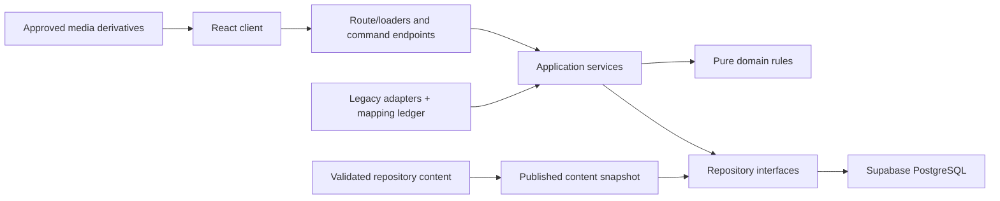

# Chronos target architecture

Status: proposed architecture for ASH-52. It establishes boundaries and the migration seam; it does not implement the rebuild.

## Architectural goals

- One responsive Learn shell renders every authored journey.
- Canonical lessons exist once; journey entries provide authored context and order.
- Domain rules are independent of React, HTTP handlers, Supabase, and content-file layout.
- PostgreSQL/Supabase is the durable learner-progress system of record.
- Repository-authored content is validated before it reaches rendering or persistence.
- Completion and deterministic card discovery are idempotent, transactional, and recoverable.
- Evidence, reconstruction, interpretation, uncertainty, and later tradition are explicit data.

## Bounded modules and ownership

| Module | Owns | Does not own |
| --- | --- | --- |
| `identity` | session resolution, learner identity, guest-to-account handoff, profile preferences | lesson completion rules |
| `curriculum` | canonical Lesson, typed modules, historical dates, claims, entities, sources, visual assets | journey order or user state |
| `journeys` | Journey, Chapter, JourneyEntry, requirement level, framing, prerequisites, next-entry derivation | canonical lesson copy |
| `progress` | lesson start/section exploration/check/completion commands, active journey location, derived journey progress | XP, levels, UI animation |
| `cards` | KnowledgeCard, unlock configuration, unique ownership, reveal result, card detail connections | random drops, duplicates, rarity |
| `content-ingestion` | parse, validate, resolve references, publish snapshots, migration fixtures | learner requests |
| `media` | asset identity, provenance, license, depiction mode, derivatives, review state | baked-in educational text |
| `learning-shell` | responsive route composition, rail/drawer, typed lesson module rendering | persistence or sequencing rules |

## Server, client, and persistence boundaries



The client owns transient interaction state, optimistic presentation, current viewport behavior, and a local explored-section hint. It never decides canonical completion, unlocks, prerequisites, or ownership. Server/application services authorize commands and return learner-safe projections. Repository interfaces isolate Supabase queries from domain rules. The database owns durable identities, uniqueness, foreign keys, command idempotency, and transaction boundaries.

For the first slice, a Vite SPA may call Supabase through narrowly typed repository adapters if no trusted server runtime exists yet, but this is a temporary seam: RLS must enforce ownership and all domain command behavior must remain in testable services, not components. Before public beta, completion plus card acquisition should run through a trusted transactional boundary (database function or server endpoint) with explicit authorization and tests.

## Core ownership rules

### Journey

A Journey is an authored path, not a query or tag filter. `journeys` owns its kind, promise, opening question, chapters, publication state, and ordered entries. Journey progress is derived from required entries and global lesson completion; it is not stored as a mutable percentage.

### Lesson

`curriculum` owns the canonical Lesson identity, chronology, significance, claims, sources, entities, semantic sections, and typed modules. Stable section IDs support explored-section tracking and anchor navigation. Reopening a lesson always starts at the top. Journey-specific introductions, transitions, title overrides, and significance live on JourneyEntry.

### Knowledge Card

`cards` owns a deterministic memory object with a stable ID, referenced entity/concept, class, facts, connections, sources, image provenance, and depiction mode. A configured learning moment may unlock a card. Ownership is unique by learner and card; repeated commands return an already-owned result without a reveal.

### Progress

`progress` owns canonical lesson status, latest meaningful section, prompt attempts, explicit completion, active journey/lesson, and timestamps. A sincere attempt at required prompts plus an explicit completion command is the normal gate. Local scroll position is never the durable completion source.

## Proposed source layout

```text
src/
  app/
    routes/
    providers/
    shell/
  domains/
    identity/
    curriculum/
    journeys/
    progress/
    cards/
    media/
  application/
    commands/
    queries/
    services/
  infrastructure/
    supabase/
    content/
    local-progress/
  ui/
    primitives/
    learn/
    modules/
content/
  lessons/
  journeys/
  cards/
  entities/
  sources/
  media/
scripts/
  content/
  migration/
supabase/
  migrations/
  tests/
tests/
  fixtures/
  integration/
  e2e/
legacy/
  adapters/
  mappings/
```

Folder names may change when routing/runtime choices are implemented, but dependencies must point inward: UI and infrastructure depend on application/domain contracts, never the reverse.

## Content and persistence model

Authoring records should be typed, schema-validated repository files during the initial slice. The ingestion layer produces a resolved, immutable learner-facing snapshot. This keeps reviews and diffs in Git without forcing UI components to import raw files. Publication can later target database tables or versioned bundles without changing domain APIs.

Learner data belongs in PostgreSQL: profile/preferences, journey locations, lesson progress, explored sections, prompt attempts, idempotency commands, and card ownership. Content IDs stored with progress must reference immutable canonical IDs or a versioned alias table. Editorial content and learner data have separate lifecycles.

## Initial persistence constraints

- unique lesson slug and canonical ID;
- unique `(journey_id, position)` and `(journey_id, lesson_id, context_variant)` as authored;
- unique `(learner_id, lesson_id)` progress;
- unique `(learner_id, card_id)` ownership;
- stable unique `(lesson_id, section_id)` explored-section identity;
- idempotency key on completion commands;
- RLS on every exposed learner table with ownership checks in `USING` and `WITH CHECK`;
- no authorization based on editable `user_metadata`;
- private or tightly revoked privileged functions with fixed `search_path`;
- all schema changes committed as migrations and verified on empty plus representative legacy fixtures.

## Migration seam

The legacy runtime remains buildable while the new modules are introduced alongside it. A compatibility layer reads legacy content into explicit migration DTOs; it never becomes the new domain model.

1. Freeze a legacy baseline commit/tag and inventory content/assets.
2. Create a mapping ledger: legacy node ID -> canonical lesson ID -> disposition -> semantic-equivalence decision.
3. Convert Uruk through an adapter into validated target fixtures.
4. Implement the new route/shell behind a development-only entry or feature flag.
5. Rehearse user-progress import against anonymized fixtures and produce reconciliation reports.
6. Switch the application entry only after the vertical slice satisfies its acceptance criteria.
7. Migrate additional content by classification.
8. Delete legacy runtime code only when migrated-content parity, learner-data reconciliation, rollback, and asset disposition are verified.

Legacy ID aliases are migration metadata, not permanent permission to preserve bad semantics. When a legacy lesson splits or materially changes, old completion must be reviewed rather than automatically copied.

## Verification boundaries

- Domain unit tests: chronology, entry ordering, sincere-attempt gate, completion idempotency, global completion, card uniqueness.
- Content validation: IDs, references, sources, licenses, section IDs, depiction labels, journey reachability.
- Repository/integration tests: RLS ownership, retries, completion plus card transaction, guest migration reconciliation.
- UI tests: typed module rendering, keyboard/focus, reduced motion, responsive rail/drawer.
- End-to-end: open Uruk at the top with prior exploration state intact, attempt check, explicitly complete, reveal once, revisit without duplicate.

## Decisions still open

No new approval is required to proceed with the Uruk slice: controlled in-place replacement and repository-authored validated content are consistent with the PRD and ASH-52. Before implementation reaches the persistence boundary, the team should approve one architectural choice: the trusted command runtime for transactional progress/card writes (Supabase database functions versus a server/API layer). That choice affects deployment, security review, and test strategy but does not block this documentation PR.
