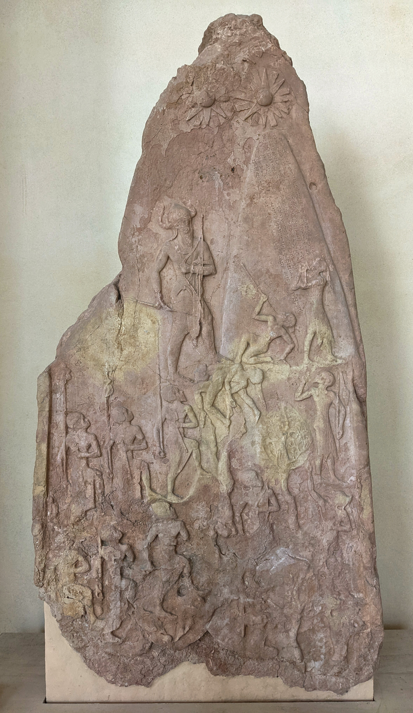
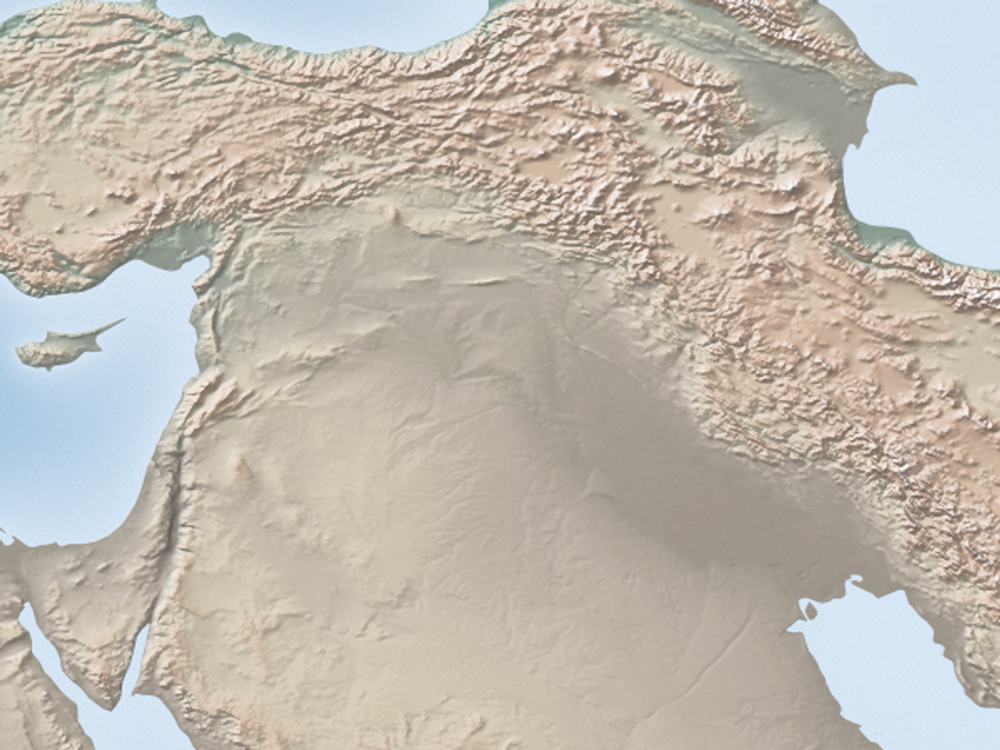
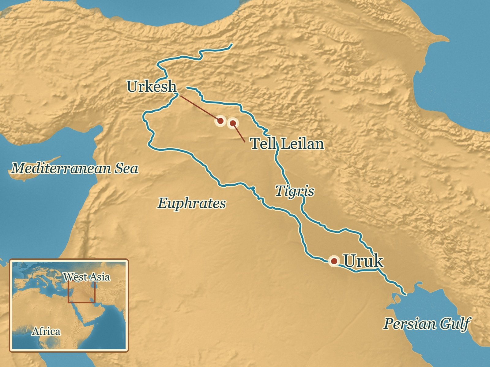
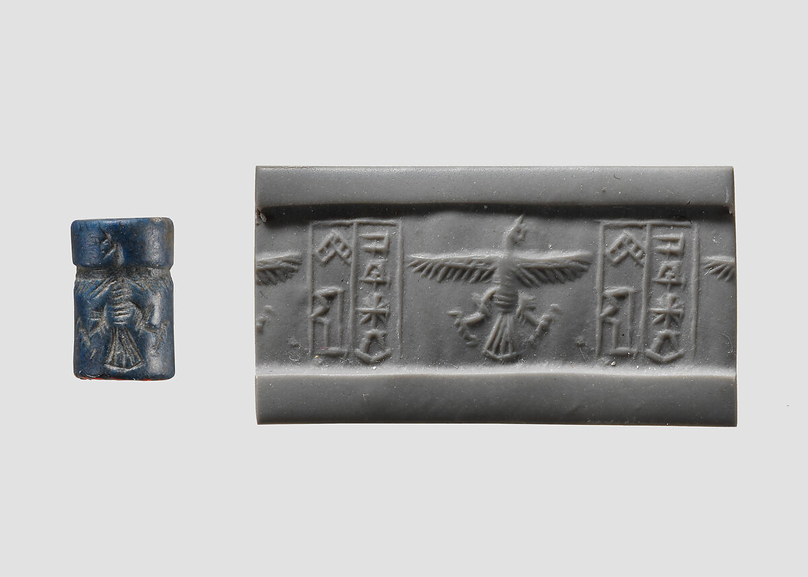

# Akkad and the Problem of Empire — research-direction record

## Owner decision card

**Recommended focus:** How Akkadian rulers won cities and tried to keep power across them.

Reply **`all yes`** or mark any row **`change: ...`** or **`no`**. These are proposed beats, not final sections or image commitments.

| # | What the lesson would do | Visual that might help |
| --- | --- | --- |
| 1 | **Conquest:** rulers claimed victories beyond one city; set up the difference between winning and governing. | Simple regional locator. |
| 2 | **Holding power:** show officials, supplies and local ties, with different arrangements at Leilan and Urkesh. | Site evidence or a clear relationship diagram. |
| 3 | **Royal image:** inspect how a ruler projected authority, then ask what that image cannot prove. | Naram-Sin's surviving stele. |
| 4 | **People beyond the ruler:** include a named non-ruler if her evidence clarifies how power worked. | Enheduanna disk or Urkesh sealings, if useful and permitted. |
| 5 | **Limits and ending:** show uneven regional change, without claiming one drought ended rule everywhere. | Small place-by-place comparison. |

Leave out a ruler list, exact empire border or capital dot, literal Sargon birth story and single-cause collapse. Detailed reasoning and sources follow for optional review.

## Optional detail and evidence

Issue: [ASH-102](https://linear.app/ashs-workshop/issue/ASH-102/research-and-publish-akkad-and-the-problem-of-empire)
Lesson ID: `lesson.mesopotamia.akkadian-empire`
Production record version: 2
Branch: `codex/ash-102-akkad-and-empire`
Base: `origin/main` at `f6f37d2c0dd76a7b81861cfad5f49f2821c12391`
Started: 2026-09-22
Queue status: Review
Accountable product/editorial reviewer: Carlin Aylsworth
Validation tier: high-risk historical interpretation (imperial violence, extent of control, royal claims, contested chronology and collapse)

### Expanded direction rationale — provisional

**Recommended direction:** For learners around 12–13, make empire a practical historical problem: Akkadian rulers could win cities, but maintaining power across different communities required people, resources and local relationships. The surviving evidence lets us examine some of those efforts without pretending control was uniform.

| Provisional teaching beat | General learner message and purpose | Possible visual job | Material uncertainty / risk |
| --- | --- | --- | --- |
| What changed | Sargon and his successors claimed victories beyond one city. Open with the difference between winning and governing, so “empire” names a problem rather than a trophy. | A restrained regional locator could orient learners to southern Mesopotamia and the places discussed, without a precise capital dot or solid empire border. | Royal texts are claims; exact reach and the location of Akkade remain uncertain. |
| How power traveled | Officials, provisioning and ties with local elites show ways rule might last after a campaign. Two regional cases can reveal different arrangements. | Let learners inspect or compare context-rich evidence from Leilan and Urkesh if suitable rights and legible images are available; a simple relationship diagram may serve better than an invented scene. | Presence, alliance and direct provincial rule are different inferences; do not flatten them. |
| How rulers wanted power seen | A royal monument can show the scale and hierarchy rulers projected while learners ask what an image cannot tell them about actual rule. | Naram-Sin's surviving stele is a strong candidate for close looking, subject to image rights and careful captioning. | Its original text is damaged, and the stone's later removal/re-inscription must remain distinct from its first use. |
| Where power met limits | Regions did not share one clearly documented ending. A concise finish can connect imperial reach to political change and possible environmental stress without a single-cause collapse story. | A place-based comparison of regional evidence could show uneven change if the dates and data support it; avoid a dramatic one-arrow collapse graphic. | Northern aridity evidence and continuity at other sites do not yield one empire-wide cause. |

**Leave out or defer:** a ruler-by-ruler sequence, a literal Sargon birth story, a precise capital location or continuous border, detailed Enheduanna authorship, and a definitive drought explanation. A named non-king actor may enter the core only if the evidence clarifies the central question rather than adding a disconnected biography.

**Consequential owner judgment:** Does the practical “winning versus holding power” direction fit the audience and the World Spine? Is a particular regional or non-king perspective essential to this lesson's core? Source-by-source disputes and final visual methods remain editorial work after this direction is considered. **Decision status:** approved by Carlin on 2026-09-22 (“love it. hopefully some art form there if available”). The detailed evidence and challenges follow below.

## Work boundary and selection

Kerma, production order 90, is Complete: its PR merged and the queue records publication and the verified four-image lesson. No other lesson row is active. Akkad is the first eligible Ready row, production order 100 and World History position 18. Its production dependency, the merged and verified Early Writing Systems lesson, is satisfied. The existing ASH-102 issue is reused. This work takes place in a fresh worktree from current remote main and preserves other checkouts.

The target is one required lesson spanning a rounded c. 2350–2150 BCE, after Kerma and before Bronze Age Exchange Networks in the approved World History sequence. The existing roster alias `sargon` remains a candidate mapping for implementation review. The lesson introduces empire as a recurring way of ruling across communities, while examining conquest, administration, claims of authority and the limits of control. It is not a full history of every Mesopotamian dynasty or a triumphant “first empire” page. The claims, blueprint, prose, prompts and media intentions below were selected after the Stage 3B owner response.

## Node proposal

- **Why a distinct node:** earlier lessons establish cities, writing and neighboring kingdoms; Akkad raises the new problem of how a ruler could take power over multiple cities and try to hold it across distance.
- **Working essential question for research, not yet approved:** How could Akkadian rulers extend power over other cities, and what limited that power?
- **Potential durable understanding to test:** conquest, local officials, supplies and royal stories may each have helped rulers extend authority, but their reach and durability require separate evidence. This is a research target, not a settled learner sentence.
- **Provisional supporting understandings to test:** (1) the dynasty's rulers claimed victories over several cities, while each claimed reach needs a place-specific check; (2) officials, provisioning and ties to local elites offered different ways to hold power; (3) monuments and inscriptions show how rulers wanted authority to be seen, alongside evidence about what institutions actually did; (4) local experiences and the end of Akkadian rule varied by region, and ordinary people's records survive unevenly. These are research questions in sentence form, not selected learner claims.
- **Prerequisite to retrieve:** the earlier writing lesson's distinction between a recorded claim and the social practice it describes; Uruk's city-scale organization; Kerma's distinction between contact and rule.
- **Neighbors:** Kerma precedes Akkad in the authored spine; Bronze Age Exchange Networks follows. Overlapping historical dates do not turn these societies into a relay.
- **Candidate misconceptions to investigate:** Akkad was the unquestioned first empire; one victory meant uniform direct control; royal monuments transparently report ordinary people's experience; an imperial network ended everywhere for one reason at one moment.
- **Evidence encounter to investigate:** a contemporary royal image or inscription read alongside administrative or excavated evidence, with provenance and genre clearly distinguished. No object or quotation is selected yet.
- **Non-goals:** a list of every Akkadian king, exact unsurveyed borders, a narrated conquest battle, a conclusive location for the unlocated capital, or a single-factor collapse claim.
- **Age and representation check:** conquest scenes and descriptions of defeated people may require careful framing for the intended learners; the lesson should not invite identification only with a victorious ruler. Decide the appropriate level of detail after the owner reviews the research direction.

## Research questions and search plan

| Question | Evidence to locate | Competing or limiting possibility |
| --- | --- | --- |
| What establishes the dynasty's sequence and rounded date frame? | Contemporary year names, inscriptions, tablets, archaeological phases and current chronological synthesis | Later king lists and modern absolute chronologies may differ; do not mask uncertainty behind one exact date. |
| What places and people are documented as conquered, connected, administered or contested? | Place-specific royal records, administrative tablets, seals, excavation and archaeological distribution | A victory claim or shared style need not establish a stable province or identical local experience. |
| What forms of ruling can be shown beyond force? | Officials, storage/distribution records, labor, correspondence, ritual or royal display where securely attributed | Survival favors elite institutions and archives; local negotiation may be poorly preserved. |
| What did the rulers say about themselves, and what can those texts establish? | Contemporary texts and monuments versus later Sargon traditions, with date, findspot and transmission chain | Royal representation and later memory are not direct neutral reports of events. |
| How and why did Akkadian rule change or end? | Regional sequences, dated contexts, environment proxies, political records and post-Akkadian evidence | Drought, conflict, reorganization and regional unevenness may not align into one universal cause or moment. |
| Whose experiences are missing or reconstructed indirectly? | Domestic archaeology, regional publications, labor/gender evidence and non-royal records | A capital-centered story can hide subjects, rivals and regional continuities. |
| Who gained from or paid for imperial reach, and how would we know? | Royal distribution claims, local archives, sealings, settlement and food evidence | Elite provision does not describe the experience of workers, soldiers or conquered communities; costs and benefits may differ by place. |

Search recent work across Assyriology, archaeology, paleoclimate/environmental archaeology, dating, material studies, comparative empire analysis and museum provenance. Follow published citations back to actual tablets, objects, strata, measurements or data and forward to methodological criticism. Include primary and institutional catalogs, scholarly editions, field reports, accessible datasets, theses/preprints and serious independent proposals. Record exact access limits and avoid treating repeated summaries of one source as independent corroboration.

## Source ledger

The source IDs below are research handles; registered lesson sources use `source.akkad.*` IDs. Sol performed the bounded retrieval; the accountable main agent assessed the reported evidence and instructional consequences on September 22. Local rollout metadata for the delegated session (`01a0cad1-5811-7f92-96f6-ff9f911e6da6`) identifies `gpt-5.6-sol`; no cost measurement is claimed. “Open” describes the inspected page/PDF, not permission to redistribute an image. Any final asset needs its own rights review after prototype approval.

| Research ID / source | Role and exact inspected location | Contribution and limit | Access / rights |
| --- | --- | --- | --- |
| `source.akkad.met-period` — [Met, The Akkadian Period](https://www.metmuseum.org/toah/hd/akka/hd_akka.htm) | Context; period and southern Mesopotamian setting | Supports a rounded c. 2350–2150 BCE teaching frame. Its “world’s first empire” and maximal territorial language is not adopted as a settled learner claim. | Open essay; images separate. |
| `source.akkad.sargon-inscription` — [CDLI/RIME composite P461926](https://cdli.earth/artifacts/461926) | Central; translated lines 59–116, 193–218 | Sargon claims Uruk's defeat, Lugalzagesi's capture, Upper-to-Lower-Sea dominion and Agade citizens exercising governorships. These are a ruler's assertions in a scholarly composite; no intact original image, findspot or single witness was provided. The words cannot themselves map continuous effective control. | Open text; image reuse not established. |
| `akkad.cdli-sargon-retinue` — [CDLI/RIME composite P461937](https://cdli.earth/artifacts/461937) | Central; translated lines 60–133, 163–250 | Claims repeated battles, broken walls, distant boats and 5,400 people fed daily before the ruler. Concrete conquest, connection and provisioning language, but still royal representation reconstructed as a composite rather than a census or original find-context record. | Open text; image reuse not established. |
| `source.akkad.louvre-stele` — [Louvre, Victory Stele of Naram-Sin, SB 4](https://collections.louvre.fr/en/ark:/53355/cl010123450) | Central material object; collection description, provenance, inscriptions and image | Surviving stone monument visually scales the ruler above soldiers and defeated Lullubi. Made at Sippar; found at Susa. Much original inscription is lost; a later Elamite inscription records its removal. Strong candidate to examine royal display and object afterlife, not a neutral account of a campaign or its original viewing setting. | Open record/image; redistribution rights not yet assessed. |
| `source.akkad.stele-photo` — [Shonagon photograph of SB 4](https://commons.wikimedia.org/wiki/File:St%C3%A8le_de_Naram-Sin_-_Mus%C3%A9e_du_Louvre_Antiquit%C3%A9s_orientales_SB_4_;_AS_6065.jpg) | Stage 15 media; complete object photograph | Shows the surviving relief for close looking, while the Louvre record anchors object identity and history. | CC0 1.0; faithful resize approved for unpublished use. |
| `source.akkad.met-seal-example` — [Met cylinder seal 1999.325.9](https://www.metmuseum.org/art/collection/search/327605) | Stage 15 comparative material; object photo and modern impression | Explains the physical difference between cylinder and clay impression. It is a different Akkadian-period object, with no Urkesh provenance or Tar’am-Agade name. | Met Open Access Public Domain; unchanged photo approved for unpublished use. |
| `akkad.penn-enheduanna` — [Penn Museum, Enheduanna disk B16665](https://www.penn.museum/collections/object/293415); [Morgan exhibition transcription](https://www.themorgan.org/exhibitions/online/she-who-wrote/disk-enheduanna) | Central material alternative; object description, excavation location and reverse inscription | Found at Ur's Gipar/Ningal complex; its inscription identifies a priestess and Sargon's daughter. Direct evidence for a named elite woman in a dynastic religious office, not direct evidence of Sargon's policy motive, local reception or her authorship of every later-attributed hymn. | Open Penn record and object images; reuse not yet assessed. |
| `source.akkad.leilan` — [Yale Tell Leilan, Akkadian palace](https://leilan.yale.edu/about-project/excavations/acropolis-northwest-akkadian-palace) | Qualifying central regional evidence; project account of four construction phases and an early schoolroom | Archaeological installation interpreted as imperial presence and training in script/administration; the project itself says the schoolroom *perhaps* served local officials. One site does not prove uniform rule elsewhere. | Open institutional account; imagery reference-only until rights review. |
| `source.akkad.urkesh` — [Buccellati & Buccellati 2002, Tar’am-Agade at Urkesh](https://urkesh.org/attach/Buccellati%202002%20Taram%20Agade%20Daughter%20of%20Naram%20Sin.pdf); [excavation sealings](https://urkesh.org/929-seals.htm) | Qualifying regional evidence; seal impressions in local palace context | Naram-Sin's daughter appears in sealings alongside local designs and Hurrian inscriptions. Supports dynastic presence or alliance; excavators do not infer that direct annexation follows. A countercase to uniform provincial control and an important woman/periphery perspective. | Open excavation paper/context; images reference-only. |
| `akkad.wallenfels-2012` — [Wallenfels, *Imperial Methods*, dissertation](https://escholarship.org/uc/item/0cr156f6) | Qualifying comparative analysis; corpus/method and regional network findings | Text mining/network analysis of administrative corpora argues that central agents often sought finished goods while local government managed daily production, with different regional methods. Corpus survival and document-type selection limit generalization; dissertation is accessible but not a substitute for close object records. | Full PDF downloadable; no image use intended. |
| `source.akkad.weiss` — [Weiss et al., Leilan/aridity argument](https://leilan.yale.edu/sites/default/files/publications/article-specific/weiss_and_courty_1993_genesis_collapse_akkadian_empire_in_liverani_ed_akkad_the_first_world_empire.pdf) | Qualifying causal challenge; Tell Leilan abandonment and wind-blown deposit in accessible chapter scan | Foundational proposed link among northern site abandonment, aridity and loss of rain-fed surplus. Correlation and regional extrapolation need independent chronology and site-by-site testing; OCR/page extraction is uneven. | Full scan open; direct figures reference-only. |
| `source.akkad.isotopes` — [Sołtysiak et al., *Antiquity* 2021](https://doi.org/10.15184/aqy.2021.117), pp. 1145–1160 | Qualifying countercase; isotope analysis pp. 1145, 1148–1150 and regional site review | Stable carbon/nitrogen isotopes at three Syrian sites vary more between places than across the proposed event; authors review settlement, husbandry and plant evidence inconsistent with a single region-wide crisis. Three sampled sites and proxy resolution do not establish no drought anywhere. | Fully open, CC BY article; article/media rights separately attributed. |
| `akkad.bm-legend` — [British Museum K.3401](https://www.britishmuseum.org/collection/object/W_K-3401) | Qualifying transmitted account; object date/findspot and 17 surviving lines | The famous basket-birth account survives on a Neo-Assyrian tablet from Ashurbanipal's library, roughly sixteen centuries later. Strong evidence for later Sargon tradition, no near-contemporary confirmation of the narrated birth event. | Open object record and image; image reuse not established. |
| `akkad.liverani-1993` — Liverani, “Akkad: An Introduction,” in *Akkad: The First World Empire*, pp. 1–4; [partial search-accessible scan](https://www.scribd.com/document/477782304/Akkad-the-First-World-Empire-Mario-Liverani-Ed) | Qualifying critique; challenges simple use of “first empire,” compares Late Uruk, Ebla and earlier southern states | Scholarly historical argument worth testing against consistent criteria. A non-publisher scan is the only accessible copy in this pass; do not claim the complete chapter was close-read or reproduce it. | Partial; seek library/publisher copy before relying on exact wording. |
| `akkad.drennan-peterson-2010` — [Drennan & Peterson, PNAS/PMC](https://pmc.ncbi.nlm.nih.gov/articles/PMC2867764/) | Qualifying cross-region comparison; territorial expansion / Egypt and Uruk discussion | Earlier expansion and Egyptian territorial unification challenge absolute “first” rhetoric, but comparing size or expansion alone cannot settle a definition of empire. Define criteria and apply symmetrically. | Full open article; no visual reuse proposed. |
| `source.akkad.capital-review` — [Kawakami, *Al-Rāfidān* 44, pp. 45–68](https://kokushikan.repo.nii.ac.jp/records/15919) | Qualifying geography review; candidate sites, river/toponym reasoning | Akkade itself remains unlocated. Proposed Ishan Mizyard, Tigris–Diyala, Tigris–Adheim and Samarra areas depend on uncertain text and changing waterways. A favored search area is not an identified capital. | Full open PDF; maps reference-only. |
| `akkad.sinkar-2026` — [Japanese Geographers' 2026 abstract](https://www.jstage.jst.go.jp/article/ajg/2026s/0/2026s_33/_article/-char/en) | Discovery lead; surface survey proposal | Team favors Tell Sinkar and reports a 2024 survey of roughly 1,800 sherds. Abstract does not report excavated Old Akkadian capital context or an identifying inscription. Do not locate Akkade there in a lesson/map. | Abstract only; underlying survey report not inspected. |
| `akkad.bm-seal` — [British Museum cylinder seal BM 89765](https://www.britishmuseum.org/collection/object/W_1814-0705-2) | Discovery lead for ordinary administration; collection record/image | Offers an inspectable seal as a possible technology example, but eighteenth-century antiquarian acquisition loses original archaeological context. No inference about this seal's exact office or province. | Open object record; image reuse not established. |
| `source.akkad.sargon-retinue` — [CDLI/RIME 2.01.01.11 composite P461937](https://cdli.earth/artifacts/461937) | Voice revision, 2026-09-23; Sumerian col. v lines 9–13 and 34–37, Akkadian col. vi lines 11–16 and 41–44 | Sargon claims that boats of Meluhha, Magan and Dilmun were tied up at the quay of Agade and that 5,400 men ate bread before him daily. Royal boasts in a scholarly composite, attributed as such. This registers the research handle `akkad.cdli-sargon-retinue` above. | Open text; no image reuse. |
| `source.akkad.possehl-meluhha` — [Possehl 2007, *Expedition* magazine, Penn Museum](https://www.penn.museum/sites/expedition/the-middle-asian-interaction-sphere/) | Voice revision, 2026-09-23; opening section on Dilmun, Magan and Meluhha | Identifies Dilmun with Bahrain and the nearby Saudi shore, Magan with Oman and probably part of the UAE, and Meluhha with the Indus civilization. Used only to gloss the place names in Sargon’s boast. | Open article; no image reuse. |
| `source.akkad.smarthistory-stele` — [Harris and Zucker, Smarthistory, Victory Stele of Naram-Sin](https://smarthistory.org/victory-stele-of-naram-sin/) | Voice revision, 2026-09-23; transcript passages on the horned helmet, the Lullubi figures and Shutruk-Nahhunte | Art-historical explanation that the horned helmet signals divinity; describes enemies falling, fleeing and lying beneath the king; dates the Elamite removal to the twelfth century BCE, about a thousand years after the stele was made. Interpretive support alongside the Louvre record. | Open page; no image or video reuse. |
| `source.akkad.curse-etcsl` — [ETCSL t.2.1.5, The cursing of Agade](https://etcsl.orinst.ox.ac.uk/section2/tr215.htm) | Voice revision, 2026-09-23; lines 100–175 and 272–281 | Later Sumerian poem: Naram-Sin attacks Enlil’s temple, Enlil brings the Gutians, the city is cursed, grass grows long on its canal towpaths, and the poem closes by praising Inana for Agade’s destruction. Later tradition, not an account of events. | Open scholarly translation; brief paraphrase only. |
| `source.akkad.curse-cdli` — [CDLI Literary 000375 composite P469679](https://cdli.earth/artifacts/469679) | Voice revision, 2026-09-23; record metadata | Dates the poem’s surviving witnesses to the Old Babylonian period (c. 1900–1600 BCE), from Nippur and other sites; primary publication Cooper 1983. Establishes that the poem is centuries later than Naram-Sin. | Open record. |

## Recent-challenge audit — Stages 3A–3B

**Inherited baseline screened by the same test as the challenges:** Sargon founded the “first empire,” his successors ruled a vast coherent territory through conquest and centralized administration, and a sudden 4.2 ka drought ended it. Royal inscriptions and monumental images supply part of this account; their genres, later copies, uneven findspots and disagreement with regional archaeological sequences require each link to be examined. Conversely, differences between regions do not mean royal campaigns or administrative appointments were fictional. The audit asks what each evidence class can establish at a specific place and time.

**Discovery window:** approximately 1976–2026, extended backward to foundational 1993 Leilan/aridity and empire-definition arguments and to ancient evidence newly compared or dated. Dates below identify modern proposals, not an assumed ancient chronology.

| Revision or consequential proposal | Origin and current form; evidence/provenance | Method and inferential link | Independent corroboration | Strongest countercase and discriminating test | Present status | Possible lesson consequence |
| --- | --- | --- | --- | --- | --- | --- |
| **Absolute “first empire.”** This would make Akkad a unique invention rather than an example of a broader strategy. | Older “first world empire” framing; Liverani's 1993 introduction itself flags earlier expansion. CDLI royal composites attest ambitious claims, but not a comparative first. | Define empire by cross-community conquest, durable extraction, differentiated core/periphery or ideology, then compare like cases using the *same* threshold; sheer map area alone is not enough. | Drennan/Peterson's comparative evidence includes earlier Uruk expansion and Egyptian territorial unification, though neither automatically meets every definition. | Strongest case for Akkad is unusually explicit surviving conquest/governorship claims and multi-region installations. Test earlier candidates against the same direct-rule/extraction and duration evidence rather than denying them by label. | “Often called first” is a later description; absolute firstness is definition-dependent. | Avoid celebratory “first empire” assertion; use the case to ask what empire entails. |
| **Sargon birth narrative as biography.** If treated literally it creates an unsupported heroic opening. | British Museum K.3401 is a Neo-Assyrian witness from Ashurbanipal's library, roughly sixteen centuries after Sargon; other literary transmission differs from contemporary evidence. | A later story shows memory and political models, not independent eyewitness confirmation of Sargon's childhood. | Its importance as transmitted tradition is real; no near-contemporary birth corroboration was found in this pass. | Contemporary evidence on Sargon's family/background could discriminate. None identified; absence alone does not prove the event false. | Later ancient tradition; historical event unverified. | Label clearly if mentioned; likely defer the legend from the core explanation. |
| **Uniform, continuous control inferred from royal victory texts.** This would give learners a falsely solid map. | CDLI P461926/P461937 report victories, governorships, distant reach and royal feeding; physical original contexts for these composites are not provided. | A royal statement establishes what the ruler represented or claimed. Effective provincial rule requires local institutions, records or material continuity at each named place. | Yale Leilan's building phases support an imperial installation in one northern center; Wallenfels compares varied administrative records. | Urkesh sealings with local Hurrian context fit alliance/co-option without direct annexation. Test each place against dated local archives, sealings, buildings, resource movement and persistence beyond a campaign. | Campaign and official claims directly attested; uniform administration unsupported and contradicted by variation. | Teach conquest alongside the practical problem of holding power; avoid exact territorial polygons. |
| **Royal stele as a transparent battle report in its original setting.** Misreading it would erase its second history. | Louvre SB 4 is a surviving Akkadian victory image with damaged original text; made at Sippar, discovered at Susa, with a later Elamite inscription reporting removal. | Iconography asserts hierarchy and divine favor. The Elamite writing records a later act of appropriation; neither layer supplies an objective battle log. | The object itself independently preserves carving/inscription layers and recorded museum provenance, distinct from composite Sargon texts. | Exact original audience, lost inscription and battle circumstances remain uncertain. Compare carving/inscriptions, stratigraphy and ancient references to Sippar/Susa; provenance confirms movement, not every lost context. | Surviving evidence for royal display and later relocation; event details incomplete. | Strong evidence-encounter candidate, if scope and rights later support it. |
| **One 4.2 ka megadrought suddenly ended Akkad everywhere.** It would turn a regionally uneven political change into one natural disaster. | Weiss et al. 1993 correlate Tell Leilan abandonment/wind-blown soils with drying and lost rain-fed surplus; later proxies also identify some aridification. | Need independently dated climatic change, subsistence pressure, settlement shifts and political breakdown in the same regions; a distant proxy plus one abandonment does not by itself establish empire-wide cause. | Some northern environmental/site evidence supports local stress and disruption. | Sołtysiak et al. 2021 find stable-isotope continuity at three Syrian sites and review >20 sites without a uniform hiatus; some places flourished. Test site-specific climate, crop/animal, occupation and dated political sequences across dry and irrigated zones with comparable resolution. | Local stress/abandonment supported; single sudden region-wide causal collapse unresolved and opposed by substantial counterevidence. | Avoid a one-cause “drought destroyed empire” ending. Keep regional differences and political factors open. |
| **Capital located by a favored modern proposal.** False precision would shape every map/territory inference. | Kawakami 2023 reviews several unsettled Tigris/Diyala/Samarra placements; 2026 Tell Sinkar abstract reports a leading candidate and surface survey, not proof. | Textual routes/toponyms plus shifting waterways can identify search areas; surface sherds alone cannot assign an ancient city name. | Multiple proposals recognize Akkade as a textual city, but differ in placement; no independent identifying inscription has been reported. | Excavated stratified Old Akkadian capital assemblage and identifying contemporary text at a candidate site would discriminate. No such test is reported by the abstract. | City's historical existence established in texts; exact location unresolved. | Orient to Mesopotamia generally and say the capital has not been securely found; do not plot a precise dot. |
| **Same imperial administration at every periphery.** This would erase local choices and different ties. | Leilan palace/building phases and possible scribal school; Urkesh Tar’am-Agade sealings inside a local palace; Wallenfels' administrative-network comparison. | Distinguish appointed official, dynastic marriage/presence, extraction and direct rule. Compare local artifact contexts rather than projecting one capital model. | Independent excavation contexts at Leilan and Urkesh plus textual corpus analysis reveal presence through different evidence classes. | Leilan's schoolroom function is qualified (“perhaps”); Urkesh dynastic presence need not mean annexation. More sealed local archives and dated political contexts could separate direct from negotiated control. | Imperial presence in some centers supported; homogeneity contradicted by regional variation. | Show one concrete way to govern at distance, then one limit; do not turn empire into an unbroken color block. |
| **Enheduanna as proof of a simple religious-unification policy or author of every later-attributed work.** This would turn a named woman into a policy slogan. | Penn disk B16665 was excavated at Ur; its inscription names Sargon's daughter in priestly office. Later manuscripts transmit compositions attributed to her. | Identity/office are object-level claims; appointing motive, local reception and literary authorship require separate contemporary administration and transmission evidence. | Excavated disk and its own inscription independently support a named office; later literary witnesses support tradition, not necessarily autograph authorship. | A political-integration reading is plausible given dynastic placement but needs Ur archives/cult history; manuscript dating and variants test attribution. | Name, kinship and office directly attested; integration motive and blanket authorship qualified. | A possible non-king actor in a fuller story, after checking age/lesson scope. |

**Peripheral leads screened briefly**

| Proposal or evidence lead | Why deferred from this checkpoint's main analysis | Reconsider if |
| --- | --- | --- |
| Tell Sinkar's 2024 sherd survey as definitive identification | Only a 2026 conference abstract is accessible; no diagnostic excavation/identifying inscription. | Full report, secure strata and identifying evidence are released. |
| BM 89765 as a representative imperial officer's seal | Interesting technology, but its original archaeological context is unknown. | A context-rich sealed tablet/door or excavated administrative archive is selected. |
| Detailed Enheduanna hymn authorship debate | Consequential for a lesson centered on poetry or women authorship, but could displace this lesson's empire problem. | The owner elects to make written tradition central or an independently dated witness materially changes attribution. |
| Exact routes for foreign boats and goods named in P461937 | Royal reach statement alone does not establish a reconstructed port system or direct maritime control. | Corroborating contemporary port records, cargoes or secure archaeological contexts are reviewed. |

### Ancient accounts, comparison and missing voices

The Sargon royal texts are contemporaneous-claim material as scholarly composites; their royal voice should be attributed and their copy/provenance limits stated. The Louvre stele is a physical Akkadian image with a later Elamite re-inscription and removal history, so its two imperial voices must not be collapsed. The Neo-Assyrian Sargon birth tablet is a much later transmitted account. The Penn disk offers a named elite woman's office; Urkesh sealings show another named dynastic woman in a Hurrian/local context. None grants direct access to ordinary farmers, builders, soldiers, deportees, defeated Lullubi or all regional communities. Surviving administrative traces, sites and food/isotope studies only partially recover those lives.

Comparative analysis is used as a test, not a verdict by analogy. Drennan/Peterson provide earlier expansion cases relevant to “first”; equivalence requires explicit imperial criteria, not similarity in size. Wallenfels compares text corpora and social links across regions to infer different administrative patterns; uneven survival and document types could mimic differences, so local excavation is the check. Weiss et al. connect an aridity event to Leilan's abandonment and regional food systems; Sołtysiak et al. compare isotope/settlement continuity in multiple places. Different spatial and time scales must be aligned before treating either as an empire-wide answer. The inherited single-map/single-cause account receives the same provenance, method, independence and discriminating-test scrutiny as these challenges.

### Coverage and access statement

- **Terms/window:** approximately 1976–2026, plus older texts and the influential 1993 drought/empire-definition debates. Searches included Akkad/Akkade/Agade, Sargon, Naram-Sin, Enheduanna, Tar’am-Agade, Urkesh, Tell Leilan, capital location, 4.2 ka event, aridity, stable isotopes, royal ideology, governors, sealings, provincial administration and first-empire comparisons.
- **Repositories/trails:** CDLI/RIME and object pages; Louvre, Penn, Morgan and British Museum collections; Yale Tell Leilan; Urkesh excavations; Cambridge/*Antiquity*; PNAS/PMC; institutional dissertations and Japanese repositories/J-STAGE. Citation trails connected foundational 1993 Leilan and first-empire framing to regional archaeology, isotope tests, administrative-network comparison and recent location proposals. Search of local/claim-owner excavation channels includes Yale and Urkesh rather than only general surveys.
- **Disciplines/evidence:** Assyriology, field archaeology, museum object/provenance work, administrative-corpus analysis, paleoclimate and bioarchaeology, settlement comparison and historical geography. Ancient royal, religious and later transmitted voices were distinguished. No descendant community testimony or local first-person account relevant to Akkadian-period attribution was found in accessible material; do not manufacture one.
- **Inaccessible/partial:** full Frayne RIME volume and Foster's *Age of Agade* only partly previewed; Liverani's introduction accessible only through a non-publisher scan; some excavation reports/administrative corpora restricted. CDLI Sargon texts are composites without a displayed intact original or findspot. The recent Tell Sinkar result is an abstract, not an independently checkable site identification.
- **Gaps that matter:** no securely located capital, patchy ordinary-person evidence, local administrative records uneven across regions, uncertain fit of northern environmental chronology to southern political change, and no single archaeological measure of empire extent. Each narrows what a lesson map, caption or causal explanation could assert.

## Research-direction packet and product-owner response

**Provisional synthesis for review:** The Akkadian case can show an imperial strategy of conquest, supplying people, installing or allying with local elites, and projecting royal authority. The Sargon composites attest those claims; particular palace and seal contexts show that reach could be material without one uniform governing arrangement. A later royal image makes the display of power visible. The extent and duration of rule must be described by place and type of evidence. Neither “history's first empire” nor a single sudden drought collapse is necessary to explain the lesson. This is a provisional research synthesis, not a selected learner claim or approved durable understanding.

**Possible effect on the essential question:** The working “How could Akkadian rulers extend power over other cities, and what limited that power?” still fits. One possible emphasis is the practical work of holding power over distance (officials, supplies and local negotiation), so the lesson becomes more than another royal-text credibility exercise after Pyramids, Indus and Kerma. A different emphasis would make the contested “first empire” label the central question; that could consume the lesson in definitions and leave the people living under rule abstract. Neither emphasis is fixed before Carlin's response.

**Potential main-lesson highlights for the owner to judge:** a concrete case of conquest/royal ambition; evidence of holding or negotiating power at more than one site; people beyond kings (including a named woman where her object genuinely advances the explanation); qualified limits of regional control; an ending that acknowledges uneven change. The inscription, stele, disk and regional finds are research candidates only. No final evidence encounter, image, section or prompt is chosen here.

**Story Arc / Investigation depth candidates:** a fuller Enheduanna and hymn-transmission study; the stele's original and Elamite later lives; testing Tell Sinkar; or a cross-regional 4.2 ka climate investigation. These are scope options, not new queued lessons or promises.

**Judgments requested from Carlin:** (1) keep the concrete “how power worked and where it failed” direction, or refocus on the “first empire” definition; (2) prioritize a non-king actor/region within the small core lesson, or reserve it for later depth; (3) flag any consequential source/evidence class or age-sensitivity issue this packet missed. The stage gate needs the owner's consideration before claim selection, blueprint, prose, prompts, media planning, or prototype work.

Packet shared: [Akkad owner decision card and supporting packet](https://github.com/dev-vibe/chronos-learning/blob/codex/ash-102-akkad-and-empire/docs/research/akkad-and-the-problem-of-empire.md). Product-owner process feedback, 2026-09-22: make the handoff a concise, actionable picture of the prospective lesson rather than requiring the full packet as primary reading; every lesson should try for visual interest without compromising its point; use a quick numbered yes/change/no decision document. The card and production guidance were updated accordingly. Product-owner response on Akkad's historical direction: "love it. hopefully some art form there if available" (2026-09-22), accepting the five proposed beats and adding a visual preference. Follow-up research and disposition: carry forward surviving art as an evidence encounter; assess one responsible illustration in the media plan, subject to prototype review. This is direction approval, not prototype, asset or publication approval.

## Claim ledger

| Claim ID and wording | Kind | Certainty | Sources | Counterevidence/limits | Missing perspective | Learner treatment | Review |
| --- | --- | --- | --- | --- | --- | --- | --- |
| `claim.akkad.period` — c. 2350–2150 BCE is a rounded lesson frame, not an exact start/end for every region. | interpretation | moderate | `source.akkad.met-period` | Chronologies and regional phases differ. | Regions outside well-dated centers. | State as approximate. | Main agent close-reviewed 2026-09-22. |
| `claim.akkad.conquest-claims` — Sargon's royal inscription claims victories over Uruk, Ur and Umma and says Agade citizens held governorships. | observation | high | `source.akkad.sargon-inscription` | Composite inscription, no physical witness context on the displayed record; a claim is not proof of uninterrupted control. | Conquered inhabitants. | Attribute to ruler explicitly. | Main agent close-reviewed 2026-09-22. |
| `claim.akkad.winning-and-governing` — military victory alone did not provide the continuing officials, food and local relationships needed to govern distant communities. | interpretation | moderate | `source.akkad.sargon-inscription`, `source.akkad.leilan`, `source.akkad.urkesh` | Specific arrangements varied; no one model can be projected everywhere. | Workers and locally governed people. | Central mechanism with concrete cases. | Main agent close-reviewed 2026-09-22. |
| `claim.akkad.leilan-administration` — Tell Leilan preserves an Akkadian-period fortified administrative building, grain-processing spaces, sealings and tablets. | observation | high | `source.akkad.leilan` | Excavation page is the project's interpretation of its contexts; this is one northern center. | People whose labor supplied the complex. | Use as a place-specific case of continuing presence. | Main agent close-reviewed 2026-09-22. |
| `claim.akkad.leilan-work` — grain processing and records at Leilan show work and supplies behind distant rule. | interpretation | moderate | `source.akkad.leilan` | They do not reveal each person's obligation, compensation or consent. | Farmers, processors and laborers. | Explain the human work, without inventing individual biographies. | Main agent close-reviewed 2026-09-22. |
| `claim.akkad.taram-sealings` — seal impressions used at Urkesh name Tar’am-Agade as Naram-Sin's daughter in a local palace context. | observation | high | `source.akkad.urkesh` | Exact office and relationship to the local ruler remain debated. | Local people not named by the sealings. | Name her as evidence of a dynastic tie, not a proven annexation. | Main agent close-reviewed 2026-09-22. |
| `claim.akkad.seal-example` — the Met shows a different Akkadian-period cylinder seal next to a modern impression of its design. | observation | high | `source.akkad.met-seal-example` | Neither object comes from Urkesh or names Tar’am-Agade. | Actual Urkesh sealings are absent from the image. | Label as a material-process comparison, not direct case evidence. | Main agent close-reviewed 2026-09-22. |
| `claim.akkad.urkesh-relationship` — the Urkesh finds support a tie to the Akkadian royal family but do not alone establish direct Akkadian government of the city. | interpretation | moderate | `source.akkad.urkesh` | Excavators favor a queen/possible marriage reading; priestess/direct-conquest alternative remains. | Hurrian court and residents. | Contrast with Leilan rather than label both provinces. | Main agent close-reviewed 2026-09-22. |
| `claim.akkad.stele-image` — Naram-Sin's surviving victory stele depicts the ruler larger and above soldiers and defeated people. | observation | high | `source.akkad.louvre-stele` | The carved scene is royal representation, not an objective account of a battle. | Defeated Lullubi voices. | Close visual reading with age-sensitive language. | Main agent close-reviewed 2026-09-22. |
| `claim.akkad.stele-afterlife` — the stele was made at Sippar, found at Susa, and carries a later Elamite inscription about its removal. | observation | high | `source.akkad.louvre-stele` | Much original text is lost; original viewing audience uncertain. | Those outside royal commemorative contexts. | Brief caption/note; distinguish its two historical moments. | Main agent close-reviewed 2026-09-22. |
| `claim.akkad.uneven-change` — the end of Akkadian power and settlement change differed by region; northern sites include both abandonment and continuity. | interpretation | moderate | `source.akkad.leilan`, `source.akkad.isotopes` | Site phases, proxies and political chronology have different resolution. | Southern and rural communities. | Concise ending, not a uniform collapse map. | Main agent close-reviewed 2026-09-22. |
| `claim.akkad.drought-limits` — northern aridity may have mattered locally, but evidence does not establish one sudden drought that ended Akkadian rule everywhere. | interpretation | contested | `source.akkad.weiss`, `source.akkad.isotopes` | Leilan abandonment and aridity argument are substantive; isotope study has three-site sample and proxy limits. | People at unsampled sites. | Represent as a bounded debate, not a solved cause. | Main agent close-reviewed 2026-09-22. |
| `claim.akkad.capital-location` — Agade is named in texts, but the capital's exact archaeological location is not securely identified. | interpretation | high | `source.akkad.capital-review`, `source.akkad.sargon-inscription` | Candidate locations exist; survey is not identification. | — | Omit capital dot from prospective map. | Main agent close-reviewed 2026-09-22. |
| `claim.akkad.agade-quay` — a Sargon inscription says boats of Meluhha, Magan and Dilmun were tied up at the quay of Agade. | observation | high | `source.akkad.sargon-retinue` | Royal boast in a composite; does not locate the quay or measure trade. | Sailors and traders. | Attributed opening boast. | Voice revision, close-reviewed 2026-09-23. |
| `claim.akkad.trade-places` — scholars identify Meluhha with the Indus civilization, Magan with Oman and nearby areas, and Dilmun with Bahrain and the nearby shore. | interpretation | high | `source.akkad.possehl-meluhha` | Identifications rest on texts and material links, not a boundary. | — | Short gloss, “that scholars identify with”. | Voice revision, close-reviewed 2026-09-23. |
| `claim.akkad.sea-to-sea` — Sargon’s inscription says Enlil gave him the land from the Upper Sea to the Lower Sea. | observation | high | `source.akkad.sargon-inscription` | A claim of divine grant, not a surveyed extent. | Conquered communities. | Attributed. | Voice revision, close-reviewed 2026-09-23. |
| `claim.akkad.bread-boast` — a Sargon inscription says 5,400 men ate bread before him daily. | observation | high | `source.akkad.sargon-retinue` | Royal number, not a ration record. | Bakers and grain workers. | Labeled a boast; used to raise the supply problem. | Voice revision, close-reviewed 2026-09-23. |
| `claim.akkad.leilan-walls` — Leilan’s Akkadian building had walls up to 6.6 m thick; ovens mostly 1–3 m across; plant residue covered every floor. | observation | high | `source.akkad.leilan` | Excavators’ published description of one site. | Workers who used the ovens. | Concrete scale details. | Voice revision, close-reviewed 2026-09-23. |
| `claim.akkad.leilan-official` — the conquest displaced Leilan’s local elite; sealings show an Akkadian šabra official directing agricultural and construction projects. | interpretation | moderate | `source.akkad.leilan` | Project interpretation of sealings and phases. | The displaced local elite. | Named office, not a named person. | Voice revision, close-reviewed 2026-09-23. |
| `claim.akkad.barley-ration` — Akkadian administrative texts set two sila (about two liters) of barley as a laborer’s standard daily ration. | observation | high | `source.akkad.leilan` | General administrative standard, not a Leilan ration list. | Laborers. | Stated as a standard in the texts. | Voice revision, close-reviewed 2026-09-23. |
| `claim.akkad.leilan-schoolroom` — a Leilan schoolroom held tablets with a few practice signs, perhaps to train local officials. | interpretation | moderate | `source.akkad.leilan` | The project’s own “perhaps” is kept. | Students. | Hedged once, in the excavators’ voice. | Voice revision, close-reviewed 2026-09-23. |
| `claim.akkad.leilan-unfinished` — the last Akkadian building project at Leilan was abandoned unfinished, with basalt boulders left several meters from a partly built wall; by no later than about 2140 BCE Leilan lay in ruins. | observation | high | `source.akkad.leilan` | Why construction stopped is not stated by the project. | Builders. | Concrete image of an ending, cause left open. | Voice revision, close-reviewed 2026-09-23. |
| `claim.akkad.urkesh-find` — the sealings were first found in August 1999 on the planned last day of work in that palace area; Tar’am-Agade’s seal, about 3 cm high, was rolled on clay closing a door in the palace of Urkesh’s Hurrian rulers. | observation | high | `source.akkad.urkesh` | Find story as told by the excavators. | Palace staff. | Story of the find. | Voice revision, close-reviewed 2026-09-23. |
| `claim.akkad.taram-name` — Tar’am-Agade means “She loves Akkad”; the excavators read the name as a political statement. | interpretation | moderate | `source.akkad.urkesh` | Name meaning is secure; the political reading is the excavators’. | — | Attributed to the excavators. | Voice revision, close-reviewed 2026-09-23. |
| `claim.akkad.stele-details` — the limestone stele is about 2 m tall; its inscription names victories over the Lullubi; it shows soldiers on a wooded mountain and Naram-Sin in a horned helmet. | observation | high | `source.akkad.louvre-stele`, `source.akkad.smarthistory-stele` | — | Lullubi voices. | Visual close-reading cues, no graphic detail. | Voice revision, close-reviewed 2026-09-23. |
| `claim.akkad.horned-helmet` — in Akkadian art a horned helmet was a sign of divinity. | interpretation | high | `source.akkad.smarthistory-stele` | Art-historical reading; the Louvre record names the horned tiara but does not interpret it. | — | One clause. | Voice revision, close-reviewed 2026-09-23. |
| `claim.akkad.stele-booty` — in the twelfth century BCE Shutruk-Nahhunte of Elam took the stele from Sippar to Susa as war booty and had an inscription carved on its mountain saying so; excavators found it at Susa in 1898. | observation | high | `source.akkad.louvre-stele`, `source.akkad.smarthistory-stele` | — | — | The stele’s second life. | Voice revision, close-reviewed 2026-09-23. |
| `claim.akkad.curse-of-agade` — the Curse of Agade, known from Old Babylonian copies centuries after Naram-Sin, blames Agade’s ruin on his attack on Enlil’s temple and describes grass growing on the city’s towpaths. | later-tradition | high | `source.akkad.curse-etcsl`, `source.akkad.curse-cdli` | Literary explanation, not evidence of cause. | — | Labeled later tradition in the ending. | Voice revision, close-reviewed 2026-09-23. |

## Central claim support

| Claim ID | Source ID | Locator | Review |
| --- | --- | --- | --- |
| `claim.akkad.conquest-claims` | `source.akkad.sargon-inscription` | passage Akkadian version lines 12–31 and 79–85, CDLI P461926 | Main agent, 2026-09-22, close-reviewed. |
| `claim.akkad.leilan-administration` | `source.akkad.leilan` | section “Leilan IIb: The Akkadian Conquest” and “The Akkadian Palace,” paragraphs on sealings, ovens and tablet room | Main agent, 2026-09-22, close-reviewed. |
| `claim.akkad.leilan-work` | `source.akkad.leilan` | section “The Akkadian Palace,” grain-processing and tablet-room paragraphs | Main agent, 2026-09-22, close-reviewed. |
| `claim.akkad.taram-sealings` | `source.akkad.urkesh` | pp. 1–4, sealings discovery, palace context and alternative roles | Main agent, 2026-09-22, close-reviewed. |
| `claim.akkad.seal-example` | `source.akkad.met-seal-example` | Met object 1999.325.9, catalog image and Open Access rights | Main agent, 2026-09-22, close-reviewed. |
| `claim.akkad.urkesh-relationship` | `source.akkad.urkesh` | pp. 2–4, queen/marriage and priestess/direct-conquest alternatives | Main agent, 2026-09-22, close-reviewed. |
| `claim.akkad.stele-image` | `source.akkad.louvre-stele` | object SB 4, Description/Features and collection image | Main agent, 2026-09-22, close-reviewed. |
| `claim.akkad.stele-afterlife` | `source.akkad.louvre-stele` | object SB 4, Inscriptions and Places and dates | Main agent, 2026-09-22, close-reviewed. |
| `claim.akkad.uneven-change` | `source.akkad.isotopes` | section “Archaeological background,” Tell Leilan, Tell Brak and Tell Hamoukar contrast | Main agent, 2026-09-22, close-reviewed. |
| `claim.akkad.drought-limits` | `source.akkad.isotopes` | section “Conclusions,” three-site isotope result and limits | Main agent, 2026-09-22, close-reviewed. |
| `claim.akkad.drought-limits` | `source.akkad.weiss` | section “The Genesis and Collapse,” Tell Leilan abandonment/aridity argument | Main agent, 2026-09-22, close-reviewed. |
| `claim.akkad.agade-quay`, `claim.akkad.bread-boast` | `source.akkad.sargon-retinue` | Sumerian col. v 9–13 and 34–37; Akkadian col. vi 11–16 and 41–44, CDLI P461937 | Voice revision, 2026-09-23, close-reviewed. |
| `claim.akkad.sea-to-sea` | `source.akkad.sargon-inscription` | Sumerian version lines 68–73; governorship line Sumerian 77–80, CDLI P461926 | Voice revision, 2026-09-23, close-reviewed. |
| `claim.akkad.trade-places` | `source.akkad.possehl-meluhha` | opening section, Dilmun/Magan/Meluhha paragraph | Voice revision, 2026-09-23, close-reviewed. |
| `claim.akkad.leilan-walls`, `claim.akkad.leilan-official`, `claim.akkad.barley-ration` | `source.akkad.leilan` | “Leilan IIb: The Akkadian Conquest” (Šehna elites, šabra sealings); “North of the Street: The Akkadian Palace” (wall thickness, ovens, phytolith layer, two-sila ration) | Voice revision, 2026-09-23, close-reviewed. |
| `claim.akkad.leilan-schoolroom` | `source.akkad.leilan` | “South of the Street: The Schoolroom” (15 fragmentary tablets, at least four round practice tablets, “perhaps” to train local officials) | Voice revision, 2026-09-23, close-reviewed. |
| `claim.akkad.leilan-unfinished` | `source.akkad.leilan` | “The Unfinished Building” (abandoned before finished; basalt boulders several meters from a partly built wall) and “The Post-Akkadian Palace” (in ruins by no later than 2140 BC) | Voice revision, 2026-09-23, close-reviewed. |
| `claim.akkad.urkesh-find`, `claim.akkad.taram-name` | `source.akkad.urkesh` | opening paragraph (August 1999, planned last day in Area AA); section on the seal of Tar’am-Agade (door sealing, seal 3 cm high, “She loves Akkad” proclaiming a political programme) | Voice revision, 2026-09-23, close-reviewed. |
| `claim.akkad.stele-details`, `claim.akkad.stele-booty` | `source.akkad.louvre-stele` | SB 4 Description/Features (horned tiara, mountain/forest, soldiers), Dimensions (H. 200 cm), Inscriptions (Lullubi; Shutruk-Nahhunte on the mountain), Places and dates (Sippar; Susa acropolis, 6 April 1898, twelfth-century booty) | Voice revision, 2026-09-23, close-reviewed. |
| `claim.akkad.horned-helmet`, `claim.akkad.stele-booty` | `source.akkad.smarthistory-stele` | transcript: horned helmet as symbol of divinity; Shutruk-Nahhunte a thousand years later | Voice revision, 2026-09-23, close-reviewed. |
| `claim.akkad.curse-of-agade` | `source.akkad.curse-etcsl`, `source.akkad.curse-cdli` | ETCSL lines 100–175, 272–281; CDLI P469679 period and provenience | Voice revision, 2026-09-23, close-reviewed. |

## Content triage

| Candidate idea | Treatment | Why | Destination |
| --- | --- | --- | --- |
| Winning cities versus governing them | Essential | Organizes the lesson around a historical problem. | Opening and return. |
| Sargon inscription's conquest/governor claims | Essential | Gives the ruler's own asserted reach. | Early evidence, attributed. |
| Leilan's grain facilities, sealings and records | Essential | Makes ongoing administration and labor concrete. | Mechanism case. |
| Urkesh and Tar’am-Agade | Essential | Adds a named woman and shows a tie that cannot simply be called direct rule. | Regional comparison. |
| Naram-Sin's victory stele | Supporting | Surviving artistic representation with a rich visual question. | Evidence encounter, rights pending. |
| Uneven regional change and drought debate | Supporting | Prevents a falsely clean ending. | Brief final explanation. |
| Exact conquests and king-by-king sequence | Deferred | Would obscure the practical problem. | Optional Story Arc. |
| Enheduanna's office and hymn authorship | Deferred | Important but changes the lesson's central question. | Future writing/religion depth. |
| Sargon birth legend | Rejected from core | Much later narrative that would create an unsupported heroic opening. | Only as later-tradition Investigation. |
| Precise capital dot and solid border | Rejected | Not established by the evidence. | No map claim. |
| Single megadrought ending | Rejected | Regional evidence and causation remain contested. | State limit plainly. |

## Learning blueprint

Essential question: How could Akkadian rulers win power over other cities, and what did it take to keep it?
Durable understanding: Akkadian rulers claimed far-reaching victories, but governing across different communities depended on officials, supplies and local ties that did not look the same everywhere.
Supporting understandings: (1) royal inscriptions report a ruler's claims, not a full map of control; (2) Leilan preserves local evidence of buildings, records and grain work connected to Akkadian administration; (3) Tar’am-Agade's sealings show a royal-family connection at Urkesh without settling the exact form of rule; (4) the victory stele shows how royal power was presented; (5) regional change cannot be reduced to one sudden cause.
Prerequisites: city-scale organization at `lesson.uruk.first-city`; records and their limits at `lesson.writing.early-systems`; a royal claim versus practice at `lesson.egypt.nile-state`; contact versus rule at `lesson.nubia.kerma-and-nile-world`.
Misconceptions: empire as one battle or an unbroken map; a royal image as direct access to daily life; dynastic presence as automatic annexation; drought as a proved single ending.
Indispensable vocabulary: empire, conquest, governor, seal impression, stele, administration, region.
Evidence encounter: a guided look at Naram-Sin's stele, then a comparison with Leilan and Urkesh evidence; the stele remains a planned asset pending rights and prototype review.
Historical-thinking move: compare a ruler's claim or image with site-specific material evidence; name what each can and cannot establish.
Retrieve: `lesson.writing.early-systems` — a written record preserves a message, but its speaker and purpose matter; `lesson.nubia.kerma-and-nile-world` — a traveling object alone does not prove rule.
Extend: ask what additional people, materials and local arrangements were needed after a conquest claim.
Revisit: World Spine Bronze Age Exchange Networks (planned, `lesson.bronze-age.exchange-networks`) can reuse the distinction between far-reaching contact and political control; do not present it as currently available.
Reasoning progression: prior observation-versus-claim scaffold → compare royal representation with two regional contexts → later distinguish trade, influence and rule more independently.
Transfer plan: defer an unfamiliar example to the planned Bronze Age Exchange Networks lesson; this lesson's stele and two regional cases already require substantial supported comparison.
Completion versus mastery: sincere attempts at both prompts record study; independently qualifying a new royal image would be evidence of transfer, not a completion condition.
Required sincere-attempt evidence: answer one supported selection about what the regional evidence proves and write one concise explanation connecting a conquest claim to the practical work of governing.

## Section/component storyboard

| Order | Section ID | Learner-facing heading | Authoring purpose (not shown) | Claims/sources | Module | Media/action | Transition |
| --- | --- | --- | --- | --- | --- | --- | --- |
| 1 | `section.akkad.place-and-question` | Akkad in Mesopotamia | Locate the period and raise the problem of ruling beyond one city. | period, capital-location; CDLI, geography review | prose | Planned regional locator; no capital dot. | From cities to conquest. |
| 2 | `section.akkad.conquest-claims` | Sargon's conquest claims | Attribute the ruler's victories and governorship statement. | conquest-claims; CDLI | prose, knowledge | Short source excerpt paraphrase in native text. | Claims invite a test of practical rule. |
| 3 | `section.akkad.leilan-administration` | Governing at Tell Leilan | Show buildings, records, grain work and workers behind distant authority. | Leilan administration/work; Yale | prose, knowledge | Planned site evidence or diagram. | One region's arrangements are not a universal template. |
| 4 | `section.akkad.urkesh-ties` | A royal connection at Urkesh | Present Tar’am-Agade as a named non-ruler and qualify her role. | Tar’am sealings, Urkesh relationship; excavation | prose | Planned inspectable seal impressions. | A royal image presents a different kind of evidence. |
| 5 | `section.akkad.naram-sin-stele` | Naram-Sin's victory stele | Read the ruler's visual claim and distinguish it from governance. | stele image/afterlife; Louvre | prose, planned evidence | Source object is visual anchor; rights pending. | Turn from projection to consequences and limits. |
| 6 | `section.akkad.regional-change` | Changes in different regions | Explain differing trajectories and limits of the drought claim. | uneven change/drought; Yale, isotope study | prose | Planned place comparison, data permitting. | Learner uses the cases. |
| 7 | `section.akkad.understanding` | Explain Akkadian rule | Ask for an evidence-based inference and a concise causal explanation. | central claims | prompt ×2 | Sincere attempts; explicit completion. | Current journey continues only after completion. |

Heading voice: ordinary subject/job labels, no metaphor or second title stack. Section 7 is the final instructional section; no progress-bearing navigation section follows.

## Media decisions

| Intention ID | Section ID | Teaching question | Form | Evidence/claim basis | Depiction label | Accessible equivalent | Stage 14A treatment | Final review |
| --- | --- | --- | --- | --- | --- | --- | --- | --- |
| `intention.akkad.locator` | `section.akkad.place-and-question` | Where are the cities and regions, without an invented imperial polygon or Agade dot? | Historical map from reviewed geography | Capital uncertainty, selected named locations | Map: modern reference geography with ancient site locations | Visible orientation prose and text equivalent | Planned annotation, no asset yet | Geographic/data and rights review pending. |
| `intention.akkad.leilan` | `section.akkad.leilan-administration` | How could an administrative center handle grain and records? | Excavation evidence or factual diagram | Yale Leilan palace | Surviving evidence or diagram, chosen after rights review | Describe layout and relationship in prose | Planned annotation | Rights and readable scale pending. |
| `intention.akkad.urkesh` | `section.akkad.urkesh-ties` | What does a named princess's sealing show about a local connection? | Excavated seal impression | Urkesh paper; Tar’am identification | Surviving evidence | Describe inscription/context and limits | Planned annotation | Image rights/legibility pending. |
| `intention.akkad.stele` | `section.akkad.naram-sin-stele` | How did the ruler make authority visible? | Surviving carved relief | Louvre SB 4 | Surviving evidence | Full description and guided observation | Planned annotation; no copied museum image | Rights and age-sensitive depiction review pending. |
| `intention.akkad.illustration` | `section.akkad.leilan-administration` | Could an illustrated moment help learners see the work behind an administrative sealing? | Possible source-grounded reconstruction | Leilan workspaces and Urkesh door sealings are not one scene; do not merge them | Evidence-based reconstruction if a bounded single-site scene is justified | Caption separates known from imagined | Optional study only, no final generation | Reject if specific physical details cannot be sourced or if it duplicates the evidence visual. |
| `intention.akkad.change` | `section.akkad.regional-change` | Can a regional comparison show different trajectories without a false causal arrow? | Native/data-based comparison | Yale Leilan and isotope study | Diagram | Prose comparison of place differences | Planned annotation | Chronology/data alignment pending. |

The surviving stele itself is Akkadian art and the strongest visual-interest candidate. The optional illustration is subordinate to the explanation; it cannot replace evidence or imply a reconstructed city scene is observed fact. No card is selected at prototype stage: an image of the stele could be a Witness memory anchor only after rights, visual fidelity and lesson scope are approved.

**Concrete image candidate for Stage 15:** [Gary Todd's photograph of the Victory Stele of Naram-Sin on Wikimedia Commons](https://commons.wikimedia.org/wiki/File:Limestone_Victory_Stele_of_Naram-sin,_King_of_Akkad,_c._2250_BC_(28219756881).jpg) is marked CC0 1.0, with a Flickr license review recorded on the Commons file page. It shows the actual surviving relief. Confirm object identity, full-frame legibility, license/provenance and derivative fidelity before ingestion. This is a rights candidate, not a final asset or a promise to use this exact photograph. The Louvre object record remains the evidence source for interpretation.

## Prompt rationale

Prompt 1 asks which conclusion survives comparison of Leilan's buildings/records and Urkesh's sealings: imperial presence did not guarantee the same local arrangement. Wrong choices reveal uniform-control and no-contact misconceptions. Prompt 2 asks why a victory claim alone could not keep power across several cities; a sound answer connects people, supplies and local relationships, and qualifies what is unknown. Both have calm feedback and require a sincere attempt, not perfect accuracy.

## Age 11–15 and uncertainty pass

Start with a concrete distance-and-rule question, locate the region, then introduce *empire* and *governor* in context. Use one named ruler and one named non-ruler, avoiding a dynastic roll call. Let the artifact be compelling without inviting the learner to celebrate depicted humiliation or assume a carved victory is a photograph of an event. Explain that grain work and records relied on real people while their individual voices are rarely preserved. Treat Tar’am-Agade's possible roles as alternatives, not a guessing game. Keep regional drought evidence to a short, accurate ending; the lesson's main job is how power was held. All final visual choices need native captions, rights clearance and accessible equivalents.

## Learner-prototype author check — 2026-09-22

Prototype: [Akkad in the Learn shell](http://localhost:3000/learn/lesson.mesopotamia.akkadian-empire) (local development preview). It is a draft with seven required sections, two required sincere-attempt prompts, and planned-media annotations rather than final images. `lesson:gate --gate prototype`, `validate:content`, scoped Chronos typecheck and 63 domain tests passed. Desktop/mobile and light/dark browser checks showed the complete reading sequence; selecting an answer and submitting a short explanation enabled, but did not automatically perform, explicit completion. No browser console error was observed. This is the author's check, **not** the required independent adult proxy review or product approval.

| Quality area | Finding | Evidence and disposition |
| --- | --- | --- |
| Mental model and momentum | pass | The opening poses victory versus continued rule; inscription, Leilan, Urkesh and stele each test a different part; the regional ending answers with limits. |
| Age and cognitive load | revise | Ordinary headings and two prompts work at mobile width, but the Leilan/Urkesh/stele sequence remains text-heavy without the planned evidence images. Assess pacing after assets and with an independent reader. |
| Evidence and proportionality | pass | The royal claim is attributed, Leilan's building is local evidence, Urkesh's exact arrangement remains uncertain, and the stele is treated as a ruler's message; no single-cause collapse is asserted. |
| Visual teaching value | revise | The stele is real surviving art with a concrete CC0 photograph candidate; the locator, site evidence and comparison are still media intentions. Do not claim the current prototype already contains those images. |
| Next action | pass | Both sincere attempts make the explicit completion button available; merely reading or scrolling does not. |

**Stage 14B status:** Carlin replied “lgtm” to the direct Learn-shell prototype handoff on 2026-09-22. Record that as explicit owner approval of the draft and visual direction; begin Stage 15 and move the queue to `Implementing`. Independent adult proxy review was not obtained before that response, so it remains an open quality finding and must not be represented as completed or waived. Final image rights, fidelity, placement and publication still need separate review.

**Stage 15 visual decisions:** The live draft now uses three images with distinct jobs: a modern geographic locator, the surviving Naram-Sin stele, and a different Akkadian-period cylinder seal beside its modern impression. The third image explains a seal impression; it does not illustrate Tar’am-Agade's actual find. The original Urkesh illustrations and Yale Leilan photographs have no confirmed reuse rights. A speculative Leilan reconstruction would add unsupported detail, and a synchronized regional-collapse diagram would overstate mismatched evidence. Those earlier intentions are recorded as `not-needed` in the prototype review rather than silently left as promised images. These choices are for the unpublished implementation and await final in-shell owner visual review.

**Stage 15 in-shell check, 2026-09-22:** The local Learn preview rendered all three assets. The enlarged locator showed distinct Urkesh and Tell Leilan points with legible labels, a modern-geography disclosure, and no capital dot or empire border. The seal image and native caption made the different Met object and modern impression explicit. The stele's royal figure, soldiers and defeated people remained visible in the large portrait image; adjacent copy names the later inscription and the limits of royal art. The layout kept the questions and explicit completion action. This is an author visual check, not the outstanding independent adult proxy or owner's final media review.

**Map color revision, 2026-09-22:** Carlin asked for more color and visual energy without losing geographic truth. The pale first map was replaced by the documented ochre-and-mineral-blue treatment below. The current and prior lineage records have identical raster/river source hashes, bounds, inset, site coordinates, and approved labels. In the local Learn shell, the new palette was inspected at the embedded size and in the enlarged viewer; labels, distinct northern points, wider-world inset and uncertainty text remained clear. The 480-pixel responsive derivative was inspected separately: the three site names, rivers and sea anchors remain legible. A separate narrow mobile browser-layout check remains to be done; no learner age-fit observation is claimed.

**Owner visual response, 2026-09-22–23:** While viewing the Akkad lesson in the Learn shell, Carlin said “wow, this is really good” and identified the map's color as the only requested improvement. After the revised map appeared in the same lesson, Carlin said “much better” and asked to make its look the standard for future maps. This accepts the revised map direction and the viewed three-image presentation for the unpublished lesson. It does not supply the missing independent adult learner-proxy evidence or explicitly authorize publication. The remaining work is a narrow mobile check, Stage 16 validation, proxy finding/disposition, and publication decision.

## Image lifecycle

### media.akkad.naram-sin-stele — surviving royal art

#### 1. Reasoning and source basis

The real carved relief lets learners ask how Naram-Sin's court represented victory. It supports `claim.akkad.stele-image` and the object-history limit in `claim.akkad.stele-afterlife`. The [Louvre object record for SB 4](https://collections.louvre.fr/en/ark:/53355/cl010123450) identifies the surviving stele and its later movement and inscription. The photograph is evidence of the object's present visible surface, not a recording of the battle or proof of identical rule in every conquered city. The defeated figures are treated truthfully without spectacle.

The selected [Wikimedia Commons file page](https://commons.wikimedia.org/wiki/File:St%C3%A8le_de_Naram-Sin_-_Mus%C3%A9e_du_Louvre_Antiquit%C3%A9s_orientales_SB_4_;_AS_6065.jpg) identifies the photograph as Shonagon's own work, 2022-09-27, under [CC0 1.0](https://creativecommons.org/publicdomain/zero/1.0/). No permission or attribution is legally required; credit is still given. Rights decision: **approved for redistribution and resizing**. Louvre's separate image rights are not inferred or reused.

#### 2. Reference image actually used



Reference: `docs/research/assets/akkad/naram-sin-stele-shonagon-original.jpg`, 2340×4032, 4,137,843 bytes, SHA-256 `63558d43f48881c9b9e99435afc22d7e63dadee53890948ad3750a578c9bc074`. Subject-to-reference mapping: one panel, the complete surviving stele SB 4 / AS 6065, photographed in the Louvre; no other real subject is composited or generated. The visible museum background is not ancient context. A second CC0 photograph by Gary Todd was inspected but rejected because its lower contrast makes the relief harder to read; it was not used as an edit input.

#### 3. Generation or transformation

**No generation.** Direct licensed-original use with a faithful resize/compression only. On 2026-09-22, Sharp read the unchanged JPEG, resized it to width 960 without enlargement, and wrote a JPEG at quality 94 with mozjpeg. There was no crop, retouch, recolor, reconstruction, inscription alteration or removal of damage. Source and output retain the full portrait composition and all carved relationships. A 1600-pixel delivery candidate was rejected because no ql-v1 derivative met both fidelity and byte limits; the full-resolution archival original remains available for inspection. The media pipeline produces 480- and 960-pixel derivatives and manifest hashes. Runtime source: `public/images/akkad/naram-sin-stele.jpg`, 960×1654, 506,878 bytes, SHA-256 `9efb76e1f4c25b6ad272bbe6aeb9abae4d5b12db13d43d4cdb81b489cd617f0f`.

Exact transformation (Sharp, 2026-09-22):

```text
Input: docs/research/assets/akkad/naram-sin-stele-shonagon-original.jpg (SHA-256 63558d43f48881c9b9e99435afc22d7e63dadee53890948ad3750a578c9bc074).
Resize to width 960 with aspect ratio preserved and without enlargement.
Encode JPEG at quality 94 with mozjpeg.
Output: public/images/akkad/naram-sin-stele.jpg.
Do not crop, retouch, recolor, reconstruct, remove damage, alter inscriptions, or add content.
Keep the relative positions, size hierarchy, complete stone outline, later inscription, and museum background as photographed.
```

#### 4. Accepted final image


Fidelity verdict: accepted by the main agent for the unpublished implementation. The ruler remains large and high, soldiers and defeated figures remain visible below, and the later inscription remains visible at upper right. Full-frame details, breaks, and surface wear are unchanged. Alt text and native caption preserve the distinction between carved royal message, surviving object, and later inscription. Reviewer/date/status: main Codex agent / 2026-09-22 / approved for unpublished implementation. Carlin's subsequent in-lesson visual response is recorded above; this acceptance is not publication approval.

### media.akkad.locator — modern geography for orientation

#### 1. Reasoning and source basis

Learners need to see that Uruk in southern Mesopotamia is distant from Tell Leilan and Urkesh in the north, and to place the story within West Asia. The map supports the spatial part of `claim.akkad.winning-and-governing` and the limit in `claim.akkad.capital-location`. It shows **modern** terrain, generalized modern river courses, and representative archaeological-site points. It does not show an ancient border, ancient shoreline, a campaign route, or a guessed point for Agade. The lower-left inset places the main view within Europe, northern Africa and West Asia; its rectangle marks only the enlarged view.

Primary geographic reference: [Natural Earth 1:50m cross-blended relief with water](https://www.naturalearthdata.com/downloads/50m-raster-data/50m-cross-blend-hypso/) and [1:50m rivers and lake centerlines](https://www.naturalearthdata.com/downloads/50m-physical-vectors/50m-rivers-lake-centerlines/), vector repository tag v5.1.2. [Natural Earth's terms](https://www.naturalearthdata.com/about/terms-of-use/) place the raster and vector data in the public domain and allow modification and redistribution. The exact data hashes, source URLs and projection/crop are in [reference-lineage.json](assets/akkad/map/reference-lineage.json). The geo-referenced raster is the coordinate authority, not the generated image or the existing Uruk/Nile aesthetic examples.

Site cross-checks: [Oracc's Tell Leilan point](https://oracc.museum.upenn.edu/geonames/cbd/qpn/T.html) at 41.505096 E, 36.958877 N is checked against the [Yale excavation locator](https://leilan.yale.edu/resources/maps/maps-google-map-tell-leilan-excavation); [Oracc's Urkesh point](https://oracc.museum.upenn.edu/geonames/cbd/qpn/x000003150.html) at 40.997758 E, 37.057840 N is consistent with the [Getty Tell Mozan record](https://www.getty.edu/vow/TGNFullDisplay?english=Y&find=rodi&nation=&place=island&subjectid=7032379); [Oracc's Uruk point](https://oracc.museum.upenn.edu/geonames/cbd/qpn/x000003180.html) at 45.638752 E, 31.324460 N agrees with the [UNESCO nomination's central site point](https://whc.unesco.org/document/169030) to the map's scale. Points are representative, not settlement footprints. Oracc/Pleiades and Getty/UNESCO are cross-checks of site identity and general placement, not independent precision surveys. The map labels are exactly: Mediterranean Sea, Persian Gulf, Euphrates, Tigris, Urkesh, Tell Leilan, Uruk, Africa, West Asia.

#### 2. Reference image or reviewed data actually used



Reviewed data/code paths and versions: `scripts/media/akkad-map-reference.mjs`; `docs/research/assets/akkad/map/sites.json`, `selected-rivers.json`, and `reference-lineage.json`; Natural Earth HYP_50M_SR_W website version 3.2.0 (download ZIP SHA-256 `57d89405e8f7d1e5d1cca11701d394b3d45aea75b301a6992ad5571eff64527a`, TIFF SHA-256 `925ec796d213adf3036db5e316d2a17ebbadf9f03f29fb20d320b340944293d5`); Natural Earth river GeoJSON tag v5.1.2 SHA-256 `f286e0ce978fde999ca2d7a78c764be08542e19b63cded52b05c12d5173ccc51`. The unstyled 1600×1200 source crop SHA-256 is `3c19123349b41a6568d6dfabf818d5e5902999f70ed2f8d5444b1a80ed832d09`. Subject-to-reference mapping: terrain/coast/water from the raster; Tigris/Euphrates segments from the reviewed vector; three archaeological markers from the cited coordinate records; inset from the same raster. No other real subject is depicted. The existing [Nile map](../../public/images/places/egypt-nile-corridor-map.jpg) was inspected only for atlas character and hierarchy; none of its geography was copied.

#### 3. Generation or transformation

Operation: deterministic atlas color treatment and native vector labels. **No generation.** After the owner asked for more color and energy, the initial pale candidate (prior commit `0e60b64`, map SHA-256 `980f02e2c323e8ec1b266e0cff134312fd99628cd8c50f470c6662b85fa52ea3`) was replaced because it looked washed out at embedded size. The revised script preserves the exact public-domain terrain pixels' geometry while mapping the source's blue-red water contrast to mineral blue and its relief luminance to warm ochre with fine decorative grain. It then overlays only reviewed Natural Earth river polylines and the same three coordinate-verified site markers, with stronger river, marker and label contrast. The wider-view inset still spans 10 W–75 E and 5 S–55 N. The recoloring does not encode ancient land use, political control, or reconstructed waterways. Native explanatory prose supplies the uncertainty boundary. The exact transformation is reproducible from the code and `reference-lineage.json`:

```text
Input raster: Natural Earth HYP_50M_SR_W.tif, 1:50m, public domain.
Input rivers: Natural Earth ne_50m_rivers_lake_centerlines.geojson, tag v5.1.2.
Input sites: docs/research/assets/akkad/map/sites.json, with cited coordinates.
Crop 32–52 degrees east, 27–42 degrees north; north up; equirectangular 1600x1200.
Select only the reviewed Euphrates, Tigris and Shatt al Arab named segments; draw their source polylines without smoothing or invented connectors.
Draw only the three named site points, nine reviewed short labels, and a broader context inset whose rectangle denotes map extent.
Preserve the source coast and relief geometry. Classify source water by blue-red chroma; retain relief luminance in a warm-ochre land and mineral-blue sea palette with deterministic fine grain.
Use terracotta site markers with cream halos, higher-contrast blue river strokes and cream-haloed ink labels. These are graphic emphasis, not additional geographic claims.
Do not draw a border, route, Agade dot, ancient channel, or restored coastline.
Encode the accepted map to JPEG quality 95 with mozjpeg, without cropping or altering relationships.
```

The recolored base is `assets/akkad/map/akkad-atlas-base.png`, SHA-256 `11eca79163ba245cb7d8df2d6c4243716fcc9e9bc1922235be39165250c0b051`; the labeled 1600×1200 PNG is `assets/akkad/map/akkad-geographic-reference.png`, SHA-256 `e843cff9dce0f24c1435020eb3ac21c95e07ed18f2b38f529fa7ead11367cb41`. The accepted runtime source is `public/images/akkad/akkad-locator.jpg`, 1600×1200, 399,707 bytes, SHA-256 `a59d3919fe6a60d85273bf717d1fb1634e24f63aa34309af632afb68cf2854a4`.

#### 4. Accepted final image



Fidelity verdict: accepted by the main agent for unpublished implementation on 2026-09-22. Source and styled images were compared side by side: coastline, relief, river paths, point coordinates and inset extent remain fixed; the difference is palette and graphic hierarchy. The JPEG retains the labeled PNG's relationships. Each site label is separate and legible, including the two northern points. The Mediterranean, Persian Gulf and inset supply orientation. The modern geographic base cannot establish ancient imperial extent or river position. Reviewer/date/status: main Codex agent / 2026-09-22 / approved for unpublished implementation. Embedded desktop and the 480-pixel derivative were checked; Carlin subsequently accepted the revised map and a narrow mobile browser check passed, as recorded above and below. This is not publication approval.

### media.akkad.seal-example — how a seal makes an impression

#### 1. Reasoning and source basis

The Urkesh prose asks young learners to reason from seal impressions, a kind of evidence many will not have seen. A [Met Open Access object, 1999.325.9](https://www.metmuseum.org/art/collection/search/327605), shows an Akkadian-period lapis-lazuli cylinder seal beside a **modern impression** of its design. The image explains the physical process; it is **not** one of Tar’am-Agade's Urkesh sealings and supplies no evidence for her role or Urkesh's government. The actual Urkesh photographs/composite drawings have no confirmed redistribution grant, so they remain research references rather than copied lesson media. This substitution changes the visual teaching job from inspecting her find to understanding what an impression is; the learner caption must say so plainly.

The Met marks this object and image Public Domain and permits unrestricted Open Access reuse. Credit: The Metropolitan Museum of Art, Gift of Nanette B. Kelekian in memory of Charles Dikran and Beatrice Kelekian, 1999. Rights decision: approved for direct redistribution, subject to preserving the object/modern-impression distinction. The page dates the Akkadian object approximately 2350–2150 BCE; it does not provide an excavation provenance connecting it to Urkesh.

#### 2. Reference image actually used


Reference: `docs/research/assets/akkad/met-1999-325-9-cylinder-seal-original.jpg`, 1200×857, 103,113 bytes, SHA-256 `dc48607970cde259c3c875113391797ee1329a8cdaf14a111a79b40481070995`. Subject-to-reference mapping: the small dark object at left is Met 1999.325.9; the gray strip at right is the museum's modern impression of that same seal. No Urkesh object is pictured. The Met object page is the authority for identity, period, medium and rights.

#### 3. Generation or transformation

**No generation.** Direct use; copy the unchanged Met JPEG to `public/images/akkad/met-cylinder-seal-example.jpg`. No crop, resize, recolor, retouch, or reconstructed impression. Exact transformation:

```text
Input: docs/research/assets/akkad/met-1999-325-9-cylinder-seal-original.jpg, SHA-256 dc48607970cde259c3c875113391797ee1329a8cdaf14a111a79b40481070995.
Copy the bytes without alteration to public/images/akkad/met-cylinder-seal-example.jpg.
Preserve the left seal and right modern impression, their scale relationship, inscription and bird design.
Do not relabel this as Tar’am-Agade's seal or as an ancient impression.
Build responsive derivatives through the ql-v1 media pipeline.
```

#### 4. Accepted final image



Fidelity verdict: source and runtime copy are byte-identical; the real object and modern impression remain separate and visible. Reviewer/date/status: main Codex agent / 2026-09-22 / approved for unpublished implementation. The in-lesson label makes its comparative—not Urkesh-specific—role explicit; Carlin's subsequent visual response is recorded above.

## Stage 16 implementation consistency — 2026-09-23

A bounded routine verification was requested from `gpt-5.6-sol`; the child's local session `turn_context.payload.model` confirmed that model. The worker ran the implementation gate, `validate:content`, and `test:domain`: all passed (14 test files, 63 tests). At 390×844 on the local lesson route, it observed the locator at 328×246 with legible site, river, sea and inset labels; all three images loaded at valid intrinsic dimensions; lesson prose, checks and completion stayed within the viewport; document and scroll width were both 390 pixels; and no browser console or uncaught page errors appeared. The closed journey drawer accounted for offscreen elements. The repository's installed Playwright 1.61.1 was used because `agent-browser` was unavailable. This is a technical/mobile check, not an adult learner-proxy review or a claim about age fit.

The same worker checked the [current hosted branch preview](https://chronos-learning-git-codex-ash-102-ak-4fbae2-dev-vibes-projects.vercel.app/audit?on&next=%2Flearn%2Flesson.mesopotamia.akkadian-empire) at commit `5a113dd`: Vercel deployment `9WtRLVfvdRHKVTHPmi8AE7sV3M54` is `READY` and its GitHub check is successful. Unauthenticated requests redirect to Vercel sign-in, so this does not claim an authenticated hosted lesson walkthrough. The local route was the browser-smoked lesson.

## Independent adult learner-proxy review — 2026-09-23

Reviewer identifier: **Adult proxy 1**, a neutral alias for the independent adult reader reported by Carlin; no personal name was supplied. Carlin confirmed that another adult independently read and completed the current Akkad lesson and reported **“no issues found.”** This is owner-relayed feedback, not a direct observation log. No specific hesitation, misunderstanding, decorative visual, prompt mismatch, or next-action problem was reported, so there is no finding to revise or defer. The proxy requirement is recorded as met on that limited evidence. It does not demonstrate age suitability, retention, or mastery; those remain questions for the separate sampled learner-observation program.

## Final sign-off

- **Research and historical integrity:** central sources and recent challenges were close-reviewed in the claim ledger; Carlin considered and approved the research direction before learner drafting. No separate specialist historian review is claimed.
- **Learner prototype and owner editorial response:** Carlin approved the seven-section prototype on 2026-09-22, then accepted the three-image presentation after the map color correction on 2026-09-22–23. Carlin explicitly authorized publication on 2026-09-23 (“publish”).
- **Media rights and fidelity:** the three accepted assets have source-to-final comparisons, permitted redistribution or original deterministic lineage, and accessible/native context in the image lifecycle above. The modern seal impression is explicitly separate from the Urkesh evidence.
- **Prompts and completion:** two required sincere-attempt prompts lead to explicit completion. The branch's authored status has been flipped to `published`; live publication still requires the remaining cutover steps.
- **Independent adult learner-proxy review:** complete on Carlin's report from Adult proxy 1; no issues reported. The reviewer used a neutral alias and no detailed observation log was supplied. No proxy finding is blocking Review; no age-fit result is claimed.
- **Technical validation:** implementation and release gates passed while the lesson was draft. After the authored status flip and removal of a forward learning-connection link to unpublished Bronze Age Exchange Networks, content validation and all 63 domain tests passed on 2026-09-23.
- **Publication:** complete. The generated migration `20260923185357_publish_akkadian_empire.sql` and database test `016_akkadian_empire.sql` are versioned cutover outputs. The first prepare command exposed a lesson-ID constant lookup defect; the fixed command successfully flipped status and unregistered the prototype review. The Supabase connector's database calls timed out, but the existing authenticated CLI reached the linked Chronos project. Its read-back showed no Akkad publication row or migration record, then the committed SQL was applied through `supabase db query --file`. Read-back confirmed one published lesson, one journey entry, enabled completion and two required prompts; `supabase migration repair --status applied 20260923185357` recorded the applied migration. The rollback-only database test exited successfully and reached assertion 16. After Carlin explicitly approved using the CLI release credential for this upload, the canonical publisher uploaded all three approved assets: three private source objects and six public delivery objects. A separate `--verify-only` run matched all nine remote checksums. The credential was used only in a temporary shell process and was neither displayed nor saved. Carlin reported the hosted lesson check passed and explicitly approved merging [PR #49](https://github.com/dev-vibe/chronos-learning/pull/49). It squash-merged at `ae6799a5ff0dd7ddc85680b527bd7988de9def66`. Vercel production deployment `dpl_2YsJBvtiUux3CWXDjZnxVaj1jBNu` is READY at that exact commit, with alias `chronos-learning.vercel.app` and no alias error. No agent visual check of the hosted or production lesson was performed. The queue moves to `Complete` after merge and deployment verification.

## Voice revision

Runbook: `docs/content/lesson-voice-revision-runbook.md`. Branch: `revise/akkad-and-empire-voice`. Started 2026-09-23. Status: **awaiting owner review**.

### Audit of the published version

| Section | What read flat |
| --- | --- |
| `section.akkad.place-and-question` | Opened on an announced question (“How did Akkadian rulers try to do that?”) instead of a moment; a general sentence about battles stood where a specific boast exists; the lost capital was a hedge (“without pretending to know its exact spot”), not a hook. |
| `section.akkad.conquest-claims` | Sound attribution, but no quotable detail from the inscription; limits stated twice, then again in a four-item “What we can know” box that repeated the prose. |
| `section.akkad.leilan-administration` | “Imagine the repeated work” filler; general words (“spaces for processing grain”) where the excavation report gives wall thickness, oven sizes and a ration; ends on a three-part hedge. |
| `section.akkad.urkesh-ties` | Flat opener (“gives us a different clue”); the story of the find and the meaning of her name were missing; limits explained twice. |
| `section.akkad.naram-sin-stele` | Moralizing aside (“without celebrating the violence”); the stele’s capture by Shutruk-Nahhunte, the best story on the object, reduced to “a later ruler added writing”. |
| `section.akkad.regional-change` | Hedging in almost every sentence; ends on a summary of the lesson (“That is why a picture of an empire needs more than…”). |
| `section.akkad.understanding` | Prompt explanations accurate but general. |

Whole lesson: story spine `none` (a sequence of evidence types); memorable moments `none` a 13-year-old would retell; opening did not land (announced question); ending did not land (summary).

### Story material

- **Story spine:** Agade, the capital nobody has found. Its name runs through the evidence (boats at its quay, its citizens as governors, a princess named “She loves Akkad”, a later poem cursing it) while the city itself stays missing; the ending calls back to it.
- **Memorable moments:** (1) Sargon boasts that boats from the Indus, Oman and Bahrain tied up at Agade’s quay, and nobody knows where that quay is; (2) the 5,400 men who ate bread before Sargon every day, answered at Leilan by ovens up to 3 m across and a laborer’s two-liter barley ration; (3) on what was meant to be the last day of the 1999 season, excavators at Urkesh found door sealings of a princess whose name means “She loves Akkad”; (4) a thousand years later an Elamite king carried off Naram-Sin’s stele as booty and carved his own inscription on it.
- **Sources of the material:** the source ledger’s unregistered research handle `akkad.cdli-sargon-retinue` (now registered); close re-reading of the Yale Leilan, Urkesh and Louvre sources already cited; targeted research for the Meluhha gloss (Possehl), the horned helmet (Smarthistory) and the Curse of Agade (ETCSL, CDLI).
- **Legend used:** the Curse of Agade, labeled as later tradition in the ending, where it shows how Akkad’s fall was remembered, not what caused it.

### Changes

- Prose, knowledge item text, evidence captions and prompt explanations rewritten. All IDs, section order, headings, prompts, options, answer logic, media and completion are unchanged.
- Removed `module.akkad.claim-and-test` (the “What we can know” box in section 2); its limit is stated once in prose. No test references the module; it is not a prompt module.
- 15 claims and 5 sources added (claim ledger, central claim support and source ledger above). `claim.akkad.agade-quay`, `trade-places`, `sea-to-sea`, `bread-boast`, `leilan-walls`, `leilan-official`, `barley-ration`, `leilan-schoolroom`, `leilan-unfinished`, `urkesh-find`, `taram-name`, `stele-details`, `horned-helmet`, `stele-booty`, `curse-of-agade`.
- Reading length: 1,153 → 1,399 words in the learner-facing modules (+21%, at the runbook’s limit). The added length is story detail; hedges and the repeated limits box were cut.

### Left out

- Sargon’s basket-birth legend (British Museum K.3401): well sourced as later tradition, but a second legend would push the lesson over length; the Curse of Agade serves the ending better.
- Sargon bringing Lugalzagesi to Enlil’s gate in a neck stock: vivid and sourced, but it builds interest from humiliation.
- The Tell Sinkar proposal for Agade’s location: a 2026 abstract and surface survey only; too thin to mention as a candidate.
- The spear in a Lullubi’s neck on the stele: sourced, left out as graphic detail.
- Naram-Sin as “grandson” of Sargon: not supported by the registered sources in this pass.

### Stage 14B check on the changed sections

| Question | Finding | Evidence and disposition |
| --- | --- | --- |
| Story | pass | Spine and four moments above; the opening starts on the boast and the lost quay, and the ending calls back to Agade still unfound. No section reads as a flat list; the Leilan knowledge box stays as three parallel work steps. |
| Evidence reasoning | pass | Every boast is attributed to Sargon; the excavators’ “perhaps” (schoolroom) and their two readings of Tar’am-Agade stay; the Curse of Agade is labeled later tradition; the seal caption still separates the Met example from the Urkesh find. Both prompts remain answerable from the lesson. |
| Proportionality | pass | The drought debate keeps both sides and adds political change; the Curse is framed as memory, not cause; the defeated Lullubi are named with their missing voice; no graphic detail. “Marriages” in the ending was changed to “royal family ties” because the marriage is the excavators’ favored reading, not a certainty. |
| Cognitive load | pass | New terms: šabra (glossed), sila (glossed with liters), Meluhha/Magan/Dilmun (glossed with modern places), Hurrian, Shutruk-Nahhunte. Names are introduced once and reused. Paragraphs stay short. |
| Headings | pass | Unchanged plain-language headings; no second title stack added. |

`npm run validate:content` passed; `npm run test:domain` passed (14 files, 63 tests). No test pinned the changed text.

### Owner review

Pending.
