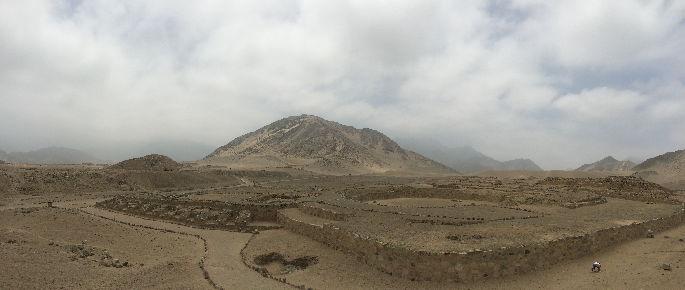
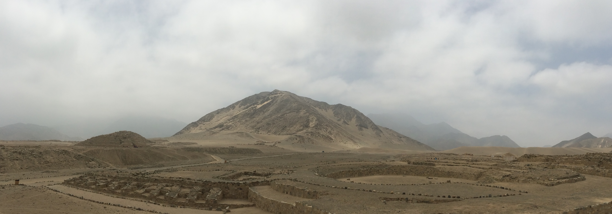
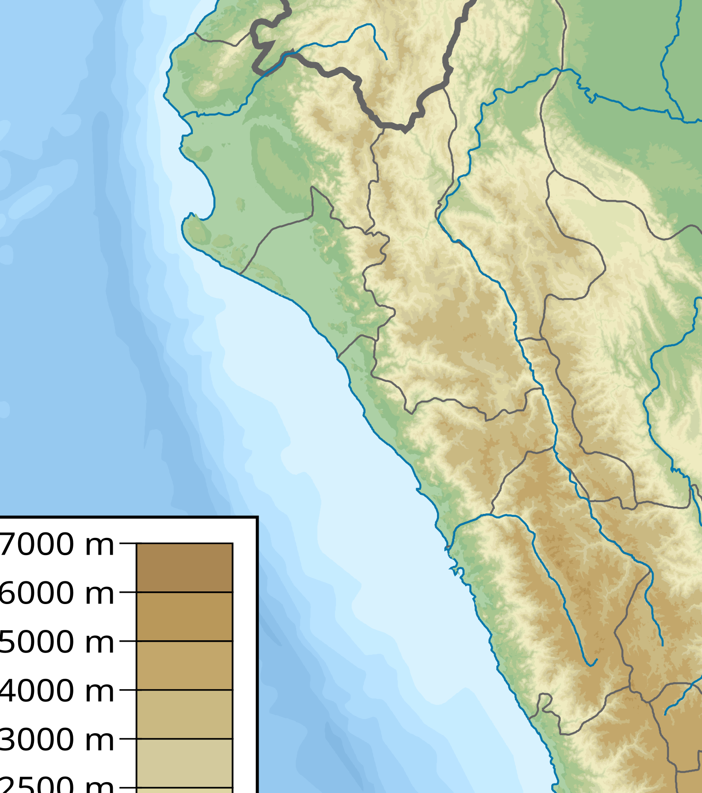
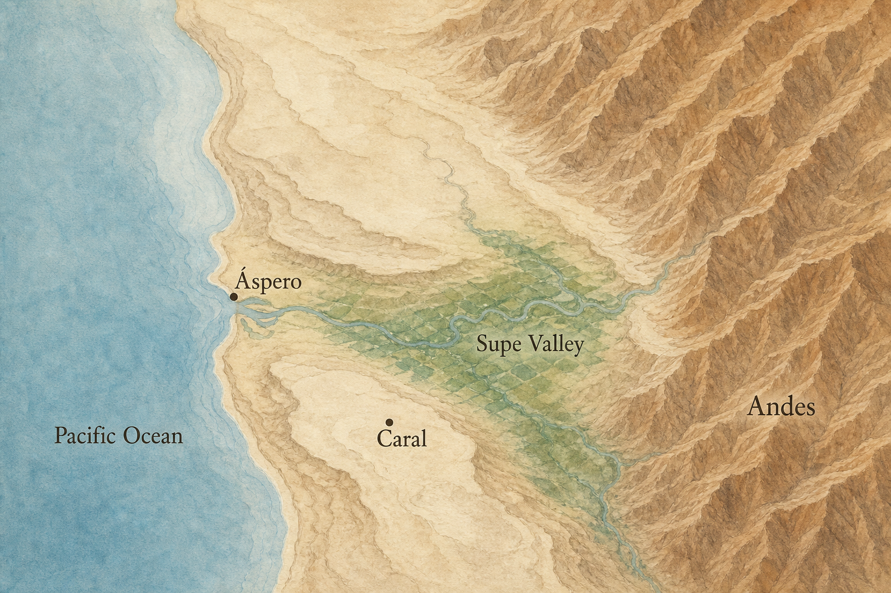
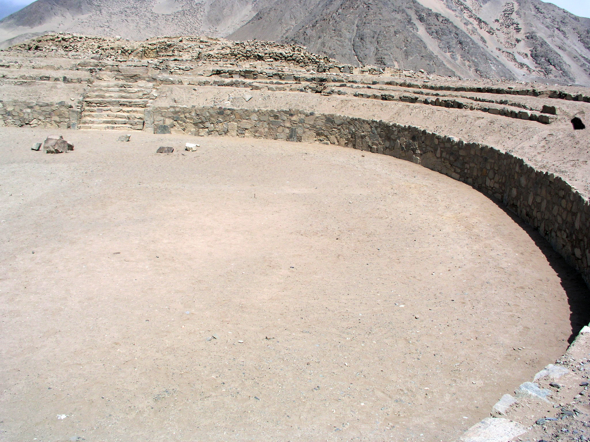
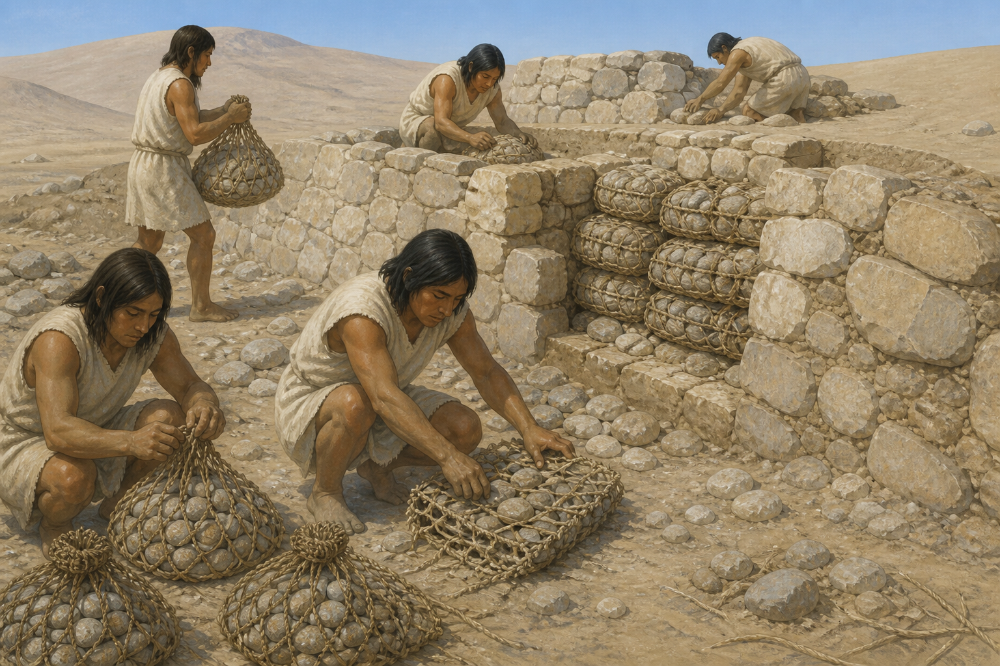
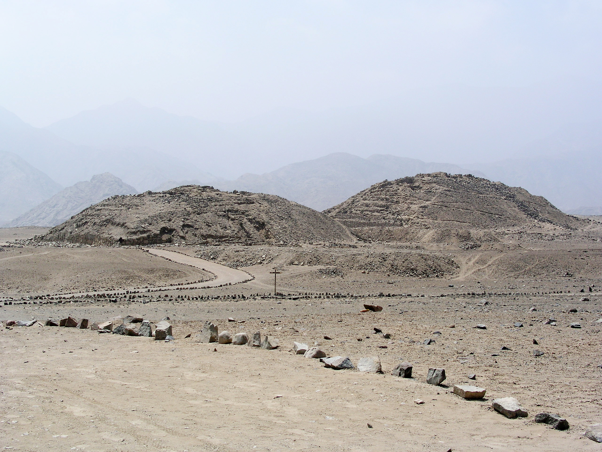
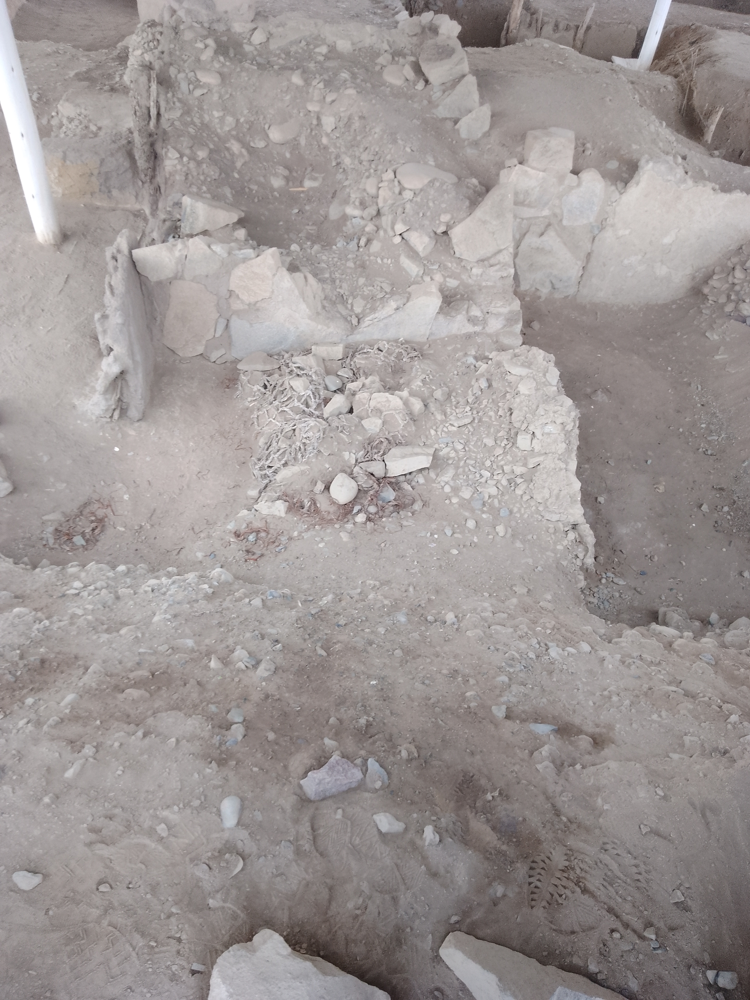

# Caral and Early Andean Urbanism — lesson production record

Issue: [ASH-98](https://linear.app/ashs-workshop/issue/ASH-98/research-and-publish-caral-and-early-andean-urbanism)

Lesson ID: `lesson.caral.andean-urbanism`

Research-note identity/version: `caral-andean-urbanism` / Stage 15 implementation

Journey/chapter/position: World History · Cities, States, and Bronze Age Networks · canonical Spine position 14; journey entry after `lesson.egypt.nile-state`

Required or optional: required

Queue status: **Review**

Accountable reviewer: Carlin Aylsworth

Validation tier: reference
Current stage: **Stage 16 — final media inspection and release gates**

This note is the durable source, claim, learning, visual, prototype, and checkpoint record. It replaces the legacy `caral_norte_chico` node; that older node is an audit input, not a trusted factual source.

## Work boundary

This increment produces one canonical World History lesson explaining how monumental centers and coastal–inland exchange supported urban complexity in the Supe Valley / Norte Chico during the Late Archaic or Late Preceramic period (c. 3000–1800 BCE). The learner outcome is a bounded model: people built large public architecture and organized labor without pottery, metal, or a writing system like Egypt’s or Uruk’s. Surviving mounds, plazas, plants, and fish remains support that model. They do not by themselves prove a single peaceful capital, a decoded quipu administration, or a later Inca-style empire.

Included:

- Caral as the best-preserved and most fully studied inland monumental center in a regional cluster;
- the dry desert terrace / green Supe Valley / Pacific coast geography;
- Áspero and other coastal sites as fishing partners, not as a complete site catalog;
- cotton, gourds, irrigation, nets, and marine protein as the economic hinge;
- platform mounds, sunken circular plazas, shicra-bag construction, and unequal residential spaces;
- explicit disagreement about “oldest city,” “state,” and the Caral fiber object called a quipu;
- missing everyday voices and the limit of arguing peace from absent fortifications.

Deferred:

- a complete Norte Chico site catalog (Pativilca, Fortaleza, Huaura, Peñico, Vichama);
- Chavín, Moche, Nazca, Wari, Tiwanaku, and Inca political history;
- a full Andean Worlds Story Arc;
- maize as a staple debate;
- ENSO / earthquake abandonment as a separate environmental lesson, except as a later limit;
- child remains or sacrificial interpretation as a teaching hook;
- modern excavation biography as the memory object.

Non-goals until Stages 16–18: do not set `status: "published"`, do not apply the hosted Supabase migration, and do not treat this implementation as a public release. Carlin still inspects the final media in the Learn shell.

## Node proposal

### Stable identity

| Field | Decision |
| --- | --- |
| Stable lesson ID | `lesson.caral.andean-urbanism` |
| Learner title | Caral and Early Andean Urbanism |
| Chronology | c. 3000–1800 BCE (regional Late Archaic); Caral’s dated monumental phase c. 2627–1977 BCE |
| World History position | 14 |
| Prerequisite | `lesson.farming.multiple-origins` |
| Canonical predecessor | `lesson.egypt.nile-state` |
| Canonical successor | `lesson.egypt.pyramids-and-state-labor` |
| Legacy alias | `caral_norte_chico` |

Essential question: How did people in the Supe Valley build urban centers without pottery, metal, or writing—and what does that change about what a city needs?

Durable understanding: Caral and neighboring centers show that urban life can grow from irrigation, coastal–inland exchange, public architecture, and organized labor. Pottery, metal, and writing are not required ingredients. The monuments prove large-scale cooperation; they do not by themselves prove one peaceful capital or a later imperial system.

Supporting understandings:

1. Caral sits inland on a desert terrace above a river valley, not on the beach; the Pacific fishery and inland farms were linked.
2. Cotton and gourds helped turn fishing into a high-yield food system, while fish and shellfish fed inland communities.
3. Platform mounds and sunken circular plazas are surviving public architecture that required many workers.
4. Nearby early sites and scholarly disagreement prevent treating Caral as the only first city or a fully proven territorial state.
5. Most people who built and fed the center are poorly named in the surviving record.

Evidence encounter: a surviving photograph of the sunken circular plaza at the Greater Temple, used for observation before interpretation.

Prerequisites: farming can begin in more than one region; cities and states are not one recipe. Immediate journey context: Uruk and Egypt have already shown two Old World urban/state pathways.

Common misconceptions: cities require pottery, metal, writing, or wheels; Caral copied Egyptian pyramids; “no pottery” means primitive; Caral was the unique first city in the Americas; a missing army proves a uniquely peaceful people; a knotted offering is already a decoded Inca quipu.

Scope — dates/places/actors: north-central Peruvian coast, especially the Supe Valley; Late Archaic / Late Preceramic, c. 3000–1800 BCE; Caral, with Áspero as the coastal counterpart. Actors are communities of farmers, fishers, builders, and organizers rather than named rulers.

Why this is one lesson: the independent urban case and the evidence-limit habit belong together. Splitting “the city” from “what the plaza can prove” would recreate the Egypt mistake of turning a famous object or site into a trophy.

Non-goals/deferred material: listed above.

Bridge from previous lesson: Egypt showed a territorial river state with royal images and short writing. Caral asks what urban complexity looks like when those checklist items are missing.

Bridge to next lesson: after seeing an independent Andean urban case, the Spine returns to Egypt to ask how later states mobilized labor for pyramids—without treating monumentality as one worldwide formula.

## Research questions

- What dates and period names does current scholarship actually support for Caral versus the wider Norte Chico / Caral-Supe cluster?
- How did desert, river, irrigation, and Pacific upwelling shape opportunity without making a city inevitable?
- What plants, animals, and objects survive, and what do they show about food, fiber, and exchange?
- What architectural forms are observed at Caral, and what labor do they imply?
- How should “city,” “state,” “oldest,” and “civilization” be worded so they do not smuggle a checklist or a ranking?
- What is the status of the Caral fiber object described as a quipu?
- What does the reported absence of fortifications and weapons actually support?
- Whose lives are poorly preserved?
- What visual forms can teach geography and evidence without reconstructing a festival as a fact?

## Source ledger

| Source ID | Citation/link | Type/authority | Claims supported | Limits/bias | Corroboration | Rights | Review |
| --- | --- | --- | --- | --- | --- | --- | --- |
| `source.caral.unesco-1269` | [UNESCO World Heritage Centre, Sacred City of Caral-Supe](https://whc.unesco.org/en/list/1269/) | Official heritage synthesis; Outstanding Universal Value | Late Archaic setting; 3000–1800 BCE; desert terrace over Supe Valley; monumental platforms and sunken courts; one of 18 urban settlements; ceremonial functions | Uses “oldest centre” and “fully developed socio-political state”; treats the quipu find as settled | Radiocarbon range corroborated by Science 2001 and Nature 2004; architecture corroborated by nomination and site photographs | Description CC BY-SA IGO 3.0; maps and photos not automatically redistributable | Reviewed 2026-08-19 |
| `source.caral.unesco-maps` | [UNESCO, Caral-Supe maps and coordinates](https://whc.unesco.org/en/list/1269/maps/) | Official geographic record | Coordinate-verified site location S10 53 30 W77 31 17; property/buffer extents | Inscribed-property map is a legal boundary document, not a historical reconstruction of 2600 BCE | Cross-check with Science 2001 inland distance and nomination geography | Maps are reference-only unless separately cleared | Reviewed 2026-08-19 |
| `source.caral.unesco-nomination` | [Peru, Sacred City of Caral-Supe nomination](https://whc.unesco.org/uploads/nominations/1269.pdf) | State Party / PEACS architectural and economic dossier | 66 ha nuclear site; upper/lower halves; six large pyramidal structures; sunken circular plazas; cotton-net and anchovy exchange; shicra/offering contexts; absence of ceramics | Promotional “mother culture” and later ayllu/pachaca/hunu analogies; quipu identification is the excavators’ reading | Architecture and cotton–fish economy corroborated by Science, Nature, and Sandweiss et al. 2009 | Research citation; figures not redistributed | Reviewed 2026-08-19 |
| `source.caral.shady-haas-creamer-2001` | [Shady Solís, Haas, and Creamer, “Dating Caral,” *Science* 292 (2001)](https://doi.org/10.1126/science.1059519) | Peer-reviewed radiocarbon and settlement paper | Monumental architecture, urban settlement, and irrigation by 2627–1977 cal BCE; 65 ha central zone; 23 km inland; one of 18 large preceramic Supe sites | Early “oldest city” framing; 2001 maize absence was later reopened | Nature 2004 regional dates; UNESCO chronology | Research citation; figures not redistributed | Reviewed 2026-08-19 |
| `source.caral.haas-creamer-ruiz-2004` | [Haas, Creamer, and Ruiz, “Dating the Late Archaic occupation of the Norte Chico,” *Nature* 432 (2004)](https://doi.org/10.1038/nature03146) | Peer-reviewed regional chronology | 3000–1800 cal BCE cultural complex across Huaura, Supe, Pativilca, and Fortaleza; monumental and residential architecture without ceramics; inland agricultural component plus maritime resources | “Norte Chico” is a research region name, not a polity name | Science 2001 Caral dates; UNESCO range | Research citation; figures not redistributed | Reviewed 2026-08-19 |
| `source.caral.sandweiss-2009` | [Sandweiss, Shady Solís, Moseley, Keefer, and Ortloff, PNAS 2009](https://pmc.ncbi.nlm.nih.gov/articles/PMC2635784/) | Peer-reviewed geoarchaeology and economy synthesis | Net fishing, irrigated cotton, food crops including squash, beans, tree fruits; protein from the sea; no pottery; Caral 23 km inland; Aspero as coastal counterpart | Collapse/disaster model is a hypothesis for later abandonment, not the urban-origin lesson | UNESCO nomination exchange model; Science 2001 irrigation and inland setting | Open-access scholarly article cited for research; figures not redistributed | Reviewed 2026-08-19 |
| `source.caral.haas-creamer-2005-power` | [Haas, Creamer, and Ruiz, “Power and the Emergence of Complex Polities in the Peruvian Preceramic,” *AP3A* 14 (2005)](https://doi.org/10.1525/ap3a.2005.14.037) | Peer-reviewed political interpretation | Irrigation, religion, and organized labor as power bases; reported lack of warfare evidence in the Preceramic cluster | Argument from absence; “pristine” and centralized-polity language needs qualification | Nature 2004 site cluster; Creamer et al. 2014 peer-polity alternative | Research citation; figures not redistributed | Reviewed 2026-08-19 |
| `source.caral.creamer-haas-2014-peer-polity` | [Creamer, Haas, and Rutherford, “Peer-polity interaction in the Norte Chico, Peru, 3000–1800 BC” (2014)](https://doi.org/10.4324/9781315798288-28) | Later specialist interpretation by the same field team | Multiple major centers; no clear hierarchical capital from area and monument counts; possible peer competition for labor and participants | Does not erase Caral’s monumentality; it complicates UNESCO/Shady “capital of a state” wording | Contrasts with UNESCO OUV “consolidated state” | Research citation | Reviewed 2026-08-19 |
| `source.caral.zona-caral` | [Zona Arqueológica Caral](https://zonacaral.gob.pe/en/) | Official PEACS / ZAC excavation-project site | Caral as inland political-religious center; Áspero as fishing town; cotton–fish route as a current interpretive frame | Public-facing “oldest city” and “cradle of civilization” language | Matches nomination economy; not an independent chronology | Research citation; site media not redistributed | Reviewed 2026-08-19 |
| `source.caral.commons-plaza` | [Håkan Svensson (Xauxa), *Plaza Circular del Templo Mayor*](https://commons.wikimedia.org/wiki/File:PeruCaral19.jpg) | Rights-cleared site photograph of surviving architecture | Runtime evidence-image candidate for the sunken circular plaza and platform mound | A 2004 visitor photograph of conserved ruins, not a reconstruction of use | Architectural identity corroborated by UNESCO/nomination | CC BY 2.5 (also GFDL / CC BY-SA 3.0); candidate runtime evidence image | Rights reviewed 2026-08-19 |
| `source.caral.shady-2006-pucp` | [Ruth Shady, “La civilización Caral,” *Boletín de Arqueología PUCP* 10 (2006)](https://doi.org/10.18800/boletindearqueologiapucp.200601.004) | Excavator’s open-access synthesis | Public-building offering context for the knotted fiber object; social and territorial interpretation from PEACS | Primary advocate of the quipu reading and state model | UNESCO repeats the quipu claim; independent khipu specialists have not confirmed it | Open-access article cited for research; figures not redistributed | Reviewed 2026-08-19 |

### Source-balance result

The set combines official heritage geography, the 2001/2004 dating papers, a 2009 economy/environment synthesis co-authored by Shady and Moseley, the excavation project’s own architectural dossier, and a later peer-polity alternative from Haas and Creamer. UNESCO and PEACS language is treated as an interpretation to be bounded, not as a second science. Wikipedia, Smithsonian magazine, ScienceDaily, and the legacy `caral_norte_chico` node were used only to discover terminology and disputes.

## Claim ledger

| Claim ID and wording | Kind | Certainty | Sources | Counterevidence/limits | Missing perspective | Learner treatment | Review |
| --- | --- | --- | --- | --- | --- | --- | --- |
| `claim.caral.late-archaic-range`: A major preceramic monumental complex developed on Peru’s north-central coast between about 3000 and 1800 BCE. | interpretation | high | Nature 2004; UNESCO 1269 | Exact start/end of each site varies | Coastal and inland sites are not equally excavated | State with “about” | Reviewed |
| `claim.caral.caral-dates`: Radiocarbon dates from plant fibers in Caral’s construction place monumental architecture around 2627 to 1977 BCE. | observation | high | Science 2001 | Later occupation and remodeling continued; range is calibrated | Workers who made the bags are unnamed | State as dated construction, not a founding day | Reviewed |
| `claim.caral.inland-setting`: Caral occupies a dry desert terrace above the green Supe Valley about 23 km inland from the Pacific. | observation | high | Science 2001; UNESCO; Sandweiss 2009 | Ancient shoreline and river channels changed | Coastal communities are easy to treat as scenery | Teach inland-not-beach before the economy | Reviewed |
| `claim.caral.regional-sites`: Caral is one of multiple large preceramic settlements in the Supe Valley and neighboring valleys. | observation | high | Science 2001; Nature 2004; UNESCO | Site counts and names differ by survey | Smaller settlements are under-described | Name the cluster; do not catalog every site | Reviewed |
| `claim.caral.monumental-architecture`: Caral’s central zone includes six large platform mounds, sunken circular plazas, and residential architecture over about 65 hectares. | observation | high | Science 2001; UNESCO nomination | “Pyramid” is a later popular label for platform mounds | Interior rooms and exact functions are partly reconstructed | Observe mounds and plazas first | Reviewed |
| `claim.caral.plaza-observation`: A sunken circular plaza at the foot of a platform mound is a surviving public gathering space connected to the building by a stairway. | observation | high | Commons plaza photograph; UNESCO nomination | Exact ceremonies, seating, and audience are not recorded | Ordinary participants are invisible | Evidence encounter | Reviewed |
| `claim.caral.preceramic`: These early monumental sites were built and used without pottery. | observation | high | Science 2001; Nature 2004; Sandweiss 2009 | Later pottery appears after this period | Absence can be misread as lack of skill | Define in use; reject “primitive” | Reviewed |
| `claim.caral.cotton-fish-exchange`: Inland irrigation produced cotton and gourds used in fishing technology, while marine fish and shellfish reached inland sites. | interpretation | high | Sandweiss 2009; UNESCO nomination; Zona Caral | Direction of political control (coast-first vs inland-first) remains debated | Individual traders are unnamed | Teach interdependence, not a winner | Reviewed |
| `claim.caral.no-checklist`: Pottery, metal tools, wheeled transport, and writing like Egypt’s or Uruk’s were not required for this urban complexity. | interpretation | high | Science 2001; Sandweiss 2009; UNESCO architecture | “Urban” itself is a scholarly judgment | Easy to invert into Andean superiority | Teach as a limit on checklists, not a ranking | Reviewed |
| `claim.caral.shicra`: Workers packed stones in woven fiber bags (shicra) to build platform-mound cores; those fibers provided the dated samples. | observation | high | Science 2001; UNESCO nomination | Seismic-engineering explanations are later inferences | Quarry and bag makers are unnamed | Mechanism, not a gadget miracle | Reviewed |
| `claim.caral.labor-and-hierarchy`: Monumental building required organized labor, and residential remains show unequal living spaces. | interpretation | moderate | UNESCO nomination; Science 2001 press/architecture | “Elite” rooms are interpreted from size and location | Most workers remain anonymous | State inequality without invented kings | Reviewed |
| `claim.caral.not-one-recipe`: Caral-Supe urbanism developed in the Andes independently of Egypt and Mesopotamia. | interpretation | high | UNESCO OUV; Science 2001 comparative framing | “Independently” does not mean isolated from other Andean communities | Amazon and highland connections are only partly visible | Contrast with Uruk/Egypt without isolation myth | Reviewed |
| `claim.caral.oldest-qualified`: Calling Caral the oldest city in the Americas is a promotional shortcut; it is among the earliest known urban centers, and nearby sites were also early. | interpretation | contested | UNESCO OUV vs Science 2001 cluster; Bandurria/Aspero earlier or overlapping coastal occupations in later literature | “City” definitions differ | Other poorly published sites may be as early | Qualify; do not award a trophy | Reviewed |
| `claim.caral.polity-disagreement`: Whether Caral was the capital of a consolidated state or one of several peer centers is debated. | interpretation | contested | UNESCO/Shady state model vs Creamer, Haas, and Rutherford 2014 | Monument size can be read either way | Subject communities rarely speak | Teach the disagreement | Reviewed |
| `claim.caral.quipu-contested`: A knotted fiber object was found as an offering in a public building; identifying it as an early quipu remains unconfirmed. | interpretation | contested | Shady 2006; UNESCO OUV vs later khipu scholarship that has not confirmed the identification | The object exists; the administrative reading does not | If it is a record, we still cannot read it | Name the object, keep the reading open | Reviewed |
| `claim.caral.warfare-absence`: Researchers have not reported clear fortifications or battlefield remains for this Preceramic cluster; that absence does not prove a uniquely peaceful society. | interpretation | moderate | Haas, Creamer, and Ruiz 2005 | Absence of evidence is not evidence of absence; coercion can leave little debris | Harmed or coerced people are the least likely to be visible | Teach the limit | Reviewed |
| `claim.caral.evidence-bias`: Most surviving evidence is architecture, plants, marine remains, and ceremonial deposits, so it reveals public building more clearly than ordinary lives. | interpretation | high | UNESCO nomination; Sandweiss 2009 | Dry preservation is unusually good for fiber, which can over-represent textiles and bags | Women, children, and non-elite households are faint | Name missing voices | Reviewed |

## Content triage

| Candidate idea | Essential/supporting/enrichment/deferred/rejected | Why | Destination |
| --- | --- | --- | --- |
| Preceramic monumental urbanism | Essential | Answers the essential question | Whole lesson |
| Inland desert terrace / coastal fishery | Essential | Makes the exchange intelligible | Section 2 and map |
| Cotton, gourds, nets, fish | Essential | Mechanism of coastal–inland interdependence | Section 2 |
| Sunken plaza + platform mound | Essential | Evidence encounter | Section 3 |
| Shicra-bag construction and labor | Supporting | Makes monumentality a human process | Section 4 |
| No pottery/metal/writing checklist | Essential | Prevents the misconception | Sections 1 and 5 |
| Regional cluster, not one unique first city | Essential | Proportionality | Section 5 |
| State vs peer-polity disagreement | Supporting | Honest political limit | Section 5 |
| Caral “quipu” | Supporting | Famous claim that must be bounded | Section 5 |
| Warfare absence | Supporting | Common popular story | Section 5 |
| Bird-bone flutes | Enrichment | Helps imagine gathering without proving a concert | One sentence in section 4 |
| Maize debate | Deferred | Not needed for the urban model | Later food-systems work |
| ENSO/earthquake abandonment | Deferred | Explains later change, not origins | Later environmental lesson |
| Inca continuity / mother culture | Rejected | Later-tradition analogizing | Out of lesson |
| Egyptian-copy story | Rejected | False | Explicitly blocked |
| Child sacrifice as hook | Rejected | Age-sensitive, not required, poorly bounded here | Out of lesson |
| Ruth Shady biography card | Rejected | Modern excavator is not the memory object | Out of lesson |
| Peñico 2025 news | Deferred | Too new and journalistic for a core claim | Possible later update |

### Date decision

Use **c. 3000–1800 BCE** for the regional Late Archaic complex, matching the canonical roster and Nature 2004. Inside the lesson, date Caral’s monumental construction more tightly to **around 2627–1977 BCE** from the 2001 radiocarbon paper.

### Terminology decisions

- Prefer **Caral** for the site and **Caral-Supe** or **Supe Valley** for the local cluster. Introduce **Norte Chico** once as a modern regional research name, not as an ancient country.
- Use **platform mound** first; **pyramid** only as a later popular name for the same stepped buildings.
- Use **sunken circular plaza** for the circular courts.
- Use **preceramic** and immediately gloss as **without pottery**.
- Use **shicra** once, defined as woven fiber bags filled with stones.
- Use **urban center** and **organized authority**. Do not lead with “civilization” or “the first state.”
- Use **quipu / khipu** only as a later Andean recording tradition and as a contested identification for the Caral object.

## Learning blueprint

Essential question: How did people in the Supe Valley build urban centers without pottery, metal, or writing—and what does that change about what a city needs?

Durable understanding: Caral shows that urban life can grow from irrigation, coastal–inland exchange, public architecture, and organized labor. Pottery, metal, and writing are not required. The monuments prove large-scale cooperation; they do not prove one peaceful capital or a later empire.

Supporting understandings: listed in the node proposal.

Prerequisites: multiple origins of farming; Uruk and Egypt as contrasting urban/state pathways already encountered in the journey.

Misconceptions: checklist cities; Egyptian copies; primitive-because-no-pottery; unique first-city trophy; decoded quipu bureaucracy; proven peace.

Indispensable vocabulary: platform mound; sunken circular plaza; preceramic / without pottery; irrigation; cotton–fish exchange; shicra; urban center.

Evidence encounter: uncropped photograph of the Greater Temple’s sunken circular plaza.

Historical-thinking move: use architecture and ecofacts to support a bounded urban model, then name what a famous site label cannot prove.

Required sincere-attempt evidence: one supported-selection about the cotton–fish plus monument model; one concise explanation that pairs a piece of evidence with a limit.

## Ages 11–14 transformations

- “Late Archaic / Late Preceramic cultural complex” → a time before pottery here, with big public buildings.
- Hydraulic and maritime-foundations theory names → coast and valley needed each other; scholars still argue who led.
- “Fully developed socio-political state” → some archaeologists see a capital and a state; others see several competing centers.
- Quipu as writing system → a knotted object was found; we cannot treat it as a readable Inca-style record.
- Absence of fortifications → researchers have not found army evidence; that is not the same as knowing daily life was gentle.
- Start with the plaza and the missing pottery, not with a civilization ranking.
- Do not analogize the plaza to a stadium or shopping mall in a heading.
- Keep sacrifice, human remains, and disaster death out of the core path.

## Section/component storyboard

Heading voice: each learner-facing heading names the subject or job in ordinary words.

| Order | Section ID | Learner-facing heading | Authoring purpose (not shown) | Claims/sources | Module | Media/action | Transition |
| --- | --- | --- | --- | --- | --- | --- | --- |
| 1 | `section.caral.another-way` | Another way to build a city | Break the Uruk/Egypt checklist and pose the problem | no-checklist; late-archaic-range | prose; evidence | platform-mound photograph | The missing pottery becomes the puzzle |
| 2 | `section.caral.coast-and-valley` | Coast and valley together | Make inland Caral and coastal fishing one system | inland-setting; cotton-fish-exchange; regional-sites | prose; knowledge; planned map | map intention | Geography explains the goods |
| 3 | `section.caral.plaza` | A sunken plaza and a platform mound | Observe surviving public architecture before interpreting power | plaza-observation; monumental-architecture; labor-and-hierarchy | prose; planned evidence; knowledge | plaza photograph | The building raises the labor question |
| 4 | `section.caral.how-built` | How the monuments were built | Turn monumentality into dated human work | shicra; caral-dates; preceramic | prose; evidence; reconstruction; knowledge | excavated bags then reconstruction | Work done, now bound the claims |
| 5 | `section.caral.what-it-can-prove` | What this case can prove | Qualify oldest-city, state, quipu, and peace stories | not-one-recipe; oldest-qualified; polity-disagreement; quipu-contested; warfare-absence; evidence-bias | prose; knowledge | none | Learner is ready to use evidence |
| 6 | `section.caral.world-check` | World Check | Require a supported model and an evidence limit | prompt pair | two prompts | none | Explicit completion |

Section-count exception: none. Six sections.

## Media decisions

| Intention ID | Section ID | Teaching question | Form | Evidence/claim basis | Depiction label | Accessible equivalent | Stage 14A treatment | Final review |
| --- | --- | --- | --- | --- | --- | --- | --- | --- |
| `intention.caral.site-hero` | masthead | What does this urban center look like as a place in a dry valley? | evidence photograph | Commons site panorama; UNESCO architectural identification | Surviving evidence · conserved ruins, not a reconstructed city | Alt text naming plaza, platform walls, desert terrace, and hills | Added after product-owner asked why the lesson had no hero | approved |
| `intention.caral.supe-valley-map` | `section.caral.coast-and-valley` | Why is Caral inland, and how does that make coast and valley depend on each other? | historical map | UNESCO coordinates; Science 2001 23 km inland; Aspero as coastal counterpart | Evidence-based historical map · shorelines and valley width approximate | Accessible summary of sea, Áspero, Caral, desert terrace, river | Development-only annotation, then `media.caral.supe-valley-map` | approved |
| `intention.caral.platform-mounds` | `section.caral.another-way` | How large are the public buildings that break the Uruk/Egypt checklist? | evidence photograph | Commons mound photograph; UNESCO/nomination architectural identification | Surviving evidence · conserved mounds, not a reconstructed city | Alt text naming two platform mounds on a desert terrace | Added after product-owner request for more images | approved |
| `intention.caral.plaza-evidence` | `section.caral.plaza` | What surviving architecture can a learner actually see? | evidence photograph | Commons plaza image; UNESCO/nomination architectural identification | Surviving evidence · conserved ruins, not a ceremony in progress | Alt text naming plaza, mound, stair relationship | Development-only annotation, then `media.caral.sunken-plaza` | approved |
| `intention.caral.excavated-shicra` | `section.caral.how-built` | What dated construction fabric actually survives in a wall? | evidence photograph | Commons excavated shicra photograph; Science 2001 dating | Surviving evidence · excavated wall core during modern fieldwork | Alt text naming fiber nets of stones plus modern excavation furniture | Added after product-owner request for more images | approved |
| `intention.caral.shicra-reconstruction` | `section.caral.how-built` | How did people turn fiber bags and stone into a mound? | evidence-based reconstruction | Science 2001 shicra dating; nomination construction description | Evidence-led reconstruction · exact crew and moment illustrative | Accessible description of bag-filling and stacking | Development-only annotation, then `media.caral.shicra-reconstruction` | approved |

Video: not used. Motion is not required to teach the model.

## Image lifecycle

### `media.caral.site-hero` — masthead arrival at the site

#### 1. Reasoning and source basis

- Teaching job: let the learner arrive at Caral as a monumental place in a dry valley before the missing-pottery puzzle is named.
- Governing claim IDs: `claim.caral.monumental-architecture`, `claim.caral.inland-setting`.
- Factual/historical sources: Paulo JC Nogueira’s 2014 site panorama; UNESCO nomination architectural identification.
- Why image instead of no media: every other published World History lesson in this shell opens with a wide hero. Reusing the plaza close-up or mound pair would crop badly in the 2.85:1 masthead and repeat a later evidence encounter.
- Depiction and uncertainty boundary: surviving evidence. Conserved ruins are shown; a reconstructed city and a ceremony are not.

#### 2. Reference image actually used

| Reference preview | Origin and permitted use |
| --- | --- |
|  | Creator: Paulo JC Nogueira.<br>Canonical origin: https://commons.wikimedia.org/wiki/File:Cidade_Sagrada_de_Caral,_Supe_-_Peru_-_panoramio_(5).jpg<br>License: CC BY-SA 3.0; attribution and share-alike required.<br>Accessed: 2026-08-19. |

- Repository research copy and SHA-256: `docs/research/references/caral/caral-panorama-nogueira-reference.jpg`; `4fb9817c1392a8ffdd0fd2205cf093dc1b76ea430de32f93fcf83cb4580cea34`.
- Edit mode: adapted composition.
- Visual relationship to preserve: sunken circular plaza, stone platform walls, dry terrace, and hills behind.
- Locked layout/detail invariants: plaza remains readable; no labels, colorization, or reconstructed figures.
- Details not to copy or infer: the modern visitor at the far right of the uncropped panorama; overlay captions.

#### 3. Generation or transformation

- Operation: hero-frame crop of the licensed panorama to 2.85:1, then JPEG compression for runtime delivery. No generative model.
- Actual input path and SHA-256: `docs/research/references/caral/caral-panorama-nogueira-reference.jpg`; `4fb9817c1392a8ffdd0fd2205cf093dc1b76ea430de32f93fcf83cb4580cea34`.
- Tool/model/date: Sharp extract left 280, top 220, 5000 × 1754, then resize to 1920 × 674; MozJPEG quality 92, 2026-08-19.
- Complete prompt:

```text
No generation. Direct licensed use of Commons photograph File:Cidade_Sagrada_de_Caral,_Supe_-_Peru_-_panoramio_(5).jpg. Crop a 2.85:1 hero frame (left 280, top 220, 5000 × 1754) to keep the sunken plaza, platform walls, desert terrace, and hills, and to exclude the modern visitor at the far right. Resize the crop to 1920 × 674 JPEG for Chronos masthead delivery. Do not add labels, reconstructed figures, or colorization.
```

- Candidate/rejection record: the uncropped panorama was rejected as a plaza-section duplicate. The same file was later accepted as the masthead hero after the product owner asked why the lesson had no hero. The mound pair and plaza close-up were rejected as hero sources because the 2.85:1 CSS cover would crop their teaching subjects.

#### 4. Accepted final image

| Reference used | Accepted final |
| --- | --- |
|  |  |

- Final master path, dimensions, and SHA-256: `docs/research/generated/caral/caral-site-hero-master.jpg`; 5000 × 1754; `ae42ef0b5785903f9535c43e3f79cb2fe4841d53ac50ae3edec86384b333ecb5`.
- Runtime/fallback path and SHA-256: `public/images/places/caral-site-hero.jpg`; 1920 × 674; `9155746afc960169c982e52db2549dd91c81db54cba9045326e5d5e3944d1c2b`. Generated fallback: `/images/optimized/caral/site-hero.optimized.webp`.
- Reviewer/date/status: Codex historical, rights, and visual review / 2026-08-19 / accepted.
- Fidelity verdict — every locked invariant retained: yes.
- Lesson-size verdict — evidence-bearing differences remain visually distinct on desktop and mobile: yes; plaza and hills remain in the 2.85:1 frame.
- Comparison verdict — preserved relationship: plaza and platform walls on a dry terrace with hills behind.
- Comparison verdict — intentional changes: 2.85:1 hero crop; excluded extra sky, unused left margin, and a modern visitor at the far right.
- Comparison verdict — unsupported details checked: no added people, ceremony, labels, or reconstructed skyline.

### `media.caral.supe-valley-map` — required historical map

#### 1. Reasoning and source basis

- Teaching job: show that Caral sits inland on a desert terrace while Áspero sits at the Pacific river mouth, so coast and valley can be held as one connected landscape.
- Governing claim IDs: `claim.caral.inland-setting`, `claim.caral.cotton-fish-exchange`, `claim.caral.regional-sites`.
- Factual/historical sources: Urutseg CC0 SRTM physical map of Peru, UNESCO Caral coordinates, Science 2001 inland distance, Scientific Reports 2023 Áspero coordinates.
- Why image instead of no media: the 23 km inland relationship and the desert-terrace / green-valley contrast are easy to flatten into “a city on the beach” without a map.
- Depiction and uncertainty boundary: evidence-based reconstruction. Site order and west–east placement are source-supported; shorelines, river width, and terrace edges are approximate. No political border or capital fill is claimed.

#### 2. Reference image actually used

| Reference preview | Origin and permitted use |
| --- | --- |
|  | Creator: Urutseg, from SRTM topography.<br>Canonical origin: https://commons.wikimedia.org/wiki/File:Peru_physical_map.svg<br>License: CC0 1.0 public-domain dedication.<br>Accessed: 2026-08-19. |

- Repository research copy and SHA-256: `docs/research/references/caral/peru-physical-map-reference.png`; `a3a5fe50107f9b1d4d700e4901a541e2551fde7b40857214efb2450dd58ab3e7`. Working crop: `docs/research/references/caral/supe-coast-physical-map-crop.png`; `6efa93e91a9150d8cc449bb81ed5db7a23b2ee246189c3bf697aafa1c1dd0319`.
- Edit mode: adapted composition.
- Visual relationship to preserve: north-up, Pacific west, Andes east, a coastal desert, and a river valley running from mountains to sea; Áspero at the mouth and Caral inland.
- Locked layout/detail invariants: exactly five reviewed labels; two subtle site dots; no border, capital fill, legend, title, date, Lima, extra settlements, or compass.
- Details not to copy or infer: national borders, elevation scale, neighboring countries, modern cities, and exact ancient channels.

#### 3. Generation or transformation

- Operation: reference-led image edit followed by full-frame JPEG runtime compression.
- Actual input path and SHA-256: `docs/research/references/caral/supe-coast-physical-map-crop.png`; `6efa93e91a9150d8cc449bb81ed5db7a23b2ee246189c3bf697aafa1c1dd0319`.
- Tool/model/date: Cursor/Grok image generation service (model identifier not exposed), 2026-08-19; Sharp/MozJPEG quality 95 for the runtime source.
- Complete prompt:

```text
Create a single historical map illustration for a Chronos lesson.

LESSON AND PURPOSE:
- Subject: Supe Valley on Peru’s north-central Pacific coast, Late Archaic / Late Preceramic, c. 3000–1800 BCE
- Period: c. 3000–1800 BCE
- Teaching goal: show that Caral sits inland on a dry desert terrace above a green river valley, while Áspero sits at the river mouth on the Pacific; coast and valley belong to one connected landscape, not a bordered kingdom

GEOGRAPHIC REFERENCE:
- Treat the attached real topographic raster as the geographic source.
- Preserve west=Pacific Ocean, east=Andes mountains, north at top, a narrow coastal desert, and river valleys running from the mountains west to the sea.
- Zoom the composition to one representative coastal river valley matching the Supe Valley: the ocean occupies the left/west, a short green irrigated valley runs inland, pale sand desert terraces sit above the valley, and brown Andes rise on the right/east.
- Do not use the reference's graphic style, elevation legend, political borders, or national extent.

VERIFIED FEATURES:
- Pacific Ocean on the west
- Áspero at the river mouth near the coast
- Caral about 23 km inland, slightly south of Áspero, on a pale desert terrace above the green valley
- Supe Valley as a narrow green ribbon between desert and mountains
- Andes highlands to the east

APPROXIMATE FEATURES:
- Exact shoreline, river width, terrace edges, and valley vegetation extent
- Render these softly; do not imply a surveyed 2600 BCE reconstruction

REQUIRED LABELS (verbatim, exactly these five, no other words):
- Pacific Ocean
- Áspero
- Caral
- Supe Valley
- Andes

CHRONOS STYLE:
- warm parchment or ivory ground
- restrained ochre, sand, mineral blue, blue-green, and terracotta
- subtle paper and topographic texture
- elegant editorial historical-atlas character
- calm, clear, and approachable for ages 10-14
- simple composition with generous negative space
- subtle small dots for Áspero and Caral only

DO NOT ADD:
- invented settlements, extra rivers, roads, borders, ruins, pyramids, boats, people, or symbols
- modern national borders, Lima, Peru label, or capital-territory fill
- fantasy, tactical-game, satellite, or generic GIS styling
- a decorative compass, generated legend, title, date, paragraph, logo, watermark, or UI chrome
- the reference map's elevation scale
- any word or annotation not listed under REQUIRED LABELS

OUTPUT:
- one complete landscape historical map, north at top, west=ocean, east=mountains
- sufficient resolution for desktop and mobile lesson display
- no cropping of required geography
```

- Candidate/rejection record: first generated candidate accepted after geographic and label review. No generated candidate was rejected.

#### 4. Accepted final image

| Reference used | Accepted final |
| --- | --- |
|  |  |

- Final master path, dimensions, and SHA-256: `docs/research/generated/caral/supe-valley-map-master.png`; 1536 × 1024; `9e328ca878fb126609809a6d303a01fb99466ce58f2f11e5ed0cddb8dace07f8`.
- Runtime/fallback path and SHA-256: `public/images/places/caral-supe-valley-map.jpg`; 1536 × 1024; `a1dadc917a4cedcacaf36f185e082d5afeec0698ddd4e47f18ce515c1e956674`. Generated fallback: `/images/optimized/caral/supe-valley-map.optimized.jpg`.
- Reviewer/date/status: Codex historical, cartographic, accessibility, and visual review / 2026-08-19 / accepted.
- Fidelity verdict — every locked invariant retained: yes.
- Lesson-size verdict — evidence-bearing differences remain visually distinct on desktop and mobile: yes; final shell verification remains part of Stage 16.
- Comparison verdict — preserved relationship: Pacific west; Áspero at the mouth; Caral inland on a terrace; Andes east.
- Comparison verdict — intentional changes: cropped national extent; removed borders and elevation legend; used a calm Chronos atlas treatment.
- Comparison verdict — unsupported details checked: exactly five labels, no Lima, borders, capital fill, extra sites, title, date, logo, or watermark.

### `media.caral.sunken-plaza` — surviving plaza evidence

#### 1. Reasoning and source basis

- Teaching job: let learners inspect the surviving sunken circular plaza and stairway before the lesson supplies an interpretation of gathering or power.
- Governing claim IDs: `claim.caral.plaza-observation`, `claim.caral.monumental-architecture`.
- Factual/historical sources: Håkan Svensson’s 2004 plaza photograph; UNESCO nomination architectural identification.
- Why image instead of no media: the core observation move depends on seeing a lowered circle, enclosing wall, and stair onto a mound rather than imagining a generic pyramid.
- Depiction and uncertainty boundary: surviving evidence. Conserved ruins are shown; ceremonies, seating, and audience are not.

#### 2. Reference image actually used

| Reference preview | Origin and permitted use |
| --- | --- |
|  | Creator: Håkan Svensson (Xauxa).<br>Canonical origin: https://commons.wikimedia.org/wiki/File:PeruCaral19.jpg<br>License: CC BY 2.5 (also GFDL / CC BY-SA 3.0); attribution required.<br>Accessed: 2026-08-19. |

- Repository research copy and SHA-256: `docs/research/references/caral/plaza-circular-templo-mayor-reference.jpg`; `03be9dcbf1328c07730acabcb4377f49168329092cddb50a32d46e8f42226da0`.
- Edit mode: direct use.
- Visual relationship to preserve: uncropped plaza, stairway, enclosing wall, mound mass, and dry hills.
- Locked layout/detail invariants: no crop of the plaza or stair; no colorization, invented people, labels, or reconstructed ceremony.
- Details not to copy or infer: no later visitor reconstruction of ritual; no overlay captions.

#### 3. Generation or transformation

- Operation: direct licensed use; full-frame resize from 2048 × 1536 to 960 × 720 and high-quality JPEG compression for runtime delivery.
- Actual input path and SHA-256: `docs/research/references/caral/plaza-circular-templo-mayor-reference.jpg`; `03be9dcbf1328c07730acabcb4377f49168329092cddb50a32d46e8f42226da0`.
- Tool/model/date: Sharp/MozJPEG quality 92, 2026-08-19; no generative model.
- Complete prompt:

```text
No generation. Direct licensed use of the uncropped Commons photograph File:PeruCaral19.jpg, resized as a complete frame from 2048 × 1536 to 960 × 720 and recompressed as JPEG for Chronos runtime delivery without cropping, retouching, labels, or reconstructed figures.
```

- Candidate/rejection record: the uncropped original was accepted. No crop candidate was used.

#### 4. Accepted final image

| Reference used | Accepted final |
| --- | --- |
|  |  |

- Final master path, dimensions, and SHA-256: `docs/research/generated/caral/plaza-circular-templo-mayor-master.jpg`; 2048 × 1536; `03be9dcbf1328c07730acabcb4377f49168329092cddb50a32d46e8f42226da0`.
- Runtime/fallback path and SHA-256: `public/images/evidence/caral-sunken-plaza.jpg`; 960 × 720; `b433cb9f76f882fddd5dca85c4cef810b5cbe5ef76d788d1d06f161f3f0e1abb`. Generated fallback: `/images/optimized/caral/sunken-plaza.optimized.jpg`.
- Reviewer/date/status: Codex historical, rights, and visual review / 2026-08-19 / accepted.
- Fidelity verdict — every locked invariant retained: yes.
- Lesson-size verdict — evidence-bearing differences remain visually distinct on desktop and mobile: yes; final shell verification remains part of Stage 16.
- Comparison verdict — preserved relationship: plaza hollow, stair, and mound remain uncropped.
- Comparison verdict — intentional changes: runtime JPEG compression only.
- Comparison verdict — unsupported details checked: no added people, ceremony, crop, or caption burned into the image.

### `media.caral.shicra-reconstruction` — recommended construction reconstruction

#### 1. Reasoning and source basis

- Teaching job: show how fiber bags of stone became the dated core of a platform mound, as organized human work rather than a pottery-free primitive leftover.
- Governing claim IDs: `claim.caral.shicra`, `claim.caral.caral-dates`, `claim.caral.labor-and-hierarchy`.
- Factual/historical sources: excavated shicra bags photographed in a wall core (Garcia Almonacid, CC BY-SA 4.0); Science 2001 dating of plant fibers in shicra; UNESCO nomination construction description.
- Why image instead of no media: learners need to see bags as building fabric, not as a vocabulary word.
- Depiction and uncertainty boundary: evidence-led reconstruction. Bag morphology and wall-fill use are evidence-based; the exact crew, clothing details, and moment are illustrative.

#### 2. Reference image actually used

| Reference preview | Origin and permitted use |
| --- | --- |
|  | Creator: Gisela Xiomara Garcia Almonacid.<br>Canonical origin: https://commons.wikimedia.org/wiki/File:Almacenes_con_Shicras.jpg<br>License: CC BY-SA 4.0; attribution and share-alike required for derivatives.<br>Accessed: 2026-08-19. |

- Repository research copy and SHA-256: `docs/research/references/caral/almacenes-con-shicras-reference.jpg`; `42d096697462c845d8e52a9b194dd2be2ad2c81dab3af57557150690714c78d4`.
- Edit mode: adapted composition.
- Visual relationship to preserve: coarse plant-fiber netting, rounded river cobbles packed inside, bags used as core fill against a rustic stone retaining wall.
- Locked layout/detail invariants: bags remain fiber nets of stones, not modern sacks; reconstruction must be recognizable as construction work; no baked-in title or caption.
- Details not to copy or infer: modern excavation canopy poles, boot prints, visitor-center posters, quincha exhibit architecture, or seismic-engineering infographic text. A visitor-center example photograph (`shicras-de-ejemplo-caral-reference.jpg`) was inspected and rejected as a generation input because it is a modern exhibit, not an excavated wall core.

#### 3. Generation or transformation

- Operation: reference-led image edit followed by full-frame JPEG runtime compression.
- Actual input path and SHA-256: `docs/research/references/caral/almacenes-con-shicras-reference.jpg`; `42d096697462c845d8e52a9b194dd2be2ad2c81dab3af57557150690714c78d4`.
- Tool/model/date: Cursor/Grok image generation service (model identifier not exposed), 2026-08-19; Sharp/MozJPEG quality 92 for the runtime source.
- Complete prompt:

```text
Create a single evidence-led historical reconstruction illustration for a Chronos lesson, ages 10-14.

Use case: scientific-educational
Asset type: Chronos evidence-based reconstruction
Primary request: Reconstruct the construction method shown by the attached archaeological photograph: workers filling coarse woven vegetable-fiber bags (shicra) with rounded river stones and stacking those bags as core fill inside a low stone retaining wall on a dry Peruvian desert terrace.

Input images: Image 1 is the evidence reference. Preserve the bag morphology from the photograph: coarse knotted/twisted plant-fiber netting, rounded mixed-size river cobbles packed inside, bags used as structural fill against a rustic stone-and-mud retaining wall. Do not copy the modern excavation setting.

Scene: a few adult Andean workers in simple Late Preceramic clothing (unbleached cotton cloth, no metal jewelry, no pottery vessels) filling and stacking shicra bags during platform-mound construction. Dry pale sand, bright daylight, arid coastal-desert terrace. One unfinished low retaining wall of irregular stones. Bags in progress in the foreground; stacked bags visible in a wall core cutaway.

Style/medium: calm, museum-quality editorial reconstruction painting; naturalistic but not photorealistic; no gore, no spectacle, no heroic poses.

Composition: landscape 4:3, close enough to read bag weave and stones, wide enough to show wall stacking.

Constraints:
- No text, title, caption, date, labels, logo, watermark, or UI chrome in the image
- No modern clothes, tools, cameras, canopy poles, boot prints, helmets, or visitor-center architecture
- No metal tools, pottery, writing, wheels, or pack animals
- Do not invent a finished skyline of pyramids or a royal court
- Do not copy the photograph’s excavation canopy poles, modern prints, or contemporary site furniture
- Keep faces ordinary and unidealized; no named historical person

Avoid: fantasy, video-game styling, satellite look, educational poster layout, infographic callouts.
```

- Candidate/rejection record: first generated candidate accepted. The visitor-center exhibit photograph was rejected as a generation input.

#### 4. Accepted final image

| Reference used | Accepted final |
| --- | --- |
|  |  |

- Final master path, dimensions, and SHA-256: `docs/research/generated/caral/shicra-reconstruction-master.png`; 1536 × 1024; `6dbffd4e2bee6a854033447175becba05c9dc774fd4eb2cdfac55bd6d0b64d28`.
- Runtime/fallback path and SHA-256: `public/images/reconstructions/caral-shicra-bags.jpg`; 1536 × 1024; `1f595b0f3be195778d9b81d2954f3e8dd998611ea33b9062438b3b473b280bd7`. Generated fallback: `/images/optimized/caral/shicra-reconstruction.optimized.jpg`.
- Reviewer/date/status: Codex historical, rights, and visual review / 2026-08-19 / accepted.
- Fidelity verdict — every locked invariant retained: yes.
- Lesson-size verdict — evidence-bearing differences remain visually distinct on desktop and mobile: yes; final shell verification remains part of Stage 16.
- Comparison verdict — preserved relationship: fiber nets of rounded stones stacked as wall-core fill.
- Comparison verdict — intentional changes: reconstructed workers and a cutaway wall; removed modern excavation furniture.
- Comparison verdict — unsupported details checked: no metal tools, pottery, baked-in text, visitor-center posters, or invented skyline.

### `media.caral.platform-mounds` — surviving mound scale

#### 1. Reasoning and source basis

- Teaching job: show two surviving platform mounds on a desert terrace so “huge public buildings” is seen at city scale, not only described.
- Governing claim IDs: `claim.caral.monumental-architecture`, `claim.caral.inland-setting`.
- Factual/historical sources: Håkan Svensson’s 2004 mound photograph; UNESCO nomination architectural identification.
- Why image instead of no media: the plaza close-up teaches stair and hollow; it does not show multiple mounds rising from dry ground.
- Depiction and uncertainty boundary: surviving evidence. Conserved, partly eroded mounds are shown; houses, ceremonies, and a finished ancient skyline are not.

#### 2. Reference image actually used

| Reference preview | Origin and permitted use |
| --- | --- |
|  | Creator: Håkan Svensson (Xauxa).<br>Canonical origin: https://commons.wikimedia.org/wiki/File:PeruCaral01.jpg<br>License: CC BY 2.5 (also GFDL / CC BY-SA 3.0); attribution required.<br>Accessed: 2026-08-19. |

- Repository research copy and SHA-256: `docs/research/references/caral/perucarl01-pyramids-reference.jpg`; `aa2fe7e8fd5027c05221453b53b3576ece5db90498a494047797ffd49423ddd7`.
- Edit mode: direct use.
- Visual relationship to preserve: two mound masses, dry terrace, path between them, hazy hills.
- Locked layout/detail invariants: no crop that removes either mound; no colorization, invented people, labels, or reconstructed city.
- Details not to copy or infer: modern visitor reconstruction of ritual; overlay captions.

#### 3. Generation or transformation

- Operation: direct licensed use; full-frame resize from 2560 × 1920 to 1280 × 960 and high-quality JPEG compression for runtime delivery.
- Actual input path and SHA-256: `docs/research/references/caral/perucarl01-pyramids-reference.jpg`; `aa2fe7e8fd5027c05221453b53b3576ece5db90498a494047797ffd49423ddd7`.
- Tool/model/date: Sharp/MozJPEG quality 92, 2026-08-19; no generative model.
- Complete prompt:

```text
No generation. Direct licensed use of the uncropped Commons photograph File:PeruCaral01.jpg, resized as a complete frame from 2560 × 1920 to 1280 × 960 and recompressed as JPEG for Chronos runtime delivery without cropping, retouching, labels, or reconstructed figures.
```

- Candidate/rejection record: a wider 2014 panorama (`caral-panorama-nogueira-reference.jpg`, SHA-256 `4fb9817c1392a8ffdd0fd2205cf093dc1b76ea430de32f93fcf83cb4580cea34`) was inspected and rejected for this mound-scale job because it repeats the plaza encounter. It was later cropped as the masthead hero (`media.caral.site-hero`).

#### 4. Accepted final image

| Reference used | Accepted final |
| --- | --- |
|  |  |

- Final master path, dimensions, and SHA-256: `docs/research/generated/caral/perucarl01-pyramids-master.jpg`; 2560 × 1920; `aa2fe7e8fd5027c05221453b53b3576ece5db90498a494047797ffd49423ddd7`.
- Runtime/fallback path and SHA-256: `public/images/evidence/caral-platform-mounds.jpg`; 1280 × 960; `ec1f103a631800881b1ba31577230a5f5e90fb389c8390168790a6fee740c05a`. Generated fallback: `/images/optimized/caral/platform-mounds.optimized.jpg`.
- Reviewer/date/status: Codex historical, rights, and visual review / 2026-08-19 / accepted.
- Fidelity verdict — every locked invariant retained: yes.
- Lesson-size verdict — evidence-bearing differences remain visually distinct on desktop and mobile: yes; final shell verification remains part of Stage 16.
- Comparison verdict — preserved relationship: two mound masses on a dry terrace with hills behind.
- Comparison verdict — intentional changes: runtime JPEG compression and full-frame downscale only.
- Comparison verdict — unsupported details checked: no added people, ceremony, crop of either mound, or caption burned into the image.

### `media.caral.excavated-shicra` — surviving construction fabric

#### 1. Reasoning and source basis

- Teaching job: let learners inspect excavated stone-filled fiber bags in a wall core before the reconstruction of workers filling those bags.
- Governing claim IDs: `claim.caral.shicra`, `claim.caral.caral-dates`.
- Factual/historical sources: Gisela Xiomara Garcia Almonacid’s excavated-wall photograph; Science 2001 dating of plant fibers in shicra; UNESCO nomination construction description.
- Why image instead of no media: the reconstruction could be mistaken for a photograph; the excavated bags are the dated fabric the reconstruction explains.
- Depiction and uncertainty boundary: surviving evidence during modern fieldwork. Fiber nets and stones are ancient; canopy poles and the footprint are modern.

#### 2. Reference image actually used

| Reference preview | Origin and permitted use |
| --- | --- |
|  | Creator: Gisela Xiomara Garcia Almonacid.<br>Canonical origin: https://commons.wikimedia.org/wiki/File:Almacenes_con_Shicras.jpg<br>License: CC BY-SA 4.0; attribution and share-alike required.<br>Accessed: 2026-08-19. |

- Repository research copy and SHA-256: `docs/research/references/caral/almacenes-con-shicras-reference.jpg`; `42d096697462c845d8e52a9b194dd2be2ad2c81dab3af57557150690714c78d4`.
- Edit mode: direct use.
- Visual relationship to preserve: coarse plant-fiber netting, rounded stones packed inside, bags used as core fill against a rustic stone wall.
- Locked layout/detail invariants: no crop that removes the readable bag; no retouching that hides modern excavation poles or the footprint; no labels.
- Details not to copy or infer: visitor-center posters; reconstructed workers.

#### 3. Generation or transformation

- Operation: direct licensed use; full-frame resize from 3120 × 4160 to 960 × 1280 and high-quality JPEG compression for runtime delivery.
- Actual input path and SHA-256: `docs/research/references/caral/almacenes-con-shicras-reference.jpg`; `42d096697462c845d8e52a9b194dd2be2ad2c81dab3af57557150690714c78d4`.
- Tool/model/date: Sharp/MozJPEG quality 92, 2026-08-19; no generative model.
- Complete prompt:

```text
No generation. Direct licensed use of the uncropped Commons photograph File:Almacenes_con_Shicras.jpg, resized as a complete frame from 3120 × 4160 to 960 × 1280 and recompressed as JPEG for Chronos runtime delivery without cropping, retouching, labels, or reconstructed figures.
```

- Candidate/rejection record: the visitor-center exhibit photograph (`shicras-de-ejemplo-caral-reference.jpg`) remains rejected as a generation or evidence input because it is a modern exhibit, not an excavated wall core.

#### 4. Accepted final image

| Reference used | Accepted final |
| --- | --- |
|  |  |

- Final master path, dimensions, and SHA-256: `docs/research/generated/caral/almacenes-con-shicras-master.jpg`; 3120 × 4160; `42d096697462c845d8e52a9b194dd2be2ad2c81dab3af57557150690714c78d4`.
- Runtime/fallback path and SHA-256: `public/images/evidence/caral-excavated-shicra.jpg`; 960 × 1280; `9370eacd43cc9b87839bda3590a8b42d5a53e5dd36c2fad452d82c5a79688711`. Generated fallback: `/images/optimized/caral/excavated-shicra.optimized.jpg`.
- Reviewer/date/status: Codex historical, rights, and visual review / 2026-08-19 / accepted.
- Fidelity verdict — every locked invariant retained: yes.
- Lesson-size verdict — evidence-bearing differences remain visually distinct on desktop and mobile: yes; bag weave and stones remain readable at lesson size.
- Comparison verdict — preserved relationship: fiber nets of stones packed as wall-core fill.
- Comparison verdict — intentional changes: runtime JPEG compression and full-frame downscale only.
- Comparison verdict — unsupported details checked: no added workers, no crop that hides the bag, no baked-in caption.

## Knowledge Card decision

Decision: **card** (approved 2026-08-19; implemented)

Rationale: Caral is a durable place memory for an independent urban tradition. A person card would invent a ruler. An artifact card for the contested quipu would reward a claim the lesson refuses to settle. A place card can hold the plaza, the inland setting, and the no-checklist understanding.

Stable card ID, category, class, and unlock lesson if applicable: `card.place.caral` · Place · Foundation · unlock `lesson.caral.andean-urbanism`

Understanding anchored: cities can be built without pottery, metal, or writing, through irrigation, exchange, and public architecture.

Sources and visual brief: plaza photograph as the card image; reconstruction remains labeled reconstruction in the lesson.

Status: **implemented in the draft lesson; unlockable only after publication.**

## Prompt rationale

| Prompt ID | Required | Understanding/evidence assessed | Misconception exposed | Feedback job |
| --- | --- | --- | --- | --- |
| `prompt.caral.supported-model` | yes | Best-supported conclusion from architecture plus cotton–fish evidence | Egyptian copy; no-city-without-writing; proven peaceful empire | Name the bounded model and reject trophy claims |
| `prompt.caral.evidence-and-limit` | yes | Connect one evidence type to urban life and state a limit | Over-reading plaza, exchange, or missing pottery | Feedback models support + limit |

## Stage 14A — raw learner prototype checkpoint

State: **Complete.** Product-owner review **approved 2026-08-19**.

The unpublished Learn-shell prototype is `content/lessons/caral-andean-urbanism.ts` (`status: "draft"`). Preview unlocking is required. The six required sections, both required prompts, and three development-only media-intention annotations render through the real Learn shell.

The product checkpoint asks:

1. Does the missing-checklist → coast/valley exchange → plaza observation → shicra labor → evidence-limit chain feel worth following without making Andean urban life look inevitable or copied?
2. Do the three visual jobs earn production: required Supe Valley map; required sunken-plaza evidence photograph; recommended labeled shicra reconstruction?
3. Should the lesson award Place / Foundation card `card.place.caral`, or explicitly award no card?
4. Is the truthful journey-end copy acceptable until a reviewed successor exists?

Validation and shell-review evidence (August 19, 2026):

- `npm run validate:content` passed.
- `npm run lesson:gate -- --lesson lesson.caral.andean-urbanism --note docs/research/caral-andean-urbanism.md --gate prototype` passed.
- Focused tests passed with worktrees excluded: `tests/domain`, `tests/content`, `tests/discovery`, and `tests/lesson` (10 files, 68 tests), including the World History journey-order assertion for the draft Caral entry.
- The exact preview route `/learn/lesson.caral.andean-urbanism` with `VITE_UNLOCK_PREVIEW_LESSONS=true` rendered all six required sections, both required prompts, and all three development-only media intentions.
- Desktop review at 1440 × 900 and mobile review at 390 × 844 passed in dark and light themes with no horizontal overflow or browser-console warnings.
- A fresh lesson open began at the top. Completion stayed disabled until both sincere attempts were recorded; scrolling never completed the lesson.
- After completion, the shell showed the truthful journey-end message: “World History continues with the next reviewed lesson.”
- Prototype annotations appeared after the coast/valley, plaza, and construction sections, labeled “Not learner content,” and did not become headings, prompts, or progress targets.

## Learner-prototype review

Prototype lesson ID: `lesson.caral.andean-urbanism`

Research-note identity/version: Stages 0–14B prototype checkpoint

Preview route: `/learn/lesson.caral.andean-urbanism`

Prototype commit: `50db93c` on branch `codex/ash-98-caral-andean-urbanism`

Validation tier: reference

Deterministic prototype gate: **pass**

### Media intentions

| Intention ID | Section ID | Annotation shown | Review state | Disposition |
| --- | --- | --- | --- | --- |
| `intention.caral.supe-valley-map` | `section.caral.coast-and-valley` | Map of sea, Áspero, inland Caral, desert terrace, and valley | planned | pending product approval |
| `intention.caral.plaza-evidence` | `section.caral.plaza` | Uncropped sunken-plaza photograph | planned | pending product approval |
| `intention.caral.shicra-reconstruction` | `section.caral.how-built` | Shicra-bag construction reconstruction | planned | pending product approval |

### Proxy review

Reviewer/date: Codex adult learner proxy / August 19, 2026

Raw prototype supplied without intended diagnosis: **yes**. The reviewer approached the complete raw lesson as a learner, received the lesson quality contract, inspected the real Learn shell at desktop and mobile in both themes, completed both prompts and the explicit completion action, and did not treat the author’s intended diagnosis as a scoring key.

Learner retelling:

> People in Peru’s Supe Valley built large public mounds and sunken plazas without pottery, metal, or writing. Inland farms grew cotton and gourds that helped coastal fishing, and fish moved inland. The monuments prove organized work. They do not prove that Caral was the one first city, a peaceful empire, or a decoded quipu administration.

Strongest learning moment: **the can-show / cannot-prove panel after the plaza and shicra work.** The proxy found that this turned a “missing pottery” surprise into a bounded urban model, and that both prompts required a limit rather than a trophy claim.

Findings and dispositions:

| Classification | Finding | Disposition |
| --- | --- | --- |
| Non-blocking implementation condition | “Look for a circular hollow” currently precedes the planned plaza photograph. | During Stage 15, place the uncropped plaza evidence image immediately after the first-look paragraph and before the observation list. |
| Non-blocking implementation condition | Áspero, the 23 km inland terrace, and the desert/valley contrast arrive before a map exists. | The required Supe Valley map must carry Pacific, Áspero, inland Caral, desert terrace, and river without borders or capital fill. |
| Non-blocking implementation condition | The shicra visual could be mistaken for a photographed work scene. | Its native caption and depiction disclosure must identify it as an evidence-led reconstruction. |
| Resolved in prototype | “Amphitheater complex” smuggled a later visitor label into flute evidence. | Wording now names a sunken circular gathering space. |
| Safe deferral | No clickable successor appears after completion because `lesson.egypt.pyramids-and-state-labor` is unpublished. | Keep the truthful journey-end message and persistent World History navigation until a reviewed successor exists. |

| Quality area | Pass/revise/blocking/N/A | Evidence from prototype | Disposition |
| --- | --- | --- | --- |
| Mental-model coherence | pass | Opening breaks the Uruk/Egypt checklist; later sections add coast–valley exchange, surviving architecture, dated labor, then limits. A learner can restate the bounded model without a slogan. | No change required |
| Narrative momentum | pass | Each section answers the previous problem and creates a reason to continue; the ending resolves the essential question without pretending the Andes story is finished. | No change required |
| Age-appropriate cognitive load | pass | “Shicra,” Áspero, and quipu are defined at the point of use. Section 5 is dense (oldest-city, state, quipu, peace), but the can/cannot panel recovers the model. | Keep quipu as one contested-object beat in Stage 15; do not add a third prompt |
| Heading voice | pass | Required headings name the subject in ordinary words. “World Check” is the shared product prompt-section label, not a riddle. | No change required |
| Evidence reasoning | pass | Plaza observation is separated from interpretation; prompts require a supported model plus an explicit limit; peace-from-absence and quipu claims stay bounded. | Place the plaza photograph before supplied observation cards in Stage 15 |
| Historical proportionality | pass | Independent Andean urbanism is the claim; “oldest city,” capital-state, Inca continuity, and uniquely peaceful society are refused. | No change required |
| Visual teaching value | pass at intention stage | Three annotations sit at the storyboard teaching moments, labeled “Not learner content,” with no implication that unreviewed media is final. | Produce the three reviewed jobs only after approval |
| Next-action clarity | pass | Completion stayed disabled until both sincere attempts; after completion the shell showed the truthful journey-end copy; reopen started at the top. | Safe deferral of a clickable successor |

Contract disposition: **PASS.** No finding returns the lesson to Stage 14A.

### Product/editorial review

Reviewer/date: Carlin Aylsworth / 2026-08-19

State: **approved**

Material decisions:

1. Approve title, scope, and arc: missing checklist → coast/valley exchange → plaza evidence → construction labor → evidence limits.
2. Approve three visual jobs: required Supe Valley map; required plaza evidence photograph; recommended shicra reconstruction.
3. Approve one Place / Foundation card `card.place.caral`, or an explicit no-card alternative.
4. Approve truthful journey-end behavior until a reviewed successor exists.

Blocking findings: none.

Explicit safe deferrals: final media, card unlock, and publication configuration wait for approval. Peñico/Vichama and abandonment remain out of this lesson.

### Optional learner observation

Observed: no

Future family/public-release UAT note: belongs to the later broad-public-release program, not this lesson gate.

## Stage 15 implementation

State: **implementation gate passed 2026-08-19.** The approved draft was refined in place. Final media, provenance, card, journey entry, and the unpublished publication migration are in the repository. The authored lesson remains `status: "draft"` until Stages 16–18.

Implemented teaching sequence:

1. Opening still breaks the Uruk/Egypt checklist.
2. Coast/valley knowledge items are immediately paired with `module.caral.supe-map`.
3. The uncropped plaza photograph follows the first-look paragraph and precedes the observation cards.
4. The shicra field guide is labeled as an evidence-led reconstruction.
5. Limits and both required prompts are unchanged in job; wording stays bounded.

Media IDs:

- `media.caral.supe-valley-map`
- `media.caral.sunken-plaza`
- `media.caral.shicra-reconstruction`

Card: `card.place.caral` (Place / Foundation), plaza photograph, unlock on this lesson after publication.

Committed migration: `supabase/migrations/20260820002000_publish_caral_andean_urbanism.sql` — World History position 7, two required prompts, card unlock, alias `caral_norte_chico`. Not applied to hosted Chronos.

Validation record:

- `npm run media:verify` — pass, 26 assets / 57 derivatives.
- `npm run validate:content` — pass.
- `npm run lesson:gate -- --lesson lesson.caral.andean-urbanism --note docs/research/caral-andean-urbanism.md --gate implementation` — pass.
- `npx vitest run --exclude ".worktrees/**"` — pass, 21 files / 127 tests.
- `npm run build` — pass; existing large-chunk warning only.

Preview route remains `/learn/lesson.caral.andean-urbanism` with `VITE_UNLOCK_PREVIEW_LESSONS=true`. Prototype annotations are hidden after product approval. Hosted publication, `status: "published"`, and the release gate wait for Carlin’s inspection of the final map, plaza photograph, and shicra reconstruction.

On 2026-08-19 Carlin asked for more images after inspecting that three-visual draft, then asked why the lesson had no hero. Two additional surviving-evidence photographs were added without changing the mental model: `media.caral.platform-mounds` after the opening, and `media.caral.excavated-shicra` before the reconstruction. A wide conserved-site crop, `media.caral.site-hero`, now fills the masthead.

## Sign-off status

- [x] Work boundary, queue selection, and node proposal
- [x] Research questions, source ledger, and claim ledger
- [x] Content triage and learning blueprint
- [x] Ages 11–14 editorial pass and ordinary-language heading review
- [x] Section/component storyboard
- [x] Media decision, authoritative-map anchor, and image lifecycle records
- [x] Knowledge Card decision
- [x] Understanding-check plan
- [x] Journey framing and truthful no-successor end state
- [x] Independent adult learner-proxy review
- [x] Product-owner approval
- [x] Stage 15 implementation, migration, and test coverage
- [ ] Responsive desktop/mobile browser review of final media in light and dark themes
- [ ] Explicit completion and deterministic card-unlock review
- [ ] Final media verification
- [ ] Deterministic release gate
- [ ] Hosted development migration and configuration verification
- [ ] Immutable media publication and remote byte verification
- [ ] Post-publication discovery, progression, Learn-shell, content, and build regression pass
- [ ] PR review and merge
