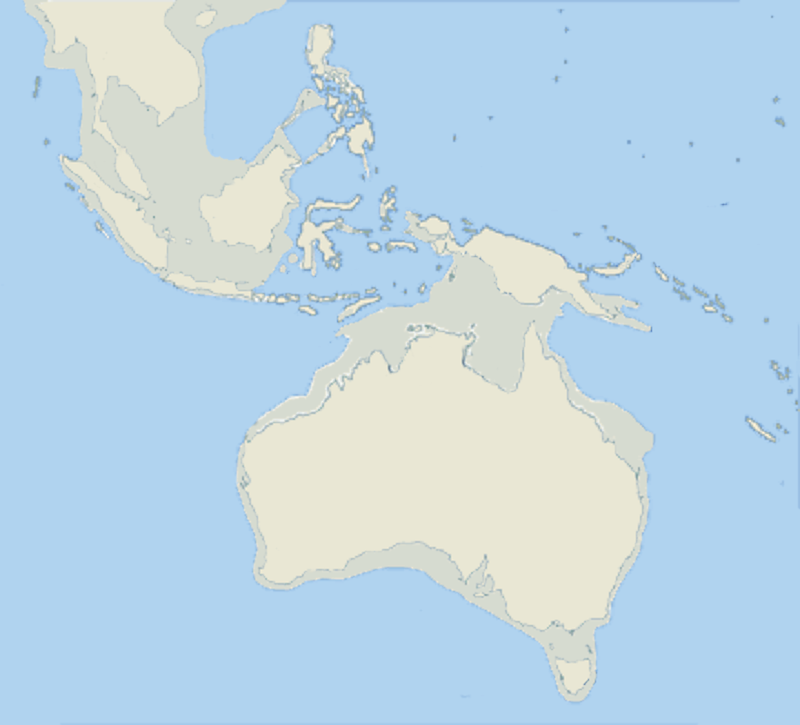
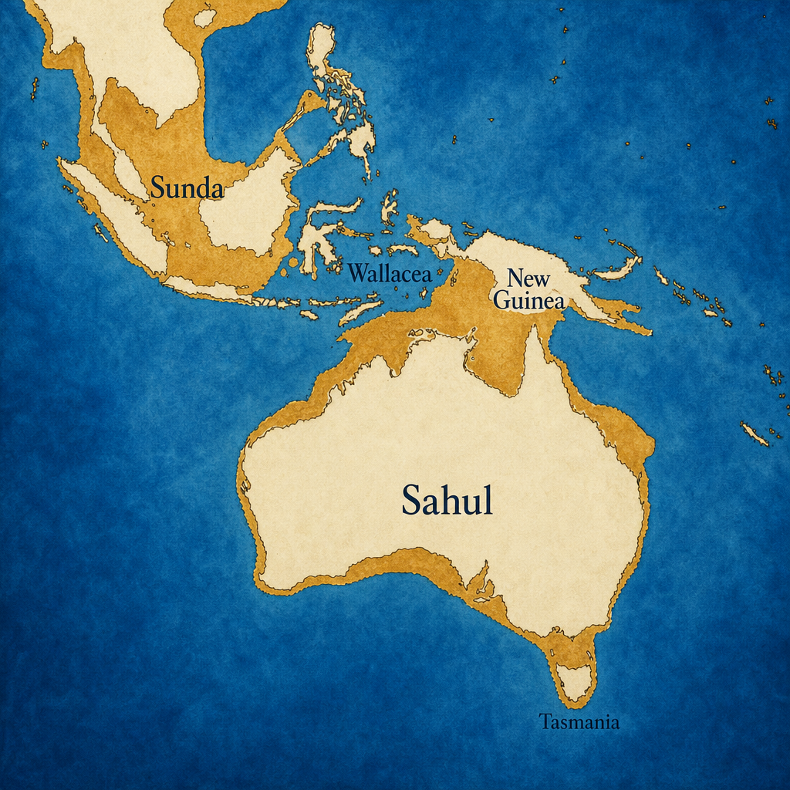
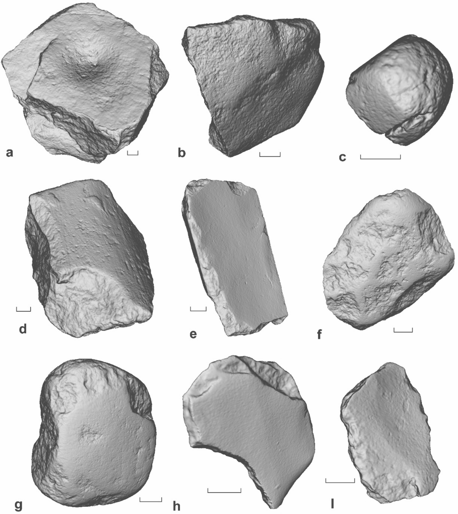

# Crossing to Sahul research and editorial note

Date: 2026-09-03
Lesson ID: `lesson.humans.sahul-crossing`
World Spine position: 3
Journey/chapter/position: `journey.world-history` / `chapter.world-history.human-beginnings` / entry position 2
Linear: [ASH-109](https://linear.app/ashs-workshop/issue/ASH-109/research-and-publish-crossing-to-sahul)
Queue status: **Review**
Accountable reviewer: Carlin Aylsworth
Validation tier: **high-risk**

## Product-owner approval to finish the build

Carlin approved the revised lesson and directed completion on 2026-09-03: “perfect. please finish that lesson build from here”. This records approval of the existing prototype and planned media/card direction. Proceed from Stage 15 without repeating the historical research or writing pass. Final image fidelity and provenance checks remain implementation duties.

## Current editorial revision — 2026-09-03

Carlin requested a second pass on section structure and page writing for preteen–teen learners, explicitly excluding a repeat of research. This revision re-enters Stage 14A using the existing source ledger, claims, and research-direction disposition. Research Stages 0–3B have not been repeated. The historical scope, media teaching jobs, no-card prototype, six required sections, and two sincere-attempt prompts remain in place.

The revised page follows geography → required sea travel → planning → dating evidence → other evidence → World Check. Planning now follows the obstacle it explains. Headings name their subjects, the Madjedbebe explanation distinguishes younger tools from older surrounding sand, and the ending gives later coastal traditions their own context. The selection prompt now tests what researchers must establish about tools and sand, with plausible alternatives instead of obviously impossible answers. Its learning objective and correct-option ID are retained; replacement distractors have new IDs.

Current preview: [Crossing to Sahul](http://localhost:3001/learn/lesson.humans.sahul-crossing). Launch with `npm run lesson:preview -- --lesson lesson.humans.sahul-crossing`; the available port may differ. The revised prototype was approved by Carlin on 2026-09-03; final implementation is in progress. Earlier review records below describe the earlier wording and are retained as history; the current review is recorded here.

### Review of the revised text

Reviewer: independent AI editorial proxy, 2026-09-03. Supplied the raw typed lesson and quality contract without the author's diagnosis. This was a text review, not observed behavior from a human learner and not product approval.

| Area | Finding | Disposition |
| --- | --- | --- |
| Mental model and sequence | Pass: geography establishes the obstacle, models explain planning, and sand–tool association explains the dating disagreement. | No change required. |
| Prose, headings, and cognitive load | Pass: subject headings, defined vocabulary, and short paragraphs support two distinct reasoning tasks. | No change required. |
| Evidence and prompts | Pass: the date applies to sand; association with tools must be established. Model assumptions and limits are explicit. Both prompts are answerable from the page. | No change required. |
| Planning knowledge module | Revise: “Travelling together” suggests simultaneous travel although the detail allows several journeys. | Changed to “Enough people arriving”; the introduction now describes conditions for settlement rather than treating every item as a choice. |
| Visual teaching | Existing map and site-evidence intentions remain pending. | Text carries the explanation during prototype review; final assets remain behind approval. |

### Verification of the revision

- Content validation and the deterministic prototype gate passed.
- Both targeted test files passed: five tests covering draft visibility, journey placement, and Learn-shell rendering. Existing heading/date assertions were updated to match the revised copy.
- Browser checks passed at 1440 × 900 and 390 × 844 in light and dark themes, with six sections, working prompt inputs, no horizontal overflow, and no page or console errors. Representative screenshots were visually inspected. Evidence is in `tmp/sahul-rewrite-visual/` locally.
- Full TypeScript checking reports 62 errors. A compiler comparison against the original `HEAD` versions of both changed TypeScript files produces exactly the same 62 diagnostics (file, code, and message): this editorial revision introduces none. Local comparison evidence: `tmp/rewrite-typecheck-comparison.json`.
- No research, final-media production, publication migrations, or hosted content changes were performed.

The requested writing pass is complete. Carlin's review of this revised draft remains the learner-prototype approval step before further lesson production.

## Work boundary (Stages 0–1)

This lesson teaches the evidence problem behind early settlement of Sahul (Australia + New Guinea connected during lower sea levels) through **sea crossing planning and water travel** long before states or farming. It should sit directly after the “Migrations, Encounters, and Ancient DNA” lesson so learners continue the same method: start from surviving evidence, then reason about what it can and cannot prove about timing, routes, and intentions. This note is the durable research/editorial record. Stages 0–3B were shared with Carlin on 2026-09-03. Carlin returned editorial discretion the same day, with an explicit instruction to keep a preteen mind in view. Stages 4–14B follow that disposition. The Learn-shell prototype remains `status: "draft"` and production-fail-closed.

Non-goals/deferred material:

- Later “Ice Age lifeways” (canonical successor) and the peopling of the Americas.
- A complete biography of Sahul environments or a comprehensive island-by-island archaeology catalog.
- Treating any “first arrival” as a solved march; “first” must remain an evidence-bounded claim.

## Node proposal

| Field | Decision |
| --- | --- |
| Stable lesson ID | `lesson.humans.sahul-crossing` |
| Learner-facing title | **Crossing to Sahul** |
| Essential question | What does the evidence allow us to say about when and how people reached Australia–New Guinea across open water? |
| Durable understanding | People reached Sahul by crossing open water tens of thousands of years before farming. Voyage models support planned travel, while tools and dated sand help estimate when people were living there. The earliest dates remain debated, and no watercraft from these journeys has been found. |
| Supporting understandings | (1) OSL/ESR/U-series dating can estimate ages of occupation layers but can be disturbed by site-formation processes; (2) genetic studies can suggest settlement time windows and multiple groups, but not precise landfall points; (3) route models (palaeo-shorelines and inter-island visibility) turn sea-level assumptions into testable predictions; (4) “intentional vs accidental” crossings can be argued from drift and probability models even though no watercraft survives; (5) extinction correlations can be discussed without turning them into a single-cause story. |
| Evidence encounter | The Madjedbebe/“Malakunanja II” OSL record as a case where dating method + stratigraphic integrity decide whether an early arrival is credible. |
| Prerequisites | Learners can already reason about how evidence (in that case, ancient DNA) supports some parts of a story and not others. |
| Common misconceptions to prevent | “First arrival” dates are exact; “DNA means we know the whole route”; open-water travel must imply a single universal boat technology; Indigenous oral stories are either purely literal or purely fantasy. |
| Scope boundary — dates/places/actors | **At least** c. 65,000–50,000 years ago; Sahul as the receiving region; the route region is Wallacea/nearby islands as needed for “open water” reasoning. Focus on earliest settlement constraints rather than later population history. |
| Why this is one lesson | All core sub-questions (timing, routes, and intent) share the same evidence logic: dating uncertainty + inference limits + model assumptions. Splitting would duplicate that method. |
| Bridge from previous lesson | Migrations ended with “reaching Sahul would require another kind of movement: crossing open water.” This lesson begins by testing what “another kind” really means in evidence terms. |
| Bridge to next lesson | After learning how uncertain early settlement evidence is handled, the next lesson can safely shift to what lifeways likely looked like after people were established. |

## Research questions (Stage 2 plan)

1. What is the strongest, most inspectable evidence for earliest Sahul settlement timing, and where exactly do the biggest dating disagreements concentrate?
2. Which site-formation and sampling assumptions most change whether ages near ~65 ka are credible versus whether “short chronology” near ~50 ka is more plausible?
3. What can genetic models legitimately infer about the number of groups and broad time windows—and what do they still not pin down (e.g., landfall points)?
4. Which route models (inter-island visibility, palaeo-shorelines, voyage/dritt modeling) are most sensitive to sea-level and uplift assumptions, and how could those models be distinguished by future observations?
5. Does any evidence connect early people to Sahul megafauna extinction timing strongly enough to teach it as an uncertainty-managed correlation rather than a neat cause-and-effect story?
6. What Indigenous-transmitted accounts can be included responsibly as **later tradition** tied to sea-level change, without implying they preserve a literal ~65 ka “arrival event” record?

## Source ledger

| Source ID | Citation/link | Type/authority | Claims supported | Limits/bias | Corroboration | Rights | Review |
| --- | --- | --- | --- | --- | --- | --- | --- |
| `source.humans.clarkson-2017-madjedbebe` | Clarkson et al., “Human occupation of northern Australia by 65,000 years ago” (Nature, 2017): https://www.nature.com/articles/nature22968 | Primary site study + dated chronology | Earliest archaeological occupation timing at Madjedbebe; stratigraphic and OSL method choices | Paywalled full methods may limit full provenance inspection in this workflow; conclusions depend on sampling/association | Supports “long chronology” broadly | Research-only citation use | review-required |
| `source.humans.allen-oconnell-2014-short-chronology` | Allen & O’Connell (Australian Archaeology, 2014): https://doi.org/10.1080/03122417.2014.11682025 | Review/updated evidence synthesis | “Short chronology” event horizon near but short of ~50 ka | Still a synthesis; depends on included datasets | Contrasts with long-chronology archaeology | Research-only citation use | review-required |
| `source.humans.veth-2025-madjedbebe-comment` | Veth et al., “Do Recent DNA Studies Refute a 65 kya Arrival of Humans in Sahul?” (Archaeology in Oceania, 2025): https://doi.org/10.1002/arco.70005 | Challenge/comment on the 65 ka debate | Argues Madjedbebe age association and site-formation models remain insufficiently resolved to reject 65 ka outright | This is a comment/challenge; may not provide new primary dating | Acts as an internal critique | Research-only citation use | review-required |
| `source.humans.gandini-2025-long-chronology` | Gandini et al., “Genomic evidence supports the ‘long chronology’ for the peopling of Sahul” (Science Advances, 2025): https://doi.org/10.1126/sciadv.ady9493 | Large genetic dataset + model inference | Broad time window and support for multiple routes | Genetic clocks rely on mutation-rate assumptions; models can be sensitive to calibration | Genetic long-chronology supports archaeology timing | Research-only citation use | review-required |
| `source.humans.pedro-2020-papuan-mtdna` | “Papuan mitochondrial genomes and the settlement of Sahul” (Journal of Human Genetics, 2020): https://www.nature.com/articles/s10038-020-0781-3 | Genetic analysis of maternal lineages | Two-group timing and north/south structuring; limitations on precision | mtDNA is only maternal; authors infer broad windows rather than landfall | Supports multi-group window (~50–65 ka) | Research-only citation use | review-required |
| `source.humans.bird-2019-not-accident` | “Early human settlement of Sahul was not an accident” (Scientific Reports, 2019): https://www.nature.com/articles/s41598-019-42946-9 | Drift + probability + visibility modeling | Intentional planning plausibility for open-sea crossings; constraints on accidental drift | Models depend on assumptions about craft speed, departure times, and survival | Corroborates “planning needed” inference from route distances | Research-only citation use | review-required |
| `source.humans.kealy-2017-visibility` | Kealy, Louys & O’Connor, “Reconstructing Palaeogeography and Inter-island Visibility…” (Archaeological Prospection, 2017): https://doi.org/10.1002/arp.1570 | Palaeogeography recon + intervisibility mapping | Route-model predictions (including Timor–Australia intervisibility at some times) | Highly sensitive to sea-level/uptift reconstruction and modelling choices | Often used as a baseline for survey | Research-only citation use | review-required |
| `source.humans.bird-2018-timor-roti` | Bird et al., “Palaeogeography and voyage modeling indicates… from Timor-Roti” (Quaternary Science Reviews, 2018): https://doi.org/10.1016/j.quascirev.2018.04.027 | Voyage modeling + bathymetry + drift | Possible initial entry from Timor-Roti; intentional voyage plausibility | Accidental vs purposeful depends on craft and drift assumptions | Contrasts with or complements northern-route arguments | Research-only citation use | review-required |
| `source.humans.johnson-et-al-2016-megafauna` | Johnson et al., “What caused extinction of the Pleistocene megafauna of Sahul?” (Proc. R. Soc. B, 2016): https://pmc.ncbi.nlm.nih.gov/articles/PMC4760161/ | Systematic review | How strong (or weak) the link between human arrival and extinction timing can be | Extinction timing still depends on patchy fossil record dating | Provides “teach the correlation carefully” basis | Research-only citation use | review-required |
| `source.humans.nunn-reid-2016-inundation` | “Aboriginal Memories of Inundation of the Australian Coast…” (2015): https://doi.org/10.1080/00049182.2015.1077539 | Indigenous-transmitted accounts interpreted alongside sea-level chronologies | Later-tradition evidence for sea-level rise as a real landscape change | Doesn’t preserve a literal ~65 ka arrival record; mainly post-glacial | Corroborates the reality of sea-level rise and local submergence stories | Research-only citation use | review-required |

## Recent-challenge audit (Stages 3A–3B)

### Baseline account that would otherwise be inherited

From the previous lesson, the inherited baseline is: reaching Sahul required **crossing open water**, and we can treat “when” as an evidence problem because both archaeology (site formation + dating) and genetics (clock assumptions + limited ancient samples) have limits. A provisional learning stance for this lesson is: earliest Sahul settlement is likely **at least around ~50 ka** with substantial uncertainty, and possibly earlier evidence exists; the lesson should teach how we reason through that uncertainty rather than pick a single triumphal “march” date.

### Default search window and any extension

- Default audit window: approximately the previous 50 years (plus older foundational dating debates needed to locate why a “revision” is consequential).
- Extended where needed to include widely cited methodological critiques and foundational chronologies that still structure current arguments.

| Revision/upset and consequence | Origin/current form | Evidence/provenance | Method and inferential link | Independent corroboration | Strongest countercase | Discriminating test | Status | Lesson consequence |
| --- | --- | --- | --- | --- | --- | --- | --- | --- |
| **65 ka (“long chronology”) vs ~50 ka (“short chronology”)** — changes which date learners treat as plausible earliest arrival and how much confidence we assign | Archaeological expansion of Madjedbebe OSL evidence (long chronology) vs conservative dating syntheses and critiques (short chronology) | Madjedbebe dated sediments and associated artifact layers (OSL + Bayesian modelling); critiques argue mixing/association uncertainty | OSL/thermoluminescence age estimates translate into earliest possible occupation; Bayesian modelling chooses start/end for dense occupation bands; stratigraphic integrity decides whether artifacts belong to those ages | Genetic long-chronology models interpret broad windows ~60–65 ka as compatible with population history | Opponents emphasize site-formation risk, sediment/artefact association problems, and genetic clock constraints | Re-sampling with improved microstratigraphic controls; new excavations that directly connect dated materials to diagnostic cultural layers | Unresolved conflict | Make timing a taught evidence problem: teach a plausible window (and “why”) rather than a single “exact” date |
| **Reliability of very old human-remains dates (e.g., Lake Mungo 3)** — changes whether “earliest humans” can be anchored with remains vs sediments | Late 20th-century old-date claims and later critiques | Dating of human remains using combinations like ESR/U-series/OSL and associated sediments | Different dating targets can diverge if uranium mobilization, moisture history, or burial-state assumptions are wrong | Multiple dating methods can agree (support) or conflict (challenge) depending on modelling | Critics argue uranium/ESR/OSL assumptions or modelling mismatches can overstate age | Improved dating of remains with careful context, plus cross-check with the surrounding sediment-age envelope | Unresolved conflict | Either include briefly as “a debated anchor” or keep focus on one well-inspected occupation record to avoid mixing different evidence types |
| **One vs multiple migration waves / multiple routes** — changes lesson emphasis from “a single founding moment” to “group founding in a time window” | Genetic chronologies increasingly interpreted as multi-group and multi-route | Large mitogenome/nuclear datasets; models inferred from lineage coalescence and mutation rates | Clocks and demographic models map genetic relationships to likely settlement windows; routing inferred from structure and comparison to island/seascape modelling | Independent genetic datasets support settlement windows roughly ~50–65 ka and north/south structure | If mutation-rate calibrations or introgression timing assumptions shift, the inferred window can change | Add more ancient genomes/lineage anchors; refine mutation-rate calibration and test alternative demographic models | Supported inference but still contested | Present “multiple groups and routes are plausible” as a model, not a certainty; distinguish “broad time window” from “exact landfall” |
| **Northern route vs southern route** — changes which “first landfall area” learners treat as more likely | Route modelling disputes based on visibility, palaeo-shorelines, and drift | Palaeogeographic reconstructions (sea level + uplift) and visibility/voyage modelling | Turn sea-level assumptions into habitable land connectivity + intervisibility; drift modelling turns craft assumptions into crossing probabilities | Some route models converge on “at least one successful route” even when details differ | Different model choices (sea level, uplift, craft parameters) can flip “most parsimonious” | Sensitivity tests using alternative sea-level curves and uplift rates; targeted surveys on predicted islands | Unresolved conflict | Teach the route reasoning skill explicitly: “models depend on assumptions” |
| **Megafauna extinction correlation** — may tempt learners into a single-cause story about humans arriving and instantly changing ecosystems | Two camps: human-driven with timing windows vs climate-driven or patchy-extinction records | Dated fossil occurrences and review syntheses | Correlate last-appearance dates of species with human arrival time; must account for sampling and dating quality | Systematic reviews highlight where multiple independent lines converge | Patchy fossil record and uneven dating makes “extinction window” too neat in some regions | Improve extinction-event dating in key sequences; compare within-region and across-region evidence quality | Unresolved conflict | Either defer to an Investigation-style add-on or include only as a careful “correlation that doesn’t prove direct cause” |
| **Intentional planning vs accidental drift/watercraft** — affects how “planning” should be taught | Probability/intentionality modelling vs drift/accidental arrival proposals | Drift modelling + visibility + population/launch probabilities | Convert ocean drift + craft parameters into arrival probability; infer that low-probability scenarios require deliberate choice | Reinforces that open-water travel is hard by chance, but still model-based | Unknown craft type and survival constraints; “<5%” probabilities depend on assumptions | Sensitivity analysis across plausible craft and survival parameters; look for archaeological traces of maritime adaptation | Supported inference, with limits | Keep “planning required” as a taught inference bounded by uncertainty (no direct watercraft evidence) |
| **Indigenous-transmitted sea-level stories (later tradition)** — affects lesson content tone and evidence status | Interpretation of submergence stories across the post-glacial sea-level rise | Indigenous accounts interpreted alongside sea-level change chronologies | Treat as later tradition: correlations with sea-level drowning provide landscape change plausibility | Independent sea-level reconstructions corroborate drowned coasts | Stories do not preserve exact 65 ka arrival events | Compare story-region timing envelopes to established sea-level envelopes; keep scope bounded to later transformations | Later tradition with plausible correlation | Use only for “later tradition about sea-level rise,” not for early settlement date claims |

### Ancient, Indigenous, local, descendant, or otherwise transmitted accounts considered

- Indigenous Australian “submergence” stories are considered as **later tradition** tied to post-glacial coastline drowning, and thus relevant for discussing that sea-level rise changed lived landscapes. They are not treated as direct evidence of the ~65 ka crossing event itself.

### Comparative analyses considered

- Comparative voyage modelling in island southeast Asia and Wallacea for the plausibility of directional maritime voyages (drift + seasonal departure modelling).
- Inter-island visibility and palaeogeography reconstructions used to test multiple route hypotheses.
- Comparative megafauna-extinction method issues: how to interpret extinction windows when dating quality varies.

### Coverage statement

- Search terms and terminology variants used (representative): “Sahul colonization long chronology short chronology”, “Madjedbebe OSL Bayesian OxCal”, “Lake Mungo 3 ESR U-series OSL reliability”, “intentional vs accidental drift Sahul”, “Timor-Roti voyage modeling”, “inter-island visibility Wallacea 65–45 ka”, “Papuan mitochondrial genomes settlement of Sahul”, “megafauna extinction window 50–40 ka”, “submergence stories sea level rise Aboriginal”.
- Repositories consulted: Nature (including Scientific Reports and Nature Communications), Science Advances, PMC open articles, major archaeology journals (paywalls acknowledged), and DOI landing pages.
- Disciplines and evidence classes: archaeology + dating method, palaeoenvironment/sea-level reconstruction, voyage/drift modelling, population genetics and demographic modelling, systematic review of megafauna extinction, and Indigenous-transmitted sea-level submergence interpretations.
- Independent or claim-owner channels: comment/challenge literature on Madjedbebe dating and genetic-model implications; systematic reviews that explicitly address bias and uncertainty.
- Inaccessible evidence: some primary methodological details remain difficult to verify fully from paywalled full-text during this Stage 0–3B workflow; where that happens, the research note records the limitation and treats the inference as provisional.
- Known gaps:
  - A deeper, side-by-side reading of multiple short-chronology critiques beyond the two anchor syntheses.
  - Additional evidence beyond the Madjedbebe debate for the exact “start” of occupation (because the lesson must remain bounded and avoid turning into a catalog).

### Research-direction packet and product-owner response (Stages 3A–3B)

#### Provisional synthesis (what we think is most likely right now)

1. **Timing:** The strongest “earlier-than-50 ka” argument in accessible sources centers on Madjedbebe’s OSL record and Bayesian modelling, pointing to a plausible occupation window that can extend to about ~65 ka. At the same time, multiple scholars argue that other constraints and dating-model assumptions make anchoring “exact” early arrivals too risky, and a conservative ~50 ka event horizon remains a serious alternative.
2. **Multiple groups and routes:** Genetic evidence increasingly supports settlement within a broad window (~50–65 ka) and suggests population structuring consistent with at least two migration streams (northern and southern Sahul). This is support for “broad window + structuring,” not a precise map of landfall points.
3. **Routes and planning:** Route modelling (sea-level + uplift assumptions producing habitable island chains and intervisibility) plus drift/probability modelling both point toward “open water is too hard by chance” unless watercraft planning is involved. Even without surviving watercraft, the inference can be taught as a bounded, assumption-sensitive model.
4. **Correlation temptations:** Megafauna extinction timing could support human impacts, but dating quality and fossil-record patchiness mean the lesson must treat any timing overlap as a correlation unless stronger evidence is established for specific sequences.
5. **Later tradition:** Indigenous submergence stories are best used to ground how changing coastlines affected later human-landscapes, while being explicit that they are later tradition rather than direct evidence of the earliest crossing.

#### Possible effect on essential question and central argument

The lesson can remain coherent if its central argument becomes: **early Sahul settlement is plausible in a wide time window, but learners must learn to reason from evidence limits—especially dating association and model assumptions—rather than treat “first arrival” as exact.** The lesson should teach “planning for crossings” as an evidence-bounded inference, not as a hidden certainty.

#### Required main-lesson highlights (candidate)

1. An evidence-based case study: what makes Madjedbebe credible (or contestable) when artifacts and dated sediments might not be perfectly synchronized.
2. Evidence-type contrast: archaeology can estimate occupation timing at particular sites; genetics can support broad windows and population structuring; neither can directly provide a complete travel route.
3. Route reasoning as a method: how sea-level and visibility modelling changes what “could be reached” means, and why route “most parsimonious” is not the same as “proven landfall.”
4. Intent vs accident as a probability inference: drift modelling can make “accidental drift” implausible under some assumptions, which supports planning, while still leaving craft details unknown.
5. A disciplined uncertainty stance: we can say “open water crossing likely required planning” without claiming a specific boat technology or precise landing date.

#### Story Arc / Investigation depth candidates

- Investigation candidate: “Which part of the story is evidence, and which part is inference?” using a single site’s dating plus a route model’s assumptions.
- Investigation candidate (optional later): “How do extinction timelines stay uncertain when the fossil record is patchy?” (kept short and uncertainty-forward).

#### Judgments or further research requested from product owner

1. Should the lesson’s **core chronology** be taught as a **range** (“at least by ~50 ka, possibly ~65 ka depending on association and stratigraphic integrity”) rather than choosing one date as the “answer”?
2. Should we make the **two-route / two-group** genetic model a central through-line (with uncertainty language), or keep it as a supporting explanation after learners learn the evidence-type contrast?
3. For “intentional vs accidental,” should the lesson emphasize “planning needed” as the main conclusion, or keep the endpoint more cautious (e.g., “accidental drift seems less likely under some models”)?
4. Should megafauna extinction overlap appear inside the main story, or be deferred as a short uncertainty-managed sidebar to avoid distracting from early crossing evidence?
5. Should Indigenous sea-level stories be mentioned at all in the early section, or reserved for an uncertainty/evidence-limit callout about later tradition?

Packet shared (date/link): 2026-09-03 in the lesson-production thread; research note `docs/research/crossing-to-sahul.md`

### Product-owner response

Date: 2026-09-03. Carlin granted editorial discretion on all five Stage 3B questions and asked that choices keep a preteen mind in view.

Locked dispositions:

1. **Chronology is a range.** Teach that people were in Sahul by about 50,000 years ago, and that some sites may be older, around 65,000. Do not pick a single “first day.”
2. **Genetics stay supporting, not central.** After the dating encounter, one short beat: DNA can support a broad time window. It cannot draw the boat path. No two-route haplogroup spine.
3. **Planning is the memorable conclusion, with a bound.** Accidental wash-up is a weak explanation for founding a lasting population. People almost certainly used watercraft and chose when to go. We do not know the craft.
4. **Megafauna extinction is deferred.** Giant-animal stories would hijack a preteen lesson away from the crossing evidence problem. Keep them out of this node.
5. **Indigenous sea-level stories are later tradition only.** One later-tradition sentence: some community stories remember later drowned coasts. They are not a 65,000-year arrival record.

Follow-up research: none required before prototype. The historical model did not change enough to repeat Stages 3A–3B.

## Claim ledger

Stage 15 visual-source addition: `claim.humans.sahul.recovered-grinding-stones` records that Hayes et al. (2022), Figure 2, shows 3-D scans of recovered grinding stones from multiple phases, each with a 2 cm scale bar. This supports the new evidence caption without changing the approved chronology or planning model.

| Claim ID and wording | Kind | Certainty | Sources | Counterevidence/limits | Missing perspective | Learner treatment | Review |
| --- | --- | --- | --- | --- | --- | --- | --- |
| `claim.humans.sahul.connected-landmass` — At lower Ice Age sea levels, Australia, New Guinea, and Tasmania formed one landmass now called Sahul. | observation | high | Clarkson 2017; Bird et al. 2019 | The name is modern; coastlines changed through the period. | Later drowned-shelf communities are poorly preserved. | State directly | editorial-review-required |
| `claim.humans.sahul.no-land-bridge` — The islands of Wallacea were never joined by land to Sahul, so any route required water crossings. | observation | high | Kealy et al. 2017; Bird et al. 2019 | Crossing distances change with sea level. | Island names and craft types used by the travellers are unknown. | State directly | editorial-review-required |
| `claim.humans.sahul.present-by-50ka` — People were living in Sahul by about 50,000 years ago. | interpretation | high | Allen & O’Connell 2014; Clarkson 2017; Bird et al. 2019 | This is a conservative floor, not a first-day date. | Most early sites are still unexcavated, especially on now-drowned shelves. | State directly as the safer end of the window | editorial-review-required |
| `claim.humans.sahul.madjedbebe-window` — At Madjedbebe, tools sit in sand dated by some teams to about 65,000 years ago; other researchers argue mixing could make the occupation younger. | interpretation | contested | Clarkson 2017; Veth et al. 2025; Allen & O’Connell 2014 | Site-formation and artefact–sediment association are the live dispute. | Mirarr Traditional Owners hold the Country; the published debate is mainly a dating argument. | Compare interpretations; do not crown a winner | editorial-review-required |
| `claim.humans.sahul.osl-dates-sand` — The dates at Madjedbebe come from when sand grains last saw sunlight, not from a stamp on the tools. | observation | high | Clarkson 2017 | If later trampling pushed older tools down, the sand date and the visit date can part. | Learners never see the lab; keep the mechanism concrete. | State directly | editorial-review-required |
| `claim.humans.sahul.planning-inferred` — Accidental drifting is a weak explanation for founding a lasting population; people almost certainly planned water travel. | interpretation | moderate | Bird et al. 2019; Bird et al. 2018 | Models depend on craft speed, season, and survival assumptions. No boat survives. | We cannot recover names, languages, or how the travellers understood the trip. | State as the best-supported inference, then bound it | editorial-review-required |
| `claim.humans.sahul.no-surviving-craft` — No watercraft from this crossing survives in the archaeological record. | observation | high | Bird et al. 2018; Bird et al. 2019 | Absence of boats is not absence of boats in the past; wood and fibre rot. | Craft knowledge may survive in later traditions, which this lesson does not treat as the first-crossing record. | State directly | editorial-review-required |
| `claim.humans.sahul.dna-window-not-route` — DNA from living and sampled people can support a broad settlement window; it cannot draw the exact crossing path. | interpretation | high | Gandini et al. 2025; Pedro et al. 2020 | Mutation-rate and demographic models can shift the window. | Ancient DNA from the first landings is missing. | Qualify; keep short | editorial-review-required |
| `claim.humans.sahul.later-sea-stories` — Some Indigenous Australian stories remember later drowned coasts after ice sheets melted; those stories are later tradition, not a record of the first crossing. | later-tradition | moderate | Nunn & Reid 2016 | Stories map onto Holocene sea-level rise (~13,000–7,500 years ago), not ~65 ka. | Many stories are local and should not be flattened into one national myth. | One sentence in the limits section | editorial-review-required |

## Content triage

| Candidate idea | Essential/supporting/enrichment/deferred/rejected | Why | Destination |
| --- | --- | --- | --- |
| Sahul as a connected Pleistocene landmass | Essential | Learners cannot reason about a crossing without knowing the receiving land. | Opening section |
| Wallacea / no land bridge | Essential | Makes “open water” a geographic fact, not a slogan. | Second section |
| Madjedbebe OSL + association debate | Essential | Concrete evidence encounter for the dating window. | Fourth section |
| Planning vs accidental drift | Essential | This is the capability the node exists to teach. | Third section |
| DNA as a broad window, not a route | Supporting | Continues the previous lesson’s method without repeating it. | Limits section |
| Northern vs southern route models | Enrichment, kept one-line | Too many maps for a first pass; one sentence that more than one island path is possible. | Planned map caption / limits |
| Megafauna extinction | Deferred | Exciting, but it would steal the lesson. | Ice Age / later Investigation |
| Lake Mungo burial dating fight | Deferred | A second dating controversy would overload the Madjedbebe encounter. | Research note only |
| Denisovan ancestry in Sahul populations | Deferred | Already seeded in Migrations; not needed to teach the crossing. | Stay in predecessor |
| Ice Age lifeways after arrival | Deferred | Canonical successor; do not start it. | `lesson.humans.ice-age-lifeways` |
| Exact boat reconstruction | Rejected | No surviving craft; a picture of “the boat” would fake evidence. | No media of that kind |
| “First humans in Australia” as a solved march | Rejected | Contradicts the evidence problem this node exists to teach. | — |

## Learning blueprint

Essential question: What does the evidence allow us to say about when and how people reached Australia–New Guinea across open water?

Durable understanding: People reached Sahul by crossing open water tens of thousands of years before farming. Voyage models support planned travel, while tools and dated sand help estimate when people were living there. The earliest dates remain debated, and no watercraft from these journeys has been found.

Supporting understandings:

1. Lower seas connected Australia, New Guinea, and Tasmania into Sahul.
2. Deep channels remained, so reaching Sahul required sea travel.
3. Dating the sand around tools helps date human activity only if the tools belong to that layer.
4. Models make accidental founding unlikely; that supports planning without recovering the craft.
5. DNA can back a broad window and cannot draw the path.

Prerequisites: The previous lesson’s habit of asking what a method can and cannot prove.

Misconceptions: an exact first day; a land bridge to Australia; DNA as a GPS track; a known Ice Age boat; later sea stories as the arrival event.

Indispensable vocabulary: Sahul; Wallacea; crossing; sand dating (defined in use as a sunlight clock on buried grains); later tradition.

Evidence encounter: Madjedbebe tools in dated sand.

Historical-thinking move: Distinguish a date on sediment from a date on a visit, then use a model as an argument rather than as a photograph.

Required sincere-attempt evidence: one supported selection about what the sand date can show; one short explanation of why planning is inferred and what still cannot be proved.

Bridge to next authored journey lesson: Many Beginnings of Farming. Ice Age lifeways is the canonical successor and is not built here.

## Section/component storyboard

Heading voice: each learner-facing heading names the subject or job in ordinary words.

| Order | Section ID | Learner-facing heading | Authoring purpose (not shown) | Claims/sources | Module | Media/action | Transition |
| --- | --- | --- | --- | --- | --- | --- | --- |
| 1 | `section.humans.sahul.landmass` | Sahul in the Ice Age | Orient time, place, and the name Sahul | connected-landmass; no-land-bridge | prose + knowledge | Planned map of lowered-sea Sahul | Establish the sea barrier |
| 2 | `section.humans.sahul.open-water` | Reaching Sahul by sea | Explain required crossings and the difference between arrival and settlement | no-land-bridge; planning-inferred | prose | No additional media | Ask how enough people arrived |
| 3 | `section.humans.sahul.planned-crossing` | Planning a sea crossing | Explain voyage models and their assumptions | planning-inferred; no-surviving-craft | prose + knowledge | No reconstruction of a boat | Turn from how to when |
| 4 | `section.humans.sahul.dated-sand` | Dating the earliest settlements | Distinguish the date of sand from the date of tools buried in it | osl-dates-sand; madjedbebe-window; present-by-50ka | prose + knowledge | Planned evidence photo of the shelter or tools | Broaden to other evidence |
| 5 | `section.humans.sahul.what-we-can-know` | What other evidence can tell us | Explain DNA and later coastal traditions, then resolve the opening question | dna-window-not-route; later-sea-stories; planning-inferred; present-by-50ka | prose | not-needed | Apply the reasoning |
| 6 | `section.humans.sahul.world-check` | World Check | Two sincere-attempt prompts | — | prompt × 2 | none | Completion; next published/openable World History lesson |

Section-count exception: none.

## Media decisions

| Intention ID | Section ID | Teaching question | Form | Evidence/claim basis | Depiction label | Accessible equivalent | Stage 14A treatment | Final review |
| --- | --- | --- | --- | --- | --- | --- | --- | --- |
| `media.intention.sahul.landmass-map` | `section.humans.sahul.landmass` | Where was Sahul, and where was the water? | historical-map | connected-landmass; no-land-bridge; Kealy 2017; Bird 2019 | Evidence-based palaeogeography · lowered sea level | Accessible summary of Sunda / Wallacea / Sahul | Planned annotation only | pending |
| `media.intention.sahul.madjedbebe-evidence` | `section.humans.sahul.dated-sand` | What was found, and what was dated? | evidence object or site photograph | osl-dates-sand; Clarkson 2017 | Surviving evidence · tools and dated sediment | Alt describing tools in a rock shelter, not a reconstructed landing | Planned annotation only | pending |

No reconstructed boat. No megafauna scene. No final assets in this increment.

## Image lifecycle

### `media.humans.sahul-landmass-map` — geography and Sahul place card

#### 1. Reasoning and source basis

- Teaching job: locate Sunda, Wallacea, and Sahul; distinguish connected land within Sahul from sea crossings needed to reach it. Reused for the Place / Foundation card.
- Governing claims: connected-landmass; no-land-bridge. [Map brief](sahul-map.md).
- Primary raster reference: [Maximilian Dörrbecker (Chumwa), Blank map of Sunda and Sahul](https://commons.wikimedia.org/wiki/File:Blank_map_of_Sunda_and_Sahul.png), October 2007. Independent cross-check: [Bird et al. 2019, Figure 1](https://www.nature.com/articles/s41598-019-42946-9), whose modelled routes are intentionally not reproduced.
- Ancient shelf boundaries are approximate and vary with sea level. The map is a broad Ice Age geographic comparison, not a dated first-crossing route or exact 65,000-year shoreline.

#### 2. Reference image actually used



- Creator: Maximilian Dörrbecker (Chumwa). License: [CC BY-SA 3.0](https://creativecommons.org/licenses/by-sa/3.0/), permits redistribution and adaptation with attribution and share-alike. Accessed 2026-09-03. Chronos derivative is also CC BY-SA 3.0.
- Reference: `docs/research/sahul-assets/sunda-sahul-reference.png`; SHA-256: `8636e9f476952e47a0a8743f57570f475c195f444479990c2f55b7d86b6d38a1`.
- Edit mode: style-only transformation. Lock aspect ratio, complete extent, north-up orientation, coastlines, island positions, Australia–New Guinea and Tasmania land connections, and all open sea channels. Distinguish today's dry land, additional exposed shelf, and water.
- Only permitted labels: Sunda, Wallacea, Sahul, New Guinea, Tasmania. No invented route, boats, people, settlements, legend, or educational paragraphs.

#### 3. Generation or transformation

- Tool: Cursor built-in image generator; model identifier not returned; 2026-09-04.
- Actual input: the Chumwa reference path and SHA-256 above.
- Rejected candidates: a pale low-contrast atlas pass (too worksheet-like); a gold-outline pass that reduced the Ice Age shelf to a rim instead of filled extra land.
- Accepted candidate: high-contrast cream present-day land, filled ochre shelf, deep mineral-blue sea. Product owner asked to finish and publish this pass.
- Complete prompt:

```text
Style-only edit of the ATTACHED reference map. Trace every coastline and island exactly. Do not invent geography.

CRITICAL COLOR LOGIC copied from the reference: pale cream = land that is dry TODAY. light grey-green filled shapes = ADDITIONAL land exposed when Ice Age seas were lower. blue = sea. You must FILL those entire grey-green shelf polygons with rich glowing ochre-bronze, not draw a gold outline around continents. The ochre must be a wide filled land area — especially the Arafura/Carpentaria join between Australia and New Guinea, the Bass Strait join to Tasmania, and the Sunda shelf joining Sumatra, Java, Borneo to the mainland. Wallacea stays a chain of islands with OPEN blue water between them. Never make a land bridge across Wallacea.

Make it beautiful: deep textured mineral-blue ocean, high contrast so a child sees extra land at a glance, crisp ink coasts, warm ivory paper, premium historical atlas. No mountains, boats, people, animals, arrows, compass, legend, title, or extra text.

Only labels, dark navy serif: Sunda, Wallacea (not Wallaceea), Sahul, New Guinea, Tasmania.
```

#### 4. Accepted final image

| Reference used | Accepted final |
| --- | --- |
|  |  |

- Final master: `docs/research/sahul-assets/sahul-map-master.png`, 1024 × 1024; SHA-256: `252b6b4d6adf06bf0a1ae16213998cab57e6baab147d07e4daaa47cf2b04c0a0`.
- Runtime source: `public/images/sahul/sahul-landmass-map.jpg`; SHA-256: `7b59ad4f05a9c991c2da363a56f505e413e2dd276b7eb8f8b8cb5eeea71b6728`. JPEG quality 95, 4:4:4 chroma; no crop. Responsive derivatives are produced by the repository pipeline.
- Reviewer/date/status: Product-owner visual direction 2026-09-04 (reject pale worksheet map; keep licensed stone scans; publish the filled-shelf atlas pass).
- Fidelity verdict: north-up extent, Wallacea sea gaps, Australia–New Guinea join, and Tasmania connection retained from the Chumwa reference. Shelf is painted as filled extra land, not an outline. Labels are Sunda, Wallacea, Sahul, New Guinea, Tasmania. No route, boat, or landing is asserted.
- The map module provides a complete native-text equivalent and states the shoreline limit. Card rendering uses contain and the source aspect ratio so the map is not cropped.

### `media.humans.madjedbebe-grinding-stones` — recovered objects

#### 1. Reasoning and source basis

- Teaching job: let learners inspect actual recovered objects, then distinguish an object's shape from evidence for its date. Governing claims: osl-dates-sand; madjedbebe-window.
- Source: [Hayes et al. 2022, Figure 2](https://doi.org/10.1038/s41598-022-15174-x). These are published 3-D scans, not photographs or AI reconstructions. Caption identifies stone a as GS32, C2-C3/37, Phase 2; other examples come from several phases. Every scale bar represents 2 cm.
- The main lesson's already-reviewed dating dispute is retained. The figure does not independently prove the age of the earliest occupation.

#### 2. Reference image actually used


- Creator: Chris Clarkson, Figure 2, in Hayes, Fullagar, Field and colleagues (2022). The publisher's author-contributions section credits Figures 1–2 to Clarkson.
- License: [CC BY 4.0](https://creativecommons.org/licenses/by/4.0/). The authoritative article's Rights and permissions section includes its images unless excluded by a credit line; Figure 2 has no exclusion. Accessed 2026-09-03.
- Source asset: https://media.springernature.com/full/springer-static/image/art%3A10.1038%2Fs41598-022-15174-x/MediaObjects/41598_2022_15174_Fig2_HTML.png
- Reference: `docs/research/sahul-assets/madjedbebe-stones-reference.png`, 1770 × 1987; SHA-256: `9fbbb7f5487b0617829ce585ed78eaceae25eed31a73af598076a9dad0a52b73`.
- Edit mode: direct licensed use. Preserve all nine objects, their positions, surfaces, panel letters, and scale bars.

#### 3. Generation or transformation

```text
No generation. Direct use of Figure 2. Convert the complete raster to JPEG at quality 95 with 4:4:4 chroma, then create responsive derivatives with the repository media pipeline. No crop, retouching, relabeling, rearrangement, or invented evidence.
```

- Tool/date: sharp, 2026-09-03. Input path and SHA-256 above.
- Candidate disposition: Figure 1 was inspected but its mixed site map, excavation grid, and scientific plots would add unnecessary load. Figure 2 supplies inspectable stones without requiring learners to read technical plots.

#### 4. Accepted final image

| Reference used | Accepted final |
| --- | --- |
|  |  |

- Archival master: unchanged reference above. Runtime: `public/images/sahul/madjedbebe-grinding-stones.jpg`; SHA-256: `0f7d7076cf66c618bffe921e3f405b8426c6f00686e8c039cc5964d27a9b7117`.
- Reviewer/date/status: Codex visual and provenance implementation review, 2026-09-03, accepted for direct licensed use.
- Fidelity verdict: same complete figure, objects, scale bars, and panel positions; compression only. Native caption identifies scans, differing periods, the top-left hollow, the 2 cm scale, and the limits of inferring age from appearance. No image is presented as an early voyage or a photo of dated sand.

Implementation visual choice: the site-photo candidate was replaced by direct licensed scans of recovered stones, within the approved object-or-site evidence role. The complete scan figure retains all scale bars and is explicitly identified as spanning different periods.

## Knowledge Card decision

Decision: **Sahul Place / Foundation card implemented**

Rationale: Sahul itself is the durable memory object — a named Ice Age landmass that makes the crossing make sense. A Place / Foundation card would earn its keep. It needs reviewed art and must not look like a first-landing reconstruction. The completed build reuses the reviewed Sahul map for the card, preserving its full geography. The card unlocks deterministically on explicit lesson completion.

Stable card ID: `card.place.sahul` · category `place` · class `foundation` · unlock `lesson.humans.sahul-crossing`.

## Prompt rationale

| Prompt ID | Required | Understanding/evidence assessed | Misconception exposed | Feedback job |
| --- | --- | --- | --- | --- |
| `prompt.humans.sahul.sand-date-supports` | yes | Establishing whether tools were buried with the dated sand | Confusing the age of surrounding sand, raw stone, or a shelter with the age of human activity | Explain why tools from a younger layer cannot be dated by the older sand around them |
| `prompt.humans.sahul.planning-and-limit` | yes | Why planning is inferred; name a limit | Inventing the craft, the route, or an accidental-only story | Reward the inference and the bound; 80-character minimum so both parts are attempted |

## Ages 11–14 transformations

- “Pleistocene palaeogeography of Sahul” → “When the sea was lower, Australia and New Guinea were one land. Researchers call that land Sahul.”
- OSL / Bayesian start ages → “A lab method asks when sand last saw sunlight. If tools sit in that sand and the layers were not mixed, the date can estimate when people were there.” The learner prose does not name the lab acronym.
- “Long vs short chronology” → two honest numbers a 12-year-old can hold: about 50,000, and maybe about 65,000.
- Mitochondrial haplogroups and northern/southern routes → one supporting sentence: DNA can back a broad window; it cannot draw the path.
- Drift-model probabilities → “Washing up by accident is a poor way to start a lasting community. Choosing a season and heading toward land makes arrival much more likely.”
- Megafauna → cut.
- Later tradition → one calm sentence, not a mystery hook.

## Journey framing

- Entry ID: `entry.world-history.sahul-crossing`
- Position: 2 in `chapter.world-history.human-beginnings`, after Migrations and before Many Beginnings.
- Framing: **Cross open water and ask what planning could support early settlement in Sahul.**
- Next authored action after completion: Many Beginnings of Farming. Ice Age lifeways is named only as a later canonical node and is not implied to exist as a built lesson.
- No optional journey invitation.

## Stage 14A — raw learner prototype checkpoint

State: **Complete.**

The unpublished lesson renders in the real Learn shell with preview unlocking, six required sections, both required prompts, and development-only visual-intention annotations. Production access remains fail-closed. No Knowledge Card, hero, or final media ships in this increment.

Validation and shell-review evidence (2026-09-03):

- `npm run validate:content` passed.
- `npm run lesson:gate -- --lesson lesson.humans.sahul-crossing --note docs/research/crossing-to-sahul.md --gate prototype` passed.
- Targeted tests passed for the lesson module, journey order, unpublished next-action skip, Learn fail-closed/preview render, content validation, and World Spine.
- Playwright checked `/learn/lesson.humans.sahul-crossing` at 1440 × 900 and 390 × 844 in light and dark. Six sections rendered; no horizontal overflow; no page or console errors. A fresh open began at the top.
- Prototype annotations appear after their sections and are labeled “Not learner content.” The limits section’s “not needed” annotation is present. No reconstructed boat is implied.
- Preteen-load edits before proxy close: the sand-dating paragraph no longer names the lab acronym; the planning knowledge item no longer mentions genetics (DNA stays in the limits section).

## Learner-prototype review

Prototype lesson ID: `lesson.humans.sahul-crossing`
Research-note identity/version: `docs/research/crossing-to-sahul.md` · 2026-09-03 Stages 4–14B
Preview route: `/learn/lesson.humans.sahul-crossing`
Preview flag: `VITE_UNLOCK_PREVIEW_LESSONS=true`
Launch: `npm run lesson:preview -- --lesson lesson.humans.sahul-crossing`
Prototype commit: `43c42be`
Draft PR: https://github.com/dev-vibe/chronos-learning/pull/35
Validation tier: high-risk
Deterministic prototype gate: passed 2026-09-03

### Media intentions

| Intention ID | Section ID | Annotation shown | Review state | Disposition |
| --- | --- | --- | --- | --- |
| `media.intention.sahul.landmass-map` | `section.humans.sahul.landmass` | Planned map | pending | Keep planned until approval |
| `media.intention.sahul.madjedbebe-evidence` | `section.humans.sahul.dated-sand` | Planned evidence | pending | Keep planned until approval |

### Proxy review of the earlier draft (superseded)

Reviewer/date: Independent adult learner-proxy, 2026-09-03. The reviewer received the lesson quality contract and the raw Learn-shell lesson, not the author’s intended diagnosis. A first pass returned the prototype to Stage 14A. The second pass reviewed the revised typed lesson. Product review remains Carlin’s.

Learner retelling after revision:

> Australia, New Guinea, and Tasmania were one land called Sahul. People coming from the Asia side still could not walk there, because a belt of islands called Wallacea stayed wet. They crossed open water long before farms, even though the boats do not survive. At Madjedbebe the date is for when the sand around the tools last saw sunlight — maybe about 65,000 years ago if the tools belong to that layer, or younger if things mixed, and many sites say people were there by about 50,000. It looks planned because one washed-up person would not start a lasting community. DNA from later people can back a time window, not the route. Later sea stories are about later drowned coasts.

Strongest learning moment: **the sand is what got dated, not the tools.** Mixing can make the visit younger than the sand.

First-pass findings returned to Stage 14A and then applied:

| Finding | 14A disposition |
| --- | --- |
| “Today's islands” could be read as Wallacea | Opening now names Australia, New Guinea, and Tasmania as leftover pieces of Sahul, not a dry path from Asia |
| Delayed “puzzle” after a conclusion-first dek | Replaced with “depends on what the surviving evidence can support.” Dek kept in Chronos house style |
| Three-name box implied a map; Sunda/Sahul easy to swap | Box no longer says “talk about the map”; Sunda is the starting side, Wallacea sits between, Sahul is the joined land |
| Swim sentence overloaded | “A community, including children, cannot swim that far.” |
| Masthead taught Wallacea before the body | Place is now **Sahul** only |
| OSL acronym and genetics-in-planning | Already removed before the second pass |
| Prompt 1 correct option much longer; prompt 2 too easy to pass | Distractors lengthened; prompt 2 is one two-part ask with an 80-character minimum |
| DNA and later tradition mashed together | DNA is a short previous-lesson callback; later tradition is its own labeled item |
| **World Check** fails a strict ordinary-words skim | Kept as the shared Chronos completion heading (Nile, Caral, Origins, Farming, Uruk, Writing). Not a Sahul-only invention. Owner may rename house-wide later |

Second-pass quality table:

| Quality area | Pass/revise/blocking/N/A | Evidence from prototype | Disposition |
| --- | --- | --- | --- |
| Mental-model coherence | pass | One Ice Age land, no dry walk, date window, planned water travel without surviving boats | resolved |
| Narrative momentum | pass | Evidence question follows the opening; water-gap and planning earn the next page | resolved |
| Age-appropriate cognitive load | pass | Remaining density is the lesson’s job (three lands, 50k vs 65k, one DNA callback), not leftover jargon | resolved |
| Heading voice | pass for this lesson | Teaching headings name the job. World Check is house style, not blocking | resolved; owner question only |
| Evidence reasoning | pass | Sand-vs-tools encounter precedes the prompt; later tradition labeled later | resolved |
| Historical proportionality | pass | 65k contested; 50k safer; no reconstructed boat | resolved |
| Visual teaching value | revise | Map and Madjedbebe evidence are still annotations | explicitly deferred; prose carries the no-land-bridge claim |
| Next-action clarity | pass | Two prompts, 80-character sincere attempt, explicit completion. Production still skips the draft | resolved |

Contract disposition after revision: **PASS.** No finding returns the lesson to Stage 14A. Visual teaching remains deferred until Stage 15.

### Product/editorial review

Reviewer/date: Carlin Aylsworth / 2026-09-03
State: **approved** — see the current product-owner directive above.
Material decisions: range chronology; supporting DNA beat; planning as bounded conclusion; no megafauna; later-tradition sentence; no-card prototype; two planned visuals.
Blocking findings: none from proxy.
Explicit safe deferrals: final map and Madjedbebe evidence image; Sahul place card art; publication migration.

### Optional learner observation

Observed: no
Future family/public-release UAT note: reserved for the later program; not a lesson gate.

## Earlier research/editorial checkpoint — decision packet

### Recommended direction

Approve a six-section unpublished lesson that treats first arrival as an evidence problem. Learners leave knowing Sahul was one land, the water never went away, dates are a window, and planning is the best inference because no boats survive.

### Material decisions for Carlin

1. Approve the range chronology (about 50,000, maybe about 65,000) rather than a single first-day. **Recommendation: approve.**
2. Approve Madjedbebe as the evidence encounter, with association left contested. **Recommendation: approve.**
3. Approve planning as the memorable conclusion, bounded by “no surviving craft.” **Recommendation: approve.**
4. Approve DNA as a short supporting limit, not a two-route spine. **Recommendation: approve.**
5. Approve deferring megafauna and building no Ice Age lesson. **Recommendation: approve.**
6. Approve the later-tradition sentence about drowned coasts. **Recommendation: approve.**
7. Approve no Knowledge Card in the prototype, with a later Place / Foundation **Sahul** card if the visual can be honest. **Recommendation: approve.**
8. Approve two planned visuals (lowered-sea map; Madjedbebe evidence) and no reconstructed boat. **Recommendation: approve.**
9. Keep **World Check** as the shared completion heading, or rename house-wide later. **Recommendation: keep for this lesson.**

### Fail-safes after approval

- Do not generate a boat reconstruction.
- Do not publish while media are still planned.
- Keep production access fail-closed until a committed publication migration exists.
- Do not start Ice Age, Americas, or Holocene from this branch.

## Sign-off status

| Gate | Status |
| --- | --- |
| Recent-challenge checkpoint | Considered by Carlin 2026-09-03; editorial discretion recorded |
| Research/source review | Complete for prototype |
| Claim and uncertainty review | Complete; existing evidence and uncertainty bounds retained |
| Learning blueprint and storyboard | Complete for prototype |
| Media/provenance plan | Map and direct-use stone scans implemented; full provenance above |
| Learner-prototype checkpoint | Approved by Carlin 2026-09-03 |
| Runtime implementation | Finished; publication status prepared on branch; full local completion smoke passed |
| Publication | Applied on Chronos 2026-09-04; media checksums verified |

## Final implementation and release work

The approved map, Madjedbebe scans, and deterministic Sahul place card are implemented. The learner map is the 2026-09-04 filled-shelf atlas pass (1024 × 1024 master; 480 px and 1024 px delivery variants). Both lesson media IDs were uploaded and checksum-verified in Chronos Storage on 2026-09-04. Migration `20260903234946_publish_sahul_crossing` is applied: the lesson is published at World History position 2, completion is enabled with both required prompts, and `card.place.sahul` unlocks on explicit completion.

The branch incorporates the completed Egypt lesson from main after Git reported merge conflicts. No neighboring lesson was removed or republished.

Release gate passed 2026-09-03 before the canonical prepare-publication command. Content validation, 50 domain/content/lesson tests, publisher wrapped-404 coverage, and targeted Learn tests pass. Publication migration: `supabase/migrations/20260903234946_publish_sahul_crossing.sql`; database test: `supabase/tests/013_sahul_crossing.sql`.

Current hosted review route: [Crossing to Sahul](https://chronos-learning-git-carlinaylsworth-97b08f-dev-vibes-projects.vercel.app/learn/lesson.humans.sahul-crossing).
