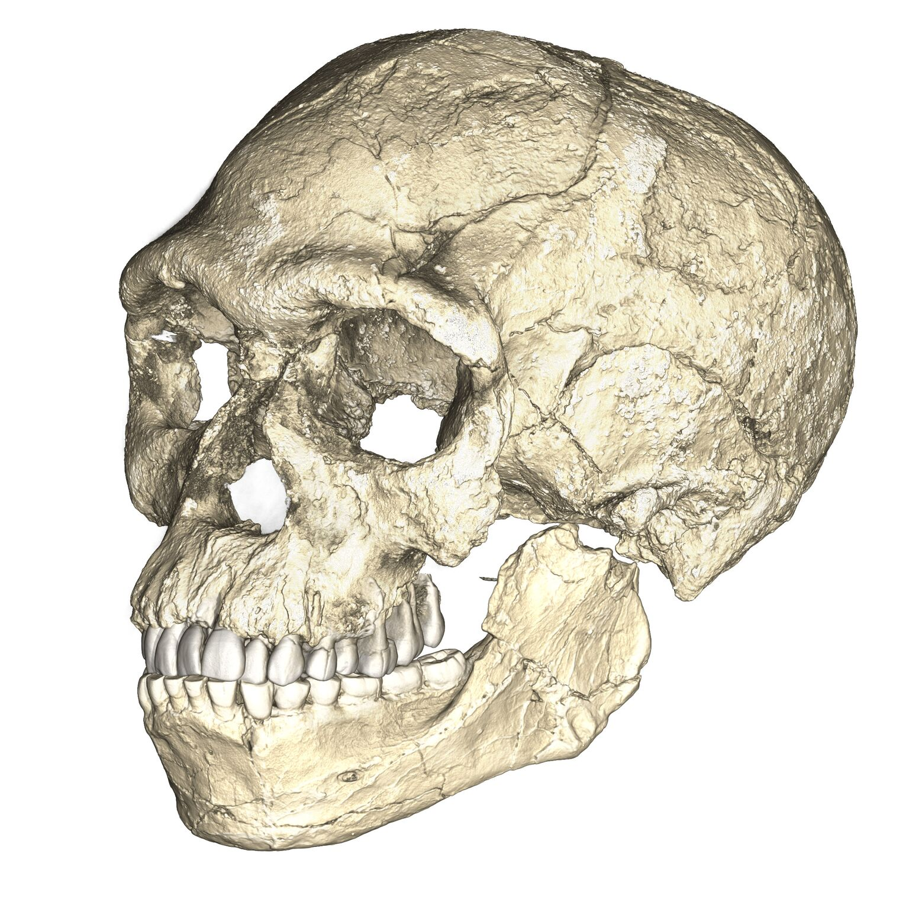
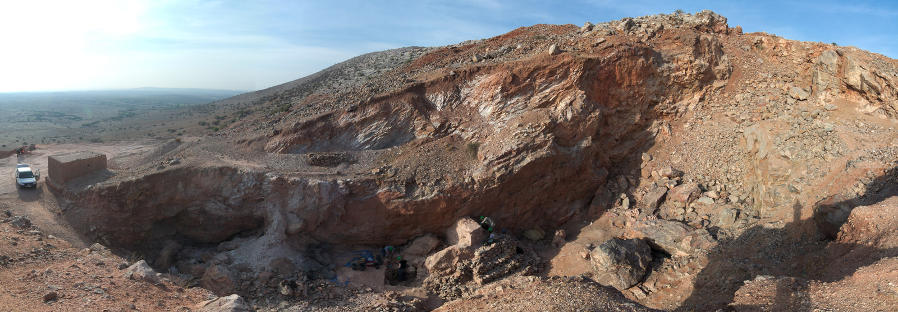
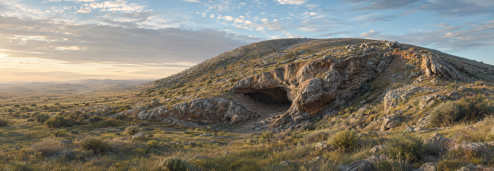
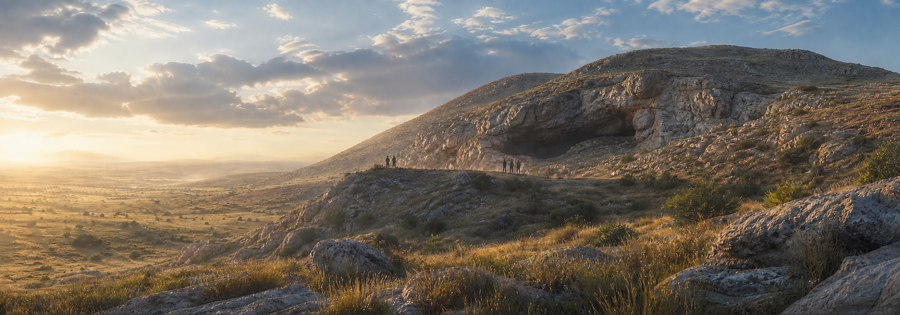
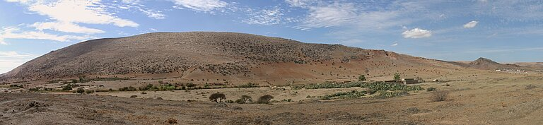

# Our Species Begins in Africa — research and editorial note

Issue: [ASH-72](https://linear.app/ashs-workshop/issue/ASH-72/rebuild-and-publish-our-species-begins-in-africa)
Lesson ID: `lesson.humans.homo-sapiens-origins`
Journey/chapter/position: `journey.world-history` · Chapter 01, Human Beginnings and Food Systems · canonical World Spine position 1 (journey entry point)
Required or optional: Required
Branch: `codex/ash-72-human-origins`
Accountable reviewer: Carlin Aylsworth (product owner / editorial)
Research date: 2026-07-26

> **Clean-slate rebuild.** The product owner rejected the earlier ASH-69 production preview and closed PR #14. That branch, its research notes, its media, and its lesson module were deliberately not consulted. Every source, claim, storyboard decision, media brief, prompt, and line of learner copy below was authored fresh.

## Work boundary

This increment produces one required World History lesson at canonical Spine position 1, the entry point of the journey. It explains how fossil, archaeological, and genetic evidence places the emergence of *Homo sapiens* within a set of interacting populations spread across Africa, and why that evidence does not support a single birthplace. It also restructures `journey.world-history` so the journey opens at Spine position 1 instead of `lesson.farming.settlements`, and refreshes the stale production-queue rows for Farming and Settlements and Human Origins.

Non-goals: dispersals out of Africa, Neanderthal and Denisovan interbreeding, Ice Age lifeways, the peopling of the Americas, the origins of farming, any new universal module type, and any platform redesign. Positions 2–7 of the Spine own that material.

## Node proposal

**Essential question:** If people who looked like us lived in Morocco, Ethiopia, and South Africa at very different times, where did our species actually begin?

**Durable understanding:** Our species emerged across Africa among many populations that were sometimes separated and sometimes in contact — so there is no single birthplace to point to, and the traits that make us *Homo sapiens* appeared in different combinations at different times.

**Supporting understandings**

1. The oldest fossils assigned to our species are about 315,000 years old and come from Morocco, in the far northwest of Africa — not from a single East African valley.
2. Those fossils combine a face much like ours with a long, low braincase like earlier humans; the rounded braincase we have today developed later.
3. Fossils, stone tools, and DNA are three separate kinds of evidence, and all three point away from one isolated ancestral group.
4. Groups were connected as well as separated: people at Olorgesailie were moving stone tens of kilometres and processing red pigment by around 300,000 years ago.
5. The evidence is real but thin and unevenly spread, so some questions remain genuinely open.

**Evidence encounter:** The Jebel Irhoud cranial evidence — a modern-looking face attached to an archaic-looking braincase — examined before the learner is asked to draw any conclusion about origins.

**Prerequisites:** None. This is the journey entry point. The lesson must supply its own sense of deep time and must not assume prior knowledge of geological periods, evolution, or archaeological method.

**Common misconceptions to prevent**

| Misconception | Correction the lesson makes |
| --- | --- |
| There is a single "cradle of humankind", usually a valley in East Africa. | Fossils of comparable age and status come from Morocco, Ethiopia, and South Africa; no single origin point can currently be identified. |
| Humans evolved in a straight line from primitive to modern. | Traits appear in a mosaic — modern face with archaic braincase — in different combinations at different times. |
| "Mitochondrial Eve" was one woman who was the first human. | Not raised as a term, but structurally defused: ancestry traces to *populations*, not an individual, and those populations exchanged genes for hundreds of thousands of years. |
| Our species was alone in Africa. | Other hominins, including *Homo naledi* and the Kabwe individual, lived in Africa during the same window. |
| The map shows exactly where things happened. | Points mark the areas where evidence was found; only Herto has a published GPS fix on the find spot. |
| Because scientists disagree, nobody really knows anything. | The African origin is strongly supported; what remains open is the internal detail. Certainty is differentiated, not collapsed. |

**Scope — dates/places/actors:** Approximately 315,000–160,000 years ago, with the lesson's centre of gravity at 315,000–233,000. Places: Jebel Irhoud (Morocco), Olorgesailie (Kenya), Florisbad (South Africa), Omo Kibish (Ethiopia), Herto (Ethiopia). Actors: early *Homo sapiens* populations, and the researchers whose methods produced the dates.

**Why this is one lesson:** It teaches a single transformation in understanding — from one cradle to a continent-wide network — through one coherent evidence chain. The dispersal out of Africa is a genuinely different causal story and is a different node.

**Bridge from previous lesson:** None; this is the opening of World History.

**Bridge to next lesson:** `lesson.humans.migrations-and-interbreeding` (Spine position 2) takes the structured African populations established here and follows some of them beyond Africa, where they met other kinds of humans.

## Research questions

Written before answers were gathered.

1. What is the oldest fossil evidence securely assigned to *Homo sapiens*, and how was it dated?
2. Has that date changed recently, and did the change move the geography as well as the chronology?
3. What anatomical features define our species, and did they appear together or separately?
4. Where across Africa has evidence of comparable age been found, and how confident is each date?
5. What does the archaeological record show at the same time, and is it regionally uniform?
6. What do the genomes of living people imply about ancestral population structure, and how much does that inference depend on the model chosen?
7. What do specialists actively disagree about, and is the disagreement about evidence, dating, definition, or interpretation?
8. Whose evidence is missing — which regions and which kinds of remains are absent, and why?
9. Which claims are age-appropriate to state plainly, and which require an explicit limit?
10. What geography must a map show, and can each point be sourced to an authoritative coordinate?

## Source ledger

All sources were opened and read. Access date for every entry: 2026-07-26.

| Source ID | Citation / link | Type / authority | Claims supported | Limits / bias | Corroboration | Rights | Review |
| --- | --- | --- | --- | --- | --- | --- | --- |
| `source.humans.hublin-2017-irhoud` | Hublin, J.-J. et al. "New fossils from Jebel Irhoud, Morocco and the pan-African origin of *Homo sapiens*." *Nature* 546:289–292 (2017). [doi:10.1038/nature22336](https://doi.org/10.1038/nature22336) | Primary excavation report; MPI-EVA Leipzig with INSAP Rabat | irhoud-mosaic, sites-spread, braincase-later, not-a-ladder | Excavators interpreting their own finds; taxonomic assignment is contested by others | Independently echoed by Smithsonian and NHM; the "pan-African" reading is supported by Scerri 2018 | Rights-reserved; cited as fact source, no figures redistributed | Reviewed |
| `source.humans.richter-2017-irhoud-age` | Richter, D. et al. "The age of the hominin fossils from Jebel Irhoud, Morocco, and the origins of the Middle Stone Age." *Nature* 546:293–296 (2017). [doi:10.1038/nature22335](https://doi.org/10.1038/nature22335) | Primary geochronology; thermoluminescence on heated flints | irhoud-age, msa-broadly-contemporary | Single-site dating programme; TL carries a ±34 ka uncertainty that must be shown, not hidden | Recalculated Irhoud 3 mandible age (286 ± 32 ka) is compatible; accepted by Smithsonian and NHM | Rights-reserved; fact citation only | Reviewed |
| `source.humans.vidal-2022-omo` | Vidal, C. M. et al. "Age of the oldest known *Homo sapiens* from eastern Africa." *Nature* 601:579–583 (2022). [doi:10.1038/s41586-021-04275-8](https://doi.org/10.1038/s41586-021-04275-8) | Primary geochronology; tephra correlation to Shala volcano | omo-minimum-age, sites-spread | Establishes a *minimum* age only; the same paper withdraws the previous anchor for the Herto date | Open access; St Andrews and Cambridge institutional reporting concur | Open access (CC BY); fact citation | Reviewed |
| `source.humans.scerri-2018-subdivided` | Scerri, E. M. L. et al. "Did Our Species Evolve in Subdivided Populations across Africa, and Why Does It Matter?" *Trends in Ecology & Evolution* 33(8):582–594 (2018). [doi:10.1016/j.tree.2018.05.005](https://doi.org/10.1016/j.tree.2018.05.005) | Multi-disciplinary consensus synthesis; 23 authors across palaeoanthropology, archaeology, genetics, palaeoclimate | structured-populations, no-single-birthplace, not-a-ladder, msa-broadly-contemporary, climate-structure, other-hominins, record-sparse, adna-limits, species-boundary-contested | Argues a position rather than reporting neutrally; the authors are advocates of the structured model | Ragsdale 2023 reaches a compatible conclusion from independent genetic data; Bergström 2021 restates it | Rights-reserved; open preprint read at eScholarship | Reviewed |
| `source.humans.bergstrom-2021-ancestry` | Bergström, A., Stringer, C., Hajdinjak, M., Scerri, E. M. L. & Skoglund, P. "Origins of modern human ancestry." *Nature* 590:229–237 (2021). [doi:10.1038/s41586-021-03244-5](https://doi.org/10.1038/s41586-021-03244-5) | Review integrating palaeoanthropology and genomics; NHM + Francis Crick Institute + MPI | no-single-birthplace, structured-populations, record-sparse, adna-limits | Review, not new data; deliberately conservative about what can be concluded | Overlapping authorship with Scerri 2018 (Stringer, Scerri) — treated as *partially* independent, not fully | Rights-reserved; fact citation | Reviewed |
| `source.humans.ragsdale-2023-stem` | Ragsdale, A. P. et al. "A weakly structured stem for human origins in Africa." *Nature* 617:755–763 (2023). [doi:10.1038/s41586-023-06055-y](https://doi.org/10.1038/s41586-023-06055-y) | Primary population-genetic modelling; 44 newly sequenced Nama (Khoe-San) genomes | dna-weak-structure, divergence-120-135, structured-populations | Model-based inference, not observation; the authors themselves stress that model choice drives results | Independent evidence type from the fossil record, reaching a compatible structural conclusion | Open access (PMC); fact citation | Reviewed |
| `source.humans.brooks-2018-olorgesailie` | Brooks, A. S. et al. "Long-distance stone transport and pigment use in the earliest Middle Stone Age." *Science* 360:90–94 (2018). [doi:10.1126/science.aao2646](https://doi.org/10.1126/science.aao2646) | Primary excavation report; Smithsonian Human Origins Program with National Museums of Kenya | olorgesailie-networks, transport-implies-connection, msa-broadly-contemporary | One basin; "social exchange" is an inference from raw-material movement, not a directly observed behaviour | Potts et al. 2020 restates distances from the same programme; Scerri 2018 cites it independently | Rights-reserved; fact citation | Reviewed |
| `source.humans.potts-2020-variability` | Potts, R. et al. "Increased ecological resource variability during a critical transition in hominin evolution." *Science Advances* 6(43):eabc8975 (2020). [doi:10.1126/sciadv.abc8975](https://doi.org/10.1126/sciadv.abc8975) | Primary; drill-core palaeoenvironment plus published site coordinates | olorgesailie-networks, climate-structure, map-points-are-areas | Regional to one rift basin; environmental causation is argued, not demonstrated | Consistent with Scerri 2018 on climate-driven habitat fragmentation | Open access; fact citation | Reviewed |
| `source.humans.white-2003-herto` | White, T. D. et al. "Pleistocene *Homo sapiens* from Middle Awash, Ethiopia." *Nature* 423:742–747 (2003). [doi:10.1038/nature01669](https://doi.org/10.1038/nature01669) | Primary species description; publishes a differentially corrected GPS fix on the holotype find spot | sites-spread, map-points-are-areas | The c. 160 ka age lost one of its anchors when Vidal 2022 broke the tephra correlation; treat the date as approximate | ROAD locality entry agrees to ~1.3 km | Rights-reserved; coordinate is a fact and is cited as such | Reviewed |
| `source.humans.grun-1996-florisbad` | Grün, R. et al. "Direct dating of the Florisbad hominid." *Nature* 382:500–501 (1996). [doi:10.1038/382500a0](https://doi.org/10.1038/382500a0) | Primary ESR dating of the specimen itself | sites-spread | 1996 direct-dating result; single method | Cited as c. 259–260 ka by Scerri 2018 and MPI reporting | Rights-reserved; fact citation | Reviewed |
| `source.humans.douglas-2009-florisbad` | Douglas, R. M. *A new perspective on the geohydrological and surface processes controlling the depositional environment at the Florisbad archaeozoological site.* PhD thesis, [University of the Free State](https://scholar.ufs.ac.za/server/api/core/bitstreams/0c41f0d2-54bc-4e4e-9b42-1d02c99f7697/content) (2009) | Institutional repository; site geohydrology with surveyed spring-eye coordinates | map coordinates | Thesis, not peer-reviewed article; coordinate use only | ROAD agrees to ~36 m; Kuman et al. 1999 agrees to arcminute rounding | Open-access deposit | Reviewed |
| `source.humans.benncer-2023-irhoud` | Ben-Ncer, A., Hublin, J.-J., McPherron, S. P. & Gunz, P. "Jebel Irhoud (Ighoud), Morocco", in *Handbook of Pleistocene Archaeology of Africa*, 803–811. [Springer](https://link.springer.com/chapter/10.1007/978-3-031-20290-2_51) (2023) | Excavation team's own site gazetteer entry; publishes the coordinate the 2017 papers omitted | map coordinates | Chapter paywalled; coordinate read from the free abstract | ROAD agrees to ~0.32 km | Rights-reserved; a coordinate is a fact, cited without quoting prose | Reviewed |
| `source.humans.roceeh-road` | ROAD (ROCEEH Out of Africa Database), Africa localities table. [ROCEEH](https://www.roceeh.uni-tuebingen.de/api/Africa-localities-lithics-hominins-paleofauna-120ka-1800ka.php), Heidelberg Academy of Sciences and Humanities / University of Tübingen | Curated academic locality database | map coordinates (cross-check only) | Aggregator, not an excavation record; used only to corroborate, never as sole authority | Independently agrees with the primary coordinate for every site used | Public endpoint; ROAD user agreement to be re-read before publication | Reviewed |
| `source.humans.grun-2020-kabwe` | Grün, R. et al. "Dating the skull from Broken Hill, Zambia, and its position in human evolution." *Nature* 580:372–375 (2020). [doi:10.1038/s41586-020-2165-4](https://doi.org/10.1038/s41586-020-2165-4) | Primary dating study | other-hominins, kabwe-site-lost | Dating a specimen whose original context was destroyed | Scerri 2018 independently notes the Broken Hill age range | Rights-reserved; fact citation | Reviewed |
| `source.humans.neubauer-2018-brain-shape` | Neubauer, S., Hublin, J.-J. & Gunz, P. "The evolution of modern human brain shape." *Science Advances* 4:eaao5961 (2018). [doi:10.1126/sciadv.aao5961](https://doi.org/10.1126/sciadv.aao5961) | Primary morphometric study of endocranial shape through time | braincase-later | Overlapping authorship with Hublin 2017; shape analysis depends on a limited fossil sample | Scerri 2018 cites it as independent support for globularity evolving within the lineage | Open access | Reviewed |
| `source.humans.stringer-2016-origin` | Stringer, C. "The origin and evolution of *Homo sapiens*." *Phil. Trans. R. Soc. B* 371:20150237 (2016). [doi:10.1098/rstb.2015.0237](https://doi.org/10.1098/rstb.2015.0237) | Peer-reviewed synthesis on species definition | species-boundary-contested, not-a-ladder | Single-author position piece on a contested definitional question | The definitional dispute is independently described by Scerri 2018 | Rights-reserved; fact citation | Reviewed |
| `source.humans.smithsonian-homo-sapiens` | "*Homo sapiens*" and "Our species arose at least 300,000 years ago." [Smithsonian Institution Human Origins Program](https://humanorigins.si.edu/evidence/human-fossils/species/homo-sapiens) | National museum research programme; public science reference | african-origin, irhoud-mosaic, humans-99-9-alike | Public-facing summary; its separate Omo I page still carries the superseded c. 195 ka date | Agrees with NHM and with the primary literature on the Irhoud reading | Public educational content; text cited, images not redistributed | Reviewed |
| `source.humans.nhm-modern-humans` | "Modern humans, *Homo sapiens*: When, where and how did we evolve?" [Natural History Museum, London](https://www.nhm.ac.uk/discover/modern-humans-homo-sapiens-when-where-how-did-we-evolve.html) | National museum; authored from Stringer's research group | african-origin, no-single-birthplace, irhoud-mosaic | Public-facing summary reflecting one institution's research position | Matches Bergström 2021, on which the same group are authors — partially independent | Public educational content; text cited, images not redistributed | Reviewed |
| `source.humans.natural-earth` | [Natural Earth](https://www.naturalearthdata.com/) | Public-domain base geography | map base coastlines | Modern coastlines only; carries no historical interpretation | n/a — used for orientation, not historical claim | Public domain | Reviewed |

### Sources deliberately not used as authorities

- **Wikipedia** was used only to locate DOIs and paper titles. No claim rests on it.
- **UNESCO Tentative List entry #6665 (Olorgesailie)** publishes a coordinate roughly **133 km** from the site, in the Naivasha–Longonot area, while its own prose correctly places the site in Kajiado County between Mt Olorgesailie and Oldonyo Esakut. UNESCO's tentative-list pages state that content is the responsibility of the submitting State Party and are not verified by UNESCO. **Rejected, not averaged.**
- **UNESCO State of Conservation document 218529 (Lower Valley of the Omo)** prints its hemisphere letters transposed ("05°…E" for a latitude, "35°…N" for a longitude). It also describes the formation, not the excavation locality — a ~27 km offset. Used only as background, not as the map coordinate.
- **`worldheritageexplorer.org`** looks official in search results but states it is unaffiliated with UNESCO and partly derived from Wikipedia. Not used.
- **Popular-science and news coverage** (The Atlantic, Haaretz, Sci-News, Popular Archaeology) served as discovery leads only.

## Claim ledger

| Claim ID and wording | Kind | Certainty | Sources | Counterevidence / limits | Missing perspective | Learner treatment | Review |
| --- | --- | --- | --- | --- | --- | --- | --- |
| `claim.humans.african-origin` — All people alive today trace their ancestry to populations that lived in Africa; the oldest fossils of our species and the deepest genetic diversity are both found there. | interpretation | high | nhm, smithsonian, bergstrom, ragsdale | No credible competing continent; the open questions are internal to Africa | — | State directly | editorial-review-required |
| `claim.humans.irhoud-age` — Burnt stone tools found with the Jebel Irhoud fossils in Morocco date to about 315,000 years ago (315 ± 34 ka). | observation | high | richter-2017, hublin-2017 | The ± 34 ka range is real and is shown to the learner as "about" | — | State with "about" | editorial-review-required |
| `claim.humans.irhoud-mosaic` — The Jebel Irhoud fossils combine a face and jaw close to those of people today with a long, low braincase resembling earlier humans. | observation | high | hublin-2017, smithsonian, nhm | Based on a small number of individuals from one site | — | State directly; this is the evidence encounter | editorial-review-required |
| `claim.humans.braincase-later` — The rounded braincase typical of people today developed later within the *Homo sapiens* lineage rather than being present from its start. | interpretation | moderate | hublin-2017, neubauer-2018, scerri-2018 | Rests on a limited fossil sample; Neubauer shares authorship with Hublin | — | State as what researchers conclude, not as observation | editorial-review-required |
| `claim.humans.sites-spread` — Fossils assigned to early *Homo sapiens* come from northern, eastern, and southern Africa: Jebel Irhoud c. 315 ka, Florisbad c. 259 ka, Omo Kibish at least 233 ka, Herto c. 160 ka. | observation | high | hublin-2017, grun-1996, vidal-2022, white-2003, scerri-2018 | Which fossils belong to the species is itself contested (see below); Herto's date lost an anchor in 2022 | — | State directly, with the definitional caveat carried in a later section | editorial-review-required |
| `claim.humans.omo-minimum-age` — Volcanic ash lying above the Omo I fossil has been matched to an eruption dated to 233,000 ± 22,000 years ago, so the fossil must be at least that old. | observation | high | vidal-2022 | A minimum age, not an age — the fossil could be older | — | State directly; the "at least" is the teaching point | editorial-review-required |
| `claim.humans.no-single-birthplace` — No single time and place can currently be identified at which our species' ancestry was confined to one small region. | interpretation | high | bergstrom-2021, scerri-2018, nhm | Absence of an identified point is not proof no point existed; the lesson says "cannot currently be identified", not "did not exist" | — | State directly, with that exact hedge preserved | editorial-review-required |
| `claim.humans.structured-populations` — The evidence fits our species emerging among populations spread across Africa that were sometimes separated and sometimes in contact, rather than descending from one isolated group. | interpretation | high | scerri-2018, bergstrom-2021, ragsdale-2023 | This is the current leading interpretation, not an observation; a single-region origin has not been formally disproved | — | Present as the best-supported explanation, naming it as an interpretation | editorial-review-required |
| `claim.humans.not-a-ladder` — Early *Homo sapiens* fossils do not form a simple line from primitive to modern; different combinations of traits appear at different times and places. | interpretation | high | scerri-2018, stringer-2016, hublin-2017 | — | — | State directly | editorial-review-required |
| `claim.humans.msa-broadly-contemporary` — A shift to Middle Stone Age toolmaking appears in widely separated parts of Africa at broadly similar times around 300,000 years ago. | observation | high | scerri-2018, brooks-2018, richter-2017 | "Broadly similar" spans tens of thousands of years; West Africa's earliest dates are much younger, but that region is barely investigated | West and Central African records are largely absent | State with "around" and pair with the sampling caveat | editorial-review-required |
| `claim.humans.olorgesailie-networks` — At Olorgesailie in southern Kenya, between about 320,000 and 305,000 years ago, people made prepared cores and points, processed iron-rich rock for red pigment, and obtained obsidian from sources 25 to 95 km away. | observation | high | brooks-2018, potts-2020 | One basin; distances are straight-line measures | — | State directly | editorial-review-required |
| `claim.humans.transport-implies-connection` — Moving stone that far implies wider ranging or exchange between groups than the ≤5 km typical of earlier Acheulean toolmaking. | interpretation | moderate | brooks-2018, potts-2020 | Long-distance movement by a single wide-ranging group is an alternative to exchange between groups; the rock cannot tell us which | — | Present as an inference, and name the alternative | editorial-review-required |
| `claim.humans.climate-structure` — Shifting African climate repeatedly expanded and contracted deserts, forests, and grasslands, which could separate populations for long periods and later reconnect them. | interpretation | moderate | scerri-2018, potts-2020 | Climate reconstruction at this resolution is coarse; Scerri 2018 states the chronology is currently too coarse for firm causal conclusions | — | Present as a mechanism researchers propose, with the resolution limit stated | editorial-review-required |
| `claim.humans.dna-weak-structure` — Modelling the DNA of living African populations fits best with two or more weakly different ancestral populations linked by gene flow over hundreds of thousands of years. | interpretation | moderate | ragsdale-2023 | A model result. The authors show that model choice explains much of the variation in previous estimates, and other models remain live | — | Attribute explicitly to what the model fits, not to what happened | editorial-review-required |
| `claim.humans.humans-99-9-alike` — The DNA of all people living today is about 99.9% alike. | observation | high | smithsonian | — | — | State directly | editorial-review-required |
| `claim.humans.other-hominins` — Other kinds of humans lived in Africa during the same period, including *Homo naledi* (c. 335–236 ka) and the Kabwe individual (c. 299 ka). | observation | high | scerri-2018, grun-2020 | — | — | State directly; prevents "we were alone" | editorial-review-required |
| `claim.humans.record-sparse` — The African fossil record for this period is thin and unevenly sampled, and large regions including West and Central Africa remain poorly investigated. | observation | high | scerri-2018, bergstrom-2021, ragsdale-2023 | — | Entire regions are absent from the record; absence of finds is not absence of people | State directly; this is a required limit | editorial-review-required |
| `claim.humans.adna-limits` — No DNA has been recovered from African human fossils this old, because warm and humid conditions destroy it, so genetic conclusions about this period come from the DNA of living people and much younger remains. | observation | high | scerri-2018, bergstrom-2021 | — | Populations that left no living descendants are invisible to this method | State directly | editorial-review-required |
| `claim.humans.species-boundary-contested` — Researchers disagree about which fossils should count as *Homo sapiens*; some place Jebel Irhoud and Florisbad in a different species. | interpretation | contested | scerri-2018, stringer-2016 | This is a live definitional dispute, not a resolved question | — | Represent proportionately as a real disagreement about where to draw a line | editorial-review-required |
| `claim.humans.kabwe-site-lost` — The cave that produced the Kabwe cranium was quarried away, so its exact find spot can no longer be examined. | observation | high | grun-2020 | — | — | Optional colour; include only if it earns space | editorial-review-required |
| `claim.humans.map-points-are-areas` — Map points mark the areas where evidence was found rather than exact spots; Olorgesailie is a basin roughly the size of a small county, and only the Herto fossil has a published GPS fix on its find spot. | observation | high | potts-2020, white-2003, roceeh | — | — | State in the map's uncertainty note | editorial-review-required |

### How disagreement is handled

Three genuine disagreements exist, and they are different in kind:

1. **Definitional** — which fossils are *Homo sapiens*. Some researchers assign Jebel Irhoud and Florisbad to *H. helmei*. The lesson does not pick a winner. It teaches that the disagreement is about **where to draw a line on a gradually changing lineage**, which is a more useful idea than either answer.
2. **Model-dependence in genetics** — Ragsdale 2023 argues that a weakly structured stem explains patterns previously attributed to an unknown archaic African population. That is a change of interpretation, not new fossils. Stated as what the model fits.
3. **Causal weight of climate** — proposed and plausible, but Scerri 2018 explicitly says the chronology is too coarse for firm conclusions. Presented as a proposed mechanism with the limit attached.

No false balance: the African origin itself is not presented as contested, because it is not.

## Content triage

| Candidate idea | Verdict | Why | Destination |
| --- | --- | --- | --- |
| Jebel Irhoud fossils, date, and mosaic anatomy | Essential | The lesson's evidence encounter and its hook | Sections 1 and 3 |
| Fossils in northern, eastern, and southern Africa at different dates | Essential | Carries the durable understanding | Section 4, map |
| No single birthplace can currently be identified | Essential | The durable understanding itself | Sections 4 and 6 |
| Sparse, uneven sampling and no ancient DNA this old | Essential | Without it the lesson overclaims | Section 6 |
| Olorgesailie obsidian, pigment, and points | Supporting | Makes "connected, not sealed off" concrete and observable | Section 5 |
| Climate shifting habitable zones | Supporting | Explains *how* groups could separate and reconnect | Section 5 |
| Weakly structured stem from genomics | Supporting | Third independent evidence type reaching the same shape | Section 6 |
| Other hominins in Africa at the same time | Supporting | Prevents "we were alone" and the ladder image | Section 2 |
| 99.9% DNA similarity among living people | Supporting | Anchors "one species" before "many populations" | Section 2 |
| Kabwe's cave quarried away | Enrichment | Vivid lesson about lost evidence, but the lesson is already carrying enough | Card fact or a single clause; cut if tight |
| Neanderthal and Denisovan interbreeding | Deferred | Belongs to Spine position 2 | `lesson.humans.migrations-and-interbreeding` |
| Blombos ochre, shell beads, engraved plaques | Deferred | 100–73 ka, a later behavioural story | Later node |
| Dispersal routes out of Africa | Deferred | Spine position 2 | `lesson.humans.migrations-and-interbreeding` |
| "Mitochondrial Eve" as a named concept | Rejected | Teaching the term costs more than it returns at this age and invites the "one woman" misreading; defused structurally instead | — |
| Detailed thermoluminescence and ⁴⁰Ar/³⁹Ar method explanation | Rejected | Method depth would crowd out the historical argument; the lesson states *what was dated* rather than how the physics works | — |
| Human–chimpanzee divergence and earlier hominins | Rejected | A different question, six million years deep | Out of Spine scope |
| Skin colour and modern human variation | Rejected | Important, but a different lesson with its own care requirements | Later node |

## Learning blueprint

**Essential question:** If people who looked like us lived in Morocco, Ethiopia, and South Africa at very different times, where did our species actually begin?

**Durable understanding:** Our species emerged across Africa among many populations that were sometimes separated and sometimes in contact, so there is no single birthplace to point to.

**Supporting understandings:** the five listed in the node proposal.

**Prerequisites the lesson must supply itself:** what a fossil is; that 300,000 years is far beyond family memory; that "our species" is a category researchers define; that dating comes from the material around a find.

**Misconceptions:** the six in the node-proposal table.

**Indispensable vocabulary (7):** *fossil*, *Homo sapiens*, *braincase*, *Middle Stone Age*, *population*, *gene flow*, and the working distinction between *evidence* and *interpretation*. Each is defined at first use and reused at least twice.

**Evidence encounter:** the Jebel Irhoud mosaic — modern face, archaic braincase — observed in section 3 before any origin conclusion is requested.

**Historical-thinking move:** spatial and comparative reasoning. The learner compares finds separated by thousands of kilometres and tens of thousands of years and decides what pattern the set supports, then distinguishes what the pattern cannot establish.

**Required sincere-attempt evidence:** one supported-selection response choosing the best-supported conclusion from the distribution of finds, and one written explanation connecting the mosaic anatomy to a stated limit of the evidence.

**Bridge to the next required lesson:** these connected African populations are the starting point for the dispersals in Spine position 2.

## Ages 11–14 design pass

**Transformations applied**

- Opens with a concrete object in an unexpected place — a skull in Morocco — rather than with the abstract concept of speciation.
- Establishes deep time with a concrete comparison before any date is used in an argument.
- Replaces the word "cradle" everywhere except where the lesson is explicitly naming and dismantling the old idea.
- Avoids "first human", "the first of our kind", and "missing link". The lesson says *oldest known*, and explains why "oldest known" and "first" are different statements.
- Names actors concretely: researchers dated burnt flints; a volcano erupted and sealed a layer. No vague passive "it was discovered that".
- States uncertainty in plain language: "The ash layer is above the fossil, so the fossil is older. How much older, nobody can say from this evidence."
- Refuses the exotic register. No "dawn of humanity", no drums-and-savannah atmosphere, no framing of early people as simple or childlike. They solved hard problems with skill.
- Handles human remains soberly: the lesson discusses a skull as evidence, uses a schematic diagram rather than photographic remains, and does not dwell on death.
- Keeps disagreement calm and interesting rather than alarming: scientists arguing about where to draw a line is presented as normal, productive work.

**Comprehension checks per section** were applied section by section during storyboarding; the two places most likely to block comprehension are the word *population* used in a genetic sense (defined at first use as "a group of people living and having children together over generations") and the idea that a *minimum* age is still useful information (handled with the ash-layer image).

**Reading load:** seven sections, one purpose each, one or two modules each, and roughly 1,050–1,250 words of learner prose. That is a focused lesson, not a chapter.

**Accessibility and inclusion:** the map carries a full accessible summary that states its point in words, so the spatial argument survives without the image. The diagram's teaching content is duplicated in adjacent native text. No claim depends on colour alone. The lesson names African places and research institutions specifically — INSAP Rabat, the National Museums of Kenya — rather than presenting African prehistory as something studied only from outside.

## Section/component storyboard

| Order | Section ID / heading | Learner purpose | Claims | Module(s) | Media / action | Transition |
| --- | --- | --- | --- | --- | --- | --- |
| 1 | `section.humans.skull-in-the-wrong-place` — "A skull in the wrong place" | Open the puzzle with a concrete find that breaks the expected story | irhoud-age, irhoud-mosaic, african-origin | `prose` | Hero image orients place | "Before we can say what this find means, we need to be clear what we are looking for." |
| 2 | `section.humans.what-counts-as-us` — "What counts as Homo sapiens?" | Supply species, deep time, and the fact that we were not alone | african-origin, humans-99-9-alike, other-hominins, not-a-ladder | `knowledge` | — | "So what did the Morocco fossils actually look like?" |
| 3 | `section.humans.read-the-skull` — "Read the skull" | Observe the mosaic before interpreting it | irhoud-mosaic, braincase-later, not-a-ladder | `evidence` + short `prose` | Skull-shape comparison diagram; learner observes two braincase profiles | "One site cannot settle where a species began. So researchers looked at the rest of the continent." |
| 4 | `section.humans.across-a-continent` — "Evidence across a continent" | Establish the spatial and chronological spread | sites-spread, omo-minimum-age, no-single-birthplace, map-points-are-areas | `historical-map` + `prose` | Africa evidence map; learner locates and compares | "Spread out is not the same as cut off." |
| 5 | `section.humans.connected-not-sealed-off` — "Connected, not sealed off" | Explain the mechanism that makes a continent-wide origin possible | olorgesailie-networks, transport-implies-connection, climate-structure, msa-broadly-contemporary | `knowledge` | — | "Fossils and stone are not the only evidence. DNA tells a third version of the same story." |
| 6 | `section.humans.what-dna-adds` — "What DNA adds — and what it cannot" | Add the genetic evidence and state the honest limits together | dna-weak-structure, divergence-120-135, structured-populations, record-sparse, adna-limits, species-boundary-contested | `prose` + `knowledge` | — | Into the check |
| 7 | `section.humans.check-and-complete` — "World Check" | Use the evidence and explain a limit | — | two `prompt` modules | — | Explicit completion |

**Flow tests.** Each section answers a question the previous one raises. The evidence is encountered in section 3 and mapped in section 4, both before the prompts in section 7 ask the learner to use it. Modes change when the teaching mode changes: narrative, then parallel facts, then close observation, then spatial reasoning, then parallel mechanism, then argument-with-limits. Removing any section breaks the chain — without 2 the learner lacks the category, without 5 the continent-wide claim looks like magic, without 6 the lesson overclaims.

## Media and Knowledge Card plan

### Media decisions

> **Production outcome (2026-07-26).** The product owner approved the packet and asked that any generated imagery be built from a real reference. While sourcing that reference, the Max Planck Institute for Evolutionary Anthropology's [Jebel Irhoud press materials](https://www.eva.mpg.de/press/news/2017/2017-06-07-the-first-of-our-kind/) turned out to publish the site photograph, the composite cranial reconstruction, and the excavated tool plate under CC BY-SA 2.0. Real scientific imagery beats a Chronos schematic on every axis that matters here — anatomical accuracy, provenance, and the learner seeing actual evidence — so the braincase diagram and the reconstructed landscape hero were both dropped in favour of the published images. Nothing in this lesson is generated except the two maps, which are drawn deterministically from Natural Earth geometry and the coordinates verified below. Sections are renumbered accordingly.

#### Africa evidence map

| Field | Decision |
| --- | --- |
| Teaching purpose | Make the central claim visible: comparable evidence is spread across the whole continent at very different dates |
| Claim/evidence link | sites-spread, no-single-birthplace, map-points-are-areas |
| Best form | Historical locator map; no alternative conveys distance and spread as economically |
| Depiction mode | `map`; `depictionStatus: illustrative-reconstruction` (modern coastlines for orientation) |
| Learner action | Locate five sites, compare their distances and dates, and conclude that the set has no centre |
| Placement | Section 4, after the learner has examined one site closely and needs to know whether it is exceptional |
| Accessible equivalent | Full `accessibleSummary` naming every site, country, and date, and stating the spatial conclusion in words |
| Rights/provenance | Chronos original over Natural Earth public-domain base geography; every site coordinate sourced below |
| Review | Geography verified against primary sources plus an independent cross-check per site; awaiting visual and accessibility review |

Coordinates, following [`docs/content/historical-map-production.md`](../content/historical-map-production.md):

| Site | Latitude | Longitude | Primary coordinate source | Independent cross-check | Classification |
| --- | ---: | ---: | --- | --- | --- |
| Jebel Irhoud, Morocco | 31.853 N | 8.870 W | Ben-Ncer et al. 2023 (excavation team gazetteer) | ROAD, agrees to 0.32 km | Coordinate-verified |
| Olorgesailie, Kenya | 1.5775 S | 36.4447 E | Potts et al. 2020 publishes the basin as 1.5°–1.6° S, 36.4°–36.5° E | ROAD point falls inside that range | Source-supported area, not a point |
| Omo Kibish (KHS), Ethiopia | 5.4027 N | 35.9303 E | ROAD locality entry | UNESCO SoC doc places the wider formation ~27 km away | Approximate — formation-scale |
| Herto, Ethiopia | 10.25914 N | 40.55639 E | White et al. 2003, differentially corrected GPS on the holotype | ROAD, agrees to 1.3 km | Coordinate-verified |
| Florisbad, South Africa | 28.768167 S | 26.069639 E | Douglas 2009 surveyed spring eyes | ROAD to 36 m; Kuman et al. 1999 to arcminute | Coordinate-verified |

Rejected: the UNESCO Tentative List coordinate for Olorgesailie, which is ~133 km off and contradicts its own site description. Recorded rather than silently dropped.

Required labels, exact spelling, to be spell-checked by hand after generation: `Jebel Irhoud`, `Olorgesailie`, `Omo Kibish`, `Herto`, `Florisbad`. Dates render as native application text, not baked into the raster, so they can be corrected without regenerating art. Olorgesailie and Omo Kibish are drawn with a soft halo rather than a hard pin to encode their lower spatial precision; Jebel Irhoud, Herto, and Florisbad take pins. Olorgesailie is additionally distinguished as a toolmaking site rather than a fossil site.

Kabwe is deliberately **not plotted**. It is a different hominin, and adding it to a map whose single job is "early *Homo sapiens* evidence is spread out" would blur that job. It is handled in section 2 prose instead.

#### Evidence encounter: Jebel Irhoud cranium

`media.humans.jebel-irhoud-cranium` · REQUIRED · section 3.

Two views of the composite reconstruction built by Philipp Gunz from micro-CT scans of several original Jebel Irhoud fossils; the blue form in the right-hand view is a virtual cast of the braincase interior. This replaces the planned Chronos schematic. It carries `irhoud-mosaic` directly and shows the modern face and the long, low braincase in one image, at a level of anatomical accuracy no generated diagram could be held to. Depiction mode is `evidence-based-reconstruction`, not `evidence`, because it is a composite of several individuals rather than a photograph of one fossil, and the depiction label says so. Rights: CC BY-SA 2.0, credited to Philipp Gunz / MPI EVA Leipzig, resized only. The named text-only fallback is retired: the contrast is still stated in adjacent prose, so the image is not load-bearing for accessibility.

#### Hero: Jebel Irhoud site photograph

`media.humans.jebel-irhoud-excavation` · REQUIRED · lesson hero.

Shannon McPherron's panorama of the site looking south, with excavators visible small in the centre. This replaces the planned figure-free landscape reconstruction and resolves the product owner's question about depicting people without inventing them: the humans in the frame are the living archaeologists at work, photographed, not imagined. Nothing about the appearance, dress, or behaviour of early *Homo sapiens* is depicted anywhere in this lesson. The hero also earns its caption — the site reads as an open quarry face because twentieth-century mining removed the cave roof and much of the sediment, which is `claim.humans.irhoud-was-a-cave` and is stated in the caption rather than left to puzzle the learner. Rights: CC BY-SA 2.0, credited to Shannon McPherron / MPI EVA Leipzig. The master is re-derived at 1600 px from the 10,578 px original because the pipeline's `ql-v1` policy cannot encode the full-resolution panorama within its byte ceiling.

#### Middle Stone Age toolkit plate

`media.humans.jebel-irhoud-tools` · SUPPORTING · section 5.

Mohammed Kamal's photograph of excavated Jebel Irhoud tools with a 1 cm scale bar. Not in the approved packet; added because it makes `msa-broadly-contemporary` concrete and because the burnt pieces in this assemblage are the material that produced the site's date, which section 1 describes but could not otherwise show. Published as a journal-style plate with panel letters. Kept uncropped: cropping would create a derivative for no teaching gain and would risk losing the scale bar, and the caption avoids referring to panel letters. Rights: CC BY-SA 2.0, credited to Mohammed Kamal / MPI EVA Leipzig, converted from PNG and resized.

#### Knowledge Card artwork

`media.humans.africa-origins-card` · REQUIRED.

The Knowledge Card frame is a landscape strip of roughly 1.6:1, not a portrait panel, so a crop of the portrait lesson map would have been cover-cropped into an unreadable band. The card art is therefore generated as its own 1600×1000 variant from the same script and the same verified coordinates: Africa centred, markers enlarged so they still read at about 314 px wide, and no text labels at all. Marker halo size encodes find precision on the lesson map only; the card has no caption to explain that encoding, so its markers are uniform.

No video. Nothing in this lesson requires motion, sound, performance, or demonstration; the video gate in the runbook is not met.

### Knowledge Card

**Recommended:** one card, `card.idea.origins-across-africa`, category `idea`, class `foundation`.

| Field | Value |
| --- | --- |
| Title | Our Species Began Across Africa |
| Anchors | The durable understanding — many connected populations, no single birthplace |
| Date | c. 315,000–160,000 years ago |
| Place | Across Africa |
| Depiction | Evidence map artwork, labelled as a map with modern coastlines for orientation |
| Facts | Oldest known fossils of our species: Jebel Irhoud, Morocco, about 315,000 years old · Comparable finds in Ethiopia and South Africa span more than 150,000 years · A modern-looking face appeared before the rounded braincase · DNA of living people fits many weakly separated groups linked by contact · No single birthplace has been identified |
| Reveal | Earned by reading fossil, tool, and DNA evidence together and explaining what it cannot prove |

**The decision that needs product-owner judgement.** The obvious alternative is a `place` card for Jebel Irhoud, class `turning-point`. It is more concrete, and concrete objects are easier for this age group to remember. The reason I did not recommend it is that a Jebel Irhoud card, seen later in the collection out of context, teaches exactly the misconception this lesson exists to remove — that there is a single origin site, now relocated to Morocco. An `idea` card is less vivid but cannot be misread that way. See the decision packet.

## Understanding-check plan

Two required prompts.

**1. `prompt.humans.best-supported-conclusion` — supported-selection**

Question: fossils of early *Homo sapiens* have been found about 315,000 years ago in Morocco, about 259,000 years ago in South Africa, and at least 233,000 years ago in Ethiopia, and they do not all share the same mix of features. Which conclusion does this set of finds best support?

| Option | Role |
| --- | --- |
| Our species took shape among populations living in many parts of Africa that were sometimes separated and sometimes in contact | Correct |
| Our species began in one valley in eastern Africa and spread out from there | The superseded textbook story — the most valuable distractor |
| Each region of Africa evolved its own separate human species | Misreads structure as isolation; classic multiregionalism misapplied |
| The Morocco fossils are the first members of our species, so our species began in Morocco | The "oldest known equals first" fallacy, relocated rather than removed |

Feedback explains why the spread of dates and the mixed features fit a connected network, and states plainly that the finds cannot identify a starting point — only rule out the simple one-valley story.

**2. `prompt.humans.evidence-and-limit` — concise-explanation**

Question: the Jebel Irhoud fossils have a face much like ours but a long, low braincase. Explain what that mix suggests about how our species' features appeared, and name one thing this evidence cannot tell us.

A sincere answer connects the mosaic to features appearing separately rather than as a package, and names any real limit: only a few individuals from one site; the record is thin and unevenly sampled; no DNA survives from fossils this old; researchers disagree about which fossils count. `minimumResponseLength` is set low, and the explanation states clearly that the character count measures effort, not sophistication.

Both prompts can be answered by reasoning from the lesson. Neither depends on recalling a precise date, and every distractor in prompt 1 is a misconception a real learner plausibly holds rather than a wording trap.

## Journey framing

`journey.world-history` currently opens at `lesson.farming.settlements` inside a single chapter called Foundations, which does not match the canonical roster. This increment:

- adds `chapter.world-history.human-beginnings` — "Human Beginnings and Food Systems", position 0 — containing this lesson as its first entry;
- moves the existing Uruk, Writing, and Farming entries into a following chapter at position 1;
- sets `entryLessonId` to `lesson.humans.homo-sapiens-origins`;
- adjusts `approximateMinutes` for the added lesson.

Entry framing: "Start where the evidence starts — and find out why there is no single birthplace to point to."

Farming and Settlements remains the curriculum prerequisite for later food-system nodes. Implementing position 1 late does not change canonical order.

No journey invitations are added. There is no authored optional path from this lesson yet, and inventing one to fill a slot would violate the navigation rules.

## Disagreement, uncertainty, and missing voices

**Whose evidence survives.** The record is shaped by where limestone caves preserve bone, where erosion exposes old sediments, where volcanoes conveniently deposit datable ash, and — just as much — by where research has been funded and permitted. West and Central Africa are close to absent from this story, and Scerri and colleagues are explicit that this is a sampling gap rather than a finding. The lesson says so rather than presenting the map as a complete picture.

**Whose DNA we have.** Genetic inference here rests on the genomes of living people, including the 44 Nama individuals newly sequenced for Ragsdale 2023. Populations that left no living descendants are invisible. The lesson states that no DNA survives from African fossils of this age.

**Whose names are on the work.** The lesson credits institutions in the countries where the evidence is, not only European and American ones — INSAP in Rabat co-directed the Jebel Irhoud excavations, and the National Museums of Kenya co-authored the Olorgesailie research.

**What remains genuinely open:** where to draw the species boundary; how much of the pattern reflects climate; whether long-distance stone movement means exchange between groups or wide ranging by one group; whether any point in time existed when our ancestry was geographically confined.

## Research/editorial checkpoint (decision packet)

**1. Recommended title and scope.** "Our Species Begins in Africa", c. 315,000–160,000 years ago, centred on 315,000–233,000. One coherent transformation: from a single-cradle story to a continent-wide network of connected populations.

**2. Essential question and durable understanding.** As above: where did our species actually begin, and the answer that there is no single place to point to.

**3. Major claims, sources, disagreement, uncertainty.** 21 atomic claims against 19 reviewed sources, weighted toward primary excavation reports, primary geochronology, and primary genomic modelling, with two national museums for framing. Three real disagreements are represented proportionately; the African origin itself is not treated as contested. A 133 km error in UNESCO's own Olorgesailie coordinate was found and rejected rather than averaged.

**4. Deliberately deferred or rejected.** Out-of-Africa dispersal, Neanderthal and Denisovan interbreeding, Blombos-era behaviour, "mitochondrial Eve" as a named term, dating-method physics, and human variation today.

**5. Ages 11–14 decisions.** Concrete object before abstraction; deep time established before it is used; "oldest known" carefully distinguished from "first"; uncertainty in plain language; human remains handled as evidence via schematic diagram rather than photographs; no exoticism.

**6. Section flow.** Seven sections: the puzzle, the category, the evidence, the continent, the connections, what DNA adds and cannot settle, the check.

**7. Media.** Required Africa evidence map with per-site sourced coordinates; required braincase comparison diagram with a named text-only fallback if anatomical accuracy cannot be achieved; recommended figure-free landscape hero at second priority; card artwork derived from the map. No video.

**8. Knowledge Card.** One card recommended, `card.idea.origins-across-africa`.

**9. Understanding checks.** One supported-selection on the best-supported conclusion, one concise explanation connecting the mosaic to a limit.

### Decisions that genuinely need your judgement

**A. Knowledge Card subject.** An `idea` card ("Our Species Began Across Africa") that anchors the durable understanding but is less vivid, versus a `place` card for Jebel Irhoud that is more memorable but risks re-teaching the single-origin misconception when seen out of context. **Recommendation: the idea card.**

**B. Braincase diagram versus text-only.** The diagram is the best evidence encounter available, but generated cranial imagery is a real anatomical-accuracy risk. **Recommendation: attempt the diagram, hold it to a strict accuracy review, and fall back to the text-only contrast rather than shipping something anatomically wrong.**

**C. Hero image.** A figure-free Jebel Irhoud landscape, or no hero at all. Every other lesson has a hero, so its absence would be visible. **Recommendation: attempt it, ship without it rather than ship something generic.**

**D. Journey restructuring scope.** This lesson requires the World History journey to open at Spine position 1, which means adding the chapter and moving three existing entries. That is a visible change to an already-merged journey, made inside a lesson PR. **Recommendation: include it, because the lesson is meaningless if the journey still opens at farming — but flagging it since it touches shipped work.**

## Sign-off status

- [x] Research integrity
- [x] Historical/editorial review
- [x] Ages 11–14 learning/editorial review
- [x] Section/component storyboard review
- [x] Visual/media/map review
- [x] Rights/provenance review
- [x] Knowledge Card decision — idea card, as recommended
- [x] Prompt/completion review
- [x] Accessibility review
- [x] Content/media/tests/type/build validation — `validate:content` passes, `media:build` passes, `typecheck` adds no new errors
- [ ] Empty-database and hosted-development verification
- [ ] Responsive browser review
- [ ] Learner walkthrough or documented reason deferred
- [x] Product owner approval — decision packet approved 2026-07-26, with media direction A on both open questions

Status: **Implemented and open for review.** Remaining gates are the ones that need a running database and a browser: `npm test`, the pgTAP suite including `supabase/tests/008_homo_sapiens_origins.sql`, an empty-database run of the migrations, and the responsive review.

## Visual correction audit — 2026-09-02

Post-publication learner feedback identified the lesson hero as visually inert: at desktop size it is a 2.85:1 quarry panorama dominated by bare rock, while the excavators are too small to create a focal point; at the mobile 16:9 crop the same problem becomes a smaller rectangle of undifferentiated rock. A full Learn-shell review in dark mode at 1440×900 and 390×844 confirmed the issue. The cranium evidence module, Africa evidence map, and tool plate remain visually legible and each performs a distinct teaching job. The prose, prompts, completion requirement, and durable understanding remain coherent. This is therefore a Stage 18 visual correction, not a material lesson rebuild.

The first replacement explored made the opening object the opening image: the licensed single-view Jebel Irhoud composite cranial reconstruction, anatomy-locked with only its white background and wide framing changed. That solves the focal-point problem and avoids inventing a living person, but it repeats the skull that already performs the lesson's core evidence job in section 3.

Current recommendation after product-owner direction to pursue a romantic African landscape with deliberately indistinct people: use candidate v4 recorded below. It gives the lesson wonder, geographic scale, and ancestral human presence while preserving the skull's distinct later evidence role. The landscape is specifically Jebel Irhoud rather than a generic pan-African savanna, and its caption must identify it as an evidence-based reconstruction rather than a literal view.

State: **product-owner visual approval recorded**. On 2026-09-02, after the two landscape directions were presented and the second was identified as the refined romantic landscape with distant people, Carlin Aylsworth approved it with: “yes, let's go with the 2nd one~”. The accepted candidate is now registered as the lesson hero; hosted publication remains a separate release action.

Responsive Learn-shell verification: **passed on 2026-09-03** at 1440 × 900 and 390 × 844 in dark mode. The desktop hero has a clear cave-and-people focal structure; the centred mobile crop retains the cave and both distant figure groups; the 2119 × 742 runtime image loads without horizontal overflow; and the reconstruction label and uncertainty caption remain visible.

| Scientific reference | Recommended hero candidate |
| --- | --- |
|  |  |

- Reference origin: [Max Planck Institute for Evolutionary Anthropology press kit](https://www.eva.mpg.de/press/news/2017/2017-06-07-the-first-of-our-kind/), Figure 10.
- Creator and license: Philipp Gunz / MPI EVA Leipzig, CC BY-SA 2.0.
- Reference research copy: `docs/research/references/homo-sapiens-origins/jebel-irhoud-cranium-single-view-reference.jpg`, 1536×1537, SHA-256 `fb04aaeb0f059fc53da19432f2412972316dec108a540293057c028afda96fe3`.
- Edit mode: style-only transformation with canvas extension; skull anatomy, orientation, proportions, missing areas, joins, and surface detail are locked.
- Candidate: `docs/research/generated/homo-sapiens-origins/jebel-irhoud-cranium-hero-candidate-v2.png`, 2118×742, SHA-256 `9c1f5c9f316bfbff4fd960ed4097d96c9b4ddbb50522a48093e296f5e904428f`.
- Tool/date: OpenAI built-in image generation, 2026-09-02.
- Agent comparison verdict: the evidence-bearing silhouette, long low braincase, facial projection, jaw discontinuities, and major fracture pattern remain visually distinct at intended lesson size. Final acceptance waits on product-owner review in the actual Learn shell.
- Rejected candidate: `docs/research/generated/homo-sapiens-origins/rejected/jebel-irhoud-cranium-hero-candidate-v1.png`, SHA-256 `c77e5e78fac5e195999ae5de67d5cbbe66b7b0aa0dd5e3a1f83eb559aa0dc601`; rejected because cinematic relighting appeared to re-render tooth and fracture detail instead of limiting the edit to background and framing.

Complete candidate prompt:

```text
Use case: precise-object-edit
Asset type: Chronos history lesson hero image; very wide 2.85:1 panorama, center-safe for a 16:9 mobile crop.
Primary request: Change only the white background and canvas framing of the provided Jebel Irhoud composite cranial reconstruction. The skull is a scientific reference and must remain visually identical to the input; it is not permission to redraw, reinterpret, relight, repair, clean up, complete, or restyle the skull.
Input image: Exact scientific edit target. Preserve the skull pixel-faithfully: identical orientation, size relative to its own bounding box, silhouette, long low braincase, brow, face, jaw, individual teeth, missing areas, cracks, joins, color, highlights, shadows, and surface texture.
Scene/backdrop: Extend the canvas horizontally into a very wide panorama. Replace only the pure white background outside the skull with a deep archive-blue and charcoal museum-neutral background with extremely subtle sediment texture and restrained falloff. Do not place texture over the skull.
Composition/framing: Place the unchanged skull around the left-center/center of the wide panorama, fully visible with comfortable margin, and keep it fully inside the centered 16:9 safe area. No crop through bone. No extra objects.
Constraints: Change background and canvas only. The skull must be a faithful photographic cutout of the input, with no anatomical or surface changes. No new lighting on the skull. No humans, animals, tools, extra fossils, maps, diagrams, callouts, labels, text, title, logo, watermark, UI chrome, fantasy effects, or movie-poster treatment.
Avoid: any regenerated teeth or bone, repaired gaps, smoothed cracks, changed jaw, altered braincase, mirror flip, color grading on the skull, orange cast, decorative clutter.
```

### Intermediate alternative: reconstructed Jebel Irhoud landscape without people

| Present published hero | Preferred landscape candidate |
| --- | --- |
|  |  |

- Teaching job: establish wonder, African place, deep time, and the site's lost cave setting before the lesson turns to surviving evidence.
- Factual basis: the documented Jebel Irhoud ridge and excavation; the site's pre-mining cave form; Geraads et al.'s micromammal reconstruction of a relatively open, probably grassland-dominated environment that was less arid than later periods; and the varied fauna described as typical of an open environment.
- Depiction boundary: the ridge relationship and open-environment category are evidence-led. Exact cave shape, vegetation placement, season, weather, and light are reconstructed and must not be read as observed facts. The indistinct distant grazers are atmospheric only and do not claim a species identification.
- Primary image reference: `public/images/human-origins/jebel-irhoud-excavation.jpg`, 1600×557, SHA-256 `da0e6bbbdfe9b5daee13dc93d8b2fd49388e977c0017f7d04571e0df0a66c1aa`; Shannon McPherron / MPI EVA Leipzig, CC BY-SA 2.0.
- Wider ridge reference: `docs/research/references/homo-sapiens-origins/jebel-irhoud-ridge-reference.jpg`, SHA-256 `5fb58791bc2dd53df417bbe7f9b6eff290e0863a9c6fe0424893939d68b0c8c0`; Shannon McPherron / MPI EVA Leipzig, CC BY-SA 2.0.
- Edit mode: adapted composition, explicitly requested for review by the product owner on 2026-09-02. Modern quarry damage and land use are removed; the cave form and palaeoenvironment are reconstructed with uncertainty recorded above.
- Candidate: `docs/research/generated/homo-sapiens-origins/jebel-irhoud-landscape-hero-candidate-v3.png`, 2127×739, SHA-256 `c1a81c1fe2f5dd406937c2731474bff495d51a68d2906ede1e6a60a52d728718`.
- Tool/date: OpenAI built-in image generation, 2026-09-02.
- Agent comparison verdict: the low rounded ridge, open-country scale, and limestone character remain recognizable; unsupported modern features are absent; the generalized cave is appropriately non-specific; the focal ridge/cave survives the central 16:9 mobile crop. Product-owner acceptance in the Learn shell remains pending.

Complete landscape candidate prompt:

```text
Use case: historical-scene
Asset type: Chronos history lesson hero; very wide 2.85:1 panoramic landscape, with the central 16:9 area also usable on mobile.
Primary request: Create a cinematic but scientifically cautious evidence-based reconstruction of the landscape around Jebel Irhoud, Morocco, approximately 315,000 years ago. It should feel unmistakably like a consequential African landscape and invite curiosity, not like a generic brown quarry photograph.
Input images:
- Image 1 is the primary geographic and geological reference: the documented Jebel Irhoud site looking south. Preserve the broad ridge/plains relationship and mineral character, but reconstruct the occupied location before twentieth-century mining removed the cave roof and much sediment. Do not reproduce modern vehicles, buildings, excavation cuts, equipment, or archaeologists.
- Image 2 is the wider Jebel Irhoud ridge reference. Preserve its low rounded ridge profile and expansive open-country scale. Do not reproduce modern fields, tracks, buildings, fences, or other recent land use.
Historical/environmental basis: faunal and micromammal research describes a relatively open environment, probably grassland-dominated and less arid than later periods, with scattered shrubs. Treat the exact vegetation and season as uncertain.
Scene/backdrop: An expansive North African open grassland and shrub mosaic beneath the Jebel Irhoud ridge. A generalized limestone cave entrance or deep rock overhang sits around the visual center, partially shadowed and modest in scale, restoring the site's pre-mining cave character without claiming an exact architecture. Golden-green grasses, scattered low shrubs, pale grey and warm limestone, atmospheric distant plains, and a broad blue sky with layered clouds. No lush jungle and no modern desert wasteland.
Subject: The landscape itself. No close human figures. If any life appears, use only two or three extremely distant, indistinct grazing silhouettes that cannot be read as a precise species; they are atmospheric and may be omitted.
Style/medium: Museum-grade cinematic painterly realism with believable geology, vegetation, depth, and physically plausible light. Premium editorial history illustration, calm and intelligent rather than fantasy concept art.
Composition/framing: Sweeping wide panorama with foreground grasses for texture, the cave/ridge as a clear center focal point, and deep plains receding beyond. Keep the focal ridge and cave fully visible in the central 16:9 safe crop. Strong layers and visual depth; no empty monochrome rock field.
Lighting/mood: Early morning after cool mist has lifted, low warm sunlight grazing the ridge, luminous but natural sky, restrained sense of discovery and deep time.
Color palette: Mineral blue sky, muted golden-green grasses, limestone grey, soft ochre, restrained terracotta shadows. Avoid an all-red or all-brown image.
Depiction boundary: This is an evidence-based reconstruction of a generally open paleoenvironment and the site's lost cave form, not a literal snapshot. Avoid false precision.
Constraints: no people, no facial reconstructions, no camp, no fire, no huts, no clothing, no tools, no modern roads, farms, buildings, vehicles, excavation trenches, fences, power lines, or equipment; no elephants, giraffes, acacias, or stereotyped safari imagery; no dramatic predators; no map, labels, callouts, educational text, title, logo, watermark, or UI chrome.
Avoid: generic savanna wallpaper, red-clay monotony, barren quarry, fantasy geology, Saharan dunes, lush tropical vegetation, cinematic battle atmosphere, oversaturated orange grading.
```

### Preferred candidate: romantic Jebel Irhoud landscape with distant people



- Product-owner direction: preserve the romantic vision of Africa and include people, but keep them too distant to claim unsupported details.
- Human depiction boundary: six tiny backlit silhouettes in two loose groups communicate human presence, movement, and scale only. No face, hair, skin, clothing, tool, weapon, ornament, or individualized anatomy can be read. The exact number, arrangement, and gestures are reconstruction.
- Landscape and source basis: unchanged from candidate v3 above.
- Candidate: `docs/research/generated/homo-sapiens-origins/jebel-irhoud-romantic-landscape-hero-candidate-v4.png`, 2119×742, SHA-256 `15a5d758803a8520b4de7bcca40d058345eb3fc7cbe13f97cc4adfd8c221ca4f`.
- Generation lineage: candidate v3 was used as the edit target; the edit changed only the human presence. The initial many-figure draft was rejected because the procession-like arrangement felt staged and overpopulated.
- Agent comparison verdict: the landscape remains source-anchored and visually coherent; the figures are non-specific at desktop size and become still less detailed on mobile; the cave and both figure groups survive the central 16:9 crop. Product-owner visual acceptance was recorded on 2026-09-02; final Learn-shell verification follows media registration.

Complete refinement prompt:

```text
Use case: precise-object-edit
Asset type: Chronos history lesson hero.
Primary request: Keep the entire landscape, cave, ridge, sky, lighting, vegetation, geology, framing, color, and atmosphere unchanged. Edit only the human figures.
Human edit: Remove the long procession of figures. Show exactly five tiny, distant, backlit human silhouettes in a natural loose grouping: three gathered quietly near the cave entrance and two standing together at the overlook facing the luminous plains. Keep every figure no more than roughly 4–5 percent of image height. Their poses may communicate standing, looking, or slow walking, but no individual should pose heroically.
Uncertainty constraints: Keep the figures as simple dark silhouettes with rim light. No readable faces, hair, skin detail, clothing detail, anatomy, tools, weapons, ornaments, bags, camp, fire, or activity-specific props.
Preserve: exact 2.85:1 canvas and central 16:9 mobile-safe composition; cave and all five figures remain visible in the mobile-safe center.
Avoid: line or procession formation, crowd, close figure, detailed caveman appearance, fur costume, racial caricature, modern clothing, added objects, changes anywhere else in the image.
```

## Image lifecycle

This Stage 18 correction adds one accepted learner-facing image. The lesson's previously approved evidence images and map are unchanged.

### `media.humans.jebel-irhoud-landscape-reconstruction` — lesson hero

#### 1. Reasoning and source basis

- Teaching job: open the lesson with wonder, African place, deep time, and human presence before the lesson turns to the surviving fossils and tools.
- Governing claims: `claim.humans.irhoud-age` and `claim.humans.irhoud-was-a-cave` establish the place, date, and lost cave; the image does not carry a claim about the people's appearance or activity.
- Factual and historical sources: Hublin et al. 2017 for the Jebel Irhoud context and date; the Max Planck press materials for the documented ridge and pre-mining cave context; Geraads et al. 2013, https://doi.org/10.1016/j.yqres.2013.08.003, for a relatively open, probably grassland-dominated and less xeric environment.
- Why image instead of no media: the former quarry photograph supplied evidence but not an inviting sense of scale, landscape, or human stakes. The skull remains in section 3 where it supports a close evidence-reading task.
- Depiction and uncertainty boundary: the ridge relationship, cave context, and open-environment category are evidence-led. The cave shape, plants, season, weather, light, people count, placement, gestures, and exact moment are illustrative. The tiny silhouettes show human presence and scale only.

#### 2. Reference image actually used

| Reference used | Origin and permitted use |
| --- | --- |
|  | [Max Planck Institute for Evolutionary Anthropology press materials](https://www.eva.mpg.de/press/news/2017/2017-06-07-the-first-of-our-kind/), Shannon McPherron / MPI EVA Leipzig, CC BY-SA 2.0. |
|  | Same press kit and creator/license; retained as the wider topographic reference. |

- Repository reference paths and SHA-256: `public/images/human-origins/jebel-irhoud-excavation.jpg`, `da0e6bbbdfe9b5daee13dc93d8b2fd49388e977c0017f7d04571e0df0a66c1aa`; `docs/research/references/homo-sapiens-origins/jebel-irhoud-ridge-reference.jpg`, `5fb58791bc2dd53df417bbe7f9b6eff290e0863a9c6fe0424893939d68b0c8c0`.
- Edit mode: adapted composition. The references anchor the low rounded ridge, limestone character, cave location, and open-country scale; modern quarry damage, roads, buildings, fields, equipment, and excavators are not copied.
- Locked relationships: expansive plain on the left, limestone ridge and cave near the visual centre, human figures kept small and within the centre-safe crop, and no unsupported close view of a person.
- Details not to copy or infer: modern land use; exact prehistoric cave geometry; identifiable clothing, tools, anatomy, skin, hair, or activity; stereotyped safari fauna or vegetation.

#### 3. Generation or transformation

- Operation: multi-reference original reconstruction, followed by a precise edit that reduced the human presence to two loose, distant groups, then full-frame high-quality JPEG encoding for runtime delivery.
- Actual inputs and SHA-256: the two reference images listed above; intermediate landscape candidate `docs/research/generated/homo-sapiens-origins/jebel-irhoud-landscape-hero-candidate-v3.png`, `c1a81c1fe2f5dd406937c2731474bff495d51a68d2906ede1e6a60a52d728718`.
- Tool/model/date: OpenAI built-in image generation service (model identifier not exposed), 2026-09-02; Sharp/MozJPEG quality 94 for runtime delivery.
- Complete final refinement prompt:

```text
Use case: precise-object-edit
Asset type: Chronos history lesson hero.
Primary request: Keep the entire landscape, cave, ridge, sky, lighting, vegetation, geology, framing, color, and atmosphere unchanged. Edit only the human figures.
Human edit: Remove the long procession of figures. Show exactly five tiny, distant, backlit human silhouettes in a natural loose grouping: three gathered quietly near the cave entrance and two standing together at the overlook facing the luminous plains. Keep every figure no more than roughly 4–5 percent of image height. Their poses may communicate standing, looking, or slow walking, but no individual should pose heroically.
Uncertainty constraints: Keep the figures as simple dark silhouettes with rim light. No readable faces, hair, skin detail, clothing detail, anatomy, tools, weapons, ornaments, bags, camp, fire, or activity-specific props.
Preserve: exact 2.85:1 canvas and central 16:9 mobile-safe composition; cave and all five figures remain visible in the mobile-safe center.
Avoid: line or procession formation, crowd, close figure, detailed caveman appearance, fur costume, racial caricature, modern clothing, added objects, changes anywhere else in the image.
```

- Candidate/rejection record: the first skull treatment was rejected because cinematic relighting appeared to alter evidence detail; the skull direction was then declined because it repeated the later evidence module. The first people-in-landscape draft was rejected because its long procession felt staged and overpopulated. The accepted edit produced six rather than the requested five silhouettes; the additional figure is non-specific, the count carries no historical claim, and the product owner accepted the displayed result.

#### 4. Accepted final image

| Reference used | Accepted final |
| --- | --- |
|  |  |

- Final master path, dimensions, and SHA-256: `docs/research/generated/homo-sapiens-origins/jebel-irhoud-romantic-landscape-hero-candidate-v4.png`; 2119 × 742; `15a5d758803a8520b4de7bcca40d058345eb3fc7cbe13f97cc4adfd8c221ca4f`.
- Runtime source path, dimensions, and SHA-256: `public/images/human-origins/jebel-irhoud-landscape-reconstruction.jpg`; 2119 × 742; `ae08fde6986bff63704ef9ad49bd961c47382d999cce14909e5a4ec759637a3b`. Generated fallback: `/images/optimized/human-origins/jebel-irhoud-landscape-reconstruction.optimized.jpg`, same dimensions and SHA-256. Responsive 480 px and 960 px WebP variants are lossless relative to the reviewed runtime source.
- Reviewer/date/status: Carlin Aylsworth product-owner visual review and Codex historical, uncertainty, rights, accessibility, and composition review / 2026-09-02 / accepted.
- Fidelity verdict — source-anchored relationships retained: yes; the low ridge, limestone character, cave focus, and open-country scale remain legible without reproducing modern quarry damage.
- Lesson-size verdict — the image has a strong focal structure at 2.85:1, while the cave and both small figure groups remain in the central 16:9 mobile crop.
- Comparison verdict — preserved relationship: broad plain, low Jebel Irhoud ridge, centred cave/overhang, and human-scale relationship to the landscape.
- Comparison verdict — intentional changes: reconstructed the lost cave and palaeoenvironment; introduced romantic dawn light and six distant silhouettes to create wonder without asserting personal detail.
- Comparison verdict — unsupported details checked: no readable faces, hair, skin, clothing, tools, weapons, camp, fire, modern infrastructure, stereotyped safari animals, labels, text, logo, watermark, or UI chrome.
