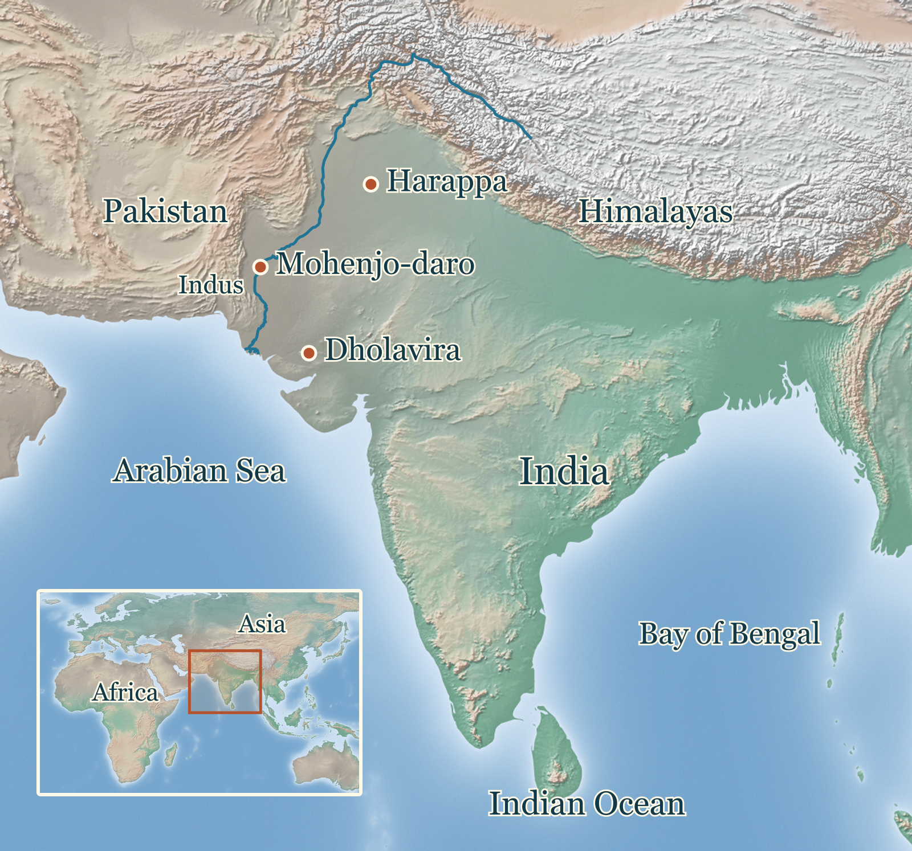
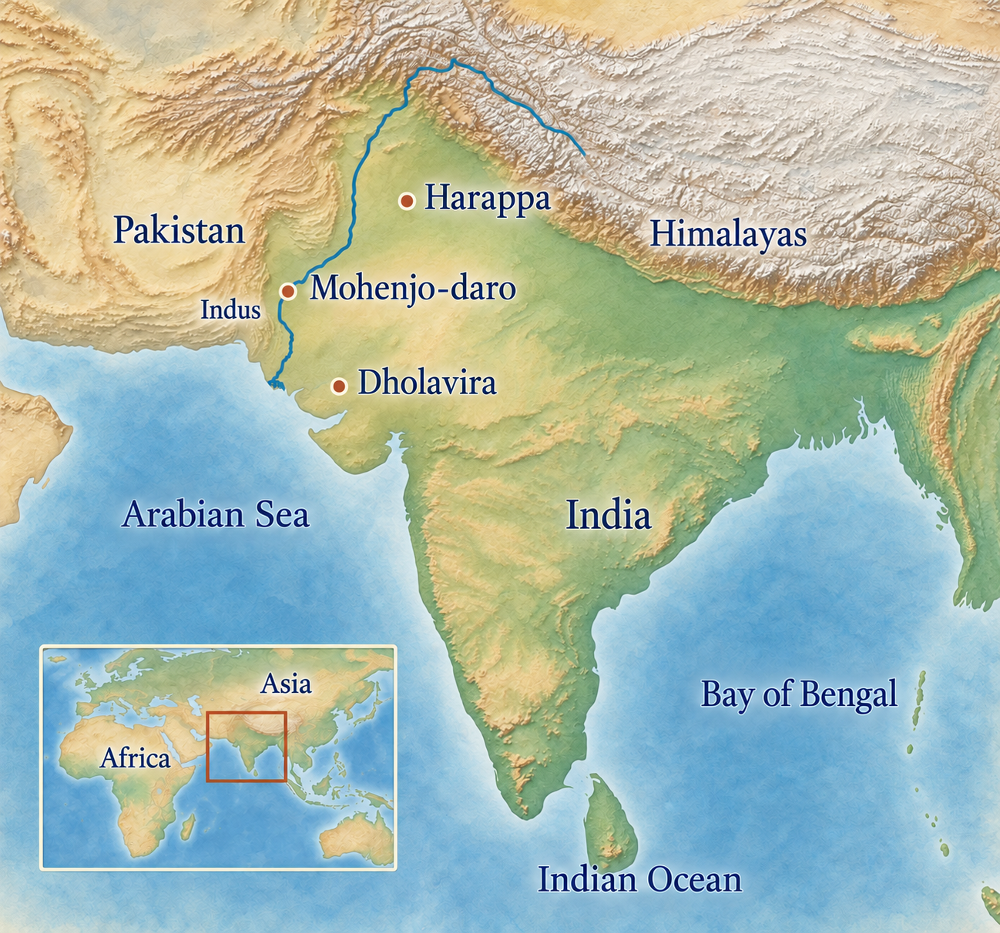
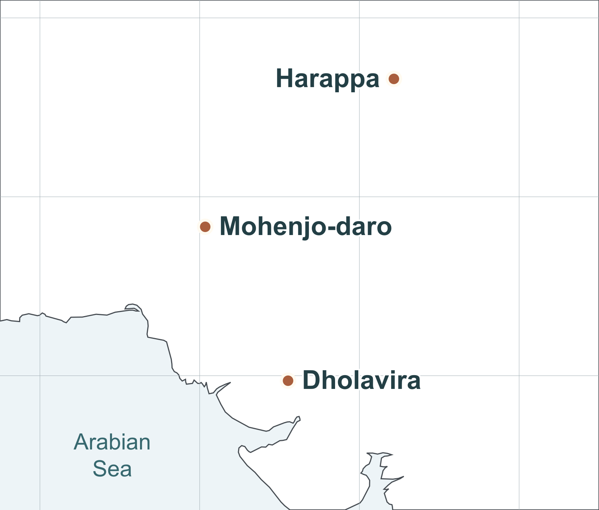
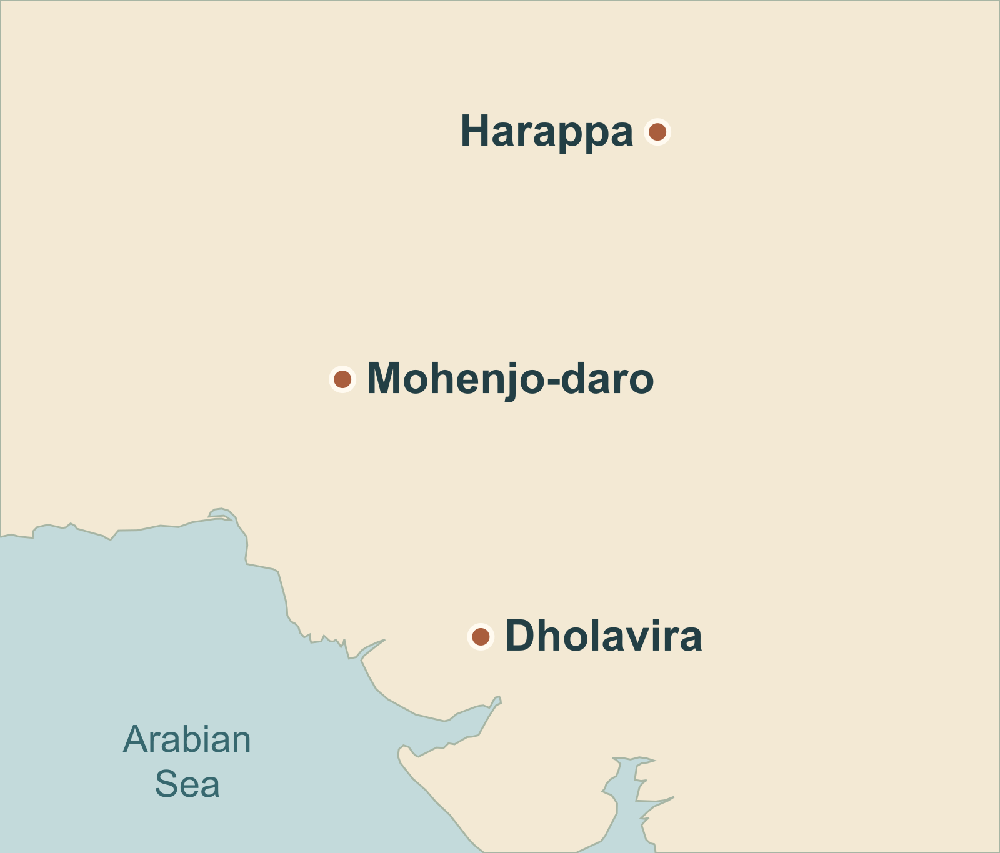
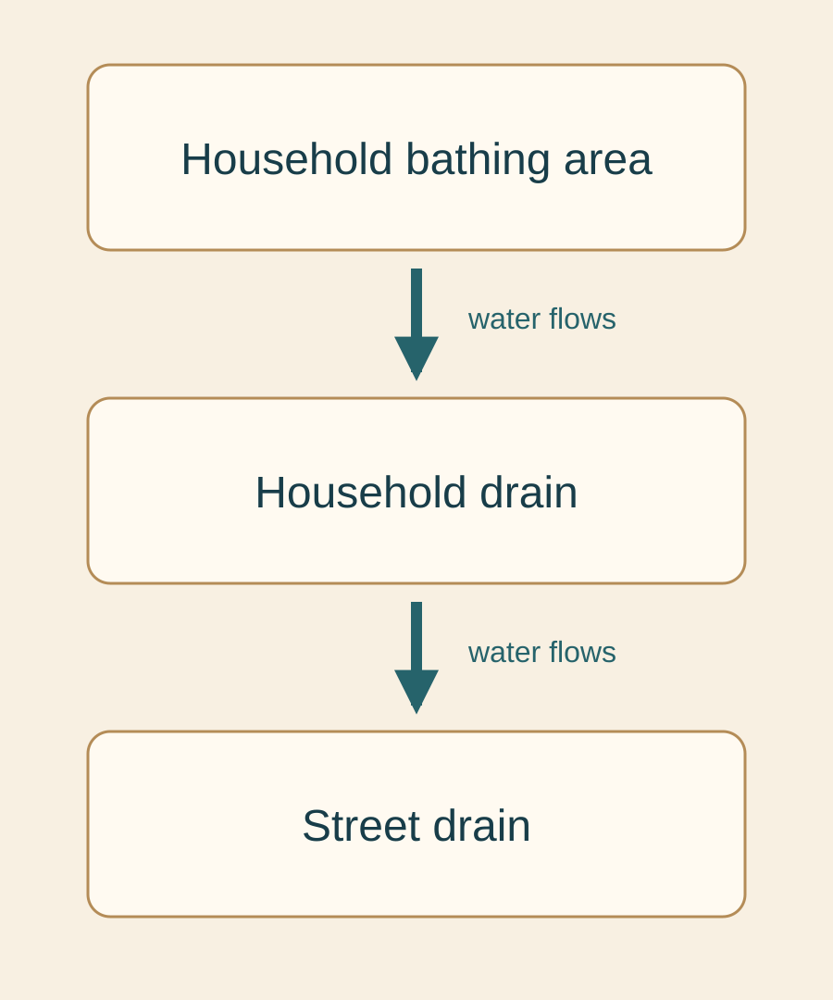
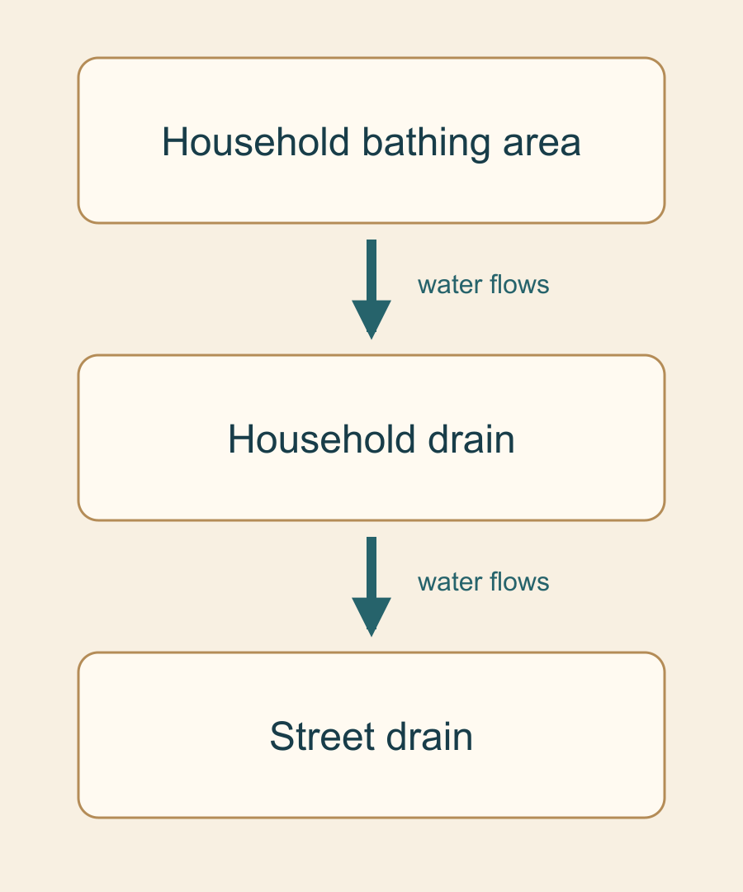
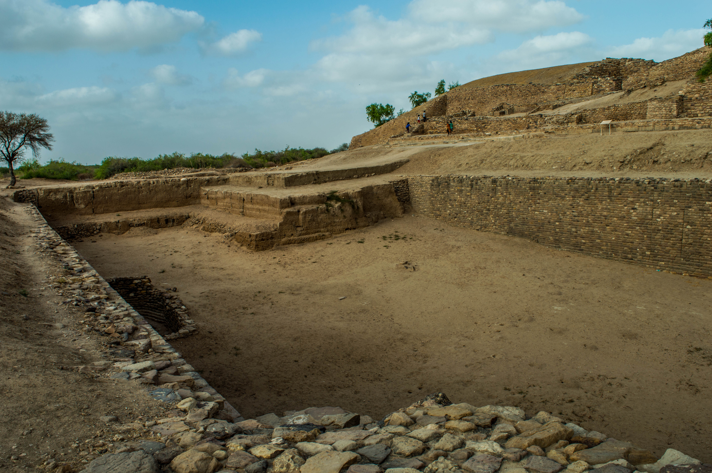
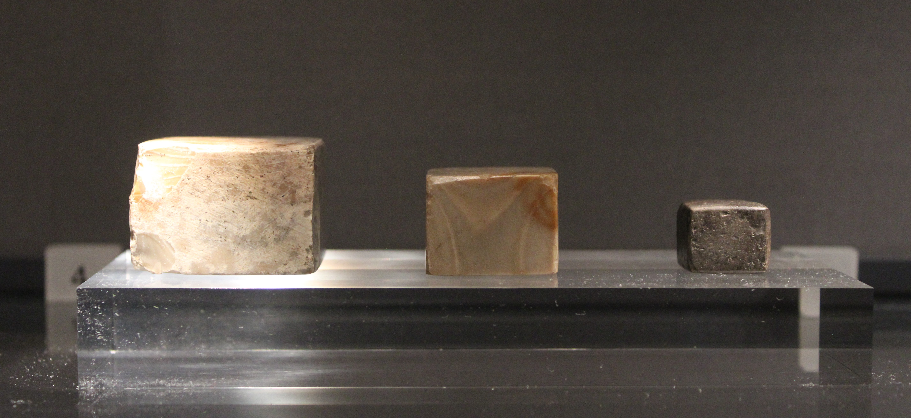
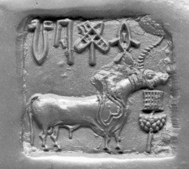
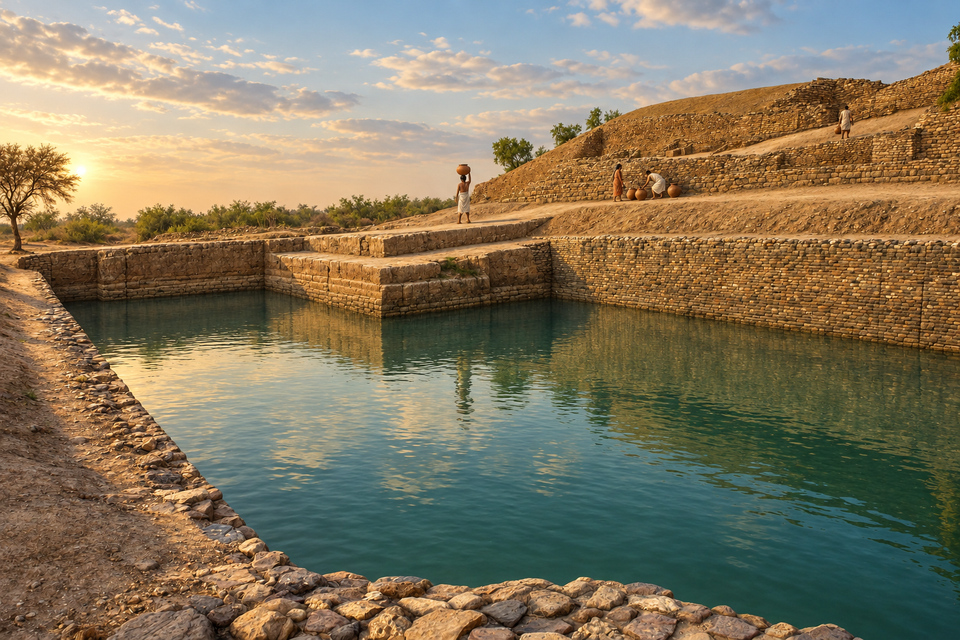

# Indus Cities and Undeciphered Signs — research and editorial note

Issue: [ASH-100](https://linear.app/ashs-workshop/issue/ASH-100/research-and-publish-indus-cities-and-undeciphered-signs)

Draft PR: [#41](https://github.com/dev-vibe/chronos-learning/pull/41)

Lesson ID: `lesson.indus.cities-and-signs`

Research-note identity/version: `indus-cities-and-signs-v3`, visual revision, 2026-09-12

Production record version: 2

The September 9 research checkpoint is retained below as history; the September 11 disposition and close-review tables govern this prototype.

Journey/chapter/position: `journey.world-history` / `chapter.world-history.cities-and-states` / canonical position 16

Required or optional: required World Spine lesson

Queue status: `Implementing` — owner approved the linked prototype; final media and release verification in progress.

Accountable product/editorial reviewer: Carlin Aylsworth

Researcher: Codex; this is an agent research assessment, not independent historical sign-off

Validation tier: high-risk, because language, identity, transmitted tradition, and political organization require explicit qualification

Branch: `codex/ash-100-indus-cities-and-signs`

Base: originally `ad1b50a`; merged current `origin/main` at `ca3d5dd` on September 11, including PR #42 app/workflow updates.

Worktree: `C:/dev/chronos-learning/.worktrees/ash-100-indus`

## Work boundary and repository evidence

The next four paragraphs record the September 9 starting state. As of September 11, the branch also contains the typed Indus draft, its preview registry and journey entry, and the owner's requested removal of public parent teaching companions. The revised PRD describes linked parent accounts; that separate account feature is not implemented by this lesson branch.

Carlin requested a fresh branch from main for the next eligible lesson, explicitly authorizing parallel work. This increment begins production order 80. The original pyramids checkout contains unrelated uncommitted work and is preserved. Current main includes the pyramids publication and PR #35 for Sahul; Sahul's existing `Review` queue state is left for its owner to close out. Parallel work here is confined to this note and the Indus queue entry.

The production dependency is satisfied by `content/lessons/early-writing-systems.ts` (`status: 'published'`), its inclusion in `content/chronos.ts`, and `supabase/migrations/20260717031052_publish_early_writing_systems.sql`; the queue identifies merged PR #8. ASH-100 already exists under curriculum epic ASH-57, so no duplicate issue was created. ASH-65 and ASH-100 were read; ASH-100 had no discussion comments or existing PR on the new branch when checked.

The content aggregator has ten lesson modules and no authored Indus lesson. The World History chapter currently ends with pyramids; the canonical roster places Indus after pyramids and before `lesson.nubia.kerma-and-nile-world`, with `lesson.writing.early-systems` as its curriculum prerequisite. Existing lessons keep sources, claims, prompts, media references, and cards in bounded modules. The runtime provides typed prose, knowledge, evidence, scene, map, and prompt modules. No platform or migration work is required at this checkpoint.

Reviewed legacy aliases are `indus_cities` and `indus_script` in the roster. Their inclusion here records curriculum identity, not authorization to transfer historical completion without the normal semantic-equivalence check.

## Node proposal

**Essential question:** What can the remains of Indus cities tell us about how people lived and worked together when their signs cannot yet be securely read?

**Provisional durable understanding:** Buildings, water systems, and objects can reveal large-scale cooperation while leaving the identities and decisions of the people who organized it uncertain.

Supporting research targets:

- Shared practices connected settlements with different local environments and social arrangements.
- Constructing and maintaining urban services required people, materials, skills, and continuing coordination.
- An object's use and archaeological context can be investigated before its inscription is translated.
- A change in cities does not necessarily mean the disappearance of their inhabitants or traditions.

**Candidate evidence encounter:** the HARP group of seals and tablets from one house near Harappa's Mound E southern gateway (S03). This is a research encounter, not a selected final image or media plan. The association is observable; calling its occupants merchants is an inference.

**Scope:** primarily c. 2600–1900 BCE, northwestern South Asia in present-day Pakistan and India. Harappa, Mohenjo-daro, and Dholavira are candidate comparisons. Earlier settlement and later transformation enter only where necessary to explain the urban phase. These are modern archaeological place/culture labels, not securely recovered names for an Indus nation.

**Prerequisites and bridges:** extend early writing's distinction between marks, information, and language; carry pyramids' distinction between a surviving object and a claim about its makers into a contrasting urban setting. Kerma then continues comparison among connected but distinct Bronze Age societies. Adjacency does not imply that Egypt, Indus, and Kerma succeeded one another without overlap.

**Why one lesson:** cities and signs address the same question of coordination and what survives of it. A separate decipherment survey would overwhelm the core urban case.

**Misconceptions to investigate:** every large city needs a visible king; uniform objects imply one empire; drains prove equality; absence of a decipherment means absence of knowledge; a plausible reading equals a demonstrated reading; civilization began wherever its oldest settlement is found; urban decline means everyone died or left at once.

**Non-goals:** full South Asian prehistory, an exhaustive language-history debate, settlement rankings, a solved script, a verdict on modern national/religious identity, new UI primitives, final assets, publication, or changes to neighboring lessons. These boundaries remain provisional until Carlin considers Stage 3B.

## Research questions

1. Which dates describe settlement, urban integration, and later occupation rather than one undifferentiated civilization?
2. How did water access differ among river cities, former channels, and Dholavira's seasonal-water setting?
3. Which excavated features show coordination, and which proposed institutions remain inferred?
4. What do seals, sealings, weights, workshops, and findspots establish about exchange and administration?
5. What would discriminate linguistic writing, restricted administrative notation, and nonlinguistic symbolism?
6. Which proposed readings make reproducible predictions on inscriptions not used to construct them?
7. What do river/climate studies explain, and where do their dates, geographic reach, or causal mechanisms fall short?
8. How do skeletal and genetic evidence challenge accounts of peace, invasion, migration, and identity without speaking for every community?
9. What do Vedic, Tamil, and other transmitted accounts contribute, and which links to excavated contexts remain unverified?
10. Which recent chronological, computational, architectural, and environmental proposals could change the lesson's model?

## Source ledger

All links below were opened on 2026-09-10 UTC. “Examined” records agent inspection of the stated material; it does not mean human editorial approval or computational replication. Sources support research questions at this stage; there is no learner claim ledger yet. Default rights treatment is research citation only, with no text or image redistribution licensed by implication.

| ID | Citation / source link | Type and authority | Questions / corroboration | Limits and review | Rights |
| --- | --- | --- | --- | --- | --- |
| S01 | UNESCO / State Party, [Dholavira: a Harappan City](https://whc.unesco.org/en/list/1645/) | Official site record | Q1–3; compares with S02, S04 | Site description examined; institutional terms such as castle and social hierarchy are interpretations | Research only; images need separate clearance |
| S02 | UNESCO / Pakistan, [Archaeological Ruins at Moenjodaro](https://whc.unesco.org/en/list/138/) | Official site record | Q1–3; S01, S04 | Examined. Summary says unbaked brick while detailed text describes baked brick; priest college and granary labels need specialist checking | Research only |
| S03 | HARP / Jonathan Mark Kenoyer, [Seals & tablets](https://www.harappa.com/indus/30.html) | Excavation project's contextual object record | Q4–5; S08 uses other object contexts | Caption examined; one house cannot establish a whole economy | Copyright; research only |
| S04 | Adam S. Green (2022), [Of Revenue Without Rulers](https://www.frontiersin.org/journals/political-science/articles/10.3389/fpos.2022.823071/full) | Original comparative archaeological argument | Q3; S01 and S05 are counterweights | Abstract, framing, and comparative method examined; governance reconstructed from material proxies | Research only |
| S05 | Gwen Robbins Schug et al. (2012), [A Peaceful Realm?](https://www.harappa.com/content/peaceful-realm-trauma-and-social-differentiation-harappa) | Study authors' abstract and linked paper record | Q3, Q8; independent skeletal evidence | Abstract examined; full skeletal dataset not reanalyzed | Research only |
| S06 | Steve Farmer, Richard Sproat, Michael Witzel (2004), [The Collapse of the Indus-Script Thesis](https://safarmer.com/files/fsw3.pdf) | Original challenge, author-hosted paper, EJVS 11(2):19–57 | Q5; challenged by S07, S09 | Abstract and argument examined; categorical exclusion exceeds what short surviving records alone demonstrate | Research only |
| S07 | Rajesh P. N. Rao et al. (2010), [Entropy, the Indus Script, and Language: A Reply to Richard Sproat](https://homes.cs.washington.edu/~rao/IndusCompLing.html), with [author rebuttal](https://homes.cs.washington.edu/~rao/IndusResponse.html) | Researchers' methodological response and citation trail to 2009–10 analyses | Q5; explicit S06 countercase | Examined; sequence statistics do not identify a language or translate signs | Research only |
| S08 | Bahata Ansumali Mukhopadhyay (2023), [Semantic scope of Indus inscriptions](https://doi.org/10.1057/s41599-023-02320-7) | Original epigraphic and archaeological analysis | Q4–6; S03 supports contextual approach | Abstract, materials/methods and evidence examples examined; specific taxes/licenses and exclusion of names remain her argument | Research only |
| S09 | Ashish Nair (2026), [How Non-Linguistic Is the Indus Sign System?](https://arxiv.org/html/2604.17828v1) | Independent computational preprint, April 20, 2026 | Q5–6; revisits S06/S07 | Methods, limitations and conclusion examined; code availability claimed, not independently rerun | Research only |
| S10 | Iravatham Mahadevan, [Parpola's Methodology of Decipherment](https://www.harappa.com/script/maha7.html) | Specialist explanation of a competing linguistic method | Q5–6, Q9; compare S08/S11 | Full page examined; presumed language and pictogram identification remain inputs | Research only |
| S11 | Yajnadevam, [A cryptanalytic decipherment of the Indus script](https://rarebooksocietyofindia.org/book_archive/A_cryptanalytic_decipherment_of_the_Indu.pdf), compiled November 13, 2024; [ScriptDerivation repository](https://github.com/yajnadevam/ScriptDerivation), [Lipi README](https://github.com/yajnadevam/lipi/blob/main/README.md) | Claim-owner paper and publicly exposed implementation | Q5–6; a competing Sanskrit solution | Abstract and unicity-distance argument examined; repository pages inspected, execution and exhaustive inscription audit not done | Research only; no code executed |
| S12 | Ajit Singh et al. (2017), [Counter-intuitive influence of Himalayan river morphodynamics on Indus Civilisation urban settlements](https://research-repository.st-andrews.ac.uk/handle/10023/12303) | Original research abstract in university repository | Q2, Q7; independent sediment provenance and dating methods | Repository abstract examined; publisher fetch failed; local scope must be preserved | Article CC BY 4.0; research only here |
| S13 | Hiren Solanki et al. (2025), [River drought forcing of the Harappan metamorphosis](https://www.nature.com/articles/s43247-025-02901-1) | Original paleoclimate/hydrological modeling study, November 27 | Q7; different method from S12/S14 | Abstract and model methods examined; no ancient flow gauges, model bias and proxy coverage limit precision | Research only |
| S14 | Anindya Sarkar et al. (2016), [Oxygen isotope in archaeological bioapatites from India](https://www.nature.com/articles/srep26555) | Original Bhirrana isotope and archaeological study | Q1, Q7; complicates S13 | Abstract and chronology framing examined; earliest habitation is not equivalent to mature cities | Research only |
| S15 | Vasant Shinde et al. (2019), [An Ancient Harappan Genome Lacks Ancestry from Steppe Pastoralists or Iranian Farmers](https://pmc.ncbi.nlm.nih.gov/articles/PMC6800651/) | Original ancient-DNA study, Cell | Q8; comparison with 11 peripheral individuals | Summary and sampling discussion examined; one usable Rakhigarhi genome, no language measurement | Research only |
| S16 | Benjamin Mutin et al. (2025), [New radiocarbon dates of human tooth enamel reveal a late appearance of farming life in the indus Valley](https://www.nature.com/articles/s41598-025-92621-5) | Original dating/modeling study, April 15 | Q1, Q8; scope differs from S14/S15 | Abstract and method framing examined; cemetery dates versus wider onset and migration inference must be separated | Research only |
| S17 | Rigveda 7.95, [R. T. H. Griffith translation](https://www.intratext.com/IXT/ENG0039/_PGZ.HTM) | Transmitted primary hymn in an older translation | Q9; compare geological S12 | Entire hymn examined; translation is dated, composition and geography need modern philological cross-check | Research only; no verse reproduced |
| S18 | Iravatham Mahadevan (2009), [Meluhha and Agastya: Alpha and Omega of the Indus Script](https://www.harappa.com/sites/default/files/pdf/meluhha_and_agastya_2009.pdf) | Original comparative interpretation connecting signs and tradition | Q6, Q9; S10 belongs to same research tradition, not independent confirmation | Paper opened; proposal reviewed as hypothesis, underlying Tamil textual chain not independently collated | Research only |
| S19 | Mayank N. Vahia and Srikumar Menon (2013), [A possible Harappan Astronomical Observatory at Dholavira](https://arxiv.org/abs/1310.6474) | Authors' architecture/astronomy proposal | Q3, Q10; compare S01 | Author abstract examined; crucial roof apertures assumed; full geometric model not rerun | Research only |
| S20 | IIT Gandhinagar / PIB (2024), [Lothal dockyard study release](https://www.pib.gov.in/PressReleasePage.aspx?PRID=2047689&lang=2&reg=3) | Claim-owner institutional release, August 22 | Q4, Q10; river connectivity as evidence for port feasibility | Release examined, underlying study not yet read; release itself requests further chronological work | Research only |

## Recent-challenge audit (Stages 3A–3B)

### Baseline and what supports it

The inherited account is a c. 2600–1900 BCE urban tradition with planned settlements, water infrastructure, exchange, and undeciphered inscriptions. Buildings and excavated objects support substantial coordination (S01–S03); the chronology is also used in independent research (S04, S15). Neither a standardized object nor a monumental building by itself identifies a government. The baseline is stronger than popular additions such as a single priest-king, universal peace, translated religious scenes, or one catastrophic end.

Institutional authority is not a substitute for checking each statement. S02's internally inconsistent brick summary and inherited building labels are specifically excluded as unexamined defaults. The same scrutiny applies to newer cooperative-governance and alternative-decipherment proposals.

The following is an analytical research matrix, not a learner claim ledger. Proposed teaching consequences remain subject to Carlin's response. Tests and counterarguments identified as “assessment” are this researcher's reasoning, not claims of published refutation.

| Revision / consequence | Origin and evidence | Method / inferential link | Corroboration and strongest countercase | Discriminating test | Provisional status / possible lesson consequence |
| --- | --- | --- | --- | --- | --- |
| **1. Coordination without a ruling elite** changes the model inherited from Egypt | Green 2022, S04: infrastructure, access, craft standards, public buildings | Collective-action comparison reconstructs inclusive institutions | S01 supports substantial planning but also unequal residential divisions; S05 warns against universal equality. Public works alone do not reveal decision rights | Compare access, wealth and authority indicators across neighborhoods, cities and phases | **Supported inference:** extensive coordination. **Plausible hypothesis:** specific egalitarian institutions. Make the distinction central; do not announce democracy |
| **2. Violence and inequality** challenge a peaceful utopia | Robbins Schug et al. 2012, S05: injuries and burial differences at Harappa | Patterns by burial group and gender connect trauma with social differentiation | Independent evidence class from architecture; selective burial, preservation and one-site sampling constrain extrapolation | Comparable, securely phased skeletal samples from more sites | **Supported inference** of patterned interpersonal violence at Harappa; not proof of empire-wide war or an invasion. Preserve unequal experiences without graphic treatment |
| **3. Nonlinguistic signs** would change what “undeciphered” means | Farmer–Sproat–Witzel 2004, S06: brevity, sign distributions, absent long texts | Compare inscription behavior with nonlinguistic symbols; challenge hypothetical lost manuscripts | S07 contests the statistical and preservation inferences; administrative brevity is not decisive either way | Predict held-out sequences and contexts; discover securely contextualized longer or bilingual records | **Unresolved conflict.** Do not infer literacy merely from city size or illiteracy merely from short texts |
| **4. Linguistic statistical structure** pushes against categorical non-script claims | Rao et al. 2009–10, S07: sequence regularities and entropy | Compare sign-order constraints across systems | Patterned nonlinguistic systems can overlap; authors explicitly distinguish supporting evidence from proof | Stronger real-world controls, corpus normalization and independent replication; test readings separately | **Supported inference:** structured ordering. **Unresolved:** speech encoding. Avoid “computer analysis decoded it” |
| **5. Restricted administrative notation** could bridge a false binary | Mukhopadhyay 2019/2023, examined through S08: sealings, object locations, sign positions and numerical notations | Compare patterned messages with administrative systems; propose taxation/licensing functions | S03 independently supports contextual use; a commercial context does not itself decode fees or exclude personal names | Predict sign classes against new findspots, goods, quantities and artifact types | **Plausible hypothesis**, especially broad administration; exact semantics remain unverified. Candidate comparison rather than translated fact |
| **6. A 2026 statistical challenge** changes the controls used in the debate | Nair, S09: 1,916 deduplicated inscriptions and synthetic/real nonlinguistic comparisons | Multi-metric comparison tests specific alternative generators | Not an independent decipherment; shared corpora, duplicate handling, allographs and short sequences affect results | Rerun public workflow with richer administrative models and independent corpus normalization | **Unverified here computational result; unresolved linguistic conclusion.** The author disclaims resolving the question. Useful research update, not a learner breakthrough |
| **7. Dravidian readings** could identify language and cultural connections | S10: pictorial/rebus readings constrained by reconstructed Dravidian forms | Proposed picture → sound → other meaning, checked against context | Comparative linguistics supplies constraints; object recognition, homophones and presumed language can still allow multiple readings | Fix values and segmentation first, then predict new inscriptions without changing the key | **Plausible language hypothesis; particular readings unverified.** Do not silently turn the fish/star comparison into a translation |
| **8. Sanskrit cryptanalytic decipherment** would overturn language and script chronology | Yajnadevam, November 2024 manuscript and public repositories, S11; claims post-Vedic Sanskrit and a proto-abugida | Regex/set intersection, sign grouping and a Shannon unicity argument | Public implementation permits scrutiny. Assessment: uniqueness conditional on a chosen cipher model is not proof that the ancient system used that model; grouping/reading freedoms need accounting | Independent sign inventory, frozen rules, held-out objects, full failures and blinded linguistic/contextual review | **Unverified claim**, not accepted here as a decipherment. No reproduction or comprehensive refutation claimed; same predictive standard as S10 |
| **9. Cities beside a former Himalayan channel** changes the river story | Singh et al. 2017, S12: sediment architecture/provenance and OSL ages | Former Sutlej course diverted well before mature urbanism | Independent methods within one study converge; local channel history cannot settle every Ghaggar-Hakra reach or the identity of a hymn's river | Expand dated cores and match site occupation to local hydrology | **Supported inference within sampled reach.** Avoid placing all cities on a single perennial river or dating a named tradition from one core |
| **10. Drought versus adaptation** changes the ending | Solanki et al. 2025, S13, reconstruct prolonged river drought; Sarkar et al. 2016, S14, emphasize subsistence change | Basin simulation/proxy comparison versus local isotope/occupation sequence | Different scales and mechanisms partly explain disagreement; coincidence does not isolate causes, and models lack ancient gauge calibration | Independently date regional occupation/crop changes against local water records | **Supported environmental pressure; unresolved causal weighting.** Candidate regional transformation account, not one drought that erased everyone |
| **11. Earlier settlement claims and younger Mehrgarh dates** change the prelude | Bhirrana S14 dates pre-urban occupation; Mutin et al. 2025 S16 model 23 Mehrgarh burials to begin c. 5200–4900 BCE | Isotope/stratigraphic chronology and enamel radiocarbon/Bayesian modeling | Different sites and phases, not direct mutual refutations. Cemetery onset and regional farming onset are not identical | Replicate with other securely stratified materials and compare non-cemetery contexts | **Recent proposed chronological revision.** Keep c. 2600–1900 BCE urban focus; neither “8,000-year-old cities” nor a settled regional origin date follows |
| **12. Ancient DNA constrains ancestry narratives** | Shinde et al. 2019, S15: one usable Rakhigarhi genome, compared with peripheral individuals | Statistical ancestry models | Narrow sampling; language, religion and political affiliation are not genetic measurements. S16's farmer-diffusion inference concerns another time/place, requiring explicit reconciliation rather than a headline contest | More securely dated genomes across regions and earlier phases, integrated with archaeology | **Supported sampled ancestry result; broad identities unresolved.** Do not use one person to prove no migration, an invasion, or a language |
| **13. Transmitted accounts may preserve connections** | Rigveda Sarasvati hymn S17; Mahadevan's Meluhha/Agastya argument S18 | Compare river descriptions, later traditions, signs and possible linguistic continuities | Transmission preserves meaningful evidence, but the material/textual link needs independent dating; assumed sign readings cannot confirm themselves | A dated bridge of forms, geography and texts independent of the proposed reading | **Direct evidence of transmitted accounts; Indus identification unresolved.** Consider respectfully without presenting them as contemporary city records |
| **14. Specialized engineering interpretations** could alter capability and trade | Vahia/Menon 2013 observatory proposal S19; IITGN 2024 Lothal release S20 | Solar geometry with assumed roof openings; remote-sensed river connectivity for port feasibility | Model feasibility is not demonstrated use. S20 explicitly leaves channel timing for further work | Surviving aperture/phase evidence and alternatives for Dholavira; dated navigable connection and basin-use deposits for Lothal | **Plausible hypotheses with missing tests.** Neither needed to establish engineering ability; potential Investigation depth |

### Ancient, local, descendant and comparative perspectives

S17 is a hymn to Sarasvati, represented in Griffith's translation as a powerful river associated with mountains and ocean. It is evidence of a transmitted religious/geographical conception. Its genre does not erase that value; neither does it supply an independently fixed date or a unique match to an excavated river channel. A modern critical translation and philological comparison remain necessary before using its wording in learner prose.

S18 explicitly proposes a link between common Indus signs, Meluhha and Agastya traditions. That comparison matters because it suggests cultural transmission rather than unexplained disappearance. The sign readings and the historical bridge remain hypotheses. This pass has not independently collated the Tamil texts or established an unbroken transmission chain.

The search included South Asian excavation/project sources, Indian research teams, an Indian independent epigrapher, Dravidian and Sanskrit interpretation communities, and material from present-day Pakistan. No community was contacted, and no consultation with living descendants or Indigenous representatives is claimed. No single modern population is treated as the exclusive owner or unchanged identity of the Indus world.

The main comparative methods examined were urban infrastructure/access, skeletal groups, linguistic and nonlinguistic corpora, rebus readings, cryptanalysis, river stratigraphy, climate simulation, ancestry modeling, transmitted names/stories, and architectural astronomy. Each comparison supplies a limited inferential link; none replaces all the missing evidence with resemblance.

### Coverage statement

- **Window:** approximately 1976–2026, with older transmitted texts and founding decipherment/urban assumptions retained where recent work tests them. Publication dates were read from articles: search crawl dates were not treated as publication dates.
- **Searches:** Indus/Harappan urban governance, collective action, water systems, priest-king, trauma/peace, river change, Ghaggar-Hakra/Sarasvati, drought/metamorphosis, Bhirrana antiquity, Mehrgarh enamel dates, Rakhigarhi ancestry, Indus signs nonlinguistic/entropy, Bahata administrative semantics, Dravidian/Parpola/Mahadevan, Sanskrit/Yajnadevam cryptanalysis, 2025–2026 decipherment/AI, Agastya/Meluhha, Dholavira observatory, and Lothal dockyard.
- **Repositories and trails:** UNESCO site records; HARP/Harappa researcher contributions; publisher pages at Nature/Frontiers; PubMed/PMC and university repositories; author pages at Washington; Farmer's paper archive; arXiv; claim-owner GitHub; PIB's IITGN release; a transmitted Rigveda translation. Discovery-only news, Wikipedia, and discussion results led to underlying sources; their summaries were not substituted for primary support.
- **Source-access limits:** Nature/PMC intermittently returned cookie or captcha pages; accessible publisher/DOI or university versions were used where available. British Museum seal `1912,0629.1`, the Kenoyer 2008 PDF, Dani interview, and the June 2025 RMRL bulletin did not load reliably. They are leads, not read authorities. The full Lothal paper, observatory model, corpus volumes, and all supplements were not audited. S12 is inspected at author-abstract level only. Review depth is explicit in the ledger.
- **Known gaps:** no exhaustive census of every claimed decipherment; no code replication; no new excavation or private datasets; no full philological review of Sanskrit/Tamil traditions; no audited transport-network chronology, seal workshop corpus, or region-wide inequality dataset. These gaps restrict certainty and selection; they do not justify treating the inherited story as proved.
- **Saturation and boundaries:** independent evidence classes converge on major urban coordination and significant local variation. New sources continue to refine disputed governance, script and transformation models. This is a bounded Stage 3B sweep with named follow-ups, not a claim that every possible challenge has been found or resolved.

## Research-direction packet and product-owner response

**Provisional synthesis:** retain the approved cities-and-signs scope. Investigate how people coordinated water, work and exchange; make the difference between material evidence and a proposed institutional or linguistic explanation visible. The strongest revisions add variation and testable uncertainty rather than a new single master explanation.

**Possible effect on essential question:** keep the provisional question about what city remains can reveal. Avoid framing the whole lesson as a hunt for a code that will explain everything. A decipherment could change many conclusions, but archaeology already carries substantial historical knowledge.

**Candidate highlights for consideration, not selected claims:** locally different water solutions; coordination without pretending to know who ruled; an excavated group of inscribed objects whose use can be investigated; contested sign models; regional urban transformation. Preserve ordinary inhabitants and labor, not only rulers and famous objects.

**Potential optional depth:** a controlled comparison of sign models and claimed readings; Sarasvati geography/tradition; the dates and mechanisms of urban transformation; observatory and dockyard tests. No new journey, media plan, card decision, storyboard or learner prose has been created.

**Judgment requested:** proceed toward an urban-life lesson with a concise, substantive account of the sign debate, keeping linguistic identity, transmitted-tradition and engineering-upset arguments in the research record unless Carlin wants one investigated further before drafting. The current research does not warrant treating any decipherment, named ruler, universal equality or single-cause collapse as settled.

Packet shared: 2026-09-09, this note and the current task handoff.

Product-owner response: **Proceed, 2026-09-11.** After reviewing the research packet and the workflow/UI assessments, Carlin wrote: “please continue the lesson creation.” This resumes the proposed Indus scope under the updated workflow. It is authorization for claim selection and prototype work, not approval of an unseen prototype or publication. Carlin also explicitly removed the public parent-teaching-guide direction in favor of linked parent accounts with progress and submitted-assessment access.

Follow-up research/disposition: closely inspect the central sources; retain the broad discovery audit without turning every proposal into learner content. The September 11 sources refine the existing scope rather than change the historical model. No decipherment, named government or single-cause ending is asserted.

## Current stage and safe state

Stages 4–14B resumed on September 11. The full typed lesson remains draft and only development preview can open/complete it. Final images, card registration, migrations, unlocks, hosted publication and Stage 15 remain pending prototype approval. Existing pyramids and app work is preserved. The user-requested removal of public parent guides is a separate correction in this branch; linked-parent accounts are specified in PRD §11.9 / CHR-100, not implemented by this lesson.

## September 11 close review and source roles

The earlier S01–S20 ledger records discovery depth honestly. Abstract-only or inaccessible items do not carry learner assertions. The registered production sources below supersede that depth only for the exact passages listed. Research review means Codex read those passages; human historical/editorial approval remains pending. HARP captions and Kenoyer publications often share an investigator/evidence base and are not counted as independent corroboration. UNESCO syntheses likewise inherit excavation records. Green offers an alternative interpretation rather than an independent excavation dataset.

| Registered source | Earlier ledger / new citation | Role | Exact reviewed material and limitation |
| --- | --- | --- | --- |
| `source.indus.dholavira` | S01 | Central supporting / qualifying | Description; Outstanding Universal Value, Brief synthesis and criterion (iv). Site-specific water/stone/craft evidence; the stated stratification is an inference. Do not adopt the stray Southeast Asia wording. |
| `source.indus.moenjodaro` | S02 | Central supporting | Outstanding Universal Value, Brief synthesis: location, streets and drainage. Reject the contradictory brick summary and inherited granary/priest labels. |
| `source.indus.street-drains` | [Mohenjo-daro Street with Drains](https://www.harappa.com/blog/mohenjo-daro-street-drains) | Central supporting | Opening five paragraphs; Wheeler plate 9 and Possehl citation identify the evidence chain. Contextual synthesis, not a newly inspected excavation archive. |
| `source.indus.measuring` | [Kenoyer 2010, Measuring the Harappan world](https://www.harappa.com/sites/default/files/pdf/Kenoyer%202010%20Measuring%20the%20Harappan%20World.pdf) | Central supporting / qualifying | Printed pp. 115–117, fig. 9.10 and table 9.3. Measurements support standards; gateway/craft context supports several use hypotheses. Avoid exact tax claims. |
| `source.indus.harp-weights` | [HARP, Weights, Harappa](https://www.harappa.com/slide/weights-harappa) | Central supporting | Full excavation caption. Same research tradition as Kenoyer; not independent replication. |
| `source.indus.harp-seals` | S03 | Central supporting | Complete Mound E house-assemblage caption. “Merchants” is explicitly tentative, not an identified occupation. |
| `source.indus.met-seal` | [Met object 49.40.2](https://www.metmuseum.org/art/collection/search/324063) | Central supporting / proposed visual | Object details, public-domain designation, displayed image reference. Collection object is not assigned a Harappa findspot; uncertain identification remains visible. |
| `source.indus.rao-response` | S07 | Qualifying | Sections 2–4 and fig. 1 discussion; author explicitly denies that statistics prove linguistic encoding. No corpus or computational replication claimed. |
| `source.indus.green-governance` | S04 | Qualifying / central interpretation | Section “What is The Evidence For Governance in The Indus Civilization?”, shared standards and collective works. Separate cooperative model from political equality. |
| `source.indus.harp-settlement` | [HARP, Changing Settlement at Harappa](https://www.harappa.com/slide/changing-settlement-harappa) | Central supporting | Full periodized settlement caption, Periods 3–5. Harappa contraction is not a population census or universal regional chronology. |
| `source.indus.kenoyer-tradition` | [Kenoyer 2006, Cultures and Societies of the Indus Tradition](https://www.harappa.com/sites/default/files/pdf/CulturesSocietiesIndusTrad.pdf) | Central supporting | Table 1 (PDF p. 6); Localization Era passage (PDF p. 9). Use period convention and continuing skills only; older linguistic/religious correlations are outside this lesson. |
| `source.indus.iln-marshall` | [Harappa.com, first images of the announcement in the Illustrated London News](https://www.harappa.com/blog/first-images-announcement-illustrated-london-news) | Central supporting | Voice revision. Date (September 20, 1924), the 400-mile distance, the “hardly further than the third century before Christ” sentence and the note that the first age estimate was off by one or two thousand years. Page quotes the paper; the original issue was not seen. |
| `source.indus.sayce-letter` | [Harappa.com, Prof. A. H. Sayce letter](https://www.harappa.com/slide/prof-ah-sayce-remarkable-discoveries-india) | Central supporting (attributed argument) | Voice revision. Letter of September 27, 1924: “practically identical” and “might have come from the same hand”; Susa tablets dated 2600–2300 BCE. This is Sayce’s 1924 judgment; no modern assessment of the comparison was verified, so the lesson attributes it to him and does not adopt it as a finding. |
| `source.indus.dholavira-bisht` | [R. S. Bisht, Excavations at Dholavira 1989–2005 (ASI, 2015)](https://ancientportsantiques.com/wp-content/uploads/Documents/PLACES/IndOc-Gulf/Dholavira-Bisht2015.pdf) | Central supporting / excavator interpretation | Voice revision. pp. 112 and 228–231: ten large signs, gypsum inlays, found lying in the western chamber of the north gate; wooden frame since decayed, matching the 3.5 m passage; “exact meaning … not known”. Display above the doorway is the excavators’ inference. Rebus readings in the report are not used. |

All above accessed and close-reviewed by Codex on 2026-09-11. Citation-only use except the proposed Met open-access image; no media rights are inferred from a source’s availability. Other final visuals require separate licensed originals or reviewed deterministic output after prototype approval.

## Claim ledger

The authored module is the exact wording/reference source of truth. Every row remains `editorial-review-required`; the following records the research disposition. General preservation limitation: archaeology samples surviving objects and excavated areas, not every household’s experience. No equal wealth, peaceful utopia, identified ruler, decoded language or complete transaction is asserted.

| Claim ID and wording | Kind | Certainty | Sources | Counterevidence/limits | Learner treatment | Review |
| --- | --- | --- | --- | --- | --- | --- |
| `claim.indus.urban-period` — The Mature Harappan urban period is conventionally dated to about 2600–1900 BCE; individual settlements have longer histories. | interpretation | high | 'source.indus.kenoyer-tradition', 'source.indus.harp-settlement', 'source.indus.dholavira' | Scope and inference limits retained in wording and close-review table | Explain in context | Codex research review; owner pending |
| `claim.indus.regional-cities` — Indus settlements occupied different environments across parts of present-day Pakistan and India, including Mohenjo-daro and Dholavira. | observation | high | 'source.indus.moenjodaro', 'source.indus.dholavira' | Scope and inference limits retained in wording and close-review table | Explain in context | Codex research review; owner pending |
| `claim.indus.household-drainage` — At Mohenjo-daro, bathing-floor drains fed street drains; covers and settling traps formed part of a maintained drainage system. | observation | high | 'source.indus.street-drains', 'source.indus.moenjodaro' | Scope and inference limits retained in wording and close-review table | Explain in context | Codex research review; owner pending |
| `claim.indus.water-storage` — Dholavira used reservoirs and seasonal streams in a dry setting, with substantial stone construction. | observation | high | 'source.indus.dholavira' | Scope and inference limits retained in wording and close-review table | Explain in context | Codex research review; owner pending |
| `claim.indus.shared-weights` — Measured stone weights from Harappa and other Indus sites follow shared standards, with variation rather than perfect identity. | observation | high | 'source.indus.measuring', 'source.indus.harp-weights' | Scope and inference limits retained in wording and close-review table | Explain in context | Codex research review; owner pending |
| `claim.indus.weight-functions` — Weights could support controlled exchange; their association with gateways and craft areas also supports taxation as an interpretation, not a recovered transaction. | interpretation | moderate | 'source.indus.measuring', 'source.indus.harp-weights' | Scope and inference limits retained in wording and close-review table | Explain in context | Codex research review; owner pending |
| `claim.indus.crafts-and-connections` — Dholavira preserves craft-working evidence and evidence of exchange within the Indus region and with Oman and Mesopotamia. | interpretation | high | 'source.indus.dholavira' | Scope and inference limits retained in wording and close-review table | Explain in context | Codex research review; owner pending |
| `claim.indus.seal-object` — Met object 49.40.2 is a small steatite stamp seal with an animal, a short inscription and another depicted object whose identification is uncertain. | observation | high | 'source.indus.met-seal' | Scope and inference limits retained in wording and close-review table | Explain in context | Codex research review; owner pending |
| `claim.indus.seal-context` — Seals could make clay impressions, and a house by Harappa’s Mound E gateway contained several kinds of inscribed objects; the users’ identities are inferred. | interpretation | moderate | 'source.indus.harp-seals', 'source.indus.met-seal', 'source.indus.green-governance' | Scope and inference limits retained in wording and close-review table | Explain in context | Codex research review; owner pending |
| `claim.indus.undeciphered-signs` — Indus inscriptions have no securely established reading; statistical regularities alone neither translate them nor settle whether they encode speech. | interpretation | high | 'source.indus.rao-response', 'source.indus.met-seal' | Scope and inference limits retained in wording and close-review table | Explain in context | Codex research review; owner pending |
| `claim.indus.coordination-and-rule` — Shared standards and large communal works support organized cooperation; they do not by themselves identify rulers, political institutions or equal access. | interpretation | moderate | 'source.indus.green-governance', 'source.indus.dholavira' | Scope and inference limits retained in wording and close-review table | Explain in context | Codex research review; owner pending |
| `claim.indus.urban-transformation` — After about 1900 BCE, settlement at Harappa contracted; wider changes in urban organization coexisted with continuing farming and craft traditions. | interpretation | high | 'source.indus.harp-settlement', 'source.indus.kenoyer-tradition' | Scope and inference limits retained in wording and close-review table | Explain in context | Codex research review; owner pending |
| `claim.indus.trap-sand-heaps` — Excavators describe “little heaps of greenish-gray sand” beside the settling pools and traps of Indus street drains and read them as evidence that the traps were cleaned out periodically. | interpretation | moderate | 'source.indus.street-drains' | The source does not say where the heaps were found; the lesson attributes the reading to excavators and does not place the heaps at a particular spot. | Voice revision, explain in context | Claude research review, 2026-10-02; owner pending |
| `claim.indus.drain-construction` — Mohenjo-daro street drains were made of baked brick with specially shaped corner bricks and mud mortar; most were covered with flat baked bricks, wider ones with limestone blocks, and a layer of mud. | observation | high | 'source.indus.street-drains', 'source.indus.moenjodaro' | Synthesis from Wheeler and Possehl; not a newly inspected excavation archive. | Voice revision, explain in context | Claude research review, 2026-10-02; owner pending |
| `claim.indus.drain-reuse` — Possehl observes that Mohenjo-daro drains were reused over time by raising their walls with more bricks, and describes one drain at the end of First Street that was 2 meters deep in places. | observation | high | 'source.indus.street-drains' | One drain, “in places”; not a typical depth. | Voice revision, explain in context | Claude research review, 2026-10-02; owner pending |
| `claim.indus.dholavira-setting` — Dholavira stood on the arid island of Khadir in Gujarat; two seasonal streams supplied the walled city, a series of reservoirs lay east and south of the citadel, and stone masonry with mud-brick cores was a main building method. | observation | high | 'source.indus.dholavira' | UNESCO summary; the reservoirs’ exact capacity and organizers are not given. | Voice revision, explain in context | Claude research review, 2026-10-02; owner pending |
| `claim.indus.weight-numbers` — The smallest Indus weights are under one gram (about 0.86 g); the first seven weights double in the ratio 1:2:4:8:16:32:64; the most common weight is the 16th ratio, about 13.7 g. | observation | high | 'source.indus.measuring', 'source.indus.harp-weights' | Kenoyer notes exceptions to the pattern; table 9.3 gives 13.86 g for one 16th-ratio sample, so “about” is kept. The separate figure for the largest weight was not used (the HARP caption and the table do not obviously agree). | Voice revision, explain in context | Claude research review, 2026-10-02; owner pending |
| `claim.indus.weights-taxation-argument` — Kenoyer notes that most scholars assume Indus weights served everyday market exchange, argues that the small number of weights relative to city size makes this probably invalid, and judges taxation or tithing much more probable, citing the highest concentration of weights at gateways and craft areas. | interpretation | moderate | 'source.indus.measuring' | One scholar’s argument; the lesson names him and says it is an interpretation, not a recorded transaction. | Voice revision, explain in context | Claude research review, 2026-10-02; owner pending |
| `claim.indus.dholavira-materials` — Dholavira preserves bead-processing workshops and objects made of copper, shell, stone, terracotta, gold and ivory. | observation | high | 'source.indus.dholavira' | UNESCO list of manufactured goods; no counts or find spots. | Voice revision, explain in context | Claude research review, 2026-10-02; owner pending |
| `claim.indus.discovery-1924` — On September 20, 1924, John Marshall announced in the Illustrated London News the discovery of ruined cities at Harappa and Mohenjo-daro, about 400 miles apart, writing that knowledge of Indian antiquities went back hardly further than the third century BCE; the cities’ true age proved to be one or two thousand years off the first estimate. | observation | high | 'source.indus.iln-marshall' | Secondary page quoting the paper. The lesson says “one or two thousand years older than first thought”, following the page and the 2600–1900 BCE convention. | Voice revision, explain in context | Claude research review, 2026-10-02; owner pending |
| `claim.indus.sayce-comparison` — In a letter published September 27, 1924, A. H. Sayce judged the Harappa and Mohenjo-daro seals “practically identical” with Proto-Elamite tablets from Susa dated about 2600–2300 BCE, and argued that this showed contact between Susa and northwestern India in the third millennium BCE. | observation | high | 'source.indus.sayce-letter' | Records what Sayce wrote. His comparison is a 1924 first judgment; the lesson says “On Sayce’s argument” and does not present the match as a modern finding. | Voice revision, explain in context | Claude research review, 2026-10-02; owner pending |
| `claim.indus.dholavira-signboard-find` — At Dholavira, ten unusually large signs, cut as gypsum inlays, were found lying in the western chamber of the north gate. | observation | high | 'source.indus.dholavira-bisht' | Excavation report by the excavator; no second excavation team. | Voice revision, explain in context | Claude research review, 2026-10-02; owner pending |
| `claim.indus.dholavira-signboard-display` — The excavators infer that the gypsum signs were inlaid on a wooden board, since decayed, matching the 3.5-meter width of the north gate’s central passage and fixed above its doorway to be visible from afar; the inscription’s meaning is unknown. | interpretation | moderate | 'source.indus.dholavira-bisht' | Hanging position is inference (“could have been fitted”, “most probably”); the lesson says “The excavators think” and “If so”. | Voice revision, explain in context | Claude research review, 2026-10-02; owner pending |
| `claim.indus.dholavira-layout` — Dholavira’s walled city had a fortified citadel, a fortified Middle Town and a Lower Town; UNESCO’s description reads this layout as reflecting a stratified social order. | interpretation | moderate | 'source.indus.dholavira' | “Stratified social order” is UNESCO’s inference from layout, not a recovered institution. | Voice revision, explain in context | Claude research review, 2026-10-02; owner pending |
| `claim.indus.green-argument` — Adam Green argues that Indus shared standards and communal works fit organized cooperation among groups rather than rule by a political elite. | interpretation | moderate | 'source.indus.green-governance' | One author’s model, named as such; not an independent excavation dataset. | Voice revision, explain in context | Claude research review, 2026-10-02; owner pending |
| `claim.indus.harappa-sequence` — Harappa’s earliest settlement dates to about 3300 BCE; by the end of the Harappan period, 2600–1900 BCE, most of the excavated plan was in use; after about 1900 BCE settlement retracted to Mound AB, Harappa Town and the northwest corner of Mound E, and continued to about 1300 BCE. | observation | high | 'source.indus.harp-settlement' | Excavation-project plan periods; not a population census or a region-wide chronology. | Voice revision, explain in context | Claude research review, 2026-10-02; owner pending |

## Central claim support

| Claim ID | Source ID | Locator | Review |
| --- | --- | --- | --- |
| claim.indus.urban-period | source.indus.kenoyer-tradition | Table 1, PDF p. 6: Harappan Phase and later phases | Codex, 2026-09-11, close-reviewed |
| claim.indus.urban-period | source.indus.harp-settlement | Passage describing Periods 1–5 and occupation extent | Codex, 2026-09-11, close-reviewed |
| claim.indus.regional-cities | source.indus.moenjodaro | Section Outstanding Universal Value, Brief synthesis: Indus plain location | Codex, 2026-09-11, close-reviewed |
| claim.indus.regional-cities | source.indus.dholavira | Passage Description, opening location paragraph | Codex, 2026-09-11, close-reviewed |
| claim.indus.household-drainage | source.indus.street-drains | Passage opening five paragraphs: house connections, covers and cleaned traps | Codex, 2026-09-11, close-reviewed |
| claim.indus.household-drainage | source.indus.moenjodaro | Section Brief synthesis, street layout and sanitation paragraph | Codex, 2026-09-11, close-reviewed |
| claim.indus.water-storage | source.indus.dholavira | Section Brief synthesis and criterion (iv): reservoirs and stone | Codex, 2026-09-11, close-reviewed |
| claim.indus.shared-weights | source.indus.measuring | pp. 115–116, table 9.3 and fig. 9.10 | Codex, 2026-09-11, close-reviewed |
| claim.indus.weight-functions | source.indus.measuring | p. 117, market exchange and taxation discussion | Codex, 2026-09-11, close-reviewed |
| claim.indus.crafts-and-connections | source.indus.dholavira | Passage Description, workshops/materials and interregional trade | Codex, 2026-09-11, close-reviewed |
| claim.indus.seal-object | source.indus.met-seal | Object 49.40.2, title, medium, dimensions and period | Codex, 2026-09-11, close-reviewed |
| claim.indus.seal-context | source.indus.harp-seals | Passage Seals & tablets, complete Mound E house caption | Codex, 2026-09-11, close-reviewed |
| claim.indus.seal-context | source.indus.green-governance | Section What is The Evidence For Governance, stamp-seal and sealing paragraphs | Codex, 2026-09-11, close-reviewed |
| claim.indus.undeciphered-signs | source.indus.rao-response | Sections 2–4, especially fig. 1 discussion denying proof of linguistic encoding | Codex, 2026-09-11, close-reviewed |
| claim.indus.coordination-and-rule | source.indus.green-governance | Section What is The Evidence For Governance, standards and collective construction paragraphs | Codex, 2026-09-11, close-reviewed |
| claim.indus.coordination-and-rule | source.indus.dholavira | Section Brief synthesis, differentiated residential areas | Codex, 2026-09-11, close-reviewed |
| claim.indus.urban-transformation | source.indus.harp-settlement | Passage Periods 4–5, reduced occupied area | Codex, 2026-09-11, close-reviewed |
| claim.indus.urban-transformation | source.indus.kenoyer-tradition | Passage Localization Era, PDF p. 9, continuing farming and craft techniques | Codex, 2026-09-11, close-reviewed |
| claim.indus.trap-sand-heaps | source.indus.street-drains | Paragraph on settling pools and traps: “little heaps of greenish-gray sand that we frequently find alongside them”; scope of “we” not stated | Claude, 2026-10-02, close-reviewed |
| claim.indus.drain-construction | source.indus.street-drains | Paragraphs on baked-brick construction, mud mortar, covers (flat bricks, limestone blocks, mud layer) | Claude, 2026-10-02, close-reviewed |
| claim.indus.drain-construction | source.indus.moenjodaro | Brief synthesis, street layout and sanitation paragraph | Claude, 2026-10-02, close-reviewed |
| claim.indus.drain-reuse | source.indus.street-drains | Paragraph citing Possehl: reuse by raising walls; First Street drain 2 meters deep in places | Claude, 2026-10-02, close-reviewed |
| claim.indus.dholavira-setting | source.indus.dholavira | Description and Brief synthesis: arid island of Khadir, two seasonal streams, reservoirs east and south of the Citadel, stone masonry with mud-brick cores | Claude, 2026-10-02, close-reviewed |
| claim.indus.weight-numbers | source.indus.measuring | p. 117 and table 9.3: first seven weights 1:2:4:8:16:32:64; most common weight the 16th ratio, ~13.7 g | Claude, 2026-10-02, close-reviewed |
| claim.indus.weight-numbers | source.indus.harp-weights | Caption: smallest weight 0.856 g; standard binary system used across settlements | Claude, 2026-10-02, close-reviewed |
| claim.indus.weights-taxation-argument | source.indus.measuring | p. 117: most scholars assume market exchange; “relatively few weights given the size of the cities”; “much more probable … taxation or tithing”; gateway and craft-area concentration | Claude, 2026-10-02, close-reviewed |
| claim.indus.dholavira-materials | source.indus.dholavira | Description: bead-processing workshops; copper, shell, stone, jewellery, terracotta, gold, ivory | Claude, 2026-10-02, close-reviewed |
| claim.indus.discovery-1924 | source.indus.iln-marshall | Page quoting the September 20, 1924 article: mounds at Harappa and Mohenjo-daro, ~400 miles apart; “hardly further than the third century before Christ”; note on age estimate off by one or two thousand years | Claude, 2026-10-02, close-reviewed |
| claim.indus.sayce-comparison | source.indus.sayce-letter | Letter of September 27, 1924: “practically identical”, “might have come from the same hand”, tablets dated 2600–2300 BCE, “intercourse between Susa and the North-West of India” | Claude, 2026-10-02, close-reviewed |
| claim.indus.dholavira-signboard-find | source.indus.dholavira-bisht | p. 228: 10 large letters, gypsum inlays, found lying in the western chamber of the north gate | Claude, 2026-10-02, close-reviewed |
| claim.indus.dholavira-signboard-display | source.indus.dholavira-bisht | p. 228: 3.5 m central passage matches inscription plus frame; p. 112: inlaid on a wooden board since decayed; “exact meaning … not known” | Claude, 2026-10-02, close-reviewed |
| claim.indus.dholavira-layout | source.indus.dholavira | Brief synthesis: fortified castle, Middle Town, Lower Town; “a stratified social order” | Claude, 2026-10-02, close-reviewed |
| claim.indus.green-argument | source.indus.green-governance | Section on evidence for governance and the article’s title and framing (egalitarian cities, public goods without rulers) | Claude, 2026-10-02, close-reviewed |
| claim.indus.harappa-sequence | source.indus.harp-settlement | Caption: Period 1 c. 3300–2800 BCE through Periods 4–5 c. 1900–1300 BCE | Claude, 2026-10-02, close-reviewed |

## Content triage

| Candidate | Treatment | Reason / destination |
| --- | --- | --- |
| Household drainage and seasonal storage | Essential | Explain a city through everyday work and local constraints. |
| Shared weights and skilled production | Essential | Concrete mechanism linking communities; keep transaction types qualified. |
| Seal object and excavated house context | Essential | Separate visible marks, context and unread meaning. |
| Political organization | Essential, short | Coordination is not an identified government or evidence of universal equality. |
| Regional change after 1900 BCE | Supporting close | Prevent disappearance narrative; avoid unresolved single-cause ending. |
| Competing decipherments, Vedic/Tamil transmission | Deferred to possible Investigation | Broad audit retained; no reading meets the needed claim standard here. Revisit with predictive contextual evidence or owner-directed inquiry. |
| River attribution, climate models, Mehrgarh dates, ancestry | Deferred | No such precise causal, early-origin or identity claim is needed for this urban-life lesson. Revisit when authoring those questions; abstract-only sources carry no learner claims. |
| Observatory and dockyard proposals | Deferred | Interesting capability hypotheses, unnecessary for demonstrated coordination. Revisit with new discriminating field evidence. |
| Priest-king, universally peaceful democracy, decoded religious messages | Rejected as settled claims | The sources do not establish them. |

## Learning blueprint

Essential question: How did Indus communities organize city life, and what can we learn while their inscriptions remain unread?
Durable understanding: Water systems, shared measures and seals reveal coordinated urban life; they do not by themselves identify its rulers or recover its messages.
Supporting understandings: Local environments required different water solutions; measurement standards connected work and exchange; object context and sign meaning are different evidence problems; urban change did not erase communities and skills.
Prerequisites: `lesson.writing.early-systems`; prior city coordination in `lesson.uruk.first-city`. Pyramids is the canonical preceding entry, not a new prerequisite invented here.
Misconceptions: all cities require the same government; shared weights prove equal wealth; a patterned sign sequence is a decipherment; an urban phase ending means all people disappeared.
Indispensable vocabulary: reservoir, standard, balance, seal, steatite, decipher, hierarchy. Define in use; do not quiz terminology.
Evidence encounter: Harappa measured weights; Mohenjo-daro drainage connections; Met 49.40.2 object record alongside the separately excavated Harappa house assemblage. Final licensed images remain planned; prose provides usable descriptions now.
Historical-thinking move: Use context and independent kinds of material evidence to constrain an explanation.
Retrieve: Recall how durable marks supported coordination in `lesson.writing.early-systems`, and the shared work of `lesson.uruk.first-city`.
Extend: Explain a connected urban tradition through material systems while avoiding a named government or translated message unsupported by them.
Revisit: Planned `lesson.bronze-age.exchange-networks` can return to measures and seals; planned `lesson.nubia.kerma-and-nile-world` will supply another locally grounded political comparison. Neither is represented as currently available.
Reasoning progression: Earlier observation/inference distinction → combine infrastructure, measurements and find context here → compare alternative explanations with less prompting in later exchange/Investigation work.
Transfer plan: Defer an unfamiliar artifact task to the planned exchange lesson, with an independently reviewed object and contextual scaffold. Here the two required prompts consolidate new content without adding a third hurdle.
Completion versus mastery: Two sincere attempts and explicit completion record study. Independent explanation after a delay or application to a new object would be learner evidence; no such observation has occurred.
Required sincere-attempt evidence: A supported selection about shared measures and a concise explanation of connected water work with an authority limit. No answer accuracy requirement.

## Section/component storyboard

| Order | Section ID | Heading | Teaching job / claims | Module / media | Transition |
| --- | --- | --- | --- | --- | --- |
| 1 | section.indus.cities-and-landscapes | Cities across the Indus region | Urban dates and different settings | Prose; planned locator shared with opening orientation | Water is a common need with different local solutions. |
| 2 | section.indus.water-systems | Water for city life | household-drainage, water-storage | Two prose passages; planned separately identified drain/reservoir evidence | Coordination also connects work and quantities. |
| 3 | section.indus.weights-and-work | Shared measures and skilled work | shared-weights, weight-functions, crafts-and-connections | Prose; planned excavated weights | Seals add information to material exchange. |
| 4 | section.indus.seals-and-signs | Seals and undeciphered signs | seal-object, seal-context, undeciphered-signs | Object record and prose; planned original seal | Objects reveal activity more readily than political authority. |
| 5 | section.indus.organizing-cities | Who organized the cities? | coordination-and-rule | Prose; no decorative media | Systems can change without populations disappearing. |
| 6 | section.indus.changing-settlements | Changes after 1900 BCE | urban-transformation | Prose; no new visual required | Explain what the evidence supports. |
| 7 | section.indus.understanding | Explain the evidence | Shared measures and water coordination | Two canonical prompts | Explicit completion; next published content only. |

Seven required sections. No navigation section, duplicate headline or invented historical scene. Orientation dates use the shared app component; the reviewed locator appears once in opening orientation. The final required action remains separate from optional recall.

## Media decisions

| Intention | Placement | Teaching job | Final method and rights | Status |
| --- | --- | --- | --- | --- |
| Required locator | Opening orientation | Locate three city examples | Deterministic Natural Earth locator; checked site coordinates, modern coastline, no state boundary or invented routes | Ready; reference/final comparison passed |
| Neighborhood reconstruction | Masthead and compact guide in water-systems | Follow bathing water from home to street and see maintenance | Generated composite of documented connections; native diagram retained only as a logical reference | Ready; revised owner look pending |
| Reservoir comparison | water-systems | Picture seasonal storage and compare it with surviving form | AI-assisted adaptation beside Bhajish Bharathan’s original photograph; both CC BY-SA 4.0 | Ready; hypothetical water level and people labeled |
| Core weights | weights-and-work | Inspect manufactured objects behind measured standards | Zunkir, Mohenjo-daro weights in Ashmolean, CC BY-SA 4.0; no mass inferred from size | Ready; modern arrangement labeled |
| Required seal 49.40.2 | seals-and-signs and Witness card | Distinguish visible design from an uncertain reading | Met public-domain catalog image; presentation labeled as design, not asserted to be the stone surface | Ready; orientation and all visible signs retained |
| Video and additional reconstructions | None | No additional teaching job | Street image is reused in the compact visual guide | No extra assets |

## Image lifecycle

### Map orientation correction — September 13, 2026

Carlin approved the rendered correction on September 13: “wow, this is perfect! i approve. please continue”. Content validation, scoped Chronos typecheck, 63 domain/content/lesson tests, the media build and remote object checksum verification passed. Desktop, phone and enlarged reading-text checks are recorded in the [map correction validation](indus-locator-map.md#correction-validation). The correction is proceeding through the normal PR/deployment path; the existing lesson publication, assessment and card configuration remain in force.

Carlin requested the illustrated terrain style of the early Egypt Nile map and a clear way to locate the subject relative to familiar geography. The replacement map now shows South Asia, the Indian peninsula and surrounding seas, with an Africa–Asia inset marking the main map extent. The visible native sentence places the cities in present-day Pakistan and northwestern India, east of Africa and north of the Indian Ocean. This adds geographic scaffolding to the same lesson places; it does not change its completion or card model.

The actual edit target is a georeferenced crop of Natural Earth's public-domain relief map, with source-plotted city coordinates, modern Indus geometry and a matching inset. The Nile map is a style reference only. The full source/rights/coordinate record, exact prompts, rejected first candidate and comparison verdict are in the [current map brief](indus-locator-map.md#current-revision--september-13-2026).





Tool: OpenAI built-in image generation, September 13, 2026, model ID not exposed. Candidate one added unsupported secondary river lines; a targeted second edit removed them. Codex checked the final geography/labels against the source; all three markers are within 3.6 output pixels of their source-derived positions. See [full generation prompts](indus-map-assets/v2/generation-prompt.md), [input hashes and crop metadata](indus-map-assets/v2/reference-lineage.json), and [final hashes](indus-map-assets/v2/final-lineage.json). This is author/tool verification, not a fabricated learner observation.

The map and lesson runbooks, map template, quality contract, PRD and design guidance now explicitly require recognizable wider-world context, a visible native orientation sentence, and the source-faithful illustrated Nile style. Broad maps receive full reading width; portrait maps retain their existing layout. This pass replaces Indus and establishes the standard; it does not claim that all older lesson maps have been retrofitted.

September 12 visual revision: Carlin found the initial final-media pass too boring and requested continued work. The approved text remains intact. Two richer reconstructions now replace the plain flowchart as the dominant visual experience: a lived-in neighborhood opens the lesson and its compact guide traces drainage; Dholavira’s basin is shown with hypothetical stored water beside the actual photograph. These changed surfaces await the owner’s renewed visual review. The documentary weights, seal image and geographic locator remain inspectable. No publication is authorized.

Product owner approved the linked prototype with **“lgtm”** after the prior handoff disclosed the independent-review service limit. Production proceeded without claiming that failed review occurred. The following are media-production/fidelity records, not a repeated pedagogy score or publication authorization. Source and accepted images were inspected side by side in a local rendered lifecycle comparison on September 12. The initial 1600px photo candidate exceeded the shared derivative budget; 960px full-frame runtime sources passed without changing the ql-v1 limits. Original archival files are unchanged.

### Archived version-one map — media.indus.cities-locator-map

#### 1. Reasoning and source basis

Locate three reviewed city positions. Full geographic brief, cross-checks and the rejected UNESCO Harappa coordinate are in [the map record](indus-locator-map.md). Modern land polygons do not reconstruct ancient coastlines or waterways.

Origin: [source record](https://www.naturalearthdata.com/downloads/50m-physical-vectors/50m-land/). Creator/rights: Chronos original using Natural Earth public-domain geography. Accessed September 12, 2026. Attribution and license remain in the authored source/media records.

#### 2. Reference image or reviewed data actually used

Operation: deterministic/native/vector rendering
Reviewed data/code paths and versions: scripts/media/indus-map.mjs; preserved v5.1.2 data crop and versioned output lineage in docs/research/indus-map-assets/



#### 3. Generation or transformation

No image generation. Reproducible transformation:

```text
node scripts/media/indus-map.mjs
```

Original/reference SHA-256: 0db710812fb8b376917749333cd395048ab372a2de14a150eba060194b8c69c8. Runtime source SHA-256: 6d4f6ba3a13ddce6fc791c4b2377355d7f5c2fa19e0c6dbcfe9a25e4cc0443ca. The shared builder records derivative checksums and measured ql-v1 fidelity in media/manifests/chronos-release.json. Source masters remain unchanged.

#### 4. Accepted final image



Fidelity verdict: Site coordinates, north-up order and coastline geometry agree between reference/data rendering and final. Four labels remain distinct and uncropped. Root author also inspected the final.

Reviewer/date/status: Codex, September 12, 2026, media provenance and source-to-runtime review accepted under the automated clear-rights policy. Final rendered lesson inspection and the accountable owner’s go-live decision remain separate.

### Retired native flow reference — formerly media.indus.drainage

#### 1. Reasoning and source basis

Make the documented household-to-street connection visible. Replaces the planned drain photograph: Flickr 86275191 is CC BY-NC-ND 2.0; Wellcome azfraw3x is in copyright; ANU 2517d17b-cb26-48a9-b22a-c514de4be687 permits research only. None was redistributed. The alternative preserves the teaching job and avoids inventing architecture. Final owner review includes this method change.

Origin: [source record](https://www.harappa.com/blog/mohenjo-daro-street-drains). Creator/rights: Chronos original deterministic diagram from cited relationship facts. Accessed September 12, 2026. Attribution and license remain in the authored source/media records.

#### 2. Reference image or reviewed data actually used

Operation: deterministic/native/vector rendering
Reviewed data/code paths and versions: scripts/media/indus-drainage.mjs; Node/Sharp rendering, SVG master preserved



#### 3. Generation or transformation

No image generation. Reproducible transformation:

```text
node scripts/media/indus-drainage.mjs
```

Original/reference SHA-256: 4ca6e46881545ee9a4d62343a40fee5afd7945278e824877434770c5b4410cce. Runtime source SHA-256: 8e26eb8b88e12e480653806a9312c2b3c9649d10a4168475efd4455a30c592ef. The shared builder records derivative checksums and measured ql-v1 fidelity in media/manifests/chronos-release.json. Source masters remain unchanged.

#### 4. Accepted final image



Fidelity verdict: Three named stages and two water-flow arrows preserve the source-described relationship. No measured geometry, trap position or final outfall is invented. Native caption carries maintenance and scale limits.

Reviewer/date/status: Codex, September 12, 2026, media provenance and source-to-runtime review accepted under the automated clear-rights policy. Final rendered lesson inspection and the accountable owner’s go-live decision remain separate.

### media.indus.reservoir

#### 1. Reasoning and source basis

Inspect a real Dholavira reservoir, separately from Mohenjo-daro. Commons photographer record identifies ASI monument N-GJ-202; UNESCO supports the storage context. Basins, stone boundaries, people and conserved ruins remain visible. Resizing/compression only; derivative remains CC BY-SA 4.0.

Origin: [source record](https://commons.wikimedia.org/wiki/File:Water_reservoir_at_Dholavira_site.jpg). Creator/rights: Bhajish Bharathan, May 27, 2017; CC BY-SA 4.0, https://creativecommons.org/licenses/by-sa/4.0/. Accessed September 12, 2026. Attribution and license remain in the authored source/media records.

#### 2. Reference image or reviewed data actually used



#### 3. Generation or transformation

No image generation. Reproducible transformation:

```text
node scripts/media/indus-photos.mjs
sharp(original).resize({width:960,withoutEnlargement:true}).jpeg({quality:97,chromaSubsampling:"4:4:4"})
```

Original/reference SHA-256: 47889c1650bac316a2dbd4979f53a1e0ff977dd512ae3718ece5d05f273bd469. Runtime source SHA-256: 53f452638d967e34510e179fe0f589c47ed3c7e28f3f754bb174dd46b8b8a9c3. The shared builder records derivative checksums and measured ql-v1 fidelity in media/manifests/chronos-release.json. Source masters remain unchanged.

#### 4. Accepted final image


Fidelity verdict: Full frame and aspect ratio retained. No invented ancient water level, restored plumbing, recoloring or removed modern context.

Reviewer/date/status: Codex, September 12, 2026, media provenance and source-to-runtime review accepted under the automated clear-rights policy. Final rendered lesson inspection and the accountable owner’s go-live decision remain separate.

### media.indus.weights

#### 1. Reasoning and source basis

Inspect three manufactured cubical objects behind the measured-weight argument. Photographer identifies Mohenjo-daro and the Ashmolean collection, linking museum object 354846. Museum endpoint did not yield usable catalog text, so specific accession/masses are not added. The photo is a modern arrangement, not an excavated assemblage; measured standards still cite Kenoyer. Replaces the initially considered Delhi photo because this view is clearer and its site identity is explicit.

Origin: [source record](https://commons.wikimedia.org/wiki/File:Cubical_weights_Mohenjodaro_Ashmolean.jpg). Creator/rights: Zunkir, August 23, 2022; CC BY-SA 4.0, https://creativecommons.org/licenses/by-sa/4.0/. Accessed September 12, 2026. Attribution and license remain in the authored source/media records.

#### 2. Reference image or reviewed data actually used



#### 3. Generation or transformation

No image generation. Reproducible transformation:

```text
node scripts/media/indus-photos.mjs
sharp(original).resize({width:960,withoutEnlargement:true}).jpeg({quality:97,chromaSubsampling:"4:4:4"})
```

Original/reference SHA-256: 638cc9242c7096e239c74ec8c91fb23ab829aeaf5c58737991e213353d5436c5. Runtime source SHA-256: 40211cf1c04af94c5d32853a7ddc9fb399da3612950d35db3475440bca35a4da. The shared builder records derivative checksums and measured ql-v1 fidelity in media/manifests/chronos-release.json. Source masters remain unchanged.

#### 4. Accepted final image


Fidelity verdict: All three objects, their surface marks and display supports retained. No inferred mass ratios or measured scale added; CC BY-SA 4.0 retained.

Reviewer/date/status: Codex, September 12, 2026, media provenance and source-to-runtime review accepted under the automated clear-rights policy. Final rendered lesson inspection and the accountable owner’s go-live decision remain separate.

### media.indus.seal

#### 1. Reasoning and source basis

Inspect the catalog image of the engraved design; reuse it on the Witness card. Met API object 324063 confirms public-domain status and primary image https://images.metmuseum.org/CRDImages/an/original/ss49_40_2.jpg . The available image is 389 × 347. The record does not resolve whether the reproduced view is the seal or an impression, so learner labels say museum image of the design; no claim about surface depth, carving direction or a Harappa findspot is made.

Origin: [source record](https://www.metmuseum.org/art/collection/search/324063). Creator/rights: The Metropolitan Museum of Art; Dodge Fund, 1949; object 49.40.2; explicit Public Domain / Open Access. Accessed September 12, 2026. Attribution and license remain in the authored source/media records.

#### 2. Reference image or reviewed data actually used



#### 3. Generation or transformation

No image generation. Reproducible transformation:

```text
node scripts/media/indus-photos.mjs
sharp(original).resize({width:960,withoutEnlargement:true}).jpeg({quality:97,chromaSubsampling:"4:4:4"})
No upscaling, mirroring, generative enhancement, or retouching.
```

Original/reference SHA-256: 1de39684d15e245eaaa5e8407bf9cf488e16e3896751098c2d5a0383ad3bf2ff. Runtime source SHA-256: c23e2fc00e8181788ca702f9b726fdf077759ffe97f15aa1be01f7a96a5730e7. The shared builder records derivative checksums and measured ql-v1 fidelity in media/manifests/chronos-release.json. Source masters remain unchanged.

#### 4. Accepted final image


Fidelity verdict: Animal, adjacent object and every visible sign retain their positions and forms. The image is used for design inspection only; original-object size comes from the object record. No speculative translation is added.

Reviewer/date/status: Codex, September 12, 2026, media provenance and source-to-runtime review accepted under the automated clear-rights policy. Final rendered lesson inspection and the accountable owner’s go-live decision remain separate.

### media.indus.street-reconstruction

#### 1. Reasoning and source basis

Make coordinated city life visible: a household bathing-floor outflow joins a shared street drain and maintenance continues after construction. Governing sources are [Harappa.com’s drainage description](https://www.harappa.com/blog/mohenjo-daro-street-drains), paragraphs 1–5 (baked brick, flat covers, wider stone covers, settling traps and cleaning deposits), and [UNESCO’s Brief Synthesis](https://whc.unesco.org/en/list/138/) (brick neighborhoods and intersecting streets), rechecked September 12. No protected site photograph was supplied or reproduced. People, clothing, tool, building elevations, exact layout, light and the depicted moment are illustrative. This is a composite relationship, not a surveyed house or a statement that drains were normally uncovered.

#### 2. Reference image or reviewed data actually used

The initial concept was generated from the factual brief, not from an archaeological photograph. The final edit used the initial Chronos concept as its edit target and the original native flow diagram as its relationship reference. The diagram governs connectivity only; it does not license precise dimensions or reconstructed architecture.


#### 3. Generation or transformation

Built-in image generation; no CLI/API fallback. Exact concept and refinement prompts, input roles and output filenames: [generation prompts](indus-media/generation-prompts.md). The refinement replaced a visually ambiguous scoop with a plainly wooden one and retained the household-to-street junction. The actual archaeological material and maintenance claims come from the sources above, not from the generated person or tool.

```text
Built-in image generation: Street concept, then Street refinement (generation-prompts.md)
node scripts/media/indus-reconstructions.mjs
960px full-frame JPEG, quality 97, 4:4:4; no crop or upscaling
npm run media:build
```

Reference SHA-256: 8e26eb8b88e12e480653806a9312c2b3c9649d10a4168475efd4455a30c592ef. Initial concept SHA-256: 1dd2cfd3a1345819f10f8dc644254a34ee9d38fa709df51bac906b1e25b5b855. Final generated master SHA-256: 7efc4b1342761713f94a8dde69e17fd3636d23a445fff40370d36e023eb57d73. Runtime source SHA-256: 0a4f953dd63417b6e8ddc53f6bedb170f7ebd1c72c5a5600a5aaaae0bdb673ed.

#### 4. Accepted final image


Fidelity verdict: the three-part drainage relationship survives as an explicit visible junction. Flat masonry covers remain along the lane; the open foreground is an explanatory exposure. No deciphered writing, named ruler, monument, modern pipe or unsupported citywide plan is introduced. The richer scene serves the same causal explanation; native caption and guide explicitly identify its imagined details. Source-to-final rendered inspection is recorded in the current revision check below.

Reviewer/date/status: Codex, September 12, 2026. Historical/provenance author review accepted as a bounded reconstruction; owner visual review pending. Rights: Chronos original AI-assisted illustration.

### media.indus.reservoir-reconstruction

#### 1. Reasoning and source basis

Make seasonal storage tangible while enabling direct comparison with surviving evidence. [UNESCO Dholavira](https://whc.unesco.org/en/list/1645/) supports seasonal streams, reservoirs and stone construction. The actual basin photograph is [Bhajish Bharathan’s 2017 image](https://commons.wikimedia.org/wiki/File:Water_reservoir_at_Dholavira_site.jpg), CC BY-SA 4.0. The reconstruction is an adaptation and retains [CC BY-SA 4.0](https://creativecommons.org/licenses/by-sa/4.0/). No new measured water level, precise historical restoration or governance model is claimed.

#### 2. Reference image or reviewed data actually used

This full original photograph was supplied directly as the structural reference, not as an atmosphere-only image. Its basin, retaining walls, stepped edge and raised ground governed the reconstruction.


#### 3. Generation or transformation

Built-in image generation used the exact Reservoir reconstruction prompt in [generation prompts](indus-media/generation-prompts.md). The protected composition is reused under the photograph’s explicit adaptation license. Stored water, people, surface restoration and morning light are deliberately illustrative and labeled; the original remains alongside the adaptation in the lesson.

```text
Built-in image generation, reference: reservoir-original.jpg
Prompt: Reservoir reconstruction (generation-prompts.md)
node scripts/media/indus-reconstructions.mjs
960px full-frame JPEG, quality 97, 4:4:4; no crop or upscaling
npm run media:build
```

Reference SHA-256: 47889c1650bac316a2dbd4979f53a1e0ff977dd512ae3718ece5d05f273bd469. Final generated master SHA-256: 9fe8a3a54ace2c8e36711eb3f776897bda7f7135cbfde5cc98685d079f5111cb. Runtime source SHA-256: 3aa5f6b34f19c84976c27cbfba979c846b1852f727d7695974e04c70794ef8a3.

#### 4. Accepted final image



Fidelity verdict: the same broad basin and the visible wall/step relationships remain recognizable. The water surface does not imply a measured ancient level; people occupy the dry edge and no new monumental skyline, dam or pumping system is added. The scene is an illustration based on excavated form, not a recovered moment. Source-to-final rendered inspection is recorded in the current revision check below.

Reviewer/date/status: Codex, September 12, 2026. Provenance accepted as a clearly labeled licensed adaptation; owner visual review pending. Attribution: Chronos AI-assisted adaptation of Bhajish Bharathan’s photograph, CC BY-SA 4.0.

## Knowledge Card decision

Propose one Artifact / Witness card, `card.indus.stamp-seal`, with `unlockLessonId: lesson.indus.cities-and-signs`. Title: Indus Stamp Seal. Period: c. 2600–1900 BCE; place: Indus region. Use Met 49.40.2 as actual surviving evidence, with a matching source and honest collection context. Significance: a small object can preserve evidence of organized communication without giving us a translated message. Three proposed facts: steatite material; roughly four-centimetre size; engraved design with unread signs. Recall prompt: What can the seal show you before anyone translates its signs? Reuse its licensed evidence image instead of inventing another seal. The proposed card is now implemented in the unpublished lesson after owner prototype approval. It reuses the reviewed museum image of the design; no second illustration or published unlock has been added.

## Prompt rationale

`prompt.indus.shared-standards` separates a measured pattern from emperor/equality/decipherment leaps. Each option has specific feedback in the updated shared renderer. `prompt.indus.water-and-work` asks for a causal explanation available from either city, plus a bounded uncertainty about authority. Its authored example is comparison support, not personalized grading. The shared deliberate comparison action preserves thinking time; the existing minimum length remains an internal attempt threshold. The selection keeps the weights nearby. The explanation references the reservoir comparison; the drainage alternative remains fully taught in the prose and compact guide. Both question wordings and sincere-attempt rules remain unchanged.

## Ages 11–15 transformations

Drafted for approximately age 12–13: open with household needs; limit the main geography to three cities; define seven terms where used; explain maintenance as well as construction; keep the sign debate to what a decipherment would need to establish. No named speculative rulers, graphic remains, imposed religious identity, sensational disappearance or modern political labels. Short paragraphs and plain headings retain the argument. Age suitability remains a design hypothesis pending actual learner observation.

## Learner-prototype review

The September 11 validation and author-pass table below describe the text-first prototype at that checkpoint. They are retained as history; the September 12 final-media review and final sign-off supersede their asset/card deferrals.

Prototype URL: [Open the local Indus prototype](http://localhost:3000/learn/lesson.indus.cities-and-signs). Verified September 11 with `lesson:preview`; this needs the local preview server running on this computer. It is not a hosted preview. The ordinary production build keeps the draft unavailable. Prototype annotations describe planned images, not final learner content.
Proxy type: independent AI editorial/learner proxy requested September 11, but the reviewer failed before reviewing because its service reported an account usage limit. No independent findings were produced; no actual adult or child participant is claimed. This remains an outstanding Stage 14B review, not an author self-approval or a request to approve publication.
Quality-contract findings: author review below; independent review remains pending.
Product/editorial reviewer: Carlin Aylsworth.
Product review: approved by Carlin Aylsworth with “lgtm” on the linked prototype after the September 11 handoff. The prior independent AI attempt remained incomplete and is not retrospectively marked passed.
Learner observation: pending human participation under the sampled program; not a per-lesson block.
Historical checkpoint validation: prototype gate and content validation passed. The full suite passed 178 of 179 tests; the remaining journey-order expectation was updated to include Indus and its three-test file then passed. `typecheck:chronos` passed after installing the worktree's lockfile dependencies (the original ancestor dependency tree lacked React types). Browser walkthrough confirmed rendering, deliberate feedback, sincere-attempt completion despite a wrong selection, a truthful no-card journey ending, and reopening at the top. Inspected desktop and mobile layouts in light/dark themes; no console errors were captured. These are local engineering checks, not learner observation or hosted progress validation.

### Author quality-contract pass — Codex, September 11

| Area | Finding and disposition |
| --- | --- |
| Mental-model coherence | Pass for prototype: the opening asks how city needs were met; connected drains, seasonal reservoirs and measured weights support an explanation of coordination. Section five states the limits on recovering political authority. |
| Cumulative learning | Pass for prototype: the opening recalls records and goods; the lesson extends reasoning when inscriptions are unread. Revisit and transfer remain explicitly planned for later lessons, not fabricated live links. |
| Narrative momentum | Pass for prototype: city needs lead to water, shared measures, recorded information and limits on identifying rulers; the ending includes settlement change without claiming a population vanished. |
| Cognitive load and headings | Revised: changed the conclusion-like heading to “Changes after 1900 BCE.” Necessary terms are defined in prose. The long seal section needs its planned object encounter; actual ages 11–15 suitability remains unobserved. |
| Evidence reasoning | Pass for written prototype: named excavated contexts and the Met object record distinguish observations from possible uses; prompts require explanations taught in the text. Final visual inspection remains pending. |
| Historical proportionality | Pass for prototype: standard weights do not prove one emperor, public works do not prove equality, and structured signs are not a decipherment. Political alternatives remain interpretations. Accountable human historical review is pending. |
| Visual teaching value | Deferred with safe behavior: four explicit media intentions remain planned; no fabricated or unlicensed final image is displayed. The inspected Met image shows the animal, signs and adjacent object, but final image selection must resolve seal versus impression presentation and viewing orientation before captioning it. The prose does not require an absent image to answer either check. |
| Next action | Pass locally: compare actions reveal specific feedback; two sincere attempts enable explicit completion, even with the emperor distractor chosen. No-card ending accurately says the available journey is finished. Reopening starts at the top. |
| Rights and accessibility | Partial/deferred: native text and controls render in responsive light/dark views. Final media rights, captions, alt text, derivatives and fidelity do not exist yet and cannot be signed off. |
| Technical/data integrity | Pass for prototype structure and local interactions; draft isolation is covered by existing runtime tests. No publication migration, hosted change or private learner-data access was made. |
| Independent review | Outstanding: reviewer service usage limit prevented the requested review. Retain the active checkpoint; do not claim Stage 14B complete. |

## Final sign-off

Research-direction response and actual learner-prototype approval recorded September 11. The approved claim wording is marked reviewed. Clear-rights media provenance and source-to-runtime fidelity accepted September 12; changed rendered media/card and final release checks are in progress. Publication is not authorized yet. No hosted data or publication state has changed.


## Publication authorization — September 13, 2026

Carlin approved the revised lesson and explicitly authorized publication with “please finish. i approve”, following the direct preview and publication question. The previous pending-review statements are historical checkpoints. Proceeding through the publication playbook; no repeated editorial review is required.

Publication cutover: authored status is published and the active prototype review is unregistered. Content validation and all 61 targeted domain/content/lesson tests pass. The obsolete pyramids test assertion that Indus must remain unpublished was removed. The generated migration and rollback database test cover both required prompts, explicit completion, idempotency, and the single seal card. The inactive Chronos development project is being resumed for the authorized media/database cutover.

## Go-live — September 13, 2026

- [PR #41](https://github.com/dev-vibe/chronos-learning/pull/41) merged at 12:39 UTC as `3aafa09a9b46c20f1170bf876d9cf7d1f8988492` after the product owner's explicit publication approval.
- Production deployment `dpl_9TsKniuGMjabJdbwjugfhiMAewGN` is Ready. [Live lesson](https://chronos-learning.vercel.app/learn/lesson.indus.cities-and-signs). The normal World History prerequisites remain enforced; audit access was used for the publication smoke.
- The existing Chronos Supabase project was resumed from its inactive state. Committed migration `20260913122603_publish_cities_and_signs.sql` is applied. All 17 rollback database assertions passed, including missing/partial attempt rejection, explicit completion, idempotency, one seal card, and preservation of the prior lesson's progress. Synthetic test data was rolled back.
- All six approved media assets were published through the existing media publisher. A separate verify-only pass confirmed the checksums of all 17 source and derivative objects remotely.
- Content validation and 61 targeted domain/content/lesson tests passed. The Vercel preview build passed. This repository has no GitHub test workflow; no additional full-suite CI result is claimed.
- Hosted guest smoke: both prompts accepted responses; explicit completion granted the Indus Stamp Seal; reopening retained completion and started at scroll position zero; no prototype-review notes appeared. Production route and final authored content were also verified.
- Production queue is Complete. The requested teaching-companion removal is included. Parent-linked accounts, progress viewing, and assessment-submission review remain specified future work rather than an implemented account feature.

## Card voice correction — September 13, 2026

Carlin identified the seal card's abstract significance and cautionary tone as uninviting and requested an interesting collectible description, with a city reconstruction as an alternative if the seal could not carry it. This narrow editorial correction brings forward the existing object's buffalo, miniature carving, palm-sized scale, and repeatable clay impression. It replaces the admonitory reveal and recall wording with the physical action of stamping. The Met object record and the lesson's existing stamp-seal explanation support this wording; no translation, owner identity, or specific historical transaction is asserted. The existing lesson still explains the undeciphered signs. The card retains its identity, image, provenance, and unlock behavior.


## Voice revision

Runbook: `docs/content/lesson-voice-revision-runbook.md`. Branch: `revise/indus-cities-and-signs-voice`. Started 2026-10-02. Status: **awaiting owner review**.

### Audit of the published version

| Section | What read flat |
| --- | --- |
| `section.indus.cities-and-landscapes` | Opened on an announced question (“How did people solve those problems in the Indus region?”) after a general list of what a city needs; no moment, object or place. |
| `section.indus.water-systems` | Drains described in general terms (“Brick channels”, “traps”) where the source gives baked brick, limestone covers, a 2-meter-deep drain and heaps of greenish-gray sand; ends on a summary sentence (“City life depended on repeated maintenance…”). Reservoir paragraph gives no place on the map or construction detail. |
| `section.indus.weights-and-work` | Weights never given a number; the one real scholarly argument (market versus taxation) reduced to a rhetorical question. Crafts paragraph is a list of generic nouns and ends on a transition formula (“Seals offer another way…”). |
| `section.indus.seals-and-signs` | Long, generic seal description with no story of how the seals were first understood; the best signs object (Dholavira’s gate signboard) is absent; a rare hedge-pair (“may have been merchants, but…”). |
| `section.indus.organizing-cities` | Moralizing aside (“We should not supply an Egyptian-style ruler…”), a second “Nor should we…”; no named scholar or concrete site. |
| `section.indus.changing-settlements` | General sentences (“later occupation covered less ground”) where the settlement caption gives periods; summary ending (“The cities leave us more than a mystery…”). |
| `section.indus.understanding` | Prompt explanations accurate but general. |

Whole lesson: story spine `none` (a sequence of evidence types); memorable moments `none` a 13-year-old would retell; opening did not land (announced question); ending did not land (summary).

**Prompts.**

| Prompt | Verdict | Finding |
| --- | --- | --- |
| `prompt.indus.shared-standards` | `replace` | The question already says the weights “follow a shared system”, and the best answer (“a common way to measure quantities”) restates it, so the check rewards recognition, not reasoning. Two wrong-option feedbacks give the answer away (“A weight measures a quantity”; “Recognizing a measurement system…”). Fixing the question changes the prompt's identity, so it is replaced; the teaching job (what a measured standard supports and what it does not) is unchanged. |
| `prompt.indus.water-and-work` | `replace` (owner feedback, 2026-10-03) | First audited as `keep`: grounded in the lesson's evidence and fair in what it expects. The owner then found the question hard to answer, and the audit agrees: three tasks in three sentences (choose a system, explain dependence, say what “the surviving system leave[s] uncertain about who organized the work”), the last of them an abstract question about the limits of evidence, in wording the lesson never uses. A 12–15-year-old has to translate it before answering. Replaced by `prompt.indus.water-needs-many-hands`: two plain parts and the lesson's own phrase, “who was in charge”. |

**Card.** `card.indus.stamp-seal`: `refresh` (text and facts; art `keep`). The facts carried nothing of the lesson's spine (a seal whose signs nobody can read) and had three entries of five allowed. Art stays the Met catalog image, the best image of the object itself (Stage 11); `depictionLabel` is unchanged and still true.

### Story material

- **Story spine:** the work behind the cities and the names nobody can read. The lesson follows what people did (cleaned drains, weighed goods, pressed seals, hung a sign over a gate) while the writing that might name them stays unread; the ending calls back to the sand beside the drain.
- **Memorable moments:** (1) excavators describe “little heaps of greenish-gray sand” beside drain traps, read as leftovers of cleaning; (2) a week after Marshall announced the lost cities in 1924, Sayce wrote that the seals “might have come from the same hand” as dated tablets from Susa, which put the cities in early Mesopotamia’s centuries; (3) at Dholavira, ten unusually large gypsum signs lay fallen in the north gate, probably once fixed above the doorway where they could be seen from afar, and nobody can read them; (4) Kenoyer’s argument that there are too few weights for a market, so the weights probably served taxation or tithing.
- **Sources of the material:** the registered Mohenjo-daro drains page, Kenoyer 2010, the HARP weights, seals and settlement captions and the UNESCO Dholavira record, all re-read for detail; targeted research for two stories (Harappa.com’s pages for Marshall’s announcement and Sayce’s letter, and Bisht 2015 for the signboard).
- **Legend used:** none. Sayce’s 1924 comparison is a historical argument, labeled as his.

### Changes

- Prose bodies in nine modules rewritten; `prompt.indus.shared-standards` replaced by `prompt.indus.what-weights-show` and `prompt.indus.water-and-work` replaced by `prompt.indus.water-needs-many-hands` (see **Prompt revision** below); the card's reveal text and facts refreshed. Lesson, section, module, claim, source, media and card IDs, section order, headings, media, captions and completion are unchanged. No test text changed.
- Module `claimIds` and `sourceIds` updated to cover what each module now says; both check modules gained the new claims they cite.
- 14 claims and 3 sources added (claim ledger, central claim support and source close-review tables above): `trap-sand-heaps`, `drain-construction`, `drain-reuse`, `dholavira-setting`, `weight-numbers`, `weights-taxation-argument`, `dholavira-materials`, `discovery-1924`, `sayce-comparison`, `dholavira-signboard-find`, `dholavira-signboard-display`, `dholavira-layout`, `green-argument`, `harappa-sequence`; sources `iln-marshall`, `sayce-letter`, `dholavira-bisht`.
- Reading length: 985 → 1,375 words in the prose modules (+40%). The growth is the two added stories and the specific detail; the summary sentences, the opening list of city needs and the moralizing asides were cut. Evidence-module captions and scene hotspots were not changed.
- **Images:** none added. A photograph of the Dholavira signboard would serve moment (3), but no clearly licensed original was found in this pass (Harappa.com photographs are copyrighted and the Commons category could not be opened from this session), so none was added. A follow-up image pass can add one under the Stage 10 rights path.

### Left out

- Marshall’s Schliemann comparison and “on the threshold” line: sourced and vivid, left out for length.
- The Met seal’s acquisition record (Montgomery district of the Punjab, acquired by John H. Marshall): used in a draft, then cut for length; the record does not say this is the archaeologist, so it also needs a further check.
- The largest weight (Kenoyer: 10,865 g at Mohenjo-daro): the HARP caption’s “largest” and Kenoyer’s do not obviously agree; left out until reconciled.
- Mohenjo-daro’s modern name and its translation; the railway-ballast story at Harappa: not close-read in this pass.
- Rebus readings of the Dholavira signboard in the Bisht report: left out; they are readings, not evidence, and would blur the “nobody can read it” hook.
- Linear measures (foot and cubit) in Kenoyer 2010: context unclear without the full table.

### Stage 14B check on the changed sections

| Question | Finding | Evidence and disposition |
| --- | --- | --- |
| Story | pass | Spine and four moments above. The opening starts on the sand heaps and ends on the unreadable writing; the ending calls back to the sand and the signs. No section reads as a flat list; each paragraph has a concrete object or place. |
| Evidence reasoning | pass | Sayce’s comparison is attributed (“On Sayce’s argument”); Kenoyer’s taxation view is named and called an interpretation; the signboard’s hanging place is “The excavators think… If so”; “possibly merchants” is quoted and then questioned; the Met seal keeps its question mark. Both prompts remain answerable from the lesson. |
| Proportionality | pass | The authority question keeps Green’s cooperation reading and the UNESCO stratification reading; neither a king nor equality is asserted; the decline section keeps “the site was not empty”. |
| Cognitive load | revise (accepted) | New names: Marshall, Sayce, Susa (glossed “ancient city”), Assyriologist (glossed), Kenoyer (introduced as an archaeologist), Green. Length is +40%, with two added stories; paragraphs stay short. Owner may ask for trimming. |
| Headings | pass | Headings unchanged; they are plain-word headings and no second title was added. |
| Visual value | not applicable | No image added or changed; see Changes. |
| Rights, media and accessibility | not applicable | No media change. |

`npm run validate:content` passed; `npm run test:domain` passed (16 files, 84 tests); `npm run typecheck:chronos` passed; `npm run content:fingerprints` registered the new prompt and retired the old one. No test pinned the changed text or either prompt ID.

### Card revision

Old reveal: “Press a seal into soft clay, lift it away, and a raised copy of the design remains. Around four thousand years ago, someone chose this animal and these tiny signs to make a mark they could stamp again and again.”
New reveal: the same, plus “We can see the mark. Nobody can yet read it.”

Facts (three before, five now; the first three are unchanged): added “The museum’s title ends with a question mark: curators are not sure the object in front of the buffalo is an incense burner” (`claim.indus.seal-object`, Met object 49.40.2 title) and “No one has a securely established reading for the signs” (`claim.indus.undeciphered-signs`). Subject, class, ID, art, depiction label, recall prompt and unlock are unchanged; learners who own the card see the new text.

### Owner review

Pending.


## Prompt revision

### 2026-10-02 — `prompt.indus.shared-standards` → `prompt.indus.what-weights-show`

Part of the voice revision on `revise/indus-cities-and-signs-voice` (PR #67). Same teaching job: what a measured standard supports and what it does not (a shared standard is not an emperor, equal wealth or a decipherment). Same kind (supported selection), required flag and evidence module (`module.indus.weights-evidence`). `prompt.indus.shared-standards` is retired in `content/published-prompt-fingerprints.json`.

**Why it changed.** The old question handed over its answer (see the audit above), and two wrong-option feedbacks restated it.

**Old.** Question: “Stone weights from several Indus cities follow a shared system. Which conclusion is best supported by that pattern?” Hint: “Separate what people needed to agree on from who might have made that agreement.” Best: `option.indus.shared-measure`.

| Old option | Feedback |
| --- | --- |
| People in different places used a common way to measure quantities. (best) | Yes. Repeated measurements across sites support a shared standard, even though individual weights vary. |
| One emperor personally controlled trade in every city. | A common standard does not identify an emperor. Different political arrangements could produce or maintain shared measures. |
| Every household owned the same amount of valuable goods. | A weight measures a quantity. It does not tell us how wealth was divided between households. |
| Researchers can now translate the signs on Indus seals. | Recognizing a measurement system does not provide sound values or meanings for the separate sign system. |

**New.** Question: “Excavators have measured weights from Harappa and other Indus sites. The first seven units double each time, and real stones vary a little. Which statement goes only as far as that evidence can take it?” Hint: “Sort the statements by what the weights can show directly and what would need other evidence.” Best: `option.indus.same-units`. Required: yes (unchanged).

| New option | Feedback | Section that supports it |
| --- | --- | --- |
| `option.indus.same-units`: People at different sites weighed goods by the same units, so an agreement about quantity reached beyond any single city. (best) | Yes. Weights from different sites fit the same series of units, even though individual stones vary a little. | “Shared measures and skilled work” (`module.indus.weights`; `claim.indus.shared-weights`, `claim.indus.weight-numbers`) |
| `option.indus.ruler-ordered-weights`: One ruler ordered every weight made and controlled all trade from a single capital. | Reread “Who organized the cities?” What do researchers say shared standards and public works can and cannot show about who held authority? | “Who organized the cities?” (`claim.indus.coordination-and-rule`) |
| `option.indus.households-equal`: Every household owned the same amount of goods, because everyone weighed with the same stones. | Think about what a weight records. Does anything in the lesson show how goods were divided between households? | “Shared measures and skilled work” (a weight records a quantity) and “Who organized the cities?” (equal access is not identified) |
| `option.indus.signs-read`: Researchers can read the signs on Indus seals, because the weights and the signs belong to one system. | Reread “Seals and undeciphered signs.” What would a convincing reading have to explain, and do weights supply it? | “Seals and undeciphered signs” (`module.indus.sign-limits`; `claim.indus.undeciphered-signs`) |

Explanation (shown after the right pick): “The weights show that people at different sites used the same units in a doubling series, so an agreement about quantity reached beyond any single city. That could help people coordinate exchange or collections. The weights alone do not name the people who set or enforced the standard, say how goods were divided among households, or give any meaning to the signs on seals.”

Each wrong option's feedback points to a section and a question without stating the answer. `npm run content:fingerprints`, `npm run validate:content` and `npm run test:domain` passed; no test referenced the old prompt or option IDs. The 2026-09-13 publication migration still names the old IDs; it is history and is not edited.

**What learners will see.** Finished lessons, and lessons waiting for or passed by a parent, stay as they are; for them the new question is just another check to try. The prompt is required, so a learner still working through the lesson, or one whose lesson was sent back, must pick the best-supported answer on the new question before finishing. Parents see written questions only; this prompt is a selection, so Review is unaffected.

Owner approval: pending.

### 2026-10-03 — `prompt.indus.water-and-work` → `prompt.indus.water-needs-many-hands`

Same teaching job: how organized work kept a water system running, and what the evidence leaves open about who directed it. Same kind (written explanation), required flag and minimum length (20). The evidence module stays `module.indus.reservoir-evidence` (only `evidence` modules can be inspectable evidence for a prompt; the drainage scene is a `scene`). `prompt.indus.water-and-work` is retired in `content/published-prompt-fingerprints.json`.

**Why it changed.** The owner could not answer the old question easily and doubted a 12–15-year-old could. The audit agrees (see the audit table above). It was also the only written prompt that asked for “what the evidence leaves uncertain” about an abstract noun (“who organized”).

| | Old | New |
| --- | --- | --- |
| Question | “Choose Mohenjo-daro’s drains or Dholavira’s reservoirs. Explain how that water system depended on people working together. What does the surviving system leave uncertain about who organized the work?” | “Choose one: the drains of Mohenjo-daro or the reservoirs of Dholavira. (1) Why could one family not have built it and kept it working alone? (2) Name one thing we still don’t know about who was in charge of the work.” |
| Hint | “Think about the connection between a household and a larger system, or between collecting water and keeping it available.” | “Think about what happens after the drain or reservoir is built. For part 2, remember what the lesson says about rulers and neighborhood groups.” |
| Required / minimum length | yes / 20 | yes / 20 |

Explanation (shown to the parent on Review as “What a strong answer covers”): covers both parts, with the upkeep evidence (settling traps emptied again and again; drains raised with more bricks; Dholavira's reservoirs) and an unknown such as whether a ruler, a neighborhood group or another institution directed the work.

**Support map.** Part 1: “Water for city life” (`module.indus.drains`, `module.indus.reservoirs`; `claim.indus.household-drainage`, `claim.indus.trap-sand-heaps`, `claim.indus.drain-reuse`, `claim.indus.water-storage`). Part 2: “Who organized the cities?” (`claim.indus.coordination-and-rule`, `claim.indus.green-argument`, `claim.indus.dholavira-layout`). Every part of a strong answer is taught in those sections.

**What learners will see.** Finished lessons, and lessons waiting for or passed by a parent, stay as they are. A learner still working through the lesson, or one whose lesson was sent back, writes an answer to the new question before finishing. Parents see the written question as the learner saw it; an old submission is marked as changed.

Owner approval: pending.

### 2026-10-03 — review follow-up on PR #74

Changes made in review, before merge. The new prompt IDs were not yet published, so their labels were edited in place and the fingerprints regenerated from `main`.

**Lesson text.**

- The Sayce paragraph is cut. As written, it gave Sayce’s 1924 dates for the Susa tablets (2600–2300 BCE) as plain fact and left his “practically identical … from the same hand” comparison uncorrected. Proto-Elamite tablets are now dated much earlier (about 3100–2900 BCE), and the comparison is not accepted, but no registered source says so, so a learner would come away with a false link. `claim.indus.sayce-comparison` and `source.indus.sayce-letter` are removed; the ledger rows above are history.
- Marshall’s announcement stays, shortened, and now ties to the section: the cities proved more than two thousand years older than the third century BCE (`claim.indus.urban-period`), and no one could read the seals’ signs then or now (`claim.indus.undeciphered-signs`). `claim.indus.discovery-1924` drops “one or two thousand years off the first estimate”, which is the Harappa.com editor’s comment, not Marshall’s, and Marshall gave no estimate. The 400-mile distance is cut from the prose (the lesson otherwise uses metric units).
- “The question mark in its title” → “The word ‘tentatively’”: the lesson never shows the Met title, so the learner had no question mark to look at. The card fact keeps it.
- “Mound AB, Harappa Town and one corner of Mound E” → “only a few parts of the old city”: three unexplained site names for one point.

**`prompt.indus.what-weights-show`.** The draft broke the PR’s own Stage 12 rule: the best option was the longest, and two wrong options carried absolute words (“every”, “all”). Question now ends “Which statement do the weights support best?” (“goes only as far as that evidence can take it” is the abstract phrasing the runbook now bans).

| Option | Draft label | Final label |
| --- | --- | --- |
| `same-units` (best) | People at different sites weighed goods by the same units, so an agreement about quantity reached beyond any single city. | People in different Indus cities measured goods with the same set of units. |
| `ruler-ordered-weights` | One ruler ordered every weight made and controlled all trade from a single capital. | A single ruler had the weights made and ran trade from one capital city. |
| `households-equal` | Every household owned the same amount of goods, because everyone weighed with the same stones. | Households owned similar amounts of goods, since they used the same weights. |
| `signs-read` | Researchers can read the signs on Indus seals, because the weights and the signs belong to one system. | Comparing the weights helped researchers work out what the seal signs say. |

**`prompt.indus.water-needs-many-hands`.** Hint part 2 was “remember what the lesson says about rulers and neighborhood groups”: that is the model answer, and the revised lesson no longer mentions neighborhood groups. Now: “For part 2, look back at ‘Who organized the cities?’”

### 2026-10-03 — written prompt reworded positively (before merge)

Owner feedback on PR #74: the “name one thing it does not tell us” part is a negatively posed question. Part 2 now asks the limit as an open question. `prompt.indus.water-needs-many-hands` is not yet published, so it keeps its ID and the fingerprints were regenerated from `main`.

| | Before | After |
| --- | --- | --- |
| Question | “Choose one: the drains of Mohenjo-daro or the reservoirs of Dholavira. (1) Why could one family not have built it and kept it working alone? (2) Name one thing we still don’t know about who was in charge of the work.” | “Choose one: the drains of Mohenjo-daro or the reservoirs of Dholavira. (1) Why did it take many people, not just one family, to build it and keep it working? (2) Researchers still debate who was in charge of work like this. What is one idea they have?” |
| Hint | “For part 1, think about what had to keep happening after the drain or reservoir was built. For part 2, look back at “Who organized the cities?”” | “For part 1, think about what had to keep happening after the drain or reservoir was built. For part 2, look back at “Who organized the cities?”” |
