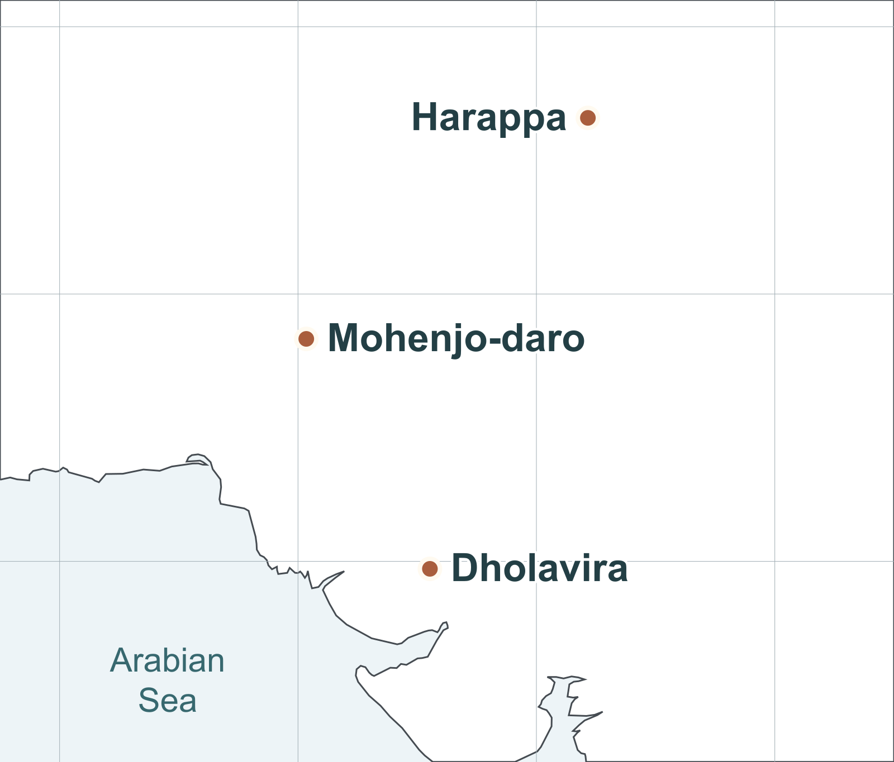
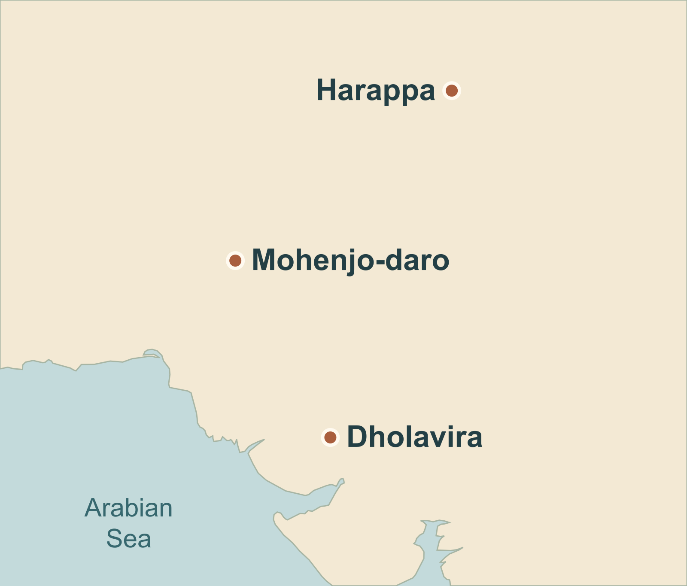

# Indus cities locator map

Date: 2026-09-11

Lesson ID: `lesson.indus.cities-and-signs`

Module ID: `module.indus.cities-locator-map`

Runtime media ID: `media.indus.cities-locator-map`

Rights decision: **approved** — original deterministic design using public-domain geographic data and non-expressive site coordinates.

Depiction status: coordinate-based locator; modern coastline for orientation. The current map-module schema expresses this as `illustrative-reconstruction`, with the visible qualification below.

## Map purpose

Locate the three cities discussed in the approved lesson: Harappa to the northeast of Mohenjo-daro, and Dholavira farther south and east toward the Arabian Sea. These are selected examples, not the limits of the Indus civilization. The lesson covers c. 2600–1900 BCE; the map does not reconstruct that period's coastline, waterways, or political territory.

Extent: 63–78° E, 21–32.4° N. Required raster labels, complete exact list: **Harappa**, **Mohenjo-daro**, **Dholavira**, **Arabian Sea**. North is at the top. All educational prose, dates, provenance, geographical qualifications and orientation text belong in native module fields. No decorative compass, modern national borders, invented routes, or presumed ancient river courses.

Desktop: uncropped image with native caption. Narrow mobile: complete image, labels checked at 358 CSS-pixel equivalent. Use the evidence viewer for enlargement; the text summary must communicate the same relationship without the image.

## Geographic reference and rights

**Base geometry:** [Natural Earth 1:50 million land](https://www.naturalearthdata.com/downloads/50m-physical-vectors/50m-land/), public-domain land polygons. The website lists the land layer as version 4.0.0; this rendering pins its GeoJSON distribution to repository release **v5.1.2**, rather than an unstable `master` URL. These are different version scopes. [Pinned source](https://raw.githubusercontent.com/nvkelso/natural-earth-vector/v5.1.2/geojson/ne_50m_land.geojson), [public-domain terms](https://www.naturalearthdata.com/about/terms-of-use/). Accessed September 11, 2026. Creator lineage: Natural Earth contributors, including Tom Patterson and Nathaniel Vaughn Kelso. Modification, raster export and commercial redistribution are permitted. Optional attribution used: “Made with Natural Earth.”

The selected cropped coordinates and original-file checksum are preserved in `indus-map-assets/indus-map-data.json`. The crop is factual geometry, not copied editorial cartography. Coastlines are generalized at a regional scale and modern; this dataset cannot locate Bronze Age shorelines or the waterways surrounding Khadir.

**Site positions:** [UNESCO WHC Moenjodaro, property 138](https://whc.unesco.org/en/list/138/), [UNESCO WHC Dholavira, property 1645](https://whc.unesco.org/en/list/1645/), and [Getty TGN Harappa, archaeological site 8039784](https://www.getty.edu/vow/TGNFullDisplay?english=Y&find=&nation=&place=&subjectid=8039784). Exact coordinate facts only; no UNESCO or Getty images/maps are copied into the runtime asset. Getty distinguishes this deserted settlement from the nearby inhabited place and identifies its coordinate lineage as NGA/NIMA, feature 6106315.

## Independent cross-check and coordinate discrepancy

[Nazir, Sharif, Arshad and Khan (2014), *Diversity Analysis of Insects of the Thorn Forest Community at Harappa Archaeological Site, Pakistan*, Pakistan Journal of Zoology 46(4), 1091–1099](https://www.zsp.com.pk/pdf46/1091-1099%20%2827%29%20PJZ-1694-14%2014-7-14.pdf), p. 1092, “Description of study area”, provides 30°38′ N, 72°52′ E for the archaeological study site. This field study is an independent check of Getty's site position, agreeing within about half a kilometre. Its ecological conclusions are not used as historical evidence. The PDF was downloaded to ignored `tmp/indus-harappa-coordinate-reference.pdf` and the relevant passage close-read with pypdf; no figure is redistributed.

The [UNESCO tentative-list entry for Harappa](https://whc.unesco.org/en/tentativelists/1878/) instead prints **30°6′ N, 72°8′ E**. That differs substantially from both the archaeological-site gazetteer and the on-site field study. It is excluded from numerical placement rather than silently corrected or treated as corroboration. It remains useful only for the broad Punjab/Ravi setting. The plotted marker is a regional site locator, not a building footprint or an excavation boundary.

| Site | Latitude N | Longitude E | Chosen authority | Review |
| --- | ---: | ---: | --- | --- |
| Harappa | 30.636100 | 72.863900 | Getty TGN archaeological site 8039784 | Independent field-study coordinates agree at this scale |
| Mohenjo-daro | 27.329167 | 68.138889 | UNESCO: N27 19 45 / E68 8 20 | Decimal conversion checked; southwest of Harappa |
| Dholavira | 23.888408 | 70.213303 | UNESCO: N23 53 18.27 / E70 12 47.89 | Decimal conversion checked; south and east of Mohenjo-daro |

## Confidence and uncertainty boundary

- **Coordinate-verified:** the three archaeological-site markers at regional scale.
- **Source-supported:** their relative placement and the Arabian Sea to the southwest; present-day countries supplied in native text.
- **Approximate:** generalized modern coastline. It is not a historical coastline reconstruction, and does not depict the seasonal water around Dholavira.
- **Omitted:** all ancient river channels, wetlands, settlement extents, roads, exchange routes, political borders, and modern national boundaries. Absence of a river line is not evidence that a city lacked river access.

Visible native uncertainty note: “The coastline is modern and generalized for orientation. Ancient shorelines, river channels and political borders are not shown.”

## Image lifecycle

Method: deterministic SVG, no image generation. Renderer/code: `scripts/media/indus-map.mjs`; Node and Sharp versions are recorded in `indus-map-assets/indus-map-lineage.json`. Projection: equirectangular, standard parallel 27° N, north up. The bounding rectangle clips source polygons by Sutherland–Hodgman intersection without coastline smoothing. Only crossings at the rectangular frame are interpolated. Points are projected directly from the recorded coordinates. The complete source data, transformation and label list are reviewable; reruns use the pinned preserved crop.

Reference/data rendering:



Accepted final:



Narrow-mobile scale review:


**Comparison verdict:** Codex map-production agent inspected the actual reference/data view, 1600 × 1365 final and 358-pixel derivative on September 11. All three markers retain their numerical positions; coastline geometry is unchanged between data view and final; required labels are spelled correctly, distinct, uncropped and readable at the reviewed narrow width. The large native text summary remains required for accessibility. No rejected image candidates; the discrepant UNESCO Harappa coordinate was rejected before rendering. This is an identified AI production review, not a fabricated child or human review.

Preserved artifacts:

- SVG master: `docs/research/indus-map-assets/indus-map-master.svg`.
- PNG archival master: `docs/research/indus-map-assets/indus-map-master.png` (99,911 bytes).
- Runtime catalog source: `public/images/maps/indus-cities-locator.png` (identical PNG; compact enough for the `picture` preset).
- Cropped data and source SHA-256: `docs/research/indus-map-assets/indus-map-data.json`.
- Output checksums and rendering version: `docs/research/indus-map-assets/indus-map-lineage.json`.
- Source/master PNG SHA-256: `6d4f6ba3a13ddce6fc791c4b2377355d7f5c2fa19e0c6dbcfe9a25e4cc0443ca`.

The shared media builder must create the optimized rollback and responsive derivatives; none are hand-written here. Suggested add command:

```sh
npm run media:add -- --id media.indus.cities-locator-map --source public/images/maps/indus-cities-locator.png --collection indus --fallback /images/optimized/indus/cities-locator-map.optimized.webp --preset picture --widths 480,960,1600
```

## Integration metadata

Add reviewed Source records for `source.indus.locator-natural-earth`, `source.indus.locator-getty-harappa` and `source.indus.locator-harappa-field-study`; reuse existing `source.indus.moenjodaro` and `source.indus.dholavira`. Full origin, rights and passage details are above.

Media record:

```ts
{
  id: 'media.indus.cities-locator-map',
  locator: mediaLocator('media.indus.cities-locator-map'),
  alt: 'North-up locator showing Harappa northeast of Mohenjo-daro, and Dholavira south and east of Mohenjo-daro. The Arabian Sea is to the southwest.',
  depictionMode: 'map',
  depictionLabel: 'City locations · modern coastline for orientation',
  rightsLabel: 'Chronos original · Natural Earth geography, Public Domain',
  sourceIds: ['source.indus.locator-natural-earth', 'source.indus.locator-getty-harappa', 'source.indus.locator-harappa-field-study', 'source.indus.moenjodaro', 'source.indus.dholavira'],
  visualBriefRef: 'docs/research/indus-locator-map.md',
  reviewStatus: 'approved',
}
```

Map module:

```ts
{
  id: 'module.indus.cities-locator-map', type: 'historical-map',
  eyebrow: 'Place & landscape', title: 'Three cities across the region',
  body: 'Harappa lay northeast of Mohenjo-daro. Dholavira lay farther south and east, toward the Arabian Sea. These are three examples from a much larger settlement network.',
  mediaId: 'media.indus.cities-locator-map', periodLabel: 'c. 2600–1900 BCE',
  focusPlace: 'Harappa, Mohenjo-daro and Dholavira',
  modernContext: 'Harappa and Mohenjo-daro: Pakistan. Dholavira: Gujarat, India',
  accessibleSummary: 'With north at the top, Harappa is northeast of Mohenjo-daro. Dholavira is south and east of Mohenjo-daro; the Arabian Sea lies to the southwest. The three sites do not mark the boundaries of a state.',
  compactLabel: 'City locations · modern coastline',
  coordinateNote: 'Site positions follow UNESCO and Getty records, with an independent check of Harappa.',
  uncertaintyNote: 'The coastline is modern and generalized for orientation. Ancient shorelines, river channels and political borders are not shown.',
  depictionStatus: 'illustrative-reconstruction',
  claimIds: ['claim.indus.regional-cities'],
  sourceIds: ['source.indus.locator-natural-earth', 'source.indus.locator-getty-harappa', 'source.indus.locator-harappa-field-study', 'source.indus.moenjodaro', 'source.indus.dholavira'],
}
```

## Validation and outstanding integration

- The script completed successfully; dimensions and all artifact hashes are preserved.
- Image-only historical/visual and 358-pixel label reviews passed as described above.
- Parent task owns media catalog/manifest generation, lesson insertion, real-shell desktop/tablet/mobile and theme verification, content validation, tests and any publication. Those checks are **not** claimed by this bounded map-production task.
- No media, lesson, prototype-registry, source-catalog or existing research-note records were changed by this task. No upload or git commit was performed.


September 12 integration update: map registered in the shared media pipeline and rendered once in lesson orientation. The parent reviewer moved only Harappa’s label to the left of its unchanged site marker to clear the phone-width enlarge button. Updated source/final comparison and actual phone layout passed; new hashes are in indus-map-assets/indus-map-lineage.json. Lesson-level checks and pending owner visual review are recorded in the canonical Indus research note.
