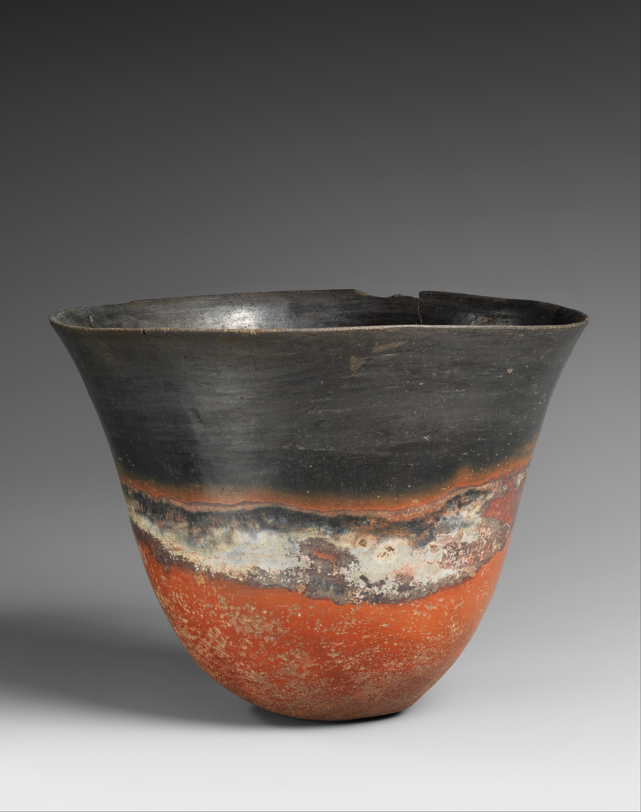
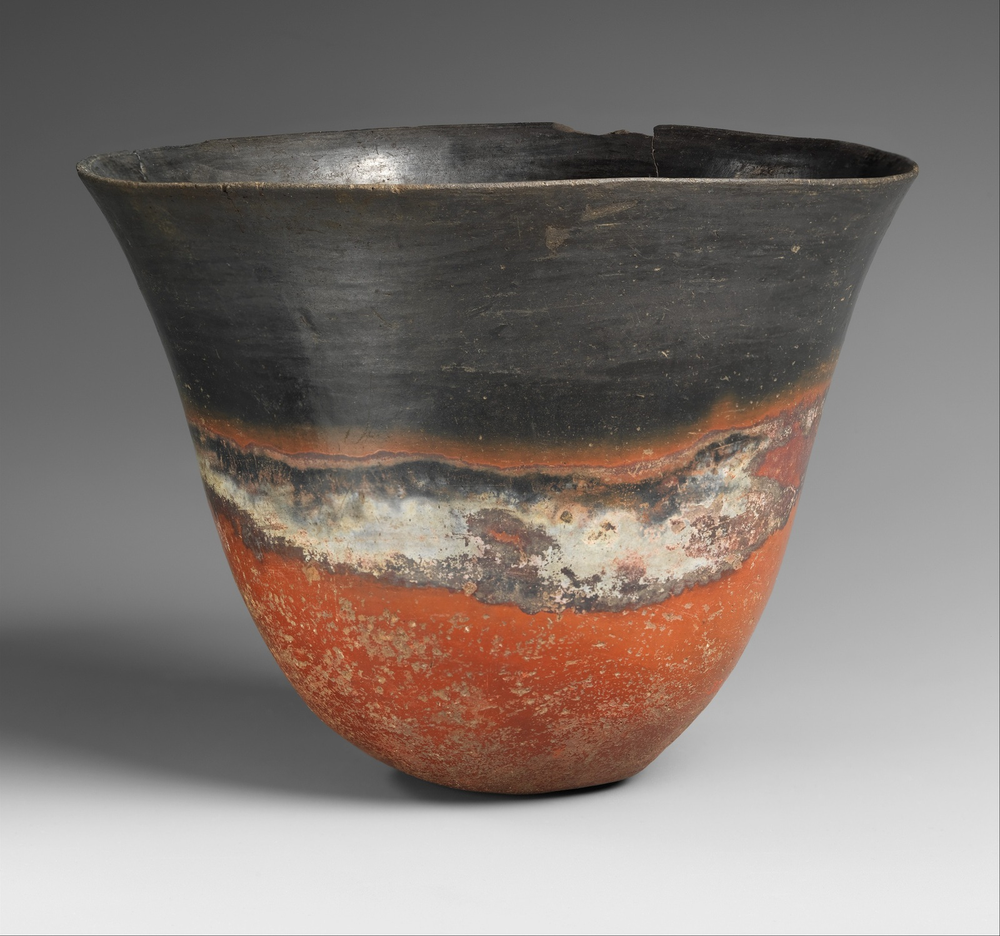
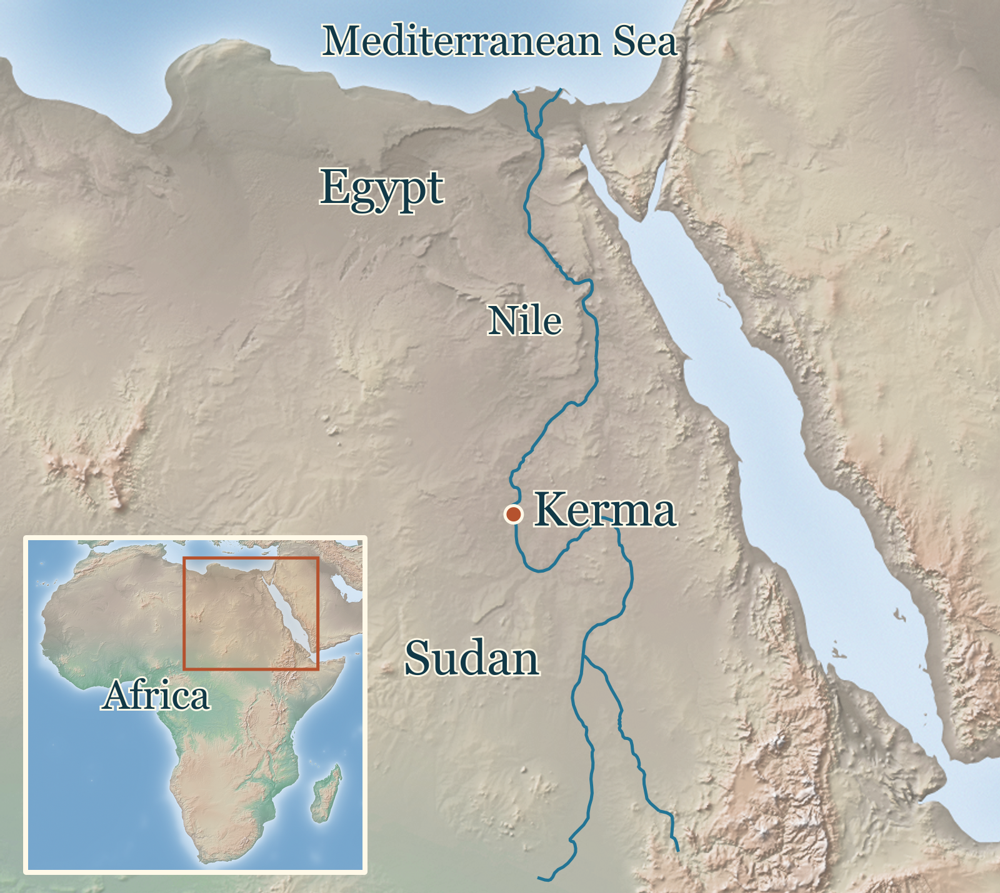
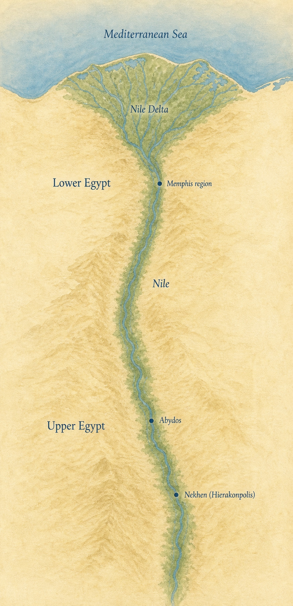
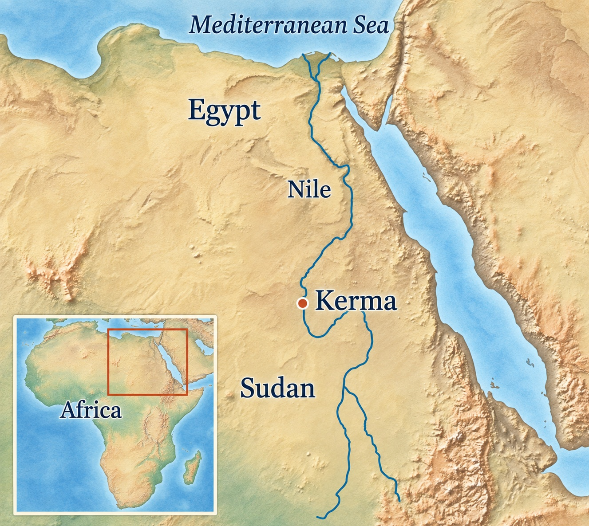
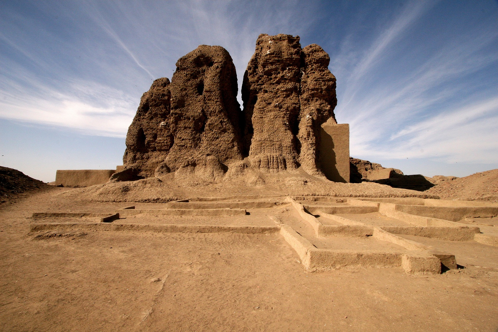
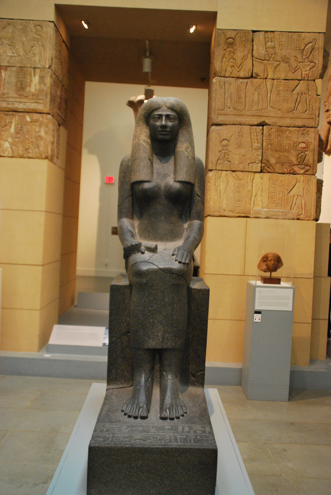
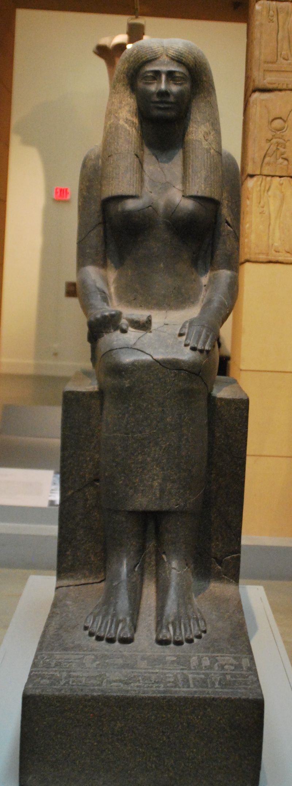

# Kerma and the Middle Nile research and editorial note

Issue: [ASH-101](https://linear.app/ashs-workshop/issue/ASH-101/research-and-publish-kerma-and-the-middle-nile)
Draft PR: [#47](https://github.com/dev-vibe/chronos-learning/pull/47)
Lesson ID: `lesson.nubia.kerma-and-nile-world`
Research-note identity/version: `ash-101-implementation-v3`
Production record version: 2
Journey/chapter/position: World History / Cities, States, and Bronze Age Networks / canonical position 17
Required or optional: required
Queue status: Implementing
Accountable reviewer: Carlin Aylsworth
Validation tier: high-risk (cross-cultural attribution, Egyptian textual perspective, funerary violence and disputed political reconstruction)
Branch: `codex/ash-101-kerma-and-middle-nile`
Base: `origin/main` at `308ad73`
Started: 2026-09-14

## Work boundary and selection

Carlin approved the revised Stage 3B direction and, after inspecting the running prototype, said “looks good” and “please continue” on September 14. The approved map and licensed evidence photograph are now integrated. This is unpublished implementation for final review, not publication authorization. Existing uncommitted work in the main pyramids checkout remains untouched.

Production order 90 is the next eligible Ready entry after Indus. The Nile dependency is published and recorded Complete in the queue; `content/lessons/egypt-nile-state.ts` carries its published lesson. Indus PR #41 is merged and its September 13 publication is recorded on main and ASH-100. Sahul's old Review row was reconciled using merged PR #35, ASH-109 Done, and `docs/research/crossing-to-sahul.md` (publication migration applied and media checksums verified September 4). This is reconciliation of recorded release evidence, not a fresh hosted completion test or new publication approval. The operational queue is distinct from older readiness labels in the canonical roster.

Repository inspection found no existing typed Kerma lesson. The current aggregate, World History journey, adjacent Nile/Indus lessons, inline cards, media registry, content contracts and committed publication migrations supply the implementation boundaries for a later approved prototype. The alias `kerma` is a reviewed roster alias; no legacy completion migration is authorized by this research increment.

## Node proposal

These are provisional research targets, not approved learner claims or a settled blueprint.

- **Essential question (revised audience-fit proposal):** What made Kerma a powerful neighbor of Egypt?
- **Durable understanding to test:** People at Kerma built a kingdom through food production, skilled work and connections with other communities; sharing the Nile with Egypt did not mean sharing one ruler. This is a provisional explanation to develop and qualify against the sources, not a sufficient-cause claim or an approved learner sentence.
- **Supporting questions:** What supports local state formation? How did craft, food production and exchange sustain it? How did relations with Egypt change? What can surviving objects and Egyptian testimony establish separately and together?
- **Evidence encounter to investigate:** a securely provenanced Kerma object or excavated context, potentially compared with an Egyptian account. Selection waits until Stage 3B is considered.
- **Prerequisite:** `lesson.egypt.nile-state`, especially the distinction between river connections and political rule, and between royal claims and independent evidence.
- **Misconceptions to test:** all Nile history is Egyptian history; Egyptian objects necessarily mean Egyptian rule; a distinctive material tradition proves a uniform population or an unchanging polity; monuments alone explain how people lived.
- **Scope:** c. 2500–1500 BCE, Kerma and the Middle Nile, with earlier settlement and later Egyptian conquest considered only where necessary to explain chronology. Modern Sudan/Egypt are geographic orientation, not projected ancient borders.
- **Why one lesson:** a bounded comparison of local organization and external relationships adds a distinct Nile-world case after Indus and before Akkad.
- **Non-goals:** a survey of all Nubian history, Napatan/Meroitic kings or pyramids, a race/origin verdict, exact territorial borders without evidence, or a catalogue of burial deaths.
- **Neighbors:** `lesson.indus.cities-and-signs` precedes Kerma in the canonical sequence; `lesson.mesopotamia.akkadian-empire` follows it and remains unimplemented. Overlapping dates must not imply a civilizational relay.
- **Geographic orientation target:** northeastern Africa → Egypt and Sudan along the Nile → the Kerma region. Exact native wording and map treatment remain later design work.

## Research questions

1. What settlement sequence and dating evidence underlie the c. 2500–1500 BCE scope? Which dates describe archaeological phases rather than one continuous government?
2. Which urban, domestic, craft and funerary evidence supports local political organization? What did Reisner's Egyptian-colony interpretation assume, and which discoveries changed it?
3. What do cattle, crops, storage, workshops and exchange reveal about the people sustaining Kerma? Which economic mechanism remains an inference?
4. How did Egyptian objects reach Kerma, and how far can gifts, exchange, migration or plunder be distinguished from their contexts?
5. What do Egyptian inscriptions report about Kush/Kerma? What does their genre, chronology and political purpose prevent us from concluding?
6. How do newer work at Kerma/Doukki Gel, regional archaeology and environmental or isotope studies qualify city origins, mobility and connections beyond Egypt?
7. What is actually observed in multiple burials, and what remains inferred about killing, dependency, consent and identity? Is this necessary to explaining unequal power at this scope?
8. Which local, Sudanese, Nubian and transmitted perspectives are recoverable? What should not be inferred from their absence in accessible excavation reports?
9. Which consequential alternative or comparative proposals have inspectable methods and testable implications? Apply the same standards to the inherited account.
10. Which source passages, object contexts and underlying data remain inaccessible, and which conclusions must be narrowed or deferred as a result?

## Research execution

Routine source discovery and passage retrieval were assigned explicitly to `gpt-5.6-sol`, agent `/root/kerma_sources`. Its first turn returned a usage-limit failure before evidence; it was retried after Carlin's September 14 instruction to continue. Relevant local execution metadata identifies child session `01a09e0a-d649-7252-822f-a8cca33be70a`, the current parent thread and agent path, with `turn_context.payload.model: gpt-5.6-sol` in both turns. This confirms observed routing, not a measured cost saving. No private transcript is copied into the repository. Historical synthesis, source-conflict judgments and lesson decisions remain with the main agent and accountable owner.

## Source ledger

Access date: 2026-09-14. Source roles below are provisional research roles; they do not constitute the Stage 4 learner claim selection. Sol retrieved the specified evidence; the main agent assessed its implications and limits. Rights are research-only unless separately established; no illustration or full source is redistributed by this note.

| Source ID | Citation/link | Type/expertise and role | Research question / exact location | Limits and corroboration | Review |
| --- | --- | --- | --- | --- | --- |
| `source.kerma.reisner-interpretation` | George A. Reisner, *Excavations at Kerma*, Parts IV–V, Harvard African Studies 6 (1923), [p. 3](https://doi.org/10.11588/diglit.49517#0031), [p. 7](https://doi.org/10.11588/diglit.49517#0035) | Original excavation interpretation; qualifying historical baseline | Q2/Q4: colony assertion and hypothetical Egyptian household/industrial nucleus | Excavated objects are evidence; attribution of the whole settlement to Egyptians is an inference. Compare later settlement excavation, not merely modern labels. | Retrieved passages; interpretation assessed, not adopted |
| `source.kerma.reisner-context` | Reisner, *Excavations at Kerma*, Parts I–III, Harvard African Studies 5 (1923), [p. 138](https://doi.org/10.11588/diglit.49516#0198) | Excavation find record; central supporting candidate | Q4: Sennuwy/Hepzefa sculpture context | Early excavation recording and later disturbance constrain transport history. Compare MFA object identity; neither alone dates the object's arrival. | Retrieved context |
| `source.kerma.mission-research` | Swiss Archaeological Mission, [Research](https://kerma.ch/en/research/), undated project account | Excavation-team synthesis; central supporting | Q2: renewed work from 1977 and recovery of a substantial urban plan | Direct project expertise, but this is a retrospective account. Independent object, settlement and regional evidence should constrain the interpretation. | Relevant webpage retrieved |
| `source.kerma.mission-history` | Swiss Archaeological Mission, [History](https://kerma.ch/en/history/), undated | Project chronology/economy synthesis; central supporting candidate | Q1/Q3/Q5: Ancient, Middle, Classic and Final Kerma phase table; economic and political account | Phase boundaries are archaeological conventions, not exact reign changes. Trade routes and political relationships need more precise support before learner claims. | Relevant webpage retrieved |
| `source.kerma.isotopes-2008` | A. H. Thompson, L. Chaix and M. P. Richards, *Stable isotopes and diet at Ancient Kerma, Upper Nubia (Sudan)*, JAS 35 (2008), 376–387, [article](https://kerma.ch/documents/Publications_PDF/Chaix_Thompson_2007_Isotopeskerma.pdf), DOI 10.1016/j.jas.2007.03.014 | Original isotope study; qualifying | Q3/Q6: p. 377 historical context, pp. 383–385 diet/mobility and sampling limits | Isotopes constrain diet/movement under baseline assumptions, not ethnic identity or a whole economy. A nonlocal cattle result concerns one sampled animal. | Relevant full-paper passages retrieved |
| `source.kerma.mass-burials` | M. A. Judd and J. D. Irish, *Dying to serve: the mass burials at Kerma*, Antiquity 83 (2009), 709–722, [article](https://www.cambridge.org/core/services/aop-cambridge-core/content/view/C64CF190D99C036B35E4D02729DF52DD/S0003598X00098938a.pdf/dying_to_serve_the_mass_burials_at_kerma.pdf), DOI 10.1017/S0003598X00098938 | Original bioarchaeological reassessment; qualifying | Q7: pp. 709–710 voluntary-retainer premise; pp. 714–718 injury/comparison results; pp. 718–720 contextual limitations | Disturbance and skeletal visibility limit cause-of-death inference. Lack of unambiguous trauma does not establish natural death or consent; cranial similarity does not identify ethnicity or legal status. | Relevant full-paper passages retrieved |
| `source.kerma.mobility-2023` | L. A. Gregoricka and B. J. Baker, *Investigating Mobility and Pastoralism in Kerma-Period Communities Upstream of the Fourth Cataract, Sudan*, AJBA 182(2) (2023), 279–299, [indexed study](https://pubmed.ncbi.nlm.nih.gov/37539620/), DOI 10.1002/ajpa.24827 | Regional strontium study; discovery lead pending close full-text review | Q6: abstract, 50 teeth from 27 people in five upstream cemeteries; changing nonlocal representation across periods | Regional burial sample is not Kerma city or a kingdom-wide census. Do not adopt its political model from the abstract. | Abstract accessed; central use deferred |
| `source.kerma.metallurgy` | F. W. Rademakers, G. Verly, P. Degryse, F. Vanhaecke, S. Marchi and C. Bonnet, *Copper at Ancient Kerma: A Diachronic Investigation of Alloys and Raw Materials*, Advances in Archaeomaterials 3(1) (2022), 1–18, [article](https://www.sciencedirect.com/science/article/pii/S2667136022000036), DOI 10.1016/j.aia.2022.01.001 | Original material/provenance study; central supporting candidate | Q3/Q4: §2 sample/method; Table 1 and §§3.1–3.2 alloying; §§4–5 supply alternatives | Alloying/recycling is material evidence of technical practice. Shared signatures do not uniquely distinguish common supply or knowledge transfer from similar geology. | Full text retrieved |
| `source.kerma.doukki-gel` | Joint mission, [Doukki Gel avant la conquête égyptienne](https://kerma-doukkigel.ch/site-de-doukki-gel/doukki-gel-avant-la-conquete-egyptienne), undated | Excavator's architectural report and interpretation; qualifying | Q6: circular/ovoid ceremonial buildings, excavated column bases, proposed wider African coalitions, unexcavated areas | Plans document structures; buildings called palaces and their political affiliations require interpretation. Estimated total columns are not excavated counts. Egyptian-period and later layers must be separated. | Named webpage retrieved; coalition proposal remains hypothesis |
| `source.kerma.sobeknakht` | W. Vivian Davies, *Kush in Egypt: A New Historical Inscription*, Sudan & Nubia 7 (2003), 52–54; French version, *Kouch en Égypte: Une nouvelle inscription historique à El-Kab*, trans. M.-C. Cuvillier, BSFE 157, 38–44, [French record](https://www.persee.fr/doc/bsfe_0037-9379_2003_num_157_1_2625), DOI 10.3406/bsfe.2003.2625 | Elkab Tomb 10 epigraphy; discovery lead for direct translation | Q5: French p. 38 conservation/recording; reported Kush incursion is also discussed in `mass-burials`, pp. 709–710 | Damaged self-commemorative Egyptian text. Named allies, restorations and campaign extent require direct edition review. | French first page/metadata only; canonical English full text not retrieved. Noncanonical mirror does not close this gap. No direct learner quotation authorized |
| `source.kerma.sennuwy` | Museum of Fine Arts Boston, [Lady Sennuwy conservation/object record](https://www.mfa.org/collections/conservation/feature_ladysennuwy), accession 14.720 | Object identity/conservation record; central supporting candidate | Q4: Egyptian sculpture recovered at Kerma, K III | Manufacture, named person, findspot and later movement answer different questions. Present museum account is not independent of Reisner's excavation context. | Object record retrieved |
| `source.kerma.cemetery-2018` | Camille Fallet, *Population from the Kerma Eastern Cemetery: Biological Identity and Funerary Practices*, in M. Honegger (ed.), Nubian Archaeology in the XXIst Century, OLA 273 (2018), 817–822, [paper](https://kerma.ch/application/files/3215/5362/0323/Fallet_2018_Population_for_the_Kerma_Eastern_Cemetery.pdf) | Preliminary cemetery bioanthropology; qualifying | Q6/Q7: pp. 817–819 corpus/context; p. 821 comparative analysis | Only a small part of the cemetery is studied; preservation, looting and model variance limit population inference. Biological variation cannot establish a political coalition, race or named language. | Relevant full-paper passages retrieved |
| `source.kerma.prehistory-2014` | Matthieu Honegger, *Recent Advances in Our Understanding of Prehistory in Northern Sudan*, in Anderson and Welsby (eds.), The Fourth Cataract and Beyond (2014), 19–30, [paper](https://kerma.ch/documents/Publications_PDF/Honegger_2014_12e_Nubian_Studies_Recent_Advances_Understanding_Prehistory_Northern_Sudan.pdf) | Excavator's regional field report; central supporting | Q1/Q2: pp. 19–21 survey/dating; pp. 28–29, fig. 8 and plate 4 Pre-Kerma settlement | Earlier agropastoral settlement supports regional depth, not an uninterrupted dynasty or a complete explanation of state origins. | Relevant full-paper passages retrieved |
| `source.kerma.environment-2015` | M. Honegger and M. Williams, *Human Occupations and Environmental Changes in the Nile Valley during the Holocene: The Case of Kerma in Upper Nubia (Northern Sudan)*, QSR 130 (2015), 141–154, [paper](https://libra.unine.ch/bitstreams/48ff655b-f191-4dd2-a5cb-1ec34530abb3/download), DOI 10.1016/j.quascirev.2015.06.031 | Geoarchaeological/radiocarbon study; qualifying | Q1/Q3: §1, occupation gaps and summary/conclusions; sites, radiocarbon and stratigraphic sections | Much of the reconstructed environmental change predates mature Kerma. Association does not demonstrate climate as the sufficient cause of a state. | Selected body/method/conclusion passages retrieved, not every passage |
| `source.kerma.city-project` | French Ministry of Culture / joint Sudanese–Swiss–French mission, [Kerma–Doukki Gel](https://archeologie.culture.gouv.fr/monde/fr/kerma-doukki-gel), undated | Field-project account; central supporting candidate | Q2/Q3: La ville de Kerma; Les recherches en cours; Les partenaires | Houses, fortifications and workshop contexts broaden attention beyond elite burials. Summary lacks layer-by-layer references and overlaps the joint mission's evidence. | Full webpage retrieved |
| `source.kerma.avaris-2014` | Enrico Dirminti, *Between Kerma and Avaris: The First Kingdom of Kush and Egypt during the Second Intermediate Period*, in Anderson and Welsby (eds.), The Fourth Cataract and Beyond (2014), 339–346, [author copy](https://www.researchgate.net/publication/215767896_Between_Kerma_and_Avaris_the_first_Kingdom_of_Kush_and_Egypt_during_the_Second_Intermediate_Period) | Archaeological/textual comparison; qualifying | Q4/Q5: pp. 342–344 Kamose's embedded letter; pp. 343–344 pottery at Tell el-Dab'a | Local Nile-silt manufacture and imitation complicate simple imported-object narratives. The embedded letter may be literary construction. | Displayed author-copy text retrieved; noncanonical hosting |
| `source.kerma.kamose` | Digital Karnak, University of California Santa Cruz, [Victory Stela of Kamose](https://digitalkarnak.ucsc.edu/victory-stela-of-kamose/), undated | Monument record; qualifying | Q5: object description and reused Karnak context | Object survival supports the text's existence, not the literal truth of an intercepted letter or the ruler's victory narrative. | Full object page retrieved |
| `source.kerma.dna-2022` | Ke Wang et al., *4000-Year-Old Hair from the Middle Nile Highlights Unusual Ancient DNA Degradation Pattern and a Potential Source of Early Eastern Africa Pastoralists*, Scientific Reports 12 (2022), 20939, [paper](https://www.nature.com/articles/s41598-022-25384-y), DOI 10.1038/s41598-022-25384-y | Original aDNA study; qualifying | Q6: Kadruka 1 SK68; fig. 1, authentication, figs. 3–4 and discussion | One rural low-coverage individual supports tentative affinity, not kingdom-wide ancestry, ethnicity, language or migration direction. | Full text retrieved |
| `source.kerma.letti-2023` | P. Osypiński, M. Osypińska, J. Kokolus, P. Wiktorowicz, R. Łopaciuk and A. Hassan Gismallah, *Southern Province of the First African State: Discovery of the Kerman Settlement in Letti, Sudan*, Antiquity 97(396) (2023), e33, 1–6, [article](https://www.cambridge.org/core/journals/antiquity/article/southern-province-of-the-first-african-state-discovery-of-the-kerman-settlement-in-letti-sudan/7B3E943EE1A7807C4A7CD39BAAE48F19), DOI 10.15184/aqy.2023.148 | Original preliminary settlement report, Sudanese coauthor; qualifying | Q1/Q2/Q3: New Data and fig. 2 pit dates; figs. 3–4 wall, storage/production contexts | A small excavated area supports regional settlement research, not fixed provincial borders. The title's political and priority language is an interpretation, not automatically learner wording. | Full publisher HTML/PDF retrieved |

Additional discovery leads, not central support:

- **Bonnet 2015**, *Une ville cérémonielle africaine du début du Nouvel Empire égyptien*, BIFAO 115, 1–14 ([catalogue](https://www.ifao.egnet.net/publications/catalogue/?nif=BIFAO115_art_01.pdf&nv=0)): abstract/catalogue accessed; PDF timed out. Precise plans require retrieval.
- **Bonnet and Salah M. Ahmed 1990**, *Kerma, l'un des plus vieux royaumes d'Afrique*, Archéologia 258, 32–41, and *Kerma, point de rencontre entre l'Égypte et les populations africaines*, Sahara 3, 83–88 ([bibliographic trail](https://www.kerma.ch/documents/Publications_PDF/Genava_1991/Rapport_1991.pdf)): bibliographically verified only; full articles remain a Sudanese-coauthored interpretation lead.
- **Ezzeldin Awad al-Bari Abd al-Rahim al-Sheikh 2019**, *The Kingdom of Kerma: Its Origin, Development, and Foreign Relations, 2500–1500 BCE*, Al-Neelain University master's thesis ([Arabic repository record](https://repository.neelain.edu.sd/items/f60e1880-8675-4493-a179-31e5e89e778b)): Arabic metadata/abstract inspected; full text not passage-translated. Modern historiography, not contemporary Kerma testimony.
- **Stuart Tyson Smith 2021**, *Archaeology of the Kerma Culture* ([DOI](https://doi.org/10.1093/acrefore/9780190277734.013.1071)): abstract only; bibliography/full chapter access remains a gap.
- **Judd 2004**, *Trauma in the City of Kerma: Ancient versus Modern Injury Patterns* ([paper](https://bioarchaeologyofviolence.wordpress.com/wp-content/uploads/2018/05/2004-judd.pdf)): full study retrieved; injury pattern comparisons cannot identify warfare or perpetrators. **Buzon and Judd 2008**, *Investigating Health at Kerma: Sacrificial versus Nonsacrificial Individuals* ([abstract](https://doi.org/10.1002/ajpa.20781)): abstract only; similar measured health does not establish status or consent. These qualify potential later treatment; no extra violence sequence is proposed.

## Recent-challenge audit (Stages 3A–3B)

**Inherited baseline to test:** Kerma is conventionally described as a powerful, locally rooted Nubian capital, connected through farming, herding, craft and trade, at times Egypt's rival and eventually conquered by Egyptian rulers. An older excavation interpretation treated its elite monuments and Egyptian objects as evidence of an Egyptian colony. The modern synthesis corrects that attribution, but can still overstate a uniform kingdom, precise borders, a single population, a purely commercial relationship or a fully explained burial ritual.

**Window:** approximately 1976–2026, with earlier excavation interpretation and ancient texts included because newer archaeology changes their interpretation. The following is the main agent's provisional assessment of the retrieved evidence. Proposed discriminating tests are analytical suggestions, not claims that those tests have occurred.

| Revision/upset and consequence | Origin/current form | Evidence/provenance and method | Corroboration and strongest countercase | Discriminating test / remaining gap | Status and possible lesson consequence |
| --- | --- | --- | --- | --- | --- |
| Local capital rather than Egyptian colony | Reisner's early twentieth-century colony model; post-1977 settlement work changes attribution | Original sculpture/find contexts compared with the urban sequence and older agropastoral settlement (`reisner-interpretation`, `reisner-context`, `mission-research`, `prehistory-2014`) | Different evidence classes support local organization. Imported prestige objects and later Egyptian conquest remain real; local roots do not imply isolation or no Egyptians present. | Phase-specific domestic/administrative contexts can distinguish foreign objects and residents from political government. Earlier settlement is not proof of continuous institutions. | **Supported inference:** a locally rooted capital. Correct the colony premise while treating subsequent conquest separately. |
| A connected river did not produce one uniform society | Project phase/economy synthesis; isotope and cemetery studies qualify static population narratives | Chronology, burial sampling and isotope comparisons reveal change and variation (`mission-history`, `isotopes-2008`, `mobility-2023`, `cemetery-2018`) | Multiple methods make homogeneity unsafe, but samples differ in date, place and representativeness. None is a census or direct map of authority. | Comparable local baselines, larger dated samples and domestic contexts would test mobility patterns. The 2023 full study still requires close review. | **Supported caution; political model unresolved.** Explain time/place variation without converting biological measurements into ethnicity. |
| Egyptian objects have several possible travel histories | Reinterpretations of statues and other imports after rejection of the colony model | Object manufacture/identity versus secondary deposition; competing trade, gift and plunder explanations (`sennuwy`, `reisner-context`) | An Egyptian object in a Kerma burial securely establishes movement; specific routes and motives are less secure. Museum explanations often inherit the same excavation evidence. | Earlier ownership marks, securely dated intermediate contexts or matching textual records might separate hypotheses; those links are not established here. | **Observation:** moved objects. **Unresolved inference:** how each arrived. Useful comparison without asserting that all imports were trade or booty. |
| Technical expertise can be locally distinctive while connected | Rademakers et al. 2022 archaeometallurgy | Composition and lead-isotope comparisons across sampled objects, including alloying/recycling (`metallurgy`) | Material analysis supports technical practice; similar signatures permit several geological and social explanations. Imports do not exclude local skill, nor does local working identify every ore source. | Better characterized ore baselines, workshop residues and matched comparative assemblages could distinguish supply from shared technique. | **Supported material findings; supply mechanisms unresolved.** Give craft a concrete role, avoid a one-way technology-transfer story. |
| Kush could threaten Egypt and mobilize allies | Davies's 2003 Sobeknakht publication; Kamose's royal narrative | Elkab Tomb 10 and Kamose stela, interpreted through `sobeknakht`, `mass-burials`, `avaris-2014` and `kamose` | Two Egyptian traditions complicate one-sided dominance, but neither is a neutral log. The embedded Kamose letter may be literary; Egyptian objects at Kerma cannot automatically be assigned to a named raid. | Independent dated contexts could test campaign extent. Sobeknakht's full canonical translation remains an access gap, so exact coalition lists and learner quotations are deferred. | **Supported reported testimony; particulars unresolved.** Present southern political agency without claims that Kerma nearly destroyed all Egypt. |
| Doukki Gel may indicate broader African political connections | Bonnet/joint mission architectural interpretation, updated through ongoing excavation and survey | Circular/ovoid ceremonial complexes and unusual columned architecture contrasted with neighboring Kerma and Egyptian forms (`doukki-gel`) | Architectural difference is inspectable; assigning distinct buildings to named outside peoples or a coalition is a further step. Functional variation, local innovation and successive building phases are alternatives. | Securely contemporary comparative sites, shared material/provenance signatures and independent texts would test coalition membership. Unexcavated areas and estimated reconstructions remain limits. | **Observation:** distinctive architecture. **Plausible hypothesis:** coalition explanation. Preserve the possibility proportionately; do not illustrate a known multi-king assembly. |
| Mass burials do not establish voluntary retainers or one uniform ritual | Reisner's explanation reassessed by Judd and Irish 2009 | Context, skeletal injury and comparative biological analysis (`mass-burials`) | Collective interment and elite expenditure support questions about unequal power. Consent, dependency and cause of death do not survive directly; killing without skeletal injury remains possible. | Better undisturbed contexts and direct cause-of-death evidence might narrow explanations, but motive/consent may remain unrecoverable. | **Observation:** multiple burials. **Unresolved:** individual deaths/status/motives. If included, describe briefly without voluntary-sacrifice certainty, graphic detail or a death-count spectacle. |
| Environmental pressure or cattle alone does not explain the state | Long-term geoarchaeology and agropastoral-state proposals | Site distribution, dates and stratigraphy compared with settlement and food evidence (`environment-2015`, `prehistory-2014`, `isotopes-2008`) | Geography and food production create conditions; much documented aridity predates the polity and cannot specify who organized rule or why. | Contemporaneous institutional changes, local comparison cases and finer dating could test rival causal accounts. | **Supported environmental context; single-cause explanation unestablished.** Keep human organization in the explanation rather than making the Nile or climate act as a ruler. |
| Rare aDNA may link the Middle Nile with eastern African pastoralists | Wang et al. 2022 Kadruka hair study | Authenticated but very sparse genetic data from one directly dated rural individual (`dna-2022`) | Comparative affinities support a possible relationship; one person cannot represent a capital or demonstrate a directional population migration. Metal/building similarities are not independent genetic corroboration. | More authenticated, well-contextualized individuals across places and dates would test representativeness and direction. | **Tentative supported affinity; broader origin claims unverified.** Preserve as optional research depth, not a kingdom identity verdict. |
| Kerma-period organization extended beyond the excavated capital | Letti 2023 field report | Dated storage pits and building/production evidence from a small trench (`letti-2023`) | Expands regional material evidence. A provincial administration is a larger inference than dating settlement; two pit dates do not demonstrate uninterrupted occupation. | Wider excavation, survey and dated administrative contexts would test settlement extent and its relationship to central rule. | **Observation:** regional settlement remains. **Hypothesis:** exact provincial organization. Counters a capital-only picture without drawing a fixed kingdom border. |

### Peripheral or deferred proposals

| Proposal / evidence lead | Why peripheral or deferred | Reconsider if |
| --- | --- | --- |
| A pastoral-state model inferred from changing mobility | Relevant to explaining organization, but the accessible 2023 abstract and upstream sample cannot carry the whole capital's political model. | Full methods and regionally independent settlement/economic evidence support a clearly bounded mechanism. |
| Specific ethnic identities from skull measurements or architectural style | The measurements/forms can be studied; they do not directly recover self-identification, language or named political membership. | Independent contextual/textual evidence makes the particular identity inference testable. |
| Later Napatan/Meroitic monuments as evidence for Kerma's institutions | Different centuries and political settings; resemblance is not proof of unchanged practice. | A securely dated transmission sequence is necessary to explain a core Kerma finding. |

### Comparative analyses and perspective

The research compares local and Egyptian object contexts, settlement phases, regional isotope baselines, metal signatures and building forms. Each comparison generates a specific inference with limits; none is a shortcut from similarity to common rulers, ethnicity or direct descent. Egyptian testimony is contemporary evidence with political purposes, while modern excavation accounts and museum labels are later interpretations.

**Ancient and transmitted accounts:** Sobeknakht's tomb narrative and Kamose's royal text are Egyptian representations of Kush. The latter's embedded letter is discussed as potentially literary, not transparently preserved correspondence. This bounded search recovered no secure Kerma-authored narrative or period oral account. That retrieval result does not establish that Kerma had no historical memory or silence modern Nubian communities. The locally used names *Doukki Gel* (glossed by the mission as “red mound”) and *deffufa* are relevant naming traditions, not recovered chronicles of the Bronze Age.

**Sudanese and local perspectives:** the field-project account identifies a Sudanese–Swiss–French partnership with Sudan's National Corporation for Antiquities and Museums; Doukki Gel's excavation history credits Salah el-din Mohamed Ahmed. Letti's directly reviewed report includes Amel Hassan Gismallah. The two Bonnet–Ahmed articles and Al-Neelain thesis remain explicit retrieval/translation gaps. Coauthorship and institutional partnership do not stand in for the voice of ancient people, living residents or an interview that did not occur. No local consultation is claimed.

### Coverage statement

- **Searches performed by Sol:** Kerma/Pre-Kerma settlement and dating; Reisner/Hepzefa/Sennuwy colony interpretation; cattle/diet isotopes; strontium mobility and pastoralism; copper alloys and lead isotopes; eastern cemetery biological variation; trauma and retainer/sacrificial burials; Sobeknakht/Elkab Tomb 10; Kamose/Apophis/Avaris; Doukki Gel architecture and fortifications; Holocene environment; Kadruka ancient hair DNA; Arabic `مملكة كرمة` in Sudanese university repositories; Bonnet/Salah Mohamed Ahmed; Letti settlement.
- **Repositories and citation trails:** Kerma mission and joint-mission pages and author PDFs; Heidelberg's original excavation digitization; MFA object record and its museum-supplied Google Arts mirror; French field-project portal; Cambridge, ScienceDirect and Nature original studies; PubMed/Wiley abstract records; Neuchâtel repository; Persée, IFAO, Digital Karnak and author-uploaded Dirminti text; Al-Neelain repository. Reisner's object context was followed into modern object interpretation; scientific studies were followed to their methods, sample limits and later mobility/genetic work.
- **Evidence classes:** settlement stratigraphy and radiocarbon; architecture; object biographies; metal chemistry; plants/fauna/diet; regional mobility and aDNA; funerary and injury analysis; epigraphy and royal literary form; modern local naming and Sudanese research participation.
- **Claim-owner and comparative channels:** Reisner's own explanation, current excavators' coalition interpretation, authors' pastoral-state model, original material and genetic studies. These were assessed by inference and method rather than by institutional acceptance. General news, travel, encyclopedia and unsourced educational results served discovery only; no separately reproducible independent dataset overturning the local-state interpretation was recovered in this sweep. This is bounded coverage, not an exhaustive negative claim.
- **Access limitations:** Sobeknakht's French first page and secondary scholarly discussion were readable; the canonical English download could not be recovered from the SARS index (HTTP 425/authentication failures in the bounded follow-up). Precise translation/restored names remain deferred. Bonnet 2015 PDF timed out; Gregoricka/Baker 2023, Buzon/Judd 2008 and Smith 2021 remained abstract-only. Bonnet–Ahmed 1990 full texts were not recovered; the Arabic thesis awaits qualified passage review. Dirminti was read in an author copy, not the publisher edition.
- **Known gaps:** no primary narrative from Kerma itself recovered; no community consultation; uneven sampling outside elite burials and the capital; ore/geographic isotope baselines remain incomplete; archaeological political boundaries and motives are less secure than object and building observations. Recent mission pages were accessed in 2026, which is not a publication date for their discoveries. Broad research coverage does not make every lead close-reviewed.

### Research-direction packet and product-owner response

**Provisional synthesis:** Kerma can be taught as a locally rooted, changing political center sustained by people's work and connected to several regions. Settlement archaeology and production evidence make that account stronger than the former inference from Egyptian prestige objects to Egyptian government. Contact, technical exchange and later conquest belong in the same history; independence does not mean isolation. The main explanatory uncertainty is how institutions, resources and relationships combined, not whether every surviving feature must be borrowed from Egypt.

The research originally proposed **How did Kerma become a powerful Nile kingdom, and what can its own remains tell us that Egyptian records cannot?** The audience-fit self-review below replaces that double question with **What made Kerma a powerful neighbor of Egypt?** Egypt supplies a familiar geographic and political reference; Kerma's inhabitants remain the subject. The current c. 2500–1500 BCE scope remains a rounded teaching frame. The mission's ceramic phase scheme extends from approximately 2450 to 1450 BCE; neither that scheme nor the broader frame provides exact dates for one government's birth or disappearance. Earlier Pre-Kerma evidence supplies background only; later architecture cannot be silently moved into the lesson's main period.

**Proposed main-lesson highlights, awaiting the owner's direction:** begin with the inhabited city and work—buildings, food and craft—then explain unequal power and changing relations with Egypt through contextual evidence. A moved Egyptian object could make the difference between contact and control tangible. The counterevidence should qualify the historical account where it matters rather than turning the whole lesson into an inventory of research disputes.

**Proposed depth candidates:** detailed Doukki Gel coalition arguments, rare regional DNA, pastoral-state models and extended funerary analysis. These are not rejected for being unusual; their unresolved links and added cognitive demands make them candidates for focused depth. A brief qualified mention in the core remains possible if Carlin wants that emphasis. No new Story Arc or Investigation is authorized or created here.

**Material directions for Carlin's consideration:**

1. Proceed with local city life, craft and political power as the organizing question, while showing the Nile as a connected political world.
2. Treat Egyptian-object transport and wider African coalition proposals proportionately: leave plausible alternatives visible, without identifying a single proven route, ethnicity or alliance membership.
3. Keep burial deaths brief and non-graphic if they earn a role in explaining inequality; make the lack of evidence for consent explicit. Keep genetic identities and long coalition/ritual disputes out of the core unless requested.

**Recommendation:** proceed on this bounded direction. If a direct Sobeknakht quotation or detailed coalition becomes central, recover and review the full edition first; the current packet does not close that source gap. The analogous condition applies to the abstract-only pastoral model and untranslated Sudanese thesis.

Packet shared: 2026-09-14, [research checkpoint in draft PR #47](https://github.com/dev-vibe/chronos-learning/pull/47), initial commit `f8e7133`.
Product-owner response: **approved September 14, 2026**, after the audience-fit self-review below. Carlin replied "apporved" to the revised research direction. Stage 4 onward is authorized; prototype and publication approval remain separate.
Follow-up research/disposition: apply the audience-fit revisions without changing the historical evidence assessment. Retrieve a precise local pottery object record for the concrete encounter and verify the short geographic/conquest wording. These are bounded support refinements, not a new historical model.

### Audience-fit self-review — September 14, 2026

Requested by Carlin after the Stage 3B handoff. Reviewer: main Codex agent, evaluating its own proposed direction against the existing audience and quality guidance. Audience: ages 11–15, initially a roughly 12–13-year-old reader. This is a direction-level editorial judgment, not a rendered-prototype review, independent proxy review, observed learner result or completed Stage 14B gate.

**Verdict: a suitable historical subject, but the proposed framing needs revision before drafting.** The material offers tangible work, recognizable needs, impressive skilled production, and changing relationships between neighboring powers. The current packet nevertheless gives too much prominence to research disputes and abstract language. It could produce a lesson a child remembers as another exercise in what evidence cannot prove, without remembering Kerma itself. The Pyramids and Indus predecessors make that repetition a particular risk.

| Finding in the proposed direction | Audience consequence | Proposed correction before drafting |
| --- | --- | --- |
| The original essential question asks both how power developed and how historians reconstruct it. “Political communities” and “local choices and power” make the memory target abstract. | Two competing jobs obscure what the lesson is about. | Use the provisional question “What made Kerma a powerful neighbor of Egypt?” Explain power through observable work, resources, organization and relationships, without implying that these give a complete or automatic cause of state formation. |
| Egypt and the correction of Reisner appear repeatedly; an Egyptian statue is the most developed candidate encounter. | Kerma risks becoming important only because it challenges a story about Egypt. | Give Kerma's inhabitants and locally made things first importance. Egypt is a familiar reference and a changing neighbor. An imported object may support one comparison after learners have something concrete to understand about Kerma. Reisner's name and historiography are not prerequisite knowledge. Exact object selection remains pending. |
| City coordination, food and craft also feature in earlier lessons. | Another generic city checklist would add little. | Make Kerma's particular material and political setting matter: connect work and resources to the capacity to build, organize and deal with neighbors. Explain how exchange and rivalry can coexist or change over time; do not promise a single continuous relationship across a thousand years. |
| The packet contains many unfamiliar sites, phases, rulers and scientific methods. | A learner could lose the central story while trying to keep names and dates straight. | Orient through Africa, present-day Sudan, Egypt and the Nile before local places. Distinguish city, region and kingdom terms when needed. Keep a rounded time frame and make overlap with prior lessons explicit; retain detailed phase labels, sample counts and methodological debates in the editorial record unless necessary to a particular explanation. |
| Ten challenge rows each invite their own caveat or investigation. | Constant hedging could imply that nothing dependable is known. | State supported observations clearly. Develop one manageable example of reasoning from evidence, with its uncertainty placed beside it. Let the other findings govern accurate wording without requiring the learner to reproduce the research audit. More complex evidence work remains available for later approved depth. |
| Mass burials are emotionally salient but their explanatory role is still conditional. | Death could displace city life as the memorable feature. | Do not use burial deaths as the opening or spectacle. Include a brief, non-graphic account only if it adds necessary understanding of unequal power; it must not imply recovered consent or a known motive. Serious history is appropriate to the audience when its purpose and limits are clear. |
| “How did Kerma become powerful?” may imply a fully known origin mechanism, while the endpoint invites a sudden-disappearance story. | A neat rise-and-fall explanation could exceed the research. | Distinguish evidence of what sustained power from a complete explanation of its origins. Any treatment of conquest must distinguish loss of political independence from the disappearance of a population. Qualify those relationships against specific sources before registering claims. |

**What would make the direction succeed:** the learner should be able to place Kerma in relation to Egypt, explain a concrete connection between people's work and the kingdom's capacities, and distinguish evidence of contact from proof of foreign rule. These are proposed criteria for the later prototype, not an authored assessment prompt, a settled blueprint or a claim that completion demonstrates mastery.

**What this review changes:** simplify the guiding question; replace an abstract memory target with a provisional concrete explanation; make Kerma's inhabitants and material world the center; reduce the number of research disputes proposed for learner attention. Keep all consequential challenges in the research record, including unfamiliar or minority possibilities. Cognitive load is a reason to choose a bounded teaching task, not to hide contrary evidence or settle an unresolved historical question.

**Remaining uncertainty:** without actual prose, evidence presentation and learner observation, age fit and pacing are untested. The later prototype must earn curiosity through historically supported detail and clear causal connections. It must not invent a named resident, testimony or scene details to manufacture engagement. No new media plan, storyboard, learner prompt or prototype has been created during this self-review.

### Earlier research-only verification

Only this research note and the production queue change in this increment. Sol's read-only mechanical review on September 14 found 19 source-ledger IDs, 18 used in the audit and zero unresolved suffix references. Ledger URLs match its retrieved report and access-depth statements match the actual full, selected-passage and abstract-only retrievals. It confirmed exactly these two changed files and the pending owner gate; `git diff --check` exited 0 for the tracked queue (only an LF-to-CRLF advisory). Its bibliographic correction to Reisner's Parts I–III / Harvard African Studies 5 was applied. The final `git diff --cached --check` covered both staged documents and exited 0 with no diagnostics. Runtime tests, browser review and prototype gates are not applicable because no learner implementation exists. Historical synthesis is a main-agent assessment of the retrieved material, not independent historian sign-off or owner approval.

## Claim ledger

Selected after the September 14 research-direction approval and before prose drafting. Source suffixes below expand to `source.kerma.*`. Main agent is the editorial reviewer; close passage retrieval is by Sol as identified in the source ledger. None is an independent human historian sign-off.

| Claim ID and wording | Kind | Certainty | Sources | Counterevidence/limits | Missing perspective | Learner treatment | Review |
| --- | --- | --- | --- | --- | --- | --- | --- |
| `claim.kerma.met-beaker` — Met 20.2.45 is a handmade Classic Kerma beaker, ca. 1802–1640 BCE, 10.8 cm tall, found at Abydos Tomb 525 in Egypt; flaring form, dark upper body/interior, red lower body and irregular pale band. | observation | high | met-beaker | Findspot is Egypt, not Kerma; no exact workshop or transport route identified. | Maker unnamed. | Concrete observation of skill; no inferred ethnicity or restoration history. | Editorially reviewed September 15 |
| `claim.kerma.locator-geography` — modern geography places Kerma beside the Nile in Sudan south of Egypt; Africa inset marks the enlarged view. | observation | high | map-site; map-relief; map-river; isotopes-2008 | Representative point, generalized present-day river, no ancient channel or vegetation reconstruction. | Not a political boundary. | Native orientation and uncertainty text. | Editorially reviewed September 15 |
| `claim.kerma.location` — Kerma is in present-day Sudan, in northeastern Africa, south of Egypt along the Nile. | observation | high | mission-history; isotopes-2008 | Modern countries orient; no modern border projected onto antiquity. | Regional identities were not modern nationalities. | State directly. | Editorially reviewed |
| `claim.kerma.period` — The lesson uses c. 2500–1500 BCE as a rounded frame for the Kerma kingdom; archaeological phases have more detailed boundaries. | interpretation | high | mission-history | Not a single dynasty's exact birth/death dates; overlaps Egypt/Indus. | A pottery phase is not a person's experience. | Rounded dates only. | Editorially reviewed |
| `claim.kerma.local-city` — Excavated houses, streets, defenses, workshops and buildings interpreted as administrative/royal show Kerma as a local urban capital, not an Egyptian colonial foundation. | interpretation | high | city-project; mission-research; isotopes-2008 | Functions combine form/context; project accounts overlap. Egyptian contacts and later conquest remain. | Domestic remains lack named inhabitants. | Describe concrete remains before political interpretation. | Editorially reviewed |
| `claim.kerma.food` — Cattle remains, cereals including barley and wheat, and excavated bakeries attest food production at Kerma. | observation | high | isotopes-2008 | No total harvest, household ration, universal diet or cattle-only economy. | Uneven sample/preservation, elite diets not everyone. | State directly. | Editorially reviewed |
| `claim.kerma.work-and-support` — Food production and storage supported people doing other work; building substantial city defenses and monuments required organized labor and supplies. | interpretation | moderate | city-project; isotopes-2008; mass-burials | An enabling relationship, not sufficient cause of a kingdom or known tax/pay system. | No account of every worker's obligations or choices. | Explain mechanism using food/building; distinguish from a recovered transaction. | Editorially reviewed |
| `claim.kerma.metalworking` — Metal objects and production waste support skilled local work including deliberate copper alloying and recycling. | interpretation | high | metallurgy; city-project | Precise ore sources/routes and direction of technical transfer unresolved. | Named makers/apprentices not recovered. | Explain mixing metals plainly, no chemical-method detour. | Editorially reviewed |
| `claim.kerma.unequal-power` — Royal/administrative buildings and much larger richly supplied burials support concentrated authority and unequal access to labor and wealth. | interpretation | high | mass-burials; city-project | Monumental investment does not recover every institution or consent. | Elite burial survival privileges rulers over workers. | Non-graphic comparison of scale/resources, no burial-death count. | Editorially reviewed |
| `claim.kerma.connections` — Kerma participated in exchange with other regions and had changing relations, including rivalry, with Egypt. | interpretation | high | mission-history; metallurgy; mass-burials | Do not identify a unique trade route from matching metal; no fixed alliance map. | Egyptian texts are external self-representation. | Explain independent neighbors can exchange and compete. | Editorially reviewed |
| `claim.kerma.sennuwy` — Egyptian statue MFA 14.720 was found in Kerma tomb K III; its presence shows movement but cannot alone prove Egyptian rule. | observation | high | sennuwy; reisner-context | Find context/manufacture are known; exact transport remains unresolved. | Neither named Egyptian subject nor museum possession identifies tomb inhabitants. | One brief example; no second close-reading exercise. | Editorially reviewed |
| `claim.kerma.conquest` — Egyptian conquest around the end of the lesson period ended Kerma's political independence and brought destruction to the city; this is not evidence that all its inhabitants disappeared. | interpretation | high | mission-history | Rounded endpoint, not instant erasure of community/practices; exact reign detail omitted. | Continued lives less prominent than royal campaigns. | Brief non-graphic ending acknowledges violent destruction and distinguishes kingdom from population. | Editorially reviewed |

## Central claim support

| Claim ID | Source ID | Locator | Review |
| --- | --- | --- | --- |
| claim.kerma.deffufa | source.kerma.map-site | passage Description, Tentative List 6594: capital remains around Western Deffufa; large mud-brick temple, repeatedly transformed; Authenticity and conservation/restoration passages | Sol retrieval/main historical and visual assessment, 2026-09-16, close-reviewed |
| claim.kerma.deffufa | source.kerma.deffufa-photo | object Western_Deffufa_-_Kerma.jpg, Walter Callens, 2009-03-26; Commons Summary and Licensing fields | Sol retrieval/main original and derivative inspection, 2026-09-16, close-reviewed |
| claim.kerma.met-beaker | source.kerma.met-beaker | object 545772 / 20.2.45, description, date, medium, dimensions, geography and excavation fields; original DP354726 photograph | Sol retrieval, main full original/crop inspection and assessment, 2026-09-15, close-reviewed |
| claim.kerma.locator-geography | source.kerma.map-site | passage Coordinates field, Tentative List 6594, submitted 2022-02-01; N19 36 2.89 E30 24 35.03 | Sol retrieval/main geographic assessment, 2026-09-15, close-reviewed |
| claim.kerma.locator-geography | source.kerma.map-river | object ne_50m_rivers_lake_centerlines.geojson v5.1.2: Nile, El Bahr el Abyad, El Bahr el Azraq, Rosetta Branch, Damietta Branch features including lake centerlines | Sol extraction/main source-to-final comparison, 2026-09-15, close-reviewed |
| claim.kerma.locator-geography | source.kerma.map-relief | object HYP_50M_SR_W georeferenced TIFF, main 15–45 E / 9–34 N crop and full-Africa inset; exact data hashes below | Sol retrieval/main source-to-final comparison, 2026-09-15, close-reviewed |
| claim.kerma.locator-geography | source.kerma.isotopes-2008 | p. 377 location paragraph and fig. 1; south of Third Cataract, approximately 6 km east of Nile | Sol retrieval/main broad-location cross-check, 2026-09-15, close-reviewed |
| claim.kerma.location | source.kerma.isotopes-2008 | p. 377, site and historical context | Sol passage retrieval/main assessment, 2026-09-14, close-reviewed |
| claim.kerma.period | source.kerma.mission-history | passage Birth of the Kingdom of Kerma, ceramic phase table | Sol passage retrieval/main assessment, 2026-09-14, close-reviewed |
| claim.kerma.local-city | source.kerma.city-project | section La ville de Kerma, excavated streets, housing, defenses and activity areas | Sol passage retrieval/main assessment, 2026-09-14, close-reviewed |
| claim.kerma.local-city | source.kerma.isotopes-2008 | p. 377, indigenous roots and earlier colony interpretation | Sol passage retrieval/main assessment, 2026-09-14, close-reviewed |
| claim.kerma.food | source.kerma.isotopes-2008 | p. 378, cattle, bakery and botanical remains; pp. 384–385 sampling limits | Sol passage retrieval/main assessment, 2026-09-14, close-reviewed |
| claim.kerma.work-and-support | source.kerma.city-project | section La ville de Kerma and section Les recherches en cours, built works, craft and food storage | Sol passage retrieval/main assessment, 2026-09-14, close-reviewed |
| claim.kerma.work-and-support | source.kerma.mass-burials | pp. 719–720, concentrated construction and resources in city and cemetery | Sol passage retrieval/main assessment, 2026-09-14, close-reviewed |
| claim.kerma.metalworking | source.kerma.metallurgy | Table 1 and sections 3.1–3.2, alloying/recycling and production residues; sections 4–5 supply alternatives | Sol passage retrieval/main assessment, 2026-09-14, close-reviewed |
| claim.kerma.unequal-power | source.kerma.mass-burials | pp. 710–712 and 719–720, differentiated burial investment and comparison with city | Sol passage retrieval/main assessment, 2026-09-14, close-reviewed |
| claim.kerma.connections | source.kerma.mission-history | passage Economic prosperity and passage Expansion of the kingdom | Sol passage retrieval/main assessment, 2026-09-14, close-reviewed |
| claim.kerma.connections | source.kerma.metallurgy | section 4 and section 5, material connections with alternative supply/transfer explanations | Sol passage retrieval/main assessment, 2026-09-14, close-reviewed |
| claim.kerma.sennuwy | source.kerma.sennuwy | object 14.720, Egyptian attribution and Kerma K III provenance | Sol passage retrieval/main assessment, 2026-09-14, close-reviewed |
| claim.kerma.sennuwy | source.kerma.reisner-context | p. 138, statue context in K III | Sol passage retrieval/main assessment, 2026-09-14, close-reviewed |
| claim.kerma.conquest | source.kerma.mission-history | passage end of the kingdom and final ceramic phases | Sol passage retrieval/main assessment, 2026-09-14, close-reviewed |

## Content triage

| Candidate idea | Treatment | Why | Destination |
| --- | --- | --- | --- |
| Geography and overlapping dates | Essential | Orient before unfamiliar people/places. | Opening |
| Food, local craft and organized building | Essential | Concrete explanation of capacities supporting power. | Core |
| One regional Kerma pottery object | Supporting | Give skilled production a memorable physical anchor. | Core, Met 20.2.45; rights-driven substitution recorded below |
| Unequal labor/wealth | Essential | A kingdom was not simply a community of equal workers. | Core, non-graphic |
| Contact and changing political relationships | Essential | Sharing a river does not mean sharing a government. | Core |
| Sennuwy moved object | Supporting | A concise example of contact vs control. | One short paragraph and the owner-requested original photograph; no additional question |
| Reisner, named phases, named Egyptian rulers | Deferred | Historiography/periodization adds little to the current learner explanation. | Research only |
| Burial deaths, disputed causes/consent | Deferred | Resource inequality can be taught without an emotionally dominant account of deaths. | Research only; do not sanitize if later made essential |
| DNA, cranial comparisons, isotope methods, Doukki Gel coalition | Deferred | Requires separate context and would obscure current question. | Possible future depth, not created |
| Invented named resident, absolute borders, direct Sobeknakht quotation | Rejected for this version | Evidence cannot support proposed precision or voice. | Omit |

## Learning blueprint

Essential question: What made Kerma a powerful neighbor of Egypt?
Durable understanding: Kerma's farmers, herders, craftspeople and builders sustained a kingdom with its own rulers, connected to Egypt and other communities.
Supporting understandings: food supports specialized work; skilled local production belongs to Kerma's own history; organized work can concentrate resources unequally; exchange and political independence can coexist and relationships can change.
Prerequisites: `lesson.egypt.nile-state` (river connections versus rule; organized work); city needs from `lesson.uruk.first-city`; observing objects in `lesson.indus.cities-and-signs`. No exact earlier dates or ruler names required.
Misconceptions: all Nile history is Egyptian; imported objects prove foreign government; everyone benefits equally from organized work; conquest makes a population vanish; these societies flourished one after another with no overlap.
Indispensable vocabulary: kingdom (territory and communities under a ruler); capital (center of government); craftspeople (skilled makers); pottery (fired clay objects); alloy (mixture of metals, only if needed); archaeologists (investigators of material remains). Prefer ordinary words over more terms.
Evidence encounter: Met 20.2.45, a Classic Kerma-style beaker found in Egypt, shown in a licensed original photograph. Observe shape and finish as skilled work; do not attribute it to a known workshop or infer its route to Egypt.
Historical-thinking move: connect concrete material work to the capacities it supported, then distinguish contact from control.
Retrieve: The Nile can connect communities, but ruling them requires organized work and authority (`lesson.egypt.nile-state`); prompt a brief mental callback without making recall a hurdle.
Extend: Another kingdom along that river has its own local production and rulers; explain the people and supplies that help support its power.
Revisit: Planned `lesson.mesopotamia.akkadian-empire` can distinguish controlling a region from trading with it; it is unpublished and no available-next link is promised.
Reasoning progression: Earlier lessons separated an observation from an inference; here apply that scaffold with a familiar imported-object example and give more independent causal explanation of food/work/power. Later compare competing political explanations using several sources.
Transfer plan: Defer unfamiliar-evidence transfer in this lesson to avoid another methods-heavy task after Pyramids/Indus. A later planned Akkad lesson should supply reviewed new evidence of control and exchange rather than reuse this statue; that is an editorial intention, not authored material.
Completion versus mastery: Reading required sections and making two sincere attempts permits explicit preview completion. This records study, not historical accuracy or independent mastery. Actual learner explanation and later recall remain unobserved.
Required sincere-attempt evidence: one supported selection distinguishing a local-production inference from an imported-object overclaim; one concise explanation connecting a kind of work to a kingdom's capacity, with a helpful optional starting cue. Both permit imperfect answers.

## Section/component storyboard

| Order | Section ID | Learner-facing heading | Authoring purpose | Claims/sources | Module | Media/action | Transition |
| --- | --- | --- | --- | --- | --- | --- | --- |
| 1 | section.kerma.nile-neighbors | Kerma on the Nile | Locate a city/kingdom and ask the concrete power question. | location, period, local-city | prose | Reviewed illustrated orientation map in Time and place; native text orients. | A city depends on food and work. |
| 2 | section.kerma.food-and-building | Feeding and building the city | Explain food supply as a condition for other work and shared construction. | food, work-and-support, local-city | prose | Original site photograph makes brick building concrete. | Skilled makers also contribute. |
| 3 | section.kerma.skilled-makers | Kerma's skilled makers | Anchor local production in one object and workshop remains. | met-beaker; metalworking | prose and evidence photograph | Inspect the surviving vessel, then distinguish actual production waste within Kerma. | Work supports people with unequal power. |
| 4 | section.kerma.rulers-and-resources | Rulers and resources | Connect organized work with concentrated wealth and authority. | unequal-power, work-and-support | prose | No grave/body imagery. | Power also shapes external relations. |
| 5 | section.kerma.egypt-and-change | A changing relationship with Egypt | Distinguish connection, rivalry and later conquest. | connections, sennuwy, conquest | prose | Original Sennuwy photograph supports the brief imported-object example; no additional question. | Explain what sustained Kerma. |
| 6 | section.kerma.understanding | Explain Kerma's power | Use local evidence and connect work to capacity. | selected evidence + work claims | two prompts | Sincere attempt, feedback, explicit completion. | Journey ending honestly indicates unavailable next lesson. |

## Media decisions

### Owner-requested visual expansion — September 16, 2026

After seeing the integrated map and beaker, Carlin said “love it. more images please”, then asked to continue. This explicitly authorizes additional lesson visuals. Preserve the approved question, six-section structure, two prompts and no-card ending. Select two complementary evidence views: the surviving city architecture to make organized building concrete, and the actual Egyptian statue already discussed in the contact-versus-rule passage. Use licensed original photographs where available; assess actual records, rights and visible details before registration. Do not turn the additions into another long evidence-method exercise. No new publication authorization is inferred. Final checks will cover all newly integrated images together because the previous validation was interrupted by the routine agent's usage limit.

| Intention ID | Section ID | Teaching question | Form | Evidence/claim basis | Depiction label | Accessible equivalent | Stage 14A treatment | Final review |
| --- | --- | --- | --- | --- | --- | --- | --- | --- |
| intention.kerma.orientation | section.kerma.nile-neighbors | Where is Kerma relative to Africa, Egypt and the Nile? | Illustrated locator | Natural Earth geography, UNESCO site point, archaeological broad-position check | Modern geographic orientation, no ancient borders | Native modernContext, summary and alt | Approved prototype intention | Ready: media.kerma.nile-locator; source/final review below |
| intention.kerma.deffufa | section.kerma.food-and-building | What did organized building work produce at Kerma? | Licensed original site photograph | UNESCO site description; claim.kerma.deffufa and claim.kerma.work-and-support | Surviving monument, modern conserved site | Native description, conservation qualification and alt | Added after owner requested more images | Ready: media.kerma.western-deffufa; rights/fidelity review below |
| intention.kerma.beaker | section.kerma.skilled-makers | What can this vessel show about skilled work? | Licensed original photograph | Met 20.2.45; claim.kerma.met-beaker | Surviving vessel, modern museum photograph | Native shape/color description, accession, date, findspot and scale | Approved prototype intention | Ready: media.kerma.met-beaker; rights/fidelity review below |
| intention.kerma.sennuwy | section.kerma.egypt-and-change | What does an Egyptian-made object at Kerma show—and not prove? | Licensed original museum photograph | MFA conservation record, Reisner find context; claim.kerma.sennuwy | Surviving Egyptian statue, modern museum display | Native object description, find-context limit, reassembly note and alt | Added after owner requested more images | Ready: media.kerma.sennuwy; rights/fidelity review below |

No atmosphere hero or video is necessary for this prototype. The concrete food/work explanation is clearer in native prose; adding unrelated scenes would increase visual claims and distract from the single object. Map follows the historical-map runbook. Final source-verified labels: Mediterranean Sea, Egypt, Nile, Sudan, Kerma, Africa. No territorial extent or commodity route is drawn.

### Prototype object choice — superseded September 15

`source.kerma.beaker`: British Museum, [EA81931](https://www.britishmuseum.org/collection/object/Y_EA81931), registration 2010,1001.115; accessed 2026-09-14. Central supporting object record: handmade Kerma Classique beaker, 1750–1450 BCE, Northern Dongola Reach site R25 context 137 (older code KNE 137), type NDRS BK1.3; height 99 mm, diameter 128+ mm; incomplete with reconstruction. Record citation Welsby Sjöström 2001a p. 320 fig. 5.51. Donated by Sudan Archaeological Research Society following NCAM division of finds, 2010. Sol retrieved the complete official indexed fields; later direct HTML access returned 403. Sol inspected the associated official collection photograph in place: flaring profile, red-brown body, dark rim/interior, irregular dark band and visible reconstruction joins. The main agent selected the limited claim above. No analysis identifies its precise workshop, maker or manufacture in Kerma city; prose explicitly calls the findspot regional. It anchors the broader craft tradition, while metal-production waste supplies the separate evidence of work within the capital.

The following is the earlier prototype decision, retained as history; Met 20.2.45 now replaces EA81931 in all runtime claims, text and media. EA81931 rights remained unresolved: the [museum image policy](https://www.britishmuseum.org/terms-use/copyright-and-permissions/images-and-photography) provides non-commercial licensing for specifically marked assets, but the object's own Use image panel was inaccessible. Do not assume that policy licenses this file or that non-commercial restrictions fit the product. This candidate was replaced by the Met object below; no British Museum image is redistributed. The final caption identifies the replacement accession, Egyptian findspot and scale. No reconstruction claim transfers between objects.

Bounded chronology/geography recheck: mission History passage identifying the heart of Sudanese Nubia; location passage upstream/south of Third Cataract; table Classic Kerma 1750–1480 and Egyptian occupation 1480–1080; concluding capital/necropolis span c. 2500–1500 BCE. Thompson/Chaix/Richards pp. 376–377 and fig. 1 independently locate Kerma in Sudanese Nubia and give Classic Kerma to c. 1500 BCE. Dates are rounded in prose; no Nile-flow direction, modern coordinates or exact conquest year is asserted. The wider modern Africa/Egypt/Sudan orientation must also be checked against the authoritative source map before final map acceptance.

## Image lifecycle

The original map and beaker visual jobs are complete; two additional original photographs below implement the subsequent owner request. Main-agent selection and rights review are not a claim that Carlin separately selected the exact photograph. September 15's rights-driven substitution uses a different stable source/claim/media identity for Met 20.2.45 and updates all learner object facts. The original British Museum candidate is not redistributed. No card, prompt semantics, publication status or lesson unlock changed.

### media.kerma.met-beaker

#### 1. Reasoning and source basis

The learner can inspect deliberate shape and finish in an actual surviving vessel. The [Met object record](https://www.metmuseum.org/art/collection/search/545772), its [API record](https://collectionapi.metmuseum.org/public/collection/v1/objects/545772) and [Open Access policy](https://www.metmuseum.org/hubs/open-access) identify object 545772 / accession 20.2.45 as Public Domain and its image as CC0. Credit: The Metropolitan Museum of Art, Rogers Fund, 1920. Original photograph: https://images.metmuseum.org/CRDImages/eg/original/DP354726.jpg. Retrieved September 15, 2026.

Close-reviewed fields: Classic Kerma Beaker; ca. 1802–1640 BCE; handmade pottery; height 10.8 cm, diameter 14.2 cm; Egypt, Abydos, Tomb 525, Garstang 1908. The findspot is not the city of manufacture. Exact maker, workshop, transport route and tomb occupant identity are not established. The record's tentative glaze-like explanation is not turned into a certain technical claim. Photo-visible damage does not establish restoration history.

#### 2. Reference image actually used



Original: 3047×3855, 1,338,855 bytes. SHA-256: d431616fafed338c71a537958fc1539f6a5e07afc8c94ca44970bb6ef738a858. No generation and no museum-object substitution inside the photograph.

#### 3. Generation or transformation

Operation: licensed-original background crop and responsive delivery. Exact transformation:

```text
Read the unchanged DP354726.jpg original with Sharp.
Extract { left: 0, top: 1000, width: 3047, height: 2855 }.
Resize to width 1600 with aspect ratio preserved; JPEG quality 94.
Do not retouch, recolor, reconstruct, remove damage or change the object.
Write public/images/objects/kerma-met-20-2-45-beaker.jpg.
Build responsive derivatives through the existing ql-v1 media pipeline.
```

Runtime source: 1600×1499, 498,199 bytes. SHA-256: 75fd3d8b0894be695d71929afb88510f8e0e19ab0246a0d2016b5818542b2eda. The generated media manifest retains derivative hashes, dimensions and quality metrics.

#### 4. Accepted final image



Fidelity verdict: accepted. Main agent viewed the full original and runtime crop: the whole vessel, rim chips/crack, pale band, surface wear, shape and shadow remain; only empty background was removed. Alt and native caption describe this specific vessel and explicitly locate the findspot in Egypt. Reviewer/date/status: main Codex agent / 2026-09-15 / approved for unpublished implementation. Final owner review and publication remain separate.

### media.kerma.nile-locator

#### 1. Reasoning and source basis

Map brief: locate Kerma within Africa, then Sudan south of Egypt along the Nile, during a lesson about c. 2500–1500 BCE. Modern geography supplies orientation, not ancient river channels, vegetation or political boundaries. North is up; main extent W15/E45/S9/N34, equirectangular with aspect approximating standard parallel 21.5° N. Full-Africa inset W−20/E55/S−36/N38 includes a rectangle identifying the main view only. Required labels, each once: Mediterranean Sea, Egypt, Nile, Sudan, Kerma, Africa. No additional cities, roads, routes, borders or historical paragraphs.

Primary map/data: [Natural Earth shaded relief](https://www.naturalearthdata.com/downloads/50m-raster-data/50m-cross-blend-hypso/) HYP_50M_SR_W; [rivers and lake centerlines](https://www.naturalearthdata.com/downloads/50m-physical-vectors/50m-rivers-lake-centerlines/) v5.1.2. Both are [public domain](https://www.naturalearthdata.com/about/terms-of-use/). Raster website labels v3.2.0 while archive VERSION says 2.0.0; exact TIFF SHA-256 925ec796d213adf3036db5e316d2a17ebbadf9f03f29fb20d320b340944293d5 controls reproducibility. World file is recorded in reference-lineage.json. River GeoJSON SHA-256 f286e0ce978fde999ca2d7a78c764be08542e19b63cded52b05c12d5173ccc51, tag v5.1.2; include Nile, El Bahr el Abyad, El Bahr el Azraq, Rosetta Branch and Damietta Branch, with their connecting lake centerlines. Modern canals omitted.

Site point: [UNESCO Tentative List 6594](https://whc.unesco.org/en/tentativelists/6594/), Sudan submission dated 2022-02-01, Coordinates field N19 36 2.89 E30 24 35.03 = 19.6008027777778 N, 30.4097305555556 E. This is representative, not a surveyed footprint. [Thompson, Chaix and Richards 2008](https://kerma.ch/documents/Publications_PDF/Chaix_Thompson_2007_Isotopeskerma.pdf), p. 377 and fig. 1 independently check the broad Nile setting south of the Third Cataract, approximately 6 km east of the Nile. Paper/UNESCO imagery is not redistributed. Indexed Trismegistos coordinates agree but possible shared upstream lineage is unknown; its direct page returned 403, so it is not a second independent precision survey.

#### 2. Reference image actually used



Reviewed data/code paths and versions: scripts/media/kerma-map-reference.mjs; assets/kerma/map/site.json, nile-river-data.json and reference-lineage.json, retained relief crops. Target 1600×1430; SHA-256 70821f5b51b886b24490c1f40a147ebda513bbc9a055bdab5eb76fac6587125a. Main rejected the initial incomplete river filtering, then reviewed the corrected connected Nile, delta and Blue/White branches before generation.



Style input SHA-256 3cf6202cd83caebb7cce0d3a88e26feaf33aea984561307f7e57d757b1ee6618. Existing Chronos Nile illustration, lineage in [Nile map record](the-nile-and-an-early-egyptian-state-map.md), after [Jeff Dahl's Egypt map](https://commons.wikimedia.org/wiki/File:Ancient_Egypt_main_map.png). Style only; no Egypt-specific geographic features or sites copied. Attribution: Chronos illustrated edit; Natural Earth contributors, Public Domain; Nile style reference after Jeff Dahl, CC BY-SA 3.0. The new illustration is distributed under [CC BY-SA 3.0](https://creativecommons.org/licenses/by-sa/3.0/).

#### 3. Generation or transformation

Operation: illustrated image edit of the geographic target, with the existing Nile map as separate style input. Built-in image_gen tool, 2026-09-15; tool did not expose a model/version. One generated candidate; no rejected generated iterations. Exact prompt, also retained in assets/kerma/map/generation-prompt.md:

```text
Create one illustrated historical-atlas locator for a Chronos lesson, preserving the first input map's geography exactly.

LESSON AND PURPOSE
Kerma and the Middle Nile, c. 2500–1500 BCE. The learner must recognize Africa, then locate Kerma in present-day Sudan south of Egypt along the Nile. This is MODERN GEOGRAPHIC ORIENTATION, not a reconstruction of Bronze Age river channels, vegetation or borders.

INPUT ROLES
1. kerma-geographic-edit-target.png is the geographic source and sole composition/geometry authority. It was rendered from the public-domain Natural Earth georeferenced relief and river data, with a UNESCO-verified Kerma point. Preserve its full 1600×1430 canvas ratio, crop, projection, coastline shapes, exact river centerlines, subtle relief locations, Kerma marker and label associations, and inset placement/extent. Do not crop or reorganize it.
2. egypt-nile-corridor-map.jpg is a STYLE reference only. Borrow its restrained illustrated-atlas brushwork, warm ivory/ochre terrain, mineral-blue water, soft paper texture, understated relief, and legible dark-blue serif lettering. Do not copy its geography, labels, exaggerated narrow crop, settlements, green river strip or other content into this map.

LOCKED GEOGRAPHY AND LAYOUT
Main view is 15–45 degrees east, 9–34 degrees north. North remains up. The Mediterranean coast is at the top, Red Sea at right, Nile in the center-right. Preserve the Nile's large bend in Sudan and all source river segments exactly. Do not straighten the bend, move the river, or add tributaries or distributaries absent from the target.
Kerma is the single terracotta dot at the source position, near 19.600803 N, 30.409731 E. Keep its center in precisely the same relative canvas position and preserve its association with the Kerma label. It is a representative place marker, not a city footprint. Do not add other cities or dots.
The whole-Africa inset stays at the lower left with the same complete recognizable continental outline. Preserve its rectangular view box EXACTLY: the box identifies the main map's crop, not a political territory. Do not fill a kingdom, add borders, decorative arrows, compass or legend. Keep the inset geographically recognizable and the Africa label legible when the full image is displayed at about 330 pixels wide.
Relief must be a restrained simplification of actual source relief. Do not invent mountains, fertile strips, settlements, roads, vegetation bands or dramatic terrain. Preserve coastal and river relationships even where the source is sparse. No satellite-photo or GIS visual treatment in the final.

ONLY THESE EXACT LABELS, EACH ONCE, IN THE TARGET'S POSITIONS
Mediterranean Sea
Egypt
Nile
Sudan
Kerma
Africa

Keep each label's source association, approximate size and position. Replace the heavy white text outlines with subtle pale contrast only if needed for readability. Do not introduce any extra word, date, heading, educational paragraph, caption, watermark, logo or UI. Modern-country context and uncertainty will be native application text.

OUTPUT
One complete raster map in the exact source aspect ratio, detailed enough for desktop and clearly readable on mobile. The task changes visual treatment only: no changed geometry, source-feature positions or factual content. Make the result calm, warm, clear and suitable for ages 11–15.
```

Generated master retained as assets/kerma/map/kerma-illustrated-master.png, 1327×1186. SHA-256 b9222fcbcf9d68605f1285730d392f355a13fca49e5a2ef5d8b3dba13f1bf43d. Runtime encoding is JPEG quality 94 at unchanged dimensions; no post-generation geometry manipulation. Runtime source SHA-256 d0e4886f3bd1abb6d6ed43e85bf905668bf5c714b7a7a588a807ab3ddf2f5a2a. Responsive derivative choices and ql-v1 metrics are retained in the generated media manifest.

#### 4. Accepted final image



Fidelity verdict: accepted for broad orientation. Main inspected geographic target and generated final; Sol checked normalized positions. Kerma's marker remains approximately (0.514, 0.577) of the canvas; Nile bend, delta and southern confluence topology, coasts and inset view box agree at this illustration scale. Exactly six approved labels, no extra settlements or boundaries. Brushwork changes appearance and minor line thickness, not the taught spatial relationships. Native modernContext explains Africa → Sudan south of Egypt → inset; accessibleSummary and uncertainty distinguish modern geography from antiquity. Reviewer/date/status: main Codex agent / 2026-09-15 / approved for unpublished implementation; embedded-size inspection recorded in final verification below.


### media.kerma.western-deffufa

#### 1. Reasoning and source basis

The Sudanese National Commission’s [UNESCO description](https://whc.unesco.org/en/tentativelists/6594/) identifies the city remains around the Western Deffufa and calls it a substantial mud-brick temple, repeatedly transformed. Its conservation/restoration passages qualify the present appearance. The new claim describes the monument and its interpreted function, not an exact single construction phase. Existing work-and-support claims explain the brickmaking, transport and supplies as an enabling relationship, not a recovered payroll. No UNESCO photograph is copied.

Rights: [https://commons.wikimedia.org/wiki/File:Western_Deffufa_-_Kerma.jpg](https://commons.wikimedia.org/wiki/File:Western_Deffufa_-_Kerma.jpg), photograph by Walter Callens, 2009-03-26; [CC BY 2.0](https://creativecommons.org/licenses/by/2.0/). Commons records the Flickr origin and FlickreviewR verification of this specific license on 2012-04-24. The grant permits redistribution and adaptation with attribution and a change notice. Accessed2026-09-16. Attribution in the lesson names the photographer, year, license and changes; its source link leads to the image-specific record and license. Main-agent selection and rights review follow Carlin’s request for additional images, not a claim that the owner selected this exact file.

#### 2. Reference image actually used


Original download: https://upload.wikimedia.org/wikipedia/commons/e/e0/Western_Deffufa_-_Kerma.jpg. Original 3504×2336, 6,050,285bytes. SHA-256: f6e5045b12191e39c0c9a797fe5ce80456a0438ecaed136d8263ae99d696ac47. Sol retrieved the source/rights fields and inspected the image; main reviewed the original against the intended caption.

#### 3. Generation or transformation

Operation: licensed original photograph; no generation. Exact transformation:

```text
Read the unchanged Walter Callens original. Preserve the complete frame.
Resize with Sharp to width1600, preserving aspect ratio; JPEG quality94.
No cropping, retouching, recoloring or reconstruction.
Write public/images/places/kerma-western-deffufa.jpg.
Use the existing ql-v1 pipeline for delivery variants at widths480 and1600.
```

Runtime source 1600×1067, 783,005bytes. SHA-256: 903b20b09047e33a8c35e33cfa43fa8891e20d45ec89d31c11c3dc3d39372991. Generated runtime/release manifests record the selected delivery derivatives and quality metrics.

#### 4. Accepted final image



Fidelity verdict: Full frame, wall geometry, surviving brick textures, foreground wall lines and modern conservation surfaces preserved. The native caption says this is the conserved surviving site, not the complete ancient building. It gives organized building a concrete material example. Reviewer/date/status: main Codex agent /2026-09-16/approved for unpublished implementation. Embedded-size checks are recorded with the final verification below.

### media.kerma.sennuwy

#### 1. Reasoning and source basis

The [MFA conservation account](https://www.mfa.org/collections/conservation/feature_ladysennuwy) identifies an Egyptian granodiorite statue moved south in antiquity and found in a ruler’s burial complex at Kerma, excavated in1914; it describes cracks, fissures and conservation/reassembly. The [direct object record](https://collections.mfa.org/objects/141967/statue-of-lady-sennuwy) was bot-blocked in this retrieval, so close-review claims rely on the accessible institutional conservation account and the earlier reviewed Reisner context. Commons identifies accession14.720. No husband’s identity, exact transfer date, motive, route or portrayal of a Kerma ruler is added. This photograph makes the already-authored Sennuwy example visible.

Rights: [https://commons.wikimedia.org/wiki/File:Testupload_Boston_Museum_of_Fine_Arts_Egyptology_348.JPG](https://commons.wikimedia.org/wiki/File:Testupload_Boston_Museum_of_Fine_Arts_Egyptology_348.JPG), photograph by Marcus Cyron, 2012-07-21; [CC BY 3.0](https://creativecommons.org/licenses/by/3.0/). Commons identifies this as the photographer’s own work under CC BY 3.0. The currently downloaded original was losslessly orientation-normalized by Rotatebot. The license applies to Cyron’s photograph; no ownership or reuse grant for a separate MFA photograph is inferred. Accessed2026-09-16. Attribution in the lesson names the photographer, year, license and changes; its source link leads to the image-specific record and license. Main-agent selection and rights review follow Carlin’s request for additional images, not a claim that the owner selected this exact file.

#### 2. Reference image actually used



Original download: https://upload.wikimedia.org/wikipedia/commons/d/d9/Testupload_Boston_Museum_of_Fine_Arts_Egyptology_348.JPG. Original 2592×3872, 4,520,444bytes. SHA-256: 3d31c21026826b95804fdcb4e7cc6c761d0584d5a13f942bb204f16f877cab16. Sol retrieved the source/rights fields and inspected the image; main reviewed the original against the intended caption.

#### 3. Generation or transformation

Operation: licensed original photograph; no generation. Exact transformation:

```text
Read the unchanged Marcus Cyron original.
Extract {left:600, top:600, width:1220, height:3272}; retain the source image’s bottom edge.
Resize with Sharp to width800, preserving aspect ratio; JPEG quality94.
No retouching, recoloring, repair or invented inscriptions.
Write public/images/objects/kerma-sennuwy.jpg.
Use the existing ql-v1 pipeline for delivery variants at widths480 and800.
```

Runtime source 800×2146, 448,483bytes. SHA-256: b1ddccfc81c70c474bd734fa5d5c3b6e5c7199e4527d41c87e432f7e1ce1671b. Generated runtime/release manifests record the selected delivery derivatives and quality metrics.

#### 4. Accepted final image



Fidelity verdict: Visible seated figure, wig, hands, feet, fractures and inscribed base retained. The crop removes much surrounding gallery display; the source photograph itself does not show the whole lower support block. Modern gallery fragments remain background, not excavation evidence. Initial crop ended22pixels above the source bottom; final crop retains that edge. The native caption identifies Egyptian manufacture, modern museum display, reassembly and the uncertain journey to Kerma. Reviewer/date/status: main Codex agent /2026-09-16/approved for unpublished implementation. Embedded-size checks are recorded with the final verification below.

## Knowledge Card decision

Decision: no card in this prototype. The single pottery encounter can anchor memory inside the lesson without also becoming a collectible. This avoids promising an unlock before its object/photo rights and role have been reviewed; lesson completion remains meaningful. No runtime card or unlock is registered. Reconsider only if the owner wants the reviewed pottery object as a durable collection anchor during prototype review.

## Learner-prototype review

Prototype lesson ID: `lesson.nubia.kerma-and-nile-world`
Research-note identity/version: `ash-101-implementation-v3`
Validation tier: high-risk
Preview route: [local Learn-shell prototype](http://localhost:3000/learn/lesson.nubia.kerma-and-nile-world). Vite is running from the isolated worktree via `lesson:preview`; this is local, not a hosted publication preview.
Deterministic prototype gate: pass, September 14, 2026; command and evidence below.

### Product/editorial review

Accountable reviewer: Carlin Aylsworth. State: approved September 14 after direct prototype inspection (“looks good”, “please continue”). Final media and the rights-driven substitution are presented for final review; publication is not authorized.

### Proxy review

Independent raw-prototype review pending. Any AI proxy will be identified as AI, not the adult learner proxy required by Stage 14B. Actual adult review must remain pending until a human participates. Do not infer approval or age suitability from deterministic checks.

### Author quality-contract review

Reviewer: main Codex agent, September 14, 2026. Type: author self-review, not an independent adult/learner proxy. Reviewed the actual lesson prose, Sol's captured Learn-shell desktop light/dark layouts, and normal-size 390×844 skilled-maker/feedback viewports; responsive and interaction evidence is recorded separately below. This is one prototype quality-contract pass; affected corrections are recorded rather than restarting the workflow.

| Quality area | Finding | Evidence and disposition |
| --- | --- | --- |
| Mental-model coherence | pass as a design hypothesis | Food supply → other work → organized construction/production → concentrated authority is explicit in the reading, not hidden in feedback. Independence and outside connections coexist. Conditions are not treated as a complete cause of state origins. |
| Cumulative learning | pass | Opening recalls the Nile and explicitly says societies overlap; blueprint identifies Retrieve/Extend/Revisit and defers unfamiliar-evidence transfer with a reason. No unavailable next lesson is presented as authored. |
| Narrative momentum | pass with final-media dependency | Six sections move from place to food/work, tangible craft, unequal power, changing neighbor, and explanation. The map and beaker image remain important final teaching deliverables, not decoration or optional cuts. |
| Age-appropriate cognitive load | pass as a design hypothesis | Short paragraphs; kingdom/capital/craftspeople/pottery/alloy defined in use; rounded dates; one regional object description; detailed phases, DNA and coalition debates omitted. Reading ease and recall have not been observed with children. |
| Heading voice | pass | All six headings name a historical subject or the explanation task; no metaphors, riddles or competing module titles. |
| Evidence reasoning | revise, resolved in draft | EA81931 is regional, not proven city-made: prose and intention say so. Metal waste separately supports work at the capital. Prompt look-back links incorrectly targeted prose; removed because the optional feature only accepts actual inspectable evidence modules. The self-contained checks remain answerable from the reading. |
| Historical proportionality | revise, resolved in draft | Initial conquest sentence sounded like a simple change of government. Revised to acknowledge violent conquest and city destruction around 1500 BCE, while rejecting population-erasure inference. Source: mission History conquest table/passage. Large burial resources explain inequality without graphic bodies, death counts or invented consent. |
| Visual teaching value | safely deferred to approved final production | Required source-anchored map will locate Africa/Sudan/Egypt/Nile/Kerma. Required original beaker image will show shape and finish. Current dev-only annotations are clearly marked; native descriptions allow a complete raw reading. Neither absent final visual is claimed reviewed/approved. |
| Next-action clarity | author inspection pass; behavior results below | Each prompt has its own Compare your thinking button. The ending visibly requires checks before explicit completion. No Knowledge Card distracts from the action; no unsupported next lesson is linked. |
| Research integrity | pass for selected draft wording | Eleven registered claims have exact central support; inaccessible detailed textual/coalition evidence remains outside learner assertions. Observation and inference remain distinguishable. Independent human historian sign-off is not claimed. |
| Rights/accessibility | final-media work pending | No final images distributed. EA81931 asset permission unresolved; must obtain suitable rights or review an alternate real object. Native prose is available in both themes. Full assistive-technology/real-learner certification is not claimed. |
| Technical/data integrity | proportionate checks below | Typed content only; no new renderer, database schema, publication migration, analytics or learner-progress storage changes. Existing draft isolation and sincere-attempt controls must pass the browser check; hosted database/advisor checks are not part of this unpublished content increment. |

Adult raw-prototype review remains the human Stage 14B requirement. The author review and Sol's scripted interactions cannot satisfy it. The owner should provide the actual lesson plus the quality contract to an adult reader, ask them to read and attempt the checks without the author's diagnosis, and return any point of confusion. Prototype approval and final asset work remain pending.

### Routine validation and browser evidence

Executor: explicitly routed `gpt-5.6-sol`, continuing `/root/kerma_sources`; same resolved child session and routing metadata described in Research execution. Date: 2026-09-14. The first follow-up hit a usage limit; Carlin asked to continue and the retry completed. No cost measurement is claimed. Main agent reviewed the reported results and actual screenshots without repeating successful mechanical checks.

| Check | Result |
| --- | --- |
| `npm.cmd ci` | Pass in isolated worktree after approved retry for restricted cache access; lockfile unchanged. Existing dependency audit advisories are not introduced by this content change. |
| `npm.cmd run lesson:gate -- --lesson lesson.nubia.kerma-and-nile-world --note docs/research/kerma-and-middle-nile.md --gate prototype` | Pass, exit 0 on final lesson copy and author-review record. First pass exposed unsupported prose evidence links and three locator markers; all corrected. |
| `npm.cmd run validate:content` | Pass, exit 0. |
| `npm.cmd run typecheck:chronos` | Pass, exit 0. |
| `npm.cmd run test:domain` | Pass, 14 files / 63 tests. Existing stable journey-order fixture now includes the new draft entry; draft availability behavior remains separate. |
| `npm.cmd run build` | Pass, 1,866 modules; Vite size advisory for a chunk over 500 kB, no build error. |
| `git diff --check` | Pass; LF-to-CRLF notices only. Seven intended files, with temporary verification evidence ignored. |
| `npm.cmd run lesson:preview -- --lesson lesson.nubia.kerma-and-nile-world` | Running at the direct local route above; Vite terminal session 1593. Production-preview process used for isolation check was stopped. |

Initial parallel commands encountered a restricted Node user-info error; approved sequential retries produced the recorded outcomes. These access errors are distinguished from the actual content-reference failures, which were fixed rather than waived.

Rendered checks: 1440×900 and 390×844, light and dark. Sol reported no horizontal overflow (`scrollWidth === clientWidth`), framework overlays, console errors or page errors. The development warning that Supabase is unconfigured is confined to the local preview; no hosted persistence or publication is claimed. Main visual review examined the full desktop light/dark captures and normal mobile skilled-maker and feedback viewports. Text, paragraph breaks and controls were legible at embedded mobile size. Existing sticky navigation and scroll behavior were preserved.

Interaction evidence: a deliberately incorrect Egyptian-government selection and a sincere explanatory response each kept feedback hidden until **Compare your thinking**. Completion stayed disabled until both comparisons and then showed **Complete lesson**. Explicit completion persisted completed status and both prompt attempts in the isolated local preview, with `cardIds: []`; the UI showed **Lesson explored** and **You have reached the available lessons**. Reopening from scrollY 7352 returned to scrollY 0 with the lesson title visible. The journey rail exposed Kerma and its six sections; Akkad showed **Lesson in preparation**. No unpublished next lesson was made available.

Draft isolation: the separately served local production build returned an HTTP 200 application page labeled **LESSON UNAVAILABLE** for the direct Kerma route and did not expose the draft title or prose. This checks application behavior, not a 404 status or a hosted deployment. The final conquest paragraph was confirmed verbatim in the running development preview after the editorial correction.

Reading-size signal: 794 module-body words; 276 prompt-copy words including options/hints/feedback; 52 title/metadata words; 23 section-heading words—1,145 selected learner-facing words. This is not an age-fit score or a guarantee of reading time. Final images still need their caption/alt review.

### Prototype checkpoint before subsequent owner approval

Stage 3B revised research direction: approved by Carlin on September 14. Complete typed prototype and proportionate automated/browser verification: done. Author quality-contract review: recorded, affected findings resolved. Adult raw-lesson proxy: pending human participation. Product prototype review: pending. Queue remains `Researching` because the adult pre-approval review has not occurred. Final media, image rights, card reconsideration if requested, implementation/release gates and publication: pending later authorization. No approval is manufactured from test results.

### Product-owner prototype approval — September 14, 2026

Carlin inspected the live local prototype and replied **“looks good”**, followed by **“please continue”**. This direct owner review and continuation instruction authorizes Stage 15 final media and implementation. Product review is now `approved`; queue is `Implementing`. Prototype snapshot: `f1b34c4`. The approved plan includes the required orientation map, a suitably licensed real beaker photograph and the no-card ending. Publication remains a later explicit decision.

No separate independent adult-proxy session or observed child result is claimed. The earlier procedural gap is retained honestly above; work proceeds on Carlin's subsequent direct review and explicit instruction rather than asking for repeated approval. Do not re-run research or the whole quality contract. Recheck only the final map/evidence surfaces and any rights-driven object-description changes.

### Learner observation

Status: pending human participation. Selection reason: uncertain age fit and possible repetition of evidence-method framing after Pyramids/Indus. Independent or parent-supported use, immediate understanding, delayed recall and transfer have not been observed. Hypothesis: one local craft object and concrete food/work links make Kerma memorable without a catalogue of disputes. No child data recorded.

## Final implementation verification — September 16, 2026

- `npm.cmd run media:build`: pass. All four Kerma assets are present in the catalog and generated runtime/release manifests; the build retained the recorded pixel-exact or measured quasi-lossless delivery choices.
- Implementation gate: pass. Registered claims, sources, media intentions, media assets and lifecycle records are coherent.
- `npm.cmd run validate:content`: pass.
- `npm.cmd run test:domain`: pass, 14 files and 63 tests.
- `npm.cmd run typecheck:chronos`: pass.
- Release gate: pass after adding the fail-closed sign-off record below.
- `git diff --check`: pass; Windows line-ending notices only.
- Final local rendered check: pass. An explicitly routed Sol browser run inspected desktop (approximately 1440×900) and mobile (390×844). The map, Western Deffufa, beaker and Sennuwy images all loaded in their intended sections; captions and attributions were visible, aspect ratios remained intact, photographs stayed recognizable, and no horizontal overflow, page error or console error was observed. The main agent separately confirmed four complete images with nonzero natural dimensions at 1920×1080 and 390×844 and no error overlay. This bounded check did not repeat the prototype quality-contract review.
- The Vercel branch deployment passed. [Hosted Kerma review preview](https://chronos-learning-git-codex-ash-101-ke-fede14-dev-vibes-projects.vercel.app/audit?on&next=%2Flearn%2Flesson.nubia.kerma-and-nile-world) requires authorized Vercel preview access; the local visual check above is the verified rendering evidence.

## Sign-off status

| Gate | Status |
| --- | --- |
| Research direction | Approved by Carlin Aylsworth on September 14, 2026 |
| Learner prototype | Approved by Carlin Aylsworth on September 14, 2026 |
| Sources, claims and uncertainty | Reviewed for the implemented lesson wording |
| Media and provenance | Four final assets implemented with visible lifecycle records; approved for publication by Carlin Aylsworth on September 17, 2026 |
| Knowledge Card | No-card ending approved with the prototype |
| Implementation | Deterministic implementation gate, content validation, domain tests and Chronos typecheck passed on September 16, 2026 |
| Publication | Explicitly authorized by Carlin Aylsworth on September 17, 2026; cutover in progress |

## Publication authorization and cutover — September 17, 2026

Carlin responded **“nice. publish!”** after the final four-image review handoff. This explicitly authorizes the Kerma publication cutover.

- `lesson:prepare-publication` generated migration `20260917112038_publish_kerma_and_nile_world.sql` and database test `015_kerma_and_nile_world.sql`, set the authored lesson to `published`, and unregistered its development-only prototype record.
- The generated unregistration exposed a nested-inline-record bug in `prototype-registry.ts`; the malformed output was corrected, the parser received regression coverage, and the lesson received the learning-connection record required of published content.
- Content validation and all 63 domain/content/lesson tests pass after those corrections.
- The migration was applied to the linked Chronos development database and recorded in migration history. All 17 rollback assertions pass, including two required attempts, explicit idempotent completion, the no-card response, and preservation of earlier progress.
- All 11 source and delivery objects for the four Kerma media assets were uploaded through the canonical publisher and passed a separate remote checksum-verification run.
- Vercel branch deployment and PR checks pass. The bounded hosted smoke was assigned to Composer 2.5 Fast as the available lower-cost routine verifier; both the direct and audit URLs redirected immediately to Vercel login. No lesson behavior was observed, and no Sol/main-model smoke is substituted. Carlin must authenticate and report the result of the two sincere attempts, explicit no-card completion, reopen-at-top behavior, absent prototype notes and four image loads.
- Merge, production deployment verification and final queue closeout remain pending that hosted smoke.
