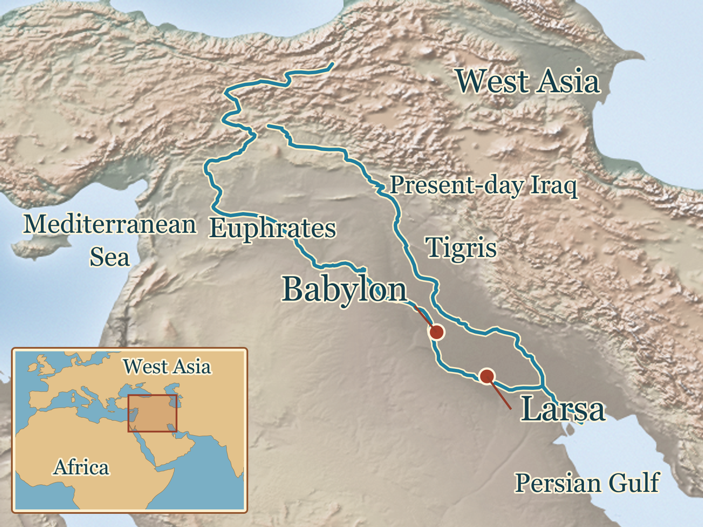
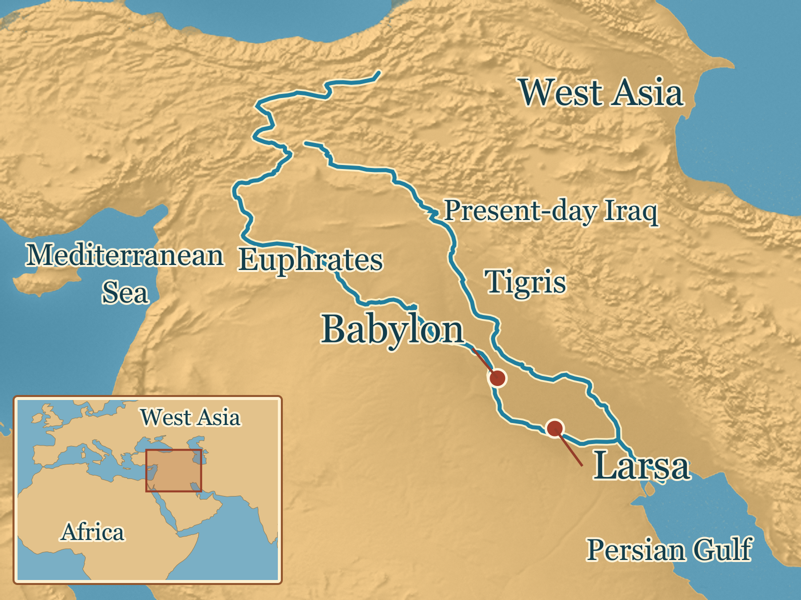
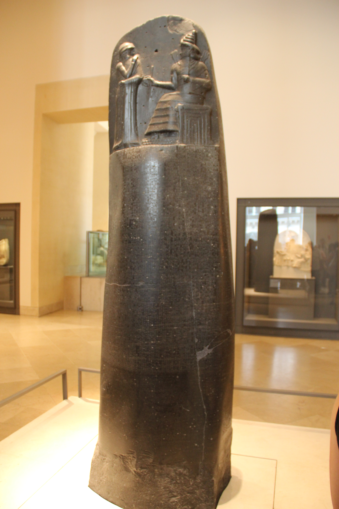

# Law, Kingship, and Hammurabi’s Babylon — research and editorial note

Issue: [ASH-105](https://linear.app/ashs-workshop/issue/ASH-105/research-and-publish-law-kingship-and-hammurabis-babylon)
Lesson ID: lesson.mesopotamia.law-and-kingship
Research-note identity/version: materially revised direction and prototype, 2026-10-04
Production record version: 2
Journey/chapter/position: required World History, canonical position 21; production order 130
Required or optional: required
Accountable reviewer: Carlin Aylsworth
Validation tier: high-risk interpretation of kingship and ancient law
Queue status: Active; Stage 14B approved; published status applied in the PR, awaiting media upload and owner hosted check
Branch: codex/ash-105-law-kingship-babylon; existing [PR #51](https://github.com/dev-vibe/chronos-learning/pull/51)
Base integration: latest main a344cc2 integrated locally on 2026-10-04

## Approved prototype decision packet — 2026-10-04

[Open the revised local lesson](http://localhost:3000/learn/lesson.mesopotamia.law-and-kingship). Draft access is enabled in this running local preview. The local draft contains the approved revision; hosted publication handoff pending.

- **Historical focus:** how Hammurabi raised Babylon from a smaller kingdom to a major political capital, and what governing cities, farmland and property involved.
- **Central explanation:** diplomacy and conquest enlarged the kingdom; the legal monument makes the practical responsibilities of Babylonian life visible through concrete cases.
- **Retellable history:** Babylon and its rival Larsa; Rim-Sin’s territory passing under Hammurabi; a shepherd’s request about a field; a law monument taller than an adult; rules for harvest failure, flooding and safekeeping.
- **Prompts:** explain why witnesses and a contract help settle a property dispute; choose a legal case and explain the problem and how its response helps people live or work together.
- **Media direction changed:** a reviewed orientation map for Babylon/Larsa and an actual, licensed law-stele image. Native text carries the legal cases. No tablet photograph, later-city reconstruction or injury diagram is needed.
- **Card:** approved artifact/Witness card, registered with a CC0 whole-object photograph and existing parent-pass unlock.
- **Evidence proportion:** one short contextual paragraph on status and penalties; one sentence on debated court use. Neither supplies the lesson’s central question.
- **Review state:** Carlin approved the revised lesson, media jobs and card on 2026-10-04: “perfect. approved”. Final media and publication are authorized. The earlier prototype’s historical-proportion pass remains withdrawn.

Public handoff authorization: the preceding handoff disclosed two automatic review rejections for missing explicit authorization. Carlin’s “perfect. approved” authorizes the revised lesson’s public GitHub handoff and publication.

## Owner decision card (Stage 3B)

**Revised focus:** Follow Babylon’s rise under Hammurabi and explore what governing a kingdom involved through his legal monument and its practical cases.

**Why it belongs in World History:** Hammurabi’s reign transformed Babylon’s political importance and left a major surviving achievement of ancient legal reasoning.

| # | Revised teaching beat | Visual that could help |
| --- | --- | --- |
| 1 | Babylon began as one kingdom among powerful rivals. | Babylon and Larsa on a reviewed orientation map. |
| 2 | Hammurabi used alliances and conquest to make Babylon a major capital. | The same geographic anchor; no invented borders. |
| 3 | Government involved land, water, property and requests carried through officials. | Native prose following Issinabu’s field request. |
| 4 | The great law stele joined royal authority to a detailed collection of legal cases. | The actual stele, including relief and inscription. |
| 5 | Rules for harvests, irrigation and safekeeping show obligations and remedies in Babylonian life; later scholars continued studying the text. | Three readable native-text cases. |

### Research-direction packet and product-owner response

The original five-beat source-comparison direction received “all yes” on 2026-09-24. On 2026-10-04 Carlin rejected the resulting lesson’s narrow preoccupation with whether Hammurabi delivered justice and asked for it to be fixed. The agent then described replacing it with Babylon’s rise, government and practical law; Carlin responded “fix it!!”. That is recorded as direction to implement the broader historical explanation, not as approval of these detailed beats, the revised prototype, map, card or publication.

Re-entered Stages 1–2 for the central question, followed by supplemental political-history and legal-case review at Stage 3. The revised focus above records the owner’s instruction in concrete terms; it does not manufacture an “all yes” response to a new numbered card. Full prototype review remains pending at Stage 14B. Restricted specialist chapters are not prerequisites for the narrow claims selected here; unresolved detailed debates remain deferred.

## Node proposal

Production orders 110 and 120 remain ineligible because Wheels and Animals are Planned. Order 130 is the earliest eligible queued lesson and already has an active branch/issue/PR. This continuation preserves that work, journey position and lesson identity.

Essential question: How did Hammurabi make Babylon a powerful kingdom, and what did governing it involve?
Durable understanding: Hammurabi expanded Babylon’s power through diplomacy and conquest; his legal monument connects concrete problems in Babylonian life to responsibilities and remedies.
Supporting understandings: (1) Babylon’s rise changed the political balance among rival kingdoms. (2) Government required written instructions and attention to agricultural/property problems. (3) The monument joins kingship, divine justice and legal cases. (4) Those cases address shared practical problems while reflecting ancient social differences. (5) The text had a long scholarly afterlife.
Evidence encounter: SB 8 law stele and narrow paraphrases of §§48, 55 and 122, with YBC 9959 as a supporting administrative episode.
Prerequisites: Mesopotamian geography and the existing Akkad lesson, lesson.mesopotamia.akkadian-empire. Unpublished canonical positions 19–20 are not treated as completed prerequisites.
Common misconceptions: Babylon was always dominant; conquering territory was the whole work of ruling; Hammurabi invented all written law; the famous injury phrase captures the collection; later Babylonian architecture depicts Hammurabi’s city.
Scope — dates/places/actors: eighteenth-century BCE Hammurabi, Babylon, rival Larsa and southern Mesopotamia; one brief later-commentary point. The roster’s c. 1800–1600 BCE frame is broad context, not the length of his reign.
Why this is one lesson: kingdom-building and the work of governing supply one connected historical explanation.
Non-goals/deferred material: campaign-by-campaign military history, all 282 provisions, exact legal-status taxonomy, judicial enforcement frequency, modern legal genealogy, biblical borrowing, relief reworking and alternative absolute chronologies.
Bridge from previous lesson: retrieve Akkad’s problem of holding several communities under one authority; extend it with the work of government.
Bridge to next lesson: Shang Power, Bronze, and Oracle Bones can later compare the institutions and material records of another early state; unpublished status is preserved.
Geographic orientation: modern Middle East → Mesopotamia/present-day Iraq → Euphrates, Babylon and Larsa.
Visible native orientation sentence: “Babylon stood on the Euphrates River in Mesopotamia, in present-day Iraq.” A readable orientation map is proposed for final media, with no precise empire outline.

## Research questions

- What political situation did Hammurabi inherit, and what changed during his reign?
- How do alliances and campaigns explain Babylon’s rise without reducing the story to a list of battles?
- What do legal cases and royal letters show about the practical work of government?
- What made this legal monument a substantial achievement within an earlier legal tradition?
- Which farming/property examples can be narrowly paraphrased without resolving contested specialist translations?
- Which cautions materially affect the explanation, and which belong in supporting notes?
- How can place and the surviving object carry visual interest without later-city anachronisms?

## Source ledger

All new synthesis and close reading in this revision was done by the main agent. No subagent was used. Earlier specialist discovery is retained only to the extent described in the audit; retrieval/abstract access is distinguished from full-text review. No source photograph is cleared for redistribution.

| Source ID | Citation and exact inspected location | Type / role | Support, limits and corroboration | Rights / review |
| --- | --- | --- | --- | --- |
| source.hammurabi.met-kingdom | [Elizabeth Knott, The Isin-Larsa and Old Babylonian Periods](https://www.metmuseum.org/essays/the-isin-larsa-and-old-babylonian-periods-2004-1595-b-c), political paragraphs beginning “In the early nineteenth century” through “The creation of the state of Babylon”; Art and Culture stele paragraph. Revised May 2025. | Museum specialist synthesis; central | Rival kingdoms, Rim-Sin, Babylon’s smaller starting territory, expansion and political shift; not a campaign archive. The separate Met Babylon essay is the same institution, not independent corroboration. | Original paraphrase only; close-reviewed main agent 2026-10-04. |
| source.hammurabi.met-babylon | [Michael Seymour, Babylon](https://www.metmuseum.org/essays/babylon), geography and Hammurabi paragraphs; later Nebuchadnezzar architecture paragraph. Revised May 2026. | Museum specialist synthesis; central | Euphrates/Iraq, alliances/campaigns, city’s later importance; later Ishtar Gate is not Hammurabi-period evidence. | Original paraphrase; close-reviewed main agent 2026-10-04. |
| source.hammurabi.louvre-object | [Louvre SB 8](https://collections.louvre.fr/en/ark:/53355/cl010174436), Description, Inscriptions, Dimensions, Places/dates and History. | Primary object catalogue; central | Basalt, 225 cm, relief/inscription, Susa find; distinguish physical description from interpretation. CDLI is another catalogue of the same object, not a second stele. | Image rights unresolved; close-reviewed main agent 2026-09-23/24. |
| source.hammurabi.louvre-essay | [Louvre, The Code of Hammurabi](https://www.louvre.fr/en/the-code-of-hammurabi), monument, conditional form, subject range and earlier collections. | Institutional interpretation; central/qualifying | Legal significance, royal/religious setting and cases. Museum’s statement about actual judgements is not adopted as proof of universal court application. | Original paraphrase; reviewed again main agent 2026-10-04. |
| source.hammurabi.avalon-cases | [Avalon Project, Code of Hammurabi](https://avalon.law.yale.edu/ancient/hamcode.asp), numbered passages §§48, 55, 122 and surrounding §§123–124; prologue. | Primary text in older English translation; central | Narrow grain-repayment, irrigation-compensation and witnesses/contract rules. Dated terminology is not used for a modern social taxonomy; tablet-wetting formula, precise interest terminology and full debt cancellation are not taught. Interpretation of agreement’s purpose is marked as reasoning from the case. | No long quotation; close-reviewed main agent 2026-10-04. |
| source.hammurabi.cdli-stele | [CDLI SB 8 / P249253](https://cdli.earth/artifacts/249253), prologue column 1 lines 28–49; reverse column XVII §§196–199, with earlier composite review. | Primary object/text record; central/qualifying | Royal justice statement and different injury remedies. Different legal standing is secure; simple modern class labels and observed enforcement are not established. | Paraphrase only; close-reviewed main agent 2026-09-24. |
| source.hammurabi.letter | [YBC 9959 / P293786](https://cdli.earth/cdli-tablet/664), translated lines 4–10. | Primary administrative letter; supporting | Issinabu’s field request and Hammurabi’s instruction to an official; a concrete government episode, not a sample establishing every subject’s access or the final outcome. | Photograph not cleared; close-reviewed main agent 2026-09-24. |
| source.hammurabi.commentary | [Yale CCP BM 59739 / P461271](https://ccp.yale.edu/P461271), catalogue and Commentary fields. | Primary later scholarly tablet catalogue; supporting | First-millennium study of parts of the collection; not an account of eighteenth-century courts. | Metadata paraphrase; close-reviewed main agent 2026-09-24. |

Supplemental qualifying review: [French archaeological mission, Studying texts from Mari](https://archeologie.culture.gouv.fr/mari/en/studying-texts-mari), paragraphs on palace archives and 1978/1998–2002 finds, close-read 2026-10-04. This independently establishes the range of political/social archival evidence for Hammurabi’s era, not any specific campaign sequence. [Pamela Barmash, The Laws of Hammurabi](https://academic.oup.com/book/31901) (2020), publisher abstract only, reviewed 2026-09-23 and 2026-10-04: scribal systematization plus royal inscription is a serious interpretation; full chapters remain inaccessible and do not support an asserted drafting history here.

## Recent-challenge audit (Stages 3A–3B)

Baseline screened: a powerful early Babylonian ruler whose expansion and law monument matter historically. This should neither inherit the modern “first uniformly enforced code” shorthand nor replace the history with a trial of the king’s sincerity.
Search window: approximately 1976–2026; older text editions and earlier collections retained where they establish the ancient sequence.

| Revision/upset and consequence | Origin / evidence / method | Independent corroboration and strongest countercase | Discriminating test | Status / lesson consequence |
| --- | --- | --- | --- | --- |
| Hammurabi transformed Babylon’s political position. | Recent specialist Met syntheses place small Babylon beside dominant Larsa, then describe expansion. Political letters/archives offer a different material basis. | Two Met essays share an institution. Mari’s excavation programme independently confirms substantial period archives, but its introductory page does not independently prove every campaign. | Closely examine dated letters/year-names for any detailed campaign narrative. | Strong bounded synthesis; teach rise and rivalry, not an unsupported battle chronology or stable empire border. |
| A comprehensive, first, equally applied statute book is anachronistic. | Stele, neighboring provisions, earlier law collections and legal-genre scholarship. | Earlier collections rebut priority; varied injury remedies rebut equal treatment. Epilogue’s public appeal supports intended legal importance, not universal application. | Earlier securely dated witnesses and a systematic dated court dossier. | Correct misconception briefly; do not turn every section into a source-limit exercise. |
| Royal inscription and scribal legal reasoning can coexist. | Barmash 2020 abstract; conditional variants, literary framing, manuscript transmission. | Louvre’s monument/case description and surviving text support composition’s richness; inferred drafting process remains undocumented here. | Full compositional study and securely dated draft variants. | Supported bounded interpretation; emphasize detailed case reasoning without claiming named authorship. |
| Public legal authority cannot be dismissed because modern citation practices are absent. | Kathryn E. Slanski, “The Law of Hammurabi and Its Audience” (2012), repository/search passages on public performance and epilogue; full PDF returned 403 in prior pass. | Stone/text independently support intended royal address. Intended audience does not establish frequency of public consultation. | Original display setting and securely dated uses/readings in documentary evidence. | Precise court use unresolved; one sentence in learner text, no “mere propaganda” verdict. |
| Administrative evidence broadens the view of government. | YBC 9959 request/order; Mari mission’s accounts of palace archives, new finds and nomadic/sedentary research since 1978. | Different archives/material classes support government’s breadth. A single request does not establish typical access or completed action. | Related dossiers, decisions, land assignments and securely identified officials. | Teach one concrete government episode; keep its sample limit in the record. |
| Legal status and coercion are part of the system. | §§196/198 directly differ; modern philological uncertainty over rigid “noble/commoner” labels. | The neighboring text itself is decisive for differing remedies. That does not establish a fixed modern class chart. | Track people/status terms across contemporary documents. | One contextual paragraph; neither conceal harshness nor make it the entire achievement. |
| Later reception contributes to significance. | Clay copies and first-millennium BM 59739 commentary; manuscript studies. | Separate surviving commentary supports later study; purposes of all copies may differ. | Excavation context and complete witness comparison. | Short afterlife beat; no direct descent-to-modern-law claim. |
| Present relief could contain later reworking. | Tallay Ornan 2019, “Unfinished Business,” JCS 71, pp. 85–109, publisher abstract; stylistic proposed Elamite resculpting. | Susa removal is independently documented but does not confirm reworking. Original stylistic variation remains a countercase. | Tool-mark/high-resolution study and sculpture comparison. | Hypothesis, full argument unreviewed; do not narrate carved details as proved contemporary events. |
| Alternative absolute chronology changes precise dates. | Manning et al. 2016 dating research lead, samples/method not close-read. | Conventional reign chronology and broader period frame; anchors must agree across datasets. | Secure text-dated scientific dating contexts. | Detailed calibration unresolved; teach eighteenth-century frame, no exact year carrying the argument. |

Peripheral screening retained: proposed Ebla legal compendium (Maiocchi; Arkhipov/Kogan 2026) relies on a treaty-text classification with underlying full edition not reviewed; it reinforces avoiding invented priority but is not a main-lesson finding. Wright 2009 biblical dependence and broader shared legal-culture comparisons belong in later optional depth; full comparative sequence/transmission review is pending. Ornan’s carving hypothesis likewise remains a specialist question.

Ancient and transmitted accounts considered: royal prologue/epilogue; a contemporary administrative letter; later scholarly commentary and copied text. No separate local oral tradition securely tied to this lesson was identified in accessible review; that search limit is not a judgment about a tradition’s value.
Comparative analyses considered: Babylon versus rival kingdoms; provisions linking agricultural/property problems to remedies; earlier collections; different status remedies; original composition versus later manuscript reception. A campaign sequence requires more archival review than a museum-level political synopsis.

### Coverage statement

- Terms/variants: Hammurabi/Hammurapi; Babylon, Larsa, Rim-Sin, Old Babylonian; alliances, campaigns, government, palace archives, Mari, irrigation, debt, safekeeping, contracts; laws, royal inscription, scribal reasoning, audience, status, chronology and relief reworking.
- Repositories/trails: Met/primary collection references; Louvre; CDLI; Yale Avalon/CCP; French Mari excavation site; OUP; earlier Yale Slanski repository, JCS abstracts, SOAS and UCL leads.
- Disciplines/material: political history, Assyriology, legal history, epigraphy, objects, translated provisions, letters and scholarly manuscripts.
- Independence: distinguish institutional summaries, editions of the same object, separate archives and truly different material evidence. No “two independent sources” claim for the Met pair.
- Inaccessible: full Barmash chapters, full Slanski PDF, full Ornan argument and some recent compendium editions. eHammurabi requests for new provisions failed; their snippets are not marked close-reviewed. A Chicago volume URL redirected to an unrelated site page and is excluded as support.
- Known gaps: no comprehensive campaign archive or court dossier, no current specialist collation of every selected legal translation, no learner observation. Narrow paraphrases avoid translation-sensitive conclusions; image geography/rights/fidelity remain final-production work.

## Claim ledger

| Claim ID | Kind / certainty | Sources | Limits / missing perspective | Learner treatment / review |
| --- | --- | --- | --- | --- |
| claim.hammurabi.babylon-location | observation / high | met-babylon | Modern geographic anchor, not ancient border | Native location; reviewed |
| claim.hammurabi.kingdom-growth | interpretation / high | met-kingdom, met-babylon | Institutional synthesis; no detailed chronology, motive or permanence claim | Rivalry, diplomacy, conquest and political change; reviewed |
| claim.hammurabi.governing-work | interpretation / moderate | avalon-cases, letter, louvre-essay | Selected legal cases/one letter do not represent all government | Concrete administrative work; reviewed; owner approved 2026-10-04 |
| claim.hammurabi.stele-object | observation / high | louvre-object, louvre-essay | One surviving object, original display specifics incomplete | Scale, relief, inscription; reviewed |
| claim.hammurabi.royal-justice | interpretation / high | louvre-object, cdli-stele | Royal self-presentation, not proof of every outcome | Attribute prologue and religious setting; reviewed |
| claim.hammurabi.case-form | observation / high | louvre-essay, avalon-cases | Collection is not a complete modern legal system | Conditional form and range; reviewed |
| claim.hammurabi.harvest-debt | observation / high | avalon-cases | Older translation; no full cancellation, precise interest or tablet formula | Narrow grain-repayment paraphrase; reviewed |
| claim.hammurabi.irrigation-duty | observation / high | avalon-cases | Prescription, not a measured enforcement result | Flood damage and compensation; reviewed |
| claim.hammurabi.witness-contract | observation / high | avalon-cases | Written requirement; its dispute-resolution purpose is a supported inference | Witnesses/contract and reasoning prompt; reviewed |
| claim.hammurabi.different-remedies | observation / high | cdli-stele | No rigid modern class labels or practice frequency | Proportionate contextual paragraph; reviewed |
| claim.hammurabi.legal-significance | interpretation / moderate | louvre-essay, avalon-cases | Historical significance synthesis, not guaranteed uniform application | Case reasoning and obligations; reviewed; owner approved 2026-10-04 |
| claim.hammurabi.later-study | observation / high | commentary | One later scholarly witness, not original court evidence | Brief afterlife; reviewed |

## Central claim support

| Claim ID | Source ID | Locator | Review |
| --- | --- | --- | --- |
| claim.hammurabi.babylon-location | source.hammurabi.met-babylon | Passage beginning “The city of Babylon,” geography paragraph | Main agent, 2026-10-04, close-reviewed |
| claim.hammurabi.kingdom-growth | source.hammurabi.met-kingdom | Passage group beginning “In the early nineteenth century,” “Just one year” and “In some thirty short years” | Main agent, 2026-10-04, close-reviewed |
| claim.hammurabi.kingdom-growth | source.hammurabi.met-babylon | Passage on Hammurabi’s eighteenth-century alliances/campaigns; later city importance paragraph | Main agent, 2026-10-04, close-reviewed |
| claim.hammurabi.governing-work | source.hammurabi.letter | Object YBC 9959 / P293786, translated lines 4–10 | Main agent, 2026-09-24, close-reviewed |
| claim.hammurabi.governing-work | source.hammurabi.avalon-cases | Passage group §§48, 55 and 122 with §§123–124 context | Main agent, 2026-10-04, close-reviewed |
| claim.hammurabi.stele-object | source.hammurabi.louvre-object | Object SB 8, Dimensions, Description and Inscriptions fields | Main agent, 2026-09-24, close-reviewed |
| claim.hammurabi.royal-justice | source.hammurabi.cdli-stele | Passage prologue column 1 lines 28–49 | Main agent, 2026-09-24, close-reviewed |
| claim.hammurabi.royal-justice | source.hammurabi.louvre-object | Object SB 8, relief identification in Description | Main agent, 2026-09-24, close-reviewed |
| claim.hammurabi.case-form | source.hammurabi.louvre-essay | Section “A monument of ancient law,” conditional cases, subjects and earlier collections | Main agent, 2026-10-04, close-reviewed |
| claim.hammurabi.harvest-debt | source.hammurabi.avalon-cases | Passage §48, failed harvest and that year’s grain repayment | Main agent, 2026-10-04, close-reviewed |
| claim.hammurabi.irrigation-duty | source.hammurabi.avalon-cases | Passage §55, careless ditch opening and lost-grain compensation | Main agent, 2026-10-04, close-reviewed |
| claim.hammurabi.witness-contract | source.hammurabi.avalon-cases | Passage §122, witnesses/contract before safekeeping; §§123–124 dispute context | Main agent, 2026-10-04, close-reviewed |
| claim.hammurabi.different-remedies | source.hammurabi.cdli-stele | Passage reverse column XVII §§196–199, especially §§196/198 | Main agent, 2026-09-24, close-reviewed |
| claim.hammurabi.legal-significance | source.hammurabi.louvre-essay | Section “A monument of ancient law,” scale, case form and legal range | Main agent, 2026-10-04, close-reviewed |
| claim.hammurabi.legal-significance | source.hammurabi.avalon-cases | Passage group §§48, 55, 122–124, situation/obligation/remedy relationships | Main agent, 2026-10-04, close-reviewed |
| claim.hammurabi.later-study | source.hammurabi.commentary | Object BM 59739 / P461271, catalogue/date and Commentary fields | Main agent, 2026-09-24, close-reviewed |

## Content triage

| Candidate idea | Decision | Why | Destination |
| --- | --- | --- | --- |
| Babylon’s rise, Larsa and Rim-Sin | Essential | Defining historical development | Sections 1–2 |
| Government through fields/property and one request | Essential | Connects conquest to governing | Section 3 |
| Large royal/legal monument, religious setting | Essential | Defining surviving achievement | Section 4 |
| Harvest, irrigation, safekeeping cases | Essential | Practical range and legal reasoning | Section 5 and prompts |
| Legal status, harshness and exact court use | Supporting | Truthful setting with proportionate emphasis | Section 6 |
| Later commentary/city importance | Supporting | Explains lasting significance | Section 6 |
| Whether royal justice promises were always fulfilled | Deferred as central focus | Too small to explain this required World History subject | Source notes or optional investigation |
| Detailed campaigns/status taxonomy/Biblical comparison | Deferred | Different research and teaching scale | Later optional depth |
| First written law, uniform modern code, meaningless propaganda | Rejected | Unsupported extremes | Avoided |

## Learning blueprint

Essential question: How did Hammurabi make Babylon a powerful kingdom, and what did governing it involve?
Durable understanding: Babylon’s expansion and the practical work of law belong to one history of kingship and government.
Supporting understandings: rival kingdoms; diplomacy/conquest; officials and written requests; conditional cases; obligations/remedies; long afterlife.
Prerequisites: Akkad and basic Mesopotamian geography; unpublished predecessors are not assumed.
Misconceptions: conquest alone constitutes government; “eye for an eye” describes the collection’s whole range; “first modern code.”
Indispensable vocabulary: alliance, stele, cuneiform, prologue, provision, creditor, compensation, contract; explain in context without a glossary burden.
Evidence encounter: original stele described in prose; three narrow case paraphrases; supporting field-letter episode.
Historical-thinking move: explain political change and connect material/textual evidence to the institutions and practical problems of a society.
Retrieve: Akkad, lesson.mesopotamia.akkadian-empire, joining several communities under one ruler.
Extend: Move from gaining/holding power to governing land, property and obligations.
Revisit: Later planned state/law lessons can compare institutions and legal traditions; no unpublished lesson is promised as available.
Reasoning progression: earlier political authority → current explanation of expansion and governing → independently connect a new problem to a legal response.
Transfer plan: after the three cases, the safekeeping prompt asks the learner to infer why witnesses/contract could settle a later disagreement, rather than recite a provision. The written prompt lets them explain another case’s function.
Completion versus mastery: best-supported selection and sincere writing enable explicit finishing; a parent pass awards any approved final card. This records study, not independent mastery. Mastery would include independently retelling Babylon’s transformation and explaining how a fresh legal case connects obligations to a problem.
Required sincere-attempt evidence: one supported-selection explanation and a short problem/response explanation of a chosen case.
Story spine: Hammurabi’s Babylon moves from a smaller rival kingdom to a capital; the story then enters the work of government and the cases on its great stone.
Memorable moments: Rim-Sin’s southern territory; Issinabu’s requested field; a stele taller than an adult; a failed harvest or flooded neighboring field.
Outcome wording: “traced” expansion and “explained” a practical case reflects what reading and prompts actually require.

## Section/component storyboard

| Order | Section ID | Heading | Purpose | Evidence | Modules / media | Transition |
| --- | --- | --- | --- | --- | --- | --- |
| 1 | section.hammurabi.babylon-rivals | Babylon among rival kingdoms | Starting position and change | Met geography/political history | Prose; historical-map module with media.hammurabi.locator | Identify the rival |
| 2 | section.hammurabi.kingdom-growth | How Hammurabi expanded his kingdom | Diplomacy/conquest and capital | Met Rim-Sin/expansion passages | Prose | Conquest leads to governing |
| 3 | section.hammurabi.governing-land | Governing cities and farmland | Land/property and official work | YBC 9959, legal cases | Prose | Introduce the legal monument |
| 4 | section.hammurabi.law-stele | The king and the law stele | Scale, religion, legal tradition | SB 8/prologue/Louvre | Prose; evidence module with media.hammurabi.law-stele | Enter the cases |
| 5 | section.hammurabi.practical-cases | Laws for farming and property | Practical range/responses | §§48, 55, 122 | Prose + native knowledge | Explain significance |
| 6 | section.hammurabi.legal-significance | Why Hammurabi’s laws mattered | Legal reasoning/context/afterlife | Cases, status pair, commentary, Babylon | Prose | Explain a problem |
| 7 | section.hammurabi.understanding | Explain how the laws addressed a problem | Check taught reasoning | Selected cases | Two real prompts | Explicit finish / parent review |

Heading voice: plain subjects/jobs; internal purposes stay hidden. Seven sections, no section-count exception.
Changed teaching jobs receive fresh semantic section and prompt IDs. This is an unpublished draft; no published prompt or earned learner record is changed.

## Media decisions

| Intention | Section | Teaching job | Form / basis | Accessible equivalent | Prototype / final review |
| --- | --- | --- | --- | --- | --- |
| intent.hammurabi.map | section.hammurabi.babylon-rivals | Locate Babylon and its southern rival within Mesopotamia | Recommended historical orientation map, reviewed anchor required; native labels; no conquest arrows or precise empire line | Native orientation paragraph and accessible map summary | Implemented as media.hammurabi.locator; see Image lifecycle and Final media display |
| intent.hammurabi.stele | section.hammurabi.law-stele | Show scale and royal relief above extensive inscription | Required licensed original SB 8 view; surviving evidence | Native description, alt text and scale note | Implemented as media.hammurabi.law-stele (CC0); see Image lifecycle and Final media display |
| intent.hammurabi.cases | section.hammurabi.practical-cases | Compare problem and response | Native-text cases, no illustration needed | Same text | Implemented |
| intent.hammurabi.letter | section.hammurabi.governing-land | Follow a named request and instruction | No image; prose is clearer for this supporting episode | Same text | Implemented |
| intent.hammurabi.video | none | No motion-dependent explanation | No video | Readable story | Not applicable |

Both approved image jobs are implemented below. No later Ishtar Gate or Nebuchadnezzar architecture depicts Hammurabi’s Babylon.

## Knowledge Card decision

One approved and registered artifact/Witness card: card.hammurabi.law-stele, unlock lesson.mesopotamia.law-and-kingship after parent pass.
Anchor: a major surviving Babylonian legal monument connects kingship to detailed cases about people’s obligations.
Original SB 8 evidence only, licensed and credited, with physical fidelity and lesson/card-size review. Registered with the Gary Todd CC0 whole-object photo, factual sources, recall prompt and parent-pass unlock.

## Prompt rationale

| Prompt ID | Job | Misconception / feedback | Required |
| --- | --- | --- | --- |
| prompt.hammurabi.safekeeping | Infer why witnesses and a contract help settle a safekeeping dispute | Redirect from personal reputation/palace ownership to the handover and recorded agreement | yes, best-supported selection |
| prompt.hammurabi.problem-and-response | Explain chosen case’s problem and response | Connect remedy to loss, responsibility or agreement; no prompt about prosecuting the king | yes, sincere written attempt |

The two concise checks follow the cases they assess. Written guidance helps the parent recognize a causal explanation; it is not a hidden essay requirement. The existing shell controls finish, parent review and any card award.

## Ages 11–15 transformations

Draft for approximately 12–13; no learner-age validation claimed.
- Political complexity → Babylon, Larsa and one named rival; no campaign list or king catalogue.
- Institutions → a field request, an official, grain repayment, irrigation damage and a witnessed handover.
- Legal text → short explicitly labeled paraphrases with findable provision numbers.
- Status/coercion → one truthful paragraph, no graphic scene or simplistic three-class chart.
- Specialist uncertainty → a precise one-sentence court-use limit; detailed controversies remain in the record.
- Vocabulary → define stele/prologue in use; short examples make creditor/compensation/contract intelligible.
- Reading → seven sections, one practical comparison, two short prompts.

## Image lifecycle

### media.hammurabi.locator

#### 1. Reasoning and source basis

Locate Babylon northwest of its rival Larsa within West Asia and present-day Iraq. Primary reference: [Natural Earth 1:50m relief](https://www.naturalearthdata.com/downloads/50m-raster-data/50m-cross-blend-hypso/), modern rivers v5.1.2 and 1:110m land v5.1.2. [Terms](https://www.naturalearthdata.com/about/terms-of-use/): public domain. Rights decision: approved. Attribution: Chronos deterministic map · Natural Earth, Public Domain · site points from Oracc/Pleiades.

Independent checks: [UNESCO Babylon nomination](https://whc.unesco.org/document/166322), printed page 11 center 44.420833 E, 32.541969 N, agrees with Oracc at representative-site scale; [French Larsa excavation](https://archeologie.culture.gouv.fr/larsa/fr/les-grandes-maisons-paleo-babyloniennes), opening location paragraph, confirms lower Mesopotamian plain between the rivers. These are factual checks, not copied illustration inputs.

Coordinate-verified: site dots. Source-supported: modern relief, rivers, coast and inset land. Approximate: generalized river/inset geometry. Omitted: ancient channels, shorelines, wetlands, borders, routes and settlement extent. The native module provides the corresponding uncertainty and accessible orientation.

#### 2. Reference image or reviewed data actually used

Operation: deterministic/native/vector rendering.
Reviewed data/code paths and versions: scripts/media/hammurabi-map.mjs; docs/research/assets/akkad/map/{akkad-relief-reference.png,akkad-atlas-base.png,selected-rivers.json}, Natural Earth modern data v5.1.2; docs/research/assets/hammurabi/map/{ne_110m_land.geojson,sites.json,labels-and-geometry.svg,reference-lineage.json}.

The existing blank Akkad crop is geographic data, not its annotated finished map. No Akkad locations, labels or historical claims are copied. Exact site authorities: [Babylon](https://oracc.museum.upenn.edu/geonames/cbd/qpn/x000000440.html) [44.422236,32.543395]; [Larsa](https://oracc.museum.upenn.edu/geonames/cbd/qpn/x000001820.html) [45.853611,31.285833]. Actual source HTML is preserved. Main equirectangular extent: 32–52 E, 27–42 N, 1600×1200. Inset: 15 W–80 E, 5 S–60 N. Its rectangle marks the exact main view, not territory.

SHA-256: source relief crop 3c19123349b41a6568d6dfabf818d5e5902999f70ed2f8d5444b1a80ed832d09; selected rivers 548a3b45256083c354ecdf7e37f6c51674c64748ec1bc96d560c3fe153ed9088 (repository LF bytes; the first lineage pass hashed a Windows CRLF checkout of the same file, 4565298464f9defeaabc1d9a4c740aca873a2ea1b7878752d2936dc556620db3, with identical geometry); land 9e0729ee253ca7d7a5c4ae9395fb1902264c5377c52e224d13dd85010e2835d9; reviewed reference 13330163a1d18d5b48775426ee02f3e0106f1824dc12bfff9d31d39b1252b50c. Original ZIP/TIFF/full river hashes and palette transformation remain in reference-lineage.json.



#### 3. Generation or transformation

Exact transformation, no image generation:
```text
Render reviewed modern geographic data at the recorded equirectangular extents. Add only the recorded Babylon and Larsa representative sites, modern river geometry, wider-world inset and approved labels. Preserve geographic geometry. Apply the reviewed warm ochre/mineral-blue palette to the blank relief crop. Invent no ancient waterways, territorial boundaries, routes or architecture. Export 1600×1200 JPEG quality 95, 4:4:4. Use the existing picture preset for responsive variants.
```

Exact raster labels: Mediterranean, Sea, Persian Gulf, Euphrates, Tigris, West Asia, Present-day Iraq, Babylon, Larsa, Africa. The module keeps orientation, credits and uncertainty as native text. Initial inspection found label crowding; text positions were adjusted without moving points or geometry.

#### 4. Accepted final image

Canonical master: docs/research/assets/hammurabi/map/accepted-map.png.
Runtime source: public/images/hammurabi/babylon-larsa-locator.jpg.
SHA-256: master f4d6c4068722409e40e0c641c5898c4c36c581cb4ebe1d88325d322570d8070c; runtime 666146a1f37c426030f39c2af2c80eb4e858bfc22b3e5ed2fbace050efb0c92e (1600×1200, 681,335 bytes).
Transformation history: the first runtime export used JPEG quality 96 (316710e9cc81941a5435e6e3ad13f65324007b12692f15687758c87fb1c831fc) and exceeded the 768 KiB delivery limit in `media:build`. Only the JPEG quality changed to 95; master, geometry, labels and palette are unchanged. The catalog fallback is the matching .jpg.
Reviewer/date/status: main agent / 2026-10-04 / source, rights and fidelity approved; responsive display checking below.
Fidelity verdict: reference/final preserve coastline/terrain outline, river geometry, site order and coordinates, leader anchors and inset view rectangle. Final changes the palette. Neither reconstructs Hammurabi’s territory or ancient waterways.



### media.hammurabi.law-stele

#### 1. Reasoning and source basis

Show the full surviving tall stone, royal relief above the long inscription, and a physical anchor for the card. Identity and scale checked against [Louvre SB 8](https://collections.louvre.fr/en/ark:/53355/cl010174436) and existing lesson Louvre/CDLI sources. This is object evidence in a modern gallery, not a reconstruction of original display or proof of enforcement.

Rights decision: approved, CC0 1.0. Gary Todd, 2016-07-13. [Canonical Commons image/license record](https://commons.wikimedia.org/wiki/File:Code_of_Hammurabi,_King_of_Babylon,_Basalt,_1792-1750_BC_(28296727785).jpg), [CC0 terms](https://creativecommons.org/publicdomain/zero/1.0/). Commons Flickr license review confirmed CC0 on 2021-03-08; original Flickr source is linked there. Attribution: Gary Todd · 2016 · CC0 1.0 · full frame resized and compressed.

#### 2. Reference image actually used

Reference: docs/research/assets/hammurabi/stele/gary-todd-whole-original.jpg, 3456×5184.
SHA-256: 4386d5e3b91012969bacb823193b96323d8752afa1cbaacea4b384c1855f15a8.
A first Gary Todd candidate (28298580035), preserved at docs/research/assets/hammurabi/stele/gary-todd-original.jpg (SHA-256 e11371446e554137e31f808f63dda134b9079f927236016b001c0841d5c2737a), showed only the upper portion and was rejected for this whole-object job. It is not registered media.



#### 3. Generation or transformation

```text
No generation, retouching or reconstruction. Resize the complete 3456×5184 frame to 960×1440 without enlargement. Encode JPEG quality 96 with 4:4:4 chroma. Preserve the entire stone and modern museum background. Use the existing photo delivery preset for pixel-exact or fidelity-qualified responsive variants.
```

Script: scripts/media/hammurabi-map.mjs, final resize operation. No glyph redrawing, reshaping, relighting, scene replacement or cropping of the object. Card detail uses the same full-object image with a modern-museum depiction label.

#### 4. Accepted final image

Runtime source: public/images/hammurabi/hammurabi-law-stele.jpg, 960×1440.
SHA-256: 253f7ca742973d54c394a14db6632a24a164c0b959b8274781a5e48383a4585c.
Reviewer/date/status: main agent / 2026-10-04 / source, rights and fidelity approved; responsive display checking below.
Fidelity verdict: full frame, silhouette, relief position, inscription extent, material appearance and gallery match the original. Fine glyphs are not offered for reading or translation. Only resizing/compression changes the reference.


### Final media display and delivery

Build: `media:build` completed on 2026-10-04 (19:07 UTC) after the quality-95 map and .jpg fallback corrections. A separate Linux rebuild of the same sources reproduced every Hammurabi variant byte count in the release manifest: stele 480w WebP lossless 362,670 B and 960w source JPEG 468,460 B; locator 480w WebP lossless 186,036 B, 960w WebP lossless 654,668 B and 1600w source JPEG 681,335 B. All variants are pixel-exact. Committed fallbacks match the runtime source hashes above.

Local display inspection, 2026-10-04, draft lesson on a local Vite server with draft access (repository fallback delivery), headless Chromium at 1440×900, 820×1180 and 390×844 in light and dark themes:

- Lesson opened at scrollY 0 in all six runs; document scrollWidth equalled clientWidth (no horizontal overflow).
- Locator: 1600×1200 source decoded; displayed at 938×704, 678×509 and 328×246. All ten labels, both site dots and the inset rectangle are legible at desktop and tablet. At phone size labels remain readable but small; the expand control sits over the end of the “West Asia” label and opens the full-size map. Accepted: no information is lost, and the native module text repeats the orientation.
- Stele: 960×1440 source decoded; displayed at 419×629 (side-by-side), 308×462 and 360×540. The whole stone, the relief and the inscription extent are visible in both themes; the scale note and credit render beside or below it.
- Knowledge Card: the owned-card reveal and the pass-celebration card face were rendered from the authored card in an isolated local harness, at all three sizes and both themes. The full-object photograph is contained, not cropped, in the landscape art box (290×241 desktop, 219×181 celebration), with side bars; title, Artifact type line, date, significance and place are legible. The authenticated parent-pass flow itself was not exercised.
- No console or page errors attributable to the lesson or its media.

Not claimed: remote object-storage delivery (pending upload), hosted preview behavior, authenticated submission/parent pass, and learner age fit.

## Learner-prototype review

Reviewer: main agent, author quality check; Carlin remains sole product/editorial approver.
Learner observation: no human learner participated; age fit unverified.
Product review: approved by Carlin, 2026-10-04, “perfect. approved”.

### Reassessment of the earlier author review

The September 24 review and October 4 continuation marked historical proportionality and narrative momentum as passing. Carlin’s October 4 rejection shows those judgments were wrong. The old draft repeated source limits and arranged the lesson around royal promise, unequal injury remedies and uncertain administrative outcomes. Its activities reinforced the same narrow frame. Structural checks did not detect this editorial failure.

Disposition: supersede the old focus, blueprint, prompts, storyboard and media jobs in this single record. Earlier source review remains usable within its actual bounds; earlier “pass” judgments do not approve the rewritten lesson. The canonical runbook now requires historical significance and a retelling check at Stages 3B/14B; no new owner touchpoint was added.

### Author quality check — revised prototype, 2026-10-04

Static editorial review: the new story explains a defining change (Babylon’s rise), identifies a rival and governing work, presents the law monument’s range, and asks learners to reason about practical cases. It avoids both a modern-code celebration and a lesson organized around the king’s possible hypocrisy.

Rendered verification: inspected the revised local Learn route on desktop and phone, in light and dark themes. The rendered opening, kingdom/rivalry story, governing episode, case comparison and new prompts match the revised explanation. Wrong selection produced a relevant hint and permitted retry; the correct selection produced success feedback. A new problem/response explanation saved and remained after reload. Reload began at scrollY 0. Phone document scrollWidth and clientWidth both measured 375 px (390 px requested viewport, with browser chrome/scrollbar space); no horizontal overflow was observed. The phone question, choices, feedback and saved writing remain readable. Temporary viewport/theme overrides were restored.

The local audit browser already had a finished flag from testing the old unpublished draft. New semantic prompt IDs correctly avoided reusing its old written answer; the rewritten activities were exercised separately. That existing flag is not evidence of the revised lesson’s finish/submission transition. Authenticated parent submission/pass and real learner age fit were not exercised. No card or production learner state was changed.

Changed-content checks: prototype gate, content validation, scoped Chronos typecheck and all 84 existing domain/content/legacy/lesson tests passed on 2026-10-04 after the substantive rewrite. Following the semantic identifier changes, the prototype gate, content validation and all 84 tests passed again. The final change set passes the whitespace check. These establish structure/behavior, not historical approval or learner validation.

Historical retelling check: a reader has the material to explain Babylon’s smaller starting position beside Larsa, Hammurabi’s expansion, the subsequent work of governing and the law collection’s practical range. Those developments supply the lesson’s argument and activities; the court-use caveat is subordinate. This is an author judgment for owner review, not an observed learner result.

### Product/editorial review

State: approved. Carlin replied “perfect. approved” on 2026-10-04 to the revised prototype, media jobs and card. Stage 14B editorial approval authorizes publication. Owner hosted checking and real learner observation remain separate.


## Publication record — 2026-10-04

- Stage 16: `lesson:gate --gate implementation` and `--gate release` passed on the still-draft lesson after the product-review record gained its `reviewedBy`/`reviewedOn` fields.
- Stage 18 cutover: `lesson:prepare-publication --apply-status` set the lesson to `published`, recorded both prompt fingerprints, unregistered the prototype review (archive file kept) and planned journey entry entry.world-history.law-and-kingship, card.hammurabi.law-stele and the two media IDs.
- Post-cutover checks: `validate:content` passed. `test:domain` first failed one test because a published lesson needs a learning-connection record; the Akkad retrieve/extend/reasoning record from the learning blueprint was added to content/learning-connections.ts, and validation plus all 84 domain/content/legacy/lesson tests then passed.
- Media upload: pending; limited to media.hammurabi.locator and media.hammurabi.law-stele through `media:publish`, followed by `media:verify:remote` for the same two IDs.

## Final sign-off

Owner prototype approval: Carlin Aylsworth, 2026-10-04, “perfect. approved”; final imagery, card and publication authorized.
Historical claims: reviewed within stated confidence/evidence limits; central explanation approved.
Media: rights/fidelity approved; build reproduced and local responsive display inspected (see Final media display and delivery); remote upload and checksum verification pending.
Release consistency gates: implementation and release passed 2026-10-04; cutover applied; validation and domain tests pass.
Owner hosted check: pending; author browsing does not substitute.
Queue: Active until owner hosted pass. Merge: pending.
