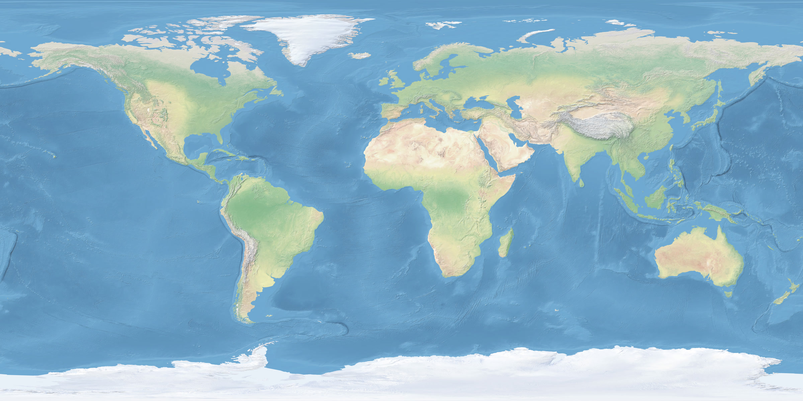
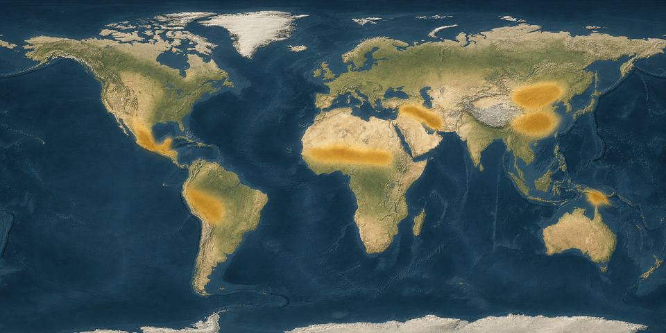
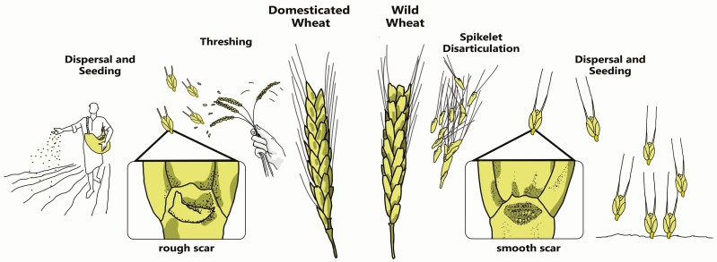
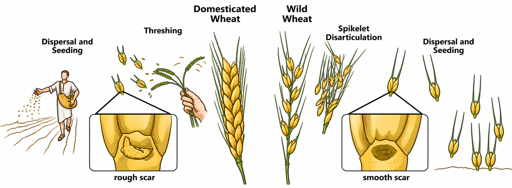

# Many Beginnings of Farming — research and editorial note

Date: 2026-07-27; production-preview and final visual review updated 2026-08-15
Lesson ID: `lesson.farming.multiple-origins`
Research-note identity/version: ASH-74 learner-prototype checkpoint v2
World Spine position: 7
Linear: [ASH-74](https://linear.app/ashs-workshop/issue/ASH-74/research-and-publish-many-beginnings-of-farming)
Original research branch: `codex/ash-74-many-beginnings-farming`
Checkpoint continuation branch: `codex/ash-74-v2-forward-test`
Required or optional: required
Queue status: **Review**
Accountable reviewer: Carlin Aylsworth
Validation tier: reference
Status: **Provisionally validated after Stage 16 and product-owner sanity review; Stage 17 learner UAT deferred until before broad release**

This note is the durable source, claim, learning, media, prototype, and checkpoint record. The complete learner-facing draft and final reviewed media render in the real Learn shell; publication migrations, production unlocks, release approval, and hosted production changes remain blocked.

## Work boundary

| Field | Decision |
| --- | --- |
| Stable lesson ID | `lesson.farming.multiple-origins` |
| Legacy aliases | `neolithic_revolution` (legacy timeline stub; reframed, not reused as title) |
| Canonical title | **Many Beginnings of Farming** |
| Journey / chapter / position | World History · Human Beginnings and Food Systems · Spine 7 |
| Required | yes |
| Chronology | c. 10,000–3000 BCE (regional processes begin earlier and finish later; these dates bound the lesson’s focus window) |
| Curriculum prerequisite | `lesson.climate.holocene-transition` (unpublished; do not assume climate lesson knowledge) |
| Successor | `lesson.farming.settlements` (already published) |
| Issue / branch | ASH-74 · original research on `codex/ash-74-many-beginnings-farming`; learner-prototype continuation on `codex/ash-74-v2-forward-test` |
| Accountable reviewer | Carlin Aylsworth |

This increment designs the global multiple-origins frame that Farming and Settlements already assumes. It does not rebuild Çatalhöyük, teach pastoralism, invent Holocene climate content, promote Spine positions 3–6, redesign the Learn shell, generate final assets before approval, or publish database configuration.

**Non-goals:** a complete crop encyclopedia; animal domestication deep dive; single-cause climate explanation; “why farming happened everywhere” philosophy; diffusion routes of every crop; later Green Revolution.

## Node proposal

**Essential question:** Did farming begin once in one place and then spread—or did people in different regions invent food production independently?

**Durable understanding:** Farming began independently in several regions, with different crops, landscapes, and timelines. Domestication was usually a long process of people and plants changing together—not a single “Agricultural Revolution.”

**Supporting understandings:**

1. Popular “Neolithic Revolution / Fertile Crescent invents farming for the world” stories overstate one region and one sudden switch.
2. Domestication means plants (and later animals) change under human cultivation and selection; cultivation can precede clear morphological domestication for centuries or millennia.
3. Southwest Asia, China (millet and rice traditions), New Guinea, Africa, and the Americas each developed food production using local plants and local practices.
4. Evidence packages differ: seed-crop scars and grain size in some regions; wetland mounds, starch, and phytoliths in others.
5. Farming did not always mean permanent villages first, and it did not automatically create cities, kings, or writing.

**Evidence encounter:** A Chronos world map of the five roster regions as approximate early-domestication zones, paired with a short comparison of contrasting crop packages (for example Southwest Asian cereals/pulses versus New Guinea banana/taro/yam vegeculture versus Mesoamerican maize). Learners decide what “independent beginning” means when crops and evidence types differ.

**Prerequisites (stated in-lesson because Holocene Climate is unpublished):** people already lived by foraging in many environments; a reconstruction or map zone is not a photograph of the past; later settlement lessons zoom into one regional case.

**Common misconceptions to prevent:**

- farming was invented once in the Fertile Crescent and copied everywhere;
- farming arrived overnight as a sharp “revolution”;
- every early farming community lived in permanent villages like Çatalhöyük;
- farming was always an obvious improvement with no tradeoffs;
- New Guinea / Africa / Americas only farmed after contact with Eurasia;
- China had one identical crop package everywhere;
- domestication equals civilization.

**Scope:** Independent plant-focused food-production beginnings in the five roster regions between roughly 10,000 and 3000 BCE. Animals appear only as brief supporting context where inseparable (for example Southwest Asia mixed farming); full pastoral alternatives belong to Spine 9.

**Why one lesson:** The curriculum already has a Southwest Asian settlement case. Learners need the global corrective first so Çatalhöyük cannot be misread as “how farming began for humanity.”

**Bridge from previous published neighbor:** Migrations taught branching movement and encounter. This lesson jumps forward in the food-systems thread: after long forager histories (Spine 3–6 still unpublished), people in several regions began cultivating local plants.

**Bridge to Settlements:** Once learners know farming began in many places, zoom into one Anatolian pathway where cultivation, storage, and dense houses reshaped daily life.

## Research questions

1. How many independent centers does current consensus support, and how should Chronos handle “at least X, maybe more”?
2. What wording distinguishes cultivation, domestication, agriculture, and sedentism without a jargon dump?
3. Which five roster regions are securely independent, and which supporting sub-centers stay enrichment-only?
4. What concrete evidence can ages 11–14 observe without rights-blocked excavation photos?
5. How gradual were cereal domestication episodes (non-shattering, seed size)?
6. How should New Guinea and African evidence be taught when preservation and methods differ from Southwest Asian cereals?
7. How do we keep climate as background condition without claiming one climate cause?
8. How should journey framing insert this lesson before already-published Settlements?

## Source ledger

All sources accessed 2026-07-27. “Research use” supports claims; it does not authorize republishing figures unless separately rights-cleared.

| Source ID | Citation / link | Type and authority | Claims supported | Limits / bias | Rights / use | Review |
| --- | --- | --- | --- | --- | --- | --- |
| `source.farming.larson-2014-pnas` | Larson et al., [Current perspectives and the future of domestication studies](https://doi.org/10.1073/pnas.1323964111), *PNAS* 111 (2014) | Multi-author specialist synthesis (archaeology, genetics, archaeobotany) | ≥11 widely accepted independent centers; Holocene timing bands; domestication as coevolutionary process; protracted cereal change | Synthesis, not primary excavation; Fig. 1 includes diffusion arrows Chronos must not copy as “one origin” | OA article; PNAS licensing often restricts derivatives — treat figures as **research citation / geographic facts only** until item-level license confirms editable reuse | Reviewed 2026-07-27 |
| `source.farming.fuller-2014-convergent` | Fuller et al., [Convergent evolution and parallelism in plant domestication](https://pmc.ncbi.nlm.nih.gov/articles/PMC4035951/), *PNAS* 111 (2014) | Peer-reviewed archaeobotanical synthesis | Parallel domestication processes; seed-crop vs vegeculture; quantified slow cereal rates; New Guinea mid-Holocene cultivation | Global overview; some regional dates refined since 2014 | PMC full text; figures research-only pending license check | Reviewed 2026-07-27 |
| `source.farming.fuller-willcox-2011` | Fuller, Willcox & Allaby, [Cultivation and domestication had multiple origins](https://www.tandfonline.com/doi/abs/10.1080/00438243.2011.624747), *World Archaeology* 43 (2011) | Peer-reviewed Near East critique | Against single Near Eastern “core area”; protracted predomestication cultivation; piecemeal crop appearance | Southwest Asia focus; debates continue with core-area defenders | Research citation | Reviewed 2026-07-27 |
| `source.farming.denham-2003-kuk` | Denham et al., [Origins of agriculture at Kuk Swamp…](https://doi.org/10.1126/science.1085255), *Science* 301 (2003) | Peer-reviewed multidisciplinary excavation synthesis | Independent New Guinea agriculture by ~6950–6440 cal BP; earlier wetland-edge plant use; banana intensification; taro use | Phase interpretation debated historically; starch cannot always separate wild vs cultivated forms | Research citation; figures not redistributed | Reviewed 2026-07-27 |
| `source.farming.fullagar-2006-kuk-starch` | Fullagar et al., early/mid-Holocene taro and yam processing at Kuk, *J. Archaeological Science* (2006) | Residue/usewear analysis | Taro and yam processing by ~10.2 ka cal BP at Kuk wetland margin | Does not alone prove full agriculture in Phase 1 | Research citation | Reviewed 2026-07-27 |
| `source.farming.lu-2009-cishan-millet` | Lu et al., [Earliest domestication of common millet…](https://pmc.ncbi.nlm.nih.gov/articles/PMC2678631/), *PNAS* 106 (2009) | Peer-reviewed archaeobotany / phytolith study | Early Holocene broomcorn millet in North China (~10 ka claims at Cishan) | Dating and identification debates exist in later literature; use cautious “early Holocene millet cultivation in North China” | OA text; media research-only | Reviewed 2026-07-27 |
| `source.farming.deng-2015-baligang` | Deng et al., [From Early Domesticated Rice…](https://pmc.ncbi.nlm.nih.gov/articles/PMC4604147/), *PLOS ONE* (2015) | Peer-reviewed long-sequence archaeobotany | Distinct northern millet and Yangtze rice traditions; later mixing | Regional corridor case, not every Chinese valley | CC BY | Reviewed 2026-07-27 |
| `source.farming.piperno-2009-maize` | Piperno et al., [Starch grain and phytolith evidence for early ninth millennium B.P. maize…](https://doi.org/10.1073/pnas.0812525106), *PNAS* 106 (2009) | Peer-reviewed microfossil study | Maize in Central Balsas by ~8700 cal BP; early domesticated squash signal | Microfossil inference; highland vs Balsas debates historically settled toward Balsas ancestry | Research citation | Reviewed 2026-07-27 |
| `source.farming.ranere-2009-balsas` | Ranere et al., [Cultural and chronological context…](https://pmc.ncbi.nlm.nih.gov/articles/PMC2664064/), *PNAS* 106 (2009) | Peer-reviewed excavation context for Piperno 2009 | Early Holocene occupation and plant use in Central Balsas; seasonal mobility with cultivation | One shelter sequence | Research citation | Reviewed 2026-07-27 |
| `source.farming.smith-2006-ena` | Smith, [Eastern North America as an independent center…](https://doi.org/10.1073/pnas.0604335103), *PNAS* 103 (2006) | Peer-reviewed synthesis | Eastern North America domesticated local plants independently | Enrichment for Americas diversity; not a fifth roster region by itself | Research citation | Reviewed 2026-07-27 |
| `source.farming.winchell-2018-sorghum` | Winchell et al., [Origins and dissemination of domesticated sorghum and pearl millet…](https://pmc.ncbi.nlm.nih.gov/articles/PMC6394749/), *African Archaeological Review* (2018) | Peer-reviewed Sahel synthesis | Eastern Sahel sorghum domestication pathway; western Sahel pearl millet pathway; Africa not a single secondary adopter | Dates continue to refine; impressions/ceramics dominate some early signals | OA PMC | Reviewed 2026-07-27 |
| `source.farming.barron-2020-pearl-millet` | Barron et al., [Transition from wild to domesticated pearl millet…](https://link.springer.com/article/10.1007/s10437-021-09428-8), *African Archaeological Review* (2021) | Peer-reviewed ceramic-temper archaeobotany | Wild-to-domestic morphological transition in northern Mali; third-millennium BC domesticated forms | Preservation via temper, not carbonized grain alone | Research citation | Reviewed 2026-07-27 |
| `source.farming.baird-2018-anatolia` | Baird et al., [Agricultural origins on the Anatolian plateau](https://doi.org/10.1073/pnas.1800163115), *PNAS* 115 (2018) | Peer-reviewed regional multi-proxy study | Gradual/uneven Southwest Asian uptake; bridge to Settlements lesson | Central Anatolia, not all Fertile Crescent | Research citation | Reviewed 2026-07-27 |
| `source.farming.natural-earth` | [Natural Earth](https://www.naturalearthdata.com/) | Public-domain geographic base | Coastlines/continents for Chronos map generation | Modern coastlines; not Holocene shorelines | Public domain | Reviewed 2026-07-27 |

### Sources deliberately not used as authorities

- Jared Diamond / popular single-cause geographic determinism as a claim authority.
- Textbook “Neolithic Revolution begins 10,000 BCE in the Fertile Crescent” one-liners.
- Generic stock “ancient farmer” reconstructions as evidence.
- AI maps with invented borders or diffusion arrows from one hearth.
- Wikipedia summaries as sole support for material claims.

Research stopped when independent beginnings, protracted domestication, and the five roster regions were each supported by specialist sources; remaining disagreements are dating precision and exact sub-center counts, not the lesson’s core claim.

## Claim ledger

| Claim ID and wording | Kind | Certainty | Sources | Counterevidence / limits | Learner treatment | Review |
| --- | --- | --- | --- | --- | --- | --- |
| `claim.farming.multi.independent-centers` | Independent food-production beginnings occurred in multiple regions of the Old and New Worlds | Interpretation | High | Larson 2014; Fuller 2014 | Exact count varies (≥11 widely accepted; sometimes >20 proposed). Chronos teaches five roster regions, not a complete census | Teach “several independent beginnings,” not a magic number | Editorial review required |
| `claim.farming.multi.not-one-revolution` | Farming did not begin as a single worldwide Neolithic Revolution invented once in Southwest Asia | Interpretation | High | Fuller–Willcox–Allaby 2011; Larson 2014; regional packages | Southwest Asia remains an early and consequential center; rejecting primacy is not denying its importance | Open by dismantling the single-origin myth while retaining SW Asia as one beginning | Editorial review required |
| `claim.farming.multi.domestication-process` | Domestication is a process: cultivation and human niches can precede clear morphological domestication traits for long periods | Interpretation | High | Larson 2014; Fuller 2014; Allaby et al. via Larson | Rates differ by crop and region; some traits may fix faster in vegetatively propagated plants | Define cultivation vs domestication in use | Editorial review required |
| `claim.farming.multi.cereal-protracted` | For major Old World cereals, key morphological changes such as non-shattering often unfolded over ~1,000–4,000 years | Observation / interpretation | High | Fuller 2014 | Not every crop shares cereal rates | One concrete mechanism example, not a universal stopwatch | Editorial review required |
| `claim.farming.multi.sw-asia` | Southwest Asia was an early center where people cultivated local cereals and pulses; the process was regionally uneven, not a single core-package switch | Interpretation | High | Fuller–Willcox–Allaby 2011; Baird 2018 | Core-area defenders still exist; Chronos follows the multi-origin / protracted consensus | One of five beginnings; defer Çatalhöyük detail to Settlements | Editorial review required |
| `claim.farming.multi.china` | In China, early Holocene food production included northern millet traditions and Yangtze rice traditions that were not identical packages | Interpretation | High | Lu 2009; Deng 2015; Fuller China overview | Exact earliest dates debated; treat “early Holocene” ranges | Present China as one roster region with internal diversity | Editorial review required |
| `claim.farming.multi.new-guinea` | New Guinea developed early independent cultivation, including mid-Holocene wetland agriculture at Kuk with banana intensification and use of taro/yam | Interpretation | High | Denham 2003; Fullagar 2006; Fuller 2014 | Phase 1 vs Phase 2 intensity contested; starch wild/cultivated distinction limited | Essential corrective that farming ≠ Fertile Crescent cereals | Editorial review required |
| `claim.farming.multi.africa` | Africa includes independent cereal domestication pathways, notably pearl millet in the western Sahel and sorghum in the eastern Sahel | Interpretation | High | Winchell 2018; Barron 2020/2021 | Chronology still refining; not every African crop is covered | One African food-production beginning with two named crops; avoid “Africa received farming late” | Editorial review required |
| `claim.farming.multi.americas` | In the Americas, people domesticated local plants independently; maize in the Central Balsas region of Mexico is attested by ~8700 cal BP | Observation / interpretation | High | Piperno 2009; Ranere 2009 | Americas contain multiple centers (Andes, eastern North America, etc.) | Lead with Mesoamerican maize; briefly note more than one American beginning | Editorial review required |
| `claim.farming.multi.not-always-villages` | Early cultivation often occurred among mobile or seasonally mobile communities; permanent dense villages were not a universal first step | Interpretation | High | Ranere 2009; Fuller 2014; Denham 2003 | SW Asia has early sedentism debates of its own | Explicitly block “farming = Çatalhöyük houses everywhere” | Editorial review required |
| `claim.farming.multi.no-automatic-cities` | Independent farming beginnings do not by themselves create cities, states, writing, or kings | Interpretation | High | Curriculum design; contrast with Uruk | Surpluses can enable later complexity; they do not guarantee it | Closing beat before Settlements / cities | Editorial review required |
| `claim.farming.multi.climate-not-single-cause` | Holocene environmental change is relevant context, but no single climate event explains all farming beginnings | Interpretation | Moderate–High | Larson 2014 discussion; unpublished Holocene lesson deferred | Avoid filling the missing climate lesson with a one-cause story | One cautious context sentence only | Editorial review required |

## Content triage

| Candidate idea | Decision | Why | Destination |
| --- | --- | --- | --- |
| Single-origin myth dismantling | Essential | Core purpose of the node | Opening |
| Domestication as process / protracted cereals | Essential | Mechanism, not map trivia | Early sections |
| Five roster regions with distinct crops | Essential | Canonical scope | Map + knowledge |
| New Guinea vegeculture contrast | Essential | Breaks cereal-only mental model | Evidence / comparison |
| Africa sorghum + pearl millet | Essential | Prevents Africa-as-secondary story | Regional panel |
| Americas maize (Balsas) | Essential | Independent New World beginning | Regional panel |
| China millet + rice internal diversity | Supporting | Prevents one-China-package myth | Regional panel |
| Eastern North America / Andes extras | Enrichment | Shows Americas plurality without encyclopedia | One sentence or card fact |
| Animal domestication pathways | Deferred | Spine 9 | Animals lesson |
| Younger Dryas / Holocene climate deep dive | Deferred | Spine 6 | Climate lesson |
| Çatalhöyük houses / storage | Deferred | Already published | Settlements |
| Exact domestication gene stories | Rejected | Too technical for this lesson | — |
| Diffusion arrows from SW Asia as main visual | Rejected | Reinforces the misconception | — |
| Diamond geographic ranking of continents | Rejected | Distorts agency and evidence | — |

## Learning blueprint

**Essential question:** Did farming begin once in one place and then spread—or did people in different regions invent food production independently?

**Durable understanding:** Farming began independently in several regions with different crops and timelines. Domestication was usually gradual, and farming did not mean one worldwide lifestyle.

**Supporting understandings:** see Node proposal.

**Prerequisites:** foraging lifeways existed first; maps show models; Settlements will zoom into one case.

**Misconceptions:** see Node proposal.

**Indispensable vocabulary (define in use):** farming / food production; cultivation; domestication; crop; independent beginning; Fertile Crescent / Southwest Asia (as one region, not the inventor of farming).

**Evidence encounter:** world regional map + contrasting crop packages / evidence types.

**Historical-thinking move:** compare independent cases and reject a single-origin story using geographic and botanical evidence.

**Sincere-attempt evidence:** (1) select which conclusion the multi-region evidence best supports; (2) explain, with one region example, why “one invention then copied everywhere” fails, and name one limit of the evidence.

## Ages 11–14 design pass

- Open with the single-origin myth as a concrete wrong story, not abstract theory.
- Give time and place early: roughly after 10,000 BCE, in several regions, not everywhere at once.
- Cap new place names; prefer region labels over long site lists. Site names (Kuk, Balsas, Cishan) appear only when they carry evidence.
- Explain cultivation → domestication with one cereal example (seeds that stay on the plant when ripe) before introducing vegeculture.
- Keep climate to one cautious sentence; do not simulate the missing Holocene lesson.
- Avoid exoticizing any region; every panel gets a real crop and a real evidence type.
- No human remains, no invented “first farmer” portraits, no civilizational ranking.
- Section headings stay direct (“Farming did not begin once,” “Different plants, different evidence”).

## Section / component storyboard

| Order | Section ID | Learner-facing heading | Authoring purpose (not shown) | Claims | Module(s) | Media / action | Transition |
| ---: | --- | --- | --- | --- | --- | --- | --- |
| 1 | `section.farming.multi.not-once` | **Farming did not begin once** | Break the single-revolution myth and state the essential question | not-one-revolution; independent-centers | prose + 3-item knowledge | Optional hero map peek | Into mechanism |
| 2 | `section.farming.multi.what-domestication` | **Plants changed with people** | Define cultivation vs domestication; show gradual cereal change | domestication-process; cereal-protracted | prose | Recommended non-shattering diagram | Into geography |
| 3 | `section.farming.multi.five-beginnings` | **Several regions, different pathways** | Present illustrative roster regions with distinct crops without implying a complete or equal-scale count | sw-asia; china; new-guinea; africa; americas | knowledge (5 items) + historical-map | **Required** world zones map | Into evidence contrast |
| 4 | `section.farming.multi.different-evidence` | **Different plants leave different clues** | Contrast seed-crop scars/size with starch/phytoliths/wetland fields | new-guinea; cereal-protracted | prose + evidence or knowledge | Map callouts or crop-package comparison | Into lifestyle diversity |
| 5 | `section.farming.multi.not-one-lifestyle` | **Farming was not one lifestyle** | Block village-first universalism and automatic cities | not-always-villages; no-automatic-cities; climate-not-single-cause | prose + knowledge (3) | none required | Into checks |
| 6 | `section.farming.multi.world-check` | **World Check** | Require sincere use of multi-origin evidence | all core claims | prompt ×2 + completion | none | Bridge to Settlements after completion |

Six semantic sections. Related navigation stays outside required progress.

## Media plan

### 1. World beginnings map — **Required**

| Field | Decision |
| --- | --- |
| Teaching purpose | Make independent geographic beginnings visible; prevent Fertile Crescent-only mental map |
| Claims | independent-centers; five regional claims |
| Form | `historical-map` (Chronos-original raster) |
| Depiction mode | Approximate early-domestication **zones**, not invention pinpoints |
| Placement | Section 3 (also usable as restrained lesson hero if composition stays label-light) |
| Learner action | Locate / compare regions |
| Accessibility | Accessible summary naming the five regions and stating zones are approximate models |
| Geographic method | Natural Earth public-domain base + scholarly zone placement from Larson/Fuller consensus; **do not** image-edit PNAS Fig. 1 until license confirms derivatives; **no diffusion arrows** |
| Labels (exact short raster text only if needed) | Southwest Asia · China · New Guinea · Africa · Americas — or rely on native UI callouts |
| Review | Full map brief in follow-up note after approval |

### 2. Non-shattering cereal diagram — **Recommended**

| Field | Decision |
| --- | --- |
| Teaching purpose | Make “domestication as process” concrete |
| Claims | domestication-process; cereal-protracted |
| Form | diagram via raster image-edit from a rights-cleared botanical / textbook-style reference of wild vs domestic cereal ears |
| Depiction mode | diagram; no educational paragraphs in art |
| Placement | Section 2 |
| Fail-safe | If no rights-cleared reference is found, teach with prose + simple comparison knowledge items only |

### 3. Crop-package comparison panel — **Preferred / optional**

A focused evidence comparison asking: **Which clues survive from cereal farming versus tropical root-crop and wetland cultivation, and what does each evidence set leave uncertain?** A Chronos-original crop grouping can support that question, but an eight-crop inventory is not the teaching goal. This is deferrable if the map + native knowledge items already teach the comparison.

### Explicit exclusions

- Diffusion arrows from Southwest Asia across the world.
- “First farmer” character portraits.
- Human remains or burial agriculture scenes.
- Exact Holocene coastlines unless separately researched.
- Video (fails the exceptional-video gate).

### Generation prompts for product-owner image creation

Use these after approval. Provide Natural Earth (or a clean public-domain world physical map) as the geographic reference for Prompt A. For Prompt B, attach a rights-cleared wild-vs-domestic cereal reference photograph/diagram if available.

**Prompt A — world beginnings map (required)**

```text
Create a single historical map illustration for a Chronos lesson.

LESSON AND PURPOSE:
- Subject: early independent beginnings of farming
- Period: roughly 10,000–3000 BCE
- Teaching goal: show five separate regions where people began domesticating local plants, without implying one invention spread everywhere

GEOGRAPHIC REFERENCE:
- Treat the attached Natural Earth / public-domain world physical map as the geographic source
- Preserve continent shapes, orientation, and broad land/water relationships
- Do not copy styling, arrows, borders, or labels from any scholarly journal figure

VERIFIED / SOURCE-SUPPORTED FEATURES:
- Soft approximate zones (not sharp political borders) over:
  1) Southwest Asia / Fertile Crescent arc
  2) China (broad north-to-Yangtze band; one zone, not two competing empires)
  3) New Guinea highlands–island emphasis
  4) African Sahel belt (east–west band, not the whole continent)
  5) Mesoamerica to northern South America emphasis for Americas (one Americas zone; do not invent precise borders)
- Modern coastlines acceptable; do not invent ancient shorelines

OMIT:
- Diffusion arrows
- Exact site pins
- Dates, paragraphs, titles, logos, UI chrome
- National borders, armies, temples, cities

STYLE:
- Calm educational atlas; muted terrain; clear ocean/land separation
- Soft translucent zone fills in one restrained accent family
- Optional tiny region labels only if short: Southwest Asia, China, New Guinea, Africa, Americas
- No decorative collage, no people, no crops drawn on the map
```

**Prompt B — non-shattering diagram (recommended)**

```text
Edit the attached botanical reference into a Chronos lesson diagram.

PURPOSE:
- Compare a wild cereal ear that shatters and drops grain with a domesticated ear that holds grain for harvest

PRESERVE FROM REFERENCE:
- Side-by-side ear / spikelet comparison structure
- Clear difference in whether ripe grain stays attached

REMOVE / DO NOT ADD:
- Paragraphs, titles, captions, logos, watermarks, UI
- DNA helices, clocks, cartoon farmers
- Claims about exact years or genes

STYLE:
- Clean scientific illustration on a quiet background
- Two labeled clusters only if short native-looking tags are unavoidable; prefer unlabeled forms so the app can caption them as “wild” and “domesticated”
```

**Prompt C — optional crop still-life strip**

```text
Create a quiet horizontal still-life strip of five small crop groupings for a Chronos lesson:
1) wheat/barley + lentils
2) foxtail/broomcorn millet + rice panicle
3) banana + taro corm + yam
4) sorghum head + pearl millet
5) maize ear + squash
No text, no people, no decorative frames, no “firsts” badges. Naturalistic food objects on a simple neutral surface. Do not invent impossible hybrid plants.
```

## Knowledge Card plan

**Recommendation: no Knowledge Card for this lesson.**

Rationale: the durable memory object is the multi-region pattern itself. Settlements already unlocks Çatalhöyük. A people/place card would either over-privilege one region (undermining the lesson) or become an abstract “idea card” without a honest visual. A Kuk place card is attractive as a Fertile Crescent corrective, but risks turning a global frame lesson into a New Guinea biography.

**Alternate if product owner wants a card:** Place / Witness card **Kuk Early Agriculture** — highland New Guinea wetland farming as proof that farming is not only cereal agriculture from Southwest Asia. Requires a reconstruction labeled as interpretive, not a photograph of the past.

## Understanding-check plan

### Prompt 1 — supported selection

- ID: `prompt.farming.multi.what-evidence-supports`
- Question: **Looking at farming beginnings in Southwest Asia, China, New Guinea, Africa, and the Americas, which conclusion is best supported?**
- Supported: Farming began independently in several regions with different crops.
- Distractors: Farming was invented once in the Fertile Crescent and copied everywhere; Farming always started with dense villages first; Historians still have evidence from only one continent.
- Feedback: Different regions domesticated different local plants on different timelines. That pattern supports multiple beginnings, not one worldwide invention.

### Prompt 2 — concise explanation

- ID: `prompt.farming.multi.explain-independent`
- Question: **Choose one region from the lesson. Explain how its crops or evidence show an independent beginning of farming. Then name one thing this evidence cannot prove by itself.**
- Accepted examples: SW Asia cereals/pulses; China millet/rice; New Guinea banana/taro/yam and wetland fields; Africa pearl millet/sorghum; Americas maize.
- Accepted limits: exact first inventor, exact start day, motives, complete crop list, that farming was “better,” that cities automatically followed, climate as sole cause.
- Completion: sincere in-scope attempt; specialist vocabulary unnecessary.

## Journey framing

- New entry ID: `entry.world-history.multiple-origins`
- Insert in `chapter.world-history.human-beginnings` **before** Settlements (positions shift; IDs stay stable).
- Framing: **Before zooming into one settlement, see that farming began in more than one part of the world.**
- Legacy alias configuration: map `neolithic_revolution` → this lesson when publishing.
- After completion, primary next action: Farming and Settlements.
- Optional exploration: none required.
- Note: curriculum prerequisite Holocene Climate remains unpublished; fail closed for Spine 6; do not unlock Settlements by skipping this node once this lesson is published.

## Disagreement, uncertainty, and missing voices

- Center counts differ by definition (crop genetic origin vs cultural tradition vs “pristine” primary center). Chronos teaches five roster regions and admits more existed.
- Earliest absolute dates for millet, rice, sorghum, and banana remain actively refined; use ranges and “by about,” not anniversary years.
- Women’s labor, children’s work, and enslaved/captive labor are poorly visible in early domestication evidence; do not invent characters to fill the silence.
- Indigenous and descendant communities remain living peoples; avoid treating them as museum relics of “first farmers.”
- Vegecultural and African evidence was historically marginalized by cereal-focused scholarship; the lesson must not reproduce that erasure.
- Survival bias: dryland carbonized cereals preserve differently than tropical tubers.

## Research / editorial checkpoint — decision packet

### Recommended learner-facing title and scope

Keep **Many Beginnings of Farming** (c. 10,000–3000 BCE). Teach independent plant food-production beginnings in Southwest Asia, China, New Guinea, Africa, and the Americas. Defer animals, Holocene climate depth, and Çatalhöyük mechanics.

### Essential question and durable understanding

See Learning blueprint above.

### Major claims, sources, disagreement, uncertainty

Independent multi-regional beginnings are high-confidence consensus (Larson/Fuller and regional specialists). Disagreement concentrates on exact counts, earliest dates, and how to define a “center.” Teach five regions + “and more” rather than a fake complete list.

### Deliberately deferred / rejected

Holocene climate lesson; pastoralism; Çatalhöyük deep dive; Diamond ranking; diffusion-arrow visuals; gene-level domestication stories.

### Ages 11–14 learning decisions

Myth-first opening; five region panels; one cereal mechanism; one vegeculture contrast; no site-name blizzard; two sincere-attempt prompts.

### Proposed section / component flow

Six sections in the storyboard table above.

### Media / map / video / no-media decisions

- Required: world zones map (Natural Earth–anchored; no PNAS figure republication; no arrows).
- Recommended: non-shattering diagram if a rights-cleared reference exists.
- Optional: crop still-life strip.
- Video: no.

### Knowledge Card decision

**Recommend none.** Alternate: Kuk Early Agriculture place card if a card is desired.

### Understanding-check plan

One supported-selection + one concise explanation, as above.

### Decisions that need product-owner judgment

1. Approve scope, title, and six-section arc? **Recommendation: approve.**
2. Approve required world zones map with no diffusion arrows? **Recommendation: approve.**
3. Approve **no Knowledge Card**, or choose the Kuk alternate? **Recommendation: no card.**
4. Approve inserting this journey entry immediately before Settlements once published? **Recommendation: approve.**
5. Any objection to naming Africa via pearl millet + sorghum (rather than a single vague “African farming”) and Americas via maize-first with a one-line plurality note? **Recommendation: approve.**

### Fail-safes after approval

- If map license/reference work fails, ship label-driven knowledge geography first only with explicit PO deferral of the required map (otherwise do not mark Review-ready).
- Keep educational prose in native UI.
- Do not let Settlements completion language imply this prerequisite is optional after publication.
- Keep unpublished Spine 3–6 fail closed.

## Learner-prototype checkpoint — 2026-08-11

### Draft implementation

- Exact preview route: `/learn/lesson.farming.multiple-origins`
- Local preview URL: `http://localhost:3000/learn/lesson.farming.multiple-origins`
- The complete six-section lesson is authored as typed Chronos content with 12 claim records, 10 lesson-local source records plus one shared Anatolia source, two required sincere-attempt prompts, and three explicit planned-media intentions.
- The World History journey draft inserts `entry.world-history.multiple-origins` immediately before `lesson.farming.settlements`; this draft does not publish migrations, unlock rules, or hosted state.
- The lesson remains `draft`. Claims remain `editorial-review-required`. Product review remains `pending`.
- Because this lesson establishes the reference process, its ages 11–14 learner walkthrough remains required. Carlin provisionally deferred it on 2026-08-16 because a learner is not currently available; the independent adult proxy and product-owner sanity reviews provide ballpark confidence but do not satisfy that gate.
- No Knowledge Card is included, following the recommendation above. Final map, diagram, and evidence-comparison art are deliberately unproduced until the product-owner checkpoint.

### Media-intention rendering

The real Learn-shell prototype renders explicit learner-visible alternatives for every absent visual:

1. **Cereal diagram:** prose plus the “A two-way change” knowledge comparison explains non-shattering and co-development while the diagram remains planned.
2. **World map:** the “Several regions, different pathways” section and five-region knowledge comparison provide the geographic model while the Natural Earth-anchored map remains planned.
3. **Evidence comparison:** native evidence items and the Kuk close read ask which clues survive in cereal versus tropical root-crop/wetland settings and what each can and cannot prove while final art remains planned.

No generated media, baked-in educational text, map pinpoints, political borders, or diffusion arrows were added at this checkpoint.

### Browser states inspected

The raw prototype was inspected in the actual Learn shell at 1440×900 and 390×844, light and dark, including direct open, prompt feedback, explicit completion, completed state, and revisit. The revised four-state check found:

- HTTP 200; correct lesson heading; six semantic sections and two prompt modules;
- no console errors, page errors, or failed requests;
- no learner-visible mojibake after the encoding revision;
- the three-item comparison remains three columns on desktop and stacks to one 322 px column at 390 px; the five-item comparison stacks under the same mobile rule;
- required completion is disabled before attempts; sincere radio + written attempts unlock explicit completion; completion continues to `/learn/lesson.farming.settlements`; direct reopen starts at the top.

### Independent adult learner-proxy review

Reviewer identity: **Codex adult learner proxy**. This was an independent raw-prototype review; the reviewer was not given the author’s diagnosis or research conclusions.

The first Stage 14B pass returned the prototype to Stage 14A:

- **Blocking — age-appropriate cognitive load:** learner-visible UTF-8 corruption interrupted dates, claims, and feedback.
- **Revise — mobile cognitive load / visual teaching:** three- and five-item comparisons retained narrow multi-column layouts at 390 px.
- **Revise — historical proportionality:** “Five beginnings, five food stories” turned illustrative, mixed-scale comparison units into a memorable but false count.
- **Revise — visual teaching value:** the broad crop-panel intention needed a sharper learner question; final visual value remains provisional until media exists.
- **Pass:** mental-model coherence, narrative momentum, evidence reasoning, and next-action clarity.

Stage 14A dispositions implemented before re-review:

- replaced corrupt learner-visible punctuation with encoding-safe copy;
- stacked three- and five-item knowledge comparisons at 620 px and below;
- renamed the section **Several regions, different pathways** and explicitly framed its examples as illustrative rather than complete;
- narrowed the third media intention to a cereal-versus-tropical evidence-survival question.

Repeat proxy disposition: **PASS.** The second independent reviewer found no remaining blocking proxy findings. Mental-model coherence, narrative momentum, age-appropriate cognitive load, evidence reasoning, historical proportionality, prototype-stage visual teaching value, and next-action clarity all passed. The reviewer confirmed all four viewport/theme states, no console/page/request failures or horizontal overflow, five full-width 322 px regional cards at 390 px, explanatory prompt feedback, sincere-attempt completion, continuation to Settlements, and revisit at `scrollY = 0`. Final visual execution, rights, provenance, and accessibility remain later-gate duties because native prose/knowledge carries every teaching dependency and the lesson remains unpublished.

Required learner disposition: **PROVISIONALLY DEFERRED by Carlin Aylsworth on 2026-08-16.** No ages 11–14 walkthrough has been recorded. The current process plus accountable product-owner sanity checks are accepted as sufficient to keep developing in the ballpark, but neither the system nor this lesson may be described as learner-proven. Deep learner UAT remains required before broad release.

### Deterministic validation record

- `npm.cmd run lesson:gate -- --lesson lesson.farming.multiple-origins --note docs/research/many-beginnings-of-farming.md --gate prototype` — pass.
- `npm.cmd run validate:content` — pass.
- `npm.cmd test -- tests/lesson/gate-validation.test.ts tests/lesson/prototype-media-intentions.test.tsx` — pass, 2 files / 12 tests.
- `npm.cmd run build` — pass (existing chunk-size warning only).
- `npm.cmd run typecheck` — repository baseline fails in existing legacy `NodeContentDisplay.tsx`, legacy `Resource.url` / `"Religious"` data typing, and existing v2 lesson-status inference; no diagnostic names the new Many Beginnings content module.
- `git diff --check` — pass.

### Earlier-stage risk comparison

The prototype confirms the evidence/uncertainty model and sincere-attempt completion can be carried through the real shell without hiding necessary causal explanation in media metadata. It also exposed issues the prose-only checkpoint did not: encoding corruption, mobile comparison fragmentation, an overly neat “five beginnings” label, and an unfocused optional visual. Those findings were resolved in the draft before the repeat proxy review. Final media teaching value, rights/provenance, map accuracy, accessibility, database migration, unlock behavior, and hosted empty-state/recovery remain later-gate work.

### Human checkpoint

Accountable reviewer: **Carlin Aylsworth**. Product-owner state: **approved on 2026-08-11** from the direct response “love the prototype.” The approval adopts all five recommended decisions: title/scope/arc, required no-arrow world map, no Knowledge Card, placement before Settlements, and the specific Africa/Americas regional framing. On 2026-08-16, Carlin explicitly accepted the process and product-owner sanity check as sufficient for provisional, ballpark confidence while deferring the unavailable ages 11–14 walkthrough to a deep pre-wide-release UAT pass. The lesson remains unpublished and not learner-proven until that gate passes.

## Image lifecycle

This section is the visual sanity-check surface for the lesson's accepted images. It keeps the reasoning, actual generation input, exact prompt, and accepted final together so reviewers can judge fidelity without reconstructing the process from scattered paths.

### `media.farming.multiple-origins-map` — show several separated, approximate food-production regions

#### 1. Reasoning and source basis

- Teaching job: let learners locate and compare widely separated early food-production regions without implying one birthplace or one spreading invention.
- Governing claims: `claim.farming.multi.independent-centers`, `claim.farming.multi.not-one-revolution`, and the regional claims for Southwest Asia, China, New Guinea, Africa, and the Americas.
- Factual/historical sources: Natural Earth for real geography, plus Fuller et al. 2014, Denham et al. 2003, Deng et al. 2015, Winchell et al. 2018, and Piperno et al. 2009 for the broad evidence zones.
- Why image instead of no media: the distance and separation among regions is a spatial relationship; prose alone makes that relationship harder to hold in one mental model.
- Depiction and uncertainty boundary: modern coastlines orient the learner; every amber zone is deliberately broad and approximate. No exact sites, borders, routes, chronological ranking, or complete count are claimed.

#### 2. Reference image actually used

| Reference preview | Origin and permitted use |
| --- | --- |
|  | Creator: Natural Earth contributors.<br>Canonical origin: [Natural Earth II 1:50m raster](https://www.naturalearthdata.com/downloads/50m-raster-data/50m-natural-earth-2/).<br>License/use: Public Domain.<br>Accessed: 2026-08-11. |

- Repository research copy: `docs/research/references/many-beginnings-farming/natural-earth-ii-shaded-relief-water.jpg`, SHA-256 `2BF3F7CBEFC9BCEB338A78060D541D03BDA2F4AF4596C0C5A4680D87739538E0`.
- Visual relationship to preserve: full-world 2:1 geography, coastline shapes, continent proportions, island positions, and relative distance among regions.
- Details not to copy or infer: the reference contributes geography only. It does not establish ancient coastlines, food-production zones, dates, routes, borders, or historical claims.

#### 3. Generation or transformation

- Operation: raster image edit using the displayed Natural Earth reference as the only image input.
- Actual input: the repository research copy and hash above.
- Tool/model/date: OpenAI ImageGen in Codex; model version not exposed (`gpt-imagegen` in generated C2PA metadata); 2026-08-11.
- Complete prompt:

<details>
<summary>Show exact map-edit prompt</summary>

```text
Edit the provided Natural Earth world raster into a historically disciplined educational map for an ages 11–14 lesson about the many beginnings of farming. Preserve the source coastline shapes, continent proportions, island positions, and geographic relationships exactly; this is a map edit, not invented geography. Keep an equirectangular full-world composition at 2:1 landscape aspect ratio. Restyle the base into a calm Chronos palette: deep desaturated blue ocean, warm parchment-to-olive land, subtle terrain shading, legible land-water contrast, no modern political borders.

Overlay exactly five soft, semi-transparent, approximate origin zones using restrained amber/gold glow or textured wash, not point markers: (1) Southwest Asia / Fertile Crescent, a curved zone from the southern Levant through northern Mesopotamia toward the Zagros; (2) China, two broad related areas across northern China and the Yangtze basin; visually one regional grouping, not a migration route; (3) New Guinea highlands, a compact zone centered on the island’s central highlands; (4) the African Sahel, an elongated east-west band immediately south of the Sahara; (5) the Americas, two separate soft areas within one broad regional story—Mesoamerica and northern South America / Andean foothills. Zones should communicate approximate regions and uncertainty, not exact sites.

Absolutely no arrows, travel lines, chronological sequence, pins, icons, crop illustrations, people, national borders, labels, dates, title, legend, captions, paragraphs, educational UI, frames, buttons, baked-in text, or invented coastlines. No single zone should look dominant. The visual thesis is simultaneous plurality: several communities in different regions changed how they lived with plants over long periods. Polished editorial museum-atlas quality, calm and uncluttered, with generous edge breathing room. Output a high-resolution raster suitable for responsive web use.
```

</details>

- Candidate/rejection record: no visual candidate was rejected. The accepted 1774×887 output was resized for the 960-pixel Learn surface because its 1600-pixel derivative exceeded the unchanged media byte ceiling.

#### 4. Accepted final image

| Reference used | Accepted final |
| --- | --- |
|  |  |

- Final master: `public/images/maps/many-beginnings-farming-zones.png`, 960×480, SHA-256 `dc374e51d31d1b4e28da83c17d980f52f8b6726871616478f9198c4e3369e0a1`.
- Runtime fallback: `/images/optimized/farming/multiple-origins-map.optimized.webp`, SHA-256 `ac553e99a841a5e22c7fe34559307a8c597badfc3f9b0ebc0f384e15bec78369`.
- Reviewer/date/status: Chronos historical, visual, provenance, and responsive review; 2026-08-11; approved for the draft production preview.
- Preserved relationship: the complete world geography, continent proportions, coastlines, and spatial separation remain recognizable and useful.
- Intentional changes: the palette is calmer and six soft amber areas express five learner-facing regional groupings.
- Unsupported details checked: no invented coastline, border, arrow, route, site pin, label, date, or complete-count claim appears. The regions remain approximate and are explained by native lesson text.

### `media.farming.wild-domesticated-wheat` — make one domestication mechanism visible

#### 1. Reasoning and source basis

- Teaching job: let learners infer why a wheat ear that stays intact is easier for people to gather and replant than a wild ear that naturally breaks apart.
- Governing claims: `claim.farming.multi.domestication-process` and `claim.farming.multi.cereal-protracted`.
- Factual/scientific sources: Fuks and Marom 2021 Figure 2 for the rough-versus-smooth rachis scar and non-shattering-versus-brittle-ear comparison; Fuller et al. 2014 for the slow, repeated selection process.
- Why image instead of no media: the physical relationship between intact ears, falling spikelets, and break scars is easier to reason from visually than from botanical terminology alone.
- Depiction and uncertainty boundary: this is an evidence-led botanical model of one cereal mechanism, not a universal picture of every crop, region, or domestication pathway.

#### 2. Reference image actually used

| Reference preview | Origin and permitted use |
| --- | --- |
|  | Creators: Fuks and Marom.<br>Canonical origin: [Figure 2, Animal Frontiers 11.3](https://pmc.ncbi.nlm.nih.gov/articles/PMC8214439/figure/F2/).<br>License/use: CC BY 4.0.<br>Accessed: 2026-08-11. |

- Repository research copy: `docs/research/references/many-beginnings-farming/wild-domesticated-wheat-figure-2.jpg`, SHA-256 `ACC5C7C76101C53BA414936930DE193A4408DD073C555AE23FCBC73EBD8AF7BF`.
- Edit mode: style-only transformation with a targeted morphology correction requested by the accountable reviewer.
- Visual relationship to preserve: the full left-to-right scientific sequence; compact domesticated wheat stays intact until threshing; visibly looser wild wheat disarticulates for dispersal; rough and smooth rachis scars remain distinguishable.
- Locked layout/detail invariants: wide canvas; farmer and left dispersal sequence; threshing action; rough-scar inset; central domesticated and wild ears; spikelet-disarticulation sequence; smooth-scar inset; right dispersal sequence; all seven short labels, leader lines, and evidence-bearing morphology.
- Details not to copy or infer: the reference does not show every domestication pathway or prove conscious planning by farmers. No new crop, process, chronology, or universal claim may be introduced.

#### 3. Generation or transformation

- Operation: strict raster image edit using the displayed CC BY scientific figure as the composition input, followed by one targeted edit to restore a visibly distinct wild-wheat morphology.
- Actual inputs: the repository research copy and hash above; first structure-preserving edit candidate `exec-fbc20cc7-b83e-42d7-94ec-bb44aced64ae.png`, SHA-256 `1547D369091FB29B6EC4AA05776861FB6C0D6B25949EA87608A683E0F8F6449F`.
- Tool/model/date: OpenAI ImageGen in Codex; model version not exposed; 2026-08-11.
- Complete prompts:

<details>
<summary>Show exact wheat-diagram edit prompts</summary>

```text
Use case: scientific-educational
Asset type: Chronos lesson evidence figure, strict style-only edit
Input image: Image 1 is the edit target and the locked scientific composition.
Primary request: Apply only a polished animated editorial illustration style to Image 1. This is a faithful restyling, not a redesign.

ABSOLUTE COMPOSITION LOCK:
- Preserve the exact wide canvas aspect ratio and white background.
- Preserve every object, action, label, callout, leader line, inset, and spatial relationship from Image 1.
- Keep the complete left-to-right sequence: left dispersal and seeding; threshing; rough-scar inset; domesticated ear; wild ear; spikelet disarticulation; smooth-scar inset; right dispersal and seeding.
- Preserve all scientific morphology, human actions, labels, ground lines, leader lines, and inset borders.
- Preserve every text label verbatim with the same hierarchy and placement.
- Do not crop, zoom, recompose, simplify, add, remove, replace, mirror, relabel, or reinterpret anything.

STYLE CHANGE ONLY:
- Convert the black linework and flat fills into a clean, friendly animated/cel-illustration treatment.
- Use crisp dark outlines, restrained wheat greens and warm golds, subtle flat shading, and a clean off-white background.
- Keep labels highly legible in a simple bold sans-serif typeface.
- No decorative texture, parchment, border, title, watermark, extra annotation, or new educational text.

Acceptance criterion: an overlay comparison must show the same layout and all original teaching details; only line/color/rendering style may differ.
```

Targeted correction after reviewer found that the generated central wild ear looked too similar to the domesticated ear:

```text
Use case: precise-object-edit
Asset type: Chronos scientific evidence diagram
Input images: Image 1 is the edit target. Image 2 is the authoritative morphology and layout reference.

Primary request: Correct ONLY the central wheat head labeled "Wild Wheat" in Image 1. It currently looks too much like the compact domesticated head. Make the wild head visibly slimmer, looser, more irregular, and less densely packed, with more separated spikelets and the brittle/shattering character suggested by Image 2. The learner must immediately see that the domesticated head stays compact while the wild head is looser and readily disarticulates.

LOCK EVERYTHING ELSE:
- Keep the entire canvas, aspect ratio, white background, crop, positions, scale, spacing, and animated/cel illustration style of Image 1 unchanged.
- Keep the central "Domesticated Wheat" head completely unchanged.
- Keep the farmer, seeding sequences, threshing hand, rough-scar inset, spikelet-disarticulation sequence, smooth-scar inset, ground lines, leader lines, labels, typography, and colors unchanged.
- Preserve all text verbatim and in the same position.
- Do not add or remove any panel, callout, inset, action, label, or decorative element.
- Do not modify the wild head's label or stem position.
- No new text, title, border, texture, or watermark.

Acceptance criterion: outside the pixels belonging to the central wild-wheat ear and its awns, the result should appear unchanged. The corrected wild ear must be visibly distinct from the compact domesticated ear at lesson display size.
```

</details>

- Candidate/rejection record: the former 960×640 plate (`2FD6EB72…`) was rejected because it deleted the source's farmer, dispersal, threshing, labels, and exact sequence. The first strict edit (`1547D369…`) restored the sequence but was rejected after accountable-reviewer inspection because its central wild ear remained too similar to the domesticated ear. The accepted corrected output (`3C4F2724…`) changes that morphology only and was resized from 2066×761 to 1600×590 for the media pipeline.

#### 4. Accepted final image

| Reference used | Accepted final |
| --- | --- |
|  |  |

- Final master: `public/images/evidence/wild-domesticated-wheat-diagram.png`, 1600×590, SHA-256 `A34509BD7CBB3BCD1245337F6FD7FEE3C459E230BDE279D394D19B93E8594DE4`.
- Runtime fallback: `/images/optimized/farming/wild-domesticated-wheat.optimized.webp`, 1600×590, SHA-256 `E6FD3F0746F4BB6F1DD6D9333D4903CB77E8BD2C323A0450EE6DCC286E0BA404`.
- Reviewer/date/status: Carlin Aylsworth; 2026-08-15; approved after final in-shell comparison with the response “Excellent, much better.”
- Fidelity verdict — every locked invariant retained: yes, with the explicitly requested targeted wild-ear morphology correction.
- Preserved relationship: the complete scientific sequence remains visible; the domesticated ear is compact and intact, the wild ear is loose and irregular, the right sequence disarticulates, and the rough/smooth scars remain distinguishable.
- Intentional changes: animated/cel rendering and the reviewer-requested stronger visual separation between the two central ears.
- Unsupported details checked: no crop, chronology, planning claim, additional process, extra crop species, or universal-domestication claim was added.

## Final media and provenance — Stage 15

### World origins map

- Runtime media ID: `media.farming.multiple-origins-map`.
- Final master: `public/images/maps/many-beginnings-farming-zones.png`, 960×480 PNG, SHA-256 `dc374e51d31d1b4e28da83c17d980f52f8b6726871616478f9198c4e3369e0a1`.
- Runtime fallback: `/images/optimized/farming/multiple-origins-map.optimized.webp`, 960×480 pixel-exact lossless WebP, SHA-256 `ac553e99a841a5e22c7fe34559307a8c597badfc3f9b0ebc0f384e15bec78369`.
- Reference: Natural Earth II 1:50m raster, Public Domain. Local generation input: `docs/research/references/many-beginnings-farming/natural-earth-ii-shaded-relief-water.jpg`, SHA-256 `2BF3F7CBEFC9BCEB338A78060D541D03BDA2F4AF4596C0C5A4680D87739538E0`.
- Full brief, uncertainty boundary, complete prompt, lineage, and rights: `docs/research/many-beginnings-of-farming-map.md`.
- Review result: pass. Real coastlines anchor the geography; the raster has no labels, arrows, routes, borders, pins, complete-count claim, or baked-in teaching copy. Soft zones remain explicitly approximate in native UI.

### Wild and domesticated wheat comparison

- Runtime media ID: `media.farming.wild-domesticated-wheat`.
- Final master: `public/images/evidence/wild-domesticated-wheat-diagram.png`, 1600×590 PNG, SHA-256 `A34509BD7CBB3BCD1245337F6FD7FEE3C459E230BDE279D394D19B93E8594DE4`.
- Runtime fallback: `/images/optimized/farming/wild-domesticated-wheat.optimized.webp`, 1600×590 pixel-exact lossless WebP, SHA-256 `E6FD3F0746F4BB6F1DD6D9333D4903CB77E8BD2C323A0450EE6DCC286E0BA404`.
- Scientific visual reference: Fuks and Marom, “Sheep and wheat domestication in southwest Asia,” Figure 2, *Animal Frontiers* 11.3 (2021), CC BY 4.0. Local research copy: `docs/research/references/many-beginnings-farming/wild-domesticated-wheat-figure-2.jpg`, SHA-256 `ACC5C7C76101C53BA414936930DE193A4408DD073C555AE23FCBC73EBD8AF7BF`.
- Generation tool: OpenAI ImageGen built into Codex, image-edit mode; model version was not exposed; final correction date `2026-08-15`.
- Full-resolution accepted generation: `C:\Users\carli\.codex\generated_images\019fef2e-3efb-7313-979b-6528d4f7d93d\exec-3589fe16-e378-417e-8a7a-0f631883cce9.png`, 2066×761, SHA-256 `3C4F2724152067ABC50DD05F2DA28FACA0589FAB5CF2B08CBFE20E7628C98425`.
- Complete prompt chain, visible source/final comparison, and rejected candidates: [`Image lifecycle`](#mediafarmingwild-domesticated-wheat--make-one-domestication-mechanism-visible).
- Review result: corrected after accountable-reviewer inspection. The left ear remains compact and intact; the central wild ear is now visibly looser and irregular; the right-hand spikelets disarticulate; rough/smooth scar insets remain distinct. Native copy explicitly limits this cereal mechanism so it cannot stand in for every crop or region.
- Delivery decision: the accepted generation was resized to 1600×590; the 480, 960, and 1600 variants all satisfy `ql-v1` as pixel-exact lossless WebP.

### Deliberate no-media decision

The evidence-comparison intention is resolved as `not-needed`. The section’s four native evidence items and Kuk close read already teach the survival-bias comparison. A separate illustration would repeat the prose and compete with the two visuals that each add a distinct mental model.

## Sign-off status

| Gate | Status |
| --- | --- |
| Research / source review | Complete for checkpoint |
| Claim and uncertainty review | Complete for checkpoint |
| Learning blueprint and storyboard | Complete for checkpoint |
| Media / provenance plan | Complete; two final assets built and rights/provenance recorded |
| Map brief | Complete in `docs/research/many-beginnings-of-farming-map.md` |
| Learner prototype in real Learn shell | Complete; independent adult learner-proxy re-review passed |
| Ages 11–14 learner walkthrough | **Required; provisionally deferred by Carlin on 2026-08-16 until deep pre-wide-release UAT** |
| Product-owner checkpoint | **Approved by Carlin Aylsworth on 2026-08-11** |
| Final lesson implementation / publication | Stage 15 implementation and Stage 16 production-preview gate complete; publication remains blocked |

### Final sign-off checklist

- [ ] Research integrity
- [x] Historical / editorial review
- [ ] Ages 11–14 learning / editorial review
- [ ] Section / component storyboard review
- [x] Visual / media / map review as applicable
- [x] Rights / provenance review
- [x] Knowledge Card review or explicit no-card decision (proposed: no card)
- [x] Prompt / completion review
- [x] Accessibility review
- [ ] Content / media / tests / type / build validation
- [ ] Empty-database and hosted-development verification
- [x] Responsive browser review (raw prototype, desktop/mobile, light/dark)
- [x] Independent adult learner-proxy review at prototype checkpoint
- [ ] Required ages 11–14 learner walkthrough
- [x] Product owner approval

## Production-preview validation — Stage 16

Stage 15 implementation is complete and the lesson is in `Review`. The approved draft now uses two final evidence-led visuals, remains before Farming and Settlements in the preview World Spine, and keeps all learner meaning in native prose, semantic modules, prompts, and disclosures. No publication migration, hosted change, production unlock, or card unlock was created.

Responsive product review passed at 1440×900 and 390×844 in both light and dark themes. The first desktop pass exposed a blocking composition defect: the five-region comparison squeezed the map and cropped its world extent. The dense comparison now receives its own desktop teaching row, the full 2:1 map uses `object-fit: contain`, and the existing stacked mobile reading order is preserved. Final captures are stored in `docs/pr/ash-74/`.

Final deterministic record:

- `npm.cmd run lesson:gate -- --lesson lesson.farming.multiple-origins --note docs/research/many-beginnings-of-farming.md --gate implementation` — pass.
- `npm.cmd run lesson:gate -- --lesson lesson.farming.multiple-origins --note docs/research/many-beginnings-of-farming.md --gate release` — expected fail only because required learner review is not complete.
- `npm.cmd test -- --run` — pass, 21 files / 123 tests.
- `npm.cmd run test:domain` — pass, 4 files / 20 tests.
- `npm.cmd run validate:content` — pass.
- `npm.cmd run media:build` and the post-build `npm.cmd run media:verify` — pass, 20 assets / 44 derivatives. A later whole-catalog repeat exceeded the local five-minute command allowance; catalog and media files were unchanged after the recorded pass.
- `npm.cmd run build` — pass; existing large-chunk warning only.
- `npm.cmd run typecheck` — unchanged repository baseline failures in legacy `NodeContentDisplay`, legacy resource/category data, and existing v2 lesson-status inference. No diagnostic names the Many Beginnings content module.
- Production-flag reachability and preview-only annotation semantics remain covered by the passing Learn/discovery and prototype-media tests; annotations do not add headings, sections, prompts, or completion state.

Release disposition: **PROVISIONALLY DEFERRED; STILL BLOCKED AS DESIGNED.** Carlin accepted the current process and sanity review as enough for ballpark confidence on 2026-08-16 because a learner is not currently available. Schedule and record a deep ages 11–14 UAT pass before broad release, resolve any observed confusion, then rerun the release gate. Until it passes, keep the lesson `draft`, keep ASH-74 and the Wayfinder map open, and do not create a publication migration or describe the workflow as learner-proven.

## Ages 11–14 learner walkthrough — Stage 17

State: **Provisionally deferred by Carlin Aylsworth on 2026-08-16; not yet conducted.** A learner is not currently available, so the prepared protocol remains here for the deep pre-wide-release UAT pass. This is still a required reference-tier walkthrough. Adult proxy review, product-owner sanity review, and deterministic gates support provisional ballpark confidence but cannot substitute for learner evidence.

### Build under review

- Lesson: `lesson.farming.multiple-origins`
- Preview route: `/learn/lesson.farming.multiple-origins`
- Branch: `codex/ash-74-v2-forward-test`
- Minimum content commit: `ecabdc4` (includes the approved wild-wheat morphology correction)
- Local launch, from this branch worktree: `npm run lesson:preview -- --lesson lesson.farming.multiple-origins`
- Required learner path: begin at the lesson opening, inspect both evidence visuals, attempt both required prompts, and reach the explicit completion action.

### Neutral facilitator protocol

1. Use one learner aged 11–14. Record age, date, device, viewport orientation, and theme.
2. Say only: “Please work through this history lesson as you normally would. You can think aloud if that feels natural. I’ll save questions until the end.”
3. Do not explain vocabulary, point out labels, rescue a prompt, identify the lesson’s main idea, or describe what either visual is supposed to prove.
4. Observe before asking for opinions. Record where the learner pauses, rereads, skips, misreads, zooms, guesses, changes an answer, or looks for the next action.
5. If the learner asks for help, record the exact question and lesson location before giving the smallest response needed to continue.
6. After the learner reaches the ending, ask the seven questions below in order without suggesting answers.

### Post-lesson questions

1. What was this lesson mainly about?
2. What evidence do you remember, and what did it help you work out?
3. What is one thing historians know and one thing they are less sure about?
4. Where did you feel lost, bored, rushed, talked down to, or overloaded?
5. Which visual taught you something, and which—if either—felt decorative?
6. What did you think you were supposed to do next?
7. How would you answer the essential question, “How can historians tell that farming began in more than one place?”

### Walkthrough record

- Learner age / date: **Pending**
- Device / viewport / theme: **Pending**
- Build commit: **Pending**
- Reached explicit completion: **Pending**
- Prompt attempts completed without coaching: **Pending**

| Lesson location | Observed behavior or exact learner words | What this may reveal | `pass` / `revise` / `blocking` | Required change and retest scope |
| --- | --- | --- | --- | --- |
| Pending | Pending | Pending | Pending | Pending |

| Review question | Learner response / observable evidence | Disposition |
| --- | --- | --- |
| Main idea | Pending | Pending |
| Remembered evidence and inference | Pending | Pending |
| Known versus less certain | Pending | Pending |
| Lost / bored / rushed / talked down to / overloaded | Pending | Pending |
| Teaching visual versus decorative visual | Pending | Pending |
| Next action | Pending | Pending |
| Essential-question explanation | Pending | Pending |

### Stage 17 disposition

Result: **Provisionally deferred; learner evidence pending.** This deferral is explicit, temporary, and not a pass. Any confusion observed during the later UAT that blocks the quality contract returns the lesson to implementation work. After a material revision, repeat the affected walkthrough path and record the new build commit. Only set `learnerReview.state` to `completed` after the walkthrough passes and its evidence is recorded here; then rerun the release gate. Passing Stage 17 still does not itself authorize a publication migration, hosted production change, or unlock.
