# Pyramids, Builders, and Evidence — lesson production record

Issue: [ASH-99](https://linear.app/ashs-workshop/issue/ASH-99/research-and-publish-pyramids-power-and-state-labor)
Lesson ID: `lesson.egypt.pyramids-and-state-labor`
Research-note identity/version: `ash-99-evidence-prototype-v5`
Journey/chapter/position: World History / Cities, States, and Bronze Age Networks / canonical position 15
Required or optional: Required
Queue status: `Complete` — published September 3, 2026; production deployment READY, with the live-site walkthrough left to Carlin at his explicit request.
Accountable reviewer: Carlin Aylsworth
Validation tier: high-risk
Branch: `codex/ash-99-pyramids-power-state-labor`

## Work boundary

This increment creates one World History lesson teaching how context, construction phase, material date, named ruler, later use, and inferred purpose must be connected rather than collapsed. Giza remains the chronological anchor at c. 2700–2500 BCE. Concise comparisons with the Osirion, Hawara, and early hard-stone vessels test the method and make an earlier Nile cultural or technical regime of materially different character and ability visible as a legitimate structure-by-structure hypothesis. State labor remains one important Giza evidence stream rather than the lesson’s answer. The approved final evidence visuals are now implemented; the deeper Ancient Egypt Story Arc or Investigation remains deferred, and no card is unlocked. The lesson stays `draft` and fail-closed outside development preview until final accountable review, the release gate, a committed publication migration, and hosted verification are complete.

### Revision status and journey placement

The product owner rejected the prototype's state-capacity argument as too narrow and requested a new evidence-led treatment of chronology, attribution, construction phases, inheritance, reuse, and purpose. Research has therefore returned to the earliest affected modeling stage; the prototype is not awaiting approval.

The revised content should be divided deliberately:

- **Required World History lesson:** clearly teach the essential historical point and the highest-value evidence. A royal name, inscription, or later cult identifies a relationship to a monument but does not automatically date every construction phase. Learners should encounter the strongest Old Kingdom evidence at Giza, the difference between building and reuse, the genuine limits of attribution, and one concise comparison showing why precision or an anomaly does not date itself.
- **Ancient Egypt Story Arc depth lesson:** reserve the more comprehensive Egyptian comparison for an arc-only or arc-prioritized lesson, provisionally framed around **built, inherited, repaired, or repurposed?** It can compare Giza, the Osirion, Hawara, hard-stone vessels, and Egyptian traditions of primeval predecessors without overloading the chronological spine. Hawara must be taught as both an archaeological and a textual problem: ancient authors supplied mutually incompatible builders and chronologies, including Pliny's tradition of a date far earlier than the Middle Kingdom. The lesson should compare those accounts directly rather than treating the modern attribution as uncontested or treating any one ancient account as self-authenticating.
- **Investigation reuse:** the proposed `investigation.egypt.pyramid-workers` should be reconsidered during journey blueprinting. Its current candidate framing is too narrowly designed to replace an enslaved-labor myth. The evidence packet could instead let learners test competing phase/attribution hypotheses, revise confidence, and distinguish measurement, context, date, and interpretation. This portfolio change is a recommendation only; no journey has been promoted or altered by this lesson increment.

No Story Arc or Investigation is currently implemented. The repository contains a proposed `story.egypt.nile-and-kingship` journey and a proposed `investigation.egypt.pyramid-workers`; both remain portfolio candidates requiring separate product/curriculum approval and blueprinting.

## Stage 3A recent-challenge audit

**Checkpoint date:** 2 September 2026

**Discovery window:** 1976–2026, with earlier excavations, ancient texts, and older proposals included when recent scanning, dating, computation, excavation, translation, or comparative analysis has made them newly testable.

**Detailed audit:** [Recent evidence audit: Egyptian pyramid chronology, function, and interpretation](./pyramids-recent-evidence-audit.md)

**Independent gap audit:** [Egypt pyramids Stage 3A gap audit](./generated/pyramids-stage-3a-gap-audit-2026-09-02.md)

This checkpoint supersedes the settled direction, claim selection, learning model, storyboard, media plan, card plan, and prototype review recorded later in this file. Those sections remain only as an audit trail of the rejected prototype. No part of them is approved for learner use.

### Clarified hypothesis under examination

In this audit, **an earlier or different civilization** does not require a foreign, ethnically separate, or vanished global people. The live proposition is broader and more historically testable: one or more major structures or high-skill object traditions may preserve work from an earlier Nile cultural, technical, or social regime of materially different character and ability, subsequently inherited, incorporated, repaired, decorated, repurposed, or claimed by dynastic Egyptian institutions.

That proposition must be separated into claims about chronology, construction phase, maker, continuity, later use, and technical process. Evidence for reuse in one case does not automatically date another structure, while a royal name, cult, papyrus, or surrounding Old Kingdom activity does not automatically date every masonry phase beneath it.

Four models prevent a false “foreign people or conventional Egypt” binary:

| Model | Meaning | Present evidentiary position |
| --- | --- | --- |
| Old Kingdom primary build with deep local inheritance | Fourth Dynasty institutions designed and built the principal Giza complexes using skills, symbols, people, and materials developed through earlier Nile societies. | Strongest broad Giza model; it already includes major cultural, technical, and political change rather than one static “Egyptian civilization.” |
| Older Nile components incorporated into a dynastic project | Old Kingdom rulers built around, over, or with structures and objects inherited from earlier local regimes. | Certain as a general Egyptian practice and plausible at individual sites; it must be demonstrated phase by phase. |
| Substantially earlier main core, later dynastic completion or claim | The main masonry or design predates the named royal complex by centuries or millennia, while dynastic rulers completed, cased, repaired, decorated, or ritualized it. | Consequential and testable; not demonstrated by a currently public construction-interface date or stratigraphic chain for the focal structures. |
| Discontinuous or non-local earlier builder | A socially or technically discontinuous population built the cores and left little other securely identified context. | Possible in principle, but currently requires additional assumptions and lacks a structure-linked archaeological chain. |

### Inherited baseline and its strongest support

The inherited account assigns the principal Giza pyramid complexes to Fourth Dynasty royal projects and treats their primary role as royal mortuary and cult monuments. Its strongest support is convergent rather than a single inscription: quarry and crew marks in construction contexts; the Wadi al-Jarf logbooks connecting Khufu's administration and limestone transport to *Akhet-Khufu*; Fourth Dynasty temples, causeways, settlements, cemeteries, harbor activity, and administrative remains organized around the complexes; comparative development across Djoser, Sneferu, Giza, and later royal pyramid fields; and monument radiocarbon series broadly clustering in the Old Kingdom despite old-wood scatter.

This convergence strongly supports intensive Old Kingdom construction, use, and institutional ownership at Giza. It is less direct about the date of every internal or core phase, whether Khufu's body was ever placed in the Great Pyramid, the purpose of every chamber or satellite pyramid, and the exact sequence and method of construction.

### Consequential revisions and proposed upsets

| Proposal or revision | Evidence and present status | Strongest countercase or missing test | Provisional lesson consequence |
| --- | --- | --- | --- |
| Giza labor archaeology overturned the undifferentiated mass-slave picture | Since the Giza Plateau Mapping Project began in 1984 and identified the settlement in 1988, excavated galleries, houses, bakeries, storage, sealings, animal remains, workshops, and administrative spaces have revealed a differentiated construction-support system. **Direct observation plus supported inference.** | Provisions or honored burials do not prove universal freedom, the strongest settlement phase is not a complete record of Khufu's workforce, and obligatory service remains plausible. | Essential accepted revision: labor evidence is complex and important, but it is one stream rather than the lesson's master answer. |
| Old Kingdom chronology should move earlier than common low chronologies | A 2025 Bayesian model combining 160 radiocarbon measurements, including short-lived samples, supports a higher Old Kingdom chronology. **Supported revision:** decades and in some schemes roughly a century, not millennia. | The model still depends on archaeological attribution and reign-order priors and does not directly date a particular pyramid wall. | Essential main-lesson highlight: dates are modeled ranges, not a single memorized year. |
| The known plans of the Great Pyramid and Menkaure are incomplete | The Big Void, North Face Corridor, and shallow Menkaure anomalies are direct non-destructive observations; the corridor has multimethod confirmation. **Direct observation for anomalies; unresolved for purpose.** | No access, contents, or construction interface yet dates or explains the Big Void or Menkaure anomalies. | Essential highlight: discovery and interpretation are different steps. |
| Waterways, harbors, and perhaps water-control works were central to pyramid landscapes | Sediment cores, radar, topography, geophysics, and administrative records strongly restore a connected waterscape at Giza and along the Ahramat Branch. Proposed Djoser hydraulic lifting and Dahshur dams are more tentative. **Supported landscape revision; construction-machine proposals remain hypotheses.** | A navigable branch supports transport but does not prove hydraulic lifting or a later machine function. Proposed dams and mechanisms need excavation, dating, and hardware or process evidence. | Essential Giza context; deeper construction-method comparison belongs in an Investigation. |
| “Tomb” is too narrow as a complete statement of purpose | Temples, causeways, offerings, cult archives, satellite pyramids, royal transformation traditions, administration, visibility, and continuing institutions show multivalent royal complexes. **Supported revision.** | The complex-level mortuary evidence is strong even though Khufu's body and original funerary equipment have not been recovered. Absence can fit robbery, unfinished burial, relocation, or non-burial. | Main lesson should teach a royal mortuary/cult landscape while preserving room-level and burial-event uncertainty. |
| The main Giza pyramid cores substantially predate the Fourth Dynasty and were inherited | Older internal cedar, pre-pyramid activity at Giza, uncertain chamber functions, later reuse elsewhere, and the lack of a recovered Khufu burial keep phase questions legitimate. The 2026 Relative Erosion Method preprint proposes a much earlier date. **Plausible question; much-older date not demonstrated.** | No replicated direct date or sealed pre-Old-Kingdom construction interface exists for a primary pyramid wall; the erosion clock is uncalibrated; Old Kingdom construction evidence clusters around the monuments. | The possibility must not be ridiculed or erased, but it should be framed around discriminating tests rather than taught as settled chronology. |
| The Sphinx core predates its conventional Khafre attribution | West and Schoch's 1991–1992 claim, now extended by Schoch toward the end of the last Ice Age, reasons from erosion morphology and seismic interpretation. Reader's distinct, more modest geoarchaeological model proposes an Early Dynastic or otherwise pre-Khufu Egyptian phase. **Unresolved interpretive conflict, not a direct date.** | Lithology, arid weathering, older karst, and the mapped relationship between Sphinx-body quarry beds and temple blocks offer rival explanations; there is no sealed exposure-start date. The earlier-Egyptian and terminal-Pleistocene models have different burdens and must not be collapsed together. | Story Arc/Investigation comparison because it materially affects the Giza site's history, while not directly dating a pyramid. |
| Some pyramid limestone was cast or reconstituted | Davidovits's 1980s proposal and Barsoum and colleagues' microstructural work argue that some samples are manufactured limestone. **Plausible material hypothesis in continuing conflict.** | Petrographic counterwork interprets comparison samples as natural limestone and unusual textures as geological; sample location and chain of custody are decisive. | Qualified construction-method comparison; could revise processing ability and logistics without changing builder or date. |
| The Giza layout reproduces Orion's Belt and points to c. 10,500 BCE | Bauval's 1994 comparison and later sky-ground formulation are a substantive archaeoastronomical hypothesis. Orofino's quantitative test found the basic three-point comparison compatible with naked-eye observation, while Allan's 2026 statistical study found an unusual shape correlation but rejected the extended shaft, landscape, orientation, and 10,500 BCE dating claims. **Plausible symbolic comparison at broad level; unsupported as an absolute construction date.** | Match precision, target selection, site-layout choices, and the fitted precessional epoch require controls; resemblance is not a clock without independent textual or chronological anchors. | Investigation depth only unless a preregistered comparative test or independent date materially changes the status. |
| The Great Pyramid was an industrial, energy, or hydraulic machine | Christopher Dunn's 1998 model connects architecture, material choices, acoustic behavior, and reported residues into an energy-process analogy. John Cadman's distinct gravity-fed pulse-pump model interprets the subterranean chamber and passages as a hydraulic ram and reports physical model tests. **Inspectable engineering comparisons; ancient operation remains unverified.** | No controlled, dated, process-specific residue set; no demonstrated ancient inlet-output-waste pathway, surviving hardware, maintenance chain, or independent monument-scale replication. A working modern analogue does not establish historical use without the archaeological links. | Named rival functions may appear in an Investigation so the same evidence chain is applied fairly; they should not anchor the short core lesson now. |
| Archaeology supplies no relevant hauling mechanism | The 2018 Hatnub excavation exposed a central Old Kingdom quarry ramp with flanking steps and postholes capable of supporting rope teams on steep gradients. **Direct observation at Hatnub; analogy at Giza.** | It is not a preserved Great Pyramid ramp and does not reveal the complete raising system. | Important corrective: exact Giza arrangement is unknown, but relevant Egyptian machinery and hauling evidence exists. |
| Kilometer-deep engineered structures exist beneath Khafre | Public conference renderings and claim-owner descriptions exist. **Unverified claim.** | No inspectable results paper, raw dataset, processing chain, calibration, or independent ground truth has been released. A separate credible Khafre muography project has not yet reported such a result. | Mention only in Investigation depth if raw results become auditable; omit from the core lesson now. |
| The Osirion contains a substantially pre-Seti core later claimed by Dynasty XIX | Early stylistic comparison, its megalithic character, depth, possible additional voids, and a 2015 surface-luminescence granite result around 1980 BCE motivate the hypothesis. A second broad sandstone result overlaps Seti I. **Unresolved chronological conflict and testable earlier-phase hypothesis.** | The two material-specific luminescence results are unreplicated and do not date the whole monument. Excavated load-bearing relationships, Seti-stamped construction brick, a Seti-marked granite cramp embedded beneath intact roofing, construction fills, axes, and relief sequence favor substantial integration with a Seti I program and Merneptah decoration. No sealed earlier foundation phase is published. | Essential Story Arc comparison: place the anomalous measurement and the named structural component together, then distinguish “an older signal or component” from “the whole structure came from an earlier civilization.” |
| A large architectural complex survives below Hawara and may contain an earlier phase | VLF-EM, ERT/TEM, ancient descriptions, and the robbed architectural footprint identify organized anomalies consistent with possible remains; a named Egyptian antiquities official has publicly reported active excavation. Pliny preserves a genuinely much-earlier chronology. **Possible remains under active test; earlier construction phase unresolved.** | Public Merlin Burrows images lack raw sensor data and a reproducible pipeline; scans cannot date masonry; no SCA context register, official stratigraphic report, or ground truth from the current excavation is yet public. Dynasty XII royal material is present, while ancient builder accounts conflict. | Essential Story Arc case and possible main-lesson comparison: observation, processed model, transmitted chronology, and excavation answer different questions. |
| Precision hard-stone vessels preserve an earlier technical regime | Downloadable private and museum meshes demonstrate that some objects deserve quantitative study; catalogued Predynastic/Early Dynastic examples show controlled rotation, abrasive skill, and remarkable workmanship before the Old Kingdom. **An earlier high-skill Nile technical tradition is supported; a separate unknown maker for the finest examples is not established.** | The most extreme private objects lack secure excavation provenance and complete raw acquisition records, and museum custody is not identical to a sealed excavated context. The first peer-reviewed museum comparison overlaps handmade controls overall and does not require modern machine tools. Geometry alone does not determine maker, date, or tool. | Essential main-lesson highlight that earlier capability should not be minimized; item-level provenance, metrology, material sourcing, tool marks, and replication belong in the Story Arc. |
| Egyptian traditions remember predecessors and sacred constructions before historical kings | Royal annals, king lists, Edfu cosmogony, later Giza traditions, and classical reports preserve deep-time rulers, gods, ancestors, and inherited sacred landscapes. **Strong evidence for Egyptian historical/religious memory; weak as monument-specific absolute dating.** | Genres and surviving copies differ; no presently identified passage provides an independently anchored date and maker for a specific primary Giza wall. | Include as evidence, not as noise or a construction certificate; Story Arc should compare text genre, date, transmission, and archaeological predictions. |

### Ancient and transmitted accounts that complicate the baseline

- Egyptian royal annals and the Turin King List place rulers or divine/ancestral powers before the conventional First Dynasty. They show that dynastic Egyptians did not imagine themselves as the beginning of all ordered society.
- Edfu's “first time” and divine-builder traditions preserve a sacred account of primordial founding. They may retain cultural memory, but a separate chronological bridge is required before attaching them to a particular surviving wall.
- The late Inventory Stela portrays Khufu acting in a sacred landscape containing pre-existing features. Its late date and cultic interests limit its use as a Fourth Dynasty construction record, but the inheritance tradition itself is historically real.
- Giza's Greek and Roman witnesses are not uniform construction records. Herodotus assigns the Great Pyramid to Cheops; Strabo calls the pyramids royal tombs; Diodorus preserves disagreement about builders and says the intended kings were not buried in them. They are evidence for ancient reception and attribution traditions more than two millennia after Khufu, including an ancient challenge to a simple burial story.
- Manetho's Egyptian priestly history, preserved through later epitomes, assigns the Great Pyramid to Suphis. Its agreement with a Khufu attribution matters, while its transmission distance prevents it from becoming a contemporary construction record.
- Medieval Egyptian/Coptic-Arabic Surid and Hermes traditions explicitly place pyramid construction before the Flood and describe the monuments as stores of knowledge. Their late manuscripts and tangled transmission make them evidence for Egyptian attribution and reception rather than a direct construction date, but they belong in the record rather than outside it.
- Hawara's ancient witnesses disagree materially. Manetho's transmitted account broadly supports a Dynasty XII royal builder; Herodotus and Diodorus give conflicting rulers; Strabo mixes observation and report; Pliny preserves an explicitly transmitted date 3,600 years before his own era in the modern critical reading, with an older 4,600-year textual variant. The disagreement is evidence about ancient memory and transmission, not grounds for silently selecting whichever author matches a modern position.

### Comparative analysis and the inference it can carry

| Comparison | Legitimate inference | Link it cannot supply alone |
| --- | --- | --- |
| Giza, the Osirion, and other large dressed-stone works | Similar construction problems and masonry choices justify testing continuity, shared practice, imitation, repair, and phase inheritance. | Visual or dimensional resemblance alone does not supply an absolute date or common maker. |
| Private precision vessels, museum-provenanced vessels, modern handmade controls, and machine-turned controls | Quantified geometry can identify outliers, clusters, controlled rotation, and candidate manufacturing sequences. | Precision does not authenticate an object, establish excavation context, or uniquely identify a tool system or civilization. |
| Scan anomaly followed by independent instrument and excavation | Convergence across unlike methods can raise confidence that a feature is physical; excavation can identify material, sequence, and date. | A processed radar/SAR/ERT image alone cannot establish rooms, metal, age, or function. |
| Old Kingdom pyramid complexes across reigns and sites | Repeated temples, causeways, cults, names, archives, and construction landscapes support a royal institutional monument class. | Class membership does not prove the burial event, function of every room, or absence of an inherited core in a particular monument. |
| Egyptian and Greco-Roman deep-time traditions | Recurring memories of predecessors and older sacred landscapes make inheritance a culturally attested possibility and generate archaeological predictions. | Repetition across later authors is not automatically independent, and tradition alone does not date masonry. |

### Contradictions, inaccessible evidence, and discriminating tests

- **Giza chronology:** Old Kingdom contextual convergence conflicts with proposals for a vastly older core. The decisive missing evidence is a replicated date from short-lived material sealed in a primary construction interface, a calibrated exposure/erosion series, or an excavated earlier phase physically cut or wrapped by Fourth Dynasty work.
- **Khufu's role and function:** his project is contextually well connected, while direct evidence of his burial is absent. A sealed burial deposit, original funerary equipment, or contemporary burial text would narrow that gap; process-specific residues and an input/output pathway would strengthen an industrial-use proposal.
- **Hawara:** geophysical anomalies, conflicting ancient chronologies, Dynasty XII material, and current excavation coexist. Only published stratigraphic relationships and dates can distinguish a Dynasty XII build, an older inherited core, multiple phases, or natural/later features.
- **Osirion:** a published surface-luminescence result already supplies one older chronological signal, so the next need is replication and construction context rather than pretending no measurement exists. A sealed pre-Seti deposit, convergent dates, or a demonstrated older freestanding junction could distinguish an earlier core from reused stone, exposure/reset effects, or a Seti-integrated build. Current public mission scans and endoscopy have not supplied that chain.
- **Vessels:** the strongest private examples require independent authentication, full provenance, raw scans with calibration and uncertainty, comparable museum scanning, and controlled manufacture experiments. Present evidence establishes impressive skill more strongly than a separate maker.
- **Builders' and quarry marks:** their locations and construction contexts are stronger evidence than a loose royal inscription, but a dedicated source-critical audit of discovery records and modern forgery objections remains incomplete. That pass would test how much of the Khufu attribution each mark can carry independently.
- **Cross-period precision:** no controlled quantitative dataset yet demonstrates that large Egyptian masonry or object precision systematically declines through time after accounting for material, function, preservation, investment, sample selection, and measurement method.
- **Inaccessible or not reproducible:** raw Merlin Burrows Hawara products and processing; the claimed Khafre deep-structure results dataset; full provenance and physical access for several private vessels; the Artifact Research Foundation's complete raw museum scan set; unpublished results from the 2026 Hawara excavation and recent Osirion mission; an independent replication and full construction-context audit of the 2015 Osirion surface-luminescence results; and direct access to the proposed Dahshur features in a restricted area.

### Coverage statement

The audit searched the 1976–2026 discovery window and followed older citation trails where newer methods revived them. Terminology included pyramid chronology/high chronology, monument radiocarbon and old wood, surface luminescence, erosion/exposure dating, Sphinx weathering/redating, Orion correlation and c. 10,500 BCE, geopolymer/reconstituted limestone, internal ramps, counterweights and steep quarry ramps, hydraulic lifting, industrial/power-plant/chemical proposals, muography and hidden voids, SAR/GPR/ERT/TEM anomalies, pyramid function and royal cult, reuse/appropriation/inheritance, Predynastic/Naqada continuity, Osirion construction sequence, Hawara Labyrinth scans and excavation, precision granite/hard-stone vessel metrology and experimental manufacture, *zep tepi*/first time, Followers of Horus, king lists, royal annals, Giza and Hawara classical testimonia, and medieval Surid/Hermes pre-Flood traditions.

Source communities and repositories included Egyptological excavation and museum records; archaeology, archaeometry, geophysics, hydrology, geology, remote sensing, engineering, metrology, philology, and experimental archaeology; IFAO, the Egyptian Ministry of Tourism and Antiquities, Harvard Digital Giza, UCL/Petrie Museum, the Met, Museo Egizio, Heidelberg and Internet Archive primary-report scans, university repositories, DOI publisher records, arXiv and preprint servers, Figshare datasets, ancient-text critical editions and translations, and claim-owner or reproducible independent channels including ScanPyramids, ScIDEP, Mission Osireion, Merlin Burrows, UnchartedX, Artifact Research Foundation, and Maximus Energy.

Major citation trails were checked from new measurements back to methods and from modern inheritance claims back to excavation reports and ancient texts. Known gaps are the inaccessible evidence listed above; incomplete publication from active 2026 fieldwork; uneven survival and late copying of Egyptian texts; limited independent replication of vessel classifiers, new construction models, and erosion dating; and the impossibility of proving that no unreported anomaly or private result exists. The audit therefore claims an auditable major sweep, not omniscience.

## Stage 3B research-direction checkpoint

### Provisional synthesis

The old lesson direction is rejected. The evidence supports a stronger, more open teaching model:

1. Old Kingdom Egyptians demonstrably organized major construction, transport, settlement, administration, and cult activity at Giza; this must not be minimized.
2. That contextual attribution does not, by itself, date every masonry phase or settle every function, and direct evidence for Khufu's burial is absent.
3. Egyptian technical ability should be taught upward, not explained away: waterways, surveying, stoneworking, controlled abrasive rotation, supply systems, and still-debated construction methods reveal capacities that simplified textbooks often flatten.
4. Reuse, inheritance, repair, and repurposing are normal historical processes and therefore legitimate hypotheses at each structure. For a substantially earlier Giza, Osirion, or Hawara core, the decisive phase-and-date evidence remains missing or unpublished rather than disproved in principle.
5. Ancient Egyptian and classical traditions are historical evidence with different genres, dates, and transmission problems. They should be compared directly with archaeology, not discarded for disagreeing with a modern attribution or accepted uncritically because they are ancient.
6. There is not yet one evidenced replacement civilization model. The responsible open position is an earlier Nile cultural/technical/social regime of potentially different character and ability as a hypothesis to test structure by structure, without prematurely naming its people, extent, or date.

### Possible effect on journey design

- **Required World History lesson:** anchor the distinction between context, phase, direct date, and purpose at Giza, then use three concise pressure tests: the Osirion's conflicting luminescence/structural evidence, Hawara's contradictory traditions and active excavation, and hard-stone vessels as direct evidence of an earlier high-skill Nile technical regime. Ancient/transmitted accounts should be integrated where they bear on each case. State labor becomes evidence of Old Kingdom use and capacity, not the lesson's foregone central answer.
- **Ancient Egypt Story Arc:** develop a full “built, inherited, repaired, or repurposed?” comparison across Giza, the Osirion, Hawara, precision vessels, and Egyptian deep-time traditions.
- **Investigation:** let learners compare competing phase/attribution hypotheses using the same chain: measurement → provenance/context → construction relationship → date → interpretation → discriminating test.

### Product-owner judgments requested

Before Stage 4, the product owner should respond to these questions:

1. Should the World History lesson's center move from state labor to **how we distinguish Old Kingdom building, use, inheritance, and later claim**, with labor retained as one strong evidence stream?
2. Should the short main lesson include the recommended four-case set—Giza as the anchor, then concise Osirion, Hawara, and hard-stone-vessel pressure tests—with Egyptian deep-time and transmitted accounts integrated rather than isolated? If that is too much, which case should move wholly to the Story Arc?
3. Should the phrase **earlier Nile cultural/technical regime of materially different character and ability** be used as the neutral live hypothesis, or should the lesson use different language?
4. Should Hawara be described in the main lesson as an active excavation capable of testing conflicting ancient chronologies, with the full source comparison reserved for the Story Arc?
5. Which unresolved claim, if any, needs another research pass before claim selection begins?

The specifically identified follow-up candidates are (a) a source-critical audit of the Great Pyramid builders'/quarry marks and modern forgery objections, (b) a controlled search for evidence behind the comparative claim that Egyptian precision systematically declined across periods, and (c) a focused replication/context review of the 2015 Osirion surface-luminescence study before deciding whether its anomalous older result belongs in the short lesson or Story Arc only.

**Product-owner response:** approved on 2 September 2026. Carlin approved moving the lesson’s center away from state labor; using Giza as the anchor with concise Osirion, Hawara, and hard-stone-vessel comparisons; using “earlier Nile cultural/technical regime of materially different character and ability” as a neutral live hypothesis; and treating Hawara’s active excavation as a real test of conflicting ancient chronologies. The main lesson must teach the strongest highlights clearly while reserving the comprehensive comparison for a future Story Arc.

**Follow-up research and disposition:** the Great Pyramid builders’/quarry-marks forgery audit, a systematic precision-decline dataset, and deeper independent replication/context work on the Osirion luminescence result remain worthwhile. They do not block this prototype because the quarry marks are not made the central Giza proof, no claim of systematic decline is taught, and the Osirion result is presented as a two-sample unresolved conflict. Reserve these questions for the Story Arc or Investigation unless new evidence changes the main model.

## Node proposal

**Learner title:** *Pyramids, Builders, and Evidence*. The revised title keeps the famous Giza anchor while naming the lesson’s actual work. “State Labor” was removed because labor is now one evidence stream, not the conclusion.

**Essential question:** How can evidence help us tell whether a monument was built, inherited, changed, or reused?

**Durable understanding:** Egypt’s monuments grew through long-changing Nile traditions. Old Kingdom activity at Giza is strongly evidenced, but a name, nearby activity, a scientific date, an ancient account, or a scan may answer different questions about who built, inherited, changed, and used a structure.

**Supporting understandings:**

1. Context, construction phase, material date, named ruler, use, and purpose are connected but distinct.
2. Merer’s log, monument radiocarbon, royal-complex archaeology, and settlement evidence strongly support intensive Old Kingdom work at Giza while leaving some internal phase and purpose questions open.
3. The Osirion contains both a protected Seti I structural connection and a discordant older surface-luminescence result; neither evidence stream should be erased.
4. Hawara combines Middle Kingdom royal material, conflicting ancient accounts including Pliny’s deep-date tradition, real geophysical anomalies, and a current excavation that can test older phases.
5. Securely provenanced early hard-stone vessels establish remarkable pre-Giza technical skill; geometry alone does not settle provenance, maker, or method.

**Evidence encounter:** compare the Osirion’s Seti-marked cramp beneath intact roofing with two material-specific surface-luminescence results, then name the missing evidence that could distinguish reused stone, exposure history, and an older construction phase.

**Prerequisites:** understand that early Egyptian state formation was a long process; distinguish an observed object from an interpretation; recognize that a later inscription can be evidence of use without necessarily being a construction date.

**Common misconceptions:** one royal name dates every stone; one anomalous measurement erases all contextual evidence; scans date what they detect; extraordinary precision identifies a machine or maker; ancient accounts are either worthless myth or literal excavation reports; acknowledging uncertainty means all proposals have equal support.

**Scope — dates/places/actors:** Giza is the chronological anchor, c. 2700–2500 BCE. Comparison cases range from Predynastic/Early Dynastic vessels through Middle Kingdom Hawara and New Kingdom Abydos, with later Egyptian, Greek, and Roman testimony used only as testimony about remembered histories.

**Why this is one lesson:** all four cases train the same historical move and correct the same category error. Giza establishes strong contextual attribution; the other cases reveal what changes when the evidence chain is incomplete, discordant, or drawn from a different source type.

**Non-goals/deferred material:** a complete pyramid-construction theory; the Sphinx chronology dispute; cast-stone, hydraulic, energy, Orion, and erosion models; a full builders’ marks authenticity audit; the complete ancient Hawara testimonia; a systematic precision-decline study; or naming a replacement civilization. Those belong in the future Story Arc or Investigation.

**Bridge from previous lesson:** Caral showed that monumental building can emerge through a social pathway unlike Mesopotamia or Egypt. This lesson now asks how securely any monument’s surviving parts can be assigned to one pathway or phase.

**Bridge to next lesson:** the Indus lesson will apply the same discipline where a script cannot yet be read: strong archaeological patterns can support explanations without closing every question.

## Source ledger

The detailed source-by-source review and challenge coverage remain in the [recent-evidence audit](./pyramids-recent-evidence-audit.md). This table lists the sources that carry the prototype.

| Source ID | Type/authority | Claims supported | Limits/bias | Corroboration and rights | Review |
| --- | --- | --- | --- | --- | --- |
| `source.pyramids.ifao-merer` | Official papyrus edition | Khufu-era transport to Akhet-Khufu | Records fine limestone and workdays, not every phase or method | Converges with Giza archaeology; no images reused | Editorial review required |
| `source.pyramids.harvard-giza` | University excavation archive | Royal-complex context | Complex-level evidence does not directly date every inner block | Converges with texts, radiocarbon, and settlement; item rights separate | Editorial review required |
| `source.pyramids.aera-settlement` | Active excavation synthesis | Organized settlement, food, workshops, administration | Best-preserved phase is chiefly Khafre/Menkaure; labor status remains incomplete | Converges with administrative evidence; no images reused | Editorial review required |
| `source.pyramids.mortar-radiocarbon` | Peer-reviewed monument dating | Old Kingdom-scale mortar chronology | Old wood, scatter, and attribution affect estimates | Later reanalysis and newer short-lived samples provide control | Editorial review required |
| `source.pyramids.high-chronology` | Peer-reviewed Bayesian chronology | Older Old Kingdom model | Priors and archaeological attribution remain part of the model | 160 measurements and multiple configurations; CC BY | Editorial review required |
| `source.pyramids.dixon-cedar` | Peer-reviewed object study | Cedar age and object/event distinction | One object; tree age is not masonry date | Securely documented rediscovery and radiocarbon | Editorial review required |
| `source.pyramids.scanpyramids-corridor` | Peer-reviewed muography | Previously unknown Great Pyramid corridor | Purpose and construction date remain unknown | Multiple detector positions; later methods independently confirm existence | Editorial review required |
| `source.pyramids.osirion-frankfort` | Primary excavation report | Seti construction relationships and named cramp | Early excavation language and interpretation require contextual reading | Physical junctions and protected component provide strong control | Editorial review required |
| `source.pyramids.osirion-luminescence` | Peer-reviewed surface dating | Two Osirion surface estimates | Two unlike samples, broad discordance, no independent replication | Direct method attempt; must be paired with construction relationships | Editorial review required |
| `source.pyramids.hawara-petrie` | Primary excavation report | Robbed footprint and Middle Kingdom royal material | Early methods; loose objects do not date all foundations | Object catalogues corroborate royal names; public-domain report | Editorial review required |
| `source.pyramids.hawara-vlf` | Peer-reviewed geophysics | Organized shallow anomalies | Geophysical contrast is not automatically a wall or date | Independent later ERT/TEM broadly supports a subsurface target | Editorial review required |
| `source.pyramids.hawara-ert` | Egyptian technical survey | High-resistivity anomalies and groundwater risk | Authors require excavation for identification | Distinct method and field program; image rights separate | Editorial review required |
| `source.pyramids.hawara-pliny` | Ancient Roman compilation | Conflicting purposes and deep-date tradition | Hearsay marker, place error, and 3,600/4,600 textual variant | Compared with other ancient accounts and site archaeology | Editorial review required |
| `source.pyramids.hawara-excavation` | Named-official news report | 2026 Egyptian excavation underway | No published stratigraphy or date yet | Fayoum University visit record supplies separate institutional context | Editorial review required |
| `source.pyramids.vessels-metrology` | Peer-reviewed comparative study | Controlled early workmanship and abrasive rotation inference | Single-author classifier; incomplete scans; code by request | Public museum meshes and reference scans improve reproducibility | Editorial review required |
| `source.pyramids.vessels-abu-rawash` | Peer-reviewed archaeological study | Context-rich Early Dynastic manufacturing sequence | One site and reign; not a universal technique | Connects form, tool process, and excavated context | Editorial review required |
| `source.pyramids.vessels-private-scans` | Claim-owner public files | Measurable private-vessel geometry | Underprovenance and incomplete acquisition chain | Files allow partial rechecking; no assets reused | Editorial review required |
| `source.pyramids.turin-king-list` | Official museum papyrus context | Egyptian primeval/deep-time succession | Ramesside copy and mythic-ideological chronology | Corroborates cultural memory, not a monument date | Editorial review required |

## Claim ledger

| Claim ID and wording | Kind / certainty | Sources | Counterevidence/limits and missing perspective | Learner treatment | Review |
| --- | --- | --- | --- | --- | --- |
| `claim.pyramids.separate-questions` — context, phase, material date, named ruler, use, and purpose differ | Interpretation / high | Merer; radiocarbon; Frankfort; Petrie | Relationships must still be argued case by case | State directly as the lesson method | Editorial review required |
| `claim.pyramids.giza-old-kingdom-context` — converging evidence connects major Giza work to the Old Kingdom | Interpretation / high | Merer; Digital Giza; AERA; mortar dates | Does not identify every phase or worker | State directly, then qualify | Editorial review required |
| `claim.pyramids.giza-context-limit` — complex evidence does not date every internal phase or purpose | Interpretation / high | Merer; Digital Giza; corridor study | Absence of a direct phase date is not proof of an older phase | State directly | Editorial review required |
| `claim.pyramids.labor-stream` — organized labor is evidenced but does not settle the whole monument | Interpretation / high | Merer; AERA | Worker voices and status categories survive unevenly | Supporting treatment only | Editorial review required |
| `claim.pyramids.high-chronology` — recent model shifts the Old Kingdom older by decades to about a century | Interpretation / moderate | 2025 PLOS chronology | Model depends on priors and attribution | State as a real bounded revision | Editorial review required |
| `claim.pyramids.material-is-not-event` — wood age is not automatically wall age | Interpretation / high | Dixon cedar; mortar dates | A secure construction interface can strengthen the connection | State directly with cedar example | Editorial review required |
| `claim.pyramids.plan-incomplete` — a newly measured corridor exists; purpose is unknown | Observation / high | ScanPyramids corridor | Existence does not supply function or date | State directly and separate interpretation | Editorial review required |
| `claim.pyramids.osirion-seti-assembly` — protected structural components name Seti I | Observation / high | Frankfort | Does not date every megalithic wall | Compare with surface dates | Editorial review required |
| `claim.pyramids.osirion-date-conflict` — two broad surface dates disagree | Observation / moderate | 2015 luminescence study | Two materials, no replication, construction relation incomplete | State exact results without averaging them away | Editorial review required |
| `claim.pyramids.osirion-unresolved` — earlier component or exposure history remains possible | Interpretation / contested | Frankfort; luminescence | Seti integration is strong; older reading has multiple explanations | Teach as unresolved phase problem | Editorial review required |
| `claim.pyramids.hawara-middle-kingdom-link` — royal material supports Amenemhat III/Sobekneferu work and use | Interpretation / high | Petrie | Loose inscribed material does not date all foundations | State strongly with phase limit | Editorial review required |
| `claim.pyramids.hawara-anomalies` — surveys find organized anomalies but cannot date them | Interpretation / moderate | VLF; ERT/TEM | Geology, wet sediment, and later remains are alternatives | Compare measurement with ground truth | Editorial review required |
| `claim.pyramids.hawara-traditions` — ancient accounts conflict and Pliny preserves a much older date | Later tradition / high | Pliny and comparative audit | Variant numeral and hearsay chain prevent direct dating | Include because the ancient conflict is historically real | Editorial review required |
| `claim.pyramids.hawara-excavation-test` — a 2026 Egyptian mission can test older phases | Observation / moderate | Cairo24 named-official report | Results and contexts remain unpublished | Date-stamp and keep open | Editorial review required |
| `claim.pyramids.vessels-early-skill` — secure early vessels show controlled, specialized hard-stone work | Interpretation / high | Heritage Science; Abu Rawash | Exact methods vary and remain partly reconstructed | State directly; teach ability upward | Editorial review required |
| `claim.pyramids.vessels-private-limit` — private meshes can measure geometry but not establish provenance or maker | Interpretation / high | UnchartedX; Heritage Science | A securely provenanced outlier could change the assessment | Treat measurements seriously and separate claims | Editorial review required |
| `claim.pyramids.deep-time-memory` — Egyptians preserved primeval successions | Later tradition / high | Turin King List | Genre does not provide a construction date | Include briefly with source boundary | Editorial review required |
| `claim.pyramids.earlier-regime-hypothesis` — an earlier Nile regime of different character and ability is testable case by case | Interpretation / contested | Cross-case evidence | No single public chain presently attributes all four cases to one society | Name neutrally; neither dismiss nor settle | Editorial review required |

**Survival bias and perspective:** royal and institutional records dominate. The makers of early vessels, ordinary construction workers, local guides behind classical reports, and people whose earlier sites were built over often remain unnamed. Absence of their texts is not absence of knowledge or agency. The lesson avoids turning later elite labels into the only possible identity of the people who made surviving things.

## Content triage

| Candidate idea | Disposition | Why | Destination |
| --- | --- | --- | --- |
| Six-question evidence chain | Essential | Gives the learner a reusable method | Opening and conclusion |
| Merer, monument context, radiocarbon, settlement | Essential | Strongest Old Kingdom convergence and honest limits | Giza section |
| High chronology, old cedar, new corridor | Supporting | Shows three different meanings of “new evidence” | Dating section |
| Osirion structural/date conflict | Essential | Best compact test of named component versus anomalous measurement | Osirion section |
| Hawara traditions, surveys, excavation | Essential | Preserves ancient disagreement and a live archaeological test | Hawara section |
| Secure and private vessel scans | Essential | Establishes earlier skill while teaching provenance | Vessel section |
| Egyptian deep-time traditions | Supporting | Corrects the claim that Egyptians imagined no predecessors | Vessel/deep-time module |
| Workforce status detail | Enrichment | Important but no longer carries the central argument | Brief Giza treatment; future arc |
| Sphinx chronology | Deferred | Consequential but would add a fifth complex dispute | Story Arc/Investigation |
| Cast stone, hydraulic, energy, Orion, REM | Deferred | Need full model-specific evidence chains | Investigation |
| Kilometer-deep Khafre claim | Rejected for main lesson | No inspectable results dataset or ground truth | Audit record only pending evidence |
| One named replacement civilization | Rejected | Current evidence does not support responsible identification | Reconsider only if evidence changes |

## Learning blueprint

**Essential question:** How can evidence help us tell whether a monument was built, inherited, changed, or reused?

**Durable understanding:** Evidence strongly connects Old Kingdom institutions to major work at Giza, but context, phase, date, builder, use, and purpose remain different questions. Egyptian monuments and objects preserve long, changing technical traditions; an earlier Nile regime is a legitimate possibility to test structure by structure rather than a label to assume or suppress.

**Supporting understandings:** converging evidence is stronger than one isolated clue; material age and construction date can differ; measurements and ancient accounts need contextual links; excavation can test relationships scans cannot; remarkable early skill is already securely evidenced.

**Prerequisites:** early Egyptian state formation; evidence versus interpretation; rough sequence of Predynastic, Early Dynastic, Old Kingdom, Middle Kingdom, and New Kingdom.

**Misconceptions:** listed in the Node proposal above.

**Indispensable vocabulary:** context, construction phase, documented find history, radiocarbon, surface luminescence, geophysics, replication, reuse.

**Evidence encounter:** Osirion protected cramp plus surface-luminescence pair, reinforced by the Hawara source-role comparison.

**Historical-thinking move:** build and test a chain from observation → context → dated event → interpretation → discriminating test.

**Required sincere-attempt evidence:** select one proportionate Giza conclusion, then write a 40-character minimum explanation identifying an observation, an interpretation, and a useful test for the Osirion, Hawara, or a vessel.

**Natural bridge:** the Indus lesson asks learners to reason from strong material patterns when a major evidence class—readable writing—is unavailable.

## Ages 11–14 transformations

- Abstract source criticism → six concrete questions attached to a royal name and a stone monument.
- Four sites across several periods → Giza remains the anchor; every comparison repeats the same evidence chain.
- Dense dating methods → one sentence each on what radiocarbon, surface luminescence, and geophysics actually measure.
- “Civilization” as a potentially racial or foreign label → “earlier Nile cultural or technical regime of materially different character and ability,” with no assumed ethnicity or discontinuity.
- Hawara’s five-author textual problem → preserve the key disagreement and Pliny’s deep-date tradition in prose; reserve the complete source matrix for the Story Arc.
- Precision claims → honor the observed geometry first, then separate authenticity, provenance, age, and manufacturing method.
- Uncertainty → direct sentences naming both the supported result and the missing link; never use mystery language as spectacle.

## Section/component storyboard

| Order | Section ID | Learner-facing heading | Authoring purpose | Claims/sources | Module(s) | Media/action | Transition |
| ---: | --- | --- | --- | --- | --- | --- | --- |
| 1 | `section.pyramids.questions` | Six questions about one monument | Establish the evidence-chain method | Separate questions; cross-case sources | Prose + knowledge | No final media required | Apply the questions first where evidence is strongest |
| 2 | `section.pyramids.giza` | What connects Giza to the Old Kingdom | Present convergence and its limits | Giza context; labor stream; Merer/AERA/radiocarbon | Prose + knowledge | Planned evidence-chain visual | Ask what different dates actually date |
| 3 | `section.pyramids.dating` | What a date actually dates | Distinguish material, context, phase, and discovery | Cedar; high chronology; corridor | Prose + required selection | Learner selects proportionate conclusion | Move from strong convergence to a real conflict |
| 4 | `section.pyramids.osirion` | The Osirion’s construction evidence | Compare protected name evidence with discordant surface dates | Frankfort; luminescence | Prose + knowledge | Planned paired evidence visual | Test the method where texts and scans also conflict |
| 5 | `section.pyramids.hawara` | The Labyrinth at Hawara | Keep ancient testimony, inscriptions, scans, and excavation distinct | Petrie; VLF/ERT; Pliny; 2026 dig | Prose + knowledge | Planned source-role visual | Move from buildings to portable technical evidence |
| 6 | `section.pyramids.vessels` | Stone vessels and early technical skill | Establish secure early ability and provenance limits | Metrology; Abu Rawash; private scans; Turin list | Prose + knowledge | Planned object/mesh comparison | Ask the learner to build one full chain |
| 7 | `section.pyramids.world-check` | World Check | Require evidence reasoning and synthesize the open conclusion | Cross-case claims | Required concise explanation + prose | Explicit completion after sincere attempts | Continue to Indus evidence limits |

All headings name their historical subject or teaching job in ordinary words. The seven sections each perform a distinct job; removing a comparison would eliminate one of the approved evidence classes.

## Media decisions

| Intention ID | Section ID | Teaching question | Form | Evidence/claim basis | Depiction label | Accessible equivalent | Stage 14A treatment | Final review |
| --- | --- | --- | --- | --- | --- | --- | --- | --- |
| `intent.pyramids.giza-chain` | `section.pyramids.giza` | Which evidence dates activity, context, material, or space? | Reference-led raster diagram | Merer, radiocarbon, settlement, corridor | Evidence relationship diagram; dates/roles simplified from reviewed sources | Native-text list naming every link and limit | Development-only annotation; no final asset | Planned after approval |
| `intent.pyramids.osirion-pair` | `section.pyramids.osirion` | How can a protected named component and two surface dates coexist? | Evidence object/section plus compact native labels | Frankfort and Liritzis/Vafiadou | Surviving evidence and measured dates; not a whole-monument reconstruction | Prose and three-item comparison | Development-only annotation | Planned after approval |
| `intent.pyramids.hawara-streams` | `section.pyramids.hawara` | What can testimony, inscription, geophysics, and excavation each show? | Reference-led raster comparison | Petrie, VLF, ERT/TEM, Pliny, active dig | Evidence-stream diagram; anomalies are not rendered as confirmed rooms | Four-item native-text comparison | Development-only annotation | Planned after approval |
| `intent.pyramids.vessel-test` | `section.pyramids.vessels` | Which observations concern shape, provenance, age, and method? | Directly licensed evidence image plus measured mesh/process comparison | Museum metrology, Abu Rawash, claim-owner files | Surviving object and measured surface; no machine claim implied | Full prose description and test list | Development-only annotation | Planned after approval |

**Video decision:** no video. Motion or sound is not necessary for the approved teaching job, and source comparison is clearer in static evidence plus native text.

## Image lifecycle

### media.pyramids.giza-hero — Opening invitation

**Revision request:** Carlin approved the general direction but explicitly requested “wider please” after discussing an approximately 3:1 panorama, and asked for a clearer image because the first painting looked pixelated. This authorizes an **adapted composition** rather than the initial ratio-locked style edit: remove excess sky/foreground and extend only unobtrusive desert at the sides, preserving the monument cluster's relative sizes, overlaps, intact silhouettes, and weathered state. Replace conspicuous impasto/grain with clean, high-resolution detail and smooth shading. No new structures or historical claims are authorized. The earlier image and its record below remain as revision history; the new candidate will receive a separate prompt, master, hashes, and verdict here.

#### Wider, clearer revision — current candidate

**Inputs and source basis:** The same licensed Ricardo Liberato photographic reference below supplies architectural geometry (SHA-256 `519c8fed96a0c79c925af147c96161aa5eec3d81bdacb1e14159f453c0defdf6`). The first generated master below supplies color/mood only (SHA-256 `0e1137069ea4ef1bddabb24956fd200b8a9f6b58a334b73b70a30e51b9f8e336`). Both were inspected and supplied as actual image-edit inputs. Harvard/UNESCO factual references and CC BY-SA 2.0 attribution/share-alike remain unchanged. No new historical interpretation is introduced.

**Generation:** Built-in `image_gen`, September 3, 2026 (local date); model identifier not exposed. Adapted composition explicitly authorized by Carlin's width request, plus a cleaner rendering requested by Carlin. Complete prompt:

```text
Use case: compositing / style-transfer. Edit the supplied images into a much clearer, genuinely panoramic hero for an engaging history lesson. Image 1 is the authoritative photographic geometry reference (Ricardo Liberato, CC BY-SA 2.0). Image 2 is the previous hero and supplies ONLY its warm golden light, blue sky and inviting adventure mood. The user approves that mood but explicitly wants a WIDER and CLEARER image and dislikes the grainy/pixelated paint texture. Output a true approximately 3:1 horizontal panorama, ideally 3072x1024 or higher native resolution. Adapt the framing: far less empty sky, less foreground, and extend unobtrusive desert only at the lateral edges. Preserve all three large pyramids and the three small ruined pyramids from Image 1, their accurate proportions, positions relative to one another, overlap order, worn stone forms, and the surviving pale casing on the center rear pyramid. Keep the entire monument cluster inside the central 60 percent of the wide frame so all monuments remain legible in a centered mobile crop. Do not stretch or flatten pyramids. Preserve the tiny existing distant visitors for scale. No newly invented monuments, Sphinx, columns, temples, paths, ruins, machinery, or people. Main change in rendering: clean premium cinematic illustration with finely resolved natural limestone blocks, crisp silhouettes, smooth continuous blue-sky gradients and smooth sand, graceful restrained color, warm directional golden light and legible cool shadows. Think high-quality realistic digital matte painting with subtle illustration character, NOT textured oil paint. Remove all canvas texture, chunky brushwork, grain, stippling, mosaic patterns, oversharpened grit and artificial microtexture. Clear image, excellent edge definition, no fog obscuring stonework, no blur, no pixelation, no compression artifacts. The silhouettes and architectural geometry must follow the photographic reference rather than the previous painting. Weathered modern appearance, not an invented scene of ancient construction. Do not add gold pyramid caps or restore lost casing. No text, labels, watermarks, borders, logos or UI. Compose for a full-width panoramic web header. The result must be roughly three times as wide as it is tall, not 3:2.
```

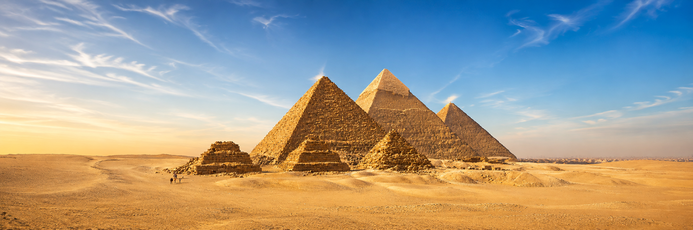

**Master and delivery:** `docs/research/generated/pyramids/giza-hero-wide-master.png`, 2174×723 (3.007:1), SHA-256 `83ca2d2aa4849798af76251236629a4dbdffe02cc4889a4e011565126830f569`. Full-resolution runtime source: `public/images/places/giza-hero-wide.jpg`, JPEG quality 95, 4:4:4, no resizing, 677,258 bytes; SHA-256 `2b39fe19965215337b758a7c66116b864b45de0d5696a8bbb45243f2387fb98a`. The prior 3:2 master remains for provenance, not as the active hero. The stable media ID is unchanged.

**Comparison verdict:** Codex: accepted for revised preview. The three large pyramids, three small ruined pyramids, relative overlap order, weathered forms, and remaining pale casing remain recognizable from the reference. Lateral sand/sky framing is wider; the architecture is not stretched. Fine modeled stonework and smooth sky replace coarse paint texture. Sky treatment and widened edges are artistic, not new archaeological evidence. No hidden structures or ancient building scene are introduced. The native 2174px width also replaces the previous 1440px delivery ceiling. Preflight confirms passing 480px and 960px lossless WebP plus 2174px exact JPEG passthrough; the 1600px intermediate is omitted because it cannot meet both existing ql-v1 fidelity and byte limits. No quality threshold is weakened. Final aesthetic approval remains with Carlin through the updated preview.

**Revised verification:** Content validation and 35 focused content/media/completion tests pass. `media:verify` passes for 35 assets / 77 derivatives. Manifest comparison confirms that only the hero record changed. Preview deployment `dpl_2SAjceB9T6nyG518zTMKuecE5DGr` is READY at commit `12221a3`. At 1440×1000 and 390×1000, the new fallback loads at its full natural 2174×723 resolution; all three large pyramids remain visible, the caption remains readable, and there is no horizontal overflow or browser error. Desktop rendering is 980×344; mobile rendering is 362×203. The preview browser was closed. No production page was opened. [Updated lesson preview](https://chronos-learning-git-codex-ash-99-egypt-hero-dev-vibes-projects.vercel.app/audit?on&next=%2Flearn%2Flesson.egypt.pyramids-and-state-labor). Storage upload and merge remain pending Carlin's aesthetic approval.

**Publication approval and cutover (September 4, 2026):** Carlin approved this wider final with “perfectr. please finish” and confirmed “please continue and publish.” The current candidate above is now the approved final. Uploaded its one private runtime source and three public responsive derivatives through the canonical publisher; a separate verify-only run downloaded all four objects and confirmed their manifest checksums. No existing object was overwritten. Fixed the publisher's handling of SDK-wrapped `NoSuchKey` download responses so an explicitly missing object can be uploaded; permissions, malformed responses, and server errors still fail closed. All 39 focused content/media/completion tests pass, including four regression cases for that error handling. No completion migration or lesson-status change is necessary for this already-published lesson's additive hero. PR #38 carries the approved correction to main; production browsing remains excluded at Carlin's request. Deployment outcome will be recorded on the PR and ASH-99.

#### First 3:2 painting — superseded revision history

**Reasoning and source basis:** Carlin requested the missing hero after publication: “Make a cool compelling fun one!” This bounded visual correction adds atmosphere and a sense of scale, not a new claim, construction phase, builder attribution, or teaching task. A source-grounded painted view invites learners into the existing four-case investigation. [Harvard Digital Giza](https://giza.fas.harvard.edu/) and [UNESCO's site description](https://whc.unesco.org/en/list/86/) cross-check the monument setting. These are factual references only; their images are not copied. Existing lesson claims, seven required sections, two prompts, and no-card completion are unchanged.

**Reference image actually used:** Ricardo Liberato, *All Gizah Pyramids*, photographed June 19, 2006; Commons version with Ikiwaner's dust-removal/white-balance edits. [Canonical file and license evidence](https://commons.wikimedia.org/wiki/File:All_Gizah_Pyramids.jpg), [CC BY-SA 2.0](https://creativecommons.org/licenses/by-sa/2.0/), accessed September 3, 2026. Wikimedia's license review confirms the original grant; its later withdrawal from Flickr does not revoke it. Research copy: `docs/research/references/pyramids/giza-panorama-liberato-reference.jpg`, 1280×851, SHA-256 `519c8fed96a0c79c925af147c96161aa5eec3d81bdacb1e14159f453c0defdf6`.

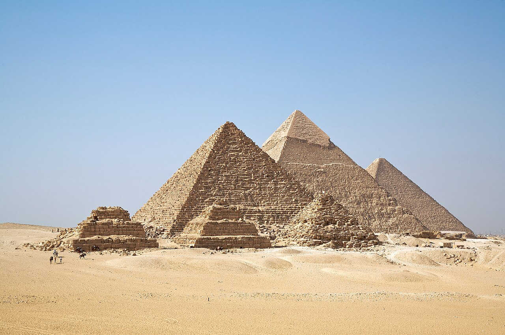

**Generation:** Style-only transformation using the built-in `image_gen` tool, September 3, 2026; model identifier not exposed. Input is the research copy and hash above. Lock the view, relative sizes, overlaps, three large and three small pyramids, surviving casing, low ruins, and tiny visitors. Change painterly rendering, color, and illumination only. This is an illustration of weathered monuments, not a reconstruction of a named ancient period. Complete prompt:

```text
Use case: style-transfer. Asset: cinematic opening hero for Chronos history lesson 'Pyramids, Builders, and Evidence', for curious ages 11–14. Edit the supplied licensed photograph into a spectacular hand-painted editorial adventure illustration. This is a STYLE-ONLY transformation: preserve the exact approximately 3:2 canvas ratio, camera position, horizon, every pyramid's location, size, shape, angle and overlap. Preserve the three large pyramids and the three small ruined pyramids, the distinctive surviving smooth casing near the top of the center rear pyramid, the block courses, low ruins, and tiny existing people/animals at lower left. Keep all of them readable. Do not add, remove, move, enlarge or complete any structure. Make the surface rendering lush and painterly with confidently shaped brushwork, warm luminous honey-gold limestone, burnt sienna accents, deep mineral-blue shadows and a rich blue atmospheric sky. Strong warm directional illumination consistent with the original left-lit faces, glowing edges, atmospheric depth and tactile stone. The mood is awe, curiosity, warmth, and the thrill of encountering something enormous and ancient, with the polish of a wonderful illustrated adventure-book cover but no fantasy additions. Not a sepia photograph or a flat vector poster: beautiful painted material, bold clear silhouette hierarchy and richly modeled forms. The present-day weathered state remains intact; this does not reconstruct a particular ancient building period. Keep foreground sand and tiny visitors so the monuments feel immense. No added people, camels, props, birds, clouds hiding monuments, underground cutaways, invented chambers, machinery, supernatural light beams, invented hieroglyphs, gold caps, new monuments or lush vegetation. No text, title, label, logo, border, watermark or UI. Render at high resolution.
```

**Accepted final:** `docs/research/generated/pyramids/giza-hero-master.png`, 1537×1023, SHA-256 `0e1137069ea4ef1bddabb24956fd200b8a9f6b58a334b73b70a30e51b9f8e336`. Runtime JPEG: `public/images/places/giza-hero.jpg`, 1440×958, quality 92, 4:4:4, SHA-256 `ff8a37e75a4a7a909323ce53fbe02ae162001fb7bd823adedfc316572359bdaf`. Resizing/compression is delivery preparation only; the generation master is unchanged. Attribution: “Illustration adapted from Ricardo Liberato, CC BY-SA 2.0; painterly rendering by Chronos; changes made.” The adapted image is distributed under CC BY-SA 2.0. No endorsement implied.

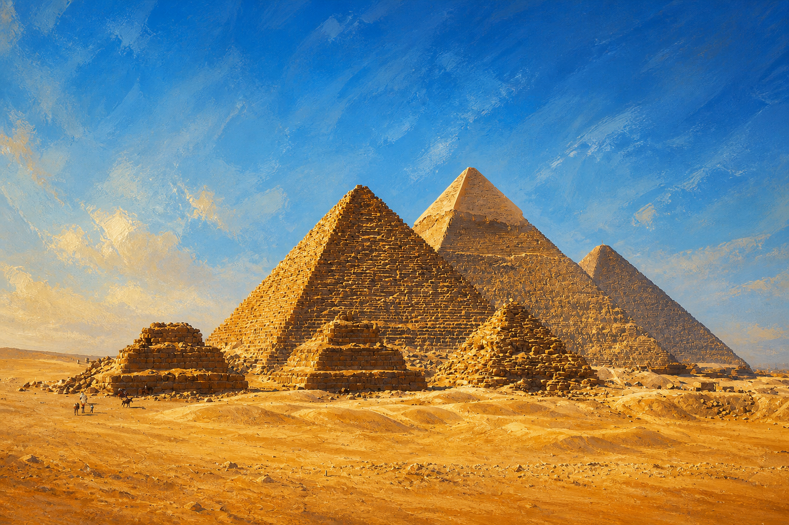

**Comparison verdict:** Codex visual/provenance review, September 3, 2026: accepted for preview. The three large monuments retain their relative silhouettes, overlaps, and casing distinction; the three small ruined pyramids and tiny visitors remain. No ancient construction scene, invented inscriptions, hidden structures, or supernatural details were introduced. The roughly 3:2 aspect ratio is retained within generation rounding. Golden color, blue shadows, and visible brushwork intentionally distinguish the artwork from photographic evidence. No rejected candidates. Product-owner aesthetic review occurs through the branch preview; do not claim the new hero is live before merge. Production browsing remains excluded at Carlin's request.

**Delivery decision:** The textured painting's 960px intermediate candidate could not satisfy both ql-v1 fidelity and byte limits. Keep the passing 480px mobile derivative and the 1440px full-size JPEG source passthrough instead; do not weaken quality thresholds or change the accepted artwork. The full-size source is 675,526 bytes. The existing hero renderer supplies eager loading, responsive selection, and a committed repository fallback. No database or completion migration is needed for this additive visual correction.

**Validation:** Content validation and 34 focused content/media/completion tests pass. The image build succeeds with 35 assets; the manifest comparison confirms that only the new hero entry is added and every pre-existing asset record is unchanged. The 480px derivative is pixel-exact WebP (230,866 bytes); the 1440px fallback is the exact runtime JPEG (675,526 bytes).

`media:verify` passes: 35 assets / 76 derivatives. Hosted preview header checked at 1440×1000 and 390×1000: all three large pyramid silhouettes remain visible; the hero loads from its repository fallback; mobile document width equals the viewport; the illustration label and caption are readable in light and dark treatments; no browser errors were reported. Only the preview was opened, and its temporary browser was closed. [Hero preview](https://chronos-learning-git-codex-ash-99-egypt-hero-dev-vibes-projects.vercel.app/audit?on&next=%2Flearn%2Flesson.egypt.pyramids-and-state-labor) · [PR #38](https://github.com/dev-vibe/chronos-learning/pull/38). Public Storage upload and merge remain pending Carlin's aesthetic approval; the existing published lesson is unchanged on main.

Product-owner approval on 3 September 2026 authorized the four adapted evidence relationships below. The accepted rasters contain no learner-facing prose; dates, labels, and uncertainty explanations remain native, accessible lesson text.

### `media.pyramids.giza-evidence-chain` — four clues do four different jobs

#### 1. Reasoning and source basis

**Reasoning.** The learner must see why a dated record, surrounding archaeological context, dated material, and a newly detected space can converge without becoming interchangeable. The adapted four-station relationship was explicitly approved; the 1785 section is an archival spatial anchor, not a modern survey.

| Field | Record |
| --- | --- |
| Rights decision | **approved** |
| Primary raster reference | [E. Giraud, *Plan intérieur de la grande Pyramide* (1785)](https://commons.wikimedia.org/wiki/File:Plan_int%C3%A9rieur_de_la_grande_Pyramide.jpg), Public Domain Mark 1.0; 1,200 × 864; accessed 2026-09-03 |
| Reference path / SHA-256 | `docs/research/references/pyramids-builders-evidence/great-pyramid-interior-plan-1785.jpg` · `c5c8662d25068f88e211323bdfc3fe00ac4457b621851c073b263a4b6e9bfa4b` |
| Factual cross-checks | IFAO Merer publication; Harvard Digital Giza; AERA settlement record; monument radiocarbon series; ScanPyramids corridor paper |
| Tool / date | OpenAI image generation, reference-image edit workflow / 2026-09-03 |
| Accepted master / SHA-256 | `docs/research/generated/pyramids-builders-evidence/giza-evidence-chain-master.png` · 1,536 × 1,024 · `accff599cd7fd0478b6b1bb2b04e7207d5c96ccb966c8b7ca615eb352dea82d7` |
| Runtime publication master / SHA-256 | `public/images/evidence/pyramids-giza-evidence-chain.jpg` · q94 4:4:4 JPEG export, visually matched to the accepted master · `b57c622218498405e6fa522064a58c5be69096d541d4dfff7ac86d7328cb4881` |
| Redistribution | Chronos original raster edit; public-domain primary reference; generated master approved for Chronos publication |

#### 2. Reference image actually used

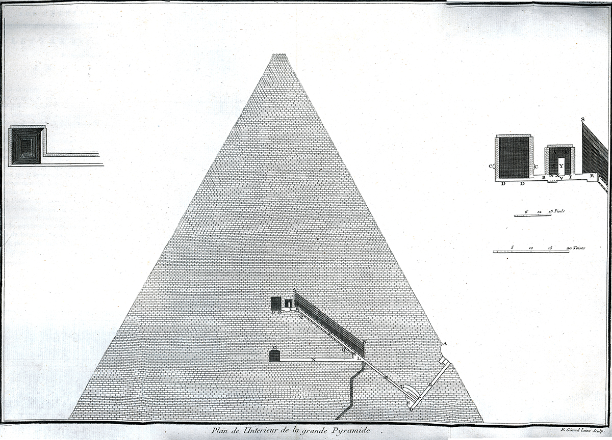

#### 3. Generation or transformation

**Complete prompt chain (verbatim)**

```text
Create a polished 3:2 landscape educational evidence diagram for a history lesson, using the supplied 1785 public-domain Great Pyramid section as the factual monument anchor and the supplied Chronos comparison graphic only as a visual-grammar reference for clear separated evidence stations. Adapted composition explicitly approved. Preserve the Great Pyramid’s recognizable triangular section and passage/chamber relationship without pretending the old plan is a modern survey. Arrange four visually distinct but connected evidence stations around or across the monument: (1) a small ancient papyrus log fragment and a river boat carrying pale limestone, representing a dated administrative record and transport activity; (2) an archaeological landscape strip with causeway, work buildings, food storage, and stone-working traces, representing surrounding context; (3) a mortar/charcoal sample beside a restrained radiocarbon curve or ring motif, representing a dated material whose age may precede placement; (4) a subtle empty corridor-like space revealed by translucent muon paths through the pyramid, representing a newly detected space of unknown function. Make it obvious that these are four different kinds of clues, not one continuous construction scene: use separate softly bounded panels or islands with thin connecting lines, generous whitespace, and distinct color accents. No written words, letters, dates, numbers, hieroglyphic claims, captions, title, legend, UI, borders, logos, or watermark. Do not depict aliens, electricity, machinery, secret treasure, bodies, or a completed theory of purpose. The unknown corridor must remain visually understated, not glowing or sensational. Style: warm mineral palette, refined museum-editorial illustration, tactile archival paper and stone textures, crisp enough for mobile, calm and evidence-led, not photorealistic spectacle.

Edit the supplied Giza evidence diagram, preserving its 3:2 canvas, four-panel arrangement, central pyramid section, connecting lines, warm mineral palette, and all evidence relationships. Make exactly these corrections: replace every invented hieroglyph-like figure or pseudo-writing on the upper-left papyrus with non-semantic abstract horizontal ink strokes and simple tally marks that cannot be read as Egyptian signs, letters, names, or a facsimile; remove any other legible or pseudo-legible writing anywhere in the image. Keep the papyrus visibly ancient and fragmentary. Maintain the boat-and-limestone scene, archaeological context panel, mortar/charcoal sample, and understated muon-revealed corridor. Do not add titles, labels, dates, numbers, captions, UI, logos, watermark, aliens, machinery, treasure, or a claim about purpose. Keep the old section drawing visibly archival, not a modern survey.
```

#### 4. Accepted final image

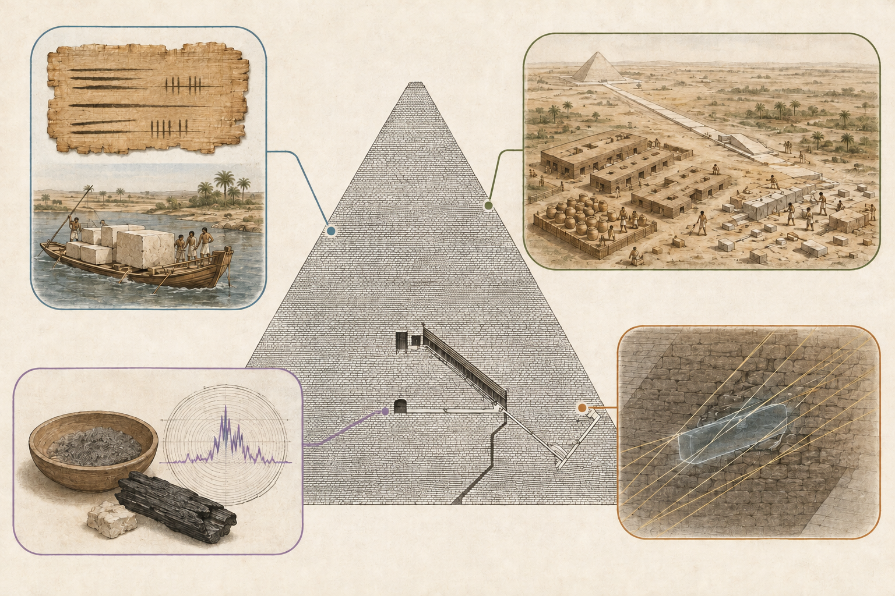

**Reviewer/date/status:** Codex / 2026-09-03 / approved. **Rejected draft:** `exec-4fbb2d27-f32f-445e-bcc0-b50e57b322e4.png` was rejected because its papyrus contained invented pseudo-hieroglyphs. **Preserved relationship / fidelity verdict:** pass after correction. The accepted version retains all four approved clue types and the archival section relationship, removes pseudo-writing, keeps the new corridor visually modest, and does not imply that one clue dates or explains every phase.

### `media.pyramids.osirion-evidence-pair` — protected Seti connection and discordant surface estimates

#### 1. Reasoning and source basis

**Reasoning.** A current photograph establishes the surviving place. The adapted lower comparison makes the protected connector and two broad, discordant surface estimates legible without copying the still-protected 1934 excavation plate or assigning one birthday to the whole monument.

| Field | Record |
| --- | --- |
| Rights decision | **approved** under CC BY-SA 2.0; attribution and share-alike retained |
| Primary raster reference | [Panegyrics of Granovetter, *the Osireion at Abydos* (2020)](https://commons.wikimedia.org/wiki/File:26869-_the_Osireion_at_Abydos.jpg), CC BY-SA 2.0; 7,453 × 5,253; accessed 2026-09-03 |
| Reference path / SHA-256 | `docs/research/references/pyramids-builders-evidence/osirion-modern-photo.jpg` · `37e8ae33d5cd956766e6eb94a3523c32a75b1136b220886d0a289cbf028245a7` |
| Factual cross-checks | Frankfort, *The Cenotaph of Seti I at Abydos*, Plate VIII and excavation text (fact/reference-only; plate not redistributed); Liritzis and Vafiadou surface-luminescence paper |
| Tool / date | OpenAI image generation, reference-image edit workflow / 2026-09-03 |
| Accepted master / SHA-256 | `docs/research/generated/pyramids-builders-evidence/osirion-evidence-pair-master.png` · 1,536 × 1,024 · `0ac00dee4dd0ed68fa2660957df94fda562bc2f1468b677acfdad86b206377d8` |
| Runtime publication master / SHA-256 | `public/images/evidence/pyramids-osirion-evidence-pair.jpg` · q94 4:4:4 JPEG export, visually matched to the accepted master · `4d6292912c824a11d2b9b2d5cf47be0446a444dc72b4b2b2ed3b9a0f5adeb446` |
| Required attribution | “Adapted from a photograph by Panegyrics of Granovetter, CC BY-SA 2.0; changes made. Chronos evidence diagram, also CC BY-SA 2.0.” |

#### 2. Reference image actually used

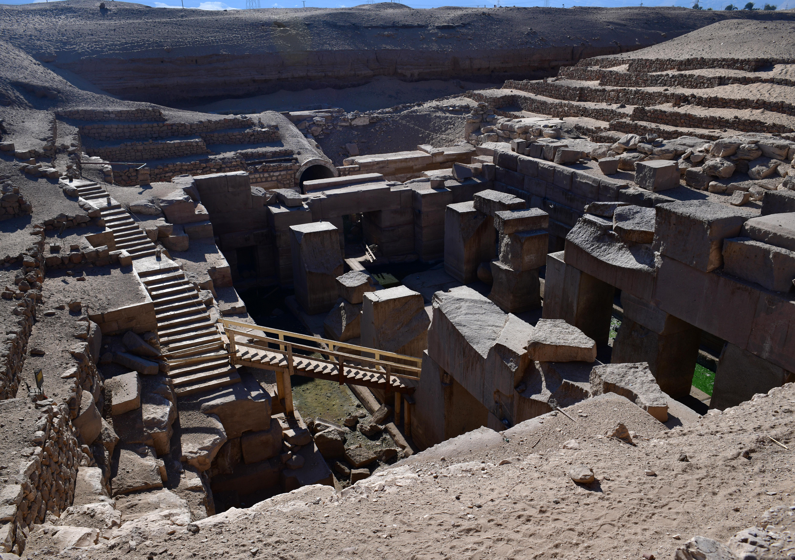

#### 3. Generation or transformation

**Complete prompt chain (verbatim)**

```text
Create a polished 3:2 landscape educational evidence diagram for a history lesson about the Osirion at Abydos. Use the supplied CC BY-SA modern Osirion photograph as the exact architectural and material anchor; keep the sunken rectangular complex, central massive granite uprights and lintels, surrounding stonework, water/shadowed low level, and desert setting recognizable. Use the supplied Chronos diagram only as visual grammar for separated comparisons. Adapted composition explicitly approved. Compose three calm evidence stations: a large primary view of the surviving Osirion; a close technical cutaway showing a plain butterfly/dovetail-shaped granite connector seated across the joint between two masonry blocks beneath intact covering stones, with one small shallow royal-name cartouche-shaped depression but absolutely no invented hieroglyphs or legible signs; and two adjacent stone-surface sampling vignettes, one sandstone and one granite, each with a restrained luminescence glow fading into two visibly different broad timeline bands. The bands must communicate broad, uncertain, discordant estimates without dates, numbers, words, or a single exact point. Make the connector’s protected structural context clear and make the two samples visibly too limited to date the entire complex. No title, caption, labels, dates, numbers, letters, hieroglyphs, pseudo-writing, UI, logos, watermark, treasure, bodies, modern machinery, or reconstruction of an original complete monument. Style: warm mineral palette, tactile museum-editorial illustration, archival linework layered with realistic stone texture, crisp at mobile size, generous whitespace, evidence-led rather than mysterious or sensational.

Edit the supplied Osirion evidence diagram while preserving its exact 3:2 arrangement, recognizable modern site view, bottom-left protected dovetail connector cutaway, stone textures, warm museum-editorial style, and absence of words. Change only the two bottom-right sampling comparisons so they become legible at mobile size: place both results on the same quiet horizontal visual baseline running left-to-right from earlier to later, with no arrowheads and no text. Under the sandstone sample, show a broad translucent amber range clearly centered toward the right/later side. Under the granite sample, show a broad translucent blue-gray range clearly centered far toward the left/earlier side. Give each range soft feathered ends to communicate uncertainty, and keep them separated enough that the discordance is immediately visible. Do not add numbers, dates, labels, letters, glyphs, captions, title, legend, UI, logos, watermark, treasure, bodies, machinery, or a whole-monument construction date. Remove the ambiguous duplicate mountain-like bands currently beneath the samples.

Edit the supplied Osirion evidence diagram, preserving the entire top site view and bottom-left protected dovetail connector cutaway exactly. Redesign only the bottom-right half as one unified rounded evidence panel rather than two isolated panels. Across the top of that unified panel, place the sandstone sample on the left and granite sample on the right. Across the full width below both samples, draw one single thin neutral horizontal timeline baseline with no arrowhead. On that shared baseline, place a broad soft blue-gray uncertainty band clearly on the far left/earlier end and a broad soft amber uncertainty band clearly on the far right/later end, leaving visible empty distance between their centers while allowing slight overlap of feathered tails if needed. Connect the granite sample to the blue-gray earlier band with a thin line and the sandstone sample to the amber later band with a thin line. This must be immediately legible at mobile size as two broad discordant ranges on the same scale, not two decorative shadows. Do not add words, numbers, dates, labels, letters, glyphs, title, caption, legend, UI, logos, or watermark. Do not imply either band dates the whole monument.

Make one precise factual edit to the supplied Osirion evidence diagram. Preserve the top site image, bottom-left connector cutaway, unified bottom-right panel, shared timeline, bands, lines, colors, proportions, and all styling exactly. In the bottom-right panel only, swap the two stone sample images so the coarse blue-gray granite sample is on the LEFT directly above and connected to the blue-gray earlier range, while the warm tan sandstone sample is on the RIGHT directly above and connected to the amber later range. Do not change anything else. No words, labels, numbers, dates, letters, glyphs, title, caption, UI, logo, or watermark.

Edit the first supplied Osirion evidence diagram, using the second supplied modern photograph as the factual surface and masonry reference. Preserve the exact 3:2 landscape layout: large Osirion view across the top; lower-left protected structural-joint inset; lower-right two material sample panels connected to one shared horizontal earlier-to-later visual scale, with granite blue-gray and sandstone amber. CRITICAL CORRECTIONS: remove every invented incised mark, decorative carving, glyph-like mark, pseudo-hieroglyph, pseudo-writing, scratched symbol, and ornamental texture from every stone in every panel. The Osirion's large masonry must read as plain, undecorated, weathered stone like the photograph, with only natural joints, chips, grain, and mineral variation. In the lower-left inset, clearly depict a horizontal masonry joint viewed from above/obliquely: two adjacent granite blocks meet at a vertical seam; a small dovetail/bow-tie-shaped granite cramp is seated horizontally in a matching shallow socket spanning across that seam; one plain covering/roofing block is lifted slightly in cutaway so the protected connector beneath it can be seen. The cramp must not look like a vertical column, support, lintel, doorway, or freestanding object. No royal-name glyphs or writing are shown; the native lesson text explains that documentary fact. Keep all stones plain. In the lower-right, retain realistic close textures of blue-gray granite and warm sandstone and their broad fuzzy ranges on the same scale, without numbers, ticks, letters, dates, legends, labels, UI, logos, watermark, or any text. Do not imply that two samples date the whole monument. Maintain refined museum-editorial realism, warm archival paper framing, strong mobile readability, restrained lines, and generous whitespace.

Correct this Osirion evidence diagram without changing the 3:2 panel layout or the shared blue-to-amber range graphic. The supplied photograph is authoritative for how the masonry surfaces look. REMOVE the remaining repeated curls, swirls, circles, etched-looking scratches, decorative speckles, glyph-like motifs, pseudo-inscriptions, and patterned texture from every stone in the top scene and lower-left inset. This is not normal weathering: replace it with visually quiet, PLAIN undecorated granite and sandstone surfaces—broad flat mineral grain, subtle tonal variation, occasional natural chip or straight joint only—matching the supplied photograph. Do not retain even faint decorative-looking patterns. Simplify the lower-left joint diagram into an unmistakable archaeological cutaway viewed from above at about 45 degrees: two large plain rectangular granite blocks lie side by side, their straight seam running vertically through the panel. A small flat bow-tie/dovetail connector lies HORIZONTALLY in a shallow bow-tie-shaped recess carved across the top surfaces of both blocks, crossing the seam like an inlaid clamp. It must be flush with the top surface, not suspended between blocks, not vertical, not a lintel, column, doorway, or support. Show one separate plain covering slab lifted above and slightly behind the joint so the normally hidden connector is exposed. Keep strong whitespace and thin neutral leader lines. No text, numbers, dates, ticks, letters, hieroglyphs, pseudo-writing, icons, logo, or watermark. Retain the two realistic material sample windows and broad fuzzy ranges, with blue-gray granite earlier on the left and amber sandstone later on the right, without implying a whole-monument date.

Create a clean 3:2 landscape museum evidence graphic about the Osirion, anchored strictly to the supplied modern photograph. Use a mostly photographic editorial treatment, not etched illustration. Top 58%: a faithful cropped view of the Osirion's sunken masonry from the supplied photograph. Preserve the plain undecorated stone blocks, water, stairs, excavation walls, and subdued desert colors. Do not add, invent, or stylize any carvings, scratches, symbols, reliefs, hieroglyphs, pseudo-writing, ornamental patterns, or decorative surface marks. Stone surfaces should remain visually quiet and photographic, with only broad natural grain, normal weathering, straight joints, and occasional chips visible in the reference.
Bottom left 42%: a simple realistic archaeological cutaway diagram on plain warm paper, viewed from above at 45 degrees. Show exactly two large rectangular plain granite blocks lying side-by-side with one straight seam. A small flat bow-tie/dovetail-shaped granite connector is seated flush inside a matching shallow recess that crosses the seam on the blocks' TOP surfaces. Behind them, show one separate plain rectangular covering slab lifted slightly upward so it is obvious the connector was normally hidden beneath covering masonry. The connector must be horizontal and inlaid, never a column, support, lintel, doorway, hole, or freestanding object. Keep every surface plain and undecorated.
Bottom right 42%: two realistic material sample windows, left blue-gray granite and right warm sandstone, each connected by one thin straight leader to a single shared horizontal scale below. On that scale show one broad fuzzy blue-gray range toward the earlier/left side and one broad fuzzy amber range toward the later/right side, with generous overlap/uncertainty softness and no false precision.
Use thin neutral divider lines and generous whitespace. No words, labels, title, caption, numbers, dates, tick marks, letters, hieroglyphs, pseudo-writing, symbols, UI, logo, or watermark anywhere. Mobile-readable, restrained, evidence-led, and realistic rather than dramatic. The image must separate: surviving site, protected construction joint, two sampled materials, and broad ranges; it must not imply that two samples date the whole monument.
```

#### 4. Accepted final image

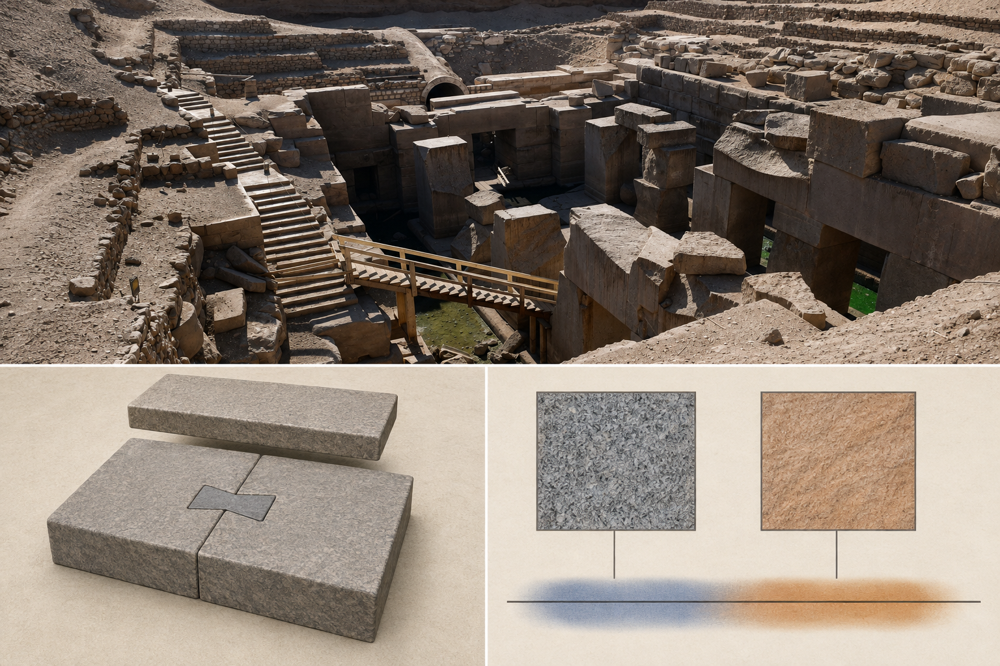

**Reviewer/date/status:** Codex / 2026-09-03 / approved after independent proxy correction; accountable product-owner review pending. **Rejected drafts:** `exec-cbfdd3ad-4228-4e65-8845-b4df7f6ad640.png` made the two estimates too visually similar; `exec-08fec54a-33fb-4469-a4de-79a60d27bf1e.png` separated colors but not one common scale; `exec-de23c34b-2d26-4bf9-8e3c-38b10fc478c4.png` reversed sample/range correspondence; the replaced `413e976b...` master and `exec-15b496db-e063-4016-b955-e4482c65a7fc.png` introduced invented decorative surface marks and made the protected connector ambiguous; `exec-40d0cf39-6f60-43f8-b133-3275b774f51c.png` clarified the connector but retained patterned stone surfaces. **Preserved relationship / fidelity verdict:** pass after correction. The accepted version uses a faithful photographic site treatment with plain undecorated masonry, shows a small horizontal dovetail connector seated across the top joint beneath a lifted covering slab, makes the granite range earlier and sandstone range later on one shared scale, and leaves exact dates and caveats in native text.

### `media.pyramids.hawara-evidence-streams` — four source roles at one site

#### 1. Reasoning and source basis

**Reasoning.** The approved relationship must stop testimony, royal-name context, geophysical anomaly, and excavation from masquerading as the same kind of proof. The plan anchors the site, while the anomaly remains fuzzy and the excavation remains an open test.

| Field | Record |
| --- | --- |
| Rights decision | **approved** under the creator-offered CC BY 2.5 option |
| Primary raster reference | [Franck Monnier, *Hawara-plan-complexe* (2007), after Petrie](https://commons.wikimedia.org/wiki/File:Hawara-plan-complexe.jpg), CC BY 2.5; 1,240 × 697; accessed 2026-09-03 |
| Reference path / SHA-256 | `docs/research/references/pyramids-builders-evidence/hawara-complex-plan.jpg` · `742209e83d864c68332252e8d78e8b8b6f88d2511173e67cead984ec5b76fea9` |
| Factual cross-checks | Petrie excavation report; Pliny 36.84–89; 2010 VLF study; 2024 ERT/TEM report; 2026 excavation-status report |
| Tool / date | OpenAI image generation, reference-image edit workflow / 2026-09-03 |
| Accepted master / SHA-256 | `docs/research/generated/pyramids-builders-evidence/hawara-evidence-streams-master.png` · 1,536 × 1,024 · `ed0d2ac944344ce609ac014ab7f9a95426c80be238fc4f3f2427e1e88f55825a` |
| Runtime publication master / SHA-256 | `public/images/evidence/pyramids-hawara-evidence-streams.jpg` · q94 4:4:4 JPEG export, visually matched to the accepted master · `09144f89f5e0397ade1ea40ff1fb3ace4e64bce8c6f571ad397c7a7f83f97ded` |
| Required attribution | “Plan reference by Franck Monnier after Petrie, CC BY 2.5; changes made. Chronos original evidence diagram.” |

#### 2. Reference image actually used

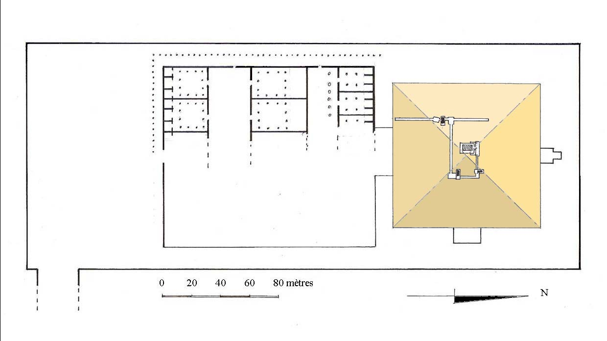

#### 3. Generation or transformation

**Complete prompt (verbatim)**

```text
Create a polished 3:2 landscape educational evidence-stream diagram for a history lesson about the Labyrinth at Hawara. Use the supplied CC-licensed Franck Monnier plan as the exact spatial anchor: preserve the pyramid on the right and the large rectilinear mortuary/labyrinth area extending to its left, while clearly treating the plan as one reconstruction based on excavated remains rather than a complete surviving building. Use the supplied Chronos comparison image only as visual grammar for four distinct evidence stations. Adapted composition explicitly approved. Center the simplified site plan on calm archival paper. Around it, arrange four separate, equally weighted evidence vignettes connected by thin lines: (1) an aged Greek/Roman manuscript scroll with only blank or non-semantic ink strokes, representing ancient testimony and conflicting memories; (2) a broken architectural stone fragment with a framed but unreadable royal cartouche-shaped mark, representing excavated Middle Kingdom royal-name context; (3) a shallow earth cross-section with soft irregular geophysical color bands and dotted survey traces, representing organized subsurface anomalies that are possible architecture but not confirmed rooms; (4) a present-day archaeological trench with string grid, hand tools, and exposed crossing wall edges, representing excavation that can test sequence and date. Make the four sources visibly different in what they can show. Do not turn the anomalies into crisp chambers, underground fantasy architecture, or a complete hidden labyrinth. No words, letters, numbers, dates, readable Greek, readable hieroglyphs, pseudo-writing, title, caption, legend, UI, logos, or watermark. No treasure, tunnels, bodies, robots, or sensational glow. Style: warm desert and mineral palette with muted blue survey accents, refined museum-editorial illustration, tactile archival textures, crisp at mobile size, generous whitespace, calm and evidence-led.
```

#### 4. Accepted final image

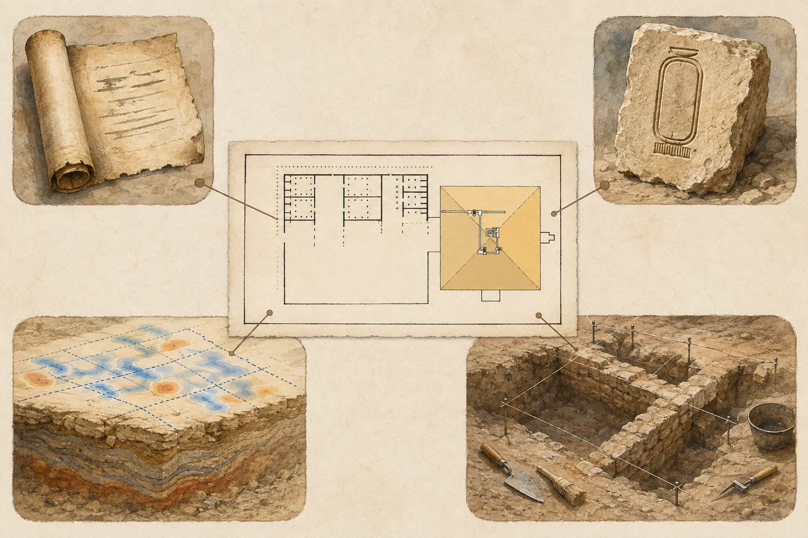

**Reviewer/date/status:** Codex / 2026-09-03 / approved. **Rejected drafts:** none. **Preserved relationship / fidelity verdict:** pass. The accepted composition retains the reference plan’s pyramid-right/site-left relationship, makes the four source roles visually distinct, and renders the survey output as irregular probability-like patches rather than confirmed architecture.

### `media.pyramids.vessel-evidence-test` — object, measurement, and process stay separate

#### 1. Reasoning and source basis

**Reasoning.** The approved visual must honor real early vessel forms while preventing a precise mesh from manufacturing a find history or one tool hypothesis from becoming a demonstrated recipe. The generated featured object is an evidence-based representation, not a facsimile or scan of one catalogued vessel.

| Field | Record |
| --- | --- |
| Rights decision | **approved** |
| Primary raster reference | [Gary Todd, *Ancient Egypt Predynastic Stone Vessels* (Louvre, 2016)](https://commons.wikimedia.org/wiki/File:Ancient_Egypt_Predynastic_Stone_Vessels_(27732541153).jpg), CC0 1.0; 5,184 × 3,456; accessed 2026-09-03 |
| Reference path / SHA-256 | `docs/research/references/pyramids-builders-evidence/predynastic-stone-vessels-louvre.jpg` · `c9e3ee6fc2658221ca47052c789c0227b2e953c34b7bd7431dd55afce81cc8c5` |
| Factual cross-checks | Petrie Museum 19-object metrology study; Abu Rawash excavated-production study; public private-scan claim files used only to define the provenance/replication limit |
| Tool / date | OpenAI image generation, reference-image edit workflow / 2026-09-03 |
| Accepted master / SHA-256 | `docs/research/generated/pyramids-builders-evidence/vessel-evidence-test-master.png` · 1,536 × 1,024 · `a3f1f3e27bdd17de09d842869e43ec32360de2c2533d73a9c68aff5c7e917231` |
| Runtime publication master / SHA-256 | `public/images/evidence/pyramids-vessel-evidence-test.jpg` · q94 4:4:4 JPEG export, visually matched to the accepted master · `c64c063ef0de0d5c4dfee56759ed7f0e5b65232ee88f627b19c3219526ebbbc1` |
| Redistribution | Chronos original raster edit; CC0 primary reference; generated master approved for Chronos publication |

#### 2. Reference image actually used

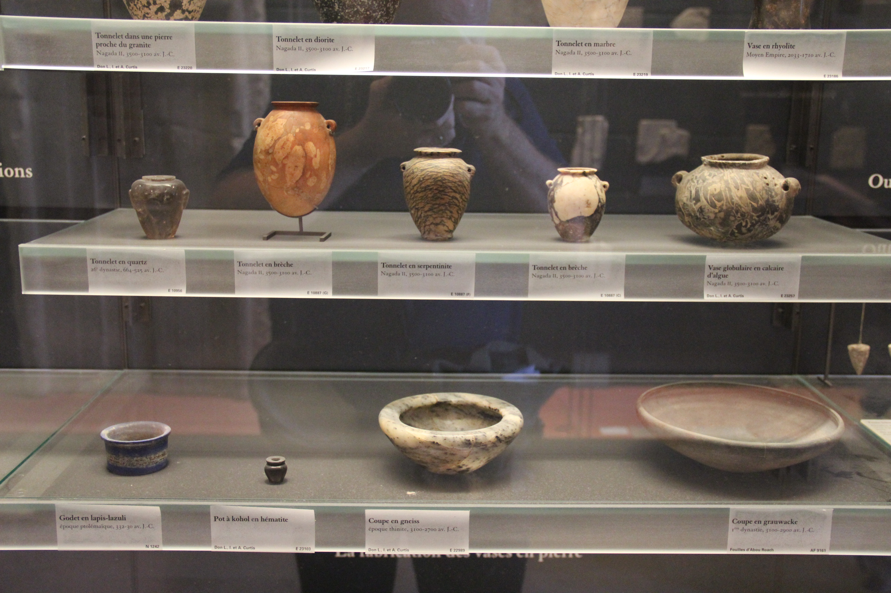

#### 3. Generation or transformation

**Complete prompt chain (verbatim)**

```text
Create a polished 3:2 landscape educational evidence comparison for a history lesson about early Egyptian stone vessels. Use the supplied CC0 Louvre display photograph as the factual object-form and material anchor: preserve the variety of compact Predynastic hard-stone jars and bowls, their rounded bodies, small openings, lug handles, varied minerals, and museum-object scale. Use the supplied Chronos comparison image only as visual grammar for distinct evidence stations. Adapted composition explicitly approved. Arrange three clearly separated stations on warm archival paper: (1) one securely catalogued Predynastic hard-stone vessel presented as a museum evidence object, with a small neutral accession-tag shape left completely blank; (2) a translucent measured surface model of a similar but explicitly generic vessel form, showing fine wireframe rings around the outer and inner walls and a cutaway opening so centered inner and outer surfaces can be compared, without pretending this is a scan of the photographed object; (3) a restrained process-evidence still life with abrasive sand, water bowl, simple stone and copper working tools, a core/drill trace, and a small test piece with wear marks, presented as clues and testable methods rather than one proven manufacturing recipe. Visually separate object provenance, geometric measurement, and process evidence; do not merge them into a single claimed biography. No people operating a lathe, no modern machine tools, no advanced lost technology, no electricity, no impossible thinness, no glowing precision effects. No words, numbers, dates, letters, hieroglyphs, pseudo-writing, title, caption, labels, UI, logos, or watermark. Style: refined museum-editorial illustration with realistic mineral textures, calm warm palette with a muted blue-gray wireframe, crisp enough for mobile, generous whitespace, evidence-led and tactile rather than spectacular.

Edit the supplied three-panel stone-vessel evidence comparison while preserving its exact 3:2 layout, three-part separation, museum display context, generic cutaway wireframe, blank accession tag, process-evidence still life, warm archival palette, and mobile clarity. Correct the left featured vessel so it is a plain, undecorated Predynastic hard-stone jar faithfully based on one of the compact lug-handled dark vessels visible in the supplied CC0 Louvre photograph. Remove all invented figures, markings, scratches that resemble pictures, painted designs, hieroglyphs, and pseudo-writing from the vessel. Keep natural mineral veining only. Make the featured vessel smaller and less spectacular, consistent with the reference objects’ actual museum scale. In the center, keep the wireframe a visibly generic comparison model, not a scan of the left object; simplify its texture so it does not resemble the same stone. On the right, make every implement visibly simple and archaeological/experimental: abrasive sand, water bowl, rounded grinding stone, plain wooden shaft, and a short undecorated copper tube or bit; remove any sharp modern spear-like copper points. Preserve the drilled test-core clue. No words, numbers, dates, letters, hieroglyphs, pseudo-writing, title, caption, labels, UI, logos, or watermark. Do not imply one proven manufacturing recipe or advanced lost machinery.
```

#### 4. Accepted final image

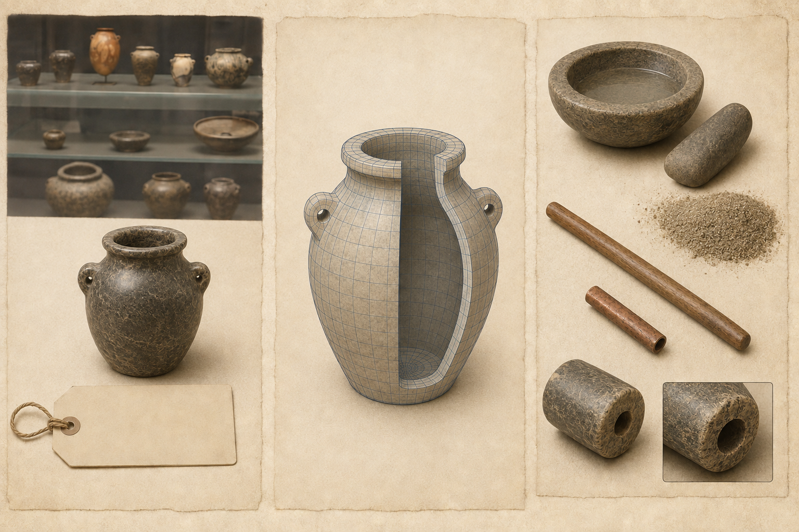

**Reviewer/date/status:** Codex / 2026-09-03 / approved. **Rejected draft:** `exec-869af8cc-06c1-420c-84b5-8b7908a41b1f.png` was rejected for invented figurative decoration and overly modern pointed tools. **Preserved relationship / fidelity verdict:** pass after correction. The accepted version preserves the reference collection’s plain hard-stone forms and scale, distinguishes the generic mesh from the represented museum object, and presents abrasives and simple tools as evidence to test rather than a settled manufacturing history.

## Knowledge Card decision

**Decision:** no card for this prototype.

**Rationale:** the durable memory object is a way of reasoning across several sites, not one person, place, or artifact. A Great Pyramid Masterwork card would over-center the monument and could imply that the lesson settled its builder, date, or purpose. An Enigma card would reward mystery language. The no-card ending keeps completion focused on the learner’s evidence chain. Reconsider only if product review identifies a genuinely durable, representable anchor that does not distort the argument.

## Prompt rationale

| Prompt ID | Required | Understanding/evidence assessed | Misconception exposed | Feedback job |
| --- | --- | --- | --- | --- |
| `prompt.pyramids.context-and-phase` | Yes | Strong Giza context can coexist with open phase/purpose questions | A name or anomaly either proves everything or erases all context | Restate the proportionate claim and its limit |
| `prompt.pyramids.build-evidence-chain` | Yes | Observation → interpretation → discriminating test using an approved comparison case | An impressive datum automatically supplies age, maker, or purpose | Name the missing link and useful test |

The selection check depends only on taught Giza evidence. The concise response requires a sincere attempt rather than historical perfection and is excluded from general analytics under the shared shell contract.

## Learner-prototype review

Prototype lesson ID: `lesson.egypt.pyramids-and-state-labor`
Research-note identity/version: `ash-99-evidence-prototype-v5`
Preview route: `/audit?on&next=%2Flearn%2Flesson.egypt.pyramids-and-state-labor` (enables browser-local audit mode before opening the draft)
Prototype commit: [`e8e23a6`](https://github.com/dev-vibe/chronos-learning/commit/e8e23a6); Draft PR [#29](https://github.com/dev-vibe/chronos-learning/pull/29)
Validation tier: high-risk
Deterministic prototype gate: passed 3 September 2026

### Media intentions

| Intention ID | Section ID | Annotation shown | Review state | Disposition |
| --- | --- | --- | --- | --- |
| `intent.pyramids.giza-chain` | `section.pyramids.giza` | Compare record, context, material date, and newly detected space without collapsing them | ready | Approved final raster registered as `media.pyramids.giza-evidence-chain`; native text remains the fallback |
| `intent.pyramids.osirion-pair` | `section.pyramids.osirion` | Pair the protected Seti component with the two surface estimates | ready | Approved final raster registered as `media.pyramids.osirion-evidence-pair`; native comparison remains complete |
| `intent.pyramids.hawara-streams` | `section.pyramids.hawara` | Keep testimony, inscription, geophysics, and excavation in separate roles | ready | Approved final raster registered as `media.pyramids.hawara-evidence-streams`; anomalies remain visibly distinct from confirmed rooms |
| `intent.pyramids.vessel-test` | `section.pyramids.vessels` | Separate object, mesh, documented find history, and process evidence | ready | Approved final raster registered as `media.pyramids.vessel-evidence-test`; the object, generic mesh, and process clues remain separate evidence roles |

### Real-shell inspection

Reviewer/date: Codex / 2–3 September 2026; final-media follow-up 3 September 2026
Viewports/themes: 1440 × 900 light and dark; 390 × 844 light and dark
Result: pass. The exact draft route rendered seven sections and the four approved final evidence visuals. Every image completed with a nonzero 1536 × 1024 intrinsic size and resolved through the optimized media path. The page had no error overlay, console error, or horizontal page overflow at either viewport; the only console warning was the repository's existing Tailwind CDN development warning. Headings, masthead, long prose, knowledge blocks, media captions and rights lines, prompt controls, and the fixed mobile navigation remained legible in both themes. A selection plus a 132-character response enabled `Complete lesson` while the response remained in the field; scrolling alone did not. The truthful no-card ending and safe World History continuation behavior were already verified in the prototype pass and were unchanged by media integration.

### Proxy review

Reviewer/date: independent Codex adult learner-proxy / 3 September 2026
Raw prototype supplied without intended diagnosis: yes; the reviewer received only the lesson source, prototype media-intention record, and quality contract.

| Quality area | Pass/revise/blocking/N/A | Evidence from prototype | Disposition |
| --- | --- | --- | --- |
| Mental-model coherence | revise → pass | The opening established a strong context/date/phase/builder/use/purpose method, but “Six questions” initially displayed five links and the cross-case role could be clearer. | Made purpose the explicit sixth question and stated that Osirion, Hawara, and vessels are separate tests of the same method. |
| Narrative momentum | pass | Royal-name hook → strong Giza convergence → dating limits → harder building cases → portable objects → learner synthesis forms a coherent investigation. | No structural change required. |
| Age-appropriate cognitive load | revise → pass | Osirion stacked method, two dates, signal reset, and phase implications; Hawara named five writers; vessels stacked metrology jargon. | Split result/method/limit into separate paragraphs; replaced signal jargon; grouped minor Hawara witnesses; replaced concentricity, provenance, slurry, and technical-regime language with plain explanations. |
| Heading voice | pass | Every section heading names the historical subject or teaching job in ordinary words. | Retained. |
| Evidence reasoning | revise → pass | Final observation → suggestion → test prompt was strong, but initial selection distractors used conspicuous absolutes; vessel evidence sets could blur. | Replaced distractors with plausible single-link confusions and explicitly separated excavated vessel evidence from the 19-object museum comparison. |
| Historical proportionality | revise → pass | Overall balance was proportionate, but the masthead could place all cases in the Giza range, “genuinely older result” over-compressed uncertainty, and “remembered” could certify tradition. | Expanded the masthead’s cross-period range; named the older Osirion result as one uncertain estimate; retitled the king-list module to describe the source rather than validate its memory. |
| Visual teaching value | pass for intentions / N/A for final | Each proposed visual has a distinct evidence job and a complete native-text equivalent. | Retained four planned jobs with explicit Hawara and vessel anti-conflation constraints. Final media remains gated. |
| Next-action clarity | pass | Both prompts specify the action and the final prompt offers three bounded cases. Browser verification confirmed sincere attempts unlock explicit completion. | Retained. |

Blocking findings: none. Every proxy revision was resolved before product review, and deterministic validation was rerun successfully.

### Narrative-voice revision

Product-owner feedback/date: Carlin Aylsworth / 3 September 2026
Feedback: the evidence model was directionally right, but the learner experience felt too clerical.
Disposition: returned to Stage 14A. Recast the opening around standing beneath the Great Pyramid; followed Merer’s crew through the Giza landscape; made the Osirion, Hawara, and vessel passages tactile and place-led; changed procedural headings and prompt language into ordinary learner-facing invitations; retained every claim boundary and the six-part reasoning model beneath the narrative.

Fresh independent proxy result: no blockers. Narrative momentum, evidence reasoning, historical proportionality, visual jobs, and next-action clarity passed. The proxy’s bounded revisions were resolved by removing the apparent five-item/six-question mismatch, reducing Hawara’s name-and-date pileup, explaining the Osirion’s stone connector and broad date range in plain language, and replacing the generic `World Check` heading with `Build a case from one clue`.

Real-shell follow-up: pass. The revised draft rendered at the exact lesson route with the new opening, simplified Hawara passage, revised final heading, and audit state visible. No publication state, media, card, or completion rule changed.

### Product/editorial review

Reviewer/date: Carlin Aylsworth / 3 September 2026
State: approved
Approval: “much better! please continue the lesson creation.”
Material decisions: approved the title *Pyramids, Builders, and Evidence*; the essential question and six-link evidence model; Giza plus concise Osirion, Hawara, and vessel scope; the neutral earlier-Nile-regime wording; the explicit no-card decision; and the four planned visual jobs. This authorizes Stage 15 implementation, including adapted visual compositions that preserve the four explicitly reviewed evidence relationships; it is not publication approval.
Blocking findings: none.
Explicit safe deferrals: the Sphinx, construction-function models, builders’ marks authenticity audit, systematic precision-decline analysis, complete Hawara testimonia, and deeper Osirion replication review remain in the Story Arc/Investigation research backlog. No final media, card, publication migration, unlock, review-state approval, or hosted production change occurs before product approval.

### Post-implementation production review

Reviewer/date: independent Codex adult learner-proxy / 3 September 2026
Inputs: implemented learner source, operative production record, prototype review record, four rights-cleared raster references, and four accepted final images.

Result: pass after bounded revisions. Mental-model coherence, narrative momentum, heading voice, evidence reasoning, historical proportionality, prompt clarity, and the Giza visual passed. The first implemented Osirion master was blocked because invented incised patterns contradicted the lesson's undecorated masonry and the protected cramp read ambiguously. It was replaced with a photographic site treatment and a clear horizontal dovetail connector seated across a joint beneath a lifted covering slab; the proxy recheck passed at reduced size. Hawara was simplified from institution names to an antiquities-and-university team, and its depiction now states that the central plan reconstructs excavated remains. The vessel visual copy now distinguishes the represented jar from dates supplied by documented find and collection records. No proxy blockers remain.

Accountable review state: pending. Carlin's prototype approval authorized the four visual teaching jobs but did not inspect these final reference/image pairs or authorize publication. Claims, non-media sources, lesson publication state, migration, and hosted release therefore remain fail-closed.

### Stage 16 verification

Repository checks on 3 September 2026:

- `npm run validate:content` — pass.
- `npm run media:verify` — pass; 33 assets and 71 derivatives verified.
- `npm run lesson:gate -- --lesson lesson.egypt.pyramids-and-state-labor --note docs/research/pyramids-power-and-state-labor.md --gate implementation` — pass.
- `npm run test:domain -- --exclude .worktrees/**` — pass, 22/22 tests.
- `npm test -- --exclude .worktrees/**` — pass, 140/140 tests.
- `npm run build` — pass; only the existing large-chunk advisory remains.
- `npm run typecheck` — repository baseline still reports the pre-existing legacy `NodeContentDisplay` helper, legacy resource-URL, and broad Zod inferred-optionality failures. No diagnostic names the Egypt lesson, its production record, its media catalog entries, or its generated manifests. The passing production build, focused domain/content suite, complete test suite, and lesson gates provide the changed-path evidence; the baseline debt is not reclassified as a lesson failure.

The release gate intentionally remains pending until accountable product-owner review permits source/claim review-state promotion and publication work.

### Optional learner observation

Observed: no
Learner age band/date, if applicable: not applicable
Observed behavior: none
Changes made: none
Future family/public-release UAT note: reserved for the broader family/beta program; not a per-lesson gate.

### Earlier-risk comparison

Confusing prose found earlier: material-date, named-component, and source-role distinctions; resolved through the repeated six-question model and plain-language method definitions.
Weak transitions found earlier: comparison cases could appear to be one monument history; resolved by stating that each independently tests the same method.
Cognitive overload found earlier: Osirion measurement language, five Hawara authors, and vessel metrology jargon; resolved in the proxy polish pass.
Decorative media found earlier: none; every planned job answers a specific source-reasoning question and has a native-text fallback.
Prompt mismatch found earlier: conspicuous absolute distractors; resolved with plausible context-versus-phase confusions.
Unclear action hierarchy found earlier: none; browser verification confirmed prompt and completion behavior.

### Plain-language correction — 3 September 2026

Carlin identified the conclusion's “earlier Nile cultural or technical regime of materially different character and ability” as unsuitable for the intended reading level and requested a lesson-wide pass. The earlier proxy/ages 11–14 review missed this problem; its completion was not evidence that the language was clear enough.

Revised all seven sections, both prompts and feedback, knowledge summaries, and four media captions/labels/alt descriptions. Replaced abstract phrases with concrete actions and objects: “structural assembly” becomes joined blocks, “subsurface anomalies” becomes patterns underground, and “exposure history” becomes how much light reached a stone surface. Explained mortar, radiocarbon dating, muons, and stone vessels at first use. Introduced the people and periods needed to follow the comparisons. Retained the approved earlier-Nile possibility in plain language, without turning it into a demonstrated monument date or builder attribution.

Independent text-only learner-proxy review: Codex `reading_review`, 3 September 2026. Findings resolved: keep private-vessel precision tentative (“appear to show”); add Seti's approximate time anchor; avoid equating Predynastic with “before the first kings”; replace dangling plural labels in the Turin King List summary. This is a qualitative clarity/claim-fidelity review, not a measured reading-grade certification, child observation, or new rendered-layout approval.

Stable lesson/module/prompt IDs, claim/source links, required sections, prompt requirements, media files, no-card decision, and publication/review states are unchanged. This is the Stage 18 correction path, not a new research direction or publication approval. Validation: content validation and implementation gate pass; the full suite passes 140/140 tests; production build passes with the existing large-chunk advisory. No new browser or hosted-content verification is claimed for this text-only correction.

### Publication approval and release preparation — 3 September 2026

Carlin accepted the revised lesson (“this is very perfect”) and explicitly authorized publication (“yes!” in response to taking Egypt through release checks, publication, merge, and production verification). This closes the accountable final lesson/media/publication approval checkpoint. Source and claim records are promoted to reviewed; historical certainty labels are unchanged. The accepted four images and no-card decision remain unchanged.

The release gate passed while the lesson was still a draft with its approved prototype metadata. Publication then removes that metadata from the active registry and sets the canonical lesson to published. The archived prototype record remains available for provenance. Migration `20260903211749_publish_pyramids_builders_evidence.sql` adds only this lesson, its ninth published World History entry, two required prompts, and completion configuration. It was committed as `20260903210905` before application, then renamed to match the version assigned by the hosted migration service; executable SQL is unchanged. Legacy navigation aliases remain semantically unapproved for completion transfer: the new four-case reasoning task is not equivalent to old Imhotep/pyramid work.

Baseline hosted advisors: one warning for the intentionally authenticated security-definer completion RPC; it already checks `auth.uid()`, publication, required attempts, and idempotency, and has no anonymous execution grant. No function, grant, RLS policy, or learner data is changed by this publication migration. Performance notices are unused-index informational findings. See [security-definer advisor guidance](https://supabase.com/docs/guides/database/database-linter?lint=0029_authenticated_security_definer_function_executable) and [unused-index guidance](https://supabase.com/docs/guides/database/database-linter?lint=0005_unused_index). Deployment and hosted behavior verification remain in progress until recorded below.

Release regression results: content validation, 24 focused domain/content/legacy tests, and all 143 repository tests pass. Production build passes with the existing bundle-size advisory. The independent release reviewer found no blocking defect and confirmed that learner text/media/prompt content is unchanged by publication. Added `supabase/tests/012_pyramids_builders_evidence.sql`; all 17 assertions pass against the hosted schema with the migration and test user enclosed in one rolled-back transaction. This covers missing/partial attempts, no-card completion, retry idempotency, unchanged Caral progress, alias safeguards, and blocked Indus completion. No test user or progress is retained. A fresh local empty-database replay was unavailable because the Docker daemon is not running; the migration contains data inserts/updates only, and its exact statements were exercised transactionally against the target schema before application.

### Hosted release verification — 3 September 2026

- Migration applied to Chronos (`fghjnypxhnnutgsaqvvz`) as version `20260903211749`; the committed filename now matches. All 17 database assertions pass again after application, with test work rolled back and no test user retained.
- `npm run media:verify` passes: 34 assets / 74 derivatives. The merge's initial stale-manifest failure was a CRLF/LF comparison, not a changed asset or hash; rebuilding restores the expected bytes without a semantic manifest diff.
- Four approved Egypt images published to Storage: four private source objects and eight public derivatives. All 12 downloaded checksums match the release manifest; no existing object overwritten. The JavaScript uploader failed locally, so the existing hash-checking PowerShell upload approach was used for this explicitly selected set.
- Hosted branch preview inspected at 1440×900 and 390×844 in light/dark themes. Four images load; mobile document width equals viewport width; both prompts enable explicit completion; completion shows “Lesson explored” without a card; revisit starts at `scrollY=0`; the journey drawer closes with Escape and returns focus to World History. No browser errors reported. Screenshots are retained under `tmp/egypt-release-*`.
- Current typecheck still fails only in the documented legacy/component/domain baseline paths, not this release's changed paths. Security advisors are unchanged after application; Vercel runtime-error scan for the prior hour is empty. These checks do not imply configured external monitoring or a fresh empty-database replay.
- PR [#29](https://github.com/dev-vibe/chronos-learning/pull/29) merged as `cb8a1470a7623f4380a218ee7c062f845e0c2548`. Vercel deployment `dpl_Cr54WMzWZKNnBMWmQTBiy73kLkis` reports target `production`, state `READY`, and the same commit, with the production domain assigned. This is deployment-status verification, not a live-site behavior test. Carlin explicitly requested to perform the live-site check himself; no further production browser inspection was performed.
- Final merge regression check: content validation and 69 targeted tests across 10 files pass. Main's dynamic published-lesson-count tests were retained alongside Egypt's dedicated publication/completion tests; no learner content changed.
- [Live lesson](https://chronos-learning.vercel.app/learn/lesson.egypt.pyramids-and-state-labor) · [Approved branch preview](https://chronos-learning-git-codex-ash-99-pyr-4875cc-dev-vibes-projects.vercel.app/audit?on&next=%2Flearn%2Flesson.egypt.pyramids-and-state-labor). The current publication state supersedes the earlier draft/pending statements in this chronological research record.

## Sign-off status

- [x] Recent-challenge research checkpoint considered by product owner before lesson build-out
- [x] Revised source/claim ledger, content triage, blueprint, and storyboard recorded
- [x] Ages 11–14 pass complete
- [x] Independent adult learner-proxy review complete and all findings disposed
- [x] Deterministic prototype gate passes
- [x] Desktop/mobile and light/dark real-shell prototype inspected
- [x] Explicit no-card decision recorded
- [x] Product-owner learner-prototype checkpoint approved
- [x] Final media lifecycle and rights review complete — lifecycle and proxy review pass; product-owner acceptance and publication approval recorded September 3
- [x] Implementation and release gates complete
- [x] Publication migration, immutable media, and hosted preview verified; production deployment READY; live-site walkthrough delegated to Carlin at his request

## Superseded labor-centered prototype record — non-operative archive

Everything below this heading records the earlier labor-centered prototype and its review history. It is retained for provenance only. Its claim ledger, learning blueprint, storyboard, media jobs, Knowledge Card decision, prompts, and prototype sign-off must not guide new learner content unless they are independently reconsidered after the product-owner response above.

## Node proposal

**Essential question:** What did an Old Kingdom state have to organize before thousands of stones could become a pyramid?

**Durable understanding:** Pyramids made royal power visible because building them required a state to coordinate knowledge, transport, supplies, and many kinds of labor; the evidence reveals that system more clearly than it reveals each worker’s choices or the exact construction method.

**Supporting understandings:**

- Pyramids developed through generations of architectural experimentation rather than appearing fully formed.
- A royal pyramid was the center of a funerary complex and a claim about kingship, not an isolated geometric object.
- Merer’s logbook directly records one organized crew moving fine Tura limestone to Khufu’s pyramid project by water.
- Settlement remains, food waste, administrative spaces, and crew marks show a layered, provisioned workforce.
- Evidence rejects both mystery-machine stories and a simple modern free-worker story; exact labor obligations and ramp arrangements remain partly uncertain.

**Evidence encounter:** The Wadi el-Jarf papyri known as the Diary of Merer, read alongside the Heit el-Ghurab settlement and builders’ marks.

**Prerequisites:** The Nile as a transport corridor; early Egyptian state formation; administration and writing as tools for coordinating goods and labor; monumental construction in more than one world region.

**Common misconceptions:** enslaved Israelites built the pyramids; aliens or lost technology were necessary; one genius invented the complete pyramid; all workers were either chattel slaves or freely contracted wage laborers; Merer’s diary explains every construction step; archaeologists know the exact ramp design.

**Scope — dates/places/actors:** c. 2700–2500 BCE; Saqqara, the Memphis region, Tura, and Giza; Djoser, Khufu, named officials such as Merer, organized crews, craftspeople, transport workers, food producers, administrators, and the largely unnamed people whose labor sustained the projects.

**Why this is one lesson:** The architectural development, Merer evidence, workforce settlement, provisioning, labor obligations, and construction limits all answer one question: how monumental building materialized state capacity. A general survey of Old Kingdom religion, all pyramid interiors, later pyramid texts, and biographies of Djoser, Imhotep, Khufu, Khafre, or Menkaure would fracture that model.

**Non-goals/deferred material:** detailed royal succession; every pyramid field; the Sphinx as a separate evidence problem; later Pyramid Texts; treasure, curses, mummies, and tomb robbery; modern exploration history; numerical engineering calculations; fringe construction claims; an Imhotep biography; a complete history of Egyptian slavery.

**Bridge from previous lesson:** Caral showed that monumental building and urban coordination did not follow one global checklist. This lesson returns to the Nile to examine a more centralized royal project and the labor system behind it.

**Bridge to next lesson:** The Indus lesson will ask what archaeology can support when a major urban tradition’s signs remain undeciphered; this lesson rehearses the same discipline by separating direct records, settlement evidence, inference, and unknowns.

## Research questions

- How did royal funerary architecture change between mastabas, Djoser’s Step Pyramid, Sneferu’s experiments, and the Giza complexes?
- What functions did pyramid complexes serve beyond holding a royal burial?
- What does the Diary of Merer directly record, and what common construction questions does it not answer?
- What structures, tools, food remains, sealings, and burials survive from the Giza workforce and support network?
- How were crews named, divided, supervised, supplied, and moved?
- What can responsibly be said about compulsory service, specialist work, status, payment in provisions, and enslavement?
- Which claims about ramps, sledges, waterways, quarrying, levers, and workforce size are secure, plausible, disputed, or unknowable?
- Who benefited from monument building, who bore its demands and dangers, and whose experience is missing from the record?
- Which evidence forms can be shown to ages 11–14 without turning the lesson into engineering trivia or pyramid spectacle?
- Which visual rights are compatible with a directly reviewable reference-to-final lifecycle after product approval?

## Source ledger

| Source ID | Citation/link | Type/authority | Claims supported | Limits/bias | Corroboration | Rights | Review |
| --- | --- | --- | --- | --- | --- | --- | --- |
| `source.pyramids.ifao-merer` | Pierre Tallet, *Les Papyrus de la Mer Rouge I: Le Journal de Merer* ([IFAO publication extract](https://www.ifao.egnet.net/uploads/publications/divers/MIFAO136_ann_01.pdf), 2017), accessed 2026-08-31 | Primary administrative archive in the official excavation publication | `merer-log`, `river-transport`, `records-limited` | Preserves one crew’s log near the end of Khufu’s reign; not a complete building manual; main text is specialist French | AERA 2018 synthesis; Great Pyramid casing geology and official monument record | Research citation; publication photography is not cleared for runtime redistribution | Source read; human editorial review pending |
| `source.pyramids.aera-lost-city` | Ancient Egypt Research Associates, [The Lost City of the Pyramid Builders](https://aeraweb.org/projects/lost-city/), accessed 2026-08-31 | Long-running archaeological project at Heit el-Ghurab | `worker-settlement`, `provisioning-system`, `layered-workforce` | Strongest excavated town phase belongs to Khafre/Menkaure; Khufu occupation is probable/under investigation | Egyptian Ministry site record; AERA field reports | Text cited for research; project images not redistributed without permission | Source read; human editorial review pending |
| `source.pyramids.aera-gangs` | Mark Lehner, “Of Gangs and Graffiti: How Ancient Egyptians Organized Their Labor Force,” *AERAGRAM* 7.1 (2004), [AERA-hosted issue indexed here](https://aeraweb.org/projects/lost-city/), accessed 2026-08-31 | Excavation-project synthesis of builders’ marks and labor organization | `crew-organization`, `workforce-uncertainty` | Interpreting galleries as barracks and mapping units to sleeping capacity remains debated; gang terms do not reveal individual legal status | Reisner records in Digital Giza; Merer’s crew log | Research citation; figures require separate rights review | Article read; human editorial review pending |
| `source.pyramids.aera-food` | AERA, [Feeding Pyramid Workers](https://aeraweb.org/feeding-pyramid-workers/) and [Pyramids and Protein](https://aeraweb.org/pyramids-and-protein/), accessed 2026-08-31 | Archaeobotanical, zooarchaeological, and experimental-archaeology synthesis from the site team | `provisioning-system`, `state-redistribution` | Experimental bread does not reproduce one known recipe; dietary distributions vary by status and part of site | Settlement architecture, storage, bread molds, animal-bone analysis | Research citation; images not cleared for redistribution | Sources read; human editorial review pending |
| `source.pyramids.egypt-workers-town` | Egyptian Ministry of Tourism and Antiquities, [Workers’ Town and Cemetery](https://egymonuments.gov.eg/en/monuments/workers-town-and-cemetery), accessed 2026-08-31 | Official site record | `worker-settlement`, `hard-labor`, `status-differences` | Public synthesis; “good medical care” is a stronger inference than healed injuries alone can prove | AERA settlement and cemetery publications | Research citation; ministry media not redistributed | Source read; human editorial review pending |
| `source.pyramids.egypt-great-pyramid` | Egyptian Ministry of Tourism and Antiquities, [The Great Pyramid](https://egymonuments.gov.eg/en/monuments/the-great-pyramid/), accessed 2026-08-31 | Official monument record | `great-pyramid-scale`, `river-transport`, `construction-uncertain` | Gives broad estimates and a public summary; does not adjudicate every construction hypothesis | Harvard Digital Giza; IFAO Merer archive | Research citation; ministry media not redistributed | Source read; human editorial review pending |
| `source.pyramids.egypt-djoser` | Egyptian Ministry of Tourism and Antiquities, [The Step Pyramid Complex of Djoser](https://egymonuments.gov.eg/en/monuments/the-step-pyramid-complex-of-djoser), accessed 2026-08-31 | Official monument record | `pyramid-development`, `royal-complex` | “First” language depends on definition; Imhotep attribution should not become a lone-genius story | Met Old Kingdom publication; UCL construction overview | Research citation; ministry media not redistributed | Source read; human editorial review pending |
| `source.pyramids.harvard-giza` | Harvard University, [Digital Giza: Introduction to Giza](https://giza.fas.harvard.edu/gizaintro/), accessed 2026-08-31 | University archaeological archive and synthesis | `great-pyramid-scale`, `royal-complex`, `state-capacity` | Introductory page compresses scholarly disputes | Egyptian Ministry records; AERA archaeology | Research citation; individual archive media need item-level rights review | Source read; human editorial review pending |
| `source.pyramids.cambridge-location` | Miroslav Bárta, [“Location of the Old Kingdom Pyramids in Egypt”](https://doi.org/10.1017/S0959774305000090), *Cambridge Archaeological Journal* 15.2 (2005), accessed 2026-08-31 | Peer-reviewed specialist study | `memphis-economy`, `state-redistribution`, `royal-complex` | Abstract/full article access varies; emphasizes macro-location more than workers’ lived experience | Harvard Giza; official site records | Research citation; figures not redistributed | Abstract and relevant record read; human editorial review pending |
| `source.pyramids.ucl-construction` | UCL Digital Egypt, [How a pyramid was built](https://www.ucl.ac.uk/museums-static/digitalegypt/pyramids/how.html) and [Workmen at a pyramid](https://www.ucl.ac.uk/museums-static/digitalegypt/pyramids/workmen.html), accessed 2026-08-31 | University Egyptology reference | `construction-uncertain`, `workforce-uncertainty` | Older web synthesis; workforce estimates are model-dependent and not used as a learner fact | AERA excavation; Ministry monument record | Research citation; figures not redistributed | Sources read; human editorial review pending |
| `source.pyramids.uee-slavery` | Antonio Loprieno, [“Slavery and Servitude”](https://escholarship.org/content/qt8mx2073f/qt8mx2073f.pdf), UCLA Encyclopedia of Egyptology, accessed 2026-08-31 | Specialist open-access reference on Egyptian labor status | `labor-status`, `no-simple-slave-story` | Covers a long chronology and cannot identify every Giza worker’s status | Old Kingdom exemption decrees; AERA/Harvard discussion of obligatory service | Open-access research citation; figures not required | Source read; human editorial review pending |
| `source.pyramids.warden-taxation` | Leslie Anne Warden, [“Centralized Taxation during the Old Kingdom”](https://gizamedia.rc.fas.harvard.edu/documents/warden_hes_1_2015.pdf), in *Towards a New History for the Egyptian Old Kingdom* (2015), accessed 2026-08-31 | Specialist chapter reassessing state extraction | `labor-status`, `state-capacity`, `records-limited` | Warns against a monolithic fully regularized tax state; later Old Kingdom documentation does not map neatly onto Khufu’s project | UEE labor synthesis; institutional and settlement evidence | Research citation; figures not redistributed | Source read; human editorial review pending |
| `source.pyramids.met-old-kingdom` | Dorothea Arnold, [*When the Pyramids Were Built: Egyptian Art of the Old Kingdom*](https://www.metmuseum.org/met-publications/when-the-pyramids-were-built-egyptian-art-of-the-old-kingdom) (1999), accessed 2026-08-31 | Museum scholarly publication | `pyramid-development`, `royal-complex`, `specialist-skill` | Exhibition synthesis foregrounds elite art and surviving objects | Egyptian Ministry; Harvard Digital Giza | Research citation; object images require item-level Open Access verification | Source read; human editorial review pending |

### Source-balance result

The lesson rests on three independent evidence classes: a contemporary administrative log (Merer), excavated settlement/material remains (AERA and Egyptian Ministry), and monument/landscape records (Ministry, Digital Giza, Met, UCL, Cambridge). The workforce-status claim is deliberately narrower than popular summaries. It uses the specialist slavery/servitude reference and Old Kingdom taxation reassessment to avoid changing “not a Hollywood slave gang” into “everyone volunteered.” No workforce total is taught because published estimates depend on assumptions and do not answer the essential question.

## Claim ledger

| Claim ID and wording | Kind | Certainty | Sources | Counterevidence/limits | Missing perspective | Learner treatment | Review |
| --- | --- | --- | --- | --- | --- | --- | --- |
| `claim.pyramids.development` — Monumental royal tombs developed through successive experiments from mastabas and Djoser’s stepped complex to later smooth-sided pyramids and Giza. | interpretation | high | `egypt-djoser`, `met-old-kingdom` | “First” depends on definitions; many intermediate decisions and failed/altered projects matter | Designers and crews are mostly unnamed | State directly; reject one-day/lone-genius framing | Human editorial review required |
| `claim.pyramids.royal-complex` — A pyramid belonged to a larger royal funerary complex of temples, causeways, burials, and ritual spaces that connected kingship, death, and continuing cult. | observation | high | `egypt-great-pyramid`, `harvard-giza`, `egypt-djoser` | Exact meanings changed over time; later Pyramid Texts cannot be read backward as a complete Khufu-era script | Non-elite religious experience is poorly recorded | State directly with the complex, not just shape | Human editorial review required |
| `claim.pyramids.great-scale` — Khufu’s Great Pyramid originally stood about 146.5 meters high; most core stone was local limestone and fine Tura limestone was shipped for casing. | observation | high | `egypt-great-pyramid`, `harvard-giza`, `ifao-merer` | Original appearance and construction sequence are partly reconstructed | Quarry workers and haulers seldom speak directly | Use one height comparison; avoid block-count trivia | Human editorial review required |
| `claim.pyramids.merer-log` — Merer’s surviving log records an inspector and crew moving fine limestone from Tura to Khufu’s pyramid project by water near the end of the king’s reign. | observation | high | `ifao-merer`, `aera-lost-city` | One crew, one period, one material stream; not the entire workforce or build | Crew members other than named supervisors are faint | Central evidence encounter | Human editorial review required |
| `claim.pyramids.records-limited` — Merer’s log supports claims about scheduling, supervision, transport, and provisioning but does not preserve the exact ramp system, every worker’s status, or the whole construction plan. | interpretation | high | `ifao-merer`, `ucl-construction` | Other evidence may constrain particular methods without producing one complete answer | Personal motives and experiences remain missing | Repeat before prompts | Human editorial review required |
| `claim.pyramids.worker-settlement` — Heit el-Ghurab preserves a purpose-built settlement with galleries, houses, workshops, storage, food production, and administration tied to the Giza pyramid projects. | observation | high | `aera-lost-city`, `egypt-workers-town` | Best-attested town phase is Khafre/Menkaure; Khufu layer is less fully known | Temporary camps and workers elsewhere may be missing | State with date boundary | Human editorial review required |
| `claim.pyramids.provisioning` — Bread molds, storage spaces, animal bones, and other remains show that feeding and equipping the workforce was itself a large organized job. | interpretation | high | `aera-food`, `aera-lost-city`, `egypt-workers-town` | Diet differed by location/status; food quality does not prove freedom or contentment | Farmers, herders, bakers, brewers, cooks, and women are undernamed | Make support labor visible | Human editorial review required |
| `claim.pyramids.crew-organization` — Builders’ marks and administrative records show crews divided into named, supervised units that could be combined for large tasks. | interpretation | moderate | `aera-gangs`, `ifao-merer` | Unit sizes and gallery functions remain debated | Most individual members are anonymous | Qualify and avoid a precise total | Human editorial review required |
| `claim.pyramids.labor-status` — The workforce likely combined skilled specialists, administrators, sailors, support workers, and people performing forms of obligatory or rotational service; the exact mix cannot be recovered person by person. | interpretation | moderate | `uee-slavery`, `warden-taxation`, `aera-lost-city`, `aera-gangs` | Old Kingdom labor categories do not map cleanly onto modern free/slave binaries | Workers’ consent, household impacts, and local recruitment are poorly preserved | Teach the range and uncertainty | Human editorial review required |
| `claim.pyramids.no-simple-slave-story` — Giza evidence does not support a single faceless chattel-slave gang as the explanation for pyramid building, but provisions and honored burials do not prove that all workers could freely refuse state service. | interpretation | high | `uee-slavery`, `egypt-workers-town`, `aera-food`, `warden-taxation` | Slavery and coercion existed in ancient Egypt; individual statuses varied | Captives and dependents are especially hard to identify | Direct misconception correction with two-sided limit | Human editorial review required |
| `claim.pyramids.hard-labor` — Skeletal injuries and the scale of quarrying, hauling, construction, cooking, and tool production show that pyramid work could be physically demanding and dangerous. | interpretation | moderate | `egypt-workers-town`, `aera-food` | Healed fractures alone cannot prove a formal medical system or identify the injury’s cause | Pain, family separation, and resistance rarely survive in first-person form | State proportionately; no gore | Human editorial review required |
| `claim.pyramids.construction-uncertain` — Archaeology supports quarrying, sledges, waterways, ramps or inclined surfaces, levers, measurement, and skilled stonework, while the exact arrangement used at each stage of the Great Pyramid remains uncertain. | interpretation | moderate | `ucl-construction`, `egypt-great-pyramid`, `ifao-merer`, `aera-gangs` | Many hypotheses exceed the evidence; lack of a complete manual is not evidence for lost technology | Practical knowledge was transmitted mostly without surviving prose | Use a can-know/cannot-prove frame | Human editorial review required |
| `claim.pyramids.power-visible` — Pyramid building made royal power visible by concentrating resources and labor around a king’s funerary future, while the surviving record favors rulers and institutions over ordinary lives. | interpretation | high | `harvard-giza`, `cambridge-location`, `warden-taxation`, `aera-lost-city` | Administration was not necessarily a single perfectly centralized machine | Provincial communities, households, and non-elite workers are underrepresented | Durable synthesis; avoid praising scale as neutral progress | Human editorial review required |

## Content triage

| Candidate idea | Essential/supporting/enrichment/deferred/rejected | Why | Destination |
| --- | --- | --- | --- |
| Architectural development from mastaba to stepped and smooth-sided pyramids | Supporting | Prevents sudden-invention and lone-genius stories | Opening section |
| Pyramid as a royal funerary complex | Essential | Explains purpose and power beyond shape | Section 2 |
| Great Pyramid height and material sources | Supporting | Gives concrete scale without an engineering-data dump | Sections 1–2 |
| Diary of Merer | Essential | Direct evidence of transport, supervision, schedule, and records | Section 3 evidence encounter |
| Heit el-Ghurab settlement | Essential | Makes the support system visible | Sections 4–5 |
| Crew graffiti and named units | Essential | Makes organization visible while preserving uncertainty | Section 4 |
| Bread, beer, livestock, tools, storage, cooks, and administrators | Essential | Shows that construction was a supply system | Section 5 |
| Worker injury and unequal status | Supporting | Prevents celebratory monument-only history | Sections 4–5 |
| Exact workforce number | Deferred | Model-dependent and not needed for the mental model | Deep Dive or source note |
| Exact ramp configuration | Deferred as answer; essential as uncertainty | Teaching the limit matters more than choosing a model | Section 6 |
| Alien/lost-civilization theories | Rejected as content; named briefly as misconception | Repetition would grant spectacle and false balance | One calm correction in Section 6 |
| Enslaved Israelites | Rejected as historical claim | Exodus traditions do not describe pyramid construction; Giza evidence is much earlier | Misconception correction in Section 4 |
| Imhotep biography and later deification | Deferred | Would turn architectural development into great-man biography | Future lesson/optional card only if separately justified |
| Interior chambers, curses, treasure, and tomb robbery | Deferred | Competes with state-and-labor question | Investigation or optional lesson |
| Sphinx construction | Deferred | Distinct monument and evidence problem | Ancient Egypt Story Arc |

## Learning blueprint

**Essential question:** What did an Old Kingdom state have to organize before thousands of stones could become a pyramid?

**Durable understanding:** Pyramids made royal power visible because building them required a state to coordinate knowledge, transport, supplies, and many kinds of labor; the evidence reveals that system more clearly than it reveals each worker’s choices or the exact construction method.

**Supporting understandings:** architectural experimentation; royal funerary purpose; Merer’s direct transport record; layered labor and provisioning; evidence limits around obligation and method.

**Prerequisites:** Nile transport; state formation; early records and administration; monuments as products of social systems.

**Misconceptions:** mystery builders; one inventor; one slave category; all-volunteer workforce; perfect central bureaucracy; exact ramp certainty.

**Indispensable vocabulary:** Old Kingdom, pyramid complex, mastaba, casing stone, quarry, crew, provisioning, obligatory labor.

**Evidence encounter:** Read what Merer’s log can show, support, and not prove; corroborate it with settlement and crew-mark evidence.

**Historical-thinking move:** Corroborate a written administrative record with archaeology, then state a bounded conclusion and an explicit limit.

**Required sincere-attempt evidence:** One supported-selection prompt connecting Merer and the settlement to coordination, plus one concise explanation using evidence and naming a limit.

## Ages 11–14 transformations

- “State capacity” as an abstract concept → the concrete jobs that had to happen before a stone arrived: schedule a crew, move a boat, bake bread, sharpen tools, store supplies, and record deliveries.
- Complex labor-status scholarship → “not one slave gang, not a modern job market,” followed by a clear statement that some service was likely obligatory and individual choices are poorly preserved.
- Architectural chronology → three visible stages and one causal sentence, not a king list.
- Large-scale logistics → Merer’s daily log as a human-scale doorway into transport and supervision.
- Construction debates → a short known/uncertain comparison that rewards disciplined limits rather than mystery.
- Royal religion → a clear funerary-complex explanation without pretending later texts give Khufu’s exact beliefs.
- Physical harm and inequality → truthful, non-graphic description of strenuous work, injuries, uneven status, and missing voices.
- Monumental spectacle → attention repeatedly returns to workers, support labor, supplies, and institutional choices.

## Section/component storyboard

| Order | Section ID | Learner-facing heading | Authoring purpose (not shown) | Claims/sources | Module | Media/action | Transition |
| --- | --- | --- | --- | --- | --- | --- | --- |
| 1 | `section.pyramids.development` | From mastabas to pyramids | Show experimentation and establish scale without a rulers list | `development`, `great-scale`; Ministry Djoser/Great Pyramid, Met | prose + knowledge | Planned surviving-monument hero comparing stepped and Giza forms without baked-in labels | A new form also served a political and funerary purpose |
| 2 | `section.pyramids.royal-complex` | A royal monument and its complex | Place the pyramid inside temples, causeways, burial, cult, and royal power | `royal-complex`, `power-visible`; Harvard, Ministry, Cambridge | prose + knowledge | No additional media needed in prototype | Move from monument’s meaning to the records of work |
| 3 | `section.pyramids.merer-logbook` | Merer’s logbook | Close-read the most direct construction-era administrative evidence | `merer-log`, `records-limited`; IFAO, AERA | prose + knowledge + supported-selection prompt | Planned evidence image only if redistribution rights clear; safe fallback is native-text close read | Learner compares the log with settlement evidence before moving into workforce questions |
| 4 | `section.pyramids.workforce` | Who did the work | Correct the slave-gang myth without inventing universal freedom | `worker-settlement`, `crew-organization`, `labor-status`, `no-simple-slave-story`, `hard-labor` | prose + knowledge | Planned public-domain builders’ marks as supporting evidence | Named crews still depended on food and support work |
| 5 | `section.pyramids.provisioning` | Feeding and organizing the workforce | Show supply, administration, and invisible labor as core construction work | `provisioning`, `state-redistribution`, `power-visible` | prose + knowledge | No media needed; concrete material evidence is described | Food and records kept people working; builders still had to move and place stone |
| 6 | `section.pyramids.construction` | How construction worked | Separate supported techniques from disputed arrangements and lost voices | `construction-uncertain`, `records-limited`, `great-scale` | prose + knowledge | No speculative diagram at prototype; potential post-approval diagram requires a reviewed raster reference | Learner now applies evidence and limits |
| 7 | `section.pyramids.world-check` | World Check | Require one evidence claim and one explicit limit | All essential claims | concise-explanation prompt | Final synthesis | Explicit completion follows outside semantic sections |

Heading voice: every heading names the historical subject or teaching job directly. No metaphor, riddle, punchline, or authoring-stage eyebrow carries orientation.

## Media decisions

| Intention ID | Section ID | Teaching question | Form | Evidence/claim basis | Depiction label | Accessible equivalent | Stage 14A treatment | Final review |
| --- | --- | --- | --- | --- | --- | --- | --- | --- |
| `intent.pyramids.hero` | `section.pyramids.development` | How do a stepped royal monument and the Giza scale reveal architectural development without implying a single leap? | Surviving site evidence or tightly reference-led reconstruction | `development`, `great-scale`; Ministry and Met | Surviving evidence or evidence-led reconstruction, depending on selected reference | Alt text states forms, scale relationship, and reconstruction boundary | Development-only annotation; no final asset | Recommended core; rights/reference/product approval pending |
| `intent.pyramids.merer` | `section.pyramids.merer-logbook` | What does one real construction-era log look like, and what kind of work does it record? | Direct papyrus evidence if runtime rights permit | `merer-log`, `records-limited`; IFAO | Surviving evidence | Native-text summary preserves every teaching point; no facsimile required for completion | Development-only annotation | Required only if redistribution permission is secured; otherwise explicit no-image fallback |
| `intent.pyramids.gang-marks` | `section.pyramids.workforce` | What physical traces show workers organized themselves in named units? | Evidence image/facsimile based on Reisner’s public-domain publication | `crew-organization`; AERA/Digital Giza | Surviving evidence / archival facsimile | Text names what is visible and explains the interpretive limit | Development-only annotation | Recommended; item rights and legibility at mobile size pending |
| `intent.pyramids.construction-diagram` | `section.pyramids.construction` | Which parts of quarrying, river transport, sledging, raising, and measurement are supported, and which ramp arrangement is uncertain? | Diagram only if a rights-cleared reviewed raster reference already expresses the approved relationship | `construction-uncertain`; UCL/Ministry/IFAO | Evidence-based diagram | Same known/uncertain relationships in native text | Annotation states “not needed for prototype” | Preferred/optional; no blank-canvas diagram and no release blocker |

### Video decision

No video. Motion or sound is not required to answer the essential question, and a documentary clip would add rights, transcript, permanence, and distraction costs without improving the evidence reasoning.

## Image lifecycle

No image has been accepted at the Stage 14A prototype checkpoint. Final acquisition or reference-led editing is intentionally blocked until Carlin reviews the real-shell prototype and approves the media teaching jobs. Every accepted image will receive the complete visible reference → exact transformation → final comparison block here before registration.

## Knowledge Card decision

**Decision:** card, planned after prototype approval.

**Rationale:** The Great Pyramid of Giza is an honest, durable memory anchor only if its card explains a social and logistical system rather than rewarding “biggest monument” spectacle. It is globally recognizable, visually representable through surviving evidence, and distinct from the existing Narmer Palette witness card.

**Stable card ID, category, class, and unlock lesson:** `card.place.great-pyramid-giza`; Place; Masterwork; `lesson.egypt.pyramids-and-state-labor`.

**Understanding anchored:** A masterwork is not self-explaining: local and imported stone, river transport, skilled knowledge, provisions, records, and unequal labor obligations made the monument possible.

**Sources and visual brief:** Ministry Great Pyramid, Digital Giza, IFAO Merer, AERA settlement. Prefer a rights-cleared direct photograph or a style-only edit preserving an approved site composition. Do not use a fantastical pristine skyline, hidden-machinery cutaway, aliens, modern crowds, or baked-in title. The card remains absent from the draft content bundle until final media and product approval exist.

## Prompt rationale

| Prompt ID | Required | Understanding/evidence assessed | Misconception exposed | Feedback job |
| --- | --- | --- | --- | --- |
| `prompt.pyramids.merer-and-settlement` | yes | Corroborate Merer’s transport record with settlement/provisioning evidence | One magic technique or one undifferentiated gang explains the monument | Explain that coordination across transport, food, tools, records, and labor is the supported conclusion |
| `prompt.pyramids.evidence-and-limit` | yes | Use one source to explain state capacity and name what it cannot prove | Evidence must answer every construction or labor-status question | Model a bounded claim plus explicit uncertainty |

## Learner-prototype review

Prototype lesson ID: `lesson.egypt.pyramids-and-state-labor`
Research-note identity/version: `ash-99-prototype-v1`
Preview route: `/learn/lesson.egypt.pyramids-and-state-labor`
Prototype commit: [`272b826`](https://github.com/dev-vibe/chronos-learning/commit/272b826)
Draft PR: [#29](https://github.com/dev-vibe/chronos-learning/pull/29)
Validation tier: high-risk
Deterministic prototype gate: passed 2026-08-31

### Media intentions

| Intention ID | Section ID | Annotation shown | Review state | Disposition |
| --- | --- | --- | --- | --- |
| `intent.pyramids.hero` | `section.pyramids.development` | Compare the architectural forms without turning scale into spectacle | planned | Await product judgment |
| `intent.pyramids.merer` | `section.pyramids.merer-logbook` | Show the papyrus only if rights and mobile legibility pass | planned | Safe native-text fallback |
| `intent.pyramids.gang-marks` | `section.pyramids.workforce` | Make named crew organization visible | planned | Await rights/visual review |
| `intent.pyramids.construction-diagram` | `section.pyramids.construction` | Diagram is optional and must start from a reviewed raster reference | not needed for prototype | Native text carries the teaching job |

### Real-shell inspection

Reviewer/date: Codex / 2026-08-31
Viewports/themes: 1440 × 1000 light and dark; 390 × 844 light and dark
Result: pass after proxy revisions. The Learn shell rendered all seven sections, development-only media annotations stayed visually distinct from learner content, headings and required actions remained legible in both themes, and the mobile document width stayed at 390 px with no horizontal overflow. No Vite error overlay or page errors appeared. The first check now follows Merer’s evidence instead of waiting until the end. A supported selection plus a sincere written response changed the completion control from disabled to `Complete lesson` while the response field retained focus; neither scrolling nor a partial attempt unlocked it. Mobile option text was raised from 0.86 rem to 0.92 rem.
Artifacts: screenshots were inspection-only and are not lesson media or repository deliverables.

### Proxy review

Reviewer/date: independent Codex learner-proxy agent / 2026-08-31
Raw prototype supplied without intended diagnosis: yes

| Quality area | Pass/revise/blocking/N/A | Evidence from prototype | Disposition |
| --- | --- | --- | --- |
| Mental-model coherence | revise → pass | “State capacity” and several labor-status phrases were initially abstract. | Defined state capacity in plain language; replaced “funerary future,” “dependents,” “institutional direction,” and unexplained service categories with concrete wording. |
| Narrative momentum | revise → pass | Merer → workforce → provisioning was coherent, but provisioning → construction changed subjects abruptly. | Added an explicit bridge from feeding and records to moving and placing stone. |
| Age-appropriate cognitive load | revise → pass | Six substantial sections originally preceded both required interactions on an approximately 11,456-CSS-pixel mobile page. | Moved the corroboration check into the Merer section, simplified abstract language, and retained the later bounded synthesis as the only World Check prompt. The six evidence jobs remain distinct and necessary to the durable understanding. |
| Heading voice | pass | All seven headings name their subject or teaching job directly. | No change. |
| Evidence reasoning | revise → pass | The first prompt’s correct option echoed the significance while distractors advertised themselves with absolutes; builders’ marks were a thinner choice in the final prompt. | Replaced distractors with plausible source-role swaps, made comparison necessary, and limited the final source choice to Merer’s log or the settlement. |
| Historical proportionality | pass | The lesson preserves the Khafre/Menkaure settlement date boundary, the limited Merer window, labor-status uncertainty, and supported-versus-reconstructed construction methods. | No change. |
| Visual teaching value | N/A for final / pass for prototype | No final media exists; every development annotation names a specific teaching job and is marked “Not learner content.” | Keep final visual judgment behind product approval and rights review. |
| Next-action clarity | revise → pass | A valid written response initially registered only after the field lost focus, with no instruction telling the learner to leave it; mobile option text was smaller than surrounding prose. | Record the first sincere response as soon as it reaches the minimum, keep later edits saveable on blur, add a focused regression test, and raise mobile option text to 0.92 rem. Browser recheck confirmed `Complete lesson` enabled while the textbox retained focus. |

### Product/editorial review

Reviewer/date: Carlin Aylsworth / pending
State: pending
Material decisions: approve or revise the essential question/durable understanding; the “not one slave gang, not a modern free-workforce” treatment; the planned Great Pyramid Masterwork card; and the three proposed visual jobs with the safe no-facsimile/no-diagram fallbacks.
Blocking findings: none. Proxy revisions were resolved and the deterministic gate was rerun successfully.
Explicit safe deferrals: no final media, card registration, publication migration, unlock, or hosted change before approval.

### Optional learner observation

Observed: no
Learner age band/date, if applicable: not applicable
Observed behavior: none
Changes made: none
Future family/public-release UAT note: Reserved for the broader family/beta program; not a per-lesson gate.

### Earlier-risk comparison

Confusing prose found earlier: state-capacity and labor-status abstractions; resolved with plain-language definitions and substitutions.
Weak transitions found earlier: provisioning to construction; resolved with a direct bridge.
Cognitive overload found earlier: both checks arrived after six reading sections; resolved by moving the source-comparison check into Merer’s section and simplifying terminology.
Decorative media found earlier: none; final media not produced.
Prompt mismatch found earlier: obvious absolute distractors and a thin builders’-marks choice; resolved with source-role comparisons and two equally taught source choices.
Unclear action hierarchy found earlier: concise responses registered only on blur; resolved in the shared Learn shell with a regression test and browser recheck.

## Sign-off status

- [x] Work boundary and node proposal recorded
- [x] Research questions, source ledger, claim ledger, and content triage recorded
- [x] Learning blueprint, ages 11–14 pass, storyboard, media plan, card decision, and prompt rationale recorded
- [x] Independent learner-proxy review complete
- [x] Deterministic prototype gate passes
- [x] Desktop/mobile and light/dark prototype inspected
- [ ] Product-owner learner-prototype checkpoint approved
- [ ] Final media lifecycle and rights review complete
- [ ] Implementation and release gates complete
- [ ] Publication migration and hosted verification complete
