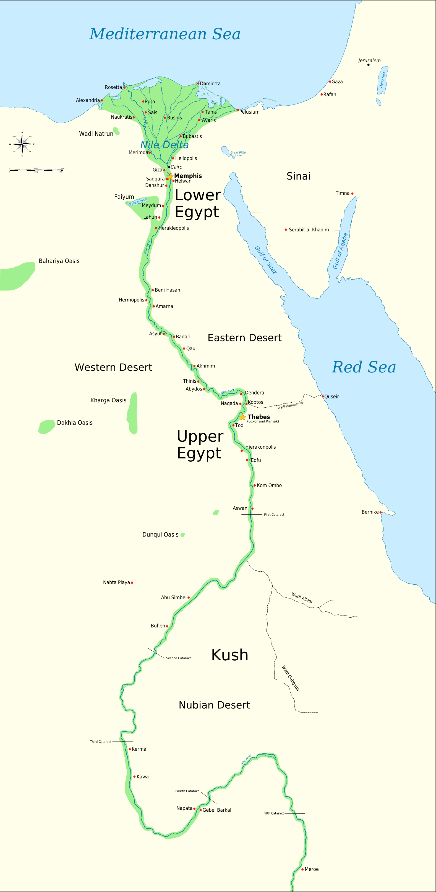
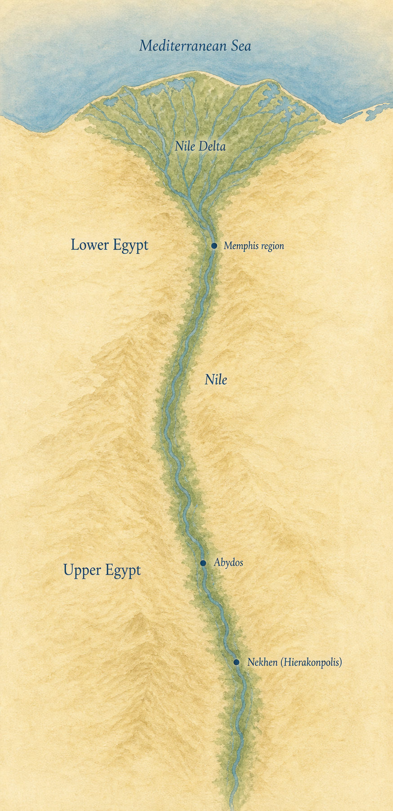
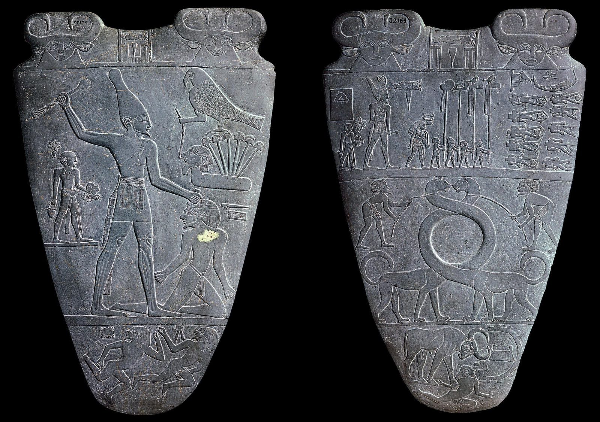
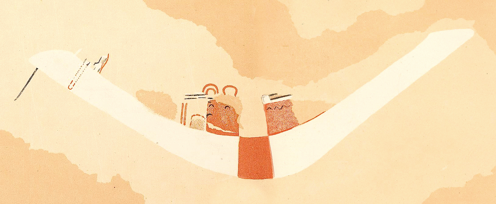
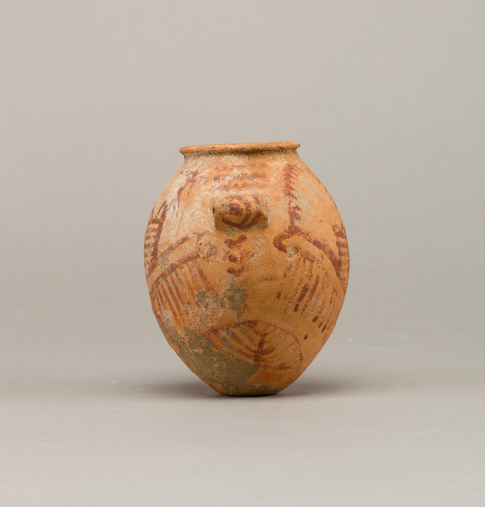
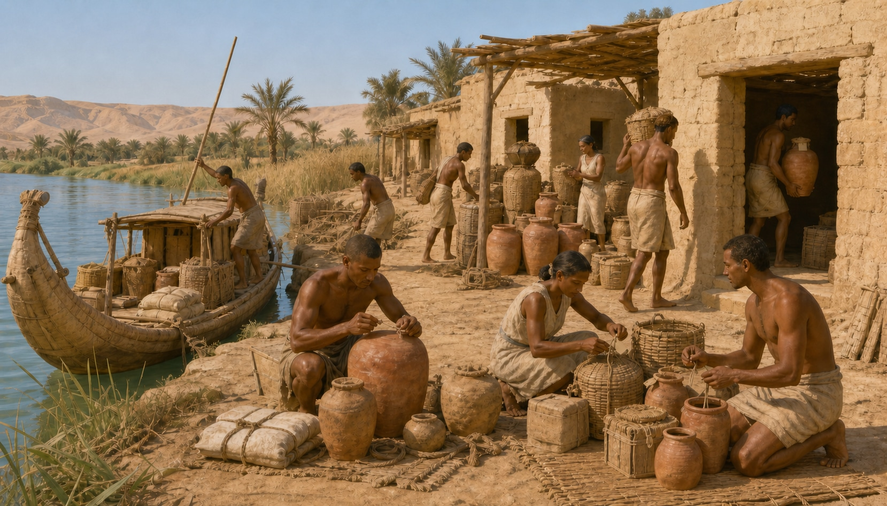

# The Nile and an Early Egyptian State — lesson production record

Lesson ID: `lesson.egypt.nile-state`

Linear: [ASH-97](https://linear.app/ashs-workshop/issue/ASH-97/research-and-publish-the-nile-and-an-early-egyptian-state)

Branch: `codex/ash-97-nile-early-state`

Required or optional: required

Queue status: **Awaiting approval**

Accountable reviewer: Carlin Aylsworth

Validation tier: reference
Current stage: **Stage 18 — published and complete**

This note is the durable source, claim, learning, visual, prototype, and checkpoint record. It replaces the two legacy `hieroglyphs` and `narmer` nodes; those older nodes are audit inputs, not trusted factual sources.

## Work boundary

This lesson explains how a long Nile corridor became part of an early territorial state between roughly 3200 and 2700 BCE. It connects ecology, movement, political competition, kingship, early administration, and writing without claiming that the river mechanically created a kingdom or that one carved scene records a complete conquest.

Included:

- the Nile Valley and Delta as connected but environmentally varied settings;
- political experimentation and increasing inequality before Dynasty 1;
- Narmer as a ruler attested in contemporary material evidence;
- close reading of both faces of the Narmer Palette;
- the difference between a royal claim and a literal event record;
- early labels, sealings, names, places, goods, and administrative coordination;
- the strategic importance of the Memphis region, with uncertainty around later founding traditions;
- people whose labor and compliance made institutions real, even when they are poorly represented in elite evidence.

Deferred:

- pyramid construction, Djoser, Imhotep, and Old Kingdom state labor;
- a complete history of hieroglyphic, hieratic, Demotic, or Coptic writing;
- detailed royal succession through Dynasties 1–2;
- a full Ancient Egypt Story Arc;
- later theology, mummification, monumental temples, empire, and modern Egyptology;
- claims that Narmer certainly equals the later traditional figure Menes;
- claims that Memphis was certainly founded by Narmer;
- a surveyed border between “Upper” and “Lower” kingdoms before unification.

## Node proposal

### Stable identity

| Field | Decision |
| --- | --- |
| Stable lesson ID | `lesson.egypt.nile-state` |
| Learner title | The Nile and an Early Egyptian State |
| Chronology | c. 3200–2700 BCE |
| World History position | 13 |
| Prerequisite | `lesson.uruk.first-city` |
| Canonical predecessor | `lesson.writing.early-systems` |
| Canonical successor | `lesson.caral.andean-urbanism` |
| Legacy aliases | `hieroglyphs`, `narmer` |

### Why this earns a required lesson

Uruk shows one city-centered route into complex institutions. Egypt offers a contrasting territorial pathway: a very long river corridor, several important communities, highly visible royal ideology, and short early records tied to goods and elite administration. The comparison blocks a one-path model of cities and states.

The lesson also advances an evidence habit the World Spine needs repeatedly: official images can be genuine ancient evidence while still being selective arguments made by powerful people.

### Overlap decision

The legacy `hieroglyphs` and `narmer` nodes are merged into this one lesson. A separate writing-system survey would duplicate `lesson.writing.early-systems`; a ruler biography would overstate one person’s role and split the causal chain. Pyramids remain a later lesson because they teach state labor and monumentality rather than initial state formation.

## Source ledger

All learner-facing factual claims trace to the sources below. Search snippets, Wikipedia, commercial history sites, the legacy node prose, and generated imagery are excluded as evidence.

| Source ID | Source | Authority / role | Claims supported | Limits | Rights / media use | Review |
| --- | --- | --- | --- | --- | --- | --- |
| `source.egypt.wengrow-state-formation` | [Alice Stevenson, *The Egyptian Predynastic and State Formation*](https://discovery.ucl.ac.uk/id/eprint/1496035/) | Peer-reviewed archaeological synthesis, UCL Discovery / Journal of Archaeological Research | long, uneven, multidimensional state formation; political experimentation; lived inequality | synthesis rather than one excavation report | CC BY 4.0; figures not selected for runtime | Reviewed 2026-08-16 |
| `source.egypt.regulski-writing` | [Ilona Regulski, *The Origins and Early Development of Writing in Egypt*](https://academic.oup.com/edited-volume/43506/chapter/364131674) | Specialist Oxford handbook chapter | Abydos U-j labels; early writing dates; short administrative content; preservation and elite bias; writing/state relationship | some readings and earliest-date questions remain debated | Research citation only; figures not redistributed | Reviewed 2026-08-16 |
| `source.egypt.stevenson-palettes` | [Alice Stevenson, “Palettes,” UCLA Encyclopedia of Egyptology](https://escholarship.org/content/qt7dh0x2n0/qt7dh0x2n0.pdf) | Peer-reviewed open-access specialist encyclopedia | ceremonial palette context; Narmer Palette identity; elite ideology; limits of literal event readings | surveys a class of artifacts, not a line-by-line decoding | Research citation only; figures not redistributed | Reviewed 2026-08-16 |
| `source.egypt.ministry-narmer-palette` | [Egyptian Ministry of Tourism and Antiquities, Narmer Palette](https://egymonuments.gov.eg/collections/narmer-palette-1/) | Official custodian record | object identity, date, material, provenance, visible crowns/procession/smiting scene, official interpretation | official summary presents one interpretation; site images are all-rights-reserved | Text facts only; ministry image not redistributed | Reviewed 2026-08-16 |
| `source.egypt.commons-narmer-palette` | [Wikimedia Commons, both sides of the Narmer Palette](https://commons.wikimedia.org/wiki/File:Narmer_Palette.jpg) | Rights record and high-resolution faithful reproduction | runtime evidence image candidate | source-photographer field is weak; use is grounded in PD-Art status, not as a historical authority | Public Domain Mark; 2566×1808 faithful reproduction | Rights reviewed 2026-08-16 |
| `source.egypt.ucl-narmer` | [UCL Digital Egypt, Narmer](https://www.ucl.ac.uk/museums-static/digitalegypt/chronology/narmer.html) | University museum and chronology resource | contemporary attestations across several sites; Dynasty 0/1 classification; uncertain relation to Menes | older web resource; concise rather than synthetic | Research citation; media not redistributed | Reviewed 2026-08-16 |
| `source.egypt.british-museum-early-egypt` | [British Museum, Early Egypt gallery](https://www.britishmuseum.org/collection/galleries/early-egypt) | National museum synthesis | Nile farming setting; Hierakonpolis/Abydos; early writing; c. 3100 unification chronology | public gallery overview compresses scholarly debates | Research citation; gallery media not redistributed | Reviewed 2026-08-16 |
| `source.egypt.cambridge-nile` | [Judith Bunbury and Reim Rowe, *The Nile: Mobility and Management*](https://doi.org/10.1017/9781108919913) | Cambridge archaeological/environmental synthesis | long river corridor; Delta/Valley habitats; changing landscapes; movement and management | broader chronological scope; not a deterministic state-formation model | Research citation only; figures not redistributed | Reviewed 2026-08-16 |
| `source.egypt.met-educator` | [The Metropolitan Museum of Art, *The Art of Ancient Egypt: A Resource for Educators*](https://www.metmuseum.org/-/media/files/learn/for-educators/publications-for-educators/the-art-of-ancient-egypt.pdf) | Museum educator reference grounded in curatorial scholarship | gradual material/political convergence; conflict among several processes; early Memphis and Abydos context | older broad chronology and compressed dates | Research citation; PDF media not redistributed | Reviewed 2026-08-16 |
| `source.egypt.hierakonpolis-expedition` | [Hierakonpolis Expedition, “Firsts of the First City”](https://www.hierakonpolis-online.org/index.php/about-hierakonpolis/firsts-of-the-first-city) | Active archaeological expedition | Hierakonpolis settlement, production, redistribution, temple context, Narmer Palette find context | site highlights emphasize “firsts”; individual claims need cross-checks | Research citation; images not redistributed | Reviewed 2026-08-16 |
| `source.egypt.unesco-memphis` | [UNESCO, Memphis and its Necropolis](https://whc.unesco.org/en/list/86/) and [map record](https://whc.unesco.org/en/list/0086/maps/) | Official heritage record and coordinate source | Memphis as administrative center; verified modern site location; later founding tradition | UNESCO explicitly labels the c. 3000 founding as traditional; ancient Nile channels changed | CC BY-SA IGO text; maps reference-only unless separately cleared | Reviewed 2026-08-16 |

### Source-balance result

The set combines peer-reviewed archaeology, specialist writing and artifact studies, official custodians, an active excavation project, and an official geographic reference. Royal/elite evidence is deliberately counterweighted by scholarship on settlement, practice, preservation bias, and Lower Egyptian agency. No one source controls the interpretation.

## Claim ledger

| Claim ID | Learner-facing claim | Type | Certainty | Evidence | Boundary / wording decision | Review |
| --- | --- | --- | --- | --- | --- | --- |
| `claim.egypt.nile-corridor` | The Nile joined a narrow valley, a broad delta, wetlands, and desert-edge settlements into a long corridor for food, movement, and exchange. | Interpretation | High | Cambridge Nile; British Museum | River landscapes changed; no static ancient channel map | Reviewed |
| `claim.egypt.no-river-determinism` | The Nile made connection possible, but a river did not automatically create one state. | Interpretation | High | Wengrow; Cambridge Nile | Explicitly reject hydraulic or geographic inevitability | Reviewed |
| `claim.egypt.long-state-formation` | Egyptian state formation was a long, uneven process of competition, alliance, display, production, and administration, not one invention day. | Interpretation | High | Wengrow; Met | Do not compress to one battle | Reviewed |
| `claim.egypt.unified-around-3100` | By about 3100 BCE, evidence supports rule over a politically unified Egypt, although the exact sequence remains debated. | Interpretation | Medium | British Museum; Met; Wengrow | Date approximate; process and geography contested | Reviewed |
| `claim.egypt.narmer-attested` | Narmer is known from contemporary inscriptions at multiple sites as well as the famous palette. | Observation | High | UCL Narmer | Avoid a biography built from later tradition | Reviewed |
| `claim.egypt.menes-uncertain` | Whether Narmer was the later remembered founder Menes is uncertain. | Interpretation | High | UCL Narmer | The certainty is about the uncertainty | Reviewed |
| `claim.egypt.palette-observations` | The Narmer Palette shows the ruler’s name, different crowns, ordered attendants, defeated people, animal imagery, and scenes of royal violence. | Observation | High | Ministry; Stevenson; Commons image | Describe visible features before assigning meaning | Reviewed |
| `claim.egypt.palette-royal-claim` | The palette presents force, divine or cosmic order, and elite ceremony as parts of legitimate kingship. | Interpretation | Medium | Stevenson; Ministry | One supported reading among debated motifs | Reviewed |
| `claim.egypt.palette-cannot-prove-unification` | The palette cannot by itself prove that one pictured battle unified all Egypt exactly as shown. | Interpretation | High | Stevenson; Wengrow | Central evidence-limit statement | Reviewed |
| `claim.egypt.ceremonial-elite-medium` | Late ceremonial palettes were rare, elaborate media tied to emerging kingship and restricted elite contexts. | Interpretation | High | Stevenson | Avoid calling the palette an everyday cosmetics board | Reviewed |
| `claim.egypt.early-writing` | By about 3250 BCE, short Egyptian inscriptions on labels and containers recorded names, places, quantities, or goods. | Observation | High | Regulski; British Museum | Exact readings of some earliest signs remain open | Reviewed |
| `claim.egypt.writing-and-rule` | Early writing helped direct goods and administration while also displaying elite ownership and authority. | Interpretation | High | Regulski | Practical and ideological uses are not opposites | Reviewed |
| `claim.egypt.memphis-region` | The Memphis region became a strategic administrative center near the meeting of valley and delta. | Interpretation | Medium | UNESCO; Met; Regulski | Do not assert Narmer personally founded or diverted the river for it | Reviewed |
| `claim.egypt.evidence-bias` | Most surviving early records come from elite cemeteries and ceremonies, so they reveal rulers more clearly than farmers, boat crews, craftspeople, and storehouse workers. | Interpretation | High | Regulski; Wengrow | Absence from records is not absence from history | Reviewed |

## Content triage

### Date decision

Use `c. 3200–2700 BCE`. This captures the emergence of writing, Narmer’s reign around 3100 BCE, Dynasty 1, and the consolidation that followed without reaching the separate pyramid/state-labor lesson.

### Terminology decisions

- Use **ruler** or **king** for this period. Explain that “pharaoh” is familiar but became a royal title much later.
- Explain the geographic puzzle: **Upper Egypt is south/upriver; Lower Egypt is north/downriver**, because elevation and river flow—not page position—set the names.
- Use **state formation** for the process and **political unification** for the condition increasingly visible around 3100 BCE.
- Use **hieroglyphic writing** for early inscribed signs; do not imply the entire later system appeared fully formed at once.
- Refer to **the Memphis region** unless a claim specifically concerns the later known city.

### Uncertainty language

- “Around” and “approximately” accompany all dates.
- “Presents,” “claims,” and “shows” describe the Palette; “records exactly” does not.
- “May,” “scholars debate,” and “cannot prove by itself” mark interpretation limits.
- Lower Egypt is never described as an empty or passive territory waiting for southern civilization.
- No fixed pre-unification border is drawn.

### Representation audit

The central surviving object is violent elite propaganda or ritual display. The lesson names the harmed and missing people rather than turning the violence into spectacle. The reconstruction image job centers a working river landing and storehouse—boat crews, tallying/labeling, craft and food containers, women and men at work—while avoiding invented named individuals or a triumphant battle scene.

## Learning blueprint

### Essential question

**How did people turn a long river corridor into an early state—and what can the Narmer Palette actually prove?**

### Durable insight

The Nile connected communities and resources, but an Egyptian state emerged through generations of political competition, administration, labor, writing, and royal claims. The Narmer Palette is powerful evidence for how kingship was presented; it cannot by itself prove that one battle created the whole state.

### Target reasoning moves

By the end, learners should be able to:

1. explain why geography created opportunities without creating an inevitable state;
2. distinguish an observation on an artifact from an interpretation of it;
3. use the Palette to support a bounded claim about kingship;
4. connect short records and movement of goods to administration;
5. name at least one group whose labor is essential but faint in elite evidence.

### Misconceptions to prevent

- Upper Egypt is north because it is “up” on a modern map.
- The Nile automatically unified Egypt.
- Egypt consisted of two neat, static kingdoms until one final battle.
- The Narmer Palette is a literal illustrated news report.
- Narmer is certainly Menes and certainly founded Memphis.
- Early writing was a complete later hieroglyphic system used by everyone.
- State formation is only the story of kings, warfare, and monuments.

### Assessment plan

Required prompt 1 is an evidence-choice check. Learners select the bounded claim best supported by visible features of the Palette.

Required prompt 2 is a concise explanation. Learners choose the river corridor, Palette, or labels/goods; explain what that evidence contributes to state formation; and name one thing it cannot prove alone. Sincere attempt, not perfect accuracy, is the completion requirement.

## Section/component storyboard

| Order | Section | Learning job | Modules | Evidence / uncertainty move |
| ---: | --- | --- | --- | --- |
| 1 | The Nile corridor | Establish valley, delta, flow, movement, and the danger of geographic determinism | opening prose; geography knowledge block | planned source-anchored map; no borders |
| 2 | Before one king | Replace a two-box conquest story with long political experimentation and unequal change | prose; process knowledge block | distinguish reconstruction from settled fact |
| 3 | Read the Narmer Palette | Slow down on both faces of the artifact and separate observations from interpretations | evidence-reading prose; “what you can see” knowledge block | planned high-resolution public-domain artifact encounter |
| 4 | What the Palette can prove | Interpret kingship while bounding what the Palette cannot prove | prose; evidence-limit knowledge block | literal event reading rejected; Menes uncertainty explicit |
| 5 | How administration worked | Connect boats, goods, labels, sealings, Memphis, and workers to durable administration | prose; administration knowledge block | planned evidence-led reconstruction; missing voices named |
| 6 | World Check | Require one supported claim and one evidence limit | evidence-choice prompt; concise-explanation prompt | completion requires sincere attempts |

Heading-voice revision (2026-08-16): three learner-facing headings were rewritten from metaphor/riddle/punchline titles to ordinary-language job names. Claim ID `claim.egypt.palette-not-camera` became `claim.egypt.palette-cannot-prove-unification`. Section IDs `section.egypt.claim-not-camera` and `section.egypt.making-rule-travel` became `section.egypt.palette-limits` and `section.egypt.administration`. Teaching jobs are unchanged.

## Stage 11 — visual and media plan

The lesson needs three strong visual jobs. They are deliberately different: geography, surviving evidence, and reconstruction.

### 1. Nile corridor map — planned

- Teaching purpose: make north/downriver Lower Egypt, south/upriver Upper Egypt, the Delta, and the relative locations of Hierakonpolis/Nekhen, Abydos, and Memphis legible.
- Necessity decision: **required**. Prose alone makes the Upper/Lower naming and long-corridor causal relationship needlessly abstract.
- Boundaries: no political borders, conquest arrows, surveyed ancient channels, or claim that three sites were the only centers.
- Primary reference candidate: Cambridge Nile environmental synthesis and its referenced geography.
- Cross-checks: UNESCO Memphis coordinates/map record; UCL/Hierakonpolis site records; a future coordinate gazetteer check before generation.
- Depiction: calm Chronos historical atlas, approximate ancient delta/river channels visibly softened, labels limited to `Mediterranean Sea`, `Nile Delta`, `Memphis region`, `Abydos`, `Nekhen (Hierakonpolis)`, `Nile`, `Upper Egypt`, and `Lower Egypt` if the reviewed map brief keeps all eight.
- Separate map research note required before generation under `docs/research/the-nile-and-an-early-egyptian-state-map.md`.

### 2. Narmer Palette evidence encounter — planned

- Teaching purpose: let learners inspect both faces at useful resolution before reading an interpretation.
- Candidate source: 2566×1808 faithful reproduction on Wikimedia Commons, Public Domain Mark.
- Historical anchor: Egyptian Ministry custodian record and Stevenson’s specialist palette study.
- Presentation: contain, never crop; zoom or paired-detail treatment may be added only if accessible and calm.
- Native UI supplies title, observation prompts, rights, provenance, uncertainty, and alt text.
- Do not colorize, dramatize, clean away damage, or generate missing carving.

### 3. River landing and storehouse reconstruction — planned

- Teaching purpose: make administration a human activity rather than an abstract word.
- Scene: late fourth-/early third-millennium Nile landing near a settlement edge; reed boat unloading sealed jars, grain baskets, and bundles; workers carrying, checking, attaching small labels, and storing goods; mudbrick architecture and riverbank vegetation.
- Historical constraints: no pyramids, grand stone temples, New Kingdom costume, later papyrus scrolls, fantasy crowns, armies, or monumental hieroglyphic paragraphs.
- People: varied ages and genders where evidence permits; no named portrait; labor is coordinated without making every worker cheerful or coerced.
- Depiction label: evidence-led reconstruction; precise event, people, and building arrangement are illustrative.
- Style: cinematic natural light and tactile detail, but observational rather than triumphalist.

### Image lifecycle gate

At the raw-prototype checkpoint, all three jobs render as development-only media intentions. Final sourcing, map generation, and reconstruction generation begin only after product-owner approval of the lesson flow and visual jobs. This protects the evidence chain from expensive rework.

## Stage 12 — Knowledge Card decision

Prototype proposal: **one Artifact / Witness card for the Narmer Palette**, not a Narmer person card.

Why: the lesson’s durable reward is the ability to read a royal image critically. An artifact card can preserve both the visible claim and the evidence limit. A person card would invite a biography and certainty the evidence cannot support.

Candidate stable ID: `card.artifact.narmer-palette`.

Proposed card statement: “A carved royal claim can reveal how power wanted to be seen without recording the whole path to power.”

Status: **proposed; not implemented or unlockable before product review.**

## Stage 13 — risk register and editorial disposition

| Risk | Severity | Mitigation | State |
| --- | --- | --- | --- |
| Single-battle unification myth | High | Center the Palette’s evidence limit; use long-process scholarship | Addressed in claims/storyboard |
| Nile determinism | High | Separate geographic opportunity from political cause | Addressed |
| Royal violence becomes spectacle | High | Artifact close read, calm framing, no generated battle hero | Addressed |
| Upper/Lower naming confusion | Medium | Required map plus explicit upriver/downriver explanation | Planned |
| Later Egypt leaks into c. 3200–2700 BCE | High | No pyramids, papyrus-book trope, New Kingdom dress, later temples, or later title assumptions | Visual brief constraint |
| Memphis founding overstated | Medium | “Memphis region”; identify later tradition and shifting channels | Addressed |
| Early writing becomes “full hieroglyphs for everyone” | High | Short labels/goods; elite and preservation bias explicit | Addressed |
| Lower Egypt treated as passive | High | Name local communities and research imbalance; no empty conquest map | Addressed |
| Generated map invents geography | High | Separate map runbook, authoritative anchor, manual site/label review | Pending post-prototype |
| Reconstruction invents certainty | Medium | Evidence-led reconstruction label and native uncertainty disclosure | Pending post-prototype |
| Artifact-photo rights ambiguity | Medium | Use reviewed PD-Art file; do not reuse ministry photo | Candidate reviewed |

Editorial disposition: **ready for product-owner review.** The raw learner prototype and independent learner-proxy pass have no blocking findings. Publication is not authorized. Final media and the proposed card remain behind the product-owner prototype gate.

## Stage 14A — raw learner prototype checkpoint

State: **Complete.**

The prototype must render in the real Learn shell with preview unlocking, the six required sections, both required prompts, and three development-only visual-intention annotations. The product checkpoint asks:

1. Does the river → political experimentation → Palette → administration chain feel inevitable to follow without making history itself seem inevitable?
2. Does the Palette encounter make the learner curious before giving the interpretation?
3. Are the three image jobs worth producing at an exceptional quality bar?
4. Should the lesson award the Narmer Palette Artifact / Witness card, or explicitly award no card?

Product review: **approved August 19, 2026**.

Validation and shell-review evidence (August 16, 2026):

- `npm run validate:content` passed.
- `npm run lesson:gate -- --lesson lesson.egypt.nile-state --note docs/research/the-nile-and-an-early-egyptian-state.md --gate prototype` passed.
- The focused World History journey-order test passed after adding the draft Egypt entry; the full suite passed with 21 files and 126 tests.
- The production build passed with the existing large-chunk warning.
- Repository-wide typecheck remains red only on the documented pre-existing legacy and v2 lesson-status inference baseline. No diagnostic names the Egypt lesson, its prototype review, or its journey/registry edits.
- The exact preview route `/learn/lesson.egypt.nile-state` rendered through the real Learn shell with all six required sections, both required prompts, and all three development-only media intentions.
- Desktop review at 1440 × 900 and mobile review at 390 × 844 passed in dark and light themes with no horizontal overflow or browser-console warnings.
- A fresh lesson open began at the top. Section exploration remained visually subordinate to the explicit two-prompt completion requirement.
- The map, Palette, and reconstruction intentions appeared at the teaching moments defined by the storyboard; none appeared as learner content or implied that unreviewed media was final.

## Stage 14B — proxy and product review

State: **Independent learner-proxy review passed; product-owner review approved August 19, 2026.**

Reviewer identity: **Codex adult learner proxy.** The reviewer approached the complete raw lesson as a learner, received the lesson quality contract, inspected the real Learn shell, completed both prompts and the explicit completion action, and made no repository or issue changes.

Learner retelling:

> The Nile connected many communities, but the river did not automatically create Egypt. An early state developed gradually through competition, labor, administration, writing, and royal claims. The Narmer Palette shows how a ruler’s court presented power; it cannot prove that one battle created the state or that everyone accepted Narmer’s rule.

Strongest learning moment: **the can-show/cannot-prove evidence-boundary panel after the Palette close read.** The proxy found that this turned the Palette from a famous object into a memorable historical-reasoning lesson, and that both prompts reinforced the distinction. Later heading-voice revision renamed the section “What the Palette can prove”; the teaching job is unchanged.

Findings and dispositions:

| Classification | Finding | Disposition |
| --- | --- | --- |
| Product-owner heading-voice correction | Metaphor and punchline section titles (“A ruler’s claim is not a camera,” “A kingdom shaped like a river?,” “Making rule travel”). | Applied before approval: headings are now “What the Palette can prove,” “The Nile corridor,” and “How administration worked.” |
| Non-blocking revision | “Before deciding what it means, look” currently precedes the planned object visual. | During Stage 15, place the final both-faces Palette image immediately after the object-introduction paragraph and before the supplied observation prose/card. |
| Non-blocking implementation condition | Nekhen/Hierakonpolis, Abydos, and Memphis arrive quickly. | The required early map must retain all three locations clearly and carry the fast geography load. |
| Non-blocking implementation condition | The landing/storehouse visual could be mistaken for direct evidence. | Its native caption and depiction disclosure must explicitly identify it as an evidence-led reconstruction. |
| Safe deferral | No clickable successor appears after completion because no next reviewed lesson exists. | Keep the truthful journey-end message and persistent World History navigation until a reviewed successor exists. |

Contract disposition: **PASS.** Mental-model coherence, narrative momentum, age-appropriate cognitive load, evidence reasoning, historical proportionality, visual teaching value at intention stage, prompt quality, explicit completion, direct-open-at-top behavior, and next-action clarity passed. Desktop/mobile and dark/light presentation passed without horizontal overflow or console warnings. No finding returns the lesson to Stage 14A.

### Product-owner decision packet

Build under review:

- Lesson: `lesson.egypt.nile-state`
- Title: **The Nile and an Early Egyptian State**
- Preview route: `/learn/lesson.egypt.nile-state`
- Preview flag: `VITE_UNLOCK_PREVIEW_LESSONS=true`
- Branch: `codex/ash-97-nile-early-state`
- Minimum content commit: `e742dc0`

Recommended decisions:

1. **Approve the title, scope, and learning arc:** river corridor → long political experimentation → close reading of the Narmer Palette → administration as repeated human work.
2. **Approve all three exceptional-quality visual jobs:** required Nile corridor map; required, uncropped both-faces Narmer Palette evidence encounter placed before supplied observations; evidence-led Nile landing/storehouse reconstruction with an explicit reconstruction label.
3. **Approve one deterministic Knowledge Card:** category Artifact, class Witness, stable ID `card.artifact.narmer-palette`; no Narmer person card.
4. **Approve the safe journey-end behavior:** truthful static completion copy until a reviewed successor exists.

Product-owner state: **approved August 19, 2026**. Carlin approved the revised learner headings and all four recommended decisions: the title/scope/learning arc; the required Nile map, uncropped both-faces Palette encounter, and explicitly labeled evidence-led reconstruction; the deterministic Artifact / Witness Knowledge Card `card.artifact.narmer-palette`; and the truthful static journey-end behavior until a reviewed successor exists. Approval authorizes Stage 15 implementation, including the specialist map and image lifecycle workflows; it does not publish the lesson.

## Image lifecycle

### media.egypt.nile-corridor-map — required historical map

#### 1. Reasoning and source basis

- Teaching job: establish Upper Egypt south/upriver, Lower Egypt north/downriver, and the relative order of Nekhen, Abydos, and the Memphis region before those places carry narrative weight.
- Governing claim IDs: `claim.egypt.nile-corridor`, `claim.egypt.no-river-determinism`, `claim.egypt.memphis-region`.
- Factual/historical sources: Jeff Dahl's CC BY-SA raster map, UNESCO Memphis coordinates, Pleiades Abydos coordinates, the Hierakonpolis Expedition, and UCL's Tour of the Nile.
- Why image instead of no media: the lesson asks learners to reverse the familiar modern intuition that “upper” means north and to hold three distant places along one corridor; prose alone makes that spatial load unnecessarily difficult.
- Depiction and uncertainty boundary: evidence-based reconstruction. Site order and broad placement are source-supported; river branches, wetlands, floodplain widths, shorelines, and settlement extents are approximate. No political border, conquest route, or territorial fill is claimed.

#### 2. Reference image actually used

| Reference preview | Origin and permitted use |
| --- | --- |
|  | Creator: Jeff Dahl.<br>Canonical origin: https://commons.wikimedia.org/wiki/File:Ancient_Egypt_main_map.png<br>License: CC BY-SA 3.0; derivative and redistribution permitted with attribution/share-alike.<br>Accessed: 2026-08-19. |

- Repository research copy and SHA-256: `docs/research/references/egypt/ancient-egypt-main-map-reference.png`; `246fc36cf2eac8d2f9cc428e6daa04d713d94a1f8355d24c1b515feaa825b832`.
- Edit mode: adapted composition.
- Visual relationship to preserve: north-up Mediterranean/Delta/long-valley composition and the north-to-south order Memphis region → Abydos → Nekhen.
- Locked layout/detail invariants: complete corridor visible; exactly eight reviewed labels; three subtle site dots; no border, route, arrow, legend, title, date, pyramids, landmarks, or extra settlement.
- Details not to copy or infer: later sites and period-mixed emphasis, compass and scale bar, exact ancient channels, modern boundaries, the reference's colors/type treatment, and any political extent.

#### 3. Generation or transformation

- Operation: reference-led image edit followed by full-frame JPEG runtime compression.
- Actual input path and SHA-256: `docs/research/references/egypt/ancient-egypt-main-map-reference.png`; `246fc36cf2eac8d2f9cc428e6daa04d713d94a1f8355d24c1b515feaa825b832`.
- Tool/model/date: OpenAI built-in image generation service (model identifier not exposed), 2026-08-19; Sharp/MozJPEG quality 95 for the uncropped runtime source.
- Complete prompt:

```text
Use case: scientific-educational
Asset type: Chronos historical lesson map
Primary request: Transform the attached real raster map into a calm, premium historical-atlas illustration of the Nile corridor for c. 3200–2700 BCE.
Input images: Image 1 is the geographic composition reference and edit target. Preserve north-up orientation, the Mediterranean coast, the Nile Delta, the single long Nile valley, and the relative north-to-south order and broad placement of Memphis, Abydos, and Hierakonpolis. Crop the geographic extent to the Mediterranean coast through a little south of Hierakonpolis; remove the Red Sea, Sinai detail, cataracts, Kush, later cities, modern cities, scale bar, compass, political borders, and every existing label.
Scene/backdrop: warm ivory parchment ground with restrained mineral-blue water, muted blue-green floodplain, pale sand and ochre desert, subtle paper grain and hand-painted topographic texture.
Style/medium: polished editorial historical-atlas raster illustration for ages 10–14; elegant, calm, museum-quality, accurate before decorative.
Composition/framing: portrait map, north at top, complete geography visible with generous margins; Delta broad at top, valley narrow and continuous below; no cropping of the three required site markers.
Text (verbatim): "Mediterranean Sea", "Nile Delta", "Memphis region", "Abydos", "Nekhen (Hierakonpolis)", "Nile", "Upper Egypt", "Lower Egypt".
Constraints: include exactly these eight labels and no other words; spell them exactly; place site labels at their referenced positions; use subtle dots for the three sites; make labels legible at mobile size; render river branches and floodplain edges softly to signal approximation; no political border or territorial fill; no arrows; no route line; no legend; no title; no date; no paragraph; no decorative compass; no iconography; no pyramids; no landmarks; no logo; no watermark; no UI chrome.
Avoid: copying the reference's graphic style, exact color scheme, typography, decorative compass, later-period emphasis, or expressive details; tactical-game styling; fantasy; satellite imagery; generic GIS styling; invented settlements, waterways, roads, ruins, symbols, or annotations.
```

- Candidate/rejection record: the first generated candidate, `exec-60edeed1-22fc-4ed3-9f40-17fc6a2eaa37.png` (SHA-256 `d4ee27010f6a9465e9819bf2ea6db389b978171a989877101614b59680936a33`), passed geographic, label, and visual review. No generated candidate was rejected. A lossless runtime encoding exceeded the repository's delivery ceiling, so the full frame was encoded as a 501,061-byte quality-95 JPEG without resizing or cropping.

#### 4. Accepted final image

| Reference used | Accepted final |
| --- | --- |
|  |  |

- Final master path, dimensions, and SHA-256: `docs/research/generated/egypt/nile-corridor-map-master.png`; 874 × 1800; `d4ee27010f6a9465e9819bf2ea6db389b978171a989877101614b59680936a33`.
- Runtime/fallback path and SHA-256: `public/images/places/egypt-nile-corridor-map.jpg`; 874 × 1800; `3cf6202cd83caebb7cce0d3a88e26feaf33aea984561307f7e57d757b1ee6618`. Generated fallback: `/images/optimized/egypt/nile-corridor-map.optimized.jpg`.
- Reviewer/date/status: Codex historical, cartographic, accessibility, and visual review / 2026-08-19 / accepted.
- Fidelity verdict — every locked invariant retained: yes.
- Lesson-size verdict — evidence-bearing differences remain visually distinct on desktop and mobile: yes; final shell verification remains part of Stage 16.
- Comparison verdict — preserved relationship: Mediterranean and Delta at top; Memphis region, Abydos, and Nekhen in the reviewed order; Upper/Lower labels correctly reversed from modern north-up intuition.
- Comparison verdict — intentional changes: removed unrelated later sites and reference styling; softened channel/floodplain edges; used a calm Chronos atlas treatment.
- Comparison verdict — unsupported details checked: exactly eight labels, no added settlements, borders, arrows, conquest route, landmarks, pyramids, legend, title, date, logo, or watermark.

### media.egypt.narmer-palette — surviving evidence

#### 1. Reasoning and source basis

- Teaching job: let learners inspect both faces of the surviving Palette before the lesson supplies observations or an interpretation.
- Governing claim IDs: `claim.egypt.palette-observations`, `claim.egypt.ceremonial-elite-medium`, `claim.egypt.palette-royal-claim`, `claim.egypt.palette-cannot-prove-unification`.
- Factual/historical sources: Egyptian Ministry of Tourism and Antiquities object record, Alice Stevenson on Predynastic palettes, UCL's Narmer record, and the reviewed Wikimedia Commons faithful reproduction.
- Why image instead of no media: the core historical-reasoning move depends on seeing crowns, scale, attendants, captives, signs, animals, registers, damage, and the object as a whole before deciding what the court's image can prove.
- Depiction and uncertainty boundary: surviving evidence, not reconstruction. The object and carving survive; the exact sequence of events, participants' thoughts, and one-battle unification narrative do not.

#### 2. Reference image actually used

| Reference preview | Origin and permitted use |
| --- | --- |
|  | Faithful two-face reproduction.<br>Canonical origin: https://commons.wikimedia.org/wiki/File:Narmer_Palette.jpg<br>License: Public Domain Mark / faithful reproduction of a public-domain work.<br>Accessed: 2026-08-19. |

- Repository research copy and SHA-256: `docs/research/references/egypt/narmer-palette-both-faces-reference.jpg`; `bdf68bd9c2a1ada9f52ec29e471f5e2522983a933e5e2268ecbbcf6086cb8902`.
- Edit mode: direct use with full-frame resize/compression only.
- Visual relationship to preserve: both faces together, complete canvas, orientation, scale relationship, color, damage, carved detail, accession marking, and black background.
- Locked layout/detail invariants: neither face cropped or retouched; no colorization, invented carving, repaired damage, selective erasure, label, annotation, or replacement background.
- Details not to copy or infer: no ministry photograph is reused; no modern illustration or speculative reconstruction is blended into the artifact.

#### 3. Generation or transformation

- Operation: direct licensed use; full-frame resize from 2566 × 1808 to 1600 × 1127 and high-quality JPEG compression for runtime delivery.
- Actual input path and SHA-256: `docs/research/references/egypt/narmer-palette-both-faces-reference.jpg`; `bdf68bd9c2a1ada9f52ec29e471f5e2522983a933e5e2268ecbbcf6086cb8902`.
- Tool/model/date: Sharp/MozJPEG quality 92, 2026-08-19; no generative model.
- Complete transformation:

```text
Direct-use transformation only: resize the reviewed 2566×1808 Public Domain faithful reproduction proportionally to 1600 pixels wide and encode it as a high-quality progressive JPEG. Preserve both faces, full canvas, orientation, color, damage, accession marking, and black background. Do not crop, retouch, colorize, sharpen selectively, invent detail, remove damage, or add text.
```

- Candidate/rejection record: no interpretive or generated candidates. The first proportional runtime conversion was accepted after full-frame visual inspection and media-fidelity measurement.

#### 4. Accepted final image

| Reference used | Accepted final |
| --- | --- |
|  |  |

- Final master path, dimensions, and SHA-256: `docs/research/references/egypt/narmer-palette-both-faces-reference.jpg`; 2566 × 1808; `bdf68bd9c2a1ada9f52ec29e471f5e2522983a933e5e2268ecbbcf6086cb8902`.
- Runtime/fallback path and SHA-256: `public/images/evidence/egypt-narmer-palette-both-faces.jpg`; 1600 × 1127; `f9e81cf2edaa353122c4ee6391027838e901f6e0ea23499e9920a11f16205f42`. Generated fallback: `/images/optimized/egypt/narmer-palette.optimized.jpg`.
- Reviewer/date/status: Codex artifact-fidelity, rights, accessibility, and visual review / 2026-08-19 / accepted.
- Fidelity verdict — every locked invariant retained: yes.
- Lesson-size verdict — evidence-bearing differences remain visually distinct on desktop and mobile: yes; both faces remain legible together and the runtime manifest includes 480, 960, and 1600-pixel variants.
- Comparison verdict — preserved relationship: full two-face composition, colors, damage, carved registers, and object/background boundary.
- Comparison verdict — intentional changes: proportional downscale and delivery compression only.
- Comparison verdict — unsupported details checked: no crop, repair, recoloring, annotation, invented carving, generated texture, or ministry-photo reuse.

### media.egypt.nile-landing-reconstruction — administration in practice

#### 1. Reasoning and source basis

- Teaching job: make administration visible as repeated human work moving from boat to checking point to storehouse, rather than as an abstract invention or a ruler's solitary act.
- Governing claim IDs: `claim.egypt.writing-and-rule`, `claim.egypt.evidence-bias`, `claim.egypt.nile-corridor`, `claim.egypt.early-writing`.
- Factual/historical sources: the Hierakonpolis Tomb 100 boat image, the Met's Predynastic decorated jar with boats, Ilona Regulski on early writing and administration, and the Hierakonpolis Expedition.
- Why image instead of no media: learners need to see a workflow—river transport, containers, closures, cords, checking, carrying, and storage—to understand how institutions become durable through many people's repeated actions.
- Depiction and uncertainty boundary: evidence-led reconstruction. The boat character, jars, cords, baskets, mudbrick storage, and kinds of work are evidence-led; the exact people, landing, architecture, clothing combinations, weather, and moment are illustrative.

#### 2. Reference image actually used

| Reference preview | Origin and permitted use |
| --- | --- |
|  | Green/Quibell drawing of a c. 3500–3200 BCE Tomb 100 boat image.<br>Canonical origin: https://commons.wikimedia.org/wiki/File:Hierakonpolis_Tomb_100_Boat.jpg<br>License: Public Domain Mark / PD-US-expired.<br>Accessed: 2026-08-19. |
|  | The Metropolitan Museum of Art, accession 99.3.2, c. 3850–2960 BCE.<br>Canonical origin: https://www.metmuseum.org/art/collection/search/546304<br>License: CC0.<br>Accessed: 2026-08-19. |

- Repository research copies and SHA-256: `docs/research/references/egypt/hierakonpolis-tomb-100-boat-reference.jpg`, `f0b01ed1857b2b8cb5600ae15c19be0a141076b4bd3477d38abc6c43ffe4318f`; `docs/research/references/egypt/predynastic-boats-met-reference.jpg`, `c73eea451b9c2f07bbaf4e90eb171a30891557444c448acdf646d0230cb6b4d4`.
- Edit mode: adapted composition into an original scene.
- Visual relationship to preserve: broad crescent/raised-ended Predynastic boat character, ceramic vessel forms, earth pigments, and a human-scale material workflow.
- Locked layout/detail invariants: wide left-to-right boat → checking → storehouse sequence; ordinary workers rather than ruler spectacle; subtle thumb-length blank tags; no readable writing; low mudbrick structures; no later monumental Egypt.
- Details not to copy or infer: neither artifact's painted composition or museum background; no named person or exact documented landing; no specific mark meaning; no pyramids, sphinxes, obelisks, pylons, stone columns, scrolls, books, horses, camels, chariots, armies, slave chains, or New Kingdom dress.

#### 3. Generation or transformation

- Operation: multi-reference original image generation, two precise-object correction edits, then full-frame JPEG runtime compression.
- Actual input paths and SHA-256: `docs/research/references/egypt/hierakonpolis-tomb-100-boat-reference.jpg`, `f0b01ed1857b2b8cb5600ae15c19be0a141076b4bd3477d38abc6c43ffe4318f`; `docs/research/references/egypt/predynastic-boats-met-reference.jpg`, `c73eea451b9c2f07bbaf4e90eb171a30891557444c448acdf646d0230cb6b4d4`.
- Tool/model/date: OpenAI built-in image generation service (model identifier not exposed), 2026-08-19; Sharp/MozJPEG quality 94 for runtime delivery.
- Complete base prompt:

```text
Use case: historical-scene
Asset type: Chronos lesson reconstruction, c. 3200–3000 BCE Nile Valley
Primary request: Create a vivid, evidence-led reconstruction of a working Nile landing beside low mudbrick storehouses, showing how administration became repeated human work. This is an original scene, not a copy of either reference object.
Input images: Image 1 is a public-domain reconstruction of a c. 3500–3200 BCE Hierakonpolis boat image; use only its broad crescent hull, raised ends, compact cabin, and non-modern vessel character as a period anchor. Image 2 is a CC0 Predynastic pottery vessel whose painted boats and ceramic surface anchor boat silhouette, jar forms, and earth pigments. Do not reproduce either artifact, their painted composition, or museum background in the final scene.
Scene/backdrop: sunlit Nile bank in Upper Egypt around 3100 BCE; calm mineral-blue water at left; narrow green river edge with reeds and date palms; dry ochre desert beyond; a cluster of low flat-roofed mudbrick storehouses and shaded reed awnings at right.
Subject: one long wooden/reed riverboat has just reached the earthen landing. A diverse group of ordinary workers unloads sealed pottery jars, woven grain baskets, linen bundles, and wooden crates. One worker checks an intact clay seal on a jar; another ties a tiny plain rectangular bone or ivory tag to a container with cord; carriers move goods toward open mudbrick storage rooms; a record-keeper calmly compares containers and tokens without using a scroll or book.
Style/medium: painterly cinematic historical reconstruction with archaeological realism, tactile materials, believable human anatomy and motion, premium museum-illustration quality, not photoreal cosplay and not game concept art.
Composition/framing: wide landscape establishing shot with a clear left-to-right work sequence from boat to checking point to storehouse; about eight to ten people, each action readable without labels; human-scale viewpoint slightly above eye level; generous breathing room; no hero ruler and no central throne.
Lighting/mood: warm early-morning light, long soft shadows, lively cooperative labor, calm rather than theatrical.
Color palette: warm mudbrick, limestone dust, muted linen, terracotta jars, reed gold, Nile blue-green, small accents of mineral red and charcoal.
Materials/textures: rough mudbrick, woven reed mats and baskets, weathered wood, coiled rope, unglazed pottery, simple linen wraps, dusty earth, river reeds.
Constraints: historically plausible for c. 3200–3000 BCE; workers wear simple plain linen kilts, wrap skirts, or short dresses with bare heads and practical sandals or bare feet; include seals, tags, containers, and storehouse thresholds as small physical actions, not symbolic icons; no readable or invented writing; no royal spectacle; no baked-in caption, title, educational prose, UI chrome, logo, or watermark.
Avoid: pyramids; sphinxes; obelisks; grand pylons; stone columns; monumental statues; palaces; dressed-stone quays; papyrus scrolls; bound books; desks; ink pots; modern cranes; wheels; chariots; horses; camels; armor; fantasy crowns; New Kingdom wigs or collars; white-robed stereotype crowds; armies; slave-chain imagery; whipping; weapons; royal smiting; dramatic fire; generic desert ruins; copied artifact paintings.
```

- Complete correction prompt 1:

```text
Use case: precise-object-edit
Asset type: Chronos historical reconstruction correction
Primary request: Remove only the visible dark marks, pseudo-writing, symbols, and characters from every small tag or label in the scene. Replace them with plain, undecorated bone or ivory rectangles with a single pierced cord hole. Keep the people holding and tying the tags exactly where they are so the administrative action remains readable.
Constraints: change only the surfaces of the small tags; preserve every person, face, hand, pose, clothing item, jar, basket, seal, boat, building, plant, landscape feature, camera angle, lighting, color, texture, and composition exactly; do not add or remove people or objects; no text, symbols, marks, logo, or watermark anywhere.
```

- Complete correction prompt 2:

```text
Use case: precise-object-edit
Asset type: Chronos historical reconstruction correction
Primary request: Change only the three visible blank tags held by the foreground workers. Make each one a tiny thumb-length sliver of bone or ivory, narrow and slightly irregular, with one small pierced hole and a thin cord. They should be much smaller than a person's palm and should never resemble paper, a modern card, or a luggage tag. Keep them completely plain with no marks, symbols, writing, or decoration.
Constraints: change only the size, shape, material, and cord attachment of the three tags; keep the workers' hands and actions natural; preserve every person, face, pose, clothing item, jar, basket, seal, boat, building, plant, landscape feature, camera angle, lighting, color, texture, and composition exactly; do not add or remove people or objects; no text, symbols, logo, or watermark.
```

- Candidate/rejection record: base candidate `exec-09d8571f-c467-4d43-9fd0-dcca070a169a.png` (SHA-256 `bf63f41387ce2ca3fe2152a3a9c9cb9dc6aff3e6435c97fa89a633651981d6dc`) rejected for pseudo-writing on tags. First correction `exec-591d6a08-2cf1-4da3-b1e3-31e72295a6bb.png` (SHA-256 `80b56fa9a559af6fa450fe23848a0dec1dcb22d8ba130cf92b9714c8d0d0491d`) rejected because blank tags became too large and modern. Second correction `exec-02b2c407-537b-48a5-8eca-b92027b9d9d4.png` (SHA-256 `95585fd956c684ad38dc66ad59c834a3789cea762522dfd3ed388ed79f07aecf`) accepted after confirming small mark-free tags and all locked scene relationships.

#### 4. Accepted final image

| Reference used | Accepted final |
| --- | --- |
|  |  |
|  |  |

- Final master path, dimensions, and SHA-256: `docs/research/generated/egypt/nile-landing-storehouse-master.png`; 1659 × 948; `95585fd956c684ad38dc66ad59c834a3789cea762522dfd3ed388ed79f07aecf`.
- Runtime/fallback path and SHA-256: `public/images/reconstructions/egypt-nile-landing-storehouse.jpg`; 1659 × 948; `8b2577af9ca39d73ef179c131687c86a43ab90b6bb94c16041e276e5a3a436fb`. Generated fallback: `/images/optimized/egypt/nile-landing-reconstruction.optimized.jpg`.
- Reviewer/date/status: Codex historical, reconstruction, rights, accessibility, and visual review / 2026-08-19 / accepted.
- Fidelity verdict — every locked invariant retained: yes.
- Lesson-size verdict — evidence-bearing differences remain visually distinct on desktop and mobile: yes; the left-to-right workflow and foreground checking actions remain readable.
- Comparison verdict — preserved relationship: raised-ended river craft, earth-toned containers, cordage, storage materials, ordinary workers, and human-scale administrative sequence.
- Comparison verdict — intentional changes: the two artifact references are transformed into an original, plausible working scene rather than copied; the exact people, architecture, vegetation, light, and moment are illustrative.
- Comparison verdict — unsupported details checked: no text or pseudo-writing, oversized paper-like tags, ruler, throne, royal spectacle, pyramids, sphinxes, obelisks, monumental stone architecture, scrolls, books, chariots, horses, camels, armies, weapons, slave-chain imagery, later-period dress, logo, or watermark.

## Sign-off status

- [x] Work boundary, queue selection, and node proposal
- [x] Research questions, source ledger, and claim ledger
- [x] Content triage and learning blueprint
- [x] Ages 11–14 editorial pass and ordinary-language heading review
- [x] Section/component storyboard
- [x] Media decision, authoritative-map anchor, and image lifecycle records
- [x] Knowledge Card decision
- [x] Understanding-check plan
- [x] Journey framing and truthful no-successor end state
- [x] Independent adult learner-proxy review
- [x] Product-owner approval
- [x] Stage 15 implementation, migration, and test coverage
- [x] Responsive desktop/mobile browser review in light and dark themes
- [x] Explicit completion and deterministic card-unlock review
- [x] Final media verification
- [x] Deterministic release gate
- [x] Hosted development migration and configuration verification
- [x] Immutable media publication and remote byte verification
- [x] Post-publication discovery, progression, Learn-shell, content, and build regression pass

## Production-preview validation — Stage 16

The approved lesson implementation is complete. It uses three distinct, evidence-led visuals: an authoritative-reference-anchored Nile corridor map carrying the Nekhen–Abydos–Memphis geography; an uncropped, both-faces encounter with the surviving Narmer Palette; and an explicitly labeled reconstruction of administration at a river landing. The Palette visual now appears immediately after the object introduction and before supplied observations, applying the independent learner-proxy revision.

Responsive product review passed at 1440×900 and 390×844 in dark and light themes. The hero, map, Palette, administration field guide, both required prompts, explicit completion action, and deterministic Artifact / Witness card reveal were exercised in the real Learn shell. The mobile document had no horizontal overflow (`390px` viewport; `375px` document width), reopening began at the lesson top before the walkthrough, and the completed state truthfully says that World History continues with the next reviewed lesson rather than inventing a clickable successor. The browser console recorded no errors or warnings.

Validation record:

- `npm.cmd run lesson:gate -- --lesson lesson.egypt.nile-state --note docs/research/the-nile-and-an-early-egyptian-state.md --gate implementation` — pass.
- `npm.cmd run validate:content` — pass.
- `npx.cmd vitest run --exclude ".worktrees/**"` — pass, 21 files / 126 tests.
- `npm.cmd run build` — pass; existing large-chunk warning only.
- Egypt publication migration and assertions — pass inside a transaction against the hosted Chronos Supabase schema, followed by an explicit rollback. Post-rollback checks confirmed that neither the lesson publication row nor Knowledge Card remained. Docker was unavailable locally, so the committed pgTAP test was not replayed in a local container.
- `npm.cmd run typecheck` — unchanged repository baseline failures in legacy `NodeContentDisplay`, legacy resource/category data, and existing v2 lesson-status inference. No diagnostic names the Egypt lesson module or migration.
- Unscoped `npm.cmd test` discovers stale tests inside sibling `.worktrees`; the repository-scoped Vitest command above isolates the current checkout and passes all 126 tests.
- Browser verification — pass at 1440×900 and 390×844, light/dark; no console warnings/errors or horizontal overflow; both prompts, explicit completion, six-of-six section state, card reveal, and no-reviewed-successor message passed.
- `npm.cmd run media:build` and `npm.cmd run media:verify` — pass, 23 assets / 51 derivatives. The Egypt source-size deliveries are pixel-exact; the lossy 960/1600-pixel derivatives measure 45.68–46.12 dB PSNR.

The deterministic release gate passed while the lesson remained an unpublished draft, as required. Publication then removed the development-only prototype-review registry entry, changed the authored lesson to `published`, and updated the seven-lesson discovery/progression expectations. The post-publication suite passes 21 files / 126 tests, including Early Writing → Egypt next action, direct published-shell access under the canonical Uruk prerequisite, and the truthful terminal state after Egypt.

Hosted development publication passed on Supabase project `fghjnypxhnnutgsaqvvz`. Migration `20260819210004_publish_egypt_nile_state.sql` publishes snapshot `egypt-nile-state-v1`, adds required World History position 6, enables completion with the two reviewed prompt IDs, configures the deterministic Narmer Palette card unlock, and maps `hieroglyphs` and `narmer` to the canonical lesson. Read-back verification confirmed all rows and the complete seven-lesson order. The migration introduced no new advisor finding: the existing intentional authenticated `SECURITY DEFINER` completion RPC warning and low-traffic unused-index notices remain the documented project baseline.

All three Egypt media assets and their selected delivery variants were uploaded to immutable `media-source` / `media-public` object keys and byte-for-byte verified against the manifest. The canonical Node publisher passed its media verifier but hit a reproducible Windows `@supabase/storage-js` transport error before upload under Node 25 and bundled Node 24. A bounded authenticated Storage REST fallback preserved the same no-upsert, local-hash, immutable-key, and post-upload remote-hash safeguards; all nine selected objects passed.

Release disposition: **PUBLISHED AND COMPLETE.** Carlin explicitly approved the updated lesson on 2026-08-19. The authored lesson, hosted configuration, remote media, queue, roster, tests, and durable research/provenance record now agree.
